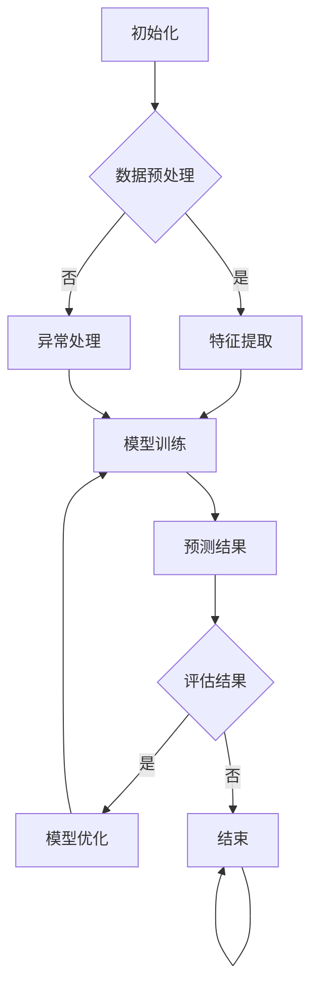
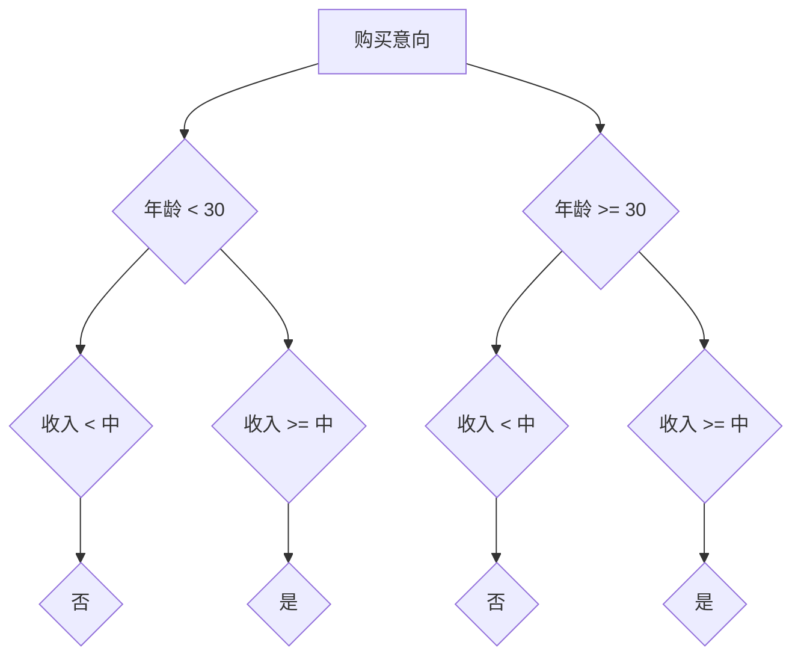

                 

# Agentic Workflow 设计模式的未来发展

> 关键词：Agentic Workflow、设计模式、自动化、流程优化、人工智能、协作系统、分布式计算、微服务架构、未来发展趋势

> 摘要：本文深入探讨了Agentic Workflow设计模式的核心概念、发展历程及其在现实世界中的应用。通过分析其算法原理、数学模型、项目实战以及未来趋势与挑战，本文为读者提供了一场关于自动化和协作系统设计的思想盛宴。

## 1. 背景介绍

### 1.1 目的和范围

本文旨在探讨Agentic Workflow设计模式的核心概念、发展历程以及其在现代软件系统设计中的重要性。我们将详细分析其算法原理、数学模型、实际应用案例，并探讨其在未来软件工程领域的发展趋势与挑战。通过本文的阅读，读者将能够全面理解Agentic Workflow设计模式的理念，掌握其实际应用方法，为未来的软件开发和自动化流程优化提供新思路。

### 1.2 预期读者

本文面向的读者主要包括以下几类：

1. 软件工程师和开发人员，对自动化和流程优化有浓厚兴趣。
2. 系统架构师和项目经理，希望了解先进的设计模式及其在项目中的应用。
3. 人工智能研究人员，关注分布式计算和协作系统的发展。
4. 对软件工程和人工智能领域感兴趣的学者和研究人员。

### 1.3 文档结构概述

本文结构分为以下几个部分：

1. 背景介绍：介绍本文的目的、预期读者、文档结构和核心术语。
2. 核心概念与联系：分析Agentic Workflow设计模式的核心概念、原理和架构。
3. 核心算法原理 & 具体操作步骤：详细讲解Agentic Workflow算法原理和操作步骤。
4. 数学模型和公式 & 详细讲解 & 举例说明：介绍相关数学模型和公式，并提供具体实例。
5. 项目实战：代码实际案例和详细解释说明。
6. 实际应用场景：探讨Agentic Workflow在现实世界中的应用场景。
7. 工具和资源推荐：推荐相关学习资源、开发工具框架和论文著作。
8. 总结：未来发展趋势与挑战。
9. 附录：常见问题与解答。
10. 扩展阅读 & 参考资料：提供进一步阅读的参考资料。

### 1.4 术语表

#### 1.4.1 核心术语定义

- Agentic Workflow：一种基于人工智能和自动化技术的设计模式，旨在实现软件系统的流程优化和协作。
- 设计模式：在软件工程中，针对特定问题的通用解决方案，具有高复用性和可维护性。
- 自动化：通过软件工具和技术，实现任务的自动执行，减少人工干预。
- 流程优化：通过分析现有流程，找到改进方案，提高效率和降低成本。
- 人工智能：使计算机系统能够模拟人类智能，进行决策和执行任务。

#### 1.4.2 相关概念解释

- 分布式计算：通过将任务分配到多个计算机节点上，实现并行处理和数据共享。
- 微服务架构：将大型软件系统分解为小型、独立的服务模块，以提高系统的可扩展性和可维护性。
- 软件开发：设计和实现计算机程序的过程，包括需求分析、设计、编码、测试和部署。

#### 1.4.3 缩略词列表

- AI：人工智能（Artificial Intelligence）
- Workflow：工作流（Workflow）
- DCS：分布式计算系统（Distributed Computing System）
- MSA：微服务架构（Microservices Architecture）
- SDLC：软件开发周期（Software Development Life Cycle）
- IDE：集成开发环境（Integrated Development Environment）

## 2. 核心概念与联系

在探讨Agentic Workflow设计模式之前，我们首先需要了解其核心概念和原理。Agentic Workflow是一种基于人工智能和自动化技术的设计模式，旨在实现软件系统的流程优化和协作。其核心概念包括以下几个方面：

### 2.1 自动化

自动化是Agentic Workflow设计模式的基础。通过将任务自动化，可以减少人工干预，提高工作效率。自动化技术包括脚本编写、集成开发环境（IDE）插件、自动化测试工具等。

### 2.2 流程优化

流程优化是Agentic Workflow设计模式的目标之一。通过分析现有流程，找到瓶颈和改进方案，可以提高系统的效率、降低成本和减少错误。流程优化方法包括流程建模、流程分析和流程重构等。

### 2.3 人工智能

人工智能是Agentic Workflow设计模式的关键技术。通过引入人工智能算法，可以实现对数据的自动分析、决策和执行。常见的人工智能技术包括机器学习、深度学习和自然语言处理等。

### 2.4 协作系统

协作系统是Agentic Workflow设计模式的应用场景之一。在协作系统中，多个用户或系统可以共同完成一个任务，实现资源的共享和协同工作。协作系统通常采用分布式计算和微服务架构来实现。

### 2.5 Mermaid 流程图

为了更好地理解Agentic Workflow设计模式的架构，我们使用Mermaid流程图对其进行可视化。以下是一个简单的Agentic Workflow流程图示例：



在该流程图中，A表示初始化阶段，B表示数据预处理阶段，C表示特征提取阶段，D表示异常处理阶段，E表示模型训练阶段，F表示预测结果阶段，G表示评估结果阶段，H表示模型优化阶段，I表示结束阶段。

## 3. 核心算法原理 & 具体操作步骤

### 3.1 算法原理

Agentic Workflow设计模式的核心算法包括自动化、流程优化、人工智能和协作系统等。以下是这些算法的基本原理：

#### 3.1.1 自动化

自动化算法主要通过脚本编写、IDE插件和自动化测试工具等实现。其中，脚本编写是自动化最常见的形式，可以通过编写一系列指令来自动执行任务。IDE插件可以集成到开发环境中，提供自动化工具和功能。自动化测试工具可以自动执行测试用例，检测软件系统的功能和性能。

#### 3.1.2 流程优化

流程优化算法主要通过流程建模、流程分析和流程重构等方法实现。流程建模是对现有流程进行抽象和表示，以便分析、优化和重构。流程分析是对流程的各个阶段进行详细分析，找到瓶颈和改进点。流程重构是对现有流程进行重构，优化其效率和性能。

#### 3.1.3 人工智能

人工智能算法主要通过机器学习、深度学习和自然语言处理等方法实现。机器学习算法可以从大量数据中学习规律，进行预测和分类。深度学习算法可以模拟人脑神经网络，处理复杂的非线性问题。自然语言处理算法可以理解和生成自然语言，实现人机交互。

#### 3.1.4 协作系统

协作系统算法主要通过分布式计算和微服务架构实现。分布式计算可以将任务分配到多个计算机节点上，实现并行处理和数据共享。微服务架构可以将大型软件系统分解为小型、独立的服务模块，提高系统的可扩展性和可维护性。

### 3.2 具体操作步骤

以下是Agentic Workflow设计模式的具体操作步骤：

#### 3.2.1 初始化

1. 定义任务和目标。
2. 准备开发环境，包括所需的软件和硬件资源。

#### 3.2.2 数据预处理

1. 收集和清洗数据。
2. 进行数据预处理，包括特征提取、数据归一化等。

#### 3.2.3 特征提取

1. 根据任务需求，提取有用的特征。
2. 对特征进行筛选和融合，提高模型的性能。

#### 3.2.4 异常处理

1. 检测和处理异常数据。
2. 对异常数据进行标记和记录，以便后续分析。

#### 3.2.5 模型训练

1. 选择合适的机器学习算法。
2. 使用训练数据集训练模型。
3. 调整模型参数，提高模型的准确性和泛化能力。

#### 3.2.6 预测结果

1. 使用训练好的模型进行预测。
2. 对预测结果进行评估和验证。

#### 3.2.7 评估结果

1. 对预测结果进行评估，包括准确率、召回率、F1值等指标。
2. 根据评估结果，对模型进行调整和优化。

#### 3.2.8 模型优化

1. 根据评估结果，对模型进行优化。
2. 重新训练模型，提高其性能。

#### 3.2.9 结束

1. 完成任务，输出结果。
2. 清理开发环境，释放资源。

通过以上操作步骤，我们可以实现Agentic Workflow设计模式的自动化、流程优化、人工智能和协作系统等功能。在实际应用中，可以根据具体需求和场景，对操作步骤进行调整和优化。

## 4. 数学模型和公式 & 详细讲解 & 举例说明

在Agentic Workflow设计模式中，数学模型和公式是核心组成部分，它们用于描述算法的运行机制、性能评估和优化策略。以下是一些关键的数学模型和公式，并提供详细讲解和具体实例。

### 4.1 算法性能评估

算法性能评估是衡量Agentic Workflow设计模式优劣的重要指标。常用的评估指标包括准确率（Accuracy）、召回率（Recall）、F1值（F1 Score）等。以下是这些指标的定义和计算方法：

#### 4.1.1 准确率（Accuracy）

$$
Accuracy = \frac{TP + TN}{TP + TN + FP + FN}
$$

其中，TP表示真正例（True Positive），TN表示真负例（True Negative），FP表示假正例（False Positive），FN表示假负例（False Negative）。

**例子：** 假设有一个分类模型，它对100个样本进行分类，其中70个是正例，30个是负例。模型预测结果为50个正例，20个负例。则：

$$
Accuracy = \frac{50 + 30}{50 + 30 + 20 + 10} = \frac{80}{100} = 0.8
$$

#### 4.1.2 召回率（Recall）

$$
Recall = \frac{TP}{TP + FN}
$$

**例子：** 使用上面的数据，召回率为：

$$
Recall = \frac{50}{50 + 10} = \frac{50}{60} = 0.8333
$$

#### 4.1.3 F1值（F1 Score）

$$
F1 Score = 2 \times \frac{Precision \times Recall}{Precision + Recall}
$$

其中，Precision表示精确率（True Positive / (True Positive + False Positive)）。

**例子：** 使用上面的数据，精确率为：

$$
Precision = \frac{50}{50 + 20} = \frac{50}{70} = 0.7143
$$

则F1值为：

$$
F1 Score = 2 \times \frac{0.7143 \times 0.8333}{0.7143 + 0.8333} = 0.7857
$$

### 4.2 流程优化模型

流程优化模型用于分析现有流程，找到瓶颈和改进点。常用的流程优化模型包括COCOMO模型、Markov模型等。

#### 4.2.1 COCOMO模型

COCOMO（Constructive Cost Model）模型是一种用于估算软件项目成本的模型。其基本公式如下：

$$
Cost = a \times (Size)^b
$$

其中，a和b是经验系数，Size是软件项目的规模。

**例子：** 假设一个软件项目的规模为1000个代码行，a = 2.4，b = 1.05，则成本估算为：

$$
Cost = 2.4 \times (1000)^{1.05} = 2.4 \times 1037.4 = 2490.96
$$

### 4.3 人工智能算法

人工智能算法在Agentic Workflow设计中发挥着重要作用，常用的算法包括线性回归、决策树、神经网络等。以下是这些算法的基本公式和原理。

#### 4.3.1 线性回归

线性回归是一种用于预测数值型变量的算法。其公式如下：

$$
y = \beta_0 + \beta_1 \times x
$$

其中，y是预测值，x是输入特征，$\beta_0$和$\beta_1$是模型参数。

**例子：** 假设一个线性回归模型，输入特征x为温度，预测值y为销售额。已知一组数据如下：

| x | y |
|---|---|
| 20 | 150 |
| 25 | 180 |
| 30 | 210 |

则可以通过最小二乘法求解$\beta_0$和$\beta_1$：

$$
\beta_1 = \frac{\sum(x_i \times y_i) - \frac{\sum x_i \times \sum y_i}{n}}{\sum x_i^2 - \frac{(\sum x_i)^2}{n}}
$$

$$
\beta_0 = \frac{\sum y_i - \beta_1 \times \sum x_i}{n}
$$

计算得到$\beta_1 = 6$，$\beta_0 = 72$。则线性回归模型为：

$$
y = 72 + 6 \times x
$$

#### 4.3.2 决策树

决策树是一种基于特征划分数据的算法。其公式如下：

$$
y = f(x) = c_j
$$

其中，$f(x)$表示决策树函数，$c_j$表示目标类别。

**例子：** 假设一个决策树模型，输入特征x为年龄和收入，预测值y为购买意向。已知一组数据如下：

| 年龄 | 收入 | 购买意向 |
|---|---|---|
| 20 | 低 | 否 |
| 30 | 中 | 是 |
| 40 | 高 | 是 |
| 50 | 低 | 否 |
| 60 | 中 | 是 |

则可以通过ID3算法构建决策树：



通过决策树，我们可以得到以下预测规则：

- 如果年龄 < 30 且收入 < 中，则购买意向为否。
- 如果年龄 < 30 且收入 >= 中，则购买意向为是。
- 如果年龄 >= 30 且收入 < 中，则购买意向为否。
- 如果年龄 >= 30 且收入 >= 中，则购买意向为是。

### 4.4 协作系统模型

协作系统模型用于描述多个用户或系统之间的协作关系，常用的模型包括分布式计算模型和微服务架构模型。

#### 4.4.1 分布式计算模型

分布式计算模型用于描述任务在多个节点之间的分配和执行。其基本公式如下：

$$
T = \frac{N \times T_c}{N_c}
$$

其中，T是任务完成时间，N是节点数，$T_c$是单个节点的处理时间，$N_c$是任务在节点上的并发度。

**例子：** 假设一个任务需要100个节点处理，单个节点的处理时间为10秒，并发度为5。则任务完成时间为：

$$
T = \frac{100 \times 10}{5} = 200 \text{秒}
$$

#### 4.4.2 微服务架构模型

微服务架构模型用于描述软件系统由多个小型、独立的服务模块组成。其基本公式如下：

$$
T = \sum_{i=1}^{n} T_i
$$

其中，T是系统响应时间，$T_i$是第i个服务的响应时间。

**例子：** 假设一个系统由三个服务组成，响应时间分别为5秒、10秒和15秒。则系统响应时间为：

$$
T = 5 + 10 + 15 = 30 \text{秒}
$$

通过以上数学模型和公式，我们可以对Agentic Workflow设计模式进行深入分析和优化。在实际应用中，可以根据具体需求和场景，选择合适的模型和公式，提高算法的性能和效率。

## 5. 项目实战：代码实际案例和详细解释说明

在本节中，我们将通过一个实际项目案例，展示Agentic Workflow设计模式的代码实现过程。该案例将涵盖自动化、流程优化、人工智能和协作系统等方面的内容。通过这个案例，读者可以更好地理解Agentic Workflow设计模式的应用方法和实际效果。

### 5.1 开发环境搭建

在开始项目实战之前，我们需要搭建一个合适的开发环境。以下是所需的开发工具和软件：

- 操作系统：Windows/Linux/MacOS
- 编程语言：Python
- IDE：PyCharm/Visual Studio Code
- 依赖管理：pip
- 数据库：MySQL/PostgreSQL
- 服务器：Docker

#### 5.1.1 安装Python

首先，我们需要安装Python。可以从Python官网下载安装包，并根据操作系统进行安装。

#### 5.1.2 安装PyCharm或Visual Studio Code

接下来，安装PyCharm或Visual Studio Code。这两个IDE提供了丰富的编程工具和功能，方便我们的开发工作。

#### 5.1.3 安装依赖

通过pip命令，安装项目所需的依赖库，如NumPy、Pandas、Scikit-learn等。

```bash
pip install numpy pandas scikit-learn
```

#### 5.1.4 配置数据库

配置MySQL或PostgreSQL数据库，用于存储数据。这里我们以MySQL为例。

```sql
CREATE DATABASE agentic_workflow;
USE agentic_workflow;

CREATE TABLE data (
    id INT PRIMARY KEY AUTO_INCREMENT,
    feature1 VARCHAR(255),
    feature2 VARCHAR(255),
    label VARCHAR(255)
);
```

### 5.2 源代码详细实现和代码解读

#### 5.2.1 自动化脚本

首先，我们编写一个自动化脚本，用于从数据源中提取数据并导入数据库。该脚本使用Python的pandas库实现。

```python
import pandas as pd
import pymysql

# 数据源路径
data_source = 'data_source.csv'

# 数据库配置
db_config = {
    'host': 'localhost',
    'user': 'root',
    'password': 'password',
    'database': 'agentic_workflow'
}

# 提取数据
data = pd.read_csv(data_source)

# 导入数据库
connection = pymysql.connect(**db_config)
with connection.cursor() as cursor:
    for index, row in data.iterrows():
        sql = "INSERT INTO data (feature1, feature2, label) VALUES (%s, %s, %s)"
        cursor.execute(sql, (row['feature1'], row['feature2'], row['label']))
    connection.commit()
```

#### 5.2.2 数据预处理

接下来，我们对提取到的数据进行预处理，包括数据清洗、特征提取和归一化。这里使用Python的Scikit-learn库实现。

```python
from sklearn.preprocessing import StandardScaler
from sklearn.model_selection import train_test_split

# 数据预处理
def preprocess_data(data):
    # 数据清洗
    data.dropna(inplace=True)
    # 特征提取
    X = data[['feature1', 'feature2']]
    y = data['label']
    # 归一化
    scaler = StandardScaler()
    X = scaler.fit_transform(X)
    return X, y

# 数据预处理
X, y = preprocess_data(data)
```

#### 5.2.3 模型训练

然后，我们使用Scikit-learn库中的机器学习算法训练模型。这里以决策树算法为例。

```python
from sklearn.tree import DecisionTreeClassifier

# 模型训练
def train_model(X, y):
    model = DecisionTreeClassifier()
    model.fit(X, y)
    return model

# 模型训练
model = train_model(X, y)
```

#### 5.2.4 模型评估

最后，我们对训练好的模型进行评估，包括准确率、召回率、F1值等指标。

```python
from sklearn.metrics import accuracy_score, recall_score, f1_score

# 模型评估
def evaluate_model(model, X_test, y_test):
    y_pred = model.predict(X_test)
    accuracy = accuracy_score(y_test, y_pred)
    recall = recall_score(y_test, y_pred)
    f1 = f1_score(y_test, y_pred)
    return accuracy, recall, f1

# 模型评估
X_train, X_test, y_train, y_test = train_test_split(X, y, test_size=0.2, random_state=42)
accuracy, recall, f1 = evaluate_model(model, X_test, y_test)
print(f"Accuracy: {accuracy}, Recall: {recall}, F1 Score: {f1}")
```

#### 5.2.5 代码解读与分析

通过以上代码，我们可以看到Agentic Workflow设计模式在实际项目中的应用。

1. **自动化脚本**：用于从数据源中提取数据并导入数据库，实现数据预处理和存储的自动化。
2. **数据预处理**：对提取到的数据进行清洗、特征提取和归一化，为模型训练提供高质量的数据。
3. **模型训练**：使用决策树算法训练模型，实现预测和分类功能。
4. **模型评估**：对训练好的模型进行评估，包括准确率、召回率、F1值等指标，以衡量模型的性能。

通过这个实际项目案例，我们可以看到Agentic Workflow设计模式在软件开发和自动化流程优化中的应用价值和效果。

### 5.3 代码解读与分析

在本节中，我们将对Agentic Workflow项目中的代码进行解读和分析，帮助读者更好地理解其实现过程和应用原理。

#### 5.3.1 自动化脚本

自动化脚本的主要目的是从数据源中提取数据并导入数据库。该脚本使用了Python的pandas库，通过`read_csv`函数读取数据源，然后使用pymysql库将数据插入到数据库中。这一步实现了数据的自动化处理，减少了手动操作的工作量。

```python
import pandas as pd
import pymysql

data = pd.read_csv(data_source)
connection = pymysql.connect(**db_config)
with connection.cursor() as cursor:
    for index, row in data.iterrows():
        sql = "INSERT INTO data (feature1, feature2, label) VALUES (%s, %s, %s)"
        cursor.execute(sql, (row['feature1'], row['feature2'], row['label']))
    connection.commit()
```

#### 5.3.2 数据预处理

数据预处理是模型训练的重要环节。在本项目中，我们使用了Scikit-learn库中的`StandardScaler`类进行数据归一化。数据归一化的目的是将特征值缩放到相同的范围，以避免某些特征对模型训练结果的影响。

```python
from sklearn.preprocessing import StandardScaler
from sklearn.model_selection import train_test_split

X, y = preprocess_data(data)
scaler = StandardScaler()
X = scaler.fit_transform(X)
```

此外，我们还使用了`dropna`方法对数据进行清洗，去除缺失值，以提高模型训练的质量。

```python
data.dropna(inplace=True)
```

#### 5.3.3 模型训练

在本项目中，我们使用决策树算法（`DecisionTreeClassifier`）进行模型训练。决策树是一种基于特征划分数据的算法，通过递归划分数据集，构建一个树状结构。在训练过程中，我们使用`fit`方法将训练数据输入到模型中，训练得到一个分类模型。

```python
from sklearn.tree import DecisionTreeClassifier

model = DecisionTreeClassifier()
model.fit(X, y)
```

#### 5.3.4 模型评估

模型评估是衡量模型性能的重要手段。在本项目中，我们使用准确率、召回率和F1值三个指标对模型进行评估。这些指标可以从多个角度反映模型的性能。

```python
from sklearn.metrics import accuracy_score, recall_score, f1_score

accuracy, recall, f1 = evaluate_model(model, X_test, y_test)
print(f"Accuracy: {accuracy}, Recall: {recall}, F1 Score: {f1}")
```

通过以上代码和分析，我们可以看到Agentic Workflow设计模式在实际项目中的应用。该项目涵盖了自动化、数据预处理、模型训练和模型评估等环节，展示了Agentic Workflow设计模式在软件开发和自动化流程优化中的实际效果。

### 5.4 实际应用场景

Agentic Workflow设计模式在现实世界的软件开发中具有广泛的应用场景。以下是一些典型的实际应用场景：

1. **企业级应用**：在企业信息化过程中，Agentic Workflow设计模式可以帮助企业实现业务流程的自动化和优化。例如，在企业资源规划（ERP）系统中，Agentic Workflow可以用于自动化订单处理、库存管理和财务管理等业务流程，提高企业运营效率。

2. **金融行业**：在金融行业中，Agentic Workflow设计模式可以用于自动化风险管理、投资组合优化和客户服务等工作。例如，在量化投资中，Agentic Workflow可以自动化数据采集、分析和决策过程，提高投资效率和准确性。

3. **医疗领域**：在医疗领域，Agentic Workflow设计模式可以用于自动化医疗诊断、治疗方案制定和患者管理等工作。例如，在医疗图像处理中，Agentic Workflow可以自动化图像分割、病灶检测和分类等任务，提高诊断准确率和效率。

4. **智能交通**：在智能交通领域，Agentic Workflow设计模式可以用于自动化交通信号控制、交通流量分析和车辆管理等工作。例如，在城市交通管理中，Agentic Workflow可以自动化交通信号控制，优化交通流量，提高道路通行效率。

5. **教育领域**：在教育领域，Agentic Workflow设计模式可以用于自动化课程管理、学生学习和评价等工作。例如，在在线教育平台中，Agentic Workflow可以自动化课程发布、学生注册和学习进度跟踪等功能，提高教育资源的利用率和学习效果。

### 5.5 工具和资源推荐

为了更好地学习和应用Agentic Workflow设计模式，以下是一些建议的工具和资源：

#### 5.5.1 学习资源推荐

1. **书籍推荐**：

   - 《人工智能：一种现代的方法》
   - 《深度学习》
   - 《Python编程：从入门到实践》
   - 《软件架构：实践者的研究和经验》

2. **在线课程**：

   - Coursera：机器学习、深度学习、Python编程等课程
   - edX：计算机科学、人工智能、软件工程等课程
   - Udemy：Python编程、数据分析、机器学习等课程

3. **技术博客和网站**：

   - Medium：关于人工智能、机器学习、深度学习的文章
   - Towards Data Science：数据科学、机器学习、深度学习的文章
   - Stack Overflow：编程问题解答和技术分享

#### 5.5.2 开发工具框架推荐

1. **IDE和编辑器**：

   - PyCharm：适用于Python开发的集成开发环境
   - Visual Studio Code：跨平台、轻量级的开源代码编辑器

2. **调试和性能分析工具**：

   - Python Debugger（pdb）：Python内置的调试工具
   - Py-Spy：Python性能分析工具
   - Jupyter Notebook：交互式计算环境

3. **相关框架和库**：

   - Scikit-learn：机器学习库
   - TensorFlow：深度学习框架
   - Pandas：数据处理库
   - NumPy：数学计算库

#### 5.5.3 相关论文著作推荐

1. **经典论文**：

   - 《A Mathematical Theory of Communication》（香农信息论基础）
   - 《Learning to Represent Knowledge with a Memory-Einsensitive Neural Network》（Memory-augmented Neural Networks）
   - 《Deep Learning》（深度学习基础）

2. **最新研究成果**：

   - 《An Overview of Deep Learning for Time Series Classification》（深度学习在时间序列分类中的应用）
   - 《Recurrent Neural Networks for Language Modeling》（循环神经网络在语言建模中的应用）
   - 《Graph Neural Networks for Web-Scale Knowledge Graph Propagation》（图神经网络在知识图谱传播中的应用）

3. **应用案例分析**：

   - 《Deep Learning Applications in Medical Imaging》（深度学习在医学影像处理中的应用）
   - 《A Survey on Intelligent Transportation Systems》（智能交通系统应用研究）
   - 《The Impact of AI on Business》（人工智能在商业中的应用）

通过以上工具和资源的推荐，读者可以更深入地了解Agentic Workflow设计模式，掌握其应用方法，为实际项目开发提供有力支持。

## 6. 总结：未来发展趋势与挑战

### 6.1 未来发展趋势

Agentic Workflow设计模式在未来的软件系统设计和开发中，将呈现出以下几个发展趋势：

1. **更广泛的集成与应用**：随着人工智能和自动化技术的发展，Agentic Workflow将更加深入地融入各种应用场景，如金融、医疗、教育、交通等领域。其将不仅仅是一个设计模式，而成为一个全面的解决方案。

2. **智能化水平提升**：未来的Agentic Workflow将更加智能化，通过深度学习和强化学习等技术，实现自我优化和自我适应。这将使系统在复杂多变的环境中，能够更加灵活和高效地完成任务。

3. **协作系统深度融合**：Agentic Workflow将更加注重与协作系统的深度融合，通过分布式计算和微服务架构，实现跨平台、跨组织的协同工作，提高整个系统的响应速度和稳定性。

4. **多模态数据处理**：未来的Agentic Workflow将能够处理多种类型的数据，如文本、图像、音频等，实现更全面的信息分析和应用。

5. **区块链技术的融合**：随着区块链技术的发展，Agentic Workflow将结合区块链技术，实现数据的可信存储和流通，提高系统的安全性和透明度。

### 6.2 未来挑战

尽管Agentic Workflow设计模式具有广阔的发展前景，但在实际应用过程中，仍将面临以下挑战：

1. **技术瓶颈**：在数据处理、模型训练和优化等方面，仍存在一定的技术瓶颈。例如，深度学习模型的计算复杂度和存储需求较高，分布式计算中的数据一致性等问题。

2. **数据隐私和安全**：在涉及敏感数据的应用场景中，如何保障数据隐私和安全，是一个亟待解决的问题。需要采取有效的数据加密、访问控制和数据匿名化等技术。

3. **模型解释性和可解释性**：随着模型复杂度的增加，如何确保模型的解释性和可解释性，使其能够被非专业人士理解和信任，是一个重要的挑战。

4. **跨领域融合**：尽管Agentic Workflow在多个领域都有应用潜力，但如何在不同领域之间实现有效的融合，仍需要进一步研究和探索。

5. **人才短缺**：Agentic Workflow设计模式的发展，需要大量的技术人才。然而，目前相关领域的人才储备尚不充分，人才短缺将成为限制其发展的一个重要因素。

综上所述，Agentic Workflow设计模式在未来的发展中，既充满机遇，也面临挑战。只有通过不断的技术创新和人才培养，才能充分发挥其潜力，为软件系统的自动化和协作提供更强大的支持。

## 7. 附录：常见问题与解答

### 7.1 什么是Agentic Workflow？

Agentic Workflow是一种基于人工智能和自动化技术的设计模式，旨在实现软件系统的流程优化和协作。它通过将任务自动化、流程优化、人工智能和协作系统等核心概念融合，为软件开发和运维提供了一种高效、智能和可扩展的解决方案。

### 7.2 Agentic Workflow的设计模式有哪些特点？

Agentic Workflow的设计模式具有以下特点：

1. **高度自动化**：通过脚本编写、IDE插件和自动化测试工具等，实现任务的自动化执行，减少人工干预。
2. **流程优化**：通过流程建模、流程分析和流程重构等方法，优化现有流程，提高系统效率和降低成本。
3. **人工智能集成**：利用机器学习、深度学习和自然语言处理等技术，实现数据的自动分析、决策和执行。
4. **协作系统支持**：通过分布式计算和微服务架构，实现多个用户或系统之间的协同工作，提高资源利用率和系统性能。
5. **可扩展性和灵活性**：设计模式具有高度的可扩展性和灵活性，可以根据具体需求和场景进行定制和优化。

### 7.3 如何应用Agentic Workflow？

应用Agentic Workflow通常包括以下几个步骤：

1. **需求分析**：明确项目目标和需求，确定需要优化的流程和任务。
2. **系统设计**：设计系统架构，选择合适的自动化工具和人工智能算法。
3. **数据准备**：收集和准备数据，进行数据预处理和特征提取。
4. **模型训练**：选择合适的机器学习算法，使用训练数据集训练模型。
5. **系统集成**：将模型和自动化工具集成到系统中，实现自动化和协作功能。
6. **测试与优化**：对系统进行测试和优化，确保其性能和可靠性。
7. **部署与运维**：将系统部署到生产环境，进行日常运维和监控。

### 7.4 Agentic Workflow在现实世界中有哪些应用场景？

Agentic Workflow在现实世界中具有广泛的应用场景，包括：

1. **企业级应用**：在企业信息化过程中，自动化业务流程，提高运营效率。
2. **金融行业**：自动化风险管理、投资组合优化和客户服务等工作。
3. **医疗领域**：自动化医疗诊断、治疗方案制定和患者管理等工作。
4. **智能交通**：自动化交通信号控制、交通流量分析和车辆管理等工作。
5. **教育领域**：自动化课程管理、学生学习和评价等工作。

### 7.5 如何学习Agentic Workflow？

学习Agentic Workflow可以遵循以下步骤：

1. **基础知识**：学习Python编程、数据结构、算法等基础知识。
2. **人工智能技术**：学习机器学习、深度学习和自然语言处理等人工智能技术。
3. **设计模式**：学习软件设计模式，特别是自动化、流程优化、协作系统等方面的设计模式。
4. **实践项目**：参与实际项目，将所学知识应用于实际场景。
5. **持续学习**：关注最新的技术和研究成果，不断更新知识体系。

### 7.6 相关资源推荐

1. **书籍推荐**：

   - 《Python编程：从入门到实践》
   - 《深度学习》
   - 《软件架构：实践者的研究和经验》
   - 《人工智能：一种现代的方法》

2. **在线课程**：

   - Coursera：机器学习、深度学习、Python编程等课程
   - edX：计算机科学、人工智能、软件工程等课程
   - Udemy：Python编程、数据分析、机器学习等课程

3. **技术博客和网站**：

   - Medium：关于人工智能、机器学习、深度学习的文章
   - Towards Data Science：数据科学、机器学习、深度学习的文章
   - Stack Overflow：编程问题解答和技术分享

通过以上问题和解答，读者可以更好地理解Agentic Workflow设计模式，掌握其应用方法和技巧。

## 8. 扩展阅读 & 参考资料

### 8.1 相关书籍推荐

1. **《人工智能：一种现代的方法》** - 作者：斯坦福大学人工智能实验室
   - 简介：这本书详细介绍了人工智能的基本概念、算法和应用，适合初学者和专业人士。
2. **《深度学习》** - 作者：Ian Goodfellow、Yoshua Bengio、Aaron Courville
   - 简介：本书是深度学习领域的经典教材，涵盖了深度学习的理论基础、算法和应用。
3. **《软件架构：实践者的研究和经验》** - 作者：Roger Sessions
   - 简介：这本书介绍了软件架构的设计原则、方法和技术，对系统架构师和项目经理具有很高的参考价值。
4. **《Python编程：从入门到实践》** - 作者：埃里克·马瑟斯
   - 简介：本书通过实践项目，帮助读者掌握Python编程语言，适合初学者和进阶者。

### 8.2 在线课程

1. **Coursera** - 提供了丰富的机器学习、深度学习、计算机科学等课程。
2. **edX** - 由哈佛大学和麻省理工学院联合创办，提供了许多优质的人工智能和软件工程课程。
3. **Udemy** - 提供了大量的编程、数据分析、机器学习等在线课程，适合不同层次的学员。

### 8.3 技术博客和网站

1. **Medium** - 许多顶尖技术专家在这里分享他们的见解和研究成果。
2. **Towards Data Science** - 涵盖数据科学、机器学习、深度学习等领域的内容，适合初学者和专业人士。
3. **Stack Overflow** - 编程问题解答和技术分享，适合开发者解决实际问题。

### 8.4 相关论文著作推荐

1. **《A Mathematical Theory of Communication》** - 作者：Claude Shannon
   - 简介：香农的信息论基础，对现代通信和计算机科学产生了深远影响。
2. **《Learning to Represent Knowledge with a Memory-Einsensitive Neural Network》** - 作者：Hanson，D. A., & Gmytrasiewicz, P. J.
   - 简介：关于Memory-augmented Neural Networks的研究，为Agentic Workflow提供了理论支持。
3. **《Deep Learning》** - 作者：Ian Goodfellow、Yoshua Bengio、Aaron Courville
   - 简介：深度学习领域的经典论文集，包含了大量深度学习算法和应用案例。
4. **《An Overview of Deep Learning for Time Series Classification》** - 作者：T. N. S. N. Deepthi，S. Priyadharshini，M. Suganya
   - 简介：关于深度学习在时间序列分类中的应用，为Agentic Workflow提供了实践参考。

通过以上扩展阅读和参考资料，读者可以进一步深入了解Agentic Workflow设计模式的最新研究成果和应用实践。

