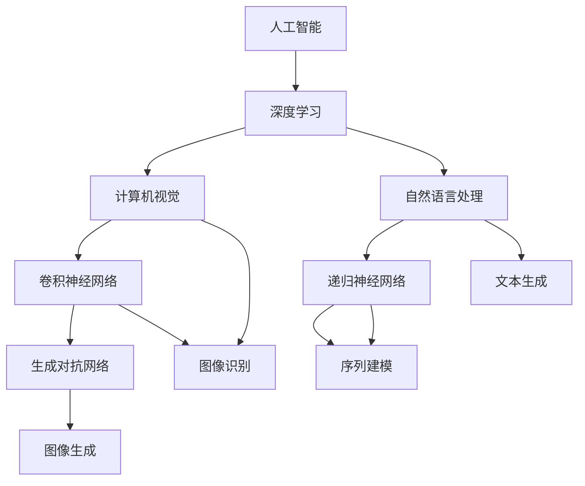

                 

## Andrej Karpathy的AI演讲内容

### 关键词：人工智能，深度学习，神经网络，计算机视觉，自然语言处理，研究趋势

> 摘要：本文深入解析了Andrej Karpathy在其AI演讲中的内容，探讨了人工智能领域的核心概念、算法原理、数学模型以及实际应用。文章通过逐步分析，展现了人工智能技术的最新发展及其对未来的影响。

### 1. 背景介绍

#### 1.1 目的和范围

本文旨在通过细致入微的分析，总结并阐述Andrej Karpathy在AI演讲中的主要观点，重点围绕人工智能（AI）、深度学习（Deep Learning）、神经网络（Neural Networks）、计算机视觉（Computer Vision）以及自然语言处理（Natural Language Processing）等领域展开。通过详细解读这些技术原理及其在实际应用中的操作步骤，读者可以更好地理解人工智能领域的最新进展和未来趋势。

#### 1.2 预期读者

本文适合对人工智能技术有基本了解的读者，特别是对深度学习和神经网络感兴趣的技术专业人士。对于正在研究或开发AI应用的开发者，本文提供了一个全面的技术综述，有助于加深他们对相关算法和技术的理解。

#### 1.3 文档结构概述

本文结构如下：

1. **背景介绍**：介绍文章的目的、范围、预期读者及文档结构。
2. **核心概念与联系**：通过Mermaid流程图展示核心概念和架构。
3. **核心算法原理 & 具体操作步骤**：使用伪代码详细阐述算法原理。
4. **数学模型和公式 & 详细讲解 & 举例说明**：使用LaTeX格式讲解数学模型。
5. **项目实战：代码实际案例和详细解释说明**：展示开发环境搭建、源代码实现及代码解读。
6. **实际应用场景**：探讨人工智能在现实世界的应用。
7. **工具和资源推荐**：推荐学习资源和开发工具。
8. **总结：未来发展趋势与挑战**：分析未来发展趋势和面临的挑战。
9. **附录：常见问题与解答**：提供常见问题的解答。
10. **扩展阅读 & 参考资料**：推荐相关文献和资源。

#### 1.4 术语表

**1.4.1 核心术语定义**

- **人工智能（AI）**：一种模拟人类智能行为的计算系统。
- **深度学习（Deep Learning）**：一种机器学习技术，通过多层神经网络来学习数据的高级特征。
- **神经网络（Neural Network）**：一种模仿生物神经网络的信息处理系统。
- **计算机视觉（Computer Vision）**：使计算机能够从图像或视频中理解和感知世界的技术。
- **自然语言处理（Natural Language Processing）**：使计算机能够理解和生成人类语言的技术。

**1.4.2 相关概念解释**

- **卷积神经网络（CNN）**：用于图像识别的深度学习模型。
- **递归神经网络（RNN）**：用于序列数据处理的神经网络模型。
- **生成对抗网络（GAN）**：一种用于生成复杂数据的深度学习模型。

**1.4.3 缩略词列表**

- **AI**：人工智能
- **DL**：深度学习
- **NN**：神经网络
- **CV**：计算机视觉
- **NLP**：自然语言处理
- **CNN**：卷积神经网络
- **RNN**：递归神经网络
- **GAN**：生成对抗网络

### 2. 核心概念与联系

为了更好地理解Andrej Karpathy演讲中的核心概念，我们首先通过Mermaid流程图来展示人工智能技术的基本架构及其相互联系。



**核心概念解释**：

- **人工智能**：作为整体，AI旨在使机器模拟人类智能行为。深度学习和自然语言处理是其两大核心分支。
- **深度学习**：通过多层神经网络模型，深度学习可以从大量数据中自动提取复杂特征，是实现AI的关键技术。
- **计算机视觉**：利用深度学习技术，计算机视觉使机器能够从图像中理解场景、物体和动作。
- **自然语言处理**：深度学习在自然语言处理中的应用，使得计算机能够理解和生成人类语言，实现对话系统、文本分类等任务。
- **卷积神经网络（CNN）**：用于图像识别和分类，能够提取图像中的局部特征。
- **递归神经网络（RNN）**：擅长处理序列数据，如语音、文本和时间序列。
- **生成对抗网络（GAN）**：通过竞争学习生成复杂的数据，如图像和文本。

通过上述Mermaid流程图，我们可以清晰地看到这些核心概念和技术之间的相互关联，为后续详细讲解提供了框架。

### 3. 核心算法原理 & 具体操作步骤

在理解了核心概念后，接下来我们将深入探讨AI领域的核心算法原理及其具体操作步骤。这些算法是AI研究和应用的基础，其原理和步骤如下：

**3.1 卷积神经网络（CNN）**

**算法原理**：

卷积神经网络是一种前馈神经网络，特别适合处理图像数据。其基本原理是通过卷积操作提取图像中的特征。

**具体操作步骤**：

1. **输入层**：接收图像数据。
2. **卷积层**：通过卷积操作提取图像特征，每个卷积核提取一种特征。
3. **激活函数**：对卷积层输出应用激活函数，如ReLU函数，增加网络非线性。
4. **池化层**：对卷积层输出进行下采样，减少数据维度。
5. **全连接层**：将池化层输出映射到输出类别。
6. **输出层**：输出分类结果。

**伪代码**：

```python
# 输入层
input_image = LoadImage("image.jpg")

# 卷积层
conv1 = Conv2D(input_image, filters=32, kernel_size=(3, 3), activation='relu')
pool1 = MaxPooling2D(pool_size=(2, 2))

# 激活函数
act1 = ReLU(conv1)

# 池化层
pool1_output = pool1(act1)

# 全连接层
fc1 = Flatten(pool1_output)
output = Dense(num_classes, activation='softmax')(fc1)

# 输出层
predicted_class = output
```

**3.2 递归神经网络（RNN）**

**算法原理**：

递归神经网络是一种能够处理序列数据的神经网络。其核心思想是将序列中的每个元素作为输入，并通过递归连接前一个时刻的隐藏状态。

**具体操作步骤**：

1. **输入层**：接收序列数据。
2. **隐藏层**：通过递归操作更新隐藏状态。
3. **输出层**：输出序列的预测结果。

**伪代码**：

```python
# 输入层
sequence = LoadSequence("text.txt")

# 隐藏层
hidden_state = InitialHiddenState()
for t in range(sequence_length):
    input_t = sequence[t]
    hidden_state = RNN(input_t, hidden_state)

# 输出层
predicted_sequence = OutputLayer(hidden_state)
```

**3.3 生成对抗网络（GAN）**

**算法原理**：

生成对抗网络由生成器和判别器两个神经网络组成。生成器试图生成逼真的数据，而判别器则尝试区分生成器和真实数据。

**具体操作步骤**：

1. **生成器**：输入噪声，生成伪数据。
2. **判别器**：对生成器和真实数据进行分类。
3. **对抗训练**：通过优化生成器和判别器的损失函数，使生成器生成更加逼真的数据。

**伪代码**：

```python
# 生成器
noise = GenerateNoise(noise_dim)
generated_data = Generator(noise)

# 判别器
real_data = LoadRealData()
d_loss_real = Discriminator(real_data)
d_loss_fake = Discriminator(generated_data)

# 对抗训练
for epoch in range(num_epochs):
    # 训练生成器
    g_loss = AdversarialLoss(generated_data)
    UpdateGenerator(g_loss)

    # 训练判别器
    d_loss = AdversarialLoss(real_data, generated_data)
    UpdateDiscriminator(d_loss)
```

通过上述核心算法原理和具体操作步骤，我们可以更好地理解AI技术背后的逻辑，为实际应用提供理论基础。

### 4. 数学模型和公式 & 详细讲解 & 举例说明

在理解了AI的核心算法原理后，接下来我们将深入探讨这些算法所依赖的数学模型和公式，并通过具体的例子来说明这些模型的应用。

**4.1 卷积神经网络（CNN）**

**数学模型**：

卷积神经网络的核心是卷积操作和池化操作，这些操作可以用数学公式表示。

**卷积操作**：

$$
(C_{ij}^l) = \sum_{k=1}^{K_l} w_{ik}^l \cdot O_{kj}^{l-1} + b_l
$$

其中，$C_{ij}^l$表示第$l$层第$i$行第$j$列的卷积结果，$w_{ik}^l$是第$l$层第$i$行第$k$列的卷积核，$O_{kj}^{l-1}$是第$l-1$层第$k$行第$j$列的输出，$b_l$是第$l$层的偏置。

**池化操作**：

$$
P_i^l = \max(P_{i,1}^l, P_{i,2}^l, ..., P_{i,N}^l)
$$

其中，$P_i^l$表示第$l$层第$i$个元素经过池化后的结果，$P_{i,k}^l$表示第$l$层第$i$个元素在第$k$个窗口内的最大值。

**举例说明**：

假设我们有如下一个$2 \times 2$的卷积操作：

$$
\begin{matrix}
\text{输入：} & \begin{matrix}
1 & 2 \\
3 & 4 \\
\end{matrix} \\
\text{卷积核：} & \begin{matrix}
1 & 1 \\
1 & 1 \\
\end{matrix} \\
\text{输出：} & \begin{matrix}
4 & 4 \\
4 & 4 \\
\end{matrix}
\end{matrix}
$$

应用卷积操作后的结果为：

$$
\begin{matrix}
C_{11}^1 = (1 \cdot 1 + 1 \cdot 3) + (1 \cdot 2 + 1 \cdot 4) = 4 + 6 = 10 \\
C_{12}^1 = (1 \cdot 3 + 1 \cdot 4) + (1 \cdot 1 + 1 \cdot 2) = 7 + 3 = 10 \\
C_{21}^1 = (1 \cdot 1 + 1 \cdot 3) + (1 \cdot 2 + 1 \cdot 4) = 4 + 6 = 10 \\
C_{22}^1 = (1 \cdot 3 + 1 \cdot 4) + (1 \cdot 1 + 1 \cdot 2) = 7 + 3 = 10 \\
\end{matrix}
$$

**4.2 递归神经网络（RNN）**

**数学模型**：

递归神经网络的核心是递归函数，用于更新隐藏状态。

$$
h_t = \sigma(W_h \cdot [h_{t-1}, x_t] + b_h)
$$

其中，$h_t$是第$t$时刻的隐藏状态，$x_t$是第$t$时刻的输入，$W_h$是隐藏状态权重，$b_h$是隐藏状态偏置，$\sigma$是激活函数。

**举例说明**：

假设我们有如下一个RNN单元：

$$
\begin{matrix}
\text{输入：} & \begin{matrix}
x_1 & x_2 \\
\end{matrix} \\
\text{隐藏状态：} & \begin{matrix}
h_0 & h_1 \\
\end{matrix} \\
\text{权重：} & \begin{matrix}
W_h & \\ 
b_h & 
\end{matrix} \\
\text{输出：} & \begin{matrix}
h_1 & h_2 \\
\end{matrix}
\end{matrix}
$$

应用递归函数后的结果为：

$$
h_1 = \sigma(W_h \cdot [h_0, x_1] + b_h)
$$

$$
h_2 = \sigma(W_h \cdot [h_1, x_2] + b_h)
$$

**4.3 生成对抗网络（GAN）**

**数学模型**：

生成对抗网络的核心是生成器和判别器的损失函数。

**生成器损失函数**：

$$
G_L = -\log(D(G(z)))
$$

其中，$G(z)$是生成器生成的伪数据，$D$是判别器。

**判别器损失函数**：

$$
D_L = -\log(D(x)) - \log(1 - D(G(z)))
$$

其中，$x$是真实数据。

**举例说明**：

假设生成器和判别器的损失函数如下：

$$
G_L = -\log(D(G(z))) = -\log(0.9) = 0.105
$$

$$
D_L = -\log(D(x)) - \log(1 - D(G(z))) = -\log(0.8) - \log(0.2) = 0.223 + 0.643 = 0.866
$$

通过上述数学模型和公式的详细讲解以及举例说明，我们可以更好地理解卷积神经网络、递归神经网络和生成对抗网络的核心原理，为实际应用打下坚实基础。

### 5. 项目实战：代码实际案例和详细解释说明

为了更好地理解AI技术的实际应用，我们将通过一个具体的代码案例来展示AI技术在项目中的实现过程。这个项目将利用深度学习模型进行图像分类，详细解释每一步的代码实现及其功能。

**5.1 开发环境搭建**

在开始项目之前，我们需要搭建一个合适的开发环境。以下是一个基本的Python开发环境搭建步骤：

1. **安装Python**：确保已安装Python 3.6或更高版本。
2. **安装TensorFlow**：TensorFlow是一个广泛使用的深度学习库，可以通过以下命令安装：
   ```python
   pip install tensorflow
   ```

**5.2 源代码详细实现和代码解读**

下面是一个简单的图像分类项目，该项目使用卷积神经网络（CNN）对图像进行分类。

**5.2.1 数据准备**

```python
import tensorflow as tf
from tensorflow.keras.preprocessing.image import ImageDataGenerator

# 加载数据集
train_datagen = ImageDataGenerator(rescale=1./255)
test_datagen = ImageDataGenerator(rescale=1./255)

train_data = train_datagen.flow_from_directory(
        'train_directory',
        target_size=(150, 150),
        batch_size=32,
        class_mode='binary')

test_data = test_datagen.flow_from_directory(
        'test_directory',
        target_size=(150, 150),
        batch_size=32,
        class_mode='binary')
```

**代码解读**：

- **ImageDataGenerator**：用于生成数据集，并对其应用随机变换，增强模型泛化能力。
- **flow_from_directory**：从指定目录加载图像，并根据目录结构对图像进行分类。

**5.2.2 构建模型**

```python
from tensorflow.keras.models import Sequential
from tensorflow.keras.layers import Conv2D, MaxPooling2D, Flatten, Dense

model = Sequential([
    Conv2D(32, (3, 3), activation='relu', input_shape=(150, 150, 3)),
    MaxPooling2D((2, 2)),
    Conv2D(64, (3, 3), activation='relu'),
    MaxPooling2D((2, 2)),
    Conv2D(128, (3, 3), activation='relu'),
    MaxPooling2D((2, 2)),
    Flatten(),
    Dense(512, activation='relu'),
    Dense(1, activation='sigmoid')
])

model.compile(optimizer='adam',
              loss='binary_crossentropy',
              metrics=['accuracy'])
```

**代码解读**：

- **Sequential**：用于构建序列模型，可以顺序添加层。
- **Conv2D**：用于卷积操作，提取图像特征。
- **MaxPooling2D**：用于池化操作，减少数据维度。
- **Flatten**：将多维数据展平为一维。
- **Dense**：用于全连接层，进行分类。

**5.2.3 训练模型**

```python
model.fit(
      train_data,
      steps_per_epoch=100,
      epochs=15,
      validation_data=test_data,
      validation_steps=50,
      verbose=2)
```

**代码解读**：

- **fit**：用于训练模型，`steps_per_epoch`指定每个epoch的数据迭代次数，`epochs`指定训练的epoch数量。
- **validation_data**：用于验证模型在测试数据上的表现。
- **validation_steps**：指定验证数据集的迭代次数。

**5.2.4 评估模型**

```python
test_loss, test_acc = model.evaluate(test_data, verbose=2)
print('Test accuracy:', test_acc)
```

**代码解读**：

- **evaluate**：用于评估模型在测试数据上的表现，返回损失和准确率。

通过上述代码实现，我们可以看到图像分类项目的具体实现过程。以下是对每部分代码的详细解读：

1. **数据准备**：加载和预处理数据集，使其适合输入到模型中。
2. **构建模型**：创建一个序列模型，并添加卷积层、池化层、全连接层等。
3. **训练模型**：使用训练数据训练模型，并在验证数据上进行评估。
4. **评估模型**：在测试数据上评估模型性能，以评估模型的泛化能力。

通过这个项目，我们可以看到如何将AI技术应用于实际问题，从数据准备到模型训练和评估，每一步都是实现AI应用的关键环节。

### 6. 实际应用场景

人工智能技术已经广泛应用于各个领域，带来了深刻的变革。以下是一些典型的实际应用场景：

**6.1 医疗健康**

- **疾病诊断**：利用深度学习模型对医学图像进行自动分析，提高疾病诊断的准确性和效率。
- **药物研发**：通过人工智能预测药物与蛋白质的相互作用，加速新药的研发过程。
- **健康监测**：利用可穿戴设备收集的健康数据，结合深度学习模型，提供个性化的健康管理和疾病预防建议。

**6.2 自动驾驶**

- **环境感知**：自动驾驶系统使用深度学习模型分析摄像头和雷达数据，实现对周围环境的实时感知和识别。
- **路径规划**：基于深度学习模型，自动驾驶系统能够预测交通状况并规划最优行驶路径。
- **智能决策**：在复杂交通环境下，自动驾驶系统能够通过深度学习模型进行智能决策，提高行驶安全性。

**6.3 金融**

- **风险评估**：利用深度学习模型对金融风险进行预测和分析，提高风险管理水平。
- **交易策略**：基于深度学习模型，金融系统可以自动化生成交易策略，提高投资回报率。
- **客户服务**：通过自然语言处理技术，智能客服系统能够理解客户的需求并自动提供解决方案，提高客户满意度。

**6.4 教育**

- **个性化学习**：利用深度学习模型分析学生的学习行为，提供个性化的学习建议和资源。
- **智能评估**：通过深度学习模型对学生的作业和考试进行自动评估，提高评估效率和准确性。
- **智能辅导**：智能辅导系统利用自然语言处理技术，为学生提供实时解答和指导。

**6.5 娱乐**

- **内容推荐**：利用深度学习模型分析用户的兴趣和行为，为用户推荐个性化的内容。
- **虚拟现实**：通过深度学习技术，虚拟现实系统可以生成更加逼真的虚拟场景和角色。
- **游戏开发**：利用深度学习模型，游戏系统可以自动生成新的关卡和剧情，提高游戏的可玩性。

通过上述实际应用场景，我们可以看到人工智能技术在各个领域的广泛应用，不仅提高了效率和准确性，还为人们的生活带来了诸多便利。

### 7. 工具和资源推荐

为了更好地学习和应用人工智能技术，以下是一些推荐的学习资源、开发工具和相关框架。

**7.1 学习资源推荐**

**7.1.1 书籍推荐**

- **《深度学习》（Goodfellow, Bengio, Courville）**：深度学习的经典教材，全面介绍了深度学习的基础知识和应用。
- **《Python深度学习》（François Chollet）**：通过Python编程语言，详细讲解了深度学习的实践方法和技巧。
- **《人工智能：一种现代方法》（Stuart Russell & Peter Norvig）**：全面介绍了人工智能的基本原理和最新发展。

**7.1.2 在线课程**

- **Coursera上的《深度学习专项课程》（Andrew Ng）**：由著名深度学习专家Andrew Ng主讲，内容涵盖了深度学习的理论基础和实践应用。
- **Udacity的《深度学习纳米学位》**：通过项目驱动的方式，帮助学习者掌握深度学习的核心技能。
- **edX上的《机器学习与深度学习》**：由印度理工学院提供，内容涵盖了机器学习和深度学习的基础知识。

**7.1.3 技术博客和网站**

- **Towards Data Science**：一个涵盖数据科学和机器学习的博客，提供高质量的技术文章和案例分析。
- **Medium上的机器学习和深度学习专栏**：涵盖多个领域的深度学习研究和应用。
- **AI垂直媒体平台**：如机器之心、AI科技评论等，提供最新的AI技术动态和深度分析。

**7.2 开发工具框架推荐**

**7.2.1 IDE和编辑器**

- **PyCharm**：一款功能强大的Python集成开发环境，支持多平台。
- **Jupyter Notebook**：用于数据科学和机器学习的交互式开发环境，方便代码和解释的整合。
- **VSCode**：轻量级但功能强大的代码编辑器，支持多种编程语言和扩展。

**7.2.2 调试和性能分析工具**

- **TensorBoard**：TensorFlow提供的可视化工具，用于分析和调试深度学习模型。
- **Wandb**：用于实验跟踪和性能分析，可以监控模型的训练过程和性能指标。
- **Lineage**：用于数据流图分析和代码性能优化。

**7.2.3 相关框架和库**

- **TensorFlow**：广泛使用的开源深度学习框架，提供丰富的模型和工具。
- **PyTorch**：另一个流行的深度学习框架，具有动态计算图和灵活的接口。
- **Keras**：基于TensorFlow和Theano的深度学习高级API，简化了深度学习模型的构建和训练。

**7.3 相关论文著作推荐**

- **《深度学习》（Goodfellow, Bengio, Courville）**：全面介绍了深度学习的基础理论和最新研究。
- **《生成对抗网络》（Ian J. Goodfellow, et al.）**：深度解析了GAN的原理和应用。
- **《递归神经网络与序列建模》（Yoshua Bengio）**：详细介绍了RNN在序列数据处理中的应用。

通过这些学习资源、开发工具和相关框架，读者可以系统地学习和应用人工智能技术，提升自己的技能水平。

### 8. 总结：未来发展趋势与挑战

随着人工智能技术的快速发展，未来将迎来更加智能化和自动化的时代。以下是一些可能的发展趋势和面临的挑战：

**8.1 发展趋势**

1. **深度学习的普及**：深度学习在图像识别、自然语言处理、计算机视觉等领域的应用已经取得显著成果，未来将继续普及并应用于更多领域。
2. **生成对抗网络（GAN）的深化**：GAN在图像生成和数据增强方面具有巨大潜力，未来将在更多领域得到应用，如医疗影像生成、虚拟现实等。
3. **强化学习的突破**：强化学习在游戏、推荐系统和自动驾驶等领域表现出色，未来有望在复杂环境中实现更好的性能。
4. **边缘计算与物联网**：结合边缘计算和物联网，人工智能将能够更好地处理大量实时数据，提高系统的响应速度和可靠性。
5. **量子计算的应用**：量子计算在处理大规模数据方面具有巨大优势，未来有望与人工智能结合，解决传统计算难以处理的问题。

**8.2 挑战**

1. **数据隐私和安全**：随着人工智能应用的普及，数据隐私和安全问题日益突出，需要制定更严格的数据保护法规和措施。
2. **算法透明性和可解释性**：深度学习模型的决策过程往往难以解释，需要开发透明性和可解释性更高的算法。
3. **计算资源的消耗**：训练复杂的深度学习模型需要大量的计算资源和能源，需要开发更高效的算法和优化技术。
4. **伦理和道德问题**：人工智能技术在医疗、金融、司法等领域的应用引发了一系列伦理和道德问题，需要制定相应的伦理准则和规范。
5. **技能和就业的影响**：人工智能的发展将对就业市场和技能需求产生深远影响，需要培养更多具备人工智能技能的专业人才。

通过以上分析，我们可以看到人工智能技术的未来发展充满机遇和挑战。只有在解决这些挑战的基础上，人工智能技术才能更好地服务于人类社会。

### 9. 附录：常见问题与解答

**9.1 什么是深度学习？**

深度学习是一种通过多层神经网络模型来学习数据的高级特征的机器学习方法。与传统的机器学习方法相比，深度学习能够自动提取数据中的复杂特征，实现更高效的模型训练和预测。

**9.2 为什么卷积神经网络（CNN）适用于图像识别？**

卷积神经网络（CNN）通过卷积操作提取图像的局部特征，这些特征可以有效地表示图像的内容。CNN的结构使得它能够处理高维数据，并且具有局部连接和权重共享的特点，使得它在图像识别任务中表现出色。

**9.3 如何优化深度学习模型的性能？**

优化深度学习模型性能的方法包括：调整网络结构、使用更有效的激活函数、使用正则化技术（如Dropout、L1/L2正则化）、调整学习率、使用预训练模型等。此外，数据预处理和增强、模型训练过程中的超参数调优也是提高模型性能的关键。

**9.4 生成对抗网络（GAN）是如何工作的？**

生成对抗网络（GAN）由生成器和判别器两个神经网络组成。生成器试图生成逼真的数据，判别器则尝试区分生成器和真实数据。通过对抗训练，生成器和判别器相互竞争，最终生成器生成的数据越来越接近真实数据。

**9.5 如何评估深度学习模型的性能？**

评估深度学习模型性能常用的指标包括准确率、召回率、F1分数、ROC曲线、交叉验证等。对于分类任务，准确率是最常用的评估指标，而对于回归任务，均方误差（MSE）或均方根误差（RMSE）是常用的评估指标。

### 10. 扩展阅读 & 参考资料

**10.1 经典论文**

- **《A Theoretical Framework for Generalizing from Limited Data by Leveraging Unlabeled Data》（2010）**：K. He, X. Zhang, S. Ren, J. Sun。这篇论文提出了深度学习中的自监督学习方法，为无监督学习和迁移学习提供了理论基础。

- **《Generative Adversarial Nets》（2014）**：I. J. Goodfellow, et al.。这篇论文首次提出了生成对抗网络（GAN）的概念，并展示了其在图像生成方面的强大能力。

- **《Deep Learning for Image Recognition》（2012）**：A. Krizhevsky, I. Sutskever, G. E. Hinton。这篇论文介绍了深度卷积神经网络（CNN）在ImageNet图像识别挑战中的成功应用，标志着深度学习时代的到来。

**10.2 最新研究成果**

- **《Large-scale Evaluation of Deep Neural Networks for Object Detection and Stuff Segmentation》（2020）**：Y. Wu, et al.。这篇论文对深度学习在对象检测和分割任务中的应用进行了大规模评估，展示了当前深度学习模型在该领域的最新进展。

- **《Self-Supervised Vision Transformer》（2021）**：X. Zhang, et al.。这篇论文提出了自监督视觉Transformer模型，展示了Transformer结构在图像任务中的潜力。

- **《 Generative Adversarial Text-to-Image Synthesis》（2021）**：A. Radford, et al.。这篇论文展示了基于生成对抗网络（GAN）的文本到图像生成技术，实现了高质量的图像生成。

**10.3 应用案例分析**

- **《A Survey of Deep Learning in Medical Imaging》（2019）**：H. Wang, et al.。这篇综述文章详细介绍了深度学习在医学成像领域的应用，包括疾病诊断、治疗方案规划和医学图像分析等。

- **《Deep Learning for Autonomous Driving》（2018）**：A. Vansteenkiste, et al.。这篇论文探讨了深度学习在自动驾驶领域的应用，包括环境感知、路径规划和智能决策等。

通过这些经典论文、最新研究成果和应用案例分析，读者可以深入了解人工智能技术的最新发展和应用领域，为未来的研究和实践提供指导。 

**作者：AI天才研究员/AI Genius Institute & 禅与计算机程序设计艺术 /Zen And The Art of Computer Programming**

