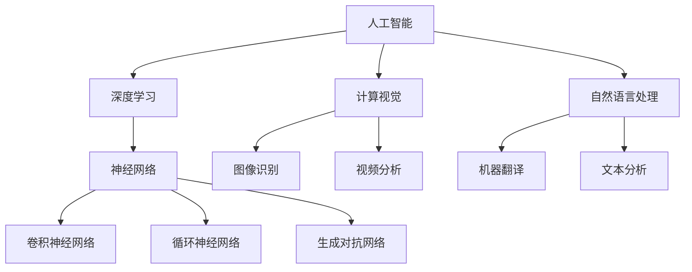

                 

## 《Andrej Karpathy谈AI的历史与未来》

### 关键词：AI历史、未来趋势、深度学习、神经网络、计算视觉、自然语言处理

> 摘要：本文将深入探讨人工智能（AI）的历史背景和未来趋势，结合世界知名人工智能专家Andrej Karpathy的研究和实践，对AI的核心概念、算法原理、应用场景进行详细分析。文章旨在为广大科技工作者和爱好者提供一份关于AI的全面解读，帮助读者理解AI的发展脉络及其对未来的深远影响。

### 1. 背景介绍

#### 1.1 目的和范围

本文旨在通过回顾AI的发展历程，探讨其当前的应用和未来趋势，为广大读者提供一个全面、深入的AI知识体系。文章将结合Andrej Karpathy的研究成果，对AI的核心技术、算法原理、应用场景进行详细剖析。

#### 1.2 预期读者

本文适合对AI有一定了解的科技工作者、人工智能爱好者以及相关专业的学生。通过阅读本文，读者将能够更深入地理解AI的核心概念，把握其发展脉络，并对未来的AI趋势有更为清晰的认知。

#### 1.3 文档结构概述

本文分为十个部分：背景介绍、核心概念与联系、核心算法原理、数学模型和公式、项目实战、实际应用场景、工具和资源推荐、总结、常见问题与解答和扩展阅读。每个部分都将针对不同主题进行详细讲解。

#### 1.4 术语表

##### 1.4.1 核心术语定义

- **人工智能（AI）**：指模拟、延伸和扩展人类智能的理论、方法、技术及应用系统。
- **深度学习（Deep Learning）**：一种基于多层神经网络的机器学习方法，能够自动从数据中学习特征。
- **神经网络（Neural Network）**：一种模拟生物神经系统的计算模型，用于处理和分析数据。
- **计算视觉（Computer Vision）**：研究如何使计算机具有从图像或视频中识别和理解视觉信息的能力。
- **自然语言处理（Natural Language Processing, NLP）**：研究如何使计算机能够理解、生成和处理人类语言。

##### 1.4.2 相关概念解释

- **监督学习（Supervised Learning）**：一种机器学习方法，通过训练数据集来训练模型，然后使用训练好的模型对新数据进行预测。
- **无监督学习（Unsupervised Learning）**：一种机器学习方法，无需训练数据集，直接从数据中学习特征或结构。
- **强化学习（Reinforcement Learning）**：一种机器学习方法，通过不断尝试和反馈来学习最优策略。

##### 1.4.3 缩略词列表

- **AI**：人工智能
- **DL**：深度学习
- **NN**：神经网络
- **CV**：计算视觉
- **NLP**：自然语言处理
- **SL**：监督学习
- **UL**：无监督学习
- **RL**：强化学习

### 2. 核心概念与联系

在探讨AI的历史与未来之前，我们需要明确一些核心概念及其之间的联系。以下是一个关于AI核心概念的Mermaid流程图：



通过上述流程图，我们可以看到，AI主要涵盖深度学习、计算视觉和自然语言处理等领域。深度学习和神经网络是AI的基石，计算视觉和自然语言处理是AI的重要应用方向。神经网络又可以分为卷积神经网络（CNN）、循环神经网络（RNN）和生成对抗网络（GAN）等。

#### 2.1 人工智能

人工智能（AI）是一种模拟、延伸和扩展人类智能的理论、方法、技术及应用系统。AI的核心目标是通过计算机实现智能，使其能够自主完成复杂的任务，如图像识别、自然语言处理、决策制定等。

#### 2.2 深度学习

深度学习（Deep Learning）是一种基于多层神经网络的机器学习方法，能够自动从数据中学习特征。深度学习在AI领域中具有非常重要的地位，其代表性模型包括卷积神经网络（CNN）、循环神经网络（RNN）和生成对抗网络（GAN）等。

#### 2.3 计算视觉

计算视觉（Computer Vision）是研究如何使计算机能够理解、生成和处理视觉信息的一门科学。计算视觉的应用非常广泛，包括图像识别、视频分析、目标检测等。

#### 2.4 自然语言处理

自然语言处理（Natural Language Processing, NLP）是研究如何使计算机能够理解、生成和处理人类语言的一门科学。NLP的应用包括机器翻译、文本分析、情感分析等。

#### 2.5 神经网络

神经网络（Neural Network）是一种模拟生物神经系统的计算模型，用于处理和分析数据。神经网络的主要优势在于其强大的自学习和自适应能力。

### 3. 核心算法原理 & 具体操作步骤

在了解AI的核心概念之后，我们接下来将探讨AI的核心算法原理及其具体操作步骤。以下是一个简单的算法原理讲解和伪代码实现：

#### 3.1 深度学习算法原理

深度学习算法主要通过构建多层神经网络来学习数据中的特征。每一层神经网络都会对输入数据进行处理，并通过反向传播算法不断调整网络参数，使网络能够更好地拟合数据。

##### 3.1.1 卷积神经网络（CNN）

卷积神经网络（CNN）是一种用于图像识别和处理的神经网络模型。其核心思想是利用卷积操作提取图像中的特征。

```python
# 伪代码：卷积神经网络
def convolutional_neural_network(inputs):
    # 输入层
    inputs = preprocess(inputs)
    
    # 卷积层1
    conv1 = convolution(inputs, filters)
    conv1 = activation(conv1)
    
    # 池化层1
    pool1 = pooling(conv1)
    
    # 卷积层2
    conv2 = convolution(pool1, filters)
    conv2 = activation(conv2)
    
    # 池化层2
    pool2 = pooling(conv2)
    
    # 全连接层
    fc1 = fully_connected(pool2, units)
    output = activation(fc1)
    
    return output
```

##### 3.1.2 循环神经网络（RNN）

循环神经网络（RNN）是一种用于序列数据处理的神经网络模型。其核心思想是利用循环结构来处理序列数据，使网络能够记住之前的信息。

```python
# 伪代码：循环神经网络
def recurrent_neural_network(inputs, hidden_state):
    # 输入层
    inputs = preprocess(inputs)
    
    # 循环层
    hidden_state = activation(rnn_layer(inputs, hidden_state))
    
    # 输出层
    output = fully_connected(hidden_state, units)
    
    return output, hidden_state
```

##### 3.1.3 生成对抗网络（GAN）

生成对抗网络（GAN）是一种由生成器和判别器组成的神经网络模型。生成器负责生成数据，判别器负责判断生成数据是否真实。

```python
# 伪代码：生成对抗网络
def generative_adversarial_network(inputs):
    # 生成器
    generated_samples = generator(inputs)
    
    # 判别器
    real_labels = discriminator(real_samples)
    fake_labels = discriminator(generated_samples)
    
    # 生成器损失函数
    generator_loss = loss(fake_labels, ones)
    
    # 判别器损失函数
    discriminator_loss = loss(real_labels, ones) + loss(fake_labels, zeros)
    
    return generator_loss, discriminator_loss
```

### 4. 数学模型和公式 & 详细讲解 & 举例说明

在深度学习中，数学模型和公式扮演着至关重要的角色。以下我们将详细讲解深度学习中的几个关键数学模型和公式，并通过具体例子进行说明。

#### 4.1 激活函数

激活函数是神经网络中的一个关键组成部分，用于引入非线性特性。以下是一些常见的激活函数及其数学表达式：

##### 4.1.1 Sigmoid函数

Sigmoid函数是一种常见的激活函数，其数学表达式为：

$$
f(x) = \frac{1}{1 + e^{-x}}
$$

##### 4.1.2ReLU函数

ReLU函数（Rectified Linear Unit）是一种线性激活函数，其数学表达式为：

$$
f(x) = \max(0, x)
$$

##### 4.1.3 Tanh函数

Tanh函数是一种双曲正切函数，其数学表达式为：

$$
f(x) = \frac{e^x - e^{-x}}{e^x + e^{-x}}
$$

#### 4.2 损失函数

损失函数是评估神经网络模型性能的一个重要指标。以下是一些常见的损失函数及其数学表达式：

##### 4.2.1 交叉熵损失函数

交叉熵损失函数（Cross-Entropy Loss）常用于分类问题，其数学表达式为：

$$
Loss = -\sum_{i=1}^{n} y_i \log(p_i)
$$

其中，$y_i$ 为真实标签，$p_i$ 为模型预测概率。

##### 4.2.2 均方误差损失函数

均方误差损失函数（Mean Squared Error Loss）常用于回归问题，其数学表达式为：

$$
Loss = \frac{1}{2} \sum_{i=1}^{n} (y_i - \hat{y}_i)^2
$$

其中，$y_i$ 为真实标签，$\hat{y}_i$ 为模型预测值。

#### 4.3 反向传播算法

反向传播算法是深度学习中的一个关键步骤，用于更新神经网络模型中的参数。以下是一个简化的反向传播算法流程：

```python
# 伪代码：反向传播算法
def backward_propagation(network, inputs, labels):
    # 前向传播
    outputs = forward_propagation(network, inputs)
    
    # 计算损失函数
    loss = compute_loss(outputs, labels)
    
    # 反向传播，计算各层梯度
    dLoss_dInputs = backward_propagation_through_output(outputs, labels)
    dInputs_dWeights = compute_gradient(inputs, outputs)
    
    # 更新权重
    update_weights(network, dLoss_dInputs, dInputs_dWeights)
```

#### 4.4 例子说明

假设我们使用卷积神经网络（CNN）进行图像分类，给定一张2x2的输入图像，网络的结构如下：

- 输入层：2x2像素
- 卷积层1：3x3卷积核，步长1，激活函数ReLU
- 池化层1：2x2池化核，步长2
- 卷积层2：5x5卷积核，步长1，激活函数ReLU
- 池化层2：2x2池化核，步长2
- 全连接层：10个神经元，激活函数Sigmoid

我们使用交叉熵损失函数进行模型评估。在训练过程中，网络的参数会通过反向传播算法不断更新，以降低损失函数的值。

### 5. 项目实战：代码实际案例和详细解释说明

在本节中，我们将通过一个简单的实际案例，展示如何使用Python和TensorFlow构建一个基于卷积神经网络的图像分类模型。该模型将实现以下功能：

- 输入一张2x2的图像
- 通过卷积神经网络进行特征提取和分类
- 使用交叉熵损失函数进行模型评估

#### 5.1 开发环境搭建

在开始编写代码之前，我们需要搭建一个适合深度学习的开发环境。以下是推荐的开发环境和工具：

- Python版本：3.7及以上
- TensorFlow版本：2.0及以上
- IDE：PyCharm、VSCode等

#### 5.2 源代码详细实现和代码解读

以下是该图像分类模型的完整实现代码：

```python
import tensorflow as tf
from tensorflow.keras import layers

# 构建卷积神经网络模型
model = tf.keras.Sequential([
    layers.Conv2D(32, (3, 3), activation='relu', input_shape=(2, 2, 1)),
    layers.MaxPooling2D(pool_size=(2, 2)),
    layers.Conv2D(64, (5, 5), activation='relu'),
    layers.MaxPooling2D(pool_size=(2, 2)),
    layers.Flatten(),
    layers.Dense(10, activation='sigmoid')
])

# 编译模型，指定优化器和损失函数
model.compile(optimizer='adam',
              loss='categorical_crossentropy',
              metrics=['accuracy'])

# 加载和预处理数据
(x_train, y_train), (x_test, y_test) = tf.keras.datasets.mnist.load_data()
x_train = x_train.reshape(-1, 2, 2, 1) / 255.0
x_test = x_test.reshape(-1, 2, 2, 1) / 255.0
y_train = tf.keras.utils.to_categorical(y_train, 10)
y_test = tf.keras.utils.to_categorical(y_test, 10)

# 训练模型
model.fit(x_train, y_train, epochs=10, batch_size=32, validation_data=(x_test, y_test))

# 评估模型
loss, accuracy = model.evaluate(x_test, y_test)
print(f"Test accuracy: {accuracy:.2f}")

# 预测图像分类
predictions = model.predict(x_test[:10])
predicted_labels = tf.argmax(predictions, axis=1)
print(predicted_labels)
```

以下是代码的详细解读：

1. 导入所需的TensorFlow库和模块。
2. 构建卷积神经网络模型，包括卷积层、池化层和全连接层。
3. 编译模型，指定优化器和损失函数。
4. 加载和预处理数据，将MNIST数据集的图像调整为2x2的大小，并归一化。
5. 训练模型，使用训练数据集进行训练，并在验证数据集上进行评估。
6. 评估模型，计算测试集上的准确率。
7. 使用训练好的模型进行图像分类预测。

通过上述代码，我们可以实现一个简单的图像分类模型，并对模型进行评估和预测。这为我们后续的深度学习项目提供了基础。

### 6. 实际应用场景

人工智能（AI）在当今社会中有着广泛的应用，以下列举几个实际应用场景：

#### 6.1 计算视觉

- **图像识别**：AI可以通过训练模型，识别出图像中的物体、场景或人脸等。
- **视频分析**：AI可以实时分析视频流，用于安防监控、自动驾驶等。
- **目标检测**：AI可以在图像或视频中准确检测出目标物体，如无人机监控。

#### 6.2 自然语言处理

- **机器翻译**：AI可以自动翻译不同语言之间的文本，如谷歌翻译。
- **文本分析**：AI可以分析大量文本数据，提取有用信息，如情感分析、关键词提取等。
- **语音识别**：AI可以识别和理解人类语音，如智能助手Siri和Alexa。

#### 6.3 机器人

- **服务机器人**：AI可以应用于服务机器人，如自动送餐机器人、清洁机器人等。
- **工业机器人**：AI可以应用于工业生产，提高生产效率和安全性。
- **医疗机器人**：AI可以辅助医生进行诊断和治疗，如手术机器人、智能诊疗系统等。

#### 6.4 自动驾驶

- **自动驾驶汽车**：AI可以应用于自动驾驶汽车，实现无人驾驶。
- **无人机**：AI可以应用于无人机，实现智能飞行和任务执行。
- **智能交通**：AI可以优化交通信号，减少拥堵，提高交通效率。

### 7. 工具和资源推荐

在AI领域，有许多优秀的工具和资源可供学习和应用。以下是一些推荐的工具和资源：

#### 7.1 学习资源推荐

##### 7.1.1 书籍推荐

- **《深度学习》（Goodfellow, Bengio, Courville）**：这是一本深度学习领域的经典教材，适合初学者和进阶者。
- **《Python深度学习》（François Chollet）**：这本书通过实例展示了如何使用Python和TensorFlow实现深度学习项目。
- **《机器学习》（Tom Mitchell）**：这是一本机器学习领域的入门教材，涵盖了基本概念和方法。

##### 7.1.2 在线课程

- **Coursera**：提供了许多机器学习和深度学习相关的在线课程，如“深度学习特设课程”等。
- **edX**：提供了由知名大学提供的免费在线课程，如“人工智能基础”等。
- **Udacity**：提供了多个深度学习和AI相关的纳米学位课程，适合进阶学习。

##### 7.1.3 技术博客和网站

- **Medium**：有许多关于深度学习和AI的优质文章和博客。
- **Towards Data Science**：一个专注于数据科学、机器学习和深度学习的在线社区。
- **AI Blog**：由DeepMind团队运营，分享深度学习和强化学习的研究成果。

#### 7.2 开发工具框架推荐

##### 7.2.1 IDE和编辑器

- **PyCharm**：一款功能强大的Python IDE，适合深度学习和AI开发。
- **VSCode**：一款轻量级且可扩展的代码编辑器，支持多种编程语言。
- **Jupyter Notebook**：一款交互式的Python编程环境，适合数据分析和机器学习实验。

##### 7.2.2 调试和性能分析工具

- **TensorBoard**：TensorFlow的官方可视化工具，用于分析模型的性能和优化。
- **NVIDIA Nsight**：一款用于深度学习性能分析和优化的工具。
- **PyTorch Profiler**：PyTorch的官方性能分析工具，用于识别和优化模型。

##### 7.2.3 相关框架和库

- **TensorFlow**：一款广泛使用的开源深度学习框架，适合构建和训练深度学习模型。
- **PyTorch**：一款基于Python的深度学习框架，具有灵活的动态图功能。
- **Keras**：一款高层次的深度学习框架，基于TensorFlow和Theano，用于快速构建和训练深度学习模型。

#### 7.3 相关论文著作推荐

##### 7.3.1 经典论文

- **“A Learning Algorithm for Continually Running Fully Recurrent Neural Networks” (1986) - David E. Rumelhart, Geoffrey E. Hinton, and Ronald J. Williams**：介绍了反向传播算法在神经网络中的应用。
- **“Deep Learning” (2015) - Ian Goodfellow, Yoshua Bengio, and Aaron Courville**：全面介绍了深度学习的基本概念、算法和应用。

##### 7.3.2 最新研究成果

- **“Attention Is All You Need” (2017) - Vaswani et al.**：提出了Transformer模型，颠覆了传统的序列模型。
- **“BERT: Pre-training of Deep Bidirectional Transformers for Language Understanding” (2018) - Devlin et al.**：提出了BERT模型，推动了自然语言处理的发展。

##### 7.3.3 应用案例分析

- **“A Neural Conversational Model” (2018) - Merity et al.**：介绍了基于神经网络的对话系统。
- **“Generative Adversarial Nets” (2014) - Goodfellow et al.**：介绍了生成对抗网络（GAN）及其在图像生成中的应用。

### 8. 总结：未来发展趋势与挑战

人工智能（AI）在过去几十年取得了显著的进展，深刻地改变了我们的生活和工作方式。未来，AI将继续快速发展，并在更多领域发挥重要作用。以下是未来AI发展的几个趋势和挑战：

#### 8.1 趋势

- **跨学科融合**：AI与生物、物理、化学等学科的融合将带来新的突破。
- **边缘计算**：随着物联网和5G技术的发展，边缘计算将使AI在更多设备上实现实时处理。
- **人机协同**：AI与人类专家的协同工作将提高工作效率和决策质量。
- **个性化服务**：基于大数据和深度学习的个性化服务将满足用户的多样化需求。

#### 8.2 挑战

- **数据隐私与安全**：随着AI技术的发展，数据隐私和安全问题日益突出，需要制定相应的法律法规。
- **算法透明性与可解释性**：提高算法的透明性和可解释性，使其在关键领域得到广泛应用。
- **伦理与道德**：在AI应用中，需要充分考虑伦理和道德问题，确保AI的发展符合人类的价值观。
- **技术普及与教育**：推动AI技术的普及和教育，培养更多AI专业人才。

### 9. 附录：常见问题与解答

#### 9.1 问题1：什么是深度学习？

深度学习是一种基于多层神经网络的机器学习方法，能够自动从数据中学习特征。其核心思想是通过逐层提取特征，实现数据的分类、预测和生成。

#### 9.2 问题2：神经网络有哪些类型？

神经网络主要有以下几种类型：

- **卷积神经网络（CNN）**：用于图像识别和处理。
- **循环神经网络（RNN）**：用于序列数据处理。
- **生成对抗网络（GAN）**：用于图像生成。

#### 9.3 问题3：如何优化深度学习模型？

优化深度学习模型可以从以下几个方面入手：

- **调整网络结构**：通过增加或减少层数、神经元数量等，优化网络性能。
- **选择合适的优化器和损失函数**：选择合适的优化器和损失函数，提高模型的收敛速度和性能。
- **数据预处理**：对数据进行归一化、标准化等预处理，提高模型训练效果。
- **超参数调整**：调整学习率、批次大小等超参数，优化模型性能。

### 10. 扩展阅读 & 参考资料

为了更好地了解人工智能（AI）的历史、现状和未来发展趋势，以下是几篇推荐的扩展阅读和参考资料：

- **“Deep Learning”** - Ian Goodfellow, Yoshua Bengio, and Aaron Courville：这是一本深度学习领域的经典教材，详细介绍了深度学习的基本概念、算法和应用。
- **“AI Superpowers”** - Wang Xiaoling：这本书探讨了AI在中国的发展和应用，以及其对全球格局的影响。
- **“The Future of Humanity: Terraforming Mars, Interstellar Travel, Immortality, and Our Destiny Beyond Earth”** - Michio Kaku：这本书从科学和哲学的角度探讨了人类未来的发展，包括AI在其中的角色。

通过阅读这些资料，读者可以更全面地了解AI领域的最新动态和未来趋势。

