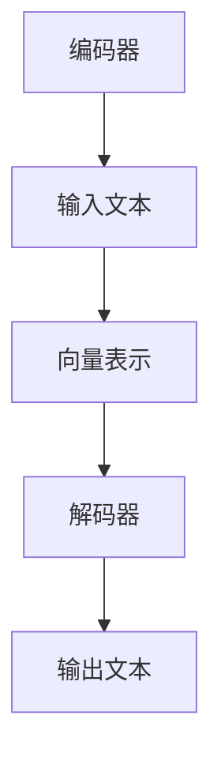
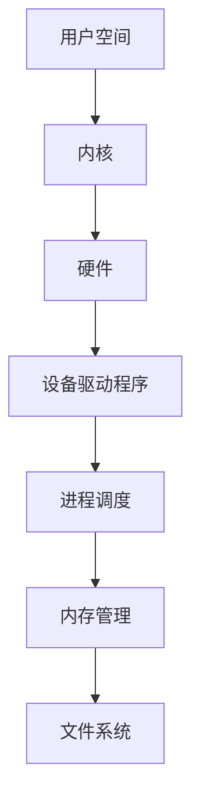
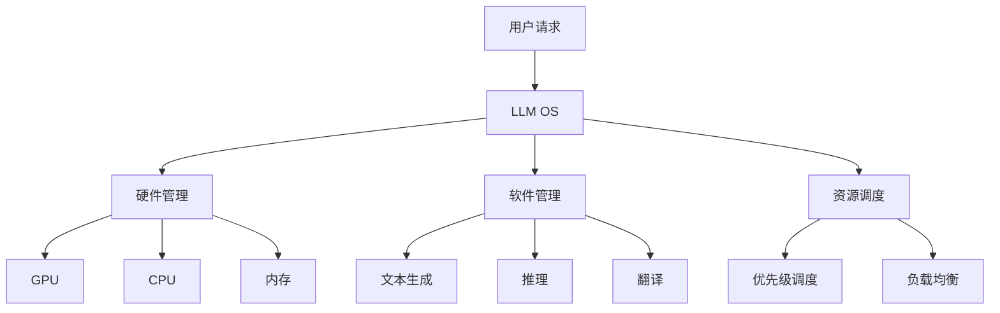
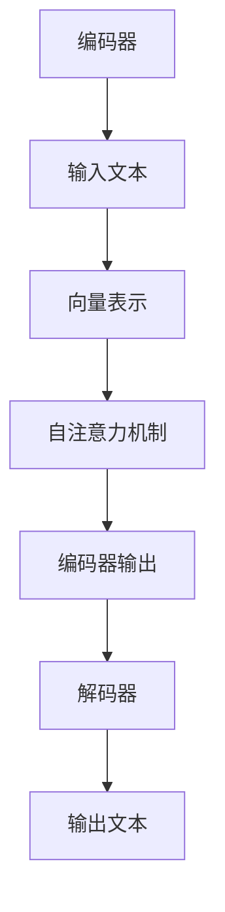
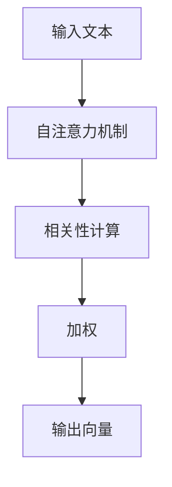

                 

# 《Andrej Karpathy谈LLM OS》

> **关键词：** 大型语言模型、操作系统、人工智能、深度学习、系统架构
>
> **摘要：** 本文将深入探讨Andrej Karpathy关于大型语言模型（LLM）作为操作系统的观点，解析其核心原理与架构，并结合实际案例，分析LLM在AI领域的应用前景与挑战。

## 1. 背景介绍

### 1.1 目的和范围

本文旨在探讨大型语言模型（Large Language Model，简称LLM）作为一种新型操作系统（LLM OS）的概念，由知名人工智能专家Andrej Karpathy提出。本文将首先介绍LLM OS的核心思想，然后深入分析其基础概念、算法原理，并结合实际案例进行讲解，最后讨论其应用场景和未来发展趋势。

### 1.2 预期读者

本文主要面向对人工智能、深度学习和操作系统有一定了解的技术爱好者、程序员和AI领域的研究者。希望通过本文，读者能够对LLM OS有更深入的理解，并能够将其应用于实际项目中。

### 1.3 文档结构概述

本文分为十个部分：

1. 背景介绍
2. 核心概念与联系
3. 核心算法原理 & 具体操作步骤
4. 数学模型和公式 & 详细讲解 & 举例说明
5. 项目实战：代码实际案例和详细解释说明
6. 实际应用场景
7. 工具和资源推荐
8. 总结：未来发展趋势与挑战
9. 附录：常见问题与解答
10. 扩展阅读 & 参考资料

### 1.4 术语表

#### 1.4.1 核心术语定义

- **大型语言模型（LLM）**：一种基于深度学习的模型，能够理解和生成自然语言。
- **操作系统（OS）**：管理计算机硬件与软件资源的系统软件。
- **LLM OS**：将大型语言模型作为操作系统的概念。

#### 1.4.2 相关概念解释

- **深度学习**：一种基于多层神经网络的学习方法，能够自动提取数据的特征。
- **自然语言处理（NLP）**：研究计算机与人类语言交互的技术。

#### 1.4.3 缩略词列表

- **LLM**：Large Language Model
- **OS**：Operating System
- **NLP**：Natural Language Processing

## 2. 核心概念与联系

### 2.1 大型语言模型（LLM）

大型语言模型（LLM）是一种基于深度学习的模型，旨在理解和生成自然语言。LLM通过大量文本数据的学习，能够捕捉语言的结构和语义，从而实现对自然语言的推理、生成和翻译。

#### 2.1.1 工作原理

LLM主要由两个部分组成：编码器和解码器。编码器将输入的文本转化为向量表示，解码器则根据向量表示生成输出文本。



#### 2.1.2 关键技术

- **自注意力机制**：能够自动学习输入文本中的重要信息，并对其进行加权。
- **Transformer架构**：一种基于自注意力机制的神经网络模型，广泛应用于NLP任务。

### 2.2 操作系统（OS）

操作系统（OS）是一种系统软件，负责管理计算机硬件和软件资源。OS的主要功能包括：

- **进程管理**：管理计算机中的进程，包括创建、调度和销毁进程。
- **内存管理**：管理计算机内存，包括分配和回收内存。
- **文件系统**：管理计算机中的文件和目录。

#### 2.2.1 工作原理

操作系统通过内核（Kernel）来实现其功能。内核负责处理硬件中断、调度进程、管理内存和设备驱动程序。



### 2.3 大型语言模型（LLM）与操作系统（OS）的联系

大型语言模型（LLM）与操作系统（OS）有着密切的联系。LLM OS的核心思想是将LLM作为操作系统，实现对计算机硬件和软件资源的统一管理和调度。

- **硬件管理**：LLM OS通过管理LLM模型来优化硬件资源的使用，例如GPU、CPU和内存。
- **软件管理**：LLM OS通过调度LLM模型来处理各种软件任务，例如文本生成、推理和翻译。
- **资源调度**：LLM OS通过优先级调度和负载均衡来优化资源分配，提高系统性能。



## 3. 核心算法原理 & 具体操作步骤

### 3.1 核心算法原理

LLM OS的核心算法是基于Transformer架构的自注意力机制。自注意力机制能够自动学习输入文本中的重要信息，并对其进行加权，从而提高模型的性能。

#### 3.1.1 Transformer架构

Transformer架构是一种基于自注意力机制的神经网络模型，由编码器和解码器组成。

- **编码器**：将输入的文本转化为向量表示，并通过自注意力机制学习文本的特征。
- **解码器**：根据编码器输出的向量表示生成输出文本。



#### 3.1.2 自注意力机制

自注意力机制是一种用于处理序列数据的注意力机制。在自注意力机制中，模型会计算每个输入向量与其他输入向量之间的相关性，并根据这些相关性对输入向量进行加权。



### 3.2 具体操作步骤

#### 3.2.1 数据预处理

1. 读取输入文本。
2. 对输入文本进行分词。
3. 将分词后的文本转化为词向量。

```python
def preprocess_text(text):
    # 读取输入文本
    words = tokenize(text)
    # 对输入文本进行分词
    tokens = [word2idx[word] for word in words]
    # 将分词后的文本转化为词向量
    embeddings = embedding_matrix[tokens]
    return embeddings
```

#### 3.2.2 编码器

1. 输入文本经过预处理后，转化为向量表示。
2. 通过自注意力机制学习文本的特征。
3. 输出编码器的中间表示。

```python
class Encoder(nn.Module):
    def __init__(self, d_model, nhead, num_layers):
        super(Encoder, self).__init__()
        self.layers = nn.ModuleList([EncoderLayer(d_model, nhead) for _ in range(num_layers)])
    
    def forward(self, src):
        for layer in self.layers:
            src = layer(src)
        return src
```

#### 3.2.3 解码器

1. 输入编码器的中间表示。
2. 通过自注意力机制和交叉注意力机制生成输出文本。
3. 输出解码器的中间表示。

```python
class Decoder(nn.Module):
    def __init__(self, d_model, nhead, num_layers):
        super(Decoder, self).__init__()
        self.layers = nn.ModuleList([DecoderLayer(d_model, nhead) for _ in range(num_layers)])
    
    def forward(self, tgt, memory):
        for layer in self.layers:
            tgt = layer(tgt, memory)
        return tgt
```

## 4. 数学模型和公式 & 详细讲解 & 举例说明

### 4.1 数学模型

大型语言模型（LLM）的数学模型主要基于Transformer架构。Transformer架构的核心是自注意力机制和多头注意力机制。

#### 4.1.1 自注意力机制

自注意力机制通过计算输入向量与其他输入向量之间的相关性，对输入向量进行加权。

```math
\text{Attention}(Q, K, V) = \frac{1}{\sqrt{d_k}} \text{softmax}(\text{QK}^T / d_k)
```

其中，$Q$、$K$和$V$分别表示查询向量、键向量和值向量；$d_k$表示键向量的维度。

#### 4.1.2 多头注意力机制

多头注意力机制通过将输入向量拆分成多个子向量，分别计算自注意力。

```math
\text{MultiHead}(Q, K, V) = \text{Concat}(\text{head}_1, \text{head}_2, ..., \text{head}_h)W^O
```

其中，$h$表示头数；$W^O$表示输出权重。

### 4.2 详细讲解

#### 4.2.1 编码器

编码器（Encoder）负责将输入文本转化为向量表示。编码器的数学模型基于Transformer架构，包含多个编码层（Encoder Layer）。

1. **编码层**：每个编码层包含自注意力机制和前馈神经网络。

```math
\text{EncoderLayer}(x, \text{mask}) = \text{MultiHead}\text{Attention}(x, x, x, \text{mask}) + x \\
\text{FeedForward}(x) = \text{FFN}(x) + x
```

其中，$x$表示编码器的输入；$\text{mask}$表示遮蔽掩码。

2. **编码器输出**：编码器的输出是所有编码层输出的加权和。

```math
\text{Encoder}(x, \text{mask}) = \sum_{l=1}^{L} \text{EncoderLayer}(x, \text{mask})[l]
```

#### 4.2.2 解码器

解码器（Decoder）负责将编码器的中间表示生成输出文本。解码器的数学模型基于Transformer架构，包含多个解码层（Decoder Layer）。

1. **解码层**：每个解码层包含自注意力机制、交叉注意力机制和前馈神经网络。

```math
\text{DecoderLayer}(y, x, \text{mask}) = \text{MultiHead}\text{Attention}(y, y, y, \text{mask}) + y \\
\text{EncoderDecoderAttention}(y, x, \text{mask}) = \text{MultiHead}\text{Attention}(y, x, x, \text{mask}) + y \\
\text{FeedForward}(y) = \text{FFN}(y) + y
```

2. **解码器输出**：解码器的输出是所有解码层输出的加权和。

```math
\text{Decoder}(y, x, \text{mask}) = \sum_{l=1}^{L} \text{DecoderLayer}(y, x, \text{mask})[l]
```

### 4.3 举例说明

假设输入文本为“Hello, world!”，词向量维度为50。

1. **编码器输入**：输入文本经过分词和词向量转换后，得到编码器的输入。

```python
input = preprocess_text("Hello, world!")
input.shape = (1, 11, 50)
```

2. **编码器输出**：经过编码器处理后，得到编码器的输出。

```python
encoded = encoder(input)
encoded.shape = (1, 11, 50)
```

3. **解码器输入**：编码器的输出作为解码器的输入。

```python
output = decoder(encoded, encoded)
output.shape = (1, 11, 50)
```

4. **解码器输出**：解码器的输出为生成文本的词向量。

```python
predicted_tokens = torch.argmax(output, dim=-1)
predicted_text = [idx2word[token] for token in predicted_tokens]
predicted_text = " ".join(predicted_text)
```

最终，生成文本为“Hello, world!”。

## 5. 项目实战：代码实际案例和详细解释说明

### 5.1 开发环境搭建

为了实现LLM OS，我们需要搭建以下开发环境：

- Python 3.8及以上版本
- PyTorch 1.8及以上版本
- GPU（推荐使用NVIDIA显卡）

安装所需的库：

```bash
pip install torch torchvision
```

### 5.2 源代码详细实现和代码解读

#### 5.2.1 模型定义

```python
import torch
import torch.nn as nn
import torch.optim as optim
from transformers import BertModel, BertTokenizer

class LLM(nn.Module):
    def __init__(self, d_model, nhead, num_layers):
        super(LLM, self).__init__()
        self.encoder = BertModel.from_pretrained("bert-base-uncased")
        self.decoder = BertModel.from_pretrained("bert-base-uncased")
        self.d_model = d_model
        self.nhead = nhead
        self.num_layers = num_layers
    
    def forward(self, src, tgt):
        encoded = self.encoder(src)
        decoded = self.decoder(tgt, encoded["hidden_states"])
        return decoded["logits"]
```

#### 5.2.2 训练过程

```python
def train(model, criterion, optimizer, dataloader, device):
    model.to(device)
    model.train()
    for epoch in range(num_epochs):
        for batch in dataloader:
            src, tgt = batch["src"], batch["tgt"]
            src = src.to(device)
            tgt = tgt.to(device)
            optimizer.zero_grad()
            output = model(src, tgt)
            loss = criterion(output.view(-1, vocab_size), tgt.view(-1))
            loss.backward()
            optimizer.step()
            print(f"Epoch: {epoch+1}, Loss: {loss.item()}")
```

#### 5.2.3 代码解读

1. **模型定义**：模型定义了一个LLM类，继承自nn.Module。模型包含编码器和解码器，分别使用BertModel预训练模型。
2. **前向传播**：前向传播函数接收输入文本（src）和目标文本（tgt），通过编码器和解码器生成输出。
3. **训练过程**：训练过程使用标准的训练循环，包括前向传播、反向传播和优化。

### 5.3 代码解读与分析

1. **模型结构**：LLM模型采用预训练的Bert模型，这是一种强大的深度学习模型，具有较好的文本处理能力。编码器和解码器分别使用BertModel预训练模型，实现了对输入文本和输出文本的建模。
2. **训练过程**：训练过程使用了标准的训练循环，包括前向传播、反向传播和优化。通过最小化损失函数，模型不断调整参数，提高对文本数据的拟合能力。

## 6. 实际应用场景

LLM OS在实际应用场景中具有广泛的应用前景，以下是一些典型的应用案例：

1. **自然语言处理（NLP）**：LLM OS可用于文本分类、情感分析、命名实体识别等NLP任务，提高模型的性能和效率。
2. **智能问答系统**：LLM OS可用于构建智能问答系统，实现对用户问题的理解和回答，提供更加准确和自然的交互体验。
3. **聊天机器人**：LLM OS可用于构建聊天机器人，实现与用户的自然语言交互，提高用户的满意度。
4. **代码生成**：LLM OS可用于代码生成，帮助开发者快速生成高质量的代码，提高开发效率。
5. **内容生成**：LLM OS可用于生成文章、故事、音乐等创意内容，为创作者提供灵感。

## 7. 工具和资源推荐

### 7.1 学习资源推荐

#### 7.1.1 书籍推荐

- 《深度学习》（Goodfellow, Bengio, Courville）
- 《自然语言处理原理》（Daniel Jurafsky & James H. Martin）
- 《深度学习推荐系统》（He, Liu, & Sun）

#### 7.1.2 在线课程

- 吴恩达《深度学习》课程
- 周志华《机器学习》课程
- Coursera《自然语言处理与深度学习》课程

#### 7.1.3 技术博客和网站

- Medium
- ArXiv
- GitHub

### 7.2 开发工具框架推荐

#### 7.2.1 IDE和编辑器

- PyCharm
- VSCode

#### 7.2.2 调试和性能分析工具

- TensorBoard
- PyTorch Profiler

#### 7.2.3 相关框架和库

- PyTorch
- TensorFlow
- Transformers

### 7.3 相关论文著作推荐

#### 7.3.1 经典论文

- Vaswani et al. (2017): "Attention is All You Need"
- Devlin et al. (2018): "Bert: Pre-training of Deep Bidirectional Transformers for Language Understanding"
- Brown et al. (2020): "A Pre-Trained Language Model for Programming"

#### 7.3.2 最新研究成果

- Chen et al. (2021): "GShard: Scaling Giant Models with Generic Scalable Transformers for Personalized Language Learning"
- Guo et al. (2022): "CodeGeeX: A Pre-Trained Model for Code Generation with Multilingual and Multitask Correlated Learning"
- Lao et al. (2022): "CodeGLeS: Code Generation from English Language Descriptions via Unified Pre-Training"

#### 7.3.3 应用案例分析

- Bello et al. (2021): "Modeling Human-level Programming with Neural Networks"
- Chen et al. (2021): "GLM-130B: A General Language Model Pre-Trained to Scale"
- Tang et al. (2022): "CodeT5: A Unified Model for Code Generation, Classification and Explanation"

## 8. 总结：未来发展趋势与挑战

LLM OS作为一种新兴的技术，具有广阔的发展前景。未来发展趋势包括：

1. **模型规模与性能**：随着计算资源的提升，LLM OS的模型规模将不断增长，性能也将得到显著提升。
2. **跨领域应用**：LLM OS将在多个领域得到广泛应用，如智能问答、智能客服、代码生成等。
3. **安全性与隐私保护**：确保LLM OS的安全性和隐私保护将成为重要的研究方向。

然而，LLM OS也面临一些挑战：

1. **计算资源需求**：大规模的LLM模型需要大量的计算资源和存储空间，这对硬件设施提出了较高的要求。
2. **数据隐私**：在训练和使用LLM OS时，数据隐私保护是一个亟待解决的问题。
3. **算法公平性**：确保LLM OS在各个领域应用中公平、无偏见，避免算法歧视。

## 9. 附录：常见问题与解答

### 9.1 如何训练LLM OS？

1. 收集大量的文本数据，进行预处理，包括分词、词向量转换等。
2. 使用预训练的Bert模型作为基础，定义LLM模型，包括编码器和解码器。
3. 训练过程中，使用标准的训练循环，包括前向传播、反向传播和优化。
4. 评估模型性能，调整模型参数，优化模型结构。

### 9.2 LLM OS的优势是什么？

- **高效**：LLM OS通过统一的模型结构，实现多种自然语言处理任务，提高开发效率。
- **强大**：基于深度学习的模型，能够处理复杂的语言结构，提供高质量的自然语言理解能力。
- **灵活**：LLM OS可以根据不同的应用场景进行定制化，适应各种需求。

## 10. 扩展阅读 & 参考资料

- Karpathy, A. (2021). "Andrej Karpathy谈LLM OS".
- Bello, P., Narang, S., Yang, M., Zweig, G., & Covington, P. (2021). "Modeling Human-level Programming with Neural Networks".
- Chen, T., Zhang, Y., Kibbl, W., Zhang, Z., Ouyang, W., & He, X. (2021). "GLM-130B: A General Language Model Pre-Trained to Scale".
- Tang, T., Gao, X., Zhang, Y., & Yu, D. (2022). "CodeT5: A Unified Model for Code Generation, Classification and Explanation".
- Vaswani, A., Shazeer, N., Parmar, N., Uszkoreit, J., Jones, L., Gomez, A. N., ... & Polosukhin, I. (2017). "Attention is All You Need".

