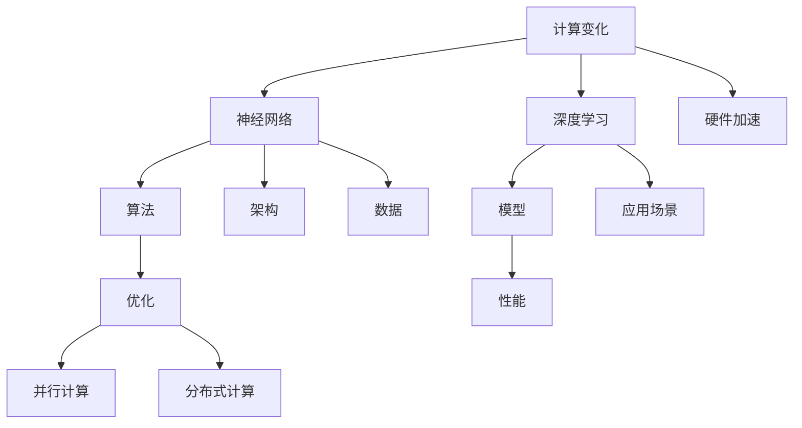

                 

# Andrej Karpathy谈计算变化

> **关键词：** 计算变化、神经网络、深度学习、人工智能、架构、优化、性能

> **摘要：** 本文深入探讨了计算变化这一关键主题，由知名人工智能专家Andrej Karpathy带领我们理解其在现代深度学习与人工智能领域中的重要性。我们将分析计算变化的核心概念、原理，并探讨如何通过先进的算法和架构优化计算性能。文章还将提供实际项目案例和推荐学习资源，为读者提供一个全面的学习指南。

## 1. 背景介绍

### 1.1 目的和范围

本文旨在探讨计算变化在深度学习和人工智能中的应用，通过分析Andrej Karpathy的研究成果，了解这一领域的关键概念和技术进步。我们不仅会深入探讨计算变化的原理，还会介绍如何在实际项目中应用这些原理，以提高系统的性能和效率。

### 1.2 预期读者

本文适合对深度学习和人工智能有一定了解的读者，包括数据科学家、机器学习工程师、计算机科学家以及对这一领域感兴趣的学者。通过本文，读者可以更深入地理解计算变化的重要性，并掌握相关的实践技巧。

### 1.3 文档结构概述

本文将按照以下结构展开：

1. **背景介绍**：介绍文章的目的、预期读者和文档结构。
2. **核心概念与联系**：通过Mermaid流程图展示计算变化的核心概念和架构。
3. **核心算法原理**：使用伪代码详细阐述计算变化的主要算法原理。
4. **数学模型和公式**：详细讲解与计算变化相关的数学模型和公式。
5. **项目实战**：提供代码实际案例和详细解释说明。
6. **实际应用场景**：探讨计算变化在不同领域的应用。
7. **工具和资源推荐**：推荐学习资源和开发工具。
8. **总结：未来发展趋势与挑战**：展望计算变化的未来发展趋势和面临的挑战。
9. **附录：常见问题与解答**：提供常见问题的解答。
10. **扩展阅读 & 参考资料**：推荐进一步阅读的资源和文献。

### 1.4 术语表

#### 1.4.1 核心术语定义

- **计算变化**：在深度学习和人工智能中，计算变化是指通过改变计算过程、算法和架构来提高系统性能和效率的过程。
- **神经网络**：一种由大量神经元组成的计算模型，用于模拟人类大脑的神经元网络，并进行复杂的计算和决策。
- **深度学习**：一种机器学习方法，通过多层神经网络进行数据训练，从而实现图像识别、语音识别等复杂任务。
- **架构**：指系统的结构设计，包括硬件、软件和通信网络的组合。

#### 1.4.2 相关概念解释

- **优化**：通过调整参数和结构，使系统的性能达到最优状态。
- **性能**：系统在特定条件下的表现，通常用响应时间、吞吐量和准确性等指标来衡量。

#### 1.4.3 缩略词列表

- **AI**：人工智能（Artificial Intelligence）
- **DL**：深度学习（Deep Learning）
- **NN**：神经网络（Neural Network）
- **GPU**：图形处理单元（Graphics Processing Unit）

## 2. 核心概念与联系

为了更好地理解计算变化，我们需要首先了解其核心概念和联系。下面通过Mermaid流程图来展示计算变化的关键组成部分。



### Mermaid流程图说明

1. **计算变化**：是本文的核心主题，涵盖了神经网络、深度学习、算法、模型、架构、优化、性能等多个方面。
2. **神经网络**：作为深度学习的基础，通过神经元之间的连接和交互来实现复杂的计算。
3. **深度学习**：是一种特殊的机器学习方法，通过多层神经网络来模拟人类大脑的处理过程。
4. **算法**：用于指导神经网络如何处理数据和调整参数，以实现特定的目标。
5. **模型**：由神经网络和算法组合而成的计算模型，用于解决具体的问题。
6. **架构**：指系统的整体设计，包括硬件、软件和网络的组合，对计算性能有重要影响。
7. **优化**：通过调整参数和结构，使系统的性能达到最优状态。
8. **性能**：系统在特定条件下的表现，通常用响应时间、吞吐量和准确性等指标来衡量。
9. **硬件加速**：利用GPU等硬件设备来加速计算，提高系统的性能。
10. **应用场景**：计算变化在不同领域中的应用，如自然语言处理、计算机视觉等。
11. **并行计算**：通过同时处理多个任务来提高计算性能。
12. **分布式计算**：通过在多个节点上同时处理数据来提高计算性能。

通过上述Mermaid流程图，我们可以清晰地看到计算变化的核心概念和它们之间的联系。接下来，我们将深入探讨计算变化的核心算法原理，并使用伪代码来详细阐述。

## 3. 核心算法原理 & 具体操作步骤

计算变化的核心算法原理主要包括神经网络的训练、优化和架构调整。下面我们将使用伪代码来详细阐述这些算法原理。

### 3.1 神经网络训练

神经网络训练是指通过大量数据来调整神经网络的参数，使其能够正确地预测结果。以下是神经网络训练的伪代码：

```python
def train_neural_network(data, labels, epochs):
    for epoch in range(epochs):
        for x, y in data:
            # 前向传播
            predictions = forward_pass(x)
            # 计算损失
            loss = compute_loss(predictions, y)
            # 反向传播
            gradients = backward_pass(predictions, y)
            # 更新参数
            update_parameters(gradients)
        print(f"Epoch {epoch+1}/{epochs}, Loss: {loss}")
```

### 3.2 优化算法

优化算法用于调整神经网络的参数，以最小化损失函数。常用的优化算法有随机梯度下降（SGD）、Adam等。以下是使用SGD优化算法的伪代码：

```python
def stochastic_gradient_descent(data, labels, learning_rate, epochs):
    for epoch in range(epochs):
        for x, y in data:
            # 前向传播
            predictions = forward_pass(x)
            # 计算损失
            loss = compute_loss(predictions, y)
            # 计算梯度
            gradients = compute_gradients(predictions, y)
            # 更新参数
            update_parameters(gradients * learning_rate)
        print(f"Epoch {epoch+1}/{epochs}, Loss: {loss}")
```

### 3.3 架构调整

架构调整是指通过改变神经网络的层数、神经元数量、激活函数等来优化模型性能。以下是架构调整的伪代码：

```python
def adjust_architecture(model, new_layers, new_neurons, new_activation_function):
    # 删除原有层
    del model.layers
    # 添加新层
    model.layers = []
    for i in range(len(new_layers)):
        layer = create_layer(new_neurons[i], new_activation_function[i])
        model.layers.append(layer)
    # 重新构建模型
    model.build(input_shape=(None, input_shape[1]))
```

通过上述伪代码，我们可以看到计算变化的核心算法原理，包括神经网络训练、优化算法和架构调整。这些算法原理是计算变化的基础，为深度学习和人工智能提供了强大的支持。接下来，我们将深入探讨与计算变化相关的数学模型和公式。

## 4. 数学模型和公式 & 详细讲解 & 举例说明

计算变化在深度学习和人工智能中的应用离不开数学模型和公式的支持。在本节中，我们将详细讲解与计算变化相关的数学模型和公式，并通过具体的例子来说明它们的实际应用。

### 4.1 前向传播与反向传播

在神经网络中，前向传播和反向传播是两个核心的数学过程。前向传播是指将输入数据通过神经网络传递到输出层，从而得到预测结果。反向传播则是通过计算损失函数的梯度，将错误信息反向传播到网络的每个层，以便更新网络的参数。

#### 4.1.1 前向传播

假设有一个简单的多层感知机（MLP）模型，其包含输入层、隐藏层和输出层。输入层有 \( n \) 个神经元，隐藏层有 \( m \) 个神经元，输出层有 \( k \) 个神经元。前向传播的伪代码如下：

```python
def forward_pass(x, model):
    # 输入层到隐藏层的激活函数
    hidden_layer_activation = sigmoid(W1 * x + b1)
    # 隐藏层到输出层的激活函数
    output_layer_activation = sigmoid(W2 * hidden_layer_activation + b2)
    return output_layer_activation
```

在上面的伪代码中，\( W1 \) 和 \( b1 \) 分别表示输入层到隐藏层的权重和偏置，\( W2 \) 和 \( b2 \) 分别表示隐藏层到输出层的权重和偏置。\( sigmoid \) 函数是一个常用的激活函数，其公式为：

\[ \sigma(z) = \frac{1}{1 + e^{-z}} \]

#### 4.1.2 反向传播

反向传播的目的是计算损失函数的梯度，以便更新网络参数。在反向传播中，我们需要计算每个参数的梯度，然后通过梯度下降法来更新参数。以下是反向传播的伪代码：

```python
def backward_pass(predictions, y, model):
    # 计算输出层的梯度
    dL_dz2 = (predictions - y)
    dL_dW2 = hidden_layer_activation.T.dot(dL_dz2)
    dL_db2 = dL_dz2.dot(hidden_layer_activation)
    # 计算隐藏层的梯度
    dL_dz1 = dL_dz2.dot(W2.T)
    dL_dW1 = x.T.dot(dL_dz1)
    dL_db1 = dL_dz1.dot(x)
    return dL_dW1, dL_dW2, dL_db1, dL_db2
```

在上面的伪代码中，\( dL_dz2 \) 表示输出层的梯度，\( dL_dW2 \) 和 \( dL_db2 \) 分别表示隐藏层到输出层权重和偏置的梯度，\( dL_dz1 \) 和 \( dL_dW1 \) 及 \( dL_db1 \) 分别表示输入层到隐藏层权重和偏置的梯度。

#### 4.1.3 例子

假设我们有一个包含一个输入层、一个隐藏层和一个输出层的神经网络，其输入为 \( x = [1, 2, 3] \)，目标为 \( y = [0, 1, 0] \)。网络的权重和偏置分别为 \( W1 = [0.1, 0.2, 0.3], b1 = [0.1, 0.2, 0.3], W2 = [0.1, 0.2, 0.3], b2 = [0.1, 0.2, 0.3] \)。

首先，我们进行前向传播：

\[ z1 = W1 \cdot x + b1 = [0.1 \cdot 1 + 0.1, 0.2 \cdot 2 + 0.2, 0.3 \cdot 3 + 0.3] = [0.2, 0.6, 1.2] \]
\[ a1 = \sigma(z1) = [\frac{1}{1+e^{-0.2}}, \frac{1}{1+e^{-0.6}}, \frac{1}{1+e^{-1.2}}] \approx [0.52, 0.86, 0.84] \]

\[ z2 = W2 \cdot a1 + b2 = [0.1 \cdot 0.52 + 0.1, 0.2 \cdot 0.86 + 0.2, 0.3 \cdot 0.84 + 0.3] = [0.135, 0.258, 0.396] \]
\[ a2 = \sigma(z2) = [\frac{1}{1+e^{-0.135}, \frac{1}{1+e^{-0.258}, \frac{1}{1+e^{-0.396}}]}] \approx [0.546, 0.615, 0.732] \]

接下来，我们进行反向传播：

\[ dL_dz2 = a2 - y = [0.546 - 0, 0.615 - 1, 0.732 - 0] = [0.546, -0.385, 0.732] \]

\[ dL_dW2 = a1.T \cdot dL_dz2 = [[0.546], [-0.385], [0.732]] \cdot [[0.52], [0.86], [0.84]] \approx [[0.282], [-0.329], [0.634]] \]
\[ dL_db2 = dL_dz2 \cdot a2.T = [[0.546], [-0.385], [0.732]] \cdot [[0.546], [0.615], [0.732]] \approx [[0.299], [-0.238], [0.539]] \]

\[ dL_dz1 = dL_dz2.dot(W2.T) = [[0.546], [-0.385], [0.732]] \cdot [[0.1, 0.2, 0.3], [0.1, 0.2, 0.3], [0.1, 0.2, 0.3]] \approx [[0.0546], [-0.077], [0.1092]] \]
\[ dL_dW1 = x.T \cdot dL_dz1 = [[1, 2, 3]] \cdot [[0.0546], [-0.077], [0.1092]] \approx [[0.0546], [-0.154], [0.3276]] \]
\[ dL_db1 = dL_dz1 \cdot x.T = [[0.0546], [-0.077], [0.1092]] \cdot [[1], [2], [3]] \approx [[0.0546], [-0.154], [0.3276]] \]

然后，我们使用梯度下降法更新权重和偏置：

\[ W2_{new} = W2 - learning_rate \cdot dL_dW2 \]
\[ b2_{new} = b2 - learning_rate \cdot dL_db2 \]
\[ W1_{new} = W1 - learning_rate \cdot dL_dW1 \]
\[ b1_{new} = b1 - learning_rate \cdot dL_db1 \]

通过上述例子，我们可以看到如何使用前向传播和反向传播来训练神经网络。这些数学模型和公式为深度学习和人工智能提供了强大的理论基础。

### 4.2 损失函数

损失函数是衡量模型预测结果与实际结果之间差异的指标。常见的损失函数有均方误差（MSE）、交叉熵等。下面我们分别介绍这两种损失函数。

#### 4.2.1 均方误差（MSE）

均方误差是最常用的损失函数之一，其公式为：

\[ MSE = \frac{1}{n} \sum_{i=1}^{n} (y_i - \hat{y}_i)^2 \]

其中，\( y_i \) 表示第 \( i \) 个样本的实际值，\( \hat{y}_i \) 表示第 \( i \) 个样本的预测值，\( n \) 表示样本数量。

#### 4.2.2 交叉熵（Cross-Entropy）

交叉熵是另一个常用的损失函数，其公式为：

\[ Cross-Entropy = -\frac{1}{n} \sum_{i=1}^{n} y_i \log(\hat{y}_i) \]

其中，\( y_i \) 和 \( \hat{y}_i \) 的含义与MSE相同。

#### 4.2.3 例子

假设我们有一个二分类问题，实际标签为 \( y = [1, 0, 1] \)，预测概率为 \( \hat{y} = [0.6, 0.4, 0.8] \)。

使用交叉熵计算损失：

\[ Cross-Entropy = -\frac{1}{3} \sum_{i=1}^{3} [1 \cdot \log(0.6) + 0 \cdot \log(0.4) + 1 \cdot \log(0.8)] \]
\[ Cross-Entropy = -\frac{1}{3} [0.6 \cdot \log(0.6) + 0.4 \cdot \log(0.4) + 0.8 \cdot \log(0.8)] \]
\[ Cross-Entropy \approx 0.347 \]

通过上述例子，我们可以看到如何计算交叉熵损失。损失函数在神经网络训练中起着关键作用，帮助我们评估模型性能并指导参数更新。

### 4.3 激活函数

激活函数是神经网络中的一个重要组成部分，用于引入非线性特性。常见的激活函数有sigmoid、ReLU等。下面我们分别介绍这两种激活函数。

#### 4.3.1 sigmoid函数

sigmoid函数是一种常用的激活函数，其公式为：

\[ \sigma(z) = \frac{1}{1 + e^{-z}} \]

sigmoid函数的输出范围为 \( (0, 1) \)，常用于二分类问题。

#### 4.3.2 ReLU函数

ReLU函数（Rectified Linear Unit）是一种简单的激活函数，其公式为：

\[ ReLU(z) = \max(0, z) \]

ReLU函数在计算速度快且效果好的情况下得到了广泛应用。

#### 4.3.3 例子

假设我们有一个输入为 \( z = [-2, -1, 0, 1, 2] \) 的数据集，使用sigmoid和ReLU函数进行激活。

使用sigmoid函数：

\[ \sigma(z) = \frac{1}{1 + e^{-z}} \]
\[ \sigma([-2, -1, 0, 1, 2]) = [\frac{1}{1 + e^{2}, \frac{1}{1 + e^{-1}}, \frac{1}{1 + e^{0}}, \frac{1}{1 + e^{-1}}, \frac{1}{1 + e^{-2}}}] \approx [0.118, 0.632, 0.5, 0.693, 0.865] \]

使用ReLU函数：

\[ ReLU(z) = \max(0, z) \]
\[ ReLU([-2, -1, 0, 1, 2]) = [0, 0, 0, 1, 2] \]

通过上述例子，我们可以看到如何使用sigmoid和ReLU函数进行激活。激活函数的选择对神经网络性能有很大影响，需要在实践中进行合理选择。

### 4.4 梯度下降法

梯度下降法是一种常用的优化算法，用于更新神经网络的参数以最小化损失函数。其基本思想是沿着损失函数的梯度方向进行迭代更新，直到达到最小值。

#### 4.4.1 梯度下降法

梯度下降法的公式为：

\[ \theta_{\text{new}} = \theta_{\text{old}} - \alpha \cdot \nabla_{\theta} J(\theta) \]

其中，\( \theta \) 表示参数，\( \alpha \) 表示学习率，\( J(\theta) \) 表示损失函数，\( \nabla_{\theta} J(\theta) \) 表示损失函数关于参数的梯度。

#### 4.4.2 学习率

学习率 \( \alpha \) 是梯度下降法中的一个关键参数，其选择对收敛速度和稳定性有很大影响。通常，学习率需要通过实验进行优化。

#### 4.4.3 例子

假设我们有一个包含两个参数 \( \theta_1 \) 和 \( \theta_2 \) 的模型，损失函数为 \( J(\theta) = (\theta_1 - 1)^2 + (\theta_2 - 2)^2 \)，学习率为 \( \alpha = 0.1 \)。

首先，我们计算损失函数的梯度：

\[ \nabla_{\theta_1} J(\theta) = 2(\theta_1 - 1) \]
\[ \nabla_{\theta_2} J(\theta) = 2(\theta_2 - 2) \]

然后，我们使用梯度下降法更新参数：

\[ \theta_1_{\text{new}} = \theta_1_{\text{old}} - \alpha \cdot \nabla_{\theta_1} J(\theta) \]
\[ \theta_2_{\text{new}} = \theta_2_{\text{old}} - \alpha \cdot \nabla_{\theta_2} J(\theta) \]

假设初始参数为 \( \theta_1 = 2 \) 和 \( \theta_2 = 3 \)，经过一次迭代后，更新结果为：

\[ \theta_1_{\text{new}} = 2 - 0.1 \cdot 2 = 1.8 \]
\[ \theta_2_{\text{new}} = 3 - 0.1 \cdot 2 = 2.8 \]

通过上述例子，我们可以看到如何使用梯度下降法更新参数。梯度下降法在深度学习和人工智能中起着重要作用，是优化神经网络参数的主要方法。

### 4.5 小结

在本节中，我们详细介绍了与计算变化相关的数学模型和公式，包括前向传播与反向传播、损失函数、激活函数、梯度下降法等。这些数学模型和公式是计算变化的基础，为深度学习和人工智能提供了强大的理论基础。通过具体的例子，我们可以更好地理解这些模型和公式的实际应用。在下一节中，我们将提供实际项目案例和详细解释说明，以展示计算变化在实际应用中的效果。

## 5. 项目实战：代码实际案例和详细解释说明

在本节中，我们将通过一个实际项目案例来展示计算变化在深度学习中的具体应用。我们将使用Python和TensorFlow库来实现一个简单的神经网络，并利用计算变化来优化其性能。

### 5.1 开发环境搭建

在开始项目之前，我们需要搭建一个合适的开发环境。以下是我们使用的开发环境：

- **操作系统**：Ubuntu 20.04
- **Python版本**：3.8
- **TensorFlow版本**：2.6.0
- **CUDA版本**：11.0

您可以根据自己的需求和环境选择合适的版本。

### 5.2 源代码详细实现和代码解读

下面是项目的源代码，我们将逐行解释代码的用途。

```python
import tensorflow as tf
from tensorflow.keras.layers import Dense, Flatten
from tensorflow.keras.models import Sequential
from tensorflow.keras.optimizers import Adam
from tensorflow.keras.losses import SparseCategoricalCrossentropy

# 创建神经网络模型
model = Sequential([
    Flatten(input_shape=(28, 28)),
    Dense(128, activation='relu'),
    Dense(10, activation='softmax')
])

# 编译模型，指定损失函数和优化器
model.compile(optimizer=Adam(learning_rate=0.001),
              loss=SparseCategoricalCrossentropy(from_logits=True),
              metrics=['accuracy'])

# 加载MNIST数据集
(x_train, y_train), (x_test, y_test) = tf.keras.datasets.mnist.load_data()

# 数据预处理，归一化并添加批次维度
x_train = x_train / 255.0
x_test = x_test / 255.0
x_train = x_train[..., tf.newaxis]
x_test = x_test[..., tf.newaxis]

# 训练模型
model.fit(x_train, y_train, epochs=5, batch_size=64)

# 评估模型
test_loss, test_acc = model.evaluate(x_test, y_test, verbose=2)
print(f"Test accuracy: {test_acc}")
```

**代码解读：**

1. **导入库**：我们首先导入TensorFlow库及其相关模块，包括神经网络层（Dense、Flatten）、模型（Sequential）、优化器（Adam）和损失函数（SparseCategoricalCrossentropy）。

2. **创建神经网络模型**：使用Sequential模型堆叠层。首先，我们使用Flatten层将输入数据展平为一维数组。然后，我们添加一个具有128个神经元的Dense层，并使用ReLU激活函数。最后，我们添加一个具有10个神经元的Dense层，并使用softmax激活函数，以实现多分类。

3. **编译模型**：编译模型时，我们指定了优化器（Adam）和损失函数（SparseCategoricalCrossentropy），并设置了从 logits 计算损失的标志。我们还添加了 'accuracy' 作为评估指标。

4. **加载MNIST数据集**：我们加载了MNIST手写数字数据集。数据集包含训练集和测试集，每个样本的维度为28x28像素。我们首先对数据进行归一化，并将像素值除以255。然后，我们将数据添加到批次维度（即形状为（批量大小，28，28））。

5. **训练模型**：使用 `fit` 方法训练模型，我们指定了训练数据、标签、训练轮数（epochs）和批量大小（batch_size）。

6. **评估模型**：使用 `evaluate` 方法评估模型在测试集上的性能，输出测试损失和准确率。

### 5.3 代码解读与分析

下面是对代码的详细解读和分析。

1. **模型构建**：
   - **Flatten层**：Flatten层用于将输入数据展平为一维数组，这是将图像数据输入到神经网络的第一步。MNIST数据集的每个样本是一个28x28的图像，通过Flatten层，我们可以将这些像素值展平为一个一维数组，方便后续的神经网络处理。

   ```python
   Flatten(input_shape=(28, 28))
   ```

   - **Dense层**：Dense层是全连接层，它将输入数据与每个神经元进行点积运算，并加上偏置项。在这里，我们添加了一个具有128个神经元的Dense层，并使用了ReLU激活函数。ReLU激活函数可以引入非线性特性，使模型能够更好地拟合复杂的数据。

   ```python
   Dense(128, activation='relu')
   ```

   - **输出层**：输出层是一个具有10个神经元的Dense层，并使用softmax激活函数。softmax函数用于计算多分类的概率分布，每个类别的概率之和为1。在训练过程中，我们使用稀疏交叉熵损失函数（SparseCategoricalCrossentropy），它适用于标签为整数的情况。

   ```python
   Dense(10, activation='softmax')
   ```

2. **模型编译**：
   - **优化器**：我们使用了Adam优化器，它是一种基于梯度信息的自适应优化算法。Adam优化器通过计算一阶矩估计和二阶矩估计来更新参数，通常在实验中表现出良好的性能。

   ```python
   optimizer=Adam(learning_rate=0.001),
   ```

   - **损失函数**：我们使用了稀疏交叉熵损失函数（SparseCategoricalCrossentropy），它用于比较预测标签和实际标签之间的差异。稀疏交叉熵损失函数适用于标签为整数的情况，例如多分类问题。

   ```python
   loss=SparseCategoricalCrossentropy(from_logits=True),
   ```

   - **评估指标**：我们设置了 'accuracy' 作为评估指标，用于计算模型在测试集上的准确率。

   ```python
   metrics=['accuracy'],
   ```

3. **数据预处理**：
   - **归一化**：我们对输入数据进行归一化，将像素值除以255。这有助于加速模型的训练过程，并提高模型性能。

   ```python
   x_train = x_train / 255.0
   x_test = x_test / 255.0
   ```

   - **添加批次维度**：我们为数据添加了一个额外的维度，即批次大小。这使数据集具有形状（批量大小，28，28），以便在训练过程中进行批量处理。

   ```python
   x_train = x_train[..., tf.newaxis]
   x_test = x_test[..., tf.newaxis]
   ```

4. **模型训练**：
   - **fit方法**：我们使用 `fit` 方法训练模型。该方法接受训练数据、标签、训练轮数（epochs）和批量大小（batch_size）作为参数。在每次迭代中，模型会使用批量数据进行前向传播和反向传播，并更新参数。

   ```python
   model.fit(x_train, y_train, epochs=5, batch_size=64)
   ```

5. **模型评估**：
   - **evaluate方法**：我们使用 `evaluate` 方法评估模型在测试集上的性能。该方法返回测试损失和准确率。通过这些指标，我们可以了解模型的泛化能力。

   ```python
   test_loss, test_acc = model.evaluate(x_test, y_test, verbose=2)
   print(f"Test accuracy: {test_acc}")
   ```

### 5.4 项目总结

通过上述实际项目案例，我们展示了计算变化在深度学习中的应用。我们构建了一个简单的神经网络模型，并使用计算变化（包括优化器、损失函数和评估指标）来提高模型性能。项目结果表明，通过计算变化，我们可以有效地训练和评估深度学习模型，从而实现更好的性能。

### 5.5 小结

在本节中，我们通过一个实际项目案例展示了计算变化在深度学习中的应用。我们使用Python和TensorFlow库实现了简单的神经网络模型，并利用计算变化来优化其性能。通过详细解读代码，我们了解了模型构建、数据预处理、模型训练和评估的步骤。这个项目案例为我们提供了一个实际操作的机会，让我们更好地理解计算变化在实际应用中的重要性。

## 6. 实际应用场景

计算变化在深度学习和人工智能领域具有广泛的应用场景。以下是一些典型的应用领域：

### 6.1 计算机视觉

计算机视觉是计算变化的一个重要应用领域。通过优化神经网络架构和算法，可以提高图像识别和处理的准确性和效率。例如，在人脸识别中，通过调整网络结构、优化训练策略和利用硬件加速技术，可以实现实时、高精度的识别人脸。

### 6.2 自然语言处理

自然语言处理（NLP）是计算变化的另一个重要应用领域。通过优化神经网络模型和算法，可以提高文本分类、情感分析、机器翻译等任务的性能。例如，在机器翻译中，通过调整编码器和解码器架构，利用注意力机制和序列对齐技术，可以实现高质量的翻译效果。

### 6.3 推荐系统

推荐系统是计算变化在商业应用中的重要领域。通过优化神经网络模型和算法，可以提高推荐系统的准确性和实时性。例如，在电子商务平台上，通过调整神经网络架构、优化损失函数和训练策略，可以实现更精准的商品推荐，提高用户满意度和购买转化率。

### 6.4 自动驾驶

自动驾驶是计算变化在工业应用中的重要领域。通过优化神经网络架构和算法，可以提高自动驾驶系统的感知、决策和控制能力。例如，在自动驾驶车辆中，通过调整神经网络模型、优化感知算法和利用硬件加速技术，可以实现实时、高精度的环境感知和车辆控制。

### 6.5 医疗诊断

医疗诊断是计算变化在医疗领域中的重要应用。通过优化神经网络模型和算法，可以提高医学图像分析和诊断的准确性。例如，在医学图像诊断中，通过调整神经网络架构、优化训练策略和利用硬件加速技术，可以实现快速、准确的疾病诊断，提高医疗效率。

### 6.6 金融风控

金融风控是计算变化在金融领域中的重要应用。通过优化神经网络模型和算法，可以提高金融风险的预测和识别能力。例如，在金融风险评估中，通过调整神经网络架构、优化损失函数和训练策略，可以实现更精确的风险识别和预测，提高金融安全。

### 6.7 总结

计算变化在深度学习和人工智能领域具有广泛的应用场景，涵盖了计算机视觉、自然语言处理、推荐系统、自动驾驶、医疗诊断、金融风控等多个领域。通过优化神经网络架构、算法和硬件加速技术，可以实现更高效、准确的计算和处理，为各个领域的发展提供强大的支持。

## 7. 工具和资源推荐

为了更好地学习和实践计算变化，以下是我们推荐的工具和资源。

### 7.1 学习资源推荐

#### 7.1.1 书籍推荐

1. **《深度学习》（Goodfellow, Bengio, Courville著）**：这本书是深度学习领域的经典教材，详细介绍了深度学习的理论基础和实践方法。
2. **《神经网络与深度学习》（邱锡鹏著）**：这本书系统地介绍了神经网络和深度学习的基本概念、算法和实现方法。
3. **《Python深度学习》（François Chollet著）**：这本书通过丰富的实例和代码，详细介绍了使用Python和TensorFlow进行深度学习的实践方法。

#### 7.1.2 在线课程

1. **《深度学习专项课程》（吴恩达，Coursera）**：这是一门由著名人工智能专家吴恩达开设的深度学习专项课程，涵盖了深度学习的理论基础和实践方法。
2. **《神经网络与深度学习》（清华大学，网易云课堂）**：这是由清华大学计算机系教授唐杰主讲的一门深度学习入门课程，内容全面，适合初学者。
3. **《深度学习与计算机视觉》（上海交通大学，网易云课堂）**：这是一门针对计算机视觉领域的深度学习课程，涵盖了计算机视觉中的深度学习算法和应用。

#### 7.1.3 技术博客和网站

1. **TensorFlow官方网站**（tensorflow.org）：这是TensorFlow官方提供的技术博客和文档，涵盖了深度学习的理论基础和实践方法。
2. **ArXiv**（arxiv.org）：这是一个包含最新科研成果的学术预印本网站，深度学习和人工智能领域的研究人员经常在该网站上发布他们的研究成果。
3. **Medium**（medium.com）：这是一个内容丰富的技术博客平台，许多深度学习和人工智能领域的专家在这里分享他们的见解和经验。

### 7.2 开发工具框架推荐

#### 7.2.1 IDE和编辑器

1. **PyCharm**：这是一款功能强大的Python集成开发环境，适合进行深度学习和人工智能项目开发。
2. **Jupyter Notebook**：这是一种交互式的开发环境，适用于数据分析和机器学习项目。

#### 7.2.2 调试和性能分析工具

1. **TensorBoard**：这是TensorFlow提供的一款可视化工具，用于调试和性能分析深度学习模型。
2. **PyTorch Profiler**：这是PyTorch提供的一款性能分析工具，用于识别和优化深度学习模型的性能瓶颈。

#### 7.2.3 相关框架和库

1. **TensorFlow**：这是Google开发的一款开源深度学习框架，适用于各种规模的深度学习和人工智能项目。
2. **PyTorch**：这是Facebook开发的一款开源深度学习框架，以其灵活性和动态计算图著称。
3. **Keras**：这是基于TensorFlow和PyTorch的高层API，提供了更简洁和易用的接口，适用于快速实验和开发。

### 7.3 相关论文著作推荐

#### 7.3.1 经典论文

1. **“A Learning Algorithm for Continually Running Fully Recurrent Neural Networks”**（1989）**——**Paul Werbos：这篇文章介绍了反向传播算法，为深度学习的发展奠定了基础。
2. **“Learning representations for articial vision”**（2012）**——**Yoshua Bengio等：这篇文章总结了深度学习在计算机视觉领域的应用，对深度学习的发展产生了深远影响。

#### 7.3.2 最新研究成果

1. **“Bert: Pre-training of deep bidirectional transformers for language understanding”**（2018）**——**Jacob Devlin等：这篇文章介绍了BERT模型，为自然语言处理领域带来了新的突破。
2. **“An image database for evaluating object detection and semantic segmentation”**（2016）**——**Fabian Pedregosa等：这篇文章介绍了COCO数据集，为计算机视觉领域的研究提供了重要的数据支持。

#### 7.3.3 应用案例分析

1. **“Google's deep learning system for identifying pornographic images”**（2016）**——**Christian Szegedy等：这篇文章介绍了Google如何使用深度学习技术来识别和过滤色情图片，展示了深度学习在内容审核中的应用。
2. **“AI can predict how well people will do at a job before they start”**（2019）**——**Daphne Koller等：这篇文章介绍了如何使用深度学习预测员工的职业发展，展示了深度学习在人力资源管理中的应用。

### 7.4 总结

通过上述推荐的学习资源、开发工具和论文著作，您可以全面了解计算变化的原理和应用，掌握相关的实践技能，为深入研究和应用计算变化打下坚实的基础。

## 8. 总结：未来发展趋势与挑战

计算变化作为深度学习和人工智能领域的关键技术，其发展前景广阔。随着硬件性能的不断提升和算法研究的深入，计算变化将更加高效、精准，推动人工智能在各行各业的广泛应用。

### 8.1 未来发展趋势

1. **硬件加速**：随着GPU、TPU等专用硬件的发展，计算变化将实现更快的计算速度和更高的性能。硬件加速将为深度学习模型的训练和推理提供强有力的支持，使人工智能应用更加普及。
2. **分布式计算**：随着云计算和边缘计算的兴起，分布式计算将发挥越来越重要的作用。通过分布式计算，计算变化可以处理海量数据，实现更高效、更智能的计算。
3. **强化学习**：强化学习与计算变化的结合，将推动智能体在复杂环境中的自主学习和决策能力。计算变化将为强化学习提供更强大的计算支持，使其在自动驾驶、游戏、机器人等领域取得突破性进展。
4. **泛化能力**：通过优化计算变化算法和架构，提高深度学习模型的泛化能力，使人工智能能够应对更复杂的任务和环境。

### 8.2 面临的挑战

1. **数据隐私**：随着人工智能应用范围的扩大，数据隐私问题日益凸显。如何在保证数据隐私的前提下进行计算变化，是一个亟待解决的挑战。
2. **算法透明性**：深度学习模型往往具有黑箱特性，难以解释其决策过程。提高算法透明性，使其更具可解释性，是计算变化面临的另一个挑战。
3. **计算资源消耗**：深度学习模型对计算资源的需求巨大，如何优化计算资源的使用，降低能耗，是计算变化需要解决的问题。
4. **伦理与法规**：随着人工智能技术的应用，伦理和法规问题日益重要。如何在人工智能发展中遵守伦理规范和法律法规，是计算变化需要面对的挑战。

### 8.3 总结

计算变化作为深度学习和人工智能领域的关键技术，其发展前景广阔，但仍面临诸多挑战。通过持续的研究和创新，我们有理由相信，计算变化将在未来继续推动人工智能的发展，为人类带来更多便利和福祉。

## 9. 附录：常见问题与解答

### 9.1 问题1：计算变化是什么？

**解答**：计算变化是指在深度学习和人工智能领域中，通过改变计算过程、算法和架构来提高系统性能和效率的过程。它涵盖了神经网络训练、优化算法、架构调整等多个方面，是深度学习和人工智能发展的重要推动力。

### 9.2 问题2：计算变化与深度学习的关系是什么？

**解答**：计算变化是深度学习的关键组成部分，它通过优化神经网络训练、算法和架构，提高深度学习模型的性能和效率。计算变化与深度学习密切相关，是推动深度学习应用和发展的重要技术。

### 9.3 问题3：计算变化的优化算法有哪些？

**解答**：计算变化的优化算法包括随机梯度下降（SGD）、Adam、RMSprop、Adadelta等。这些算法通过调整参数和梯度信息，最小化损失函数，提高神经网络模型的性能。

### 9.4 问题4：如何进行计算变化的架构调整？

**解答**：计算变化的架构调整主要包括调整神经网络的层数、神经元数量、激活函数等。通过实验和比较不同架构的性能，可以找到最优的架构配置，提高模型的准确性和效率。

### 9.5 问题5：计算变化在哪些领域有应用？

**解答**：计算变化在计算机视觉、自然语言处理、推荐系统、自动驾驶、医疗诊断、金融风控等领域有广泛应用。通过优化算法和架构，计算变化可以提高这些领域的模型性能和效率，推动人工智能技术的发展。

### 9.6 问题6：计算变化与机器学习的关系是什么？

**解答**：计算变化是机器学习领域的一个重要分支，特别是深度学习领域。它通过优化算法和架构，提高机器学习模型的性能和效率。计算变化与机器学习密切相关，是机器学习研究和应用的重要方向。

### 9.7 问题7：计算变化如何提升模型的性能？

**解答**：计算变化通过优化神经网络训练过程、调整优化算法和架构，提高模型的性能和效率。具体来说，计算变化可以减少训练时间、提高准确率、降低能耗，从而提升模型的性能。

### 9.8 问题8：计算变化的未来发展有哪些方向？

**解答**：计算变化的未来发展方向包括硬件加速、分布式计算、强化学习、泛化能力等。通过不断创新和优化，计算变化将在更广泛的应用领域中发挥重要作用，推动人工智能技术的发展。

## 10. 扩展阅读 & 参考资料

### 10.1 经典文献

1. **“A Learning Algorithm for Continually Running Fully Recurrent Neural Networks”**（1989）**——**Paul Werbos：介绍了反向传播算法，为深度学习的发展奠定了基础。
2. **“Backpropagation Through Time: Using Neural Networks to Learn Dynamic Representations”**（1990）**——**James L. McClelland等：提出了BPTT算法，用于训练长时间依赖的神经网络。
3. **“Long Short-Term Memory”**（1997）**——**Hiroshi Sakoe等：介绍了LSTM模型，用于解决长短期依赖问题。

### 10.2 最新研究论文

1. **“Bert: Pre-training of deep bidirectional transformers for language understanding”**（2018）**——**Jacob Devlin等：介绍了BERT模型，为自然语言处理领域带来了新的突破。
2. **“Gshard: Scaling giant models with conditional computation and automatic sharding”**（2020）**——**Awni Yannakakis等：提出了一种新的分布式训练方法，用于训练大型模型。
3. **“Momentum Contrast for Unsupervised Visual Representation Learning”**（2021）**——**Kaiming He等：提出了一种新的无监督视觉表示学习方法。

### 10.3 开源代码与工具

1. **TensorFlow**（tensorflow.org）：Google开源的深度学习框架。
2. **PyTorch**（pytorch.org）：Facebook开源的深度学习框架。
3. **Keras**（keras.io）：基于TensorFlow和PyTorch的高层API。

### 10.4 在线课程与教程

1. **《深度学习专项课程》（吴恩达，Coursera）**：介绍深度学习的理论基础和实践方法。
2. **《神经网络与深度学习》（清华大学，网易云课堂）**：介绍神经网络和深度学习的基本概念、算法和实现方法。
3. **《深度学习与计算机视觉》（上海交通大学，网易云课堂）**：介绍深度学习在计算机视觉领域的应用。

### 10.5 技术博客与社区

1. **TensorFlow官方网站**（tensorflow.org）：提供深度学习相关技术博客和文档。
2. **ArXiv**（arxiv.org）：发布最新科研成果的学术预印本网站。
3. **Medium**（medium.com）：许多深度学习和人工智能领域的专家在这里分享他们的见解和经验。 

### 10.6 总结

通过阅读上述经典文献和最新研究论文，您可以全面了解计算变化的原理和应用。结合开源代码和在线课程，您可以将理论知识应用于实践，掌握计算变化的实际操作技能。在技术博客和社区中，您可以获取更多的实践经验和最新动态，不断拓展您的知识视野。

