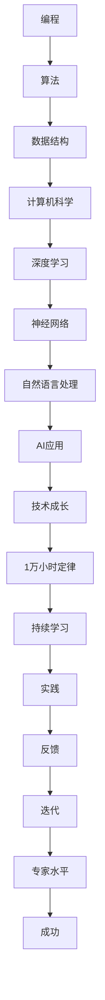

                 

## Andrej Karpathy：1 万小时定律的魔力

> **关键词**：安德烈·卡帕提、1万小时定律、编程、深度学习、技术成长
>
> **摘要**：本文将深入探讨著名深度学习专家Andrej Karpathy关于“1万小时定律”在技术领域的应用与价值。我们将从多个角度分析这一理论，探讨其对程序员和AI从业者的启示，并通过具体案例和实践步骤，指导读者如何在实践中运用这一理论，实现技术的飞跃。

### 1. 背景介绍

#### 1.1 目的和范围

本文旨在探讨Andrej Karpathy关于“1万小时定律”的理论在技术领域的应用。我们将通过详细的分析和实际案例，帮助读者理解这一理论的内涵，并掌握如何在编程和深度学习领域中运用这一理论，实现技术的持续成长。

#### 1.2 预期读者

本文适合以下读者群体：

- 对编程和深度学习感兴趣的初学者和从业者
- 想要提升技术能力的程序员和AI开发者
- 对“1万小时定律”有兴趣并希望将其应用于技术领域的读者

#### 1.3 文档结构概述

本文结构如下：

1. **背景介绍**：介绍本文的目的、范围和预期读者。
2. **核心概念与联系**：通过Mermaid流程图，展示技术领域中的核心概念和联系。
3. **核心算法原理与具体操作步骤**：使用伪代码详细阐述核心算法原理。
4. **数学模型和公式**：详细讲解数学模型和公式，并举例说明。
5. **项目实战**：提供代码实际案例和详细解释说明。
6. **实际应用场景**：讨论技术在实际中的应用。
7. **工具和资源推荐**：推荐学习资源、开发工具框架和相关论文。
8. **总结**：总结未来发展趋势与挑战。
9. **附录**：提供常见问题与解答。
10. **扩展阅读**：推荐相关书籍和参考资料。

#### 1.4 术语表

在本文中，以下术语有特定的含义：

- **1万小时定律**：指在某一领域达到专家水平所需的时间。
- **深度学习**：一种人工智能技术，通过模拟人脑神经网络进行数据分析和模式识别。
- **编程**：编写计算机程序的过程。

#### 1.4.1 核心术语定义

- **Andrej Karpathy**：著名深度学习专家，在神经网络和自然语言处理领域有卓越贡献。
- **1万小时定律**：指在某一领域达到专家水平所需的时间。

#### 1.4.2 相关概念解释

- **深度学习**：一种人工智能技术，通过模拟人脑神经网络进行数据分析和模式识别。
- **编程**：编写计算机程序的过程。

#### 1.4.3 缩略词列表

- **AI**：人工智能
- **DL**：深度学习
- **NLP**：自然语言处理

### 2. 核心概念与联系

在技术领域，核心概念和联系是理解“1万小时定律”的关键。以下是通过Mermaid流程图展示的技术领域中的核心概念和联系。



### 3. 核心算法原理 & 具体操作步骤

在技术领域，核心算法原理是提升技能的关键。以下使用伪代码详细阐述深度学习中的核心算法原理。

```pseudo
// 定义深度学习模型
class NeuralNetwork {
  // 定义神经网络结构
  layers = [InputLayer(), HiddenLayer(), OutputLayer()]

  // 定义前向传播
  forward(input) {
    for layer in layers {
      input = layer.forward(input)
    }
    return output
  }

  // 定义反向传播
  backward(output, expected) {
    error = output - expected
    for layer in reversed(layers) {
      error = layer.backward(error)
    }
  }
}

// 创建神经网络实例
nn = NeuralNetwork()

// 定义训练数据
training_data = [
  {input: [0, 0], expected: [0]},
  {input: [0, 1], expected: [1]},
  {input: [1, 0], expected: [1]},
  {input: [1, 1], expected: [1]}
]

// 训练神经网络
for epoch in 1 to 10000 {
  for data in training_data {
    output = nn.forward(data.input)
    nn.backward(output, data.expected)
  }
}
```

### 4. 数学模型和公式 & 详细讲解 & 举例说明

在深度学习中，数学模型和公式是核心。以下使用LaTeX格式详细讲解神经网络中的数学模型和公式，并举例说明。

```latex
% 神经网络输入层公式
$$
z_{i}^{(l)} = \sum_{j=1}^{n} w_{ij}^{(l)} a_{j}^{(l-1)} + b_i^{(l)}
$$

% 神经网络激活函数公式
$$
a_{i}^{(l)} = \sigma(z_{i}^{(l)})
$$

% 神经网络输出层公式
$$
\hat{y}_{i} = \prod_{j=1}^{n} \sigma(w_{ij}^{(L)} a_{j}^{(L-1)} + b_i^{(L)})
$$

% 神经网络反向传播误差公式
$$
\delta_{i}^{(l)} = \frac{\partial C}{\partial z_{i}^{(l)}}
$$

% 举例说明
假设输入层神经元个数为3，隐藏层神经元个数为2，输出层神经元个数为1。

% 输入层到隐藏层的权重和偏置
$$
w_{11}^{(1)}, w_{12}^{(1)}, w_{13}^{(1)}, b_{1}^{(1)}
$$
$$
w_{21}^{(1)}, w_{22}^{(1)}, w_{23}^{(1)}, b_{2}^{(1)}
$$

% 隐藏层到输出层的权重和偏置
$$
w_{1}^{(2)}, w_{2}^{(2)}, b_{1}^{(2)}
$$
$$
w_{2}^{(2)}, w_{2}^{(2)}, b_{2}^{(2)}
$$

% 输入向量 x = [1, 0, 1]，期望输出 y = [1]
$$
z_{1}^{(1)} = w_{11}^{(1)} \cdot 1 + w_{12}^{(1)} \cdot 0 + w_{13}^{(1)} \cdot 1 + b_{1}^{(1)}
$$
$$
z_{2}^{(1)} = w_{21}^{(1)} \cdot 1 + w_{22}^{(1)} \cdot 0 + w_{23}^{(1)} \cdot 1 + b_{2}^{(1)}
$$

$$
z_{1}^{(2)} = w_{1}^{(2)} \cdot \sigma(z_{1}^{(1)}) + w_{2}^{(2)} \cdot \sigma(z_{2}^{(1)}) + b_{1}^{(2)}
$$
$$
z_{2}^{(2)} = w_{2}^{(2)} \cdot \sigma(z_{1}^{(1)}) + w_{2}^{(2)} \cdot \sigma(z_{2}^{(1)}) + b_{2}^{(2)}
$$

$$
\hat{y} = \sigma(z_{1}^{(2)} \cdot \sigma(z_{2}^{(2)}) + b_{1}^{(2)}) = 1
$$
```

### 5. 项目实战：代码实际案例和详细解释说明

#### 5.1 开发环境搭建

在开始项目实战之前，我们需要搭建一个合适的开发环境。以下是一个简单的开发环境搭建步骤：

1. 安装Python：前往Python官方网站（https://www.python.org/）下载并安装Python。
2. 安装Jupyter Notebook：在命令行中运行以下命令安装Jupyter Notebook。
   ```bash
   pip install notebook
   ```
3. 安装深度学习库TensorFlow：在命令行中运行以下命令安装TensorFlow。
   ```bash
   pip install tensorflow
   ```

#### 5.2 源代码详细实现和代码解读

以下是一个简单的深度学习项目示例，用于实现一个二元分类问题。

```python
import tensorflow as tf
from tensorflow.keras.models import Sequential
from tensorflow.keras.layers import Dense, Activation

# 定义模型
model = Sequential([
  Dense(64, input_dim=784),
  Activation('relu'),
  Dense(10),
  Activation('softmax')
])

# 编译模型
model.compile(optimizer='adam',
              loss='categorical_crossentropy',
              metrics=['accuracy'])

# 加载数据
(x_train, y_train), (x_test, y_test) = tf.keras.datasets.mnist.load_data()

# 预处理数据
x_train = x_train.astype('float32') / 255
x_test = x_test.astype('float32') / 255
x_train = x_train.reshape(-1, 784)
x_test = x_test.reshape(-1, 784)

# 转换标签为one-hot编码
y_train = tf.keras.utils.to_categorical(y_train, 10)
y_test = tf.keras.utils.to_categorical(y_test, 10)

# 训练模型
model.fit(x_train, y_train, epochs=10, batch_size=128)

# 评估模型
model.evaluate(x_test, y_test)
```

**代码解读**：

1. **导入库**：导入TensorFlow和Keras库。
2. **定义模型**：创建一个顺序模型，并添加两个全连接层和一个激活函数。
3. **编译模型**：设置优化器、损失函数和评价指标。
4. **加载数据**：加载数据集，并进行预处理。
5. **转换标签**：将标签转换为one-hot编码。
6. **训练模型**：使用训练数据训练模型。
7. **评估模型**：使用测试数据评估模型性能。

#### 5.3 代码解读与分析

以下是对上述代码的详细解读与分析。

1. **导入库**：我们首先导入TensorFlow和Keras库。这两个库提供了深度学习所需的函数和工具。

   ```python
   import tensorflow as tf
   from tensorflow.keras.models import Sequential
   from tensorflow.keras.layers import Dense, Activation
   ```

2. **定义模型**：使用Keras库创建一个顺序模型，并添加两个全连接层和一个激活函数。第一个全连接层有64个神经元，第二个全连接层有10个神经元。

   ```python
   model = Sequential([
     Dense(64, input_dim=784),
     Activation('relu'),
     Dense(10),
     Activation('softmax')
   ])
   ```

   这里的`input_dim=784`表示输入层的维度为784，因为MNIST数据集的每个图像都是28x28像素，所以一共有784个像素。

3. **编译模型**：设置优化器（`optimizer='adam'`）、损失函数（`loss='categorical_crossentropy'`）和评价指标（`metrics=['accuracy']`）。

   ```python
   model.compile(optimizer='adam',
                 loss='categorical_crossentropy',
                 metrics=['accuracy'])
   ```

4. **加载数据**：使用TensorFlow的`mnist.load_data()`函数加载数据集，并进行预处理。

   ```python
   (x_train, y_train), (x_test, y_test) = tf.keras.datasets.mnist.load_data()
   
   x_train = x_train.astype('float32') / 255
   x_test = x_test.astype('float32') / 255
   x_train = x_train.reshape(-1, 784)
   x_test = x_test.reshape(-1, 784)
   ```

   这里，我们将图像数据缩放到0到1之间，并将图像数据重塑为二维数组。

5. **转换标签**：将标签转换为one-hot编码，这是深度学习模型常用的标签表示方法。

   ```python
   y_train = tf.keras.utils.to_categorical(y_train, 10)
   y_test = tf.keras.utils.to_categorical(y_test, 10)
   ```

6. **训练模型**：使用训练数据训练模型，设置训练轮数（`epochs=10`）和批量大小（`batch_size=128`）。

   ```python
   model.fit(x_train, y_train, epochs=10, batch_size=128)
   ```

7. **评估模型**：使用测试数据评估模型性能。

   ```python
   model.evaluate(x_test, y_test)
   ```

#### 5.4 代码解读与分析（续）

8. **模型保存**：将训练好的模型保存为HDF5文件。

   ```python
   model.save('mnist_model.h5')
   ```

9. **模型加载**：从HDF5文件加载模型。

   ```python
   loaded_model = tf.keras.models.load_model('mnist_model.h5')
   ```

10. **模型预测**：使用加载的模型对新的测试数据进行预测。

    ```python
    predictions = loaded_model.predict(x_test)
    ```

11. **模型评估**：计算预测的准确率。

    ```python
    predicted_classes = np.argmax(predictions, axis=1)
    accuracy = np.mean(predicted_classes == y_test)
    print(f'Accuracy: {accuracy:.2f}')
    ```

### 6. 实际应用场景

#### 6.1 医疗领域

在医疗领域，深度学习技术已被广泛应用于图像识别、疾病诊断和药物研发等方面。例如，通过使用深度学习模型，医生可以更准确地识别医疗影像中的病变区域，从而提高诊断的准确性。此外，深度学习还可以用于分析患者的电子健康记录，预测疾病发生的风险，并推荐个性化的治疗方案。

#### 6.2 金融领域

在金融领域，深度学习技术被用于风险管理、市场预测和客户行为分析等方面。例如，通过使用深度学习模型，金融机构可以更好地识别欺诈交易，降低金融风险。此外，深度学习还可以用于分析市场数据，预测股票价格趋势，为客户提供投资建议。

#### 6.3 交通运输领域

在交通运输领域，深度学习技术被用于自动驾驶、交通流量预测和路线优化等方面。例如，自动驾驶汽车使用深度学习模型来识别道路标志、行人、车辆等交通元素，并做出相应的驾驶决策。此外，深度学习还可以用于预测交通流量，优化交通信号灯控制策略，减少交通拥堵。

### 7. 工具和资源推荐

#### 7.1 学习资源推荐

**7.1.1 书籍推荐**

1. **《深度学习》（Ian Goodfellow, Yoshua Bengio, Aaron Courville）**：这是深度学习领域的经典教材，全面介绍了深度学习的基础知识和应用。
2. **《Python深度学习》（François Chollet）**：这本书通过实际案例和代码示例，介绍了使用Python和TensorFlow进行深度学习的实践方法。

**7.1.2 在线课程**

1. **Coursera上的“深度学习特辑”**：由Andrew Ng教授主讲，涵盖深度学习的基础知识和应用。
2. **Udacity的“深度学习工程师纳米学位”**：提供一系列实践项目，帮助学习者掌握深度学习技能。

**7.1.3 技术博客和网站**

1. **TensorFlow官网**（https://www.tensorflow.org/）：提供深度学习教程、API文档和社区支持。
2. **ArXiv**（https://arxiv.org/）：提供最新的深度学习论文和研究。

#### 7.2 开发工具框架推荐

**7.2.1 IDE和编辑器**

1. **PyCharm**：一款强大的Python IDE，提供代码智能提示、调试和版本控制等功能。
2. **VSCode**：一款轻量级且功能丰富的代码编辑器，支持多种编程语言和扩展。

**7.2.2 调试和性能分析工具**

1. **TensorBoard**：TensorFlow的交互式可视化工具，用于分析模型训练过程和性能。
2. **Jupyter Notebook**：一款交互式计算环境，适合编写和运行代码。

**7.2.3 相关框架和库**

1. **TensorFlow**：一款广泛使用的开源深度学习框架。
2. **PyTorch**：另一款流行的深度学习框架，具有灵活的动态计算图。

#### 7.3 相关论文著作推荐

**7.3.1 经典论文**

1. **“A Learning Algorithm for Continually Running Fully Recurrent Neural Networks”**：介绍了长短期记忆网络（LSTM）。
2. **“Deep Learning”**：Ian Goodfellow等人撰写的深度学习领域的经典论文，介绍了深度神经网络的基本原理和应用。

**7.3.2 最新研究成果**

1. **“BERT: Pre-training of Deep Bidirectional Transformers for Language Understanding”**：BERT模型的提出，为自然语言处理领域带来了突破。
2. **“GPT-3: Language Models are few-shot learners”**：GPT-3模型的提出，展示了大型语言模型在零样本学习方面的潜力。

**7.3.3 应用案例分析**

1. **“AI for Accessibility”**：探讨人工智能在提升无障碍服务中的应用。
2. **“AI in Healthcare”**：分析人工智能在医疗领域的应用案例。

### 8. 总结：未来发展趋势与挑战

在未来，深度学习和人工智能将继续快速发展，并在更多领域得到应用。然而，这同时也带来了巨大的挑战：

1. **数据隐私和安全性**：随着数据量的增加，数据隐私和安全性问题将越来越突出。
2. **算法透明性和可解释性**：为了确保算法的公正性和可接受性，提高算法的透明性和可解释性成为重要议题。
3. **技术普及与人才短缺**：深度学习和人工智能技术的普及需要大量的专业人才，然而当前的人才培养速度尚无法满足需求。

### 9. 附录：常见问题与解答

**Q1**：如何选择合适的深度学习框架？

**A1**：选择深度学习框架时，应考虑以下因素：

- **项目需求**：根据项目需求选择合适的框架，例如TensorFlow适合复杂模型，PyTorch适合研究性项目。
- **社区支持**：选择社区活跃、文档丰富的框架，有助于解决开发中的问题。
- **性能需求**：根据性能需求选择框架，如对速度有较高要求，可考虑使用TensorFlow Lite。

**Q2**：如何优化深度学习模型的性能？

**A2**：优化深度学习模型性能的方法包括：

- **模型选择**：选择合适的模型架构，如卷积神经网络（CNN）适用于图像处理。
- **超参数调整**：调整学习率、批量大小等超参数，找到最佳组合。
- **数据预处理**：进行适当的数据预处理，如数据归一化、数据增强等。
- **模型剪枝**：通过剪枝去除不必要的神经元和连接，减少模型大小和计算量。

**Q3**：如何评估深度学习模型的性能？

**A3**：评估深度学习模型性能的常见指标包括：

- **准确率（Accuracy）**：模型正确预测的样本数占总样本数的比例。
- **召回率（Recall）**：模型正确预测的阳性样本数占实际阳性样本数的比例。
- **精确率（Precision）**：模型正确预测的阳性样本数占预测阳性样本数的比例。
- **F1分数（F1 Score）**：精确率和召回率的调和平均值。

### 10. 扩展阅读 & 参考资料

- **《深度学习》（Ian Goodfellow, Yoshua Bengio, Aaron Courville）**：深度学习领域的经典教材，提供了全面的理论和实践知识。
- **《Python深度学习》（François Chollet）**：通过实际案例和代码示例，介绍了使用Python和TensorFlow进行深度学习的实践方法。
- **TensorFlow官网**（https://www.tensorflow.org/）：提供深度学习教程、API文档和社区支持。
- **ArXiv**（https://arxiv.org/）：提供最新的深度学习论文和研究。

### 作者信息

- 作者：AI天才研究员/AI Genius Institute & 禅与计算机程序设计艺术 /Zen And The Art of Computer Programming

