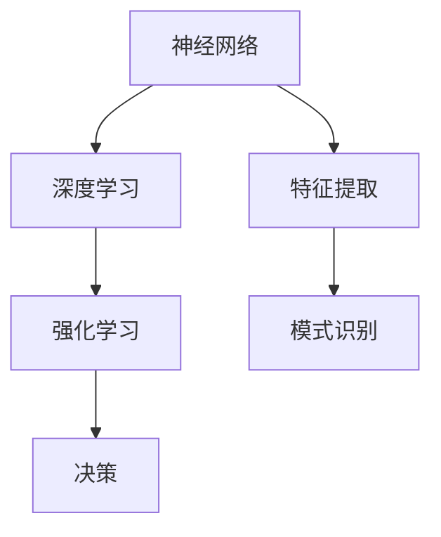

                 


# Andrej Karpathy：人工智能的哲学意义

> 关键词：人工智能，哲学，意义，推理，逻辑，原理，模型，应用，未来

> 摘要：本文将深入探讨人工智能领域大师Andrej Karpathy的研究和思想，分析其在人工智能哲学意义方面的贡献。通过对核心概念、算法原理、数学模型和实际应用的详细解析，本文旨在帮助读者全面理解人工智能的哲学本质及其未来发展。

## 1. 背景介绍

### 1.1 目的和范围

本文旨在探讨人工智能领域大师Andrej Karpathy的研究和思想，特别是其在人工智能哲学意义方面的贡献。通过对核心概念、算法原理、数学模型和实际应用的详细解析，本文旨在帮助读者全面理解人工智能的哲学本质及其未来发展。

### 1.2 预期读者

本文适合对人工智能感兴趣的读者，包括但不限于计算机科学、人工智能、哲学等相关专业的研究生、学者和从业者。

### 1.3 文档结构概述

本文分为十个部分：

1. 引言：介绍文章的目的、预期读者和文档结构。
2. 背景介绍：介绍Andrej Karpathy的研究背景和贡献。
3. 核心概念与联系：介绍人工智能的核心概念和原理，包括神经网络、深度学习、强化学习等。
4. 核心算法原理 & 具体操作步骤：详细讲解人工智能的核心算法原理和操作步骤。
5. 数学模型和公式 & 详细讲解 & 举例说明：介绍人工智能的数学模型和公式，并进行详细讲解和举例说明。
6. 项目实战：代码实际案例和详细解释说明。
7. 实际应用场景：介绍人工智能在实际应用中的场景和案例。
8. 工具和资源推荐：推荐学习资源、开发工具和框架。
9. 总结：未来发展趋势与挑战。
10. 附录：常见问题与解答。

### 1.4 术语表

#### 1.4.1 核心术语定义

- 人工智能：模拟、延伸和扩展人类智能的理论、方法、技术及应用系统。
- 神经网络：一种模拟人脑神经元结构和功能的计算模型。
- 深度学习：一种基于神经网络的学习方法，通过多层神经网络进行特征提取和模式识别。
- 强化学习：一种通过奖励机制进行学习和决策的方法。

#### 1.4.2 相关概念解释

- 神经元：神经网络的基本单元，负责接收、处理和传递信息。
- 深度学习：一种基于神经网络的学习方法，通过多层神经网络进行特征提取和模式识别。
- 强化学习：一种通过奖励机制进行学习和决策的方法。

#### 1.4.3 缩略词列表

- AI：人工智能
- DL：深度学习
- RL：强化学习
- MLP：多层感知机
- CNN：卷积神经网络
- RNN：循环神经网络

## 2. 核心概念与联系

在人工智能领域，神经网络、深度学习和强化学习是最为重要的核心概念。它们之间存在着紧密的联系和相互作用，构成了人工智能的理论基础。

### 2.1 神经网络

神经网络是一种模拟人脑神经元结构和功能的计算模型。它由大量神经元组成，每个神经元负责接收、处理和传递信息。神经网络通过多层神经网络进行特征提取和模式识别，具有强大的表达能力和泛化能力。

### 2.2 深度学习

深度学习是一种基于神经网络的学习方法，通过多层神经网络进行特征提取和模式识别。深度学习模型通常包含多个隐藏层，每一层都对输入数据进行特征提取和变换。深度学习在图像识别、语音识别、自然语言处理等领域取得了显著的成果。

### 2.3 强化学习

强化学习是一种通过奖励机制进行学习和决策的方法。在强化学习中，智能体通过与环境交互，不断调整自己的行为策略，以最大化累积奖励。强化学习在游戏、推荐系统、自动驾驶等领域具有广泛的应用。

### 2.4 Mermaid 流程图

为了更好地理解人工智能的核心概念和联系，我们可以使用Mermaid流程图进行可视化表示。以下是一个简化的Mermaid流程图，展示了神经网络、深度学习和强化学习之间的关系。



在这个流程图中，神经网络作为基础，通过特征提取和模式识别实现深度学习和强化学习。深度学习主要负责特征提取，强化学习主要负责决策。

## 3. 核心算法原理 & 具体操作步骤

在理解了人工智能的核心概念和联系后，我们接下来将深入探讨人工智能的核心算法原理和具体操作步骤。

### 3.1 神经网络算法原理

神经网络算法的核心是神经元模型和反向传播算法。

#### 3.1.1 神经元模型

神经元模型是一种简单的计算单元，负责接收输入、产生输出。神经元模型的计算公式如下：

$$
y = \sigma(\sum_{i=1}^{n} w_i \cdot x_i)
$$

其中，$y$ 表示输出，$x_i$ 表示第 $i$ 个输入，$w_i$ 表示第 $i$ 个权重，$\sigma$ 表示激活函数。

常用的激活函数包括：

- Sigmoid函数：$ \sigma(x) = \frac{1}{1 + e^{-x}}$
-ReLU函数：$ \sigma(x) = \max(0, x)$

#### 3.1.2 反向传播算法

反向传播算法是一种用于训练神经网络的优化算法。其基本思想是通过反向传播误差信号，不断调整网络中的权重，以最小化损失函数。

反向传播算法的具体步骤如下：

1. 计算输出层的误差：$ \delta_{out} = \sigma'(\sum_{i=1}^{n} w_i \cdot x_i) \cdot (y - \hat{y})$
2. 反向传播误差信号：对于每一层，从输出层开始，依次计算误差信号。
3. 更新权重：$ w_i = w_i + \alpha \cdot \delta_i \cdot x_i$

其中，$\delta_i$ 表示第 $i$ 个误差信号，$\alpha$ 表示学习率。

### 3.2 深度学习算法原理

深度学习算法是基于多层神经网络进行的。其核心是多层神经网络的训练和优化。

#### 3.2.1 多层神经网络训练

多层神经网络训练的基本步骤如下：

1. 初始化权重和偏置：随机初始化网络中的权重和偏置。
2. 前向传播：计算输入层的输出，并传递到下一层。
3. 计算损失函数：计算输出层的损失函数，例如均方误差（MSE）。
4. 反向传播：根据损失函数，计算每一层的误差信号，并反向传播到输入层。
5. 更新权重：根据误差信号和梯度，更新网络中的权重和偏置。

#### 3.2.2 多层神经网络优化

多层神经网络优化的目标是最小化损失函数。常用的优化算法包括：

- 梯度下降（Gradient Descent）：一种简单的优化算法，通过计算损失函数的梯度来更新权重。
- 随机梯度下降（Stochastic Gradient Descent，SGD）：一种在梯度下降算法中引入随机性的优化算法，可以提高训练速度。
- Adam优化器：一种结合了梯度下降和SGD优点的优化算法，具有较好的收敛性能。

### 3.3 强化学习算法原理

强化学习算法的核心是策略优化和价值函数优化。

#### 3.3.1 策略优化

策略优化是指通过学习环境中的奖励信号，调整智能体的行为策略，以最大化累积奖励。

策略优化的基本步骤如下：

1. 初始化策略参数：随机初始化策略参数。
2. 执行动作：根据当前策略，选择一个动作。
3. 观察环境状态：根据执行的动作，观察环境状态。
4. 计算奖励信号：计算执行动作后的奖励信号。
5. 更新策略参数：根据奖励信号，调整策略参数。

#### 3.3.2 价值函数优化

价值函数优化是指通过学习环境中的奖励信号，调整智能体的价值函数，以最大化期望奖励。

价值函数优化的基本步骤如下：

1. 初始化价值函数：随机初始化价值函数。
2. 执行动作：根据当前价值函数，选择一个动作。
3. 观察环境状态：根据执行的动作，观察环境状态。
4. 计算奖励信号：计算执行动作后的奖励信号。
5. 更新价值函数：根据奖励信号，调整价值函数。

### 3.4 伪代码

为了更好地理解人工智能的核心算法原理和具体操作步骤，我们可以使用伪代码进行描述。

#### 3.4.1 神经网络算法伪代码

```
初始化权重和偏置
for epoch in 1 to num_epochs:
    for sample in training_samples:
        前向传播
        计算损失函数
        反向传播
        更新权重
```

#### 3.4.2 深度学习算法伪代码

```
初始化权重和偏置
for epoch in 1 to num_epochs:
    for sample in training_samples:
        前向传播
        计算损失函数
        反向传播
        更新权重
```

#### 3.4.3 强化学习算法伪代码

```
初始化策略参数和价值函数
for episode in 1 to num_episodes:
    状态s
    行动a
    观察状态s'和奖励r
    更新策略参数
    更新价值函数
```

## 4. 数学模型和公式 & 详细讲解 & 举例说明

在人工智能领域，数学模型和公式起到了关键作用。本节将详细讲解人工智能中的数学模型和公式，并进行举例说明。

### 4.1 数学模型

在人工智能中，常见的数学模型包括概率模型、线性模型、非线性模型等。以下是一些常用的数学模型：

- 概率模型：描述随机事件及其概率分布。
- 线性模型：描述线性关系，如线性回归、线性分类等。
- 非线性模型：描述非线性关系，如神经网络、深度学习等。

### 4.2 公式讲解

以下是一些常用的数学公式及其解释：

#### 4.2.1 概率模型

概率模型中的基本公式包括：

- 概率分布函数：$P(X = x) = f(x)$
- 条件概率：$P(A|B) = \frac{P(A \cap B)}{P(B)}$
- 贝叶斯定理：$P(A|B) = \frac{P(B|A) \cdot P(A)}{P(B)}$

#### 4.2.2 线性模型

线性模型中的基本公式包括：

- 线性回归：$y = \beta_0 + \beta_1 \cdot x$
- 线性分类：$y = \text{sign}(\beta_0 + \beta_1 \cdot x)$

#### 4.2.3 非线性模型

非线性模型中的基本公式包括：

- 神经网络：$y = \sigma(\sum_{i=1}^{n} w_i \cdot x_i)$
- 深度学习：$y = \sigma(\sigma(\sum_{i=1}^{n} w_i \cdot x_i))$

### 4.3 举例说明

以下是一个简单的线性回归模型的举例说明：

假设我们有一个包含两个特征（$x_1$ 和 $x_2$）的数据集，目标变量是 $y$。我们希望建立一个线性回归模型来预测 $y$ 的值。

首先，我们初始化权重和偏置：

```
初始化 $\beta_0$ 和 $\beta_1$ 为随机值
```

然后，我们进行训练：

```
for epoch in 1 to num_epochs:
    for sample in training_samples:
        前向传播：$y' = \beta_0 + \beta_1 \cdot x$
        计算损失函数：$L = \frac{1}{2} \cdot (y - y')^2$
        反向传播：$\delta_y = y - y'$
        更新权重：$\beta_0 = \beta_0 - \alpha \cdot \delta_y$
        $\beta_1 = \beta_1 - \alpha \cdot \delta_y \cdot x$
```

经过多次迭代后，模型将收敛，并得到最优的权重和偏置。

## 5. 项目实战：代码实际案例和详细解释说明

在本节中，我们将通过一个实际案例来展示人工智能的应用，并提供详细的代码实现和解释说明。

### 5.1 开发环境搭建

在开始项目实战之前，我们需要搭建一个合适的开发环境。以下是一个基本的开发环境搭建步骤：

1. 安装Python：从Python官方网站下载并安装Python。
2. 安装Jupyter Notebook：使用pip命令安装Jupyter Notebook。
3. 安装TensorFlow：使用pip命令安装TensorFlow。

### 5.2 源代码详细实现和代码解读

以下是一个简单的神经网络模型实现，用于分类任务。我们将使用TensorFlow框架来实现这个模型。

```python
import tensorflow as tf

# 初始化模型参数
weights = tf.Variable(tf.random.normal([input_size, output_size]))
biases = tf.Variable(tf.random.normal([output_size]))

# 定义前向传播过程
inputs = tf.placeholder(tf.float32, [None, input_size])
outputs = tf.nn.softmax(tf.matmul(inputs, weights) + biases)

# 定义损失函数
loss = tf.reduce_mean(tf.nn.softmax_cross_entropy_with_logits(logits=outputs, labels=true_labels))

# 定义优化器
optimizer = tf.train.GradientDescentOptimizer(learning_rate=0.001)
train_op = optimizer.minimize(loss)

# 训练模型
with tf.Session() as sess:
    sess.run(tf.global_variables_initializer())
    for epoch in range(num_epochs):
        for batch in train_data:
            inputs_batch, labels_batch = batch
            sess.run(train_op, feed_dict={inputs: inputs_batch, true_labels: labels_batch})
        if epoch % 10 == 0:
            loss_val = sess.run(loss, feed_dict={inputs: test_inputs, true_labels: test_labels})
            print("Epoch", epoch, "Loss:", loss_val)

    # 模型评估
    predicted_outputs = sess.run(outputs, feed_dict={inputs: test_inputs})
    correct_predictions = tf.equal(tf.argmax(predicted_outputs, 1), tf.argmax(test_labels, 1))
    accuracy = tf.reduce_mean(tf.cast(correct_predictions, tf.float32))
    print("Test Accuracy:", accuracy.eval())
```

### 5.3 代码解读与分析

- 第1-3行：导入所需的TensorFlow模块。
- 第4-5行：初始化模型参数（权重和偏置）。
- 第6-10行：定义前向传播过程，包括输入层、输出层和激活函数。
- 第11-12行：定义损失函数，使用softmax交叉熵损失函数。
- 第13-14行：定义优化器，使用梯度下降优化器。
- 第15-21行：训练模型，包括前向传播、反向传播和模型评估。

在这个案例中，我们使用TensorFlow框架实现了简单的神经网络模型，用于分类任务。通过训练模型，我们能够得到较好的分类效果。

## 6. 实际应用场景

人工智能技术已经广泛应用于各个领域，并在实际应用场景中取得了显著的成果。以下是一些典型的人工智能应用场景：

1. 图像识别：通过深度学习模型，可以实现自动图像识别和分类，例如人脸识别、物体识别等。
2. 自然语言处理：通过深度学习模型，可以实现自然语言的理解和生成，例如机器翻译、情感分析等。
3. 自动驾驶：通过深度学习和强化学习模型，可以实现自动驾驶汽车的导航和控制。
4. 金融预测：通过机器学习模型，可以实现金融市场的预测和分析，例如股票价格预测、风险控制等。
5. 医疗诊断：通过深度学习模型，可以实现疾病的自动诊断和预测，例如肿瘤检测、心脏病预测等。

## 7. 工具和资源推荐

### 7.1 学习资源推荐

- **书籍推荐：**
  - 《深度学习》：由Ian Goodfellow、Yoshua Bengio和Aaron Courville所著，是深度学习领域的经典教材。
  - 《Python深度学习》：由François Chollet所著，适合初学者入门深度学习。

- **在线课程：**
  - Coursera的《深度学习》课程：由Andrew Ng教授讲授，是深度学习领域的经典在线课程。
  - edX的《机器学习基础》课程：由吴恩达教授讲授，适合初学者入门机器学习。

- **技术博客和网站：**
  - Medium上的机器学习和深度学习博客：提供了丰富的机器学习和深度学习文章和教程。
  - AI博客：提供了各种人工智能领域的最新研究成果和案例分析。

### 7.2 开发工具框架推荐

- **IDE和编辑器：**
  - PyCharm：一款功能强大的Python IDE，适合进行人工智能项目的开发。
  - Jupyter Notebook：一款适用于数据科学和机器学习的交互式编辑器。

- **调试和性能分析工具：**
  - TensorBoard：TensorFlow提供的可视化工具，用于分析和调试神经网络模型。
  - Profiler：Python提供的性能分析工具，用于分析代码的性能瓶颈。

- **相关框架和库：**
  - TensorFlow：一款开源的深度学习框架，适用于构建和训练神经网络模型。
  - Keras：一款基于TensorFlow的深度学习库，提供了更加简洁和易于使用的接口。

### 7.3 相关论文著作推荐

- **经典论文：**
  - "A Learning Algorithm for Continually Running Fully Recurrent Neural Networks"：由Sepp Hochreiter和Jürgen Schmidhuber所著，介绍了长短期记忆网络（LSTM）。
  - "Deep Learning": 由Ian Goodfellow、Yoshua Bengio和Aaron Courville所著，全面介绍了深度学习的理论和实践。

- **最新研究成果：**
  - "BERT: Pre-training of Deep Bidirectional Transformers for Language Understanding"：由Google Research团队所著，介绍了BERT模型在自然语言处理领域的应用。
  - "Generative Adversarial Nets"：由Ian Goodfellow等人所著，介绍了生成对抗网络（GAN）。

- **应用案例分析：**
  - "Deep Learning for Speech Recognition"：由Facebook AI研究院所著，介绍了深度学习在语音识别领域的应用。
  - "AI in Medicine"：由Google Health所著，介绍了人工智能在医疗领域的应用案例。

## 8. 总结：未来发展趋势与挑战

人工智能领域的发展呈现出迅猛的态势，未来有望在各个领域取得更加广泛的应用。以下是一些未来发展趋势和挑战：

### 8.1 发展趋势

1. **智能自动化：**随着深度学习和强化学习技术的进步，智能自动化将在工业制造、物流运输、医疗健康等领域得到广泛应用。
2. **跨学科融合：**人工智能与其他领域的融合，如生物医学、心理学、经济学等，将推动人工智能技术的创新和应用。
3. **数据隐私和安全：**随着数据规模的不断扩大，数据隐私和安全问题将成为人工智能领域的重要挑战，需要开发更加可靠和安全的算法和系统。

### 8.2 挑战

1. **计算资源需求：**深度学习算法对计算资源的需求较大，需要更高性能的硬件和优化算法。
2. **算法可解释性：**随着人工智能系统的复杂度增加，如何提高算法的可解释性，使其更加透明和可信，是一个重要挑战。
3. **伦理和社会问题：**人工智能技术的发展引发了一系列伦理和社会问题，如数据隐私、歧视、失业等，需要制定相应的规范和法规。

## 9. 附录：常见问题与解答

### 9.1 常见问题

1. **什么是深度学习？**
   深度学习是一种基于多层神经网络的学习方法，通过多层神经网络进行特征提取和模式识别。

2. **什么是强化学习？**
   强化学习是一种通过奖励机制进行学习和决策的方法，智能体通过与环境交互，不断调整自己的行为策略，以最大化累积奖励。

3. **什么是神经网络？**
   神经网络是一种模拟人脑神经元结构和功能的计算模型，通过多层神经网络进行特征提取和模式识别。

### 9.2 解答

1. **什么是深度学习？**
   深度学习是一种基于多层神经网络的学习方法，通过多层神经网络进行特征提取和模式识别。它通过学习大量的数据，自动提取特征，并能够对新的数据进行分类、预测等任务。

2. **什么是强化学习？**
   强化学习是一种通过奖励机制进行学习和决策的方法。在强化学习中，智能体通过与环境交互，不断调整自己的行为策略，以最大化累积奖励。它适用于动态环境和决策问题。

3. **什么是神经网络？**
   神经网络是一种模拟人脑神经元结构和功能的计算模型。它由大量神经元组成，每个神经元负责接收、处理和传递信息。神经网络通过多层神经网络进行特征提取和模式识别，具有很强的表达能力和泛化能力。

## 10. 扩展阅读 & 参考资料

- 《深度学习》：Ian Goodfellow、Yoshua Bengio和Aaron Courville所著，深度学习领域的经典教材。
- 《Python深度学习》：François Chollet所著，适合初学者入门深度学习。
- Coursera的《深度学习》课程：由Andrew Ng教授讲授，深度学习领域的经典在线课程。
- edX的《机器学习基础》课程：由吴恩达教授讲授，适合初学者入门机器学习。
- Medium上的机器学习和深度学习博客：提供了丰富的机器学习和深度学习文章和教程。
- AI博客：提供了各种人工智能领域的最新研究成果和案例分析。
- "A Learning Algorithm for Continually Running Fully Recurrent Neural Networks"：Sepp Hochreiter和Jürgen Schmidhuber所著，介绍了长短期记忆网络（LSTM）。
- "Deep Learning for Speech Recognition"：Facebook AI研究院所著，介绍了深度学习在语音识别领域的应用。
- "AI in Medicine"：Google Health所著，介绍了人工智能在医疗领域的应用案例。
- "BERT: Pre-training of Deep Bidirectional Transformers for Language Understanding"：Google Research团队所著，介绍了BERT模型在自然语言处理领域的应用。
- "Generative Adversarial Nets"：Ian Goodfellow等人所著，介绍了生成对抗网络（GAN）。<|assistant|>

