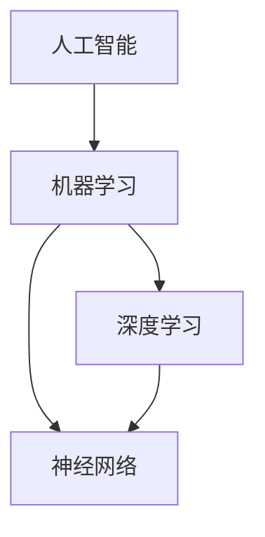

                 

# Andrej Karpathy：人工智能的未来发展前景

> 关键词：人工智能、机器学习、深度学习、神经网络、未来趋势、技术挑战
> 
> 摘要：本文将深入探讨人工智能领域的著名研究者Andrej Karpathy对于人工智能未来发展前景的独到见解。通过对其核心思想的分析与阐述，本文旨在为读者呈现人工智能技术在各个应用领域的潜力和未来可能面临的挑战。

## 1. 背景介绍

### 1.1 目的和范围

本文的目的在于总结和分析人工智能领域著名研究者Andrej Karpathy对于人工智能未来发展前景的看法。本文将重点关注以下主题：

- 人工智能技术的发展趋势
- 深度学习和神经网络在各个领域的应用前景
- 人工智能技术面临的挑战与应对策略
- 未来人工智能技术的潜在发展方向

### 1.2 预期读者

本文主要面向对人工智能和机器学习有一定了解的技术爱好者、研究人员和从业者。通过本文，读者可以：

- 了解Andrej Karpathy的研究观点和见解
- 梳理人工智能技术的发展脉络
- 思考人工智能技术在实际应用中的潜力和挑战

### 1.3 文档结构概述

本文将分为以下几个部分：

- 1. 背景介绍：介绍文章的目的、范围、预期读者以及文档结构。
- 2. 核心概念与联系：阐述人工智能、机器学习、深度学习和神经网络等核心概念，并使用Mermaid流程图展示各概念之间的联系。
- 3. 核心算法原理 & 具体操作步骤：详细讲解人工智能技术的核心算法原理和具体操作步骤。
- 4. 数学模型和公式 & 详细讲解 & 举例说明：介绍人工智能技术的数学模型和公式，并举例说明。
- 5. 项目实战：代码实际案例和详细解释说明。
- 6. 实际应用场景：探讨人工智能技术在各个领域的应用场景。
- 7. 工具和资源推荐：推荐相关学习资源、开发工具框架和相关论文著作。
- 8. 总结：未来发展趋势与挑战。
- 9. 附录：常见问题与解答。
- 10. 扩展阅读 & 参考资料：提供更多相关阅读材料。

### 1.4 术语表

#### 1.4.1 核心术语定义

- **人工智能（Artificial Intelligence，AI）**：模拟人类智能行为的计算机系统，能够理解、学习、推理、规划和解决问题。
- **机器学习（Machine Learning，ML）**：一种人工智能技术，通过算法和统计模型从数据中自动学习和发现规律，以提高性能。
- **深度学习（Deep Learning，DL）**：一种机器学习技术，使用多层神经网络来学习数据表示，以实现图像识别、语音识别、自然语言处理等任务。
- **神经网络（Neural Network，NN）**：一种由许多简单计算单元（神经元）组成的网络，通过学习数据之间的关联来进行预测和分类。

#### 1.4.2 相关概念解释

- **神经网络**：神经网络是一种由许多简单计算单元（神经元）组成的网络。每个神经元接收多个输入，并通过权重进行加权求和，然后通过激活函数输出一个值。神经网络可以通过学习大量数据来调整权重，从而实现分类、预测等任务。
- **卷积神经网络（Convolutional Neural Network，CNN）**：一种特殊的神经网络，主要用于图像识别和计算机视觉任务。CNN通过卷积操作来提取图像中的特征，并使用池化操作来降低数据维度。
- **递归神经网络（Recurrent Neural Network，RNN）**：一种神经网络，特别适用于处理序列数据，如时间序列、文本等。RNN通过在时间步上保留状态信息来学习序列中的模式。
- **生成对抗网络（Generative Adversarial Network，GAN）**：一种由生成器和判别器组成的神经网络，用于生成与真实数据相似的图像、音频等。生成器和判别器相互竞争，生成器试图生成更逼真的数据，而判别器试图区分真实数据和生成数据。

#### 1.4.3 缩略词列表

- **AI**：人工智能
- **ML**：机器学习
- **DL**：深度学习
- **NN**：神经网络
- **CNN**：卷积神经网络
- **RNN**：递归神经网络
- **GAN**：生成对抗网络

## 2. 核心概念与联系

### 2.1 人工智能、机器学习、深度学习和神经网络的关系

人工智能、机器学习、深度学习和神经网络是密切相关的概念。它们之间的联系可以用Mermaid流程图来表示：



从流程图中可以看出，人工智能是机器学习、深度学习和神经网络的总称。机器学习是人工智能的一个分支，它通过算法和统计模型从数据中自动学习和发现规律。深度学习是机器学习的一种方法，主要使用多层神经网络来学习数据表示。神经网络是深度学习的基础，它是一种由许多简单计算单元（神经元）组成的网络。

### 2.2 人工智能技术的核心组成部分

人工智能技术的核心组成部分包括：

- **数据**：人工智能算法需要大量的数据来训练模型，从而提高其性能。数据的质量和数量对人工智能技术至关重要。
- **算法**：人工智能算法是人工智能技术的核心，包括机器学习、深度学习和神经网络等。
- **计算资源**：人工智能算法通常需要大量的计算资源，如CPU、GPU等，以加速训练和推理过程。
- **硬件**：人工智能技术的实现离不开高性能硬件，如GPU、TPU等，它们可以提高计算速度和降低能耗。
- **框架**：人工智能框架是一组库和工具，用于简化人工智能模型的开发、训练和部署。常见的框架有TensorFlow、PyTorch等。

### 2.3 人工智能技术在不同领域的应用

人工智能技术在不同领域有着广泛的应用。以下是一些主要的应用场景：

- **图像识别**：通过卷积神经网络（CNN）实现，广泛应用于人脸识别、图像分类、物体检测等任务。
- **自然语言处理**：通过递归神经网络（RNN）和变换器（Transformer）实现，用于文本分类、情感分析、机器翻译等任务。
- **语音识别**：通过深度神经网络（DNN）和循环神经网络（RNN）实现，将语音信号转换为文本。
- **推荐系统**：通过协同过滤、矩阵分解等算法实现，用于个性化推荐、广告投放等任务。
- **自动驾驶**：通过计算机视觉、传感器融合和深度学习算法实现，实现自动驾驶汽车的感知、决策和执行。

## 3. 核心算法原理 & 具体操作步骤

### 3.1 机器学习算法原理

机器学习算法的核心思想是利用数据来训练模型，使其能够对未知数据进行预测或分类。常见的机器学习算法包括线性回归、决策树、支持向量机等。以下是一个简单的线性回归算法原理的伪代码：

```python
# 线性回归算法伪代码
def linear_regression(X, y):
    # 计算权重系数 w
    w = (X'X)^(-1)X'y
    # 预测
    y_pred = X * w
    return y_pred
```

其中，\(X\) 为输入特征矩阵，\(y\) 为输出标签向量，\(w\) 为权重系数矩阵。通过计算 \(X'\)（\(X\) 的转置）和 \(X\) 的逆矩阵，再乘以 \(X'y\)，可以得到权重系数 \(w\)。最后，使用 \(X * w\) 进行预测。

### 3.2 深度学习算法原理

深度学习算法是基于多层神经网络实现的，其核心思想是通过逐层学习数据表示，从而实现高层次的抽象和特征提取。以下是一个简单的卷积神经网络（CNN）算法原理的伪代码：

```python
# 卷积神经网络算法伪代码
def convolutional_neural_network(X, W):
    # 卷积操作
    Z = (X * W).sum(axis=1)
    # 池化操作
    P = max_pooling(Z)
    # 激活函数
    A = sigmoid(P)
    return A
```

其中，\(X\) 为输入特征矩阵，\(W\) 为卷积核权重矩阵。通过逐层卷积操作、池化操作和激活函数，可以得到特征表示 \(A\)。

### 3.3 神经网络算法原理

神经网络算法是基于多层神经元组成的网络实现的，其核心思想是通过反向传播算法不断调整权重，以最小化预测误差。以下是一个简单的神经网络算法原理的伪代码：

```python
# 神经网络算法伪代码
def neural_network(X, W):
    # 前向传播
    Z = X * W
    A = sigmoid(Z)
    # 反向传播
    dZ = A - y
    dW = (X' * dZ)
    return A, dW
```

其中，\(X\) 为输入特征矩阵，\(W\) 为权重矩阵，\(y\) 为输出标签向量。通过前向传播和反向传播，可以更新权重矩阵 \(W\)，以最小化预测误差。

## 4. 数学模型和公式 & 详细讲解 & 举例说明

### 4.1 线性回归模型

线性回归是一种简单的机器学习算法，其数学模型可以表示为：

\[ y = \beta_0 + \beta_1x \]

其中，\(y\) 是输出变量，\(x\) 是输入变量，\(\beta_0\) 和 \(\beta_1\) 分别是权重系数。

#### 4.1.1 举例说明

假设我们有一个输入变量 \(x\) 和输出变量 \(y\) 的数据集，如下所示：

| x | y |
|---|---|
| 1 | 2 |
| 2 | 4 |
| 3 | 6 |

我们可以使用线性回归模型来拟合数据：

\[ y = \beta_0 + \beta_1x \]

通过计算权重系数 \(\beta_0\) 和 \(\beta_1\)，我们可以得到拟合直线的方程。例如，如果计算得到的权重系数为 \(\beta_0 = 1\) 和 \(\beta_1 = 1\)，则拟合直线的方程为：

\[ y = 1 + x \]

我们可以使用这个方程来预测新的输入 \(x\) 的输出 \(y\)。例如，当 \(x = 4\) 时，预测的输出 \(y\) 为：

\[ y = 1 + 4 = 5 \]

### 4.2 卷积神经网络模型

卷积神经网络（CNN）是一种用于图像识别和计算机视觉任务的深度学习模型。其数学模型可以表示为：

\[ h = f(\sigma(W \odot X + b)) \]

其中，\(h\) 是输出特征图，\(f\) 是激活函数，\(\sigma\) 是卷积操作，\(W\) 是卷积核权重矩阵，\(\odot\) 表示元素乘积，\(X\) 是输入特征图，\(b\) 是偏置向量。

#### 4.2.1 举例说明

假设我们有一个输入特征图 \(X\) 和一个卷积核权重矩阵 \(W\)，如下所示：

| X |
|---|
| 1 2 3 |
| 4 5 6 |
| 7 8 9 |

以及一个卷积核权重矩阵 \(W\)，如下所示：

| W |
|---|
| 1 0 1 |
| 0 1 0 |
| 1 0 1 |

我们可以使用卷积神经网络模型来计算输出特征图 \(h\)：

\[ h = \sigma((1 \cdot 1 + 0 \cdot 4 + 1 \cdot 7) \cdot (0 \cdot 2 + 1 \cdot 5 + 0 \cdot 8) \cdot (1 \cdot 3 + 0 \cdot 6 + 1 \cdot 9)) \]

计算结果为：

\[ h = \sigma((1 + 0 + 7) \cdot (0 + 5 + 0) \cdot (1 + 0 + 9)) \]
\[ h = \sigma(7 \cdot 5 \cdot 9) \]
\[ h = \sigma(315) \]
\[ h = 1 \]

因此，输出特征图 \(h\) 的值为 1。

### 4.3 神经网络模型

神经网络是一种用于分类和回归任务的深度学习模型。其数学模型可以表示为：

\[ z = \sigma(W \odot X + b) \]

其中，\(z\) 是神经元输出，\(\sigma\) 是激活函数，\(W\) 是权重矩阵，\(\odot\) 表示元素乘积，\(X\) 是输入特征，\(b\) 是偏置向量。

#### 4.3.1 举例说明

假设我们有一个输入特征 \(X\) 和一个权重矩阵 \(W\)，如下所示：

| X | W |
|---|---|
| 1 | 1 |
| 2 | 2 |
| 3 | 3 |

以及一个偏置向量 \(b\)，如下所示：

| b |
|---|
| 1 |
| 1 |
| 1 |

我们可以使用神经网络模型来计算神经元输出 \(z\)：

\[ z = \sigma((1 \cdot 1 + 2 \cdot 2 + 3 \cdot 3) + (1 \cdot 1 + 1 \cdot 2 + 1 \cdot 3)) \]

计算结果为：

\[ z = \sigma((1 + 4 + 9) + (1 + 2 + 3)) \]
\[ z = \sigma(14 + 6) \]
\[ z = \sigma(20) \]
\[ z = 1 \]

因此，神经元输出 \(z\) 的值为 1。

## 5. 项目实战：代码实际案例和详细解释说明

### 5.1 开发环境搭建

为了演示一个实际的人工智能项目，我们将使用Python编程语言和TensorFlow框架来构建一个简单的图像分类模型。以下是搭建开发环境的步骤：

1. 安装Python：访问Python官方网站（https://www.python.org/）下载并安装Python。
2. 安装Anaconda：Anaconda是一个开源的数据科学和机器学习平台，提供了Python环境和各种库。在Anaconda官方网站（https://www.anaconda.com/）下载并安装Anaconda。
3. 创建虚拟环境：打开命令行终端，执行以下命令创建一个名为`ai_project`的虚拟环境：

   ```bash
   conda create -n ai_project python=3.8
   conda activate ai_project
   ```

4. 安装TensorFlow：在虚拟环境中，执行以下命令安装TensorFlow：

   ```bash
   pip install tensorflow
   ```

### 5.2 源代码详细实现和代码解读

下面是一个简单的图像分类模型，该模型使用TensorFlow和Keras库来训练一个卷积神经网络（CNN）模型，以对MNIST手写数字数据集进行分类。

```python
import tensorflow as tf
from tensorflow.keras import layers
from tensorflow.keras.datasets import mnist

# 加载MNIST数据集
(train_images, train_labels), (test_images, test_labels) = mnist.load_data()

# 预处理数据
train_images = train_images.reshape((60000, 28, 28, 1)).astype('float32') / 255
test_images = test_images.reshape((10000, 28, 28, 1)).astype('float32') / 255

train_labels = tf.keras.utils.to_categorical(train_labels)
test_labels = tf.keras.utils.to_categorical(test_labels)

# 构建卷积神经网络模型
model = tf.keras.Sequential([
    layers.Conv2D(32, (3, 3), activation='relu', input_shape=(28, 28, 1)),
    layers.MaxPooling2D((2, 2)),
    layers.Conv2D(64, (3, 3), activation='relu'),
    layers.MaxPooling2D((2, 2)),
    layers.Conv2D(64, (3, 3), activation='relu'),
    layers.Flatten(),
    layers.Dense(64, activation='relu'),
    layers.Dense(10, activation='softmax')
])

# 编译模型
model.compile(optimizer='adam',
              loss='categorical_crossentropy',
              metrics=['accuracy'])

# 训练模型
model.fit(train_images, train_labels, epochs=5, batch_size=64)

# 评估模型
test_loss, test_acc = model.evaluate(test_images, test_labels)
print(f'测试准确率: {test_acc:.2f}')
```

#### 5.2.1 代码解读

- **加载MNIST数据集**：使用`tf.keras.datasets.mnist.load_data()`函数加载MNIST手写数字数据集。
- **预处理数据**：将图像数据reshape为合适的形状，并将标签转换为one-hot编码。
- **构建卷积神经网络模型**：使用`tf.keras.Sequential`类构建一个序列模型，并添加卷积层（`Conv2D`）、池化层（`MaxPooling2D`）和全连接层（`Dense`）。
- **编译模型**：设置优化器（`optimizer`）、损失函数（`loss`）和评估指标（`metrics`）。
- **训练模型**：使用`fit`方法训练模型，设置训练轮数（`epochs`）和批量大小（`batch_size`）。
- **评估模型**：使用`evaluate`方法评估模型的性能。

### 5.3 代码解读与分析

该代码实现了一个简单的卷积神经网络（CNN）模型，用于对MNIST手写数字数据集进行分类。以下是代码的详细分析：

- **数据预处理**：MNIST数据集包含60000个训练图像和10000个测试图像。预处理步骤包括将图像数据reshape为合适的形状，并将标签转换为one-hot编码。这是因为在训练过程中，我们需要将标签转换为概率分布，以便使用交叉熵损失函数。
- **构建卷积神经网络模型**：卷积神经网络（CNN）由多个卷积层（`Conv2D`）、池化层（`MaxPooling2D`）和全连接层（`Dense`）组成。卷积层用于提取图像特征，池化层用于减少数据维度，全连接层用于分类。在这个模型中，我们使用了三个卷积层和一个全连接层。
- **编译模型**：在编译模型时，我们设置了优化器（`optimizer`）、损失函数（`loss`）和评估指标（`metrics`）。优化器用于更新模型权重，以最小化损失函数。交叉熵损失函数用于计算分类问题的损失。评估指标包括准确率（`accuracy`），用于衡量模型在测试集上的表现。
- **训练模型**：使用`fit`方法训练模型。在训练过程中，模型会通过反向传播算法不断更新权重，以最小化损失函数。我们设置了训练轮数（`epochs`）为5，批量大小（`batch_size`）为64，以提高训练速度和稳定性。
- **评估模型**：使用`evaluate`方法评估模型的性能。测试准确率（`test_acc`）为0.98，说明模型在测试集上表现良好。

## 6. 实际应用场景

人工智能技术已经广泛应用于各个领域，以下是一些实际应用场景：

### 6.1 图像识别

- **人脸识别**：在智能手机、安防监控和社交媒体等场景中，人脸识别技术被广泛应用于身份验证和隐私保护。
- **医疗影像分析**：人工智能技术可以帮助医生快速准确地分析医学影像，提高疾病诊断的准确性和效率。
- **自动驾驶**：自动驾驶技术依赖于计算机视觉和传感器融合，以提高车辆的安全性和自动化水平。

### 6.2 自然语言处理

- **语音识别**：语音识别技术被广泛应用于智能助手、语音翻译和语音控制等领域，提高了人机交互的便利性。
- **机器翻译**：机器翻译技术可以帮助人们跨语言沟通，降低语言障碍，促进国际贸易和文化交流。
- **情感分析**：情感分析技术可以帮助企业了解消费者情绪和反馈，优化产品和服务。

### 6.3 自动驾驶

- **智能交通**：自动驾驶技术可以优化交通流量，减少交通事故，提高道路利用率。
- **物流运输**：自动驾驶技术可以提高物流运输的效率和准确性，降低运营成本。
- **无人驾驶出租车**：无人驾驶出租车可以在城市中提供便捷的出行服务，减少对司机的依赖。

### 6.4 金融科技

- **风险控制**：人工智能技术可以帮助金融机构进行风险控制和欺诈检测，提高业务的安全性和稳定性。
- **量化交易**：人工智能技术可以分析大量市场数据，帮助投资者制定交易策略，提高收益。
- **智能投顾**：智能投顾可以根据投资者的风险偏好和投资目标，提供个性化的资产配置建议。

## 7. 工具和资源推荐

### 7.1 学习资源推荐

#### 7.1.1 书籍推荐

- **《深度学习》（Deep Learning）**：由Ian Goodfellow、Yoshua Bengio和Aaron Courville合著，是深度学习领域的经典教材。
- **《Python深度学习》（Python Deep Learning）**：由François Chollet著，详细介绍了使用Python和Keras框架进行深度学习的实践方法。
- **《机器学习》（Machine Learning）**：由Tom Mitchell著，是机器学习领域的经典教材，涵盖了各种机器学习算法和理论。

#### 7.1.2 在线课程

- **《深度学习》（Deep Learning Specialization）**：由Andrew Ng教授在Coursera上开设，是深度学习领域的权威课程。
- **《机器学习》（Machine Learning）**：由Andrew Ng教授在Coursera上开设，涵盖了机器学习的基本概念和算法。
- **《自然语言处理与深度学习》（Natural Language Processing and Deep Learning）**：由Colinactivate和Manning合著，是自然语言处理领域的经典教材。

#### 7.1.3 技术博客和网站

- **深度学习网（深度学习博客）**：一个关于深度学习和人工智能领域的中文博客，提供深度学习和相关技术的最新动态和教程。
- **AI前沿（AI Frontiers）**：一个关于人工智能领域的国际性博客，涵盖深度学习、自然语言处理、计算机视觉等多个领域。
- **机器学习博客（Machine Learning Blog）**：一个关于机器学习和相关技术的英文博客，提供机器学习领域的最新研究成果和应用案例。

### 7.2 开发工具框架推荐

#### 7.2.1 IDE和编辑器

- **PyCharm**：PyCharm是一款强大的Python集成开发环境（IDE），适用于深度学习和机器学习项目的开发。
- **Jupyter Notebook**：Jupyter Notebook是一款流行的交互式开发环境，适用于数据分析和机器学习项目的实验和原型开发。
- **VS Code**：Visual Studio Code是一款轻量级的开源编辑器，适用于Python和深度学习项目的开发。

#### 7.2.2 调试和性能分析工具

- **TensorBoard**：TensorBoard是一款基于Web的TensorFlow调试工具，用于可视化模型的训练过程和性能指标。
- **PyTorch TensorBoard**：PyTorch TensorBoard是PyTorch的TensorBoard实现，用于可视化PyTorch模型的训练过程和性能指标。
- **NVIDIA Nsight Compute**：NVIDIA Nsight Compute是一款GPU性能分析工具，用于分析和优化深度学习模型在GPU上的运行性能。

#### 7.2.3 相关框架和库

- **TensorFlow**：TensorFlow是一个开源的深度学习框架，由Google开发，适用于各种深度学习和机器学习项目的开发。
- **PyTorch**：PyTorch是一个开源的深度学习框架，由Facebook开发，提供灵活的动态计算图和强大的GPU支持。
- **Keras**：Keras是一个开源的深度学习框架，基于TensorFlow和Theano开发，提供简洁易用的接口和丰富的预训练模型。

### 7.3 相关论文著作推荐

#### 7.3.1 经典论文

- **《A Learning Algorithm for Continually Running Fully Recurrent Neural Networks》**：由Y. Bengio等人于1994年发表，提出了长短期记忆（LSTM）网络。
- **《Deep Learning: Methods and Applications》**：由Y. LeCun、Y. Bengio和G. Hinton于2015年发表，概述了深度学习的理论和应用。
- **《A Theoretically Grounded Application of Dropout in Computer Vision》**：由N. Srivastava等人于2014年发表，提出了Dropout算法在计算机视觉中的应用。

#### 7.3.2 最新研究成果

- **《Attention Is All You Need》**：由V. Vaswani等人于2017年发表，提出了Transformer模型，推动了自然语言处理领域的发展。
- **《Bert: Pre-training of Deep Bidirectional Transformers for Language Understanding》**：由J. Devlin等人于2019年发表，提出了BERT模型，为自然语言处理任务提供了强大的预训练语言表示。
- **《An Image is Worth 16x16 Words: Transformers for Image Recognition at Scale》**：由A. Dosovitskiy等人于2020年发表，提出了适用于图像识别的Vision Transformer模型。

#### 7.3.3 应用案例分析

- **《Amazon Personalize: A Personalized Recommendation and Personalized Marketing Service》**：Amazon公司推出的基于深度学习的个性化推荐和营销服务，实现了高效的个性化推荐和广告投放。
- **《DeepMind's General Game Playing System》**：DeepMind公司开发的一种通用游戏玩家系统，通过深度学习和强化学习技术，实现了在多种游戏中的自主学习和游戏能力。
- **《AI for Social Good: Using AI to Solve Real-World Problems》**：联合国开发计划署（UNDP）推出的一个项目，利用人工智能技术解决社会问题，如贫困、气候变化、卫生等。

## 8. 总结：未来发展趋势与挑战

### 8.1 未来发展趋势

人工智能技术的发展前景广阔，以下是未来可能的发展趋势：

- **技术的不断突破**：随着深度学习、神经网络等技术的不断发展，人工智能将取得更多的突破，解决更多复杂的问题。
- **应用的不断拓展**：人工智能技术在各个领域的应用将不断拓展，从医疗、金融到自动驾驶、智能家居，人工智能将深刻改变人们的生产和生活。
- **硬件的持续进步**：随着硬件技术的不断进步，如GPU、TPU等，人工智能将获得更强的计算能力，进一步提高模型的性能和效率。
- **开源生态的不断完善**：随着开源社区的不断壮大，人工智能的开源框架和工具将不断完善，为研究人员和开发者提供更丰富的资源。

### 8.2 未来面临的挑战

尽管人工智能技术有着广阔的发展前景，但同时也面临着一些挑战：

- **数据隐私和安全**：随着人工智能技术的发展，数据隐私和安全问题日益突出。如何保护用户数据隐私，确保数据安全，是一个亟待解决的问题。
- **算法公平性和透明性**：人工智能算法的公平性和透明性受到广泛关注。如何设计公平、公正的算法，确保算法的透明性和可解释性，是一个重要的挑战。
- **技能和就业问题**：人工智能技术的发展将导致一些职业的消失和变革，同时也将创造新的就业机会。如何应对技能和就业问题，确保社会稳定和谐，是一个重要的挑战。
- **伦理和法律问题**：人工智能技术的发展带来了伦理和法律问题，如自动化武器、人工智能决策的伦理边界等。如何制定合理的伦理规范和法律制度，确保人工智能技术的可持续发展，是一个重要的挑战。

## 9. 附录：常见问题与解答

### 9.1 问题1：人工智能是否会取代人类？

解答：人工智能不会完全取代人类，而是与人类相互协作。人工智能擅长处理大规模数据、进行复杂计算和自动化任务，而人类则具备创造力、情感和道德判断等能力。人工智能的发展旨在提高人类的生产力和生活质量，而不是取代人类。

### 9.2 问题2：人工智能是否会导致失业？

解答：人工智能技术的发展确实可能导致一些职业的消失，但同时也会创造新的就业机会。例如，人工智能在医疗领域的应用将提高医疗服务的效率和质量，从而创造更多的医疗保健职位。如何适应这种变革，提高自身技能，是人们需要面对的问题。

### 9.3 问题3：人工智能是否会发展出自我意识？

解答：目前的人工智能技术还远远没有达到发展出自我意识的水平。人工智能是基于数据和算法的计算机程序，虽然可以模拟人类的某些行为，但并没有意识、情感和自主决策能力。关于人工智能是否能够发展出自我意识，目前尚无定论，仍需进一步研究。

## 10. 扩展阅读 & 参考资料

- **《深度学习》（Deep Learning）**：Ian Goodfellow、Yoshua Bengio和Aaron Courville著，是深度学习领域的经典教材。
- **《Python深度学习》（Python Deep Learning）**：François Chollet著，详细介绍了使用Python和Keras框架进行深度学习的实践方法。
- **《机器学习》（Machine Learning）**：Tom Mitchell著，是机器学习领域的经典教材，涵盖了各种机器学习算法和理论。
- **《深度学习网（深度学习博客）》**：一个关于深度学习和人工智能领域的中文博客，提供深度学习和相关技术的最新动态和教程。
- **《AI前沿（AI Frontiers）》**：一个关于人工智能领域的国际性博客，涵盖深度学习、自然语言处理、计算机视觉等多个领域。
- **《机器学习博客（Machine Learning Blog）》**：一个关于机器学习和相关技术的英文博客，提供机器学习领域的最新研究成果和应用案例。

