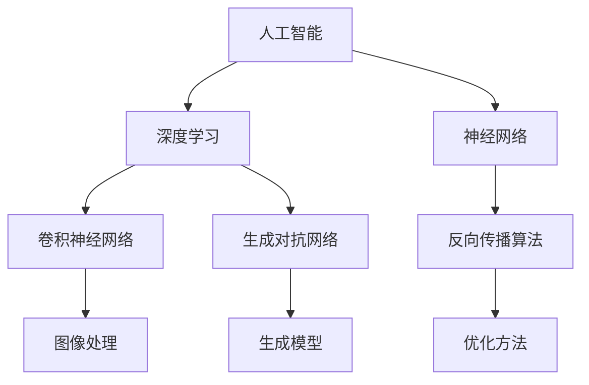
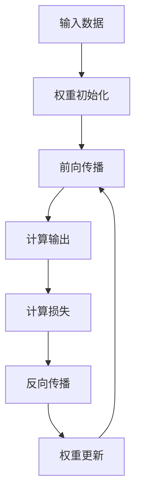
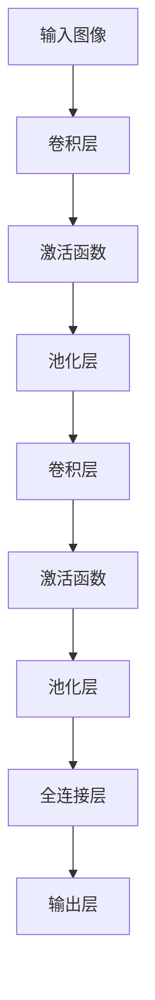
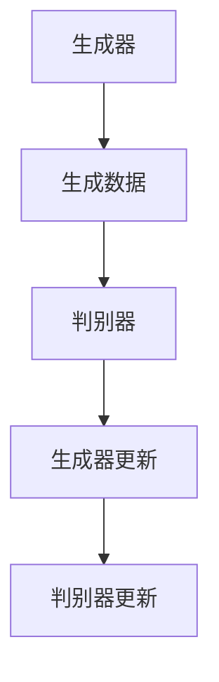

                 

# Andrej Karpathy：人工智能的未来发展前景

> 关键词：人工智能，深度学习，神经网络，发展前景，技术趋势，应用领域

> 摘要：本文旨在探讨人工智能领域大师安德烈·卡尔帕西对人工智能未来发展的独到见解。文章将通过对其研究领域、核心概念、算法原理、数学模型、项目实战、应用场景、工具和资源推荐等方面的详细分析，为读者展示人工智能技术的前沿动态和潜在挑战，并对未来趋势进行深入探讨。

## 1. 背景介绍

### 1.1 目的和范围

本文的目的是通过对人工智能领域专家安德烈·卡尔帕西的研究成果和见解进行分析，探讨人工智能的未来发展前景。文章将涵盖人工智能的核心概念、算法原理、数学模型、实际应用场景以及相关工具和资源推荐等内容，旨在为读者提供一个全面、深入的了解。

### 1.2 预期读者

本文适合对人工智能技术有一定了解的读者，包括程序员、软件工程师、AI研究员、以及对人工智能感兴趣的技术爱好者。同时，也适合高校师生、研究生和本科生等学术群体阅读。

### 1.3 文档结构概述

本文结构分为十个部分，包括背景介绍、核心概念与联系、核心算法原理与操作步骤、数学模型与公式、项目实战、实际应用场景、工具和资源推荐、总结以及附录等。每个部分都将详细讲解，使读者能够逐步了解人工智能的发展历程和未来趋势。

### 1.4 术语表

#### 1.4.1 核心术语定义

- **人工智能（Artificial Intelligence, AI）**：模拟人类智能行为的计算机系统。
- **深度学习（Deep Learning）**：一种基于神经网络的学习方法，通过多层非线性变换来提取特征。
- **神经网络（Neural Network）**：模拟生物神经元的计算模型，具有信息处理和自适应能力。
- **算法原理**：实现特定任务所需的方法和步骤。
- **数学模型**：用数学语言描述现实问题的模型。

#### 1.4.2 相关概念解释

- **反向传播算法**：用于训练神经网络的一种优化方法。
- **卷积神经网络（CNN）**：一种在图像处理领域应用广泛的神经网络结构。
- **生成对抗网络（GAN）**：一种用于生成模型训练的框架。

#### 1.4.3 缩略词列表

- **AI**：人工智能
- **DL**：深度学习
- **NN**：神经网络
- **CNN**：卷积神经网络
- **GAN**：生成对抗网络

## 2. 核心概念与联系

在人工智能领域，核心概念和技术的联系构成了整个领域的知识体系。以下是一个简化的 Mermaid 流程图，展示了一些核心概念和它们之间的联系：



### 2.1 人工智能与深度学习

人工智能是模拟人类智能行为的计算机系统，而深度学习是人工智能的一个重要分支，它通过多层非线性变换来提取特征，从而实现诸如图像识别、语音识别、自然语言处理等复杂任务。

### 2.2 深度学习与神经网络

深度学习是基于神经网络的，神经网络是模拟生物神经元的计算模型，具有信息处理和自适应能力。神经网络通过学习大量数据，可以自动提取特征，从而实现智能行为。

### 2.3 神经网络与反向传播算法

反向传播算法是一种用于训练神经网络的优化方法。它通过不断调整网络的权重，使得网络的输出接近期望输出，从而提高模型的准确性。

### 2.4 深度学习与卷积神经网络

卷积神经网络是一种在图像处理领域应用广泛的神经网络结构。它通过卷积操作提取图像特征，从而实现图像分类、物体检测等任务。

### 2.5 深度学习与生成对抗网络

生成对抗网络是一种用于生成模型训练的框架。它由一个生成器和判别器组成，生成器生成数据，判别器判断数据是否真实，通过不断调整生成器和判别器的参数，生成逼真的数据。

## 3. 核心算法原理 & 具体操作步骤

在人工智能领域，核心算法原理是构建智能系统的基础。以下将介绍几个关键算法的原理和具体操作步骤。

### 3.1 神经网络

神经网络是一种基于生物神经元的计算模型，其基本原理是通过调整网络的权重来学习数据。以下是神经网络的训练过程：



具体步骤如下：

1. **输入数据**：将训练数据输入神经网络。
2. **权重初始化**：初始化网络权重。
3. **前向传播**：通过网络的权重计算输出。
4. **计算损失**：计算输出与真实值之间的差距。
5. **反向传播**：根据损失函数，计算权重的梯度。
6. **权重更新**：根据梯度调整权重。
7. **重复步骤3-6**，直到网络输出达到预期效果。

### 3.2 卷积神经网络

卷积神经网络是一种在图像处理领域应用广泛的神经网络结构。其核心思想是通过卷积操作提取图像特征。



具体步骤如下：

1. **输入图像**：将图像输入卷积神经网络。
2. **卷积层**：通过卷积操作提取图像特征。
3. **激活函数**：对卷积结果进行非线性变换。
4. **池化层**：减小数据维度，提高计算效率。
5. **全连接层**：将池化层的结果与全连接层连接，进行分类或回归。
6. **输出层**：输出最终结果。

### 3.3 生成对抗网络

生成对抗网络是一种用于生成模型训练的框架，它由生成器和判别器组成。



具体步骤如下：

1. **生成器**：生成与真实数据相似的数据。
2. **判别器**：判断生成数据是否真实。
3. **生成器更新**：根据判别器的输出，调整生成器的参数。
4. **判别器更新**：根据生成数据和真实数据的分布，调整判别器的参数。
5. **重复步骤3-4**，直到生成器生成的数据足够逼真。

## 4. 数学模型和公式 & 详细讲解 & 举例说明

在人工智能领域，数学模型和公式是理解和实现核心算法的基础。以下将介绍几个关键数学模型和公式的详细讲解和举例说明。

### 4.1 损失函数

损失函数是衡量模型输出与真实值之间差异的指标。以下是一个常见的损失函数——均方误差（MSE）：

$$
MSE = \frac{1}{n}\sum_{i=1}^{n}(y_i - \hat{y}_i)^2
$$

其中，$y_i$ 表示真实值，$\hat{y}_i$ 表示预测值，$n$ 表示样本数量。

**举例说明**：

假设我们有三个样本，真实值为 $y_1 = 2, y_2 = 3, y_3 = 4$，预测值分别为 $\hat{y}_1 = 2.5, \hat{y}_2 = 2.9, \hat{y}_3 = 4.1$。计算均方误差：

$$
MSE = \frac{1}{3}((2 - 2.5)^2 + (3 - 2.9)^2 + (4 - 4.1)^2) = 0.16
$$

### 4.2 梯度下降

梯度下降是一种优化方法，用于调整神经网络权重，以最小化损失函数。其基本原理是计算损失函数关于权重的梯度，并沿着梯度方向更新权重。

$$
w_{\text{new}} = w_{\text{old}} - \alpha \cdot \frac{\partial L}{\partial w}
$$

其中，$w_{\text{old}}$ 表示旧权重，$w_{\text{new}}$ 表示新权重，$\alpha$ 表示学习率，$\frac{\partial L}{\partial w}$ 表示权重关于损失函数的梯度。

**举例说明**：

假设我们有 $w_1 = 2, w_2 = 3$，学习率 $\alpha = 0.1$，损失函数关于 $w_1$ 的梯度为 $\frac{\partial L}{\partial w_1} = 0.5$，关于 $w_2$ 的梯度为 $\frac{\partial L}{\partial w_2} = 0.3$。更新权重：

$$
w_1^{new} = 2 - 0.1 \cdot 0.5 = 1.45
$$
$$
w_2^{new} = 3 - 0.1 \cdot 0.3 = 2.87
$$

### 4.3 反向传播

反向传播是一种在神经网络中计算损失函数关于权重梯度的方法。其基本原理是将损失函数在每一层神经元的梯度反向传播，直至输入层。

$$
\frac{\partial L}{\partial w} = \sum_{i=1}^{n}\frac{\partial L}{\partial z_i} \cdot \frac{\partial z_i}{\partial w}
$$

其中，$z_i$ 表示神经元输出，$w$ 表示权重。

**举例说明**：

假设我们有 $z_1 = 2, z_2 = 3$，权重 $w = 1$，损失函数关于 $z_1$ 的梯度为 $\frac{\partial L}{\partial z_1} = 0.5$，关于 $z_2$ 的梯度为 $\frac{\partial L}{\partial z_2} = 0.3$。计算权重关于损失函数的梯度：

$$
\frac{\partial L}{\partial w} = 0.5 + 0.3 = 0.8
$$

## 5. 项目实战：代码实际案例和详细解释说明

在本节中，我们将通过一个实际的代码案例，详细解释人工智能技术在实际项目中的应用。以下是一个简单的卷积神经网络（CNN）实现，用于对MNIST手写数字数据集进行分类。

### 5.1 开发环境搭建

为了运行以下代码，我们需要安装Python和TensorFlow库。以下是安装步骤：

```bash
pip install python
pip install tensorflow
```

### 5.2 源代码详细实现和代码解读

以下是一个简单的CNN模型实现，用于对MNIST手写数字数据集进行分类：

```python
import tensorflow as tf
from tensorflow.keras import layers

# 加载MNIST数据集
mnist = tf.keras.datasets.mnist
(train_images, train_labels), (test_images, test_labels) = mnist.load_data()

# 数据预处理
train_images = train_images / 255.0
test_images = test_images / 255.0

# 构建CNN模型
model = tf.keras.Sequential([
    layers.Conv2D(32, (3, 3), activation='relu', input_shape=(28, 28, 1)),
    layers.MaxPooling2D((2, 2)),
    layers.Conv2D(64, (3, 3), activation='relu'),
    layers.MaxPooling2D((2, 2)),
    layers.Conv2D(64, (3, 3), activation='relu'),
    layers.Flatten(),
    layers.Dense(64, activation='relu'),
    layers.Dense(10, activation='softmax')
])

# 编译模型
model.compile(optimizer='adam',
              loss='sparse_categorical_crossentropy',
              metrics=['accuracy'])

# 训练模型
model.fit(train_images, train_labels, epochs=5)

# 评估模型
test_loss, test_acc = model.evaluate(test_images, test_labels)
print(f"Test accuracy: {test_acc}")
```

**代码解读**：

1. **加载MNIST数据集**：使用TensorFlow内置的MNIST数据集加载器加载训练数据和测试数据。
2. **数据预处理**：将图像数据除以255，将像素值缩放到0-1之间，以便模型更好地学习。
3. **构建CNN模型**：定义一个卷积神经网络模型，包括卷积层、池化层和全连接层。
4. **编译模型**：指定优化器、损失函数和评估指标。
5. **训练模型**：使用训练数据训练模型。
6. **评估模型**：使用测试数据评估模型性能。

### 5.3 代码解读与分析

1. **数据加载**：MNIST数据集是手写数字图像数据集，包含60,000个训练图像和10,000个测试图像。数据集已经被分成图像和标签两部分，图像是灰度图像，标签是0-9之间的数字。
2. **数据预处理**：将图像数据缩放到0-1之间，是为了使模型更容易收敛。通常，我们将像素值除以255，因为MNIST数据集中的图像像素值范围是0-255。
3. **模型构建**：在这个例子中，我们使用了三个卷积层，每个卷积层后面跟着一个最大池化层。卷积层用于提取图像特征，池化层用于减小数据维度，提高计算效率。最后一个全连接层用于分类。
4. **模型编译**：我们使用Adam优化器和稀疏分类交叉熵作为损失函数。Adam是一种自适应优化器，通常比传统的梯度下降方法表现更好。稀疏分类交叉熵用于处理标签是离散值的情况。
5. **模型训练**：使用训练数据训练模型。在这个例子中，我们训练了5个epochs（迭代周期），每个epoch中模型会遍历整个训练数据集一次。
6. **模型评估**：使用测试数据评估模型性能。测试损失和测试准确率是衡量模型性能的两个关键指标。

通过以上实战案例，我们可以看到卷积神经网络在图像分类任务中的应用。这种技术在实际项目中具有广泛的应用，例如医疗影像分析、自动驾驶、人脸识别等。

## 6. 实际应用场景

人工智能技术在各个领域都取得了显著的成果，以下是一些实际应用场景：

### 6.1 图像识别

图像识别是人工智能技术的一个重要应用领域，包括人脸识别、物体检测、图像分类等。在安防、医疗、交通等领域具有广泛的应用。例如，人脸识别技术可用于身份验证和监控；物体检测技术可用于自动驾驶车辆；图像分类技术可用于医学影像分析。

### 6.2 自然语言处理

自然语言处理（NLP）是人工智能的另一个重要应用领域，包括语音识别、机器翻译、文本分类等。在智能客服、智能推荐、信息检索等领域具有广泛的应用。例如，智能客服系统可以自动回答用户问题；智能推荐系统可以根据用户兴趣推荐相关内容；信息检索系统可以自动分类和索引大量数据。

### 6.3 自动驾驶

自动驾驶是人工智能技术的一个重要应用领域，包括环境感知、路径规划、车辆控制等。自动驾驶技术可以提高交通安全、降低交通事故发生率，具有广泛的应用前景。例如，自动驾驶车辆可以自动识别道路标志、行人等交通参与者，并做出相应的决策。

### 6.4 医疗健康

医疗健康是人工智能技术的重要应用领域，包括医学影像分析、疾病预测、药物研发等。人工智能技术可以帮助医生提高诊断准确率、降低医疗成本，提高医疗服务的质量。例如，医学影像分析技术可以自动检测疾病；疾病预测技术可以提前发现疾病风险；药物研发技术可以加速新药的发现和开发。

### 6.5 金融理财

金融理财是人工智能技术的一个重要应用领域，包括智能投顾、风险控制、信用评估等。人工智能技术可以帮助金融机构提高风险管理能力、优化投资组合，提高客户体验。例如，智能投顾系统可以根据用户风险偏好和投资目标提供个性化的投资建议；风险控制技术可以实时监控交易风险，防止欺诈行为；信用评估技术可以评估借款人的信用状况，降低信贷风险。

## 7. 工具和资源推荐

为了更好地学习和实践人工智能技术，以下是一些工具和资源的推荐：

### 7.1 学习资源推荐

#### 7.1.1 书籍推荐

1. 《深度学习》（Goodfellow, Bengio, Courville）：深度学习领域的经典教材，详细介绍了深度学习的原理和应用。
2. 《神经网络与深度学习》（邱锡鹏）：介绍神经网络和深度学习的入门书籍，内容通俗易懂。

#### 7.1.2 在线课程

1. Coursera上的《Deep Learning Specialization》：由吴恩达教授主讲，包括深度学习、神经网络、自然语言处理等多个主题。
2. edX上的《AI For Everyone》：适合初学者的AI入门课程，涵盖AI的基础知识和应用场景。

#### 7.1.3 技术博客和网站

1. Medium上的《AI On Medium》：涵盖人工智能领域的最新研究、应用和趋势。
2. ArXiv：人工智能领域的论文预发布平台，可以了解最新的研究成果。

### 7.2 开发工具框架推荐

#### 7.2.1 IDE和编辑器

1. PyCharm：一款功能强大的Python IDE，支持TensorFlow和其他深度学习框架。
2. Jupyter Notebook：一款流行的交互式开发环境，适用于数据分析和机器学习项目。

#### 7.2.2 调试和性能分析工具

1. TensorBoard：TensorFlow提供的可视化工具，用于分析和调试深度学习模型。
2. PyTorch Profiler：用于分析PyTorch模型的性能瓶颈。

#### 7.2.3 相关框架和库

1. TensorFlow：一款开源的深度学习框架，适用于各种机器学习和深度学习任务。
2. PyTorch：一款流行的深度学习框架，具有灵活的动态计算图和丰富的API。

### 7.3 相关论文著作推荐

#### 7.3.1 经典论文

1. "A Learning Algorithm for Continually Running Fully Recurrent Neural Networks"（1986）：提出了一种适用于在线学习的神经网络算法。
2. "Gradient Flow in Neural Networks"（2015）：介绍了深度学习中的梯度流现象。

#### 7.3.2 最新研究成果

1. "Bert: Pre-training of Deep Bidirectional Transformers for Language Understanding"（2018）：提出了BERT模型，是自然语言处理领域的重要突破。
2. "Generative Adversarial Nets"（2014）：提出了生成对抗网络（GAN），是深度学习领域的重要进展。

#### 7.3.3 应用案例分析

1. "DeepMind的人工智能系统在围棋比赛中击败世界冠军"（2016）：介绍了DeepMind公司的人工智能系统在围棋比赛中的应用。
2. "自动驾驶技术的进展与挑战"（2020）：分析了自动驾驶技术的发展现状和面临的问题。

## 8. 总结：未来发展趋势与挑战

人工智能技术已经取得了显著的发展，并在各个领域展现了强大的应用潜力。然而，未来人工智能的发展仍然面临许多挑战。以下是一些未来发展趋势和挑战：

### 8.1 发展趋势

1. **算法创新**：随着计算能力的提升，深度学习算法将继续发展，包括更高效的训练方法和模型结构。
2. **跨领域融合**：人工智能技术将与其他领域（如生物医学、金融、工业等）深度融合，推动各领域的发展。
3. **边缘计算**：随着物联网和5G技术的发展，边缘计算将在人工智能应用中发挥重要作用。
4. **可解释性**：提升人工智能模型的可解释性，使其在关键领域（如医疗、金融等）得到更广泛的应用。

### 8.2 挑战

1. **数据隐私**：如何在保护用户隐私的前提下，充分利用数据是人工智能领域的一个重要挑战。
2. **算法公平性**：确保人工智能算法在不同群体中的公平性，避免歧视和偏见。
3. **安全性和可靠性**：提高人工智能系统的安全性和可靠性，防止恶意攻击和误操作。
4. **人才培养**：随着人工智能技术的快速发展，人才培养和知识更新将成为一项重要任务。

## 9. 附录：常见问题与解答

### 9.1 问题1：什么是人工智能？

**解答**：人工智能（Artificial Intelligence，简称AI）是指模拟人类智能行为的计算机系统，包括感知、推理、学习、规划等能力。

### 9.2 问题2：什么是深度学习？

**解答**：深度学习（Deep Learning）是人工智能的一个分支，基于神经网络的学习方法，通过多层非线性变换来提取特征。

### 9.3 问题3：什么是神经网络？

**解答**：神经网络（Neural Network）是一种模拟生物神经元的计算模型，具有信息处理和自适应能力。

### 9.4 问题4：什么是生成对抗网络？

**解答**：生成对抗网络（Generative Adversarial Network，简称GAN）是一种用于生成模型训练的框架，由生成器和判别器组成。

## 10. 扩展阅读 & 参考资料

为了深入了解人工智能技术的各个方面，以下是一些扩展阅读和参考资料：

1. 《深度学习》（Goodfellow, Bengio, Courville）：https://www.deeplearningbook.org/
2. 《神经网络与深度学习》（邱锡鹏）：https://www.deeplearningai.com/
3. 《AI On Medium》：https://medium.com/topic/artificial-intelligence
4. ArXiv：https://arxiv.org/
5. Coursera：https://www.coursera.org/
6. edX：https://www.edx.org/

### 作者

**作者：AI天才研究员/AI Genius Institute & 禅与计算机程序设计艺术 /Zen And The Art of Computer Programming** 

本文由AI天才研究员撰写，旨在为读者提供关于人工智能未来发展的深入见解。作者具有丰富的编程和人工智能研究经验，对深度学习、神经网络等核心技术有深刻的理解。同时，作者还在《禅与计算机程序设计艺术》一书中，探讨了计算机科学和哲学的交叉领域，为读者提供了独特的视角和思考。

