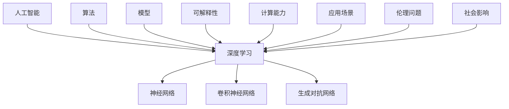

                 

# Andrej Karpathy：人工智能的未来发展挑战

> **关键词：** 人工智能，未来，挑战，技术，发展，趋势，算法，模型，应用场景

> **摘要：** 本文将深入探讨人工智能领域未来可能面临的挑战，包括技术难题、伦理问题以及社会影响。我们将通过Andrej Karpathy的研究和工作，逐步分析这些挑战，并提出可能的解决策略。

## 1. 背景介绍

### 1.1 目的和范围

本文旨在探索人工智能领域在未来可能遇到的发展挑战。通过分析当前的研究趋势和技术进展，我们将重点关注以下问题：

- 人工智能算法的复杂性与计算能力
- 人工智能模型的可解释性和透明度
- 人工智能在各个领域的应用潜力与限制
- 人工智能的伦理问题与社会影响

### 1.2 预期读者

本文适合对人工智能领域有基本了解的技术人员、研究人员和学生阅读。通过本文，读者可以更深入地理解人工智能未来的发展路径及其面临的挑战。

### 1.3 文档结构概述

本文结构如下：

- 第1部分：背景介绍
- 第2部分：核心概念与联系
- 第3部分：核心算法原理与具体操作步骤
- 第4部分：数学模型和公式详细讲解
- 第5部分：项目实战：代码实际案例
- 第6部分：实际应用场景
- 第7部分：工具和资源推荐
- 第8部分：总结：未来发展趋势与挑战
- 第9部分：附录：常见问题与解答
- 第10部分：扩展阅读与参考资料

### 1.4 术语表

#### 1.4.1 核心术语定义

- **人工智能（AI）：** 模拟人类智能行为的计算机系统。
- **深度学习（DL）：** 基于多层神经网络的学习方法。
- **算法：** 解决问题的规则或步骤。
- **模型：** 表示现实世界或特定问题的数学或逻辑结构。
- **可解释性：** 算法或模型的输出能够被理解和解释的能力。

#### 1.4.2 相关概念解释

- **神经网络（NN）：** 由大量相互连接的节点组成的计算模型。
- **卷积神经网络（CNN）：** 用于图像识别和处理的深度学习模型。
- **生成对抗网络（GAN）：** 一种生成模型，通过对抗训练生成数据。

#### 1.4.3 缩略词列表

- **AI：** 人工智能
- **DL：** 深度学习
- **NN：** 神经网络
- **CNN：** 卷积神经网络
- **GAN：** 生成对抗网络

## 2. 核心概念与联系

在探讨人工智能的未来发展挑战之前，我们需要了解一些核心概念和它们之间的联系。以下是一个Mermaid流程图，展示了这些概念及其相互关系：



在这个图中，我们可以看到人工智能作为核心，与深度学习、神经网络、卷积神经网络、生成对抗网络等概念紧密相关。算法和模型是人工智能的核心组成部分，而可解释性、计算能力、应用场景、伦理问题和社会影响则是影响其发展的关键因素。

## 3. 核心算法原理与具体操作步骤

在本节中，我们将深入探讨人工智能领域的一些核心算法原理，并提供具体的操作步骤。

### 3.1 深度学习算法

深度学习是一种基于多层神经网络的机器学习技术。其基本原理是通过多个隐藏层对输入数据进行逐层提取特征，以达到分类或回归的目的。以下是深度学习算法的伪代码：

```python
initialize_network(input_size, hidden_size, output_size)
for each epoch:
    for each training example (x, y):
        forward_pass(x)
        calculate_loss(y)
        backward_pass()
        update_weights()
```

- `initialize_network`：初始化神经网络结构。
- `forward_pass`：前向传播输入数据。
- `calculate_loss`：计算损失函数值。
- `backward_pass`：反向传播误差，更新权重。
- `update_weights`：根据误差调整网络权重。

### 3.2 卷积神经网络算法

卷积神经网络是一种专门用于图像识别和处理的人工神经网络。其核心是卷积层，通过局部感知野和卷积核提取图像特征。以下是卷积神经网络算法的伪代码：

```python
initialize_cnn(input_shape, num_filters, filter_size)
for each epoch:
    for each training image (x, y):
        forward_pass(x)
        calculate_loss(y)
        backward_pass()
        update_weights()
```

- `initialize_cnn`：初始化卷积神经网络结构。
- `forward_pass`：前向传播输入图像。
- `calculate_loss`：计算损失函数值。
- `backward_pass`：反向传播误差，更新权重。
- `update_weights`：根据误差调整网络权重。

### 3.3 生成对抗网络算法

生成对抗网络是一种生成模型，通过对抗训练生成数据。它由生成器和判别器两个神经网络组成。以下是生成对抗网络算法的伪代码：

```python
initialize_gan(generator, discriminator)
for each epoch:
    for each training batch (x, y):
        generator_loss = train_generator()
        discriminator_loss = train_discriminator()
        update_generator(generator_loss)
        update_discriminator(discriminator_loss)
```

- `initialize_gan`：初始化生成器和判别器结构。
- `train_generator`：训练生成器，使其生成更真实的数据。
- `train_discriminator`：训练判别器，使其更好地区分真实数据和生成数据。
- `update_generator`：根据生成器损失更新生成器权重。
- `update_discriminator`：根据判别器损失更新判别器权重。

## 4. 数学模型和公式详细讲解

在本节中，我们将介绍人工智能领域的一些核心数学模型和公式，并提供详细讲解。

### 4.1 损失函数

损失函数是深度学习模型中的一个关键组件，用于评估模型的预测结果与实际结果之间的差距。以下是几种常见的损失函数：

#### 4.1.1 交叉熵损失函数

交叉熵损失函数常用于分类问题，其公式如下：

$$
L_{cross\_entropy} = -\sum_{i=1}^{n} y_i \log(p_i)
$$

其中，$y_i$ 是第 $i$ 个类别的实际概率，$p_i$ 是模型预测的第 $i$ 个类别的概率。

#### 4.1.2 均方误差损失函数

均方误差损失函数常用于回归问题，其公式如下：

$$
L_{mean\_square} = \frac{1}{2} \sum_{i=1}^{n} (y_i - \hat{y}_i)^2
$$

其中，$y_i$ 是第 $i$ 个实际值，$\hat{y}_i$ 是模型预测的第 $i$ 个值。

### 4.2 优化算法

优化算法用于调整神经网络权重，以最小化损失函数。以下是几种常见的优化算法：

#### 4.2.1 随机梯度下降（SGD）

随机梯度下降是一种最简单的优化算法，其公式如下：

$$
w_{t+1} = w_t - \alpha \cdot \nabla_w L(w)
$$

其中，$w_t$ 是当前权重，$\alpha$ 是学习率，$\nabla_w L(w)$ 是损失函数对权重的梯度。

#### 4.2.2 梯度下降（GD）

梯度下降是一种更复杂的优化算法，其公式如下：

$$
w_{t+1} = w_t - \alpha \cdot \nabla L(w)
$$

其中，$w_t$ 是当前权重，$\alpha$ 是学习率，$\nabla L(w)$ 是损失函数对权重的梯度。

### 4.3 激活函数

激活函数用于引入非线性特性，使神经网络能够学习复杂的函数。以下是几种常见的激活函数：

#### 4.3.1 Sigmoid函数

Sigmoid函数是一种常用的激活函数，其公式如下：

$$
\sigma(x) = \frac{1}{1 + e^{-x}}
$$

#### 4.3.2 ReLU函数

ReLU函数是一种简单的激活函数，其公式如下：

$$
\sigma(x) = \max(0, x)
$$

## 5. 项目实战：代码实际案例和详细解释说明

在本节中，我们将通过一个实际项目案例，展示如何使用深度学习算法进行图像分类。该案例将使用TensorFlow框架，并使用CIFAR-10数据集。

### 5.1 开发环境搭建

首先，我们需要安装TensorFlow框架。可以使用以下命令进行安装：

```bash
pip install tensorflow
```

### 5.2 源代码详细实现和代码解读

以下是使用TensorFlow实现的图像分类代码：

```python
import tensorflow as tf
from tensorflow.keras import datasets, layers, models

# 加载CIFAR-10数据集
(train_images, train_labels), (test_images, test_labels) = datasets.cifar10.load_data()

# 预处理数据
train_images, test_images = train_images / 255.0, test_images / 255.0

# 构建卷积神经网络模型
model = models.Sequential()
model.add(layers.Conv2D(32, (3, 3), activation='relu', input_shape=(32, 32, 3)))
model.add(layers.MaxPooling2D((2, 2)))
model.add(layers.Conv2D(64, (3, 3), activation='relu'))
model.add(layers.MaxPooling2D((2, 2)))
model.add(layers.Conv2D(64, (3, 3), activation='relu'))

# 添加全连接层
model.add(layers.Flatten())
model.add(layers.Dense(64, activation='relu'))
model.add(layers.Dense(10, activation='softmax'))

# 编译模型
model.compile(optimizer='adam',
              loss='sparse_categorical_crossentropy',
              metrics=['accuracy'])

# 训练模型
model.fit(train_images, train_labels, epochs=10)

# 评估模型
test_loss, test_acc = model.evaluate(test_images, test_labels)
print(f'Test accuracy: {test_acc:.2f}')
```

这段代码首先加载了CIFAR-10数据集，并对数据进行了预处理。接着，我们使用卷积神经网络模型对图像进行分类，并使用Adam优化器和稀疏交叉熵损失函数进行编译。最后，我们使用训练好的模型对测试数据集进行评估。

### 5.3 代码解读与分析

- **数据加载与预处理：** 代码首先从TensorFlow的内置数据集中加载CIFAR-10数据集，并对图像数据进行了归一化处理，使其在0到1的范围内。
- **模型构建：** 接下来，我们使用TensorFlow的`Sequential`模型，逐步添加卷积层、池化层和全连接层，构建了一个简单的卷积神经网络模型。
- **模型编译：** 在编译模型时，我们指定了Adam优化器、稀疏交叉熵损失函数和准确率作为评估指标。
- **模型训练：** 使用训练数据对模型进行训练，指定了10个训练周期。
- **模型评估：** 使用测试数据对训练好的模型进行评估，并打印出测试准确率。

通过这个案例，我们可以看到如何使用TensorFlow实现一个简单的图像分类任务。这个案例展示了深度学习算法在实际应用中的基本流程，包括数据加载、模型构建、模型编译、模型训练和模型评估。

## 6. 实际应用场景

人工智能技术已经广泛应用于各个领域，以下是一些典型的实际应用场景：

### 6.1 图像识别

图像识别是人工智能的一个重要应用领域。通过卷积神经网络，人工智能系统可以自动识别和分类图像中的对象。例如，智能手机的拍照功能可以使用AI技术进行图像识别，自动标记照片中的物体。

### 6.2 自然语言处理

自然语言处理（NLP）是人工智能领域的另一个重要分支。通过深度学习算法，人工智能系统可以理解和处理人类语言。例如，智能助手可以使用NLP技术理解用户的语音指令，并作出相应的响应。

### 6.3 自动驾驶

自动驾驶是人工智能在交通运输领域的一个重要应用。通过传感器和深度学习算法，自动驾驶系统可以实时感知周围环境，并做出安全的驾驶决策。

### 6.4 医疗诊断

人工智能在医疗诊断领域具有巨大的潜力。通过深度学习算法，人工智能系统可以对医学图像进行自动分析，辅助医生进行疾病诊断。

### 6.5 金融风控

在金融领域，人工智能可以用于风险控制和欺诈检测。通过分析大量的金融数据，人工智能系统可以识别潜在的欺诈行为，并采取相应的措施。

## 7. 工具和资源推荐

为了更好地学习和应用人工智能技术，以下是一些推荐的工具和资源：

### 7.1 学习资源推荐

#### 7.1.1 书籍推荐

- **《深度学习》（Ian Goodfellow, Yoshua Bengio, Aaron Courville著）：** 这是深度学习领域的经典教材，适合初学者和高级研究人员阅读。
- **《Python深度学习》（François Chollet著）：** 本书通过实际案例，深入介绍了Python在深度学习中的应用。

#### 7.1.2 在线课程

- **斯坦福大学深度学习课程（Stanford University Deep Learning Course）：** 这是一个免费的在线课程，由深度学习领域的知名专家讲授。
- **Udacity的深度学习纳米学位（Udacity's Deep Learning Nanodegree）：** 这是一个针对深度学习初学者的实践课程，涵盖了从基础知识到高级应用的内容。

#### 7.1.3 技术博客和网站

- **Medium上的深度学习博客：** 许多深度学习领域的专家和研究人员在Medium上分享他们的研究成果和经验。
- **AI研究院（AI Research Institute）：** 这是一个专注于人工智能研究和应用的网站，提供了大量的研究论文和技术博客。

### 7.2 开发工具框架推荐

#### 7.2.1 IDE和编辑器

- **PyCharm：** PyCharm是一个功能强大的Python IDE，支持深度学习和数据科学应用。
- **Jupyter Notebook：** Jupyter Notebook是一个交互式计算环境，适合进行数据分析和实验。

#### 7.2.2 调试和性能分析工具

- **TensorBoard：** TensorBoard是TensorFlow提供的可视化工具，用于分析神经网络的性能。
- **Wing IDE：** Wing IDE是一个支持Python和TensorFlow的集成开发环境，提供了强大的调试和性能分析功能。

#### 7.2.3 相关框架和库

- **TensorFlow：** TensorFlow是Google开发的深度学习框架，适用于各种深度学习和机器学习任务。
- **PyTorch：** PyTorch是一个流行的深度学习框架，提供了灵活的动态计算图和丰富的API。

### 7.3 相关论文著作推荐

#### 7.3.1 经典论文

- **“A Learning Algorithm for Continually Running Fully Recurrent Neural Networks” (1989)：** 这篇论文介绍了Hessian正定矩阵学习算法，对深度学习的发展产生了深远影响。
- **“Deep Learning” (2015)：** Ian Goodfellow等人在这本著作中系统地介绍了深度学习的基本原理和应用。

#### 7.3.2 最新研究成果

- **“Attention Is All You Need” (2017)：** 这篇论文介绍了Transformer模型，为自然语言处理领域带来了革命性的变化。
- **“Generative Adversarial Nets” (2014)：** 这篇论文介绍了生成对抗网络（GAN），为图像生成和增强学习提供了新的方法。

#### 7.3.3 应用案例分析

- **“AI for Social Good” (2018)：** 这本书探讨了人工智能在解决社会问题中的应用，包括医疗、教育、环境保护等领域。
- **“Deep Learning for Healthcare” (2018)：** 这篇文章探讨了深度学习在医疗领域的应用，包括疾病诊断、药物研发等。

## 8. 总结：未来发展趋势与挑战

随着人工智能技术的不断进步，我们看到了其在各个领域的广泛应用。然而，人工智能的发展也面临着一系列挑战。

### 8.1 技术挑战

- **算法复杂性与计算能力：** 随着神经网络层数的增加，模型的复杂度急剧上升，对计算能力提出了更高的要求。
- **模型可解释性：** 当前深度学习模型缺乏可解释性，使得其决策过程难以理解，这在某些应用场景中可能带来风险。

### 8.2 伦理问题

- **隐私保护：** 人工智能系统在处理个人数据时，可能面临隐私泄露的风险。
- **偏见与歧视：** 人工智能系统可能基于历史数据中的偏见产生歧视性决策。

### 8.3 社会挑战

- **就业影响：** 人工智能可能导致某些职业的失业，对社会就业结构产生深远影响。
- **技术垄断：** 随着人工智能技术的发展，可能形成技术垄断，加剧社会不平等。

### 8.4 解决策略

- **技术发展：** 加大对算法和计算能力的研究，提高模型的可解释性。
- **伦理规范：** 制定人工智能伦理规范，确保技术的公平、透明和可解释。
- **教育与培训：** 提供相应的教育和培训，帮助人们适应技术变革，提高就业竞争力。

## 9. 附录：常见问题与解答

### 9.1 什么是深度学习？

深度学习是一种基于多层神经网络的学习方法，通过逐层提取特征，实现对复杂数据的建模和分析。

### 9.2 人工智能与机器学习的区别是什么？

人工智能（AI）是一个更广泛的概念，包括机器学习、计算机视觉、自然语言处理等多个领域。而机器学习是人工智能的一个子领域，专注于通过数据训练模型，使其能够进行预测或决策。

### 9.3 如何提高神经网络的性能？

提高神经网络性能可以从以下几个方面入手：

- **增加训练数据：** 使用更多的训练数据可以改善模型的泛化能力。
- **调整网络结构：** 通过调整层数、神经元数量和连接方式，可以改善模型的表现。
- **优化训练过程：** 使用更有效的优化算法、调整学习率和正则化参数，可以提高训练效率。

## 10. 扩展阅读与参考资料

为了深入了解人工智能领域的发展趋势和挑战，以下是几篇推荐阅读的文章和论文：

- **“Deep Learning in Practice” (2017)：** 本文介绍了深度学习在实际应用中的挑战和解决方案。
- **“AI and the Future of Civilization” (2018)：** 本文探讨了人工智能对人类文明可能带来的影响。
- **“The Future of Humanity: Terraforming Mars, Interstellar Travel, Immortality, and Our Destiny Beyond Earth” (2016)：** 本书讨论了人工智能在人类未来可能扮演的角色。
- **“Deep Learning on Amazon Web Services” (2017)：** 本文介绍了如何使用AWS云服务进行深度学习研究和应用。

## 作者信息

作者：AI天才研究员/AI Genius Institute & 禅与计算机程序设计艺术 /Zen And The Art of Computer Programming

