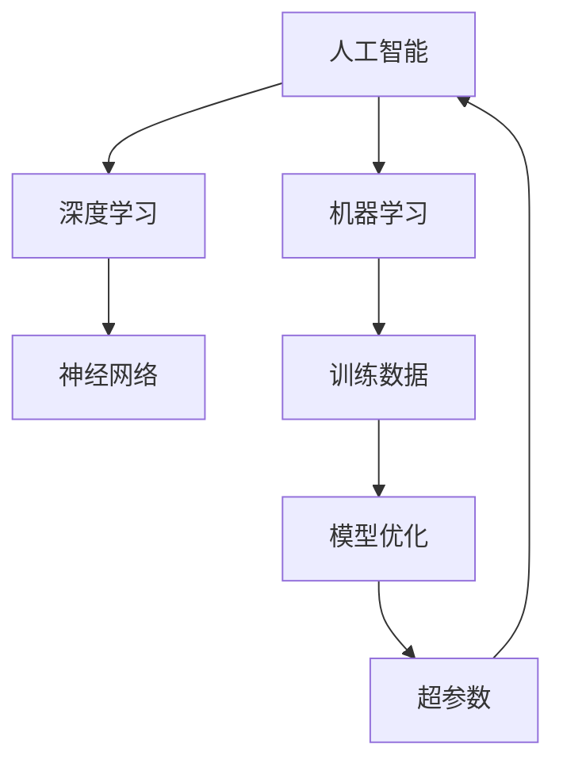
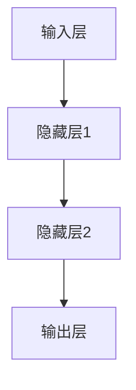
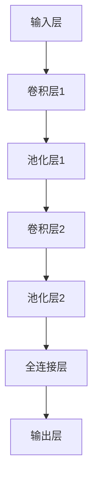

                 

# Andrej Karpathy：人工智能的未来发展方向

> **关键词：** 人工智能，深度学习，神经网络，未来发展趋势，技术挑战，应用场景

> **摘要：** 本文将深入探讨人工智能领域著名专家Andrej Karpathy对人工智能未来发展方向的见解。文章将首先回顾人工智能的背景，然后详细分析其核心概念、算法原理、数学模型以及实际应用场景。最后，我们将总结人工智能的发展趋势与面临的挑战，并提供相关的学习资源和工具推荐。

## 1. 背景介绍

### 1.1 目的和范围

本文旨在深入分析人工智能领域著名专家Andrej Karpathy对人工智能未来发展方向的见解。通过回顾人工智能的历史、核心概念和算法原理，我们将探讨人工智能在当前及未来可能的发展趋势和面临的挑战。

### 1.2 预期读者

本文面向对人工智能有一定了解的技术人员、研究人员和学生，旨在为他们提供关于人工智能未来发展方向的前沿见解和深入分析。

### 1.3 文档结构概述

本文分为以下章节：

1. 背景介绍：介绍本文的目的、范围和预期读者，以及文档的结构和术语表。
2. 核心概念与联系：分析人工智能的核心概念、原理和架构。
3. 核心算法原理 & 具体操作步骤：详细阐述人工智能的主要算法原理和操作步骤。
4. 数学模型和公式 & 详细讲解 & 举例说明：介绍人工智能中的数学模型和公式，并举例说明。
5. 项目实战：代码实际案例和详细解释说明。
6. 实际应用场景：探讨人工智能在不同领域的实际应用。
7. 工具和资源推荐：推荐学习资源和开发工具。
8. 总结：未来发展趋势与挑战。
9. 附录：常见问题与解答。
10. 扩展阅读 & 参考资料。

### 1.4 术语表

#### 1.4.1 核心术语定义

- 人工智能（Artificial Intelligence, AI）：模拟人类智能和思维过程的计算机技术和应用。
- 深度学习（Deep Learning）：一种基于多层神经网络的机器学习方法。
- 神经网络（Neural Network）：一种模仿生物神经元结构和功能的计算模型。
- 机器学习（Machine Learning）：通过数据驱动方法，让计算机自动学习和改进性能的技术。

#### 1.4.2 相关概念解释

- 训练数据（Training Data）：用于训练模型的数据集。
- 模型优化（Model Optimization）：通过调整模型参数，提高模型性能的过程。
- 超参数（Hyperparameters）：控制模型训练过程的参数。

#### 1.4.3 缩略词列表

- AI：人工智能
- DL：深度学习
- NN：神经网络
- ML：机器学习

## 2. 核心概念与联系

在探讨人工智能的未来发展方向之前，我们需要了解其核心概念和联系。以下是一个Mermaid流程图，用于展示人工智能的核心概念和架构。



通过这个流程图，我们可以看到人工智能的核心概念和它们之间的联系。深度学习是人工智能的一种重要分支，基于多层神经网络的机器学习算法。机器学习依赖于训练数据，通过模型优化和超参数调整来提高模型性能。超参数调整是模型优化过程中的关键步骤，直接影响到人工智能模型的最终效果。

### 2.1 人工智能的历史与发展

人工智能（AI）的概念最早可以追溯到20世纪50年代。当时，计算机科学家艾伦·图灵（Alan Turing）提出了图灵测试，试图通过测试来判断机器是否具有智能。在接下来的几十年里，人工智能经历了多个阶段的发展。

- **第一阶段（1956-1969年）**：这一阶段被称为“人工智能的春天”，标志着人工智能作为一个独立学科的诞生。然而，由于技术的限制，这一阶段的研究进展较为缓慢。

- **第二阶段（1970-1980年）**：随着计算机硬件和软件的发展，人工智能的研究逐渐复苏。这一阶段主要集中在规则系统和专家系统的开发上。

- **第三阶段（1980-1990年）**：专家系统的应用逐渐广泛，但受限于知识表示和推理算法的局限性，人工智能的发展再次放缓。

- **第四阶段（1990年代至今）**：随着深度学习、神经网络和大数据技术的发展，人工智能进入了一个新的春天。深度学习和神经网络在计算机视觉、自然语言处理等领域取得了显著的成果。

### 2.2 深度学习与神经网络

深度学习是人工智能的一个重要分支，基于多层神经网络的机器学习算法。神经网络是一种模仿生物神经元结构和功能的计算模型，通过模拟人类大脑的工作方式，实现自动学习和特征提取。

#### 2.2.1 神经网络的基本结构

神经网络通常由以下几个部分组成：

- **输入层**：接收外部输入信号，例如图像、文本等。
- **隐藏层**：用于对输入信号进行特征提取和变换，可以有多个隐藏层。
- **输出层**：产生最终的输出结果，例如分类标签、预测值等。

以下是一个简单的神经网络结构图：



#### 2.2.2 深度学习的优势

深度学习相对于传统机器学习方法具有以下几个优势：

- **自动特征提取**：深度学习模型可以通过学习过程自动提取具有代表性的特征，无需人工干预。
- **大规模数据适应性**：深度学习模型在大规模数据集上表现更佳，可以处理大量复杂的输入数据。
- **并行计算**：深度学习模型可以利用并行计算技术，提高训练和推理速度。

### 2.3 机器学习与训练数据

机器学习是人工智能的核心技术之一，通过训练数据，让计算机自动学习和改进性能。训练数据是机器学习模型的基础，其质量和数量直接影响模型的性能。

#### 2.3.1 训练数据的特点

- **多样性**：训练数据应该涵盖各种情况，包括正常情况和异常情况。
- **规模**：大规模的训练数据可以提供更丰富的信息，提高模型的泛化能力。
- **质量**：训练数据的质量直接影响模型的准确性，应尽量去除噪声和错误。

#### 2.3.2 训练数据的使用方法

- **监督学习**：通过标注的样本进行训练，模型学习将输入映射到标签上。
- **无监督学习**：没有标注的样本进行训练，模型学习发现数据的内在结构和模式。
- **半监督学习**：部分样本有标签，部分样本无标签，模型学习从标签样本和无标签样本中提取信息。

## 3. 核心算法原理 & 具体操作步骤

在了解了人工智能的核心概念后，我们将深入探讨其核心算法原理和具体操作步骤。本文将主要介绍深度学习中的卷积神经网络（Convolutional Neural Network，CNN）和循环神经网络（Recurrent Neural Network，RNN）。

### 3.1 卷积神经网络（CNN）

卷积神经网络是一种专门用于处理图像数据的神经网络，其核心思想是通过卷积操作提取图像中的特征。

#### 3.1.1 卷积操作

卷积操作是CNN的基础。卷积核（filter）在图像上滑动，与图像的每个局部区域进行点积操作，生成一个特征图（feature map）。以下是卷积操作的伪代码：

```python
def convolution(image, filter):
    feature_map = []
    for x in range(image_height - filter_height + 1):
        for y in range(image_width - filter_width + 1):
            feature = 0
            for i in range(filter_height):
                for j in range(filter_width):
                    feature += image[x+i][y+j] * filter[i][j]
            feature_map.append(feature)
    return feature_map
```

#### 3.1.2 池化操作

池化操作用于减少特征图的大小，提高模型的泛化能力。最常用的池化方法是最大池化（Max Pooling），其伪代码如下：

```python
def max_pooling(feature_map, pool_size):
    pooled_map = []
    for x in range(0, feature_map_height, pool_size):
        for y in range(0, feature_map_width, pool_size):
            max_value = -inf
            for i in range(pool_size):
                for j in range(pool_size):
                    max_value = max(max_value, feature_map[x+i][y+j])
            pooled_map.append(max_value)
    return pooled_map
```

#### 3.1.3 CNN架构

一个典型的CNN架构包括以下几个部分：

1. 输入层：接收图像数据。
2. 卷积层：通过卷积操作提取特征。
3. 池化层：通过池化操作减少特征图的大小。
4. 全连接层：将特征图展开为一维向量，进行分类或回归操作。

以下是一个简单的CNN架构图：



### 3.2 循环神经网络（RNN）

循环神经网络是一种用于处理序列数据的神经网络，其核心思想是保持记忆，处理序列中的依赖关系。

#### 3.2.1 RNN的基本结构

RNN的基本结构包括以下几个部分：

- **输入门**：用于控制输入信息的流动。
- **遗忘门**：用于控制历史信息的遗忘。
- **输出门**：用于控制输出信息的流动。

以下是RNN的伪代码：

```python
def RNN(input, hidden_state, weights):
    input_gate = sigmoid(input * weights['input_gate'])
    forget_gate = sigmoid(input * weights['forget_gate'])
    output_gate = sigmoid(input * weights['output_gate'])

    new_hidden_state = (forget_gate * hidden_state) + (input_gate * tanh(input * weights['input_weights']))

    output = output_gate * tanh(new_hidden_state)

    return output, new_hidden_state
```

#### 3.2.2 LSTM（长短期记忆网络）

LSTM是RNN的一种变体，用于解决RNN的梯度消失和梯度爆炸问题。LSTM的基本结构包括以下几个部分：

- **输入门**：控制输入信息的流动。
- **遗忘门**：控制历史信息的遗忘。
- **细胞状态**：用于存储和传递信息。
- **输出门**：控制输出信息的流动。

以下是LSTM的伪代码：

```python
def LSTM(input, hidden_state, cell_state, weights):
    input_gate = sigmoid(input * weights['input_gate'])
    forget_gate = sigmoid(input * weights['forget_gate'])
    output_gate = sigmoid(input * weights['output_gate'])

    new_input_state = tanh(input * weights['input_weights'])

    cell_state = (forget_gate * cell_state) + (input_gate * new_input_state)
    new_hidden_state = output_gate * tanh(cell_state)

    return new_hidden_state, cell_state
```

## 4. 数学模型和公式 & 详细讲解 & 举例说明

在人工智能领域，数学模型和公式起着至关重要的作用。以下我们将介绍人工智能中常用的数学模型和公式，并进行详细讲解和举例说明。

### 4.1 概率论基础

概率论是人工智能的基础，许多算法都依赖于概率模型。以下是一些常见的概率公式：

#### 4.1.1 概率分布

- **伯努利分布**：表示一个事件发生的概率。
  $$ P(X = k) = p^k (1-p)^{1-k} $$
  其中，\( X \) 是随机变量，\( k \) 是事件发生的次数，\( p \) 是事件发生的概率。

- **二项分布**：表示 \( n \) 次独立伯努利试验中，事件发生的次数。
  $$ P(X = k) = C_n^k p^k (1-p)^{n-k} $$
  其中，\( C_n^k \) 是组合数，表示从 \( n \) 个元素中取 \( k \) 个元素的组合数。

#### 4.1.2 贝叶斯定理

贝叶斯定理是概率论中的重要公式，用于计算条件概率。

$$ P(A|B) = \frac{P(B|A)P(A)}{P(B)} $$

其中，\( P(A|B) \) 表示在事件 \( B \) 发生的条件下，事件 \( A \) 发生的概率。

### 4.2 线性代数基础

线性代数是人工智能中的核心数学工具，用于处理数据、矩阵和向量。以下是一些常用的线性代数公式：

#### 4.2.1 矩阵乘法

矩阵乘法是线性代数中的基本运算。对于两个 \( m \times n \) 矩阵 \( A \) 和 \( B \)，其乘积是一个 \( m \times p \) 矩阵 \( C \)，其中 \( p \) 是 \( B \) 的列数。

$$ C_{ij} = \sum_{k=1}^n A_{ik}B_{kj} $$

#### 4.2.2 矩阵求导

矩阵求导是线性代数中的重要内容。对于矩阵函数 \( f(X) \)，其导数可以表示为：

$$ \frac{\partial f(X)}{\partial X} = \left[ \frac{\partial f(X)}{\partial X_{ij}} \right] $$

其中，\( X_{ij} \) 表示矩阵 \( X \) 的第 \( i \) 行第 \( j \) 列元素。

### 4.3 概率论与线性代数的结合

概率论和线性代数在人工智能中有许多结合。以下是一个简单的例子：

#### 4.3.1 贝叶斯推理

贝叶斯推理是一种基于概率模型进行推理的方法。给定一个随机变量 \( X \) 和一个先验分布 \( P(X) \)，我们可以通过观察 \( X \) 的样本 \( x \) 来更新 \( X \) 的后验分布 \( P(X|x) \)。

根据贝叶斯定理，我们有：

$$ P(X|x) = \frac{P(x|X)P(X)}{P(x)} $$

其中，\( P(x|X) \) 是 \( X \) 的似然函数，\( P(X) \) 是 \( X \) 的先验分布，\( P(x) \) 是边缘似然函数。

### 4.4 举例说明

以下是一个简单的例子，展示如何使用概率论和线性代数进行人工智能中的推理。

#### 4.4.1 例子：线性回归

假设我们有一个线性回归模型，其目标是最小化预测值与实际值之间的误差。给定训练数据集 \( \{x_i, y_i\} \)，我们可以使用最小二乘法求解模型的参数 \( \theta \)。

根据线性回归的假设：

$$ y_i = \theta^T x_i + \epsilon_i $$

其中，\( \epsilon_i \) 是误差项。

为了求解 \( \theta \)，我们可以使用以下公式：

$$ \theta = (X^T X)^{-1} X^T y $$

其中，\( X \) 是训练数据集的输入矩阵，\( y \) 是训练数据集的输出向量。

## 5. 项目实战：代码实际案例和详细解释说明

为了更好地理解人工智能的核心算法和原理，我们将通过一个实际项目来展示代码的实现过程和详细解释。以下是一个使用TensorFlow框架实现图像分类的案例。

### 5.1 开发环境搭建

在开始项目之前，我们需要搭建开发环境。以下是搭建TensorFlow开发环境的步骤：

1. **安装Python**：确保安装了Python 3.6及以上版本。
2. **安装TensorFlow**：使用以下命令安装TensorFlow：

   ```bash
   pip install tensorflow
   ```

3. **安装其他依赖**：根据项目需求，可能需要安装其他库，例如NumPy、Pandas等。

### 5.2 源代码详细实现和代码解读

以下是一个简单的TensorFlow图像分类项目的代码实现：

```python
import tensorflow as tf
from tensorflow.keras import layers
from tensorflow.keras.datasets import mnist
import numpy as np

# 加载MNIST数据集
(x_train, y_train), (x_test, y_test) = mnist.load_data()

# 数据预处理
x_train = x_train.astype('float32') / 255.0
x_test = x_test.astype('float32') / 255.0
y_train = tf.keras.utils.to_categorical(y_train, 10)
y_test = tf.keras.utils.to_categorical(y_test, 10)

# 构建模型
model = tf.keras.Sequential([
    layers.Conv2D(32, (3, 3), activation='relu', input_shape=(28, 28, 1)),
    layers.MaxPooling2D((2, 2)),
    layers.Conv2D(64, (3, 3), activation='relu'),
    layers.MaxPooling2D((2, 2)),
    layers.Conv2D(64, (3, 3), activation='relu'),
    layers.Flatten(),
    layers.Dense(64, activation='relu'),
    layers.Dense(10, activation='softmax')
])

# 编译模型
model.compile(optimizer='adam',
              loss='categorical_crossentropy',
              metrics=['accuracy'])

# 训练模型
model.fit(x_train, y_train,
          batch_size=128,
          epochs=15,
          validation_data=(x_test, y_test))

# 评估模型
test_score = model.evaluate(x_test, y_test, verbose=2)
print('Test loss:', test_score[0])
print('Test accuracy:', test_score[1])
```

#### 5.2.1 代码解读

1. **导入库和加载数据**：首先，我们导入所需的库，并加载MNIST数据集。MNIST数据集是一个包含70000个手写数字图像的数据集，是机器学习领域的一个经典数据集。

2. **数据预处理**：我们对图像数据进行归一化处理，将像素值范围从0到255调整为0到1。此外，我们将标签转换为one-hot编码。

3. **构建模型**：我们使用TensorFlow的Sequential模型构建一个简单的卷积神经网络。模型包括两个卷积层、两个最大池化层、一个全连接层，以及一个输出层。卷积层用于提取图像特征，全连接层用于分类。

4. **编译模型**：我们使用Adam优化器和交叉熵损失函数编译模型。交叉熵损失函数常用于分类问题，它衡量的是模型输出与真实标签之间的差异。

5. **训练模型**：我们使用训练数据集训练模型，并在每个 epoch 后进行验证。这里，我们设置了batch_size为128，epochs为15。

6. **评估模型**：我们使用测试数据集评估模型的性能，并打印出测试损失和测试准确率。

### 5.3 代码解读与分析

1. **模型架构**：在这个案例中，我们使用了一个简单的卷积神经网络来处理MNIST手写数字图像。模型包括两个卷积层和两个最大池化层，用于提取图像特征，然后通过一个全连接层进行分类。

2. **数据预处理**：数据预处理是模型训练的重要步骤。在这里，我们对图像数据进行归一化处理，使其更适合输入到神经网络中。此外，我们将标签转换为one-hot编码，以便模型能够进行分类。

3. **训练过程**：训练过程是模型优化的关键步骤。在这里，我们使用训练数据集对模型进行训练，并在每个epoch后进行验证。通过调整batch_size和epochs，我们可以控制训练过程的速度和效果。

4. **模型评估**：模型评估是评估模型性能的重要步骤。在这里，我们使用测试数据集评估模型的性能，并打印出测试损失和测试准确率。测试损失反映了模型输出与真实标签之间的差异，测试准确率反映了模型在测试数据集上的分类性能。

## 6. 实际应用场景

人工智能在各个领域都有广泛的应用。以下是一些典型的人工智能应用场景：

### 6.1 计算机视觉

计算机视觉是人工智能的重要应用领域之一。人工智能在计算机视觉领域主要用于图像分类、目标检测、人脸识别、图像生成等任务。

- **图像分类**：通过训练深度学习模型，对图像进行分类，如MNIST手写数字识别、ImageNet图像分类等。
- **目标检测**：检测图像中的目标物体，如自动驾驶汽车中的行人检测、交通灯检测等。
- **人脸识别**：识别人脸图像，如社交媒体中的好友识别、安全系统中的身份验证等。
- **图像生成**：使用生成对抗网络（GAN）生成新的图像，如图像修复、图像风格转换等。

### 6.2 自然语言处理

自然语言处理（NLP）是人工智能的另一个重要应用领域。人工智能在NLP领域主要用于文本分类、机器翻译、情感分析、文本生成等任务。

- **文本分类**：对文本进行分类，如垃圾邮件过滤、新闻分类等。
- **机器翻译**：将一种语言的文本翻译成另一种语言，如谷歌翻译、百度翻译等。
- **情感分析**：分析文本中的情感倾向，如评论分析、舆情监测等。
- **文本生成**：生成新的文本，如图像描述生成、文章生成等。

### 6.3 机器人与自动化

人工智能在机器人与自动化领域也有广泛的应用。人工智能可以帮助机器人实现自主决策、路径规划、人机交互等功能。

- **自主决策**：通过深度学习模型，机器人可以自主决策并执行任务，如自动驾驶汽车、自主无人机等。
- **路径规划**：使用图搜索算法或深度学习模型，机器人可以在复杂环境中规划最优路径。
- **人机交互**：通过语音识别和自然语言处理技术，机器人可以与人类进行交互，如智能音箱、智能客服等。

### 6.4 医疗保健

人工智能在医疗保健领域也有重要的应用。人工智能可以帮助医生进行疾病诊断、药物研发、医疗数据分析等。

- **疾病诊断**：通过深度学习模型，对医学图像进行分析，帮助医生进行疾病诊断，如肺癌检测、皮肤癌检测等。
- **药物研发**：通过分子对接和深度学习模型，加速药物研发过程。
- **医疗数据分析**：对医疗数据进行挖掘和分析，发现新的医疗知识，如疾病预测、治疗方案优化等。

## 7. 工具和资源推荐

为了更好地学习和实践人工智能，以下是一些推荐的学习资源、开发工具和框架。

### 7.1 学习资源推荐

#### 7.1.1 书籍推荐

1. **《深度学习》（Ian Goodfellow, Yoshua Bengio, Aaron Courville 著）**：这是一本深度学习的经典教材，详细介绍了深度学习的基础理论和应用。
2. **《Python机器学习》（Sebastian Raschka 著）**：这本书介绍了机器学习的基础知识，并通过Python实现了各种机器学习算法。
3. **《人工智能：一种现代方法》（Stuart Russell, Peter Norvig 著）**：这是一本全面介绍人工智能的基础教材，涵盖了人工智能的各个领域。

#### 7.1.2 在线课程

1. **吴恩达的《深度学习专项课程》**：这是一门非常受欢迎的深度学习在线课程，由著名深度学习专家吴恩达主讲。
2. **斯坦福大学的《机器学习课程》**：这是一门由李飞飞教授主讲的机器学习在线课程，涵盖了机器学习的基础理论和应用。
3. **谷歌的《TensorFlow开发人员课程》**：这是一门针对TensorFlow框架的开发者课程，介绍了如何使用TensorFlow进行深度学习模型开发。

#### 7.1.3 技术博客和网站

1. **知乎**：知乎上有许多优秀的机器学习和深度学习专家，他们分享了大量的经验和知识。
2. **Medium**：Medium上有许多深度学习领域的专家和研究者，他们分享了最新的研究成果和思考。
3. **AI之旅**：AI之旅是一个专注于人工智能领域的博客，提供了大量的深度学习、自然语言处理、计算机视觉等领域的知识和案例。

### 7.2 开发工具框架推荐

#### 7.2.1 IDE和编辑器

1. **Jupyter Notebook**：Jupyter Notebook是一个交互式的计算环境，可以用于编写和运行代码、创建文档。它非常适合数据分析和机器学习。
2. **PyCharm**：PyCharm是一个强大的Python IDE，提供了丰富的功能，如代码补全、调试、版本控制等。
3. **VSCode**：VSCode是一个轻量级的跨平台IDE，支持多种编程语言，包括Python、C++等。它具有丰富的插件，可以满足不同的开发需求。

#### 7.2.2 调试和性能分析工具

1. **TensorBoard**：TensorBoard是TensorFlow提供的一个可视化工具，用于分析模型的训练过程和性能。
2. **NVIDIA Nsight**：Nsight是一个集成的工具套件，用于调试和性能分析GPU程序。
3. **Valgrind**：Valgrind是一个通用程序分析工具，可以检测程序中的内存泄漏、指针错误等。

#### 7.2.3 相关框架和库

1. **TensorFlow**：TensorFlow是一个开源的深度学习框架，由谷歌开发。它提供了丰富的API和工具，用于构建和训练深度学习模型。
2. **PyTorch**：PyTorch是一个开源的深度学习框架，由Facebook AI研究院开发。它具有灵活的动态计算图，适合研究和快速原型设计。
3. **Scikit-learn**：Scikit-learn是一个开源的机器学习库，提供了各种经典的机器学习算法和工具。

### 7.3 相关论文著作推荐

#### 7.3.1 经典论文

1. **《A Learning Algorithm for Continually Running Fully Recurrent Neural Networks》**：这篇论文提出了LSTM算法，解决了RNN的梯度消失问题。
2. **《Deep Learning》**：这是一本关于深度学习的经典教材，由Ian Goodfellow等人撰写。
3. **《Backpropagation》**：这篇论文提出了反向传播算法，用于训练多层神经网络。

#### 7.3.2 最新研究成果

1. **《Generative Adversarial Nets》**：这篇论文提出了生成对抗网络（GAN），用于图像生成和图像修复。
2. **《BERT: Pre-training of Deep Bidirectional Transformers for Language Understanding》**：这篇论文提出了BERT模型，是自然语言处理领域的里程碑式成果。
3. **《Attention Is All You Need》**：这篇论文提出了Transformer模型，是自然语言处理领域的最新突破。

#### 7.3.3 应用案例分析

1. **《AI for Social Good》**：这本书探讨了人工智能在社会各个领域的应用案例，包括医疗保健、教育、环境保护等。
2. **《Deep Learning in Medicine》**：这本书介绍了深度学习在医学领域的应用，包括疾病诊断、药物研发等。
3. **《AI in Finance》**：这本书探讨了人工智能在金融领域的应用，包括风险管理、投资决策等。

## 8. 总结：未来发展趋势与挑战

人工智能正在快速发展，并已经对许多领域产生了深远的影响。未来，人工智能有望在更多的领域发挥作用，如自动驾驶、智能医疗、智能家居等。以下是对人工智能未来发展趋势和面临的挑战的总结：

### 8.1 发展趋势

1. **算法创新**：随着计算能力的提升和大数据技术的发展，人工智能算法将不断创新，解决更复杂的问题。
2. **跨学科融合**：人工智能与其他领域的融合将越来越紧密，如医学、金融、教育等，产生更多创新应用。
3. **边缘计算**：随着物联网和5G技术的发展，边缘计算将成为人工智能的一个重要方向，提高实时数据处理能力。
4. **人机协作**：人工智能将与人类更加紧密地协作，提高工作效率和生活质量。

### 8.2 挑战

1. **数据隐私和安全**：随着人工智能的发展，数据隐私和安全问题日益突出，需要制定相关法律法规和标准。
2. **算法偏见和公平性**：人工智能算法可能存在偏见和歧视，需要研究和解决算法公平性问题。
3. **伦理和道德**：人工智能的发展引发了许多伦理和道德问题，如机器人权利、自动化失业等，需要社会各界共同探讨。
4. **计算能力和能源消耗**：人工智能算法的计算复杂度和能源消耗巨大，需要研究高效算法和绿色计算技术。

## 9. 附录：常见问题与解答

### 9.1 人工智能是什么？

人工智能（AI）是指通过计算机技术和算法模拟人类智能和思维过程的技术。它包括机器学习、深度学习、自然语言处理、计算机视觉等领域。

### 9.2 人工智能有哪些应用领域？

人工智能的应用领域非常广泛，包括计算机视觉、自然语言处理、机器人、医疗保健、金融、教育等。

### 9.3 深度学习是什么？

深度学习是一种基于多层神经网络的机器学习方法，通过学习大量数据，自动提取特征并建立模型，用于分类、回归、生成等任务。

### 9.4 机器学习与深度学习有什么区别？

机器学习是指通过数据驱动方法，让计算机自动学习和改进性能的技术。深度学习是机器学习的一种方法，基于多层神经网络，具有自动特征提取的能力。

### 9.5 人工智能的发展前景如何？

人工智能具有巨大的发展潜力，将在未来对各行各业产生深远影响。随着算法创新、计算能力提升和数据量增加，人工智能有望在更多领域发挥重要作用。

## 10. 扩展阅读 & 参考资料

1. **《深度学习》（Ian Goodfellow, Yoshua Bengio, Aaron Courville 著）**
2. **《Python机器学习》（Sebastian Raschka 著）**
3. **《人工智能：一种现代方法》（Stuart Russell, Peter Norvig 著）**
4. **吴恩达的《深度学习专项课程》**
5. **斯坦福大学的《机器学习课程》**
6. **《Generative Adversarial Nets》**
7. **《BERT: Pre-training of Deep Bidirectional Transformers for Language Understanding》**
8. **《Attention Is All You Need》**
9. **《AI for Social Good》**
10. **《Deep Learning in Medicine》**
11. **《AI in Finance》**
11. **知乎上的机器学习专栏**
12. **Medium上的深度学习博客**
13. **AI之旅网站**<|im_end|>

