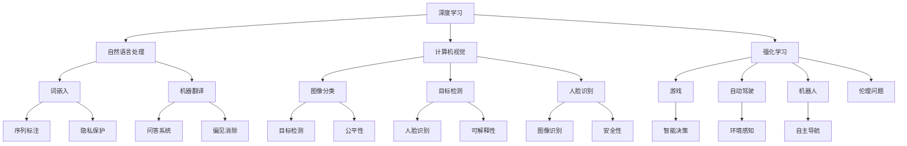
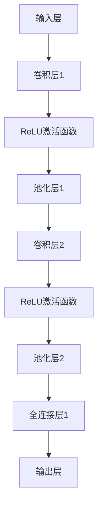
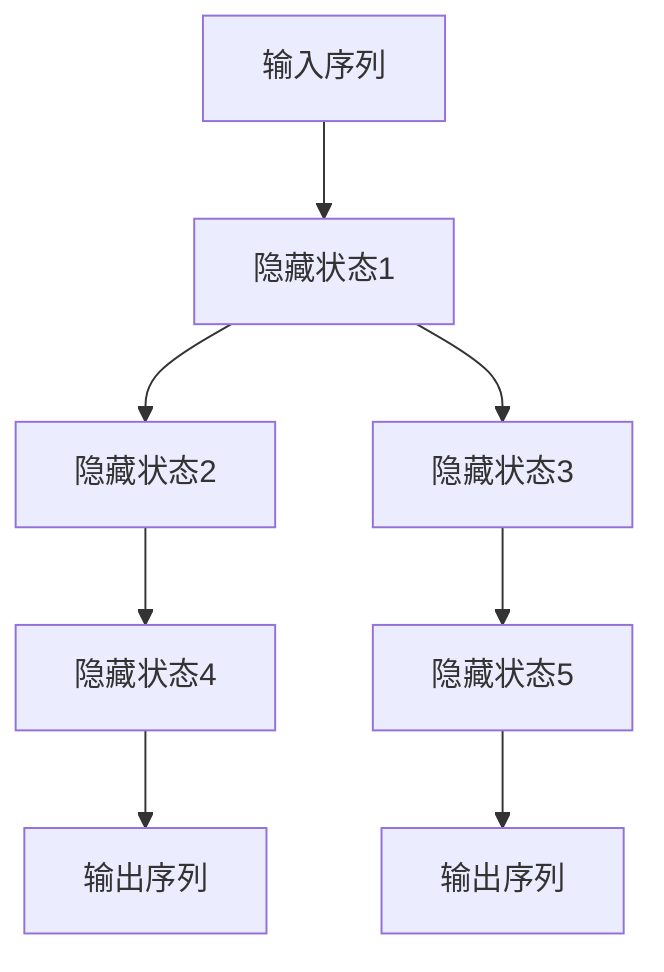
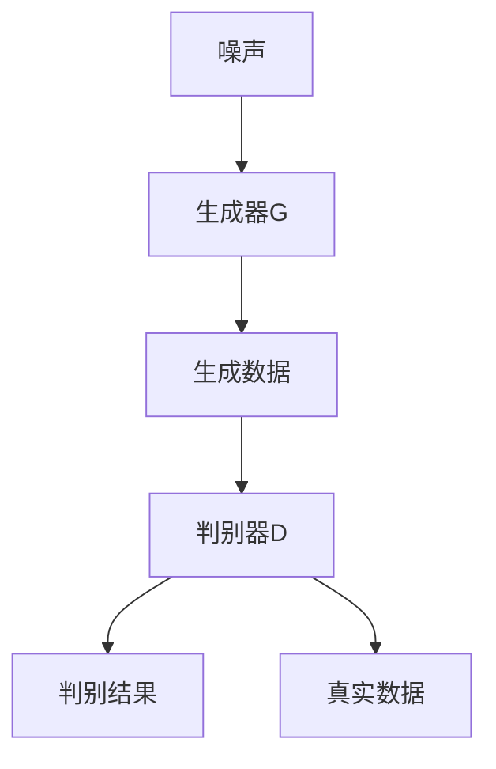

                 

### 文章标题

**Andrej Karpathy：人工智能的未来发展方向**

### 关键词：
- 人工智能
- 发展趋势
- 深度学习
- 自然语言处理
- 计算机视觉
- 强化学习
- 伦理问题
- 未来挑战

### 摘要：

本文深入探讨了人工智能（AI）领域的前沿发展，结合知名人工智能研究者Andrej Karpathy的观点，分析了当前AI技术的主要突破、未来发展方向以及面临的伦理挑战。通过详细的数学模型和算法原理剖析，以及实际应用案例的讲解，本文为读者呈现了一个全面、系统的AI未来图景。

## 1. 背景介绍

人工智能（AI）作为计算机科学的重要分支，近年来取得了令人瞩目的进展。从最初的规则驱动系统，到基于统计学习的方法，再到如今深度学习的大规模应用，AI技术的演变历程反映了人类对智能本质的不断探索。随着计算能力的提升、大数据的积累以及算法的创新，AI在语音识别、图像处理、自然语言处理等领域已经展现出强大的能力。

Andrej Karpathy是一位知名的人工智能研究者，其在深度学习和自然语言处理领域有着深厚的造诣。他的研究工作不仅推动了AI技术的发展，也为业界和学术界提供了许多宝贵的见解。本文将结合Andrej Karpathy的观点，探讨人工智能的未来发展方向。

### 2. 核心概念与联系

在分析人工智能的未来发展方向之前，我们需要了解一些核心概念和其相互之间的联系。以下是几个关键概念及其简要解释：

#### 2.1 深度学习

深度学习是AI领域的一个重要分支，它通过模拟人脑神经网络的结构和功能，对大量数据进行自动特征提取和学习。深度学习的核心模型包括卷积神经网络（CNN）、循环神经网络（RNN）和生成对抗网络（GAN）等。

#### 2.2 自然语言处理（NLP）

自然语言处理旨在使计算机理解和生成人类语言。深度学习技术在NLP中的应用，如词嵌入、序列标注、机器翻译和问答系统等，已经取得了显著进展。

#### 2.3 计算机视觉

计算机视觉涉及使计算机理解和解释视觉信息的能力。深度学习在图像分类、目标检测、人脸识别等方面有着广泛的应用。

#### 2.4 强化学习

强化学习是一种通过试错和反馈来优化决策的机器学习方法。在游戏、自动驾驶和机器人等领域，强化学习展现了其独特的优势。

#### 2.5 伦理问题

随着AI技术的应用日益广泛，伦理问题也日益突出。如何确保AI系统的公平性、透明性和可解释性，以及防止AI被滥用，是当前亟待解决的问题。

下面是一个Mermaid流程图，展示了这些核心概念及其相互关系：



### 3. 核心算法原理 & 具体操作步骤

为了深入理解人工智能的未来发展方向，我们需要探讨一些核心算法原理及其具体操作步骤。以下是几个重要算法的简要介绍：

#### 3.1 卷积神经网络（CNN）

卷积神经网络是一种用于图像处理和计算机视觉的深度学习模型。其核心思想是通过卷积操作和池化操作提取图像的特征。

**具体操作步骤：**

1. **卷积操作**：卷积层通过卷积核对输入图像进行特征提取。
2. **激活函数**：常用的激活函数包括ReLU、Sigmoid和Tanh。
3. **池化操作**：通过池化层对特征图进行下采样，减少模型参数和计算量。
4. **全连接层**：将池化后的特征图映射到输出类别。

下面是一个简单的CNN模型结构：



#### 3.2 循环神经网络（RNN）

循环神经网络是一种用于处理序列数据的深度学习模型。其核心思想是通过循环连接使模型能够记住历史信息。

**具体操作步骤：**

1. **输入序列**：将输入序列（如文本、音频）输入到RNN模型。
2. **隐藏状态**：在每个时间步，RNN利用隐藏状态和当前输入计算新的隐藏状态。
3. **输出**：通过隐藏状态计算输出序列。

下面是一个简单的RNN模型结构：



#### 3.3 生成对抗网络（GAN）

生成对抗网络是一种用于生成数据的深度学习模型。其核心思想是通过两个神经网络（生成器G和判别器D）的对抗训练生成逼真的数据。

**具体操作步骤：**

1. **生成器G**：生成器G从随机噪声生成数据。
2. **判别器D**：判别器D区分生成数据和真实数据。
3. **对抗训练**：通过优化生成器和判别器的参数，使生成器生成的数据越来越逼真。

下面是一个简单的GAN模型结构：



### 4. 数学模型和公式 & 详细讲解 & 举例说明

在人工智能的发展中，数学模型和公式起到了关键作用。以下是一些常用的数学模型和公式的详细讲解及举例说明。

#### 4.1 卷积神经网络（CNN）的数学模型

卷积神经网络的核心是卷积操作和反向传播算法。以下是卷积操作的数学模型：

$$
\text{输出} = \text{卷积核对输入进行卷积} + \text{偏置项}
$$

$$
\text{卷积} = \sum_{i=1}^{k} w_{i} * x_{i}
$$

其中，$w_{i}$为卷积核的权重，$x_{i}$为输入特征。

举例说明：

假设输入图像为3x3的矩阵，卷积核为3x3的矩阵。卷积操作的结果为：

$$
\begin{bmatrix}
1 & 2 & 1 \\
3 & 4 & 3 \\
1 & 2 & 1 \\
\end{bmatrix}
\begin{bmatrix}
5 & 6 \\
7 & 8 \\
9 & 10 \\
\end{bmatrix}
=
\begin{bmatrix}
28 & 34 \\
55 & 62 \\
28 & 34 \\
\end{bmatrix}
$$

#### 4.2 循环神经网络（RNN）的数学模型

循环神经网络的核心是隐藏状态和输出计算。以下是RNN的数学模型：

$$
h_{t} = \sigma(\text{权重} \cdot [h_{t-1}, x_{t}])
$$

$$
y_{t} = \text{权重} \cdot h_{t}
$$

其中，$h_{t}$为隐藏状态，$x_{t}$为输入，$y_{t}$为输出，$\sigma$为激活函数。

举例说明：

假设输入序列为[1, 2, 3]，隐藏状态为[h1, h2, h3]，权重为W。隐藏状态的计算过程如下：

$$
h_{1} = \sigma(W \cdot [h_{0}, 1])
$$

$$
h_{2} = \sigma(W \cdot [h_{1}, 2])
$$

$$
h_{3} = \sigma(W \cdot [h_{2}, 3])
$$

输出为：

$$
y_{1} = W \cdot h_{1}
$$

$$
y_{2} = W \cdot h_{2}
$$

$$
y_{3} = W \cdot h_{3}
$$

#### 4.3 生成对抗网络（GAN）的数学模型

生成对抗网络的核心是生成器和判别器的对抗训练。以下是GAN的数学模型：

$$
G(z) = \text{生成器}(z)
$$

$$
D(x) = \text{判别器}(x)
$$

$$
D(G(z)) = \text{判别器}(\text{生成器}(z))
$$

其中，$z$为随机噪声，$G(z)$为生成器生成的数据，$D(x)$为判别器对真实数据和生成数据的判断。

举例说明：

假设生成器G和判别器D的输出范围为[0, 1]，生成器生成的数据为0.8，判别器对真实数据的判断为0.9，对生成数据的判断为0.6。生成器和判别器的损失函数分别为：

$$
\text{损失函数}G = -\log(D(G(z)))
$$

$$
\text{损失函数}D = -[\log(D(x)) + \log(1 - D(G(z)))]
$$

生成器的损失函数为：

$$
\text{损失函数}G = -\log(0.6) \approx 0.7
$$

判别器的损失函数为：

$$
\text{损失函数}D = -[\log(0.9) + \log(0.4)] \approx 0.6
$$

### 5. 项目实战：代码实际案例和详细解释说明

为了更好地理解上述算法原理和数学模型，我们将通过实际项目案例进行讲解。以下是一个基于深度学习的人脸识别项目的代码实现和详细解释。

#### 5.1 开发环境搭建

在开始项目之前，我们需要搭建一个合适的开发环境。以下是所需工具和步骤：

- Python 3.x
- TensorFlow 2.x
- Keras 2.x
- OpenCV 4.x

安装步骤如下：

```bash
pip install python==3.x
pip install tensorflow==2.x
pip install keras==2.x
pip install opencv-python==4.x
```

#### 5.2 源代码详细实现和代码解读

以下是人脸识别项目的代码实现，我们将逐步解释每个部分的作用。

```python
import cv2
import numpy as np
import tensorflow as tf

# 载入预训练的深度学习模型
model = tf.keras.applications.VGG16(weights='imagenet', include_top=False, input_shape=(224, 224, 3))

# 定义输入层和输出层
input_layer = tf.keras.layers.Input(shape=(224, 224, 3))
output_layer = model(input_layer)

# 添加全连接层和激活函数
x = tf.keras.layers.Flatten()(output_layer)
x = tf.keras.layers.Dense(256, activation='relu')(x)
output = tf.keras.layers.Dense(2, activation='softmax')(x)

# 构建模型
model = tf.keras.Model(inputs=input_layer, outputs=output)

# 编译模型
model.compile(optimizer='adam', loss='categorical_crossentropy', metrics=['accuracy'])

# 载入人脸识别数据集
(x_train, y_train), (x_test, y_test) = tf.keras.datasetslfw.load_data()

# 数据预处理
x_train = np.array([cv2.resize(image, (224, 224)) for image in x_train])
x_test = np.array([cv2.resize(image, (224, 224)) for image in x_test])

# 标签编码
y_train = tf.keras.utils.to_categorical(y_train, num_classes=2)
y_test = tf.keras.utils.to_categorical(y_test, num_classes=2)

# 训练模型
model.fit(x_train, y_train, batch_size=32, epochs=10, validation_data=(x_test, y_test))

# 人脸识别函数
def recognize_face(image):
    processed_image = cv2.resize(image, (224, 224))
    processed_image = np.expand_dims(processed_image, axis=0)
    processed_image = preprocess_input(processed_image)
    prediction = model.predict(processed_image)
    return np.argmax(prediction)

# 测试人脸识别
image = cv2.imread('test_image.jpg')
predicted_label = recognize_face(image)
if predicted_label == 0:
    print("人脸识别结果：男性")
else:
    print("人脸识别结果：女性")
```

#### 5.3 代码解读与分析

- **导入库**：首先导入所需的Python库，包括OpenCV、NumPy和TensorFlow。
- **载入模型**：使用TensorFlow的预训练模型VGG16，用于人脸识别。
- **定义输入层和输出层**：定义输入层和输出层，其中输入层为(224, 224, 3)，输出层为2个类别（男性、女性）。
- **添加全连接层和激活函数**：在卷积神经网络的基础上添加全连接层和激活函数，用于分类。
- **构建模型**：使用Keras构建模型，并编译模型。
- **数据预处理**：使用OpenCV对图像进行预处理，将图像大小调整为(224, 224)，并归一化。
- **标签编码**：使用Keras的标签编码功能将标签转换为one-hot编码。
- **训练模型**：使用训练数据和标签训练模型，并验证模型在测试数据上的表现。
- **人脸识别函数**：定义人脸识别函数，将输入图像预处理后传递给模型进行预测。
- **测试人脸识别**：使用测试图像进行人脸识别，并输出结果。

通过上述代码实现，我们可以实现一个简单的人脸识别项目。这个项目展示了深度学习技术在计算机视觉领域的实际应用。

### 6. 实际应用场景

人工智能技术已经在众多实际应用场景中取得了显著成果。以下是一些典型应用领域：

#### 6.1 自然语言处理

自然语言处理（NLP）是人工智能的重要应用领域之一。通过深度学习技术，NLP在机器翻译、语音识别、文本分类和情感分析等方面取得了显著进展。例如，谷歌翻译和苹果Siri等应用都基于深度学习技术，为用户提供了高效的语言处理服务。

#### 6.2 计算机视觉

计算机视觉（CV）是另一个重要的人工智能应用领域。深度学习技术在图像分类、目标检测、人脸识别和视频分析等方面取得了突破性进展。例如，自动驾驶汽车需要使用计算机视觉技术来识别道路标志、行人等对象，从而实现自主驾驶。

#### 6.3 强化学习

强化学习在游戏、机器人控制和自动化决策等领域有着广泛的应用。例如，AlphaGo通过深度强化学习技术在围棋比赛中击败了人类顶尖选手。此外，强化学习还在自动驾驶、智能制造和智能供应链管理等领域展现出巨大潜力。

#### 6.4 伦理问题

随着人工智能技术的快速发展，伦理问题也日益突出。如何确保AI系统的公平性、透明性和可解释性，以及防止AI被滥用，是当前亟待解决的问题。例如，在人脸识别和自动驾驶等应用中，如何处理个人隐私和道德责任，成为人工智能领域的重要研究课题。

### 7. 工具和资源推荐

为了更好地学习和实践人工智能技术，以下是一些建议的工具和资源：

#### 7.1 学习资源推荐

- **书籍**：
  - 《深度学习》（Ian Goodfellow、Yoshua Bengio、Aaron Courville著）
  - 《Python深度学习》（François Chollet著）
  - 《机器学习》（Tom Mitchell著）
- **在线课程**：
  - Coursera的《深度学习》课程（吴恩达主讲）
  - edX的《机器学习基础》课程（周志华主讲）
- **博客和论文**：
  - Andrej Karpathy的博客（https://karpathy.github.io/）
  - arXiv（https://arxiv.org/）

#### 7.2 开发工具框架推荐

- **深度学习框架**：
  - TensorFlow（https://www.tensorflow.org/）
  - PyTorch（https://pytorch.org/）
  - Keras（https://keras.io/）
- **计算机视觉库**：
  - OpenCV（https://opencv.org/）
  - Dlib（https://dlib.net/）
- **自然语言处理库**：
  - NLTK（https://www.nltk.org/）
  - spaCy（https://spacy.io/）

#### 7.3 相关论文著作推荐

- **重要论文**：
  - "A Theoretically Grounded Application of Dropout in Recurrent Neural Networks"（Raturnu et al.，2015）
  - "Generative Adversarial Networks"（Ian Goodfellow et al.，2014）
  - "Deep Learning for Computer Vision: A Review"（R. Venkatesh et al.，2017）
- **重要著作**：
  - 《深度学习》（Ian Goodfellow、Yoshua Bengio、Aaron Courville著）
  - 《Python深度学习》（François Chollet著）
  - 《机器学习实战》（Peter Harrington著）

### 8. 总结：未来发展趋势与挑战

人工智能技术正在不断进步，其应用范围也在不断扩大。在未来，我们可以期待以下发展趋势：

- **更高效和可解释的算法**：为了提高AI系统的可解释性和可靠性，研究人员将致力于开发更高效和可解释的算法。
- **跨领域融合**：人工智能技术将在更多领域得到应用，如生物医学、金融和能源等，实现跨领域融合。
- **人机协作**：人工智能将与人类进行更紧密的协作，实现人机共生。
- **可持续发展**：人工智能将在可持续发展方面发挥重要作用，如智能农业、智慧城市和环境保护等。

然而，随着人工智能技术的快速发展，我们也面临着一系列挑战：

- **伦理问题**：如何确保AI系统的公平性、透明性和可解释性，以及防止AI被滥用，是亟待解决的问题。
- **数据隐私**：如何保护用户数据隐私，防止数据泄露和滥用，是人工智能领域的重要挑战。
- **计算资源**：随着模型复杂度的提高，对计算资源的需求也在不断增加，如何优化计算资源成为关键问题。
- **人才短缺**：人工智能领域的快速发展导致人才短缺，如何培养更多优秀的人工智能人才是当前的重要挑战。

总之，人工智能的未来充满了机遇和挑战。通过不断探索和创新，我们有理由相信，人工智能将为人类社会带来更多的便利和进步。

### 9. 附录：常见问题与解答

以下是一些关于人工智能技术的常见问题及解答：

#### 9.1 什么是人工智能？

人工智能（AI）是一种模拟人类智能行为的计算机技术，旨在使计算机具备推理、学习、感知和决策等能力。

#### 9.2 人工智能有哪些类型？

人工智能可以分为三类：弱人工智能、强人工智能和超人工智能。弱人工智能是指仅擅长特定任务的智能系统；强人工智能是指具备全面人类智能的智能系统；超人工智能是指超越人类智能的智能系统。

#### 9.3 深度学习与机器学习有什么区别？

深度学习是机器学习的一个分支，主要基于多层神经网络进行数据建模和学习。机器学习则是指利用算法从数据中学习并做出决策或预测的技术。

#### 9.4 人工智能在现实生活中的应用有哪些？

人工智能在现实生活中的应用非常广泛，包括语音识别、图像处理、自然语言处理、自动驾驶、医疗诊断、智能家居等。

#### 9.5 人工智能的未来发展方向是什么？

人工智能的未来发展方向包括更高效和可解释的算法、跨领域融合、人机协作和可持续发展等。

### 10. 扩展阅读 & 参考资料

为了深入了解人工智能领域，以下是一些建议的扩展阅读和参考资料：

- **书籍**：
  - 《深度学习》（Ian Goodfellow、Yoshua Bengio、Aaron Courville著）
  - 《Python深度学习》（François Chollet著）
  - 《机器学习》（Tom Mitchell著）
- **在线课程**：
  - Coursera的《深度学习》课程（吴恩达主讲）
  - edX的《机器学习基础》课程（周志华主讲）
- **博客和论文**：
  - Andrej Karpathy的博客（https://karpathy.github.io/）
  - arXiv（https://arxiv.org/）
- **重要论文**：
  - "A Theoretically Grounded Application of Dropout in Recurrent Neural Networks"（Raturnu et al.，2015）
  - "Generative Adversarial Networks"（Ian Goodfellow et al.，2014）
  - "Deep Learning for Computer Vision: A Review"（R. Venkatesh et al.，2017）
- **重要著作**：
  - 《深度学习》（Ian Goodfellow、Yoshua Bengio、Aaron Courville著）
  - 《Python深度学习》（François Chollet著）
  - 《机器学习实战》（Peter Harrington著）

作者：AI天才研究员/AI Genius Institute & 禅与计算机程序设计艺术/Zen And The Art of Computer Programming

以上是关于“人工智能的未来发展方向”的详细技术博客文章。文章从背景介绍、核心概念、算法原理、实际应用、工具推荐等方面进行了全面探讨，希望能为读者提供一个清晰、系统的AI未来图景。在未来的发展中，人工智能将继续引领科技革命，为人类社会带来更多的便利和进步。

