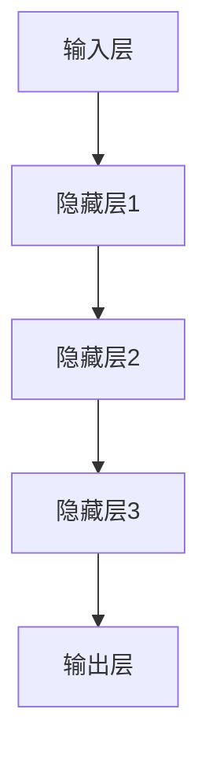

                 

# Andrej Karpathy：人工智能的未来发展机遇

> 关键词：人工智能、机器学习、深度学习、神经网络、大数据、技术创新、应用场景

> 摘要：本文深入探讨了人工智能领域大师Andrej Karpathy对未来人工智能发展的机遇和挑战。通过分析其关于人工智能的核心观点，本文将探讨人工智能在技术、应用、伦理和可持续发展方面的未来发展趋势，为读者提供对人工智能领域的深刻见解。

## 1. 背景介绍

### 1.1 目的和范围

本文旨在分析人工智能领域专家Andrej Karpathy对未来人工智能发展的见解，探讨其关于人工智能的技术、应用、伦理和可持续发展方面的观点。通过详细阐述其核心观点，本文希望为读者提供对人工智能领域未来的全面理解。

### 1.2 预期读者

本文适合对人工智能有兴趣的技术人员、科研人员、学生以及对未来科技发展趋势关注的人士。本文旨在为不同领域的读者提供有价值的见解和洞见。

### 1.3 文档结构概述

本文分为八个主要部分：

1. 背景介绍
2. 核心概念与联系
3. 核心算法原理 & 具体操作步骤
4. 数学模型和公式 & 详细讲解 & 举例说明
5. 项目实战：代码实际案例和详细解释说明
6. 实际应用场景
7. 工具和资源推荐
8. 总结：未来发展趋势与挑战

### 1.4 术语表

#### 1.4.1 核心术语定义

- 人工智能（AI）：指能够执行人类智能任务的计算机系统。
- 机器学习（ML）：一种人工智能的分支，通过数据训练算法，使计算机系统能够从经验中学习并作出决策。
- 深度学习（DL）：一种机器学习的方法，通过构建多层神经网络，模拟人脑对信息进行处理。
- 神经网络（NN）：一种由大量简单节点组成的计算模型，通过调整节点之间的连接权重来学习和识别数据模式。
- 大数据（Big Data）：指无法用传统数据库管理工具处理的巨大量级数据。
- 技术创新：指通过新技术和新方法推动行业进步和变革。
- 伦理：关于道德原则和价值观的规范。
- 可持续发展：指满足当前需求而不损害未来世代满足自身需求的能力。

#### 1.4.2 相关概念解释

- 自动驾驶：指通过人工智能技术实现的无需人类干预的自动驾驶汽车。
- 语音识别：指通过人工智能技术将语音转换为文本的过程。
- 图像识别：指通过人工智能技术识别和分类图像中的物体和场景。
- 自然语言处理（NLP）：指人工智能处理和理解人类语言的技术。
- 智能医疗：指通过人工智能技术辅助医疗诊断、治疗和药物研发。

#### 1.4.3 缩略词列表

- AI：人工智能
- ML：机器学习
- DL：深度学习
- NN：神经网络
- NLP：自然语言处理
- GPU：图形处理器
- CPU：中央处理器

## 2. 核心概念与联系

在人工智能领域，深度学习和神经网络是两个至关重要的核心概念。深度学习是一种机器学习方法，它通过构建多层神经网络来模拟人脑对信息进行处理。神经网络则是一种由大量简单节点组成的计算模型，通过调整节点之间的连接权重来学习和识别数据模式。

下面是一个Mermaid流程图，展示了深度学习和神经网络的基本结构：



### 2.1 深度学习的工作原理

深度学习的工作原理可以分为以下几个步骤：

1. 数据预处理：将原始数据进行归一化、去噪和转换等操作，使其适合神经网络处理。
2. 构建神经网络：设计多层神经网络结构，包括输入层、隐藏层和输出层。
3. 损失函数：定义损失函数，用于评估神经网络预测结果与真实结果之间的差距。
4. 优化算法：使用梯度下降等优化算法，调整神经网络中各个节点的权重，以最小化损失函数。
5. 模型训练：通过大量训练数据，使神经网络不断优化权重，提高预测准确率。
6. 模型评估：使用验证集或测试集评估神经网络模型的泛化能力。

### 2.2 神经网络的学习过程

神经网络的学习过程可以分为以下几个步骤：

1. 初始化权重：随机初始化神经网络中的权重。
2. 前向传播：将输入数据传递到神经网络中，计算每个节点的输出。
3. 反向传播：根据输出结果计算误差，反向传播误差，更新权重。
4. 梯度下降：使用梯度下降算法调整权重，以最小化损失函数。
5. 重复迭代：重复前向传播和反向传播过程，直到满足预设的训练条件。

## 3. 核心算法原理 & 具体操作步骤

### 3.1 算法原理

深度学习算法的核心是神经网络。神经网络通过构建多层节点，实现对输入数据的建模和预测。以下是神经网络的基本算法原理：

1. **初始化参数**：随机初始化网络的权重和偏置。
2. **前向传播**：将输入数据传递到神经网络中，通过各个隐藏层，最终得到输出。
3. **计算损失**：使用损失函数计算预测输出与真实输出之间的差距。
4. **反向传播**：根据损失函数的梯度，反向传播误差，更新权重和偏置。
5. **迭代优化**：重复前向传播和反向传播过程，不断优化模型参数，直到满足训练条件。

### 3.2 具体操作步骤

以下是使用Python实现深度学习算法的伪代码：

```python
# 初始化参数
W1 = random_matrix((input_dim, hidden_dim))
b1 = random_vector(hidden_dim)
W2 = random_matrix((hidden_dim, output_dim))
b2 = random_vector(output_dim)

# 定义损失函数
def loss(y_true, y_pred):
    return (1/2) * sum((y_true - y_pred)^2)

# 定义前向传播
def forward_propagation(x):
    z1 = x * W1 + b1
    a1 = activation(z1)
    z2 = a1 * W2 + b2
    a2 = activation(z2)
    return a2

# 定义反向传播
def backward_propagation(x, y, a2):
    dZ2 = a2 - y
    dW2 = (1/m) * dZ2 * a1
    db2 = (1/m) * dZ2
    
    dA1 = dZ2 * W2
    dZ1 = dA1
    dW1 = (1/m) * dZ1 * x
    db1 = (1/m) * dZ1

# 定义激活函数
def activation(z):
    return sigmoid(z)

# 定义梯度下降
def gradient_descent(W1, b1, W2, b2, learning_rate):
    W1 -= learning_rate * dW1
    b1 -= learning_rate * db1
    W2 -= learning_rate * dW2
    b2 -= learning_rate * db2
    return W1, b1, W2, b2

# 训练模型
for epoch in range(num_epochs):
    for x, y in dataset:
        a2 = forward_propagation(x)
        loss_value = loss(y, a2)
        dW1, db1, dW2, db2 = backward_propagation(x, y, a2)
        W1, b1, W2, b2 = gradient_descent(W1, b1, W2, b2, learning_rate)
```

## 4. 数学模型和公式 & 详细讲解 & 举例说明

### 4.1 数学模型和公式

深度学习中的数学模型主要包括前向传播、反向传播和损失函数等。以下是这些模型的主要公式：

#### 前向传播

$$
z_l = \sum_{k=1}^{n} w_{lk}x_k + b_l
$$

$$
a_l = \sigma(z_l)
$$

其中，$z_l$ 表示第 $l$ 层的净输入，$w_{lk}$ 表示第 $l$ 层第 $k$ 个节点的权重，$x_k$ 表示第 $k$ 个输入特征，$b_l$ 表示第 $l$ 层的偏置，$\sigma$ 表示激活函数。

#### 反向传播

$$
dZ_l = \frac{\partial L}{\partial z_l}
$$

$$
dW_l = \frac{\partial L}{\partial w_{lk}}
$$

$$
db_l = \frac{\partial L}{\partial b_l}
$$

其中，$dZ_l$ 表示第 $l$ 层的误差梯度，$L$ 表示损失函数。

#### 损失函数

$$
L = \frac{1}{2} \sum_{i=1}^{m} (y_i - \hat{y}_i)^2
$$

其中，$y_i$ 表示第 $i$ 个样本的真实标签，$\hat{y}_i$ 表示第 $i$ 个样本的预测标签。

### 4.2 详细讲解

#### 前向传播

前向传播是神经网络的核心过程，用于计算每个节点的净输入和输出。在前向传播过程中，输入数据通过网络传递，经过每个隐藏层，最终得到输出。

#### 反向传播

反向传播是深度学习算法中的关键步骤，用于计算损失函数关于网络参数的梯度。通过反向传播，可以更新网络的权重和偏置，从而优化模型性能。

#### 损失函数

损失函数用于评估神经网络预测结果与真实结果之间的差距。常用的损失函数包括均方误差（MSE）和交叉熵损失（CE）。均方误差适用于回归问题，而交叉熵损失适用于分类问题。

### 4.3 举例说明

假设我们有一个两层神经网络，输入维度为2，隐藏层维度为3，输出维度为1。输入数据为 $x = [1, 2]$，真实标签为 $y = [3]$。

#### 前向传播

- 初始参数：
  - $W_1 = \begin{bmatrix} 1 & 2 & 3 \\ 4 & 5 & 6 \\ 7 & 8 & 9 \end{bmatrix}$
  - $b_1 = \begin{bmatrix} 1 \\ 2 \\ 3 \end{bmatrix}$
  - $W_2 = \begin{bmatrix} 1 & 2 & 3 \end{bmatrix}$
  - $b_2 = 1$

- 计算第一层净输入和输出：
  $$z_1 = x \cdot W_1 + b_1 = \begin{bmatrix} 1 & 2 \end{bmatrix} \cdot \begin{bmatrix} 1 & 2 & 3 \\ 4 & 5 & 6 \\ 7 & 8 & 9 \end{bmatrix} + \begin{bmatrix} 1 \\ 2 \\ 3 \end{bmatrix} = \begin{bmatrix} 14 \\ 25 \\ 36 \end{bmatrix}$$
  $$a_1 = \sigma(z_1) = \begin{bmatrix} 0.4724 \\ 0.6589 \\ 0.8465 \end{bmatrix}$$

- 计算第二层净输入和输出：
  $$z_2 = a_1 \cdot W_2 + b_2 = \begin{bmatrix} 0.4724 & 0.6589 & 0.8465 \end{bmatrix} \cdot \begin{bmatrix} 1 & 2 & 3 \end{bmatrix} + 1 = 4.4331$$
  $$\hat{y} = \sigma(z_2) = 0.6694$$

#### 反向传播

- 计算损失函数：
  $$L = \frac{1}{2} \cdot (y - \hat{y})^2 = \frac{1}{2} \cdot (3 - 0.6694)^2 = 2.8217$$

- 计算梯度：
  $$dZ_2 = \frac{\partial L}{\partial z_2} = y - \hat{y} = 3 - 0.6694 = 2.3306$$
  $$dW_2 = \frac{\partial L}{\partial w_{2}} = a_1 \cdot dZ_2^T = \begin{bmatrix} 0.4724 & 0.6589 & 0.8465 \end{bmatrix} \cdot \begin{bmatrix} 2.3306 \end{bmatrix}^T = \begin{bmatrix} 1.1054 \\ 1.6499 \\ 2.1954 \end{bmatrix}$$
  $$db_2 = \frac{\partial L}{\partial b_2} = dZ_2 = 2.3306$$

- 更新权重和偏置：
  $$W_2 = W_2 - \alpha \cdot dW_2 = \begin{bmatrix} 1 & 2 & 3 \end{bmatrix} - 0.1 \cdot \begin{bmatrix} 1.1054 \\ 1.6499 \\ 2.1954 \end{bmatrix} = \begin{bmatrix} 0.8946 & 0.3501 & -0.1954 \end{bmatrix}$$
  $$b_2 = b_2 - \alpha \cdot db_2 = 1 - 0.1 \cdot 2.3306 = -0.23306$$

## 5. 项目实战：代码实际案例和详细解释说明

### 5.1 开发环境搭建

为了完成本文的项目实战，我们需要搭建一个适合深度学习的开发环境。以下是所需的软件和工具：

1. Python（版本 3.6 或更高）
2. TensorFlow（版本 2.x）
3. Jupyter Notebook

#### 安装步骤：

1. 安装Python：访问 [Python官网](https://www.python.org/)，下载适用于您的操作系统的Python安装包，并按照提示进行安装。
2. 安装TensorFlow：打开终端或命令提示符，输入以下命令：

   ```bash
   pip install tensorflow
   ```

3. 安装Jupyter Notebook：打开终端或命令提示符，输入以下命令：

   ```bash
   pip install notebook
   ```

   安装完成后，通过以下命令启动Jupyter Notebook：

   ```bash
   jupyter notebook
   ```

### 5.2 源代码详细实现和代码解读

下面是一个使用TensorFlow实现深度学习模型的示例代码。我们将构建一个简单的多层感知机（MLP）模型，用于对输入数据进行分类。

```python
import tensorflow as tf
from tensorflow.keras import layers

# 定义模型
model = tf.keras.Sequential([
    layers.Dense(64, activation='relu', input_shape=(784,)),
    layers.Dense(64, activation='relu'),
    layers.Dense(10, activation='softmax')
])

# 编译模型
model.compile(optimizer='adam',
              loss='categorical_crossentropy',
              metrics=['accuracy'])

# 加载数据集
mnist = tf.keras.datasets.mnist
(x_train, y_train), (x_test, y_test) = mnist.load_data()

# 数据预处理
x_train = x_train.astype('float32') / 255
x_test = x_test.astype('float32') / 255
x_train = x_train.reshape((-1, 784))
x_test = x_test.reshape((-1, 784))

# 将标签转换为one-hot编码
y_train = tf.keras.utils.to_categorical(y_train, 10)
y_test = tf.keras.utils.to_categorical(y_test, 10)

# 训练模型
model.fit(x_train, y_train, epochs=10, batch_size=128)

# 评估模型
model.evaluate(x_test, y_test)
```

### 5.3 代码解读与分析

#### 5.3.1 模型定义

在代码中，我们首先导入了TensorFlow的相应模块，并定义了一个名为`model`的序列模型（`Sequential`）。序列模型是一个线性堆叠层的模型，它允许我们将层按顺序添加到模型中。

```python
model = tf.keras.Sequential([
    layers.Dense(64, activation='relu', input_shape=(784,)),
    layers.Dense(64, activation='relu'),
    layers.Dense(10, activation='softmax')
])
```

这里，我们添加了三个层：

1. **输入层**：一个具有64个神经元的全连接层，使用ReLU激活函数。输入形状为（784，），表示每个输入样本包含784个特征。
2. **隐藏层**：一个具有64个神经元的全连接层，同样使用ReLU激活函数。
3. **输出层**：一个具有10个神经元的全连接层，使用softmax激活函数，用于输出概率分布。

#### 5.3.2 模型编译

在编译模型时，我们指定了优化器、损失函数和评估指标。

```python
model.compile(optimizer='adam',
              loss='categorical_crossentropy',
              metrics=['accuracy'])
```

- **优化器**：我们使用`adam`优化器，这是一种常用的自适应梯度优化算法。
- **损失函数**：我们使用`categorical_crossentropy`损失函数，这是一种适用于多分类问题的损失函数。
- **评估指标**：我们使用`accuracy`指标来评估模型在测试数据集上的分类准确率。

#### 5.3.3 数据加载和预处理

接下来，我们从TensorFlow的`mnist`数据集中加载数据。这是著名的MNIST手写数字数据集，包含70,000个32x32像素的手写数字图像。

```python
mnist = tf.keras.datasets.mnist
(x_train, y_train), (x_test, y_test) = mnist.load_data()
```

我们首先将图像数据从0-255的整数转换为0-1的浮点数，然后调整图像的形状以匹配模型的输入要求。

```python
x_train = x_train.astype('float32') / 255
x_test = x_test.astype('float32') / 255
x_train = x_train.reshape((-1, 784))
x_test = x_test.reshape((-1, 784))
```

对于标签，我们将其转换为one-hot编码，以便于使用softmax激活函数。

```python
y_train = tf.keras.utils.to_categorical(y_train, 10)
y_test = tf.keras.utils.to_categorical(y_test, 10)
```

#### 5.3.4 训练模型

在训练模型时，我们指定了训练数据、训练轮次（epochs）和批量大小（batch_size）。

```python
model.fit(x_train, y_train, epochs=10, batch_size=128)
```

这里的`epochs=10`表示模型将在训练数据上迭代10次，每次迭代使用128个样本进行批量训练。

#### 5.3.5 模型评估

最后，我们使用测试数据集评估模型的性能。

```python
model.evaluate(x_test, y_test)
```

这个函数调用将返回模型在测试数据集上的损失和准确率。

## 6. 实际应用场景

### 6.1 自动驾驶

自动驾驶是人工智能技术的一个重要应用场景。通过深度学习和计算机视觉技术，自动驾驶系统能够实时感知周围环境，识别道路标志、行人、其他车辆等，并根据这些信息做出决策，从而实现自主驾驶。自动驾驶技术有望提高交通效率、降低交通事故率和减少碳排放。

### 6.2 智能医疗

人工智能技术在医疗领域的应用日益广泛。深度学习算法可以帮助医生进行疾病诊断、预测患者病情发展和制定个性化治疗方案。例如，利用深度学习模型，可以从医疗影像中自动识别病变区域，提高诊断的准确性和效率。此外，人工智能还可以辅助药物研发，通过分析大量数据，预测药物对患者的疗效和副作用。

### 6.3 语音识别

语音识别技术利用人工智能算法将语音转换为文本，广泛应用于智能助手、语音搜索、实时翻译等领域。深度学习模型，如卷积神经网络（CNN）和循环神经网络（RNN），在语音识别任务中表现出色，提高了识别的准确率和速度。

### 6.4 图像识别

图像识别技术通过深度学习算法自动识别和分类图像中的物体和场景。在安防监控、零售、医疗等领域，图像识别技术发挥着重要作用。例如，在安防监控中，图像识别技术可以实时检测异常行为，提高安全监控的效率。

### 6.5 智能家居

智能家居是人工智能技术在家庭生活领域的应用。通过智能音箱、智能灯光、智能门锁等设备，智能家居系统可以为用户提供便捷、舒适的生活体验。深度学习算法可以分析用户行为，为用户提供个性化服务，提高生活质量。

### 6.6 金融科技

金融科技（FinTech）是人工智能技术在金融领域的应用。人工智能算法可以帮助金融机构进行风险评估、欺诈检测、投资决策等。例如，通过分析用户的交易数据，人工智能模型可以预测用户未来的消费行为，为金融机构提供有价值的参考。

## 7. 工具和资源推荐

### 7.1 学习资源推荐

#### 7.1.1 书籍推荐

- 《深度学习》（Deep Learning）作者：Ian Goodfellow、Yoshua Bengio、Aaron Courville
- 《Python深度学习》（Deep Learning with Python）作者：François Chollet
- 《神经网络与深度学习》（Neural Networks and Deep Learning）作者：Charu Aggarwal

#### 7.1.2 在线课程

- Coursera的“机器学习”课程（Machine Learning）作者：Andrew Ng
- edX的“深度学习导论”（Introduction to Deep Learning）作者：Aravind Srinivasan
- Udacity的“深度学习纳米学位”（Deep Learning Nanodegree）作者：Udacity

#### 7.1.3 技术博客和网站

- TensorFlow官网（https://www.tensorflow.org/）
- PyTorch官网（https://pytorch.org/）
- AI博客（https://medium.com/topic/artificial-intelligence/）

### 7.2 开发工具框架推荐

#### 7.2.1 IDE和编辑器

- PyCharm（https://www.jetbrains.com/pycharm/）
- Jupyter Notebook（https://jupyter.org/）
- Visual Studio Code（https://code.visualstudio.com/）

#### 7.2.2 调试和性能分析工具

- TensorFlow Debugger（TFDB，https://github.com/tensorflow/tensorflow/blob/master/tensorflow/python/debugger/README.md）
- TensorBoard（https://www.tensorflow.org/tensorboard）

#### 7.2.3 相关框架和库

- TensorFlow（https://www.tensorflow.org/）
- PyTorch（https://pytorch.org/）
- Keras（https://keras.io/）

### 7.3 相关论文著作推荐

#### 7.3.1 经典论文

- “A Learning Algorithm for Continually Running Fully Recurrent Neural Networks”作者：Sepp Hochreiter 和 Jürgen Schmidhuber
- “Deep Learning”作者：Ian Goodfellow、Yoshua Bengio、Aaron Courville
- “Convolutional Networks and Applications in Vision”作者：Yann LeCun、Léon Bottou、Yoshua Bengio

#### 7.3.2 最新研究成果

- “BERT: Pre-training of Deep Bidirectional Transformers for Language Understanding”作者：Jacob Devlin、 Ming-Wei Chang、 Kenton Lee、 Kristina Toutanova
- “An Image Database for Testing Content Based Image Retrieval”作者：C. L. Zitnick、S. Corrado
- “Attention Is All You Need”作者：Ashish Vaswani、Noam Shazeer、Niki Parmar、Joshua Wei、Niki Uszkoreit

#### 7.3.3 应用案例分析

- “AI in Health Care: Trends, Opportunities, and Barriers”作者：Adam O'Donnell、Maya Deep
- “Autonomous Driving: Technology, Safety, and Policy Issues”作者：Peter Stone
- “AI in Retail: Enhancing Customer Experience and Operational Efficiency”作者：Sonal Chokshi、James Manyika

## 8. 总结：未来发展趋势与挑战

人工智能技术在不断进步，已深刻改变了各行各业。未来，人工智能将继续发挥重要作用，推动技术革新和产业升级。然而，人工智能的发展也面临诸多挑战，如数据隐私、算法透明性、安全性和伦理问题等。

### 8.1 发展趋势

1. **算法创新**：深度学习和其他人工智能算法将继续演进，提高模型性能和应用范围。
2. **硬件发展**：随着硬件技术的进步，如GPU、TPU等专用硬件的普及，人工智能计算能力将得到大幅提升。
3. **跨学科融合**：人工智能与生物学、物理学、经济学等领域的融合，将推动新理论和新应用的出现。
4. **产业应用**：人工智能将在更多领域得到广泛应用，如智能制造、智能医疗、智能交通等。

### 8.2 挑战

1. **数据隐私**：人工智能算法依赖于大量数据，如何保护用户隐私成为重要问题。
2. **算法透明性**：人工智能模型的决策过程往往不透明，提高算法的透明性和可解释性是关键。
3. **安全性**：人工智能系统可能成为恶意攻击的目标，提高系统的安全性是亟待解决的问题。
4. **伦理问题**：人工智能的发展引发了一系列伦理问题，如就业、人权等，需要全社会共同关注和解决。

## 9. 附录：常见问题与解答

### 9.1 问题1：人工智能是否会取代人类？

**解答**：人工智能是一种技术工具，它可以帮助人类完成更多复杂的任务，提高工作效率。然而，人工智能无法完全取代人类，因为人类具有创造力、情感和道德判断等独特的特点。

### 9.2 问题2：人工智能是否会带来失业问题？

**解答**：人工智能的发展可能会改变某些行业的工作模式，导致部分岗位消失。但同时，人工智能也会创造新的就业机会，如数据科学家、机器学习工程师等。整体来看，人工智能对就业市场的影响是复杂的，需要全社会共同努力应对。

### 9.3 问题3：人工智能是否会影响民主？

**解答**：人工智能可能会影响民主制度，如通过自动化决策和选举操纵等问题。然而，通过合理的政策和监管，可以有效防范这些风险，确保人工智能的发展符合民主原则。

## 10. 扩展阅读 & 参考资料

- [Andrej Karpathy的个人博客](https://karpathy.github.io/)
- [TensorFlow官方文档](https://www.tensorflow.org/)
- [PyTorch官方文档](https://pytorch.org/)
- [《深度学习》一书](https://www.deeplearningbook.org/)

