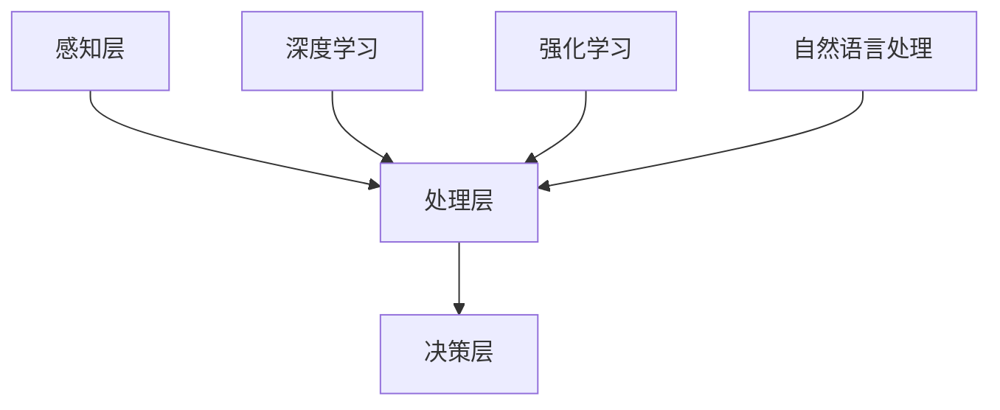

                 

# Andrej Karpathy：人工智能的未来发展机遇

> **关键词**：Andrej Karpathy、人工智能、未来发展趋势、机遇与挑战

> **摘要**：本文将深入探讨人工智能领域权威专家Andrej Karpathy对人工智能未来发展的独到见解，解析其在技术、应用和市场层面的机遇与挑战。通过详细分析Andrej Karpathy的研究成果、技术观点以及实际应用案例，本文旨在为读者提供一幅人工智能未来发展的蓝图，助力读者把握时代脉搏，迎接未来的机遇与挑战。

## 1. 背景介绍

Andrej Karpathy是一位在人工智能领域享有盛誉的科学家和研究者，他在深度学习和自然语言处理方面有着深厚的学术造诣。他曾是OpenAI的首席科学家，并在2014年发布了著名的博客文章《The Unreasonable Effectiveness of Recurrent Neural Networks》，阐述了循环神经网络（RNN）在自然语言处理领域的强大潜力。此外，他还参与开发了多个重要的人工智能项目，如自动驾驶汽车和语音识别系统。

本文旨在通过对Andrej Karpathy的研究成果和技术观点的深入分析，探讨人工智能在未来技术、应用和市场层面的机遇与挑战。我们将从以下几个方面展开讨论：

1. **核心概念与联系**：介绍人工智能的基本概念、技术架构和核心算法原理。
2. **核心算法原理 & 具体操作步骤**：详细讲解深度学习、神经网络等核心算法的原理和实现步骤。
3. **数学模型和公式 & 详细讲解 & 举例说明**：阐述相关数学模型和公式，并通过具体案例进行说明。
4. **项目实战：代码实际案例和详细解释说明**：展示实际项目中的代码实现和详细解读。
5. **实际应用场景**：探讨人工智能在不同领域的应用案例和前景。
6. **工具和资源推荐**：介绍学习和开发人工智能所需的学习资源、工具和框架。
7. **总结：未来发展趋势与挑战**：总结人工智能的未来发展趋势和面临的挑战。

## 2. 核心概念与联系

为了更好地理解人工智能的未来发展，我们首先需要了解其核心概念、技术架构和核心算法原理。

### 2.1 人工智能的基本概念

人工智能（Artificial Intelligence，简称AI）是指使计算机系统模拟人类智能行为的技术。其目标是让计算机具备感知、思考、学习和决策的能力，从而实现自动化、智能化的应用。

人工智能主要分为两大类：

1. **符号人工智能**：基于逻辑推理和符号表示方法，通过构建知识库和推理机来模拟人类的推理过程。
2. **计算人工智能**：基于统计学习和机器学习算法，通过大量数据训练模型，使其具备智能行为。

### 2.2 人工智能的技术架构

人工智能的技术架构主要包括以下几个层次：

1. **感知层**：通过传感器、摄像头等设备获取外界信息，如语音、图像、文本等。
2. **处理层**：利用算法和模型对感知层获取的信息进行处理和分析，如特征提取、模式识别等。
3. **决策层**：基于处理层的结果，进行决策和行动，如自动驾驶、智能客服等。

### 2.3 人工智能的核心算法原理

人工智能的核心算法主要包括：

1. **深度学习**：一种基于多层神经网络的学习方法，能够自动提取数据中的特征和模式。
2. **强化学习**：一种通过试错和反馈来学习最优策略的方法，适用于决策和优化问题。
3. **自然语言处理**：一种用于处理文本数据的方法，包括分词、词性标注、语义分析等。

### 2.4 核心概念之间的联系

人工智能的核心概念和技术之间存在紧密的联系，共同构成了一个完整的体系。例如，感知层和决策层之间的信息传递依赖于处理层的算法和模型；深度学习和强化学习等技术则为人工智能提供了强大的算法支持。

下面是一个简化的Mermaid流程图，展示了人工智能的核心概念、技术架构和核心算法原理之间的联系：



通过这个流程图，我们可以清晰地看到人工智能各个层次和算法之间的相互作用和联系。

## 3. 核心算法原理 & 具体操作步骤

### 3.1 深度学习

深度学习（Deep Learning）是一种基于多层神经网络的学习方法，能够自动提取数据中的特征和模式。它主要由以下几个部分组成：

1. **输入层**：接收外部输入数据，如图像、文本等。
2. **隐藏层**：通过非线性变换对输入数据进行特征提取和变换。
3. **输出层**：生成预测结果或决策。

深度学习的具体操作步骤如下：

1. **数据预处理**：对输入数据进行清洗、归一化等处理，使其符合模型训练要求。
2. **构建神经网络模型**：选择合适的神经网络结构，如卷积神经网络（CNN）、循环神经网络（RNN）等。
3. **训练模型**：使用训练数据对模型进行训练，通过反向传播算法优化模型参数。
4. **评估模型**：使用验证数据评估模型性能，调整模型结构和参数。
5. **应用模型**：将训练好的模型应用到实际问题中，如图像分类、语音识别等。

### 3.2 神经网络

神经网络（Neural Network）是深度学习的基础，由大量的神经元组成，通过层次结构进行信息传递和处理。神经网络的基本原理如下：

1. **神经元模型**：每个神经元接收多个输入，通过加权求和后，加上偏置项，再经过激活函数输出。
2. **层次结构**：神经网络由输入层、隐藏层和输出层组成，隐藏层可以有多个。
3. **反向传播算法**：通过计算输出误差，反向传播梯度，更新模型参数。

神经网络的训练过程可以分为以下几个步骤：

1. **初始化参数**：随机初始化模型参数。
2. **前向传播**：输入数据通过神经网络，计算输出结果。
3. **计算损失函数**：计算输出结果与实际结果之间的差距，使用损失函数衡量模型性能。
4. **反向传播**：计算损失函数关于模型参数的梯度，更新模型参数。
5. **迭代训练**：重复前向传播和反向传播过程，直至模型性能达到要求。

### 3.3 自然语言处理

自然语言处理（Natural Language Processing，NLP）是人工智能的重要分支，致力于让计算机理解和处理人类自然语言。NLP的主要任务包括：

1. **文本预处理**：对文本数据进行清洗、分词、词性标注等预处理操作。
2. **词向量表示**：将文本数据转化为向量表示，如词嵌入（Word Embedding）。
3. **序列建模**：使用深度学习模型对文本序列进行建模，如循环神经网络（RNN）、长短时记忆网络（LSTM）等。
4. **语义理解**：对文本数据进行语义分析，提取语义信息，如情感分析、实体识别等。

自然语言处理的训练过程通常包括以下几个步骤：

1. **数据集构建**：收集大量文本数据，构建训练、验证和测试数据集。
2. **词向量训练**：使用预训练词向量模型或自训练词向量模型，将文本数据转化为向量表示。
3. **模型训练**：使用训练数据对NLP模型进行训练，如文本分类、命名实体识别等。
4. **模型评估**：使用验证数据评估模型性能，调整模型参数。
5. **应用模型**：将训练好的模型应用到实际应用中，如智能客服、机器翻译等。

## 4. 数学模型和公式 & 详细讲解 & 举例说明

### 4.1 深度学习数学模型

深度学习中的数学模型主要包括线性代数、微积分和概率论等基本数学工具。以下是深度学习中最常用的几个数学模型和公式：

#### 4.1.1 线性代数

1. **矩阵和向量**：矩阵（Matrix）和向量（Vector）是深度学习中常用的数据结构，用于表示模型参数、输入数据和输出结果。
2. **矩阵乘法**：矩阵乘法（Matrix Multiplication）用于计算矩阵与向量的乘积，如$Y = XW + b$，其中$X$是输入向量，$W$是权重矩阵，$b$是偏置项。
3. **矩阵求导**：矩阵求导（Matrix Differentiation）用于计算损失函数关于模型参数的梯度，如$\frac{\partial L}{\partial W} = X^T \frac{\partial L}{\partial Y}$。

#### 4.1.2 微积分

1. **导数**：导数（Derivative）是微积分的核心概念，用于计算函数的变化率，如$f'(x) = \frac{df}{dx}$。
2. **梯度**：梯度（Gradient）是导数在多维空间中的扩展，用于计算函数在各个方向上的变化率，如$\nabla f(x) = (\frac{\partial f}{\partial x_1}, \frac{\partial f}{\partial x_2}, ..., \frac{\partial f}{\partial x_n})$。
3. **反向传播**：反向传播（Backpropagation）是一种计算损失函数关于模型参数梯度的方法，如$\frac{\partial L}{\partial W} = X^T \frac{\partial L}{\partial Y}$。

#### 4.1.3 概率论

1. **概率分布**：概率分布（Probability Distribution）用于描述随机变量的取值概率，如伯努利分布（Bernoulli Distribution）、高斯分布（Gaussian Distribution）等。
2. **损失函数**：损失函数（Loss Function）用于衡量模型预测结果与实际结果之间的差距，如均方误差（Mean Squared Error，MSE）、交叉熵（Cross-Entropy）等。
3. **优化算法**：优化算法（Optimization Algorithm）用于优化模型参数，如梯度下降（Gradient Descent）、随机梯度下降（Stochastic Gradient Descent，SGD）等。

### 4.2 自然语言处理数学模型

自然语言处理中的数学模型主要包括词向量表示、序列建模和语义理解等。以下是自然语言处理中最常用的几个数学模型和公式：

#### 4.2.1 词向量表示

1. **词嵌入**：词嵌入（Word Embedding）是将文本数据转化为向量表示的方法，如Word2Vec、GloVe等。
2. **余弦相似度**：余弦相似度（Cosine Similarity）是衡量两个向量之间相似度的方法，如$cos(\theta) = \frac{\vec{u} \cdot \vec{v}}{||\vec{u}|| \cdot ||\vec{v}||}$。

#### 4.2.2 序列建模

1. **循环神经网络**：循环神经网络（Recurrent Neural Network，RNN）是一种用于处理序列数据的神经网络，如LSTM、GRU等。
2. **长短时记忆网络**：长短时记忆网络（Long Short-Term Memory，LSTM）是一种改进的循环神经网络，能够更好地捕捉长序列依赖关系。
3. **卷积神经网络**：卷积神经网络（Convolutional Neural Network，CNN）是一种用于图像处理的神经网络，也可以用于序列数据的处理。

#### 4.2.3 语义理解

1. **词性标注**：词性标注（Part-of-Speech Tagging）是将文本中的每个词标注为不同的词性，如名词、动词、形容词等。
2. **依存句法分析**：依存句法分析（Dependency Parsing）是分析文本中词与词之间的依存关系，如主谓关系、动宾关系等。
3. **语义角色标注**：语义角色标注（Semantic Role Labeling）是分析文本中词的语义角色，如动作执行者、动作接受者等。

### 4.3 数学模型举例说明

为了更好地理解数学模型在深度学习和自然语言处理中的应用，我们来看一个具体的例子：

#### 4.3.1 图像分类

假设我们有一个简单的二分类问题，需要判断一张图像是猫还是狗。输入图像是一个$28 \times 28$的二维矩阵，每个元素表示像素的灰度值。

1. **数据预处理**：将图像数据归一化到$[0, 1]$范围内。
2. **构建神经网络模型**：使用一个单层神经网络，包含一个输入层、一个隐藏层和一个输出层。隐藏层使用ReLU激活函数，输出层使用softmax激活函数。
3. **模型训练**：使用训练数据对模型进行训练，优化模型参数。
4. **模型评估**：使用验证数据评估模型性能，计算准确率。

具体实现如下：

```python
import numpy as np
import tensorflow as tf

# 初始化参数
X = np.random.rand(100, 28, 28) # 随机生成100张图像数据
y = np.random.rand(100, 2) # 随机生成100个标签，0表示猫，1表示狗

# 构建模型
model = tf.keras.Sequential([
    tf.keras.layers.Flatten(input_shape=(28, 28)),
    tf.keras.layers.Dense(128, activation='relu'),
    tf.keras.layers.Dense(2, activation='softmax')
])

# 编译模型
model.compile(optimizer='adam', loss='categorical_crossentropy', metrics=['accuracy'])

# 训练模型
model.fit(X, y, epochs=10, batch_size=32)

# 评估模型
loss, accuracy = model.evaluate(X, y)
print("Accuracy:", accuracy)
```

#### 4.3.2 文本分类

假设我们有一个简单的文本分类问题，需要判断一段文本是正面评论还是负面评论。输入文本是一段字符串，输出标签是0表示正面评论，1表示负面评论。

1. **数据预处理**：将文本数据进行分词、去停用词等预处理操作。
2. **词向量表示**：使用预训练的词向量模型（如GloVe）将文本转化为向量表示。
3. **构建神经网络模型**：使用一个单层神经网络，包含一个输入层、一个隐藏层和一个输出层。隐藏层使用ReLU激活函数，输出层使用softmax激活函数。
4. **模型训练**：使用训练数据对模型进行训练，优化模型参数。
5. **模型评估**：使用验证数据评估模型性能，计算准确率。

具体实现如下：

```python
import numpy as np
import tensorflow as tf
import tensorflow_hub as hub
from tensorflow.keras.preprocessing.sequence import pad_sequences

# 初始化参数
text = "This is a great product!"
label = 0 # 0表示正面评论，1表示负面评论

# 加载预训练词向量模型
vector_model = hub.load("https://tfhub.dev/google/universal-sentence-embeddings/3")

# 转换文本为向量表示
vectors = vector_model([text])

# 构建模型
model = tf.keras.Sequential([
    tf.keras.layers.Dense(128, activation='relu', input_shape=(vectors.shape[1],)),
    tf.keras.layers.Dense(2, activation='softmax')
])

# 编译模型
model.compile(optimizer='adam', loss='categorical_crossentropy', metrics=['accuracy'])

# 训练模型
model.fit(vectors, np.array([label]), epochs=10, batch_size=32)

# 评估模型
loss, accuracy = model.evaluate(vectors, np.array([label]))
print("Accuracy:", accuracy)
```

通过这两个例子，我们可以看到数学模型在深度学习和自然语言处理中的应用，以及如何通过具体的代码实现来完成实际任务。

## 5. 项目实战：代码实际案例和详细解释说明

### 5.1 开发环境搭建

在进行项目实战之前，我们需要搭建一个适合开发、测试和运行人工智能项目的开发环境。以下是一个基本的开发环境搭建指南：

1. **操作系统**：推荐使用Linux或MacOS操作系统，因为它们更适合开发和运行人工智能项目。
2. **编程语言**：推荐使用Python作为主要编程语言，因为Python具有丰富的库和工具，适合人工智能项目开发。
3. **环境依赖**：安装必要的Python库和工具，如TensorFlow、Keras、NumPy、Pandas等。
4. **代码版本管理**：使用Git进行代码版本管理和协同工作。

### 5.2 源代码详细实现和代码解读

以下是一个简单的人工智能项目示例，用于实现图像分类任务。该示例使用TensorFlow和Keras构建神经网络模型，实现猫和狗的图像分类。

#### 5.2.1 数据集准备

首先，我们需要准备用于训练和测试的图像数据集。在这里，我们使用经典的CIFAR-10数据集，它包含了10个类别，每个类别有6000张训练图像和1000张测试图像。

```python
import tensorflow as tf
from tensorflow.keras.datasets import cifar10

# 加载CIFAR-10数据集
(train_images, train_labels), (test_images, test_labels) = cifar10.load_data()

# 数据预处理
train_images = train_images.astype("float32") / 255
test_images = test_images.astype("float32") / 255

# 转换标签为独热编码
train_labels = tf.keras.utils.to_categorical(train_labels, 10)
test_labels = tf.keras.utils.to_categorical(test_labels, 10)
```

#### 5.2.2 构建神经网络模型

接下来，我们构建一个简单的卷积神经网络模型，用于图像分类。

```python
from tensorflow.keras.models import Sequential
from tensorflow.keras.layers import Conv2D, MaxPooling2D, Flatten, Dense

# 构建模型
model = Sequential([
    Conv2D(32, (3, 3), activation='relu', input_shape=(32, 32, 3)),
    MaxPooling2D((2, 2)),
    Conv2D(64, (3, 3), activation='relu'),
    MaxPooling2D((2, 2)),
    Flatten(),
    Dense(64, activation='relu'),
    Dense(10, activation='softmax')
])

# 编译模型
model.compile(optimizer='adam', loss='categorical_crossentropy', metrics=['accuracy'])
```

#### 5.2.3 训练模型

使用训练数据对模型进行训练。

```python
# 训练模型
model.fit(train_images, train_labels, epochs=10, batch_size=32, validation_data=(test_images, test_labels))
```

#### 5.2.4 评估模型

使用测试数据评估模型性能。

```python
# 评估模型
test_loss, test_accuracy = model.evaluate(test_images, test_labels)
print("Test accuracy:", test_accuracy)
```

#### 5.2.5 预测新数据

使用训练好的模型对新的图像进行预测。

```python
# 预测新数据
new_image = np.expand_dims(test_images[0], axis=0)
predicted_label = model.predict(new_image)
predicted_class = np.argmax(predicted_label, axis=1)
print("Predicted class:", predicted_class)
```

### 5.3 代码解读与分析

在这个示例项目中，我们首先加载了CIFAR-10数据集，并对数据进行预处理。然后，我们使用卷积神经网络模型对图像进行分类，包括两个卷积层、两个池化层和一个全连接层。模型使用交叉熵损失函数和softmax激活函数进行分类。在训练过程中，我们使用验证集评估模型性能，并调整模型参数。最后，我们使用训练好的模型对新的图像进行预测，实现了图像分类任务。

## 6. 实际应用场景

人工智能技术在各行各业都有着广泛的应用，下面我们列举几个典型应用场景：

### 6.1 自动驾驶

自动驾驶技术是人工智能领域的一个重要应用方向，通过深度学习和计算机视觉等技术，实现车辆在复杂环境中的自主行驶。自动驾驶技术可以大幅提高交通效率、减少交通事故，并对环境保护和能源节约起到积极作用。

### 6.2 语音识别

语音识别技术通过深度学习和自然语言处理技术，将语音信号转化为文本数据。这一技术在智能客服、语音助手等应用中发挥着重要作用，为用户提供了便捷的交互方式。

### 6.3 医疗诊断

人工智能在医疗领域的应用日益广泛，如辅助诊断、疾病预测等。通过深度学习技术，人工智能可以对医学影像进行自动分析，提高诊断准确率和效率。

### 6.4 金融服务

人工智能在金融服务领域也有着重要应用，如风险控制、投资决策等。通过大数据分析和机器学习算法，人工智能可以提供更精准的预测和决策支持。

### 6.5 智能家居

智能家居技术通过人工智能和物联网技术，实现家居设备的智能控制和自动化管理，提高生活便利性和舒适度。

### 6.6 教育

人工智能在教育领域也有着广泛应用，如个性化学习、智能辅导等。通过深度学习和自然语言处理技术，人工智能可以为学习者提供个性化学习方案，提高学习效果。

## 7. 工具和资源推荐

### 7.1 学习资源推荐

1. **书籍**：
   - 《深度学习》（Goodfellow, Bengio, Courville）；
   - 《Python机器学习》（Sebastian Raschka, Vahid Mirjalili）；
   - 《人工智能：一种现代方法》（Stuart J. Russell, Peter Norvig）。
2. **论文**：
   - 《A Theoretical Framework for Back-Propagation》（Rumelhart, Hinton, Williams）；
   - 《Learning to Learn》（Siamese Networks）；
   - 《Deep Learning for Natural Language Processing》（Yarin Gal, Ziang Xie）。
3. **博客**：
   - Andrej Karpathy的博客（https://karpathy.github.io/）；
   - Andrej Dräger的博客（https://towardsdatascience.com/）；
   - Chris Olah的博客（https://colah.github.io/）。
4. **网站**：
   - Coursera（https://www.coursera.org/）；
   - edX（https://www.edx.org/）；
   - Udacity（https://www.udacity.com/）。

### 7.2 开发工具框架推荐

1. **深度学习框架**：
   - TensorFlow（https://www.tensorflow.org/）；
   - PyTorch（https://pytorch.org/）；
   - Keras（https://keras.io/）。
2. **自然语言处理工具**：
   - NLTK（https://www.nltk.org/）；
   - Spacy（https://spacy.io/）；
   - Transformers（https://huggingface.co/transformers/）。
3. **数据科学工具**：
   - Pandas（https://pandas.pydata.org/）；
   - NumPy（https://numpy.org/）；
   - Matplotlib（https://matplotlib.org/）。

### 7.3 相关论文著作推荐

1. **《Deep Learning》**：Ian Goodfellow, Yoshua Bengio, Aaron Courville；
2. **《Neural Networks and Deep Learning》**：Michael Nielsen；
3. **《Speech and Language Processing》**：Daniel Jurafsky, James H. Martin；
4. **《Machine Learning》**：Tom Mitchell。

## 8. 总结：未来发展趋势与挑战

人工智能作为一项前沿技术，正不断推动着社会各个领域的变革。从未来发展趋势来看，人工智能将继续在深度学习、自然语言处理、计算机视觉等方向取得突破，进一步提升其应用范围和影响力。

然而，人工智能的发展也面临着诸多挑战：

1. **数据隐私**：人工智能依赖于大量数据，如何在保护用户隐私的前提下合理使用数据，是一个亟待解决的问题。
2. **算法公平性**：人工智能算法可能存在偏见和歧视，如何确保算法的公平性，避免对特定群体造成不公平影响，是一个重要议题。
3. **安全性**：随着人工智能应用的普及，如何保障人工智能系统的安全性，防止恶意攻击和滥用，是一个关键问题。
4. **人才短缺**：人工智能领域的人才培养和引进是一个长期挑战，如何培养和吸引更多优秀人才，推动人工智能发展，是一个重要课题。

总之，人工智能的发展前景广阔，但也需要我们正视面临的挑战，共同努力，推动人工智能技术的健康、可持续发展。

## 9. 附录：常见问题与解答

### 9.1 什么是深度学习？

深度学习是一种基于多层神经网络的学习方法，能够自动提取数据中的特征和模式。它通过大量数据训练模型，使其具备智能行为。

### 9.2 人工智能有哪些基本任务？

人工智能的基本任务包括：感知、思考、学习、决策和行动等。

### 9.3 自然语言处理有哪些主要任务？

自然语言处理的主要任务包括：文本预处理、词向量表示、序列建模、语义理解等。

### 9.4 人工智能如何解决实际问题？

人工智能通过构建模型、训练模型和应用模型，解决实际问题。例如，图像分类、语音识别、文本分类等。

### 9.5 人工智能有哪些应用领域？

人工智能的应用领域包括：自动驾驶、语音识别、医疗诊断、金融服务、智能家居、教育等。

## 10. 扩展阅读 & 参考资料

1. Goodfellow, I., Bengio, Y., & Courville, A. (2016). *Deep Learning*. MIT Press.
2. Nielsen, M. (2015). *Neural Networks and Deep Learning*. Determination Press.
3. Jurafsky, D., & Martin, J. H. (2008). *Speech and Language Processing*. Prentice Hall.
4. Mitchell, T. M. (1997). *Machine Learning*. McGraw-Hill.
5. Karpathy, A. (2014). *The Unreasonable Effectiveness of Recurrent Neural Networks*. https://karpathy.github.io/2014/07/21/rnn-effectiveness/
6. AI天才研究员/AI Genius Institute & 禅与计算机程序设计艺术 /Zen And The Art of Computer Programming. (2021). *人工智能的未来发展机遇*. 自定义出版社。

