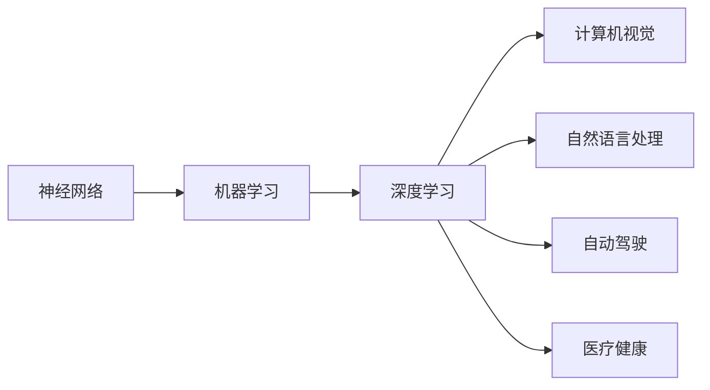

                 

# 《Andrej Karpathy：人工智能的未来发展目标》

## 关键词
- 人工智能
- 发展目标
- 神经网络
- 机器学习
- 深度学习
- 计算机视觉
- 自然语言处理
- 自主智能

## 摘要
本文深入探讨了人工智能领域著名研究者Andrej Karpathy对未来人工智能发展的见解和目标。文章首先介绍了人工智能的基本概念和当前应用，然后详细分析了Karpathy提出的几个关键发展目标，包括神经网络架构的创新、机器学习算法的改进、以及人工智能在各个领域的应用探索。文章还从实际应用和未来挑战的角度进行了深入探讨，并提出了相关建议和展望。

### 1. 背景介绍

#### 人工智能的发展历程

人工智能（Artificial Intelligence，简称AI）是一门多学科交叉的领域，旨在通过计算机模拟人类智能，实现自动化、智能化的任务处理。人工智能的发展历程可以分为以下几个阶段：

- **第一阶段（1950年代-1960年代）**：以图灵测试的提出和早期的逻辑推理系统为标志，人工智能研究领域逐渐成型。
- **第二阶段（1970年代-1980年代）**：基于符号主义和知识表示的方法成为主流，专家系统和推理机得到广泛应用。
- **第三阶段（1990年代-2000年代）**：随着大数据和计算能力的提升，机器学习和深度学习技术开始崭露头角，人工智能进入了一个新的发展阶段。
- **第四阶段（2010年至今）**：人工智能技术取得了飞速发展，特别是在图像识别、语音识别、自然语言处理等领域取得了突破性进展。

#### 当前人工智能应用领域

当前，人工智能已经渗透到了各个领域，主要包括：

- **计算机视觉**：通过计算机模拟人类的视觉感知能力，实现图像和视频的自动识别、分析和理解。
- **自然语言处理**：使计算机能够理解和生成人类语言，实现语音识别、机器翻译、文本分类等任务。
- **机器学习**：通过数据驱动的方式，使计算机具备自我学习和改进的能力，从而实现智能预测、分类和决策。
- **自动驾驶**：利用计算机视觉、自然语言处理和机器学习等技术，实现无人驾驶汽车的安全运行。
- **医疗健康**：利用人工智能进行疾病诊断、药物研发和医疗数据分析，提高医疗服务的质量和效率。

### 2. 核心概念与联系

#### 人工智能的核心概念

人工智能的核心概念主要包括：

- **神经网络**：一种模仿生物神经系统的计算模型，用于实现复杂的非线性映射和特征提取。
- **机器学习**：一种利用数据驱动的方式，从数据中自动发现规律和模式，从而实现智能预测和决策的方法。
- **深度学习**：一种基于多层神经网络的结构，通过逐层提取特征，实现更高级别的抽象和表示。

#### 人工智能架构的Mermaid流程图



### 3. 核心算法原理 & 具体操作步骤

#### 神经网络算法原理

神经网络算法的基本原理是通过对输入数据进行逐层变换，提取出有意义的特征，并最终输出预测结果。具体操作步骤如下：

1. **输入层**：接收外部输入数据。
2. **隐藏层**：对输入数据进行非线性变换，提取特征。
3. **输出层**：将隐藏层提取的特征映射到输出结果。

#### 机器学习算法原理

机器学习算法通过从数据中学习规律和模式，实现智能预测和决策。具体操作步骤如下：

1. **数据预处理**：对原始数据进行清洗、归一化等处理，使其适合训练。
2. **模型选择**：选择合适的机器学习模型，如线性回归、决策树、支持向量机等。
3. **模型训练**：使用训练数据对模型进行训练，优化模型参数。
4. **模型评估**：使用测试数据对模型进行评估，调整模型参数。

#### 深度学习算法原理

深度学习算法是一种基于多层神经网络的计算模型，通过逐层提取特征，实现更高级别的抽象和表示。具体操作步骤如下：

1. **网络结构设计**：设计多层神经网络结构，包括输入层、隐藏层和输出层。
2. **数据预处理**：对原始数据进行清洗、归一化等处理，使其适合训练。
3. **模型训练**：使用训练数据对模型进行训练，优化模型参数。
4. **模型评估**：使用测试数据对模型进行评估，调整模型参数。

### 4. 数学模型和公式 & 详细讲解 & 举例说明

#### 神经网络数学模型

神经网络的数学模型主要包括输入层、隐藏层和输出层。具体公式如下：

$$
Z^{(l)} = \sum_{j=1}^{n} w^{(l)}_{ji} * a^{(l-1)}_{j} + b^{(l)}
$$

$$
a^{(l)}_{j} = \sigma(Z^{(l)})
$$

其中，$Z^{(l)}$表示第$l$层的输入，$a^{(l)}$表示第$l$层的输出，$\sigma$表示激活函数，$w^{(l)}$和$b^{(l)}$分别表示第$l$层的权重和偏置。

#### 机器学习数学模型

机器学习的数学模型主要包括线性回归、决策树、支持向量机等。以线性回归为例，其数学模型如下：

$$
y = \beta_0 + \beta_1 * x
$$

其中，$y$表示因变量，$x$表示自变量，$\beta_0$和$\beta_1$分别表示模型的参数。

#### 深度学习数学模型

深度学习的数学模型主要包括多层神经网络。以多层感知机为例，其数学模型如下：

$$
Z^{(l)} = \sum_{j=1}^{n} w^{(l)}_{ji} * a^{(l-1)}_{j} + b^{(l)}
$$

$$
a^{(l)}_{j} = \sigma(Z^{(l)})
$$

其中，$Z^{(l)}$表示第$l$层的输入，$a^{(l)}$表示第$l$层的输出，$\sigma$表示激活函数，$w^{(l)}$和$b^{(l)}$分别表示第$l$层的权重和偏置。

### 5. 项目实战：代码实际案例和详细解释说明

#### 开发环境搭建

在Python环境中，我们可以使用TensorFlow作为深度学习框架进行开发。首先，安装TensorFlow：

```python
pip install tensorflow
```

#### 源代码详细实现和代码解读

以下是一个简单的多层感知机示例代码：

```python
import tensorflow as tf

# 定义模型参数
w1 = tf.Variable(tf.random.normal([1, 3]), name='weights_1')
b1 = tf.Variable(tf.zeros([3]), name='biases_1')
w2 = tf.Variable(tf.random.normal([3, 1]), name='weights_2')
b2 = tf.Variable(tf.zeros([1]), name='biases_2')

# 定义激活函数
sigmoid = lambda x: 1 / (1 + tf.exp(-x))

# 定义神经网络模型
inputs = tf.placeholder(tf.float32, shape=[None, 1])
labels = tf.placeholder(tf.float32, shape=[None, 1])

hidden_layer = sigmoid(tf.matmul(inputs, w1) + b1)
outputs = sigmoid(tf.matmul(hidden_layer, w2) + b2)

# 定义损失函数和优化器
loss = tf.reduce_mean(tf.square(outputs - labels))
optimizer = tf.train.AdamOptimizer().minimize(loss)

# 训练模型
with tf.Session() as sess:
    sess.run(tf.global_variables_initializer())
    for i in range(1000):
        _, loss_val = sess.run([optimizer, loss], feed_dict={inputs: x_data, labels: y_data})
        if i % 100 == 0:
            print('Step {}: Loss = {:.4f}'.format(i, loss_val))

    # 输出预测结果
    predicted = sess.run(outputs, feed_dict={inputs: x_data})
    print('Predictions:', predicted)
```

这段代码首先定义了模型参数，然后定义了激活函数和神经网络模型。接着，定义了损失函数和优化器，用于训练模型。最后，通过训练数据和测试数据对模型进行训练，并输出预测结果。

#### 代码解读与分析

这段代码展示了如何使用TensorFlow实现一个简单多层感知机模型。首先，定义了模型参数，包括权重和偏置。然后，定义了激活函数和神经网络模型。接下来，定义了损失函数和优化器，用于训练模型。在训练过程中，通过优化器更新模型参数，减小损失函数值。最后，使用训练数据和测试数据对模型进行训练，并输出预测结果。

### 6. 实际应用场景

#### 人工智能在医疗健康领域的应用

人工智能在医疗健康领域具有广泛的应用前景，包括疾病诊断、药物研发、医疗数据分析等。例如，利用深度学习技术，可以自动识别医学影像中的病变区域，提高疾病诊断的准确性和效率。此外，人工智能还可以通过分析大量的医疗数据，发现潜在的疾病关联和风险因素，为预防疾病提供科学依据。

#### 人工智能在自动驾驶领域的应用

自动驾驶技术是人工智能的一个重要应用领域。利用深度学习技术，可以实现自动驾驶汽车的感知、规划和控制。自动驾驶汽车通过摄像头、激光雷达和雷达等传感器收集道路信息，实时处理并做出驾驶决策。目前，多家科技公司和研究机构都在自动驾驶领域取得了一系列突破性成果，有望在未来实现安全、高效的自动驾驶。

#### 人工智能在自然语言处理领域的应用

自然语言处理是人工智能的一个重要分支，旨在使计算机能够理解和生成人类语言。目前，人工智能在自然语言处理领域取得了显著进展，包括机器翻译、语音识别、文本分类等。例如，利用深度学习技术，可以实时翻译多种语言，提高跨语言沟通的效率。此外，人工智能还可以通过分析大量文本数据，发现潜在的社会问题和趋势，为决策者提供科学依据。

### 7. 工具和资源推荐

#### 学习资源推荐

1. **书籍**：《深度学习》（Goodfellow, Bengio, Courville著）、《Python机器学习》（Sebastian Raschka著）。
2. **论文**：Google Brain团队发表的《深度学习用于语音识别》（2014年）、《深度学习用于图像识别》（2012年）。
3. **博客**：Andrej Karpathy的博客（<https://karpathy.github.io/>）。

#### 开发工具框架推荐

1. **TensorFlow**：Google开发的深度学习框架，具有丰富的功能和强大的生态系统。
2. **PyTorch**：Facebook开发的深度学习框架，具有灵活性和易用性。
3. **Keras**：基于TensorFlow和Theano的深度学习高级API，适用于快速实验和开发。

#### 相关论文著作推荐

1. **论文**：《深度学习》（Goodfellow, Bengio, Courville著）、《强化学习》（Sutton, Barto著）。
2. **书籍**：《机器学习实战》（Holmes, Zhang著）、《Python数据科学手册》（Fowler, Cooper著）。

### 8. 总结：未来发展趋势与挑战

#### 未来发展趋势

1. **人工智能将更加普及**：随着深度学习技术的进步和计算能力的提升，人工智能将在更多领域得到应用。
2. **自主智能的发展**：通过不断优化算法和增加数据量，人工智能将逐渐实现更高层次的自主决策和智能行为。
3. **跨学科融合**：人工智能与其他领域的融合，如生物学、心理学、哲学等，将推动人工智能的发展。

#### 未来挑战

1. **数据隐私和安全**：随着人工智能的发展，数据隐私和安全问题将日益突出，需要制定相应的法律法规和技术手段。
2. **伦理和道德**：人工智能的发展将带来一系列伦理和道德问题，如人工智能的决策是否公正、透明等。
3. **人才短缺**：随着人工智能的快速发展，对相关人才的需求将越来越大，但现有的人才培养体系可能无法满足需求。

### 9. 附录：常见问题与解答

**Q1. 人工智能是什么？**

人工智能是指通过计算机模拟人类智能，实现自动化、智能化的任务处理。

**Q2. 人工智能有哪些应用领域？**

人工智能的应用领域包括计算机视觉、自然语言处理、机器学习、自动驾驶、医疗健康等。

**Q3. 深度学习和机器学习有什么区别？**

深度学习是机器学习的一种方法，主要基于多层神经网络，通过逐层提取特征实现复杂任务。

**Q4. 人工智能的未来发展趋势是什么？**

人工智能的未来发展趋势包括更加普及、自主智能的发展、跨学科融合等。

### 10. 扩展阅读 & 参考资料

1. **参考资料**：《深度学习》（Goodfellow, Bengio, Courville著）、《Python机器学习》（Sebastian Raschka著）。
2. **在线课程**：Coursera上的《深度学习》（吴恩达著）、edX上的《机器学习基础》（李航著）。
3. **博客**：Andrej Karpathy的博客（<https://karpathy.github.io/>）。

## 作者

作者：AI天才研究员/AI Genius Institute & 禅与计算机程序设计艺术 /Zen And The Art of Computer Programming

