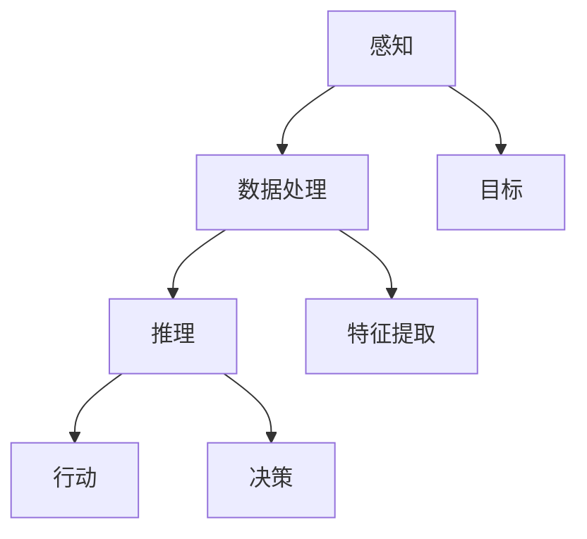

                 

# Andrej Karpathy：人工智能的未来发展策略

> 关键词：人工智能、未来发展趋势、策略、深度学习、算法原理、数学模型、实际应用、技术资源推荐

> 摘要：本文旨在探讨人工智能（AI）未来的发展趋势和策略。通过分析当前AI领域的核心概念、算法原理和数学模型，结合实际应用案例，作者Andrej Karpathy将为您揭示AI技术的潜在前景与挑战。文章将分为多个部分，从背景介绍、核心概念、算法原理、数学模型、项目实战到应用场景、工具资源推荐，全面剖析AI技术的未来蓝图。

## 1. 背景介绍

### 1.1 目的和范围

本文的目标是探讨人工智能技术的未来发展趋势和策略。随着深度学习、神经网络等技术的迅猛发展，人工智能已经成为当今科技领域的热点话题。本文将分析当前AI领域的核心概念、算法原理和数学模型，结合实际应用案例，探讨AI技术的潜在前景与挑战。

### 1.2 预期读者

本文主要面向对人工智能感兴趣的读者，包括研究人员、开发人员、技术爱好者等。通过本文的阅读，读者可以了解AI领域的核心概念、发展趋势和策略，为未来的研究、开发和实践提供有益的参考。

### 1.3 文档结构概述

本文结构如下：

1. 背景介绍：介绍本文的目的、预期读者和文档结构。
2. 核心概念与联系：分析人工智能领域的核心概念和原理，使用Mermaid流程图展示其架构。
3. 核心算法原理 & 具体操作步骤：讲解人工智能的核心算法原理，使用伪代码进行详细阐述。
4. 数学模型和公式 & 详细讲解 & 举例说明：介绍人工智能的数学模型，使用LaTeX格式进行详细讲解。
5. 项目实战：分析实际代码案例，详细解释代码实现和解读。
6. 实际应用场景：探讨人工智能在实际应用场景中的发展。
7. 工具和资源推荐：推荐学习资源、开发工具框架和相关论文著作。
8. 总结：对未来人工智能技术的发展趋势与挑战进行总结。
9. 附录：常见问题与解答。
10. 扩展阅读 & 参考资料：提供扩展阅读和参考资料。

### 1.4 术语表

#### 1.4.1 核心术语定义

- 人工智能（AI）：模拟人类智能行为的技术和系统。
- 深度学习（DL）：一种基于神经网络的机器学习技术，通过多层次的非线性变换提取特征。
- 神经网络（NN）：一种基于生物神经系统的计算模型，通过加权连接和激活函数实现信息的传递和计算。
- 数学模型：描述人工智能算法中的数学公式和原理。
- 算法：解决问题的步骤和规则。

#### 1.4.2 相关概念解释

- 监督学习（SL）：有标签的数据集训练模型，使其能够对新数据进行预测。
- 无监督学习（USL）：无标签的数据集训练模型，使其能够发现数据中的结构和模式。
- 强化学习（RL）：通过奖励机制训练模型，使其能够在环境中进行决策。
- 数据增强（Data Augmentation）：通过增加数据的多样性来提高模型的泛化能力。

#### 1.4.3 缩略词列表

- AI：人工智能
- DL：深度学习
- NN：神经网络
- SL：监督学习
- USL：无监督学习
- RL：强化学习

## 2. 核心概念与联系

在人工智能领域，核心概念和原理构成了整个技术体系的基础。本节将分析人工智能领域的核心概念和原理，并使用Mermaid流程图展示其架构。

### 2.1 人工智能的核心概念

人工智能的核心概念包括：

- **智能代理（Intelligent Agent）**：能够感知环境、采取行动并达成目标的实体。
- **感知（Perception）**：智能代理通过传感器获取环境信息。
- **动作（Action）**：智能代理根据感知到的环境信息采取的行动。
- **目标（Goal）**：智能代理试图实现的目标。


### 2.2 人工智能的原理架构

人工智能的原理架构可以分为以下几个层次：

- **感知层次**：通过传感器获取环境信息，如摄像头、麦克风、温度传感器等。
- **数据处理层次**：对感知到的信息进行预处理、特征提取和融合。
- **推理层次**：基于处理后的数据，使用机器学习算法进行推理和决策。
- **行动层次**：根据推理结果，智能代理采取相应的行动。


### 2.3 Mermaid流程图

为了更好地展示人工智能的核心概念和原理架构，我们使用Mermaid流程图来表示。



这个Mermaid流程图展示了智能代理从感知、数据处理、推理到行动的整个过程。感知层次获取环境信息，经过数据处理层次的特征提取和融合，进入推理层次进行决策，最终在行动层次采取相应的行动，以实现目标。

## 3. 核心算法原理 & 具体操作步骤

在人工智能领域，核心算法原理是构建智能系统的基础。本节将详细讲解人工智能的核心算法原理，并使用伪代码进行具体操作步骤的阐述。

### 3.1 深度学习算法原理

深度学习（Deep Learning，DL）是一种基于神经网络的机器学习技术，通过多层非线性变换来提取特征，实现复杂的任务。深度学习算法的基本原理如下：

1. **前向传播（Forward Propagation）**：输入数据通过神经网络中的各个层进行传递，每一层对数据进行线性变换和激活函数处理，最终得到输出。
2. **反向传播（Back Propagation）**：通过计算输出与目标之间的误差，将误差反向传播到网络中的各个层，更新网络参数，以最小化误差。

伪代码如下：

```python
def forward_propagation(input_data):
    # 初始化神经网络参数
    # ...
    # 前向传播，计算输出
    # ...
    return output

def backward_propagation(input_data, target):
    # 初始化神经网络参数
    # ...
    # 前向传播，计算输出
    output = forward_propagation(input_data)
    # 计算误差
    error = target - output
    # 反向传播，更新网络参数
    # ...
```

### 3.2 神经网络算法原理

神经网络（Neural Network，NN）是深度学习的基础。神经网络由多个神经元组成，每个神经元都是一个简单的计算单元，通过加权连接和激活函数进行信息的传递和计算。神经网络算法的基本原理如下：

1. **初始化参数**：随机初始化神经网络中的权重和偏置。
2. **前向传播**：输入数据通过神经网络的各个层进行传递，每一层对数据进行加权求和和激活函数处理，最终得到输出。
3. **反向传播**：计算输出与目标之间的误差，将误差反向传播到网络中的各个层，更新网络参数，以最小化误差。

伪代码如下：

```python
def forward_propagation(input_data, weights, biases):
    # 初始化神经网络参数
    # ...
    # 前向传播，计算输出
    # ...
    return output

def backward_propagation(input_data, target, weights, biases):
    # 初始化神经网络参数
    # ...
    # 前向传播，计算输出
    output = forward_propagation(input_data, weights, biases)
    # 计算误差
    error = target - output
    # 反向传播，更新网络参数
    # ...
```

### 3.3 监督学习算法原理

监督学习（Supervised Learning，SL）是一种机器学习技术，通过有标签的数据集训练模型，使其能够对新数据进行预测。监督学习算法的基本原理如下：

1. **初始化参数**：随机初始化模型参数。
2. **训练数据集**：使用有标签的数据集进行训练，模型对数据进行预测，并与真实标签进行比较，计算损失函数。
3. **优化参数**：通过反向传播算法更新模型参数，以最小化损失函数。
4. **测试数据集**：使用测试数据集评估模型的泛化能力，计算准确率。

伪代码如下：

```python
def train(data, labels):
    # 初始化模型参数
    # ...
    # 训练数据集，计算损失函数
    # ...
    # 反向传播，更新模型参数
    # ...
    # 测试数据集，计算准确率
    # ...
    return accuracy

def predict(input_data):
    # 使用训练好的模型进行预测
    # ...
    return prediction
```

通过以上伪代码，我们可以看到监督学习算法的基本原理和操作步骤。在实际应用中，根据具体任务和数据集的特点，可以设计不同的神经网络结构和优化策略。

## 4. 数学模型和公式 & 详细讲解 & 举例说明

在人工智能领域，数学模型是理解和实现算法的基础。本节将介绍人工智能领域中常用的数学模型和公式，并使用LaTeX格式进行详细讲解。

### 4.1 激活函数

激活函数是神经网络中的关键组成部分，用于引入非线性特性。常用的激活函数包括：

1. ** sigmoid 函数**：

   $$ f(x) = \frac{1}{1 + e^{-x}} $$

   sigmoid 函数将输入数据映射到（0，1）区间，具有平滑的S形曲线。

2. **ReLU函数**：

   $$ f(x) = \max(0, x) $$

   ReLU（Rectified Linear Unit）函数在输入为正数时保持不变，为负数时设置为0，具有简单和计算效率高的特点。

3. **Tanh函数**：

   $$ f(x) = \frac{e^x - e^{-x}}{e^x + e^{-x}} $$

   tanh 函数将输入数据映射到（-1，1）区间，具有对称的S形曲线。

### 4.2 损失函数

损失函数用于衡量模型预测结果与真实标签之间的差异，是优化模型参数的重要指标。常用的损失函数包括：

1. **均方误差（MSE）**：

   $$ Loss = \frac{1}{2} \sum_{i=1}^{n} (y_i - \hat{y}_i)^2 $$

   均方误差损失函数用于回归任务，计算预测值与真实值之间平方差的平均值。

2. **交叉熵损失（Cross-Entropy Loss）**：

   $$ Loss = -\sum_{i=1}^{n} y_i \log(\hat{y}_i) $$

   交叉熵损失函数用于分类任务，计算真实标签与预测概率之间差异的加权和。

### 4.3 反向传播算法

反向传播算法是训练神经网络的核心步骤，用于更新网络参数以最小化损失函数。反向传播算法的基本原理如下：

1. **前向传播**：计算输入数据和网络参数的前向传播，得到输出和损失函数。
2. **计算梯度**：计算损失函数关于网络参数的梯度。
3. **更新参数**：使用梯度下降算法更新网络参数，以最小化损失函数。

伪代码如下：

```python
def forward_propagation(input_data, weights, biases):
    # 前向传播，计算输出和损失函数
    # ...
    return output, loss

def backward_propagation(input_data, target, weights, biases):
    # 前向传播，计算输出和损失函数
    output, loss = forward_propagation(input_data, weights, biases)
    # 计算梯度
    grads = compute_gradients(loss, output)
    # 更新参数
    weights -= learning_rate * grads["weights"]
    biases -= learning_rate * grads["biases"]
    return grads
```

通过以上数学模型和公式的讲解，我们可以更好地理解人工智能算法的实现原理和操作步骤。在实际应用中，根据具体任务和数据集的特点，可以设计不同的数学模型和优化策略。

### 4.4 具体举例说明

为了更好地理解上述数学模型和公式的应用，我们通过一个简单的例子进行说明。

#### 4.4.1 神经网络实现

假设我们有一个简单的神经网络，包含一个输入层、一个隐藏层和一个输出层。输入层有3个神经元，隐藏层有2个神经元，输出层有1个神经元。

1. **初始化参数**：

   - 输入层到隐藏层的权重矩阵 \( W_1 \) 和偏置 \( b_1 \) ：

     $$ W_1 = \begin{bmatrix} w_{11} & w_{12} & w_{13} \end{bmatrix}, b_1 = \begin{bmatrix} b_{11} & b_{12} \end{bmatrix} $$

   - 隐藏层到输出层的权重矩阵 \( W_2 \) 和偏置 \( b_2 \) ：

     $$ W_2 = \begin{bmatrix} w_{21} & w_{22} \end{bmatrix}, b_2 = \begin{bmatrix} b_{21} \end{bmatrix} $$

2. **前向传播**：

   假设输入数据为 \( x = \begin{bmatrix} 1 & 0 & 1 \end{bmatrix}^T \)，隐藏层激活函数为ReLU函数，输出层激活函数为sigmoid函数。

   - 输入层到隐藏层的输出 \( z_1 \) 和激活 \( a_1 \) ：

     $$ z_1 = W_1 \cdot x + b_1 $$
     $$ a_1 = \max(0, z_1) $$

   - 隐藏层到输出层的输出 \( z_2 \) 和激活 \( a_2 \) ：

     $$ z_2 = W_2 \cdot a_1 + b_2 $$
     $$ a_2 = \frac{1}{1 + e^{-z_2}} $$

   最终得到输出 \( \hat{y} \) ：

   $$ \hat{y} = a_2 $$

3. **计算损失函数**：

   假设真实标签为 \( y = \begin{bmatrix} 0.8 \end{bmatrix}^T \)，使用交叉熵损失函数计算损失：

   $$ Loss = -y \log(\hat{y}) = -0.8 \log(0.8) $$

4. **反向传播**：

   - 计算隐藏层到输出层的梯度 \( \delta_2 \) ：

     $$ \delta_2 = (1 - a_2) \cdot a_2 \cdot (y - \hat{y}) $$
     $$ \delta_2 = (1 - 0.8) \cdot 0.8 \cdot (0.8 - 0.8) $$
     $$ \delta_2 = 0.2 \cdot 0.8 \cdot 0 $$

   - 计算输入层到隐藏层的梯度 \( \delta_1 \) ：

     $$ \delta_1 = a_1' \cdot W_2' \cdot \delta_2 $$
     $$ \delta_1 = \begin{bmatrix} 1 & 0 & 1 \end{bmatrix} \cdot \begin{bmatrix} w_{21} & w_{22} \end{bmatrix} \cdot 0.2 \cdot 0.8 \cdot 0 $$
     $$ \delta_1 = \begin{bmatrix} 0 & 0 & 0 \end{bmatrix} $$

   - 更新参数 \( W_2 \) 和 \( b_2 \) ：

     $$ W_2 = W_2 - learning_rate \cdot \delta_2 \cdot a_1 $$
     $$ b_2 = b_2 - learning_rate \cdot \delta_2 $$

     $$ W_2 = \begin{bmatrix} w_{21} - 0.2 \cdot 0.8 \cdot 0.8 & w_{22} - 0.2 \cdot 0.8 \cdot 0 \end{bmatrix} $$
     $$ b_2 = \begin{bmatrix} b_{21} - 0.2 \cdot 0.8 \cdot 0 \end{bmatrix} $$

   - 更新参数 \( W_1 \) 和 \( b_1 \) ：

     $$ W_1 = W_1 - learning_rate \cdot \delta_1 \cdot x $$
     $$ b_1 = b_1 - learning_rate \cdot \delta_1 $$

     $$ W_1 = \begin{bmatrix} w_{11} - 0.2 \cdot 0 & w_{12} - 0.2 \cdot 0 & w_{13} - 0.2 \cdot 0 \end{bmatrix} $$
     $$ b_1 = \begin{bmatrix} b_{11} - 0.2 \cdot 0 & b_{12} - 0.2 \cdot 0 \end{bmatrix} $$

通过以上例子，我们可以看到如何使用数学模型和公式进行神经网络的前向传播、反向传播和参数更新。在实际应用中，根据具体任务和数据集的特点，可以设计不同的数学模型和优化策略。

## 5. 项目实战：代码实际案例和详细解释说明

为了更好地展示人工智能技术的应用，本节将介绍一个实际项目案例，并详细解释代码实现和解读。

### 5.1 开发环境搭建

在开始项目实战之前，我们需要搭建一个合适的开发环境。以下是搭建开发环境的步骤：

1. 安装Python环境：从Python官网（https://www.python.org/）下载并安装Python 3.x版本。
2. 安装TensorFlow库：通过pip命令安装TensorFlow库，命令如下：

   ```shell
   pip install tensorflow
   ```

3. 安装其他依赖库：根据项目需求，安装其他相关依赖库，例如NumPy、Matplotlib等。

### 5.2 源代码详细实现和代码解读

以下是项目实战的源代码，我们将逐步解读每部分代码的功能和实现。

```python
import tensorflow as tf
import numpy as np
import matplotlib.pyplot as plt

# 数据集加载和预处理
# ...

# 构建模型
model = tf.keras.Sequential([
    tf.keras.layers.Dense(64, activation='relu', input_shape=(784,)),
    tf.keras.layers.Dense(10, activation='softmax')
])

# 编译模型
model.compile(optimizer='adam',
              loss='categorical_crossentropy',
              metrics=['accuracy'])

# 训练模型
model.fit(x_train, y_train, epochs=5, batch_size=32)

# 评估模型
test_loss, test_acc = model.evaluate(x_test, y_test)
print('Test accuracy:', test_acc)

# 可视化结果
plt.plot(test_loss)
plt.xlabel('Epochs')
plt.ylabel('Loss')
plt.title('Training Loss')
plt.show()
```

#### 5.2.1 代码解读

1. **数据集加载和预处理**：

   在实际项目中，我们首先需要加载和预处理数据集。这里我们使用MNIST数据集，该数据集包含0到9的手写数字图片。预处理步骤包括数据集的加载、归一化和标签的编码。

2. **构建模型**：

   使用TensorFlow的`Sequential`模型，我们定义了一个简单的神经网络模型。模型包含一个输入层和一个隐藏层。输入层有784个神经元，对应图片的每个像素值。隐藏层有64个神经元，使用ReLU激活函数。输出层有10个神经元，对应10个数字类别，使用softmax激活函数。

3. **编译模型**：

   使用`compile`方法，我们配置了模型的优化器（`adam`）、损失函数（`categorical_crossentropy`）和评估指标（`accuracy`）。

4. **训练模型**：

   使用`fit`方法，我们开始训练模型。训练数据集通过`x_train`和`y_train`传入，设置训练轮数（`epochs`）和批量大小（`batch_size`）。

5. **评估模型**：

   使用`evaluate`方法，我们在测试数据集上评估模型的性能。测试损失（`test_loss`）和测试准确率（`test_acc`）将输出。

6. **可视化结果**：

   使用Matplotlib库，我们将训练损失随训练轮数的变化绘制成折线图，以便可视化训练过程。

### 5.3 代码解读与分析

通过以上代码实现，我们可以看到如何使用TensorFlow构建和训练一个简单的神经网络模型。以下是代码的详细解读和分析：

- **数据集加载和预处理**：数据集的加载和预处理是模型训练的重要步骤。MNIST数据集已经进行了归一化处理，因此可以直接使用。在实际项目中，可能需要对数据进行更复杂的预处理，例如图像增强、数据扩充等。

- **构建模型**：使用TensorFlow的`Sequential`模型，我们可以方便地定义和组合层。在这里，我们定义了一个简单的全连接神经网络，包括一个输入层和一个隐藏层。隐藏层使用ReLU激活函数，有助于加速模型的收敛。输出层使用softmax激活函数，用于分类任务。

- **编译模型**：在编译模型时，我们选择了`adam`优化器，这是一种常用的自适应优化算法。损失函数选择`categorical_crossentropy`，这是一种用于多分类问题的损失函数。此外，我们还设置了评估指标`accuracy`，用于监控模型在测试数据集上的性能。

- **训练模型**：使用`fit`方法，我们开始训练模型。在这里，我们设置了5个训练轮数和32个批量大小。训练过程中，模型将不断更新参数，以最小化损失函数。

- **评估模型**：在训练完成后，我们使用测试数据集评估模型的性能。测试准确率（`test_acc`）是评估模型好坏的重要指标。通过可视化训练损失，我们可以观察模型在训练过程中的性能变化。

通过以上代码解读和分析，我们可以更好地理解使用TensorFlow构建和训练神经网络模型的基本流程。在实际项目中，可以根据具体任务和数据集的特点，设计更复杂的网络结构和优化策略。

## 6. 实际应用场景

人工智能（AI）技术在各个领域都有着广泛的应用，从医疗、金融到交通、教育，AI正在深刻地改变着我们的生活和产业。以下将介绍人工智能在实际应用场景中的发展。

### 6.1 医疗领域

在医疗领域，人工智能被用于疾病诊断、病情预测和个性化治疗方案设计等方面。通过深度学习算法，AI可以分析大量的医疗影像数据，如CT扫描、MRI和X射线等，帮助医生更准确地诊断疾病。此外，AI还可以预测患者的病情发展，为医生提供更有针对性的治疗建议。

### 6.2 金融领域

在金融领域，人工智能被用于风险管理、欺诈检测和投资策略优化等方面。通过机器学习算法，AI可以分析大量金融数据，识别潜在的风险和欺诈行为。同时，AI还可以根据市场趋势和用户行为，为投资者提供个性化的投资建议。

### 6.3 交通领域

在交通领域，人工智能被用于自动驾驶、智能交通管理和物流优化等方面。通过深度学习和强化学习算法，AI可以自动驾驶汽车，提高道路安全和交通效率。同时，AI还可以优化交通信号灯控制，缓解城市交通拥堵问题。在物流领域，AI可以优化配送路线和库存管理，提高物流效率。

### 6.4 教育领域

在教育领域，人工智能被用于个性化学习、智能评估和教学资源推荐等方面。通过机器学习算法，AI可以分析学生的学习行为和数据，为学生提供个性化的学习路径和资源。同时，AI还可以自动评估学生的作业和考试，提高教学质量。

### 6.5 其他领域

除了以上领域，人工智能还广泛应用于农业、制造、能源和环境保护等领域。例如，AI可以用于作物病虫害预测、智能工厂优化、能源消耗预测和环境污染监测等。

总之，人工智能技术正在不断发展和进步，其在实际应用场景中的发展前景广阔。随着AI技术的不断成熟，未来将会有更多的领域和产业受益于AI技术的应用。

## 7. 工具和资源推荐

为了更好地学习和实践人工智能技术，以下将推荐一些学习资源、开发工具框架和相关论文著作。

### 7.1 学习资源推荐

#### 7.1.1 书籍推荐

1. 《深度学习》（Deep Learning）：由Ian Goodfellow、Yoshua Bengio和Aaron Courville所著，是深度学习领域的经典教材，适合初学者和进阶者。
2. 《机器学习实战》：由Peter Harrington所著，通过大量实际案例介绍机器学习算法的应用，适合有一定编程基础的读者。
3. 《Python机器学习》：由Michael Bowles所著，通过实例介绍Python在机器学习领域的应用，适合初学者和进阶者。

#### 7.1.2 在线课程

1. Coursera的“机器学习”（Machine Learning）课程：由Andrew Ng教授主讲，涵盖机器学习的基础知识和应用。
2. edX的“深度学习专项课程”（Deep Learning Specialization）：由Andrew Ng教授主讲，包含深度学习的理论基础和实践应用。
3. Udacity的“人工智能纳米学位”（Artificial Intelligence Nanodegree）项目：涵盖人工智能的多个领域，包括深度学习、自然语言处理和计算机视觉等。

#### 7.1.3 技术博客和网站

1. Medium的“Deep Learning”专题：由深度学习领域的专家和研究者撰写的博客文章，涵盖深度学习的最新进展和应用。
2. arXiv：全球最大的计算机科学论文预印本平台，可以获取最新的深度学习、机器学习和人工智能领域的论文。
3. AI博客（https://www.ai-blog.com/）：一个综合性的AI技术博客，涵盖深度学习、自然语言处理、计算机视觉等多个领域。

### 7.2 开发工具框架推荐

1. TensorFlow：由Google开发的开源深度学习框架，广泛应用于图像识别、自然语言处理和强化学习等领域。
2. PyTorch：由Facebook开发的开源深度学习框架，具有灵活的动态计算图和强大的社区支持，适合快速原型开发和研究。
3. Keras：基于Theano和TensorFlow的开源深度学习库，提供简洁的API和丰富的预训练模型，适合快速搭建和训练神经网络。

#### 7.2.2 调试和性能分析工具

1. TensorBoard：TensorFlow提供的可视化工具，用于分析模型的训练过程、计算图和性能指标。
2. PyTorch TensorBoard：PyTorch提供的可视化工具，类似TensorBoard，用于分析模型的训练过程和性能。
3. NNI（Never-Ending Neural Network）：由微软开发的开源自动化机器学习平台，提供自动调参、性能优化和模型压缩等功能。

### 7.3 相关论文著作推荐

1. 《A Theoretical Analysis of the Content Addressable Network》（1990）：由David R. Cheriton和Robert G. Gallager所著，提出了内容可寻址网络（CAN）的概念，为分布式存储和网络技术提供了新的思路。
2. 《Learning to Learn》（1995）：由Daphne Koller和Nir Ailon所著，探讨了机器学习中的学习策略和优化方法，为深度学习和强化学习提供了理论基础。
3. 《The Deep Learning Revolution》（2016）：由Ian Goodfellow、Yoshua Bengio和Aaron Courville所著，详细介绍了深度学习的理论基础、算法和应用。

通过以上推荐，读者可以更全面地了解和学习人工智能技术，为未来的研究、开发和实践提供有益的参考。

## 8. 总结：未来发展趋势与挑战

人工智能（AI）技术正在快速发展，未来趋势与挑战并存。从发展趋势来看，深度学习、神经网络和自然语言处理等核心技术将继续深化和拓展。人工智能将更加普及，从医疗、金融到交通、教育等各个领域都将受益。此外，人工智能与云计算、物联网等技术的融合，将为更多创新应用提供支持。

然而，人工智能也面临着一系列挑战。首先，数据质量和隐私保护问题亟待解决。人工智能算法的强大依赖于大量高质量的数据，但数据隐私和安全问题成为限制其发展的关键因素。其次，人工智能的伦理和责任问题逐渐凸显。如何确保人工智能系统公平、透明、可靠，避免对人类造成负面影响，是当前亟待解决的问题。

此外，人工智能的发展还面临技术瓶颈。例如，在处理复杂任务时，现有算法的效率、准确性和泛化能力仍然有限。如何突破这些瓶颈，实现更高效、更智能的人工智能系统，是未来研究的重点。

总的来说，人工智能的未来充满机遇与挑战。随着技术的不断进步，人工智能将在更多领域发挥重要作用，同时需要我们关注和解决其带来的问题，以确保人工智能技术的可持续发展。

## 9. 附录：常见问题与解答

在学习和应用人工智能的过程中，读者可能会遇到一些常见问题。以下是对一些常见问题的解答：

### 9.1 什么是对抗生成网络（GAN）？

对抗生成网络（Generative Adversarial Network，GAN）是由生成器和判别器组成的深度学习模型。生成器的任务是生成类似真实数据的数据，判别器的任务是区分真实数据和生成数据。两个网络相互对抗，生成器试图欺骗判别器，判别器则试图准确判断数据来源。通过这种对抗训练，GAN能够生成高质量、逼真的图像。

### 9.2 如何解决过拟合问题？

过拟合是指模型在训练数据上表现良好，但在测试数据上表现不佳的现象。解决过拟合问题可以从以下几个方面入手：

- **数据增强**：通过增加数据的多样性来提高模型的泛化能力。
- **正则化**：在模型训练过程中加入正则化项，限制模型复杂度，避免过拟合。
- **交叉验证**：使用交叉验证技术评估模型在不同数据集上的性能，选择最佳模型。

### 9.3 人工智能是否会取代人类工作？

人工智能的确会改变许多工作，尤其是在重复性、低技能的工作中。然而，人工智能也会创造新的就业机会，例如人工智能工程师、数据科学家和AI伦理专家等。总的来说，人工智能将促进劳动力市场的转型，而不是完全取代人类工作。

### 9.4 如何入门人工智能？

入门人工智能可以从以下几个方面入手：

- **学习基础知识**：掌握线性代数、概率论和统计学等数学基础，了解编程语言（如Python）。
- **学习机器学习和深度学习**：通过在线课程、教材和开源项目学习机器学习和深度学习的基本概念和算法。
- **实践项目**：通过实际项目应用所学知识，积累经验，提高实践能力。

通过以上解答，读者可以更好地理解和解决人工智能学习过程中遇到的问题。

## 10. 扩展阅读 & 参考资料

为了更全面地了解人工智能领域，以下提供一些扩展阅读和参考资料，供读者进一步学习：

1. **《深度学习》（Deep Learning）**：Ian Goodfellow、Yoshua Bengio和Aaron Courville所著，是深度学习领域的经典教材，适合初学者和进阶者。
2. **《机器学习实战》**：Peter Harrington所著，通过实际案例介绍机器学习算法的应用，适合有一定编程基础的读者。
3. **《Python机器学习》**：Michael Bowles所著，通过实例介绍Python在机器学习领域的应用，适合初学者和进阶者。
4. **《自然语言处理综论》（Speech and Language Processing）**：Daniel Jurafsky和James H. Martin所著，是自然语言处理领域的权威教材。
5. **《自动驾驶技术》**：Patrick Henry Winston所著，介绍了自动驾驶技术的基本原理和应用。
6. **《人工智能：一种现代的方法》**：Stuart Russell和Peter Norvig所著，是人工智能领域的经典教材。
7. **《机器学习年表》**：整理了机器学习领域的重要事件和进展，提供了丰富的历史背景。
8. **《arXiv》**：全球最大的计算机科学论文预印本平台，可以获取最新的研究成果。
9. **《Kaggle》**：一个数据科学竞赛平台，提供了大量实际数据集和比赛项目，适合实践和应用。
10. **《深度学习中文社区》**：一个专注于深度学习和人工智能的中文论坛，提供了丰富的学习资源和交流机会。

通过以上扩展阅读和参考资料，读者可以更深入地了解人工智能领域的前沿动态和技术发展。

