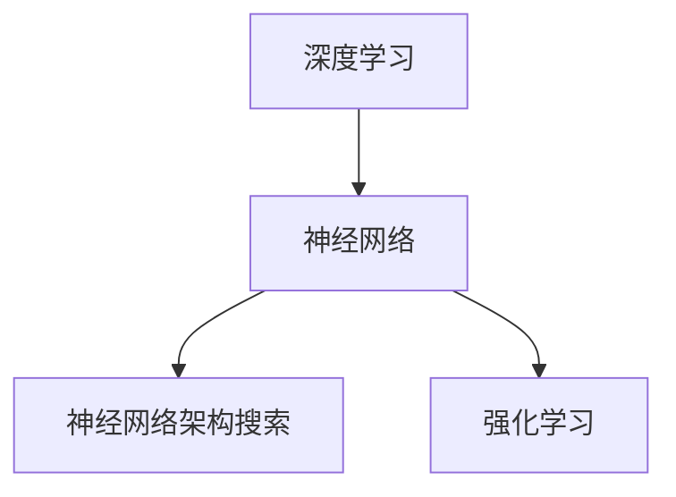

                 

# Andrej Karpathy：人工智能的未来发展策略

> 关键词：人工智能，深度学习，未来趋势，技术策略，算法原理，应用案例

> 摘要：本文将深入探讨人工智能领域杰出研究者Andrej Karpathy对未来人工智能发展策略的见解，分析其核心观点，并探讨这些策略对技术行业和社会的影响。文章将从背景介绍、核心概念、算法原理、数学模型、项目实战、实际应用场景、工具和资源推荐等多个角度，全面阐述人工智能在未来几年内的可能发展趋势与挑战。

## 1. 背景介绍

### 1.1 目的和范围

本文旨在分析人工智能领域著名研究者Andrej Karpathy对未来人工智能发展策略的见解，探讨其提出的核心观点及其对技术行业和社会的潜在影响。文章涵盖了人工智能的基本概念、核心算法原理、数学模型、实际应用案例等多个方面，旨在为读者提供全面而深入的理解。

### 1.2 预期读者

本文主要面向人工智能领域的专业人士、研究人员和开发者，以及对此领域感兴趣的技术爱好者。通过本文的阅读，读者可以更好地理解人工智能的未来发展趋势，掌握相关技术原理，并能够将其应用于实际项目中。

### 1.3 文档结构概述

本文分为十个主要部分：

1. 背景介绍
2. 核心概念与联系
3. 核心算法原理 & 具体操作步骤
4. 数学模型和公式 & 详细讲解 & 举例说明
5. 项目实战：代码实际案例和详细解释说明
6. 实际应用场景
7. 工具和资源推荐
8. 总结：未来发展趋势与挑战
9. 附录：常见问题与解答
10. 扩展阅读 & 参考资料

### 1.4 术语表

#### 1.4.1 核心术语定义

- **人工智能（Artificial Intelligence，AI）**：模拟人类智能的计算机系统。
- **深度学习（Deep Learning，DL）**：一种机器学习技术，通过多层神经网络实现数据的学习和预测。
- **神经网络（Neural Network，NN）**：模拟人脑神经元连接的结构，用于处理复杂的数据和模式。
- **神经网络架构搜索（Neural Architecture Search，NAS）**：自动化搜索神经网络结构的方法。
- **强化学习（Reinforcement Learning，RL）**：通过试错和反馈来学习策略的机器学习技术。

#### 1.4.2 相关概念解释

- **卷积神经网络（Convolutional Neural Network，CNN）**：一种特殊的神经网络，用于图像识别和处理。
- **生成对抗网络（Generative Adversarial Network，GAN）**：通过对抗性训练生成数据的神经网络。
- **迁移学习（Transfer Learning）**：利用预训练模型在新任务上的表现，提高模型的泛化能力。

#### 1.4.3 缩略词列表

- **GAN**：生成对抗网络
- **NAS**：神经网络架构搜索
- **CNN**：卷积神经网络
- **RL**：强化学习
- **DL**：深度学习

## 2. 核心概念与联系

在本文中，我们将探讨人工智能领域的几个核心概念，包括深度学习、神经网络、神经网络架构搜索和强化学习。这些概念相互关联，共同构成了人工智能的技术基础。

### 2.1 深度学习

深度学习是一种机器学习技术，通过多层神经网络实现数据的学习和预测。深度学习在图像识别、自然语言处理、语音识别等领域取得了显著的成果。

#### 深度学习的工作原理

深度学习通过多层神经网络对数据进行处理，每个层都通过激活函数对数据进行非线性变换。最终，输出层产生预测结果。

#### 深度学习的优势

- **强大的表示能力**：多层神经网络可以提取复杂的特征。
- **自动特征提取**：不需要手动设计特征，从而提高了模型的泛化能力。

### 2.2 神经网络

神经网络是一种模拟人脑神经元连接的结构，用于处理复杂的数据和模式。神经网络由输入层、隐藏层和输出层组成。

#### 神经网络的工作原理

神经网络通过学习输入数据和输出数据之间的关系，调整神经元之间的权重，从而实现数据的分类和预测。

#### 神经网络的优点

- **自适应性强**：可以自动调整参数以适应不同的数据。
- **易于实现和扩展**：可以轻松地增加层数和神经元数量。

### 2.3 神经网络架构搜索

神经网络架构搜索（NAS）是一种自动化搜索神经网络结构的方法。NAS通过搜索大量的神经网络结构，找到最优的模型架构。

#### 神经网络架构搜索的工作原理

NAS通过进化算法、强化学习等方法搜索神经网络结构，评估每个结构的性能，并选择最优的架构。

#### 神经网络架构搜索的优势

- **自动搜索最优结构**：节省了手动设计神经网络结构的时间和精力。
- **提高模型性能**：找到最优的神经网络结构，从而提高模型的准确率和效率。

### 2.4 强化学习

强化学习是一种通过试错和反馈来学习策略的机器学习技术。强化学习在游戏、机器人控制等领域取得了显著成果。

#### 强化学习的工作原理

强化学习通过奖励机制来指导学习过程，模型通过不断尝试和调整策略，以最大化累积奖励。

#### 强化学习的优势

- **自适应性强**：可以快速适应环境变化。
- **灵活性强**：可以应用于各种复杂的问题场景。

### 2.5 核心概念之间的联系

深度学习、神经网络、神经网络架构搜索和强化学习相互关联，共同构成了人工智能的技术基础。深度学习提供了强大的表示能力，神经网络实现了数据的处理和预测，神经网络架构搜索优化了模型结构，强化学习提供了自适应和灵活的策略。这些核心概念共同推动了人工智能的发展。

#### Mermaid 流程图

下面是人工智能核心概念之间的联系流程图：



## 3. 核心算法原理 & 具体操作步骤

在本文中，我们将详细讲解人工智能领域的一些核心算法原理，包括卷积神经网络（CNN）、生成对抗网络（GAN）和强化学习（RL）。这些算法在图像识别、数据生成和决策制定等领域发挥了重要作用。

### 3.1 卷积神经网络（CNN）

卷积神经网络（CNN）是一种特殊的神经网络，用于图像识别和处理。CNN通过卷积层、池化层和全连接层等结构对图像数据进行处理，提取图像特征并进行分类。

#### CNN的工作原理

1. **卷积层**：卷积层通过卷积运算提取图像的局部特征。卷积运算使用小的窗口（称为卷积核）在图像上滑动，计算卷积结果。
2. **池化层**：池化层用于减少特征图的维度，提高模型的泛化能力。常用的池化方式有最大池化和平均池化。
3. **全连接层**：全连接层将卷积层和池化层提取的特征进行整合，产生最终的分类结果。

#### CNN的操作步骤

1. **输入层**：将图像数据输入到CNN中。
2. **卷积层**：通过卷积运算提取图像特征。
3. **池化层**：对卷积层的结果进行池化操作。
4. **全连接层**：将池化层的结果进行全连接运算。
5. **输出层**：产生分类结果。

#### CNN的伪代码

```python
def CNN(image):
    # 输入层
    input_layer = image
    
    # 卷积层
    conv_layer = Conv2D(input_layer, filter_size=3, stride=1, padding='same')
    
    # 池化层
    pool_layer = MaxPooling2D(conv_layer, pool_size=2, stride=2)
    
    # 全连接层
    fully_connected_layer = Flatten(pool_layer)
    output_layer = Dense(fully_connected_layer, units=num_classes, activation='softmax')
    
    # 输出层
    return output_layer
```

### 3.2 生成对抗网络（GAN）

生成对抗网络（GAN）是一种通过对抗性训练生成数据的神经网络。GAN由生成器和判别器组成，生成器生成数据，判别器判断数据的真实性。

#### GAN的工作原理

1. **生成器**：生成器通过输入随机噪声生成数据，目标是生成足够真实的数据以欺骗判别器。
2. **判别器**：判别器接收真实数据和生成数据，判断其真实性，目标是准确地区分真实数据和生成数据。
3. **对抗训练**：生成器和判别器相互对抗，生成器的目标是提高生成数据的质量，判别器的目标是提高区分真实和生成数据的能力。

#### GAN的操作步骤

1. **初始化生成器和判别器**：生成器和判别器随机初始化。
2. **生成器生成数据**：生成器接收随机噪声，生成数据。
3. **判别器判断数据**：判别器接收真实数据和生成数据，判断其真实性。
4. **更新生成器和判别器**：根据判别器的判断结果，更新生成器和判别器的参数。
5. **重复步骤2-4**：继续生成数据和判断数据，直到生成器生成足够真实的数据。

#### GAN的伪代码

```python
def GAN():
    # 初始化生成器和判别器
    generator = Generator()
    discriminator = Discriminator()
    
    # 生成器生成数据
    generated_data = generator(random_noise)
    
    # 判别器判断数据
    real_data = True
    generated_data = False
    combined_data = np.concatenate([real_data, generated_data])
    
    # 更新生成器和判别器
    loss_real = discriminator(real_data)
    loss_generated = discriminator(generated_data)
    loss = loss_real + loss_generated
    
    # 反向传播和优化
    optimizer.minimize(loss, [generator.trainables(), discriminator.trainables()])
```

### 3.3 强化学习（RL）

强化学习（RL）是一种通过试错和反馈来学习策略的机器学习技术。RL通过奖励机制指导学习过程，模型通过不断尝试和调整策略，以最大化累积奖励。

#### RL的工作原理

1. **状态（State）**：描述模型当前所处的环境。
2. **动作（Action）**：模型可以采取的行为。
3. **奖励（Reward）**：动作带来的奖励或惩罚。
4. **策略（Policy）**：模型根据状态选择动作的策略。

#### RL的操作步骤

1. **初始化环境**：初始化状态和奖励。
2. **选择动作**：根据策略选择动作。
3. **执行动作**：在环境中执行动作。
4. **获得奖励**：获得执行动作后的奖励。
5. **更新策略**：根据奖励更新策略。
6. **重复步骤2-5**：继续选择动作和更新策略，直到达到目标。

#### RL的伪代码

```python
def RL():
    # 初始化环境
    environment = Environment()
    
    # 初始化状态
    state = environment.reset()
    
    # 初始化策略
    policy = Policy()
    
    # 循环选择动作和更新策略
    while not done:
        # 选择动作
        action = policy.select_action(state)
        
        # 执行动作
        next_state, reward, done = environment.step(action)
        
        # 更新策略
        policy.update(state, action, reward, next_state, done)
        
        # 更新状态
        state = next_state
```

通过以上对卷积神经网络（CNN）、生成对抗网络（GAN）和强化学习（RL）的详细讲解，我们可以看到这些算法在人工智能领域的重要性。这些算法不仅为图像识别、数据生成和决策制定等领域提供了强大的技术支持，也为我们理解和预测人工智能的未来发展奠定了基础。

## 4. 数学模型和公式 & 详细讲解 & 举例说明

在人工智能领域，数学模型和公式是核心组成部分。本节将详细讲解卷积神经网络（CNN）、生成对抗网络（GAN）和强化学习（RL）中的数学模型和公式，并给出具体的计算示例。

### 4.1 卷积神经网络（CNN）的数学模型

#### 卷积层

卷积层的数学模型可以表示为：

\[ \text{Output}_{ij} = \sum_{k=1}^{K} w_{ik,j} \cdot \text{Input}_{k} + b_j \]

其中：

- \( \text{Output}_{ij} \) 表示输出特征图上的第 \( i \) 行第 \( j \) 列的值。
- \( w_{ik,j} \) 表示卷积核上的权重。
- \( \text{Input}_{k} \) 表示输入特征图上的第 \( k \) 行的值。
- \( b_j \) 表示卷积层的偏置。

#### 池化层

最大池化层的数学模型可以表示为：

\[ \text{Output}_{ij} = \max \left( \text{Input}_{ij} \right) \]

其中：

- \( \text{Output}_{ij} \) 表示输出特征图上的第 \( i \) 行第 \( j \) 列的值。
- \( \text{Input}_{ij} \) 表示输入特征图上的第 \( i \) 行第 \( j \) 列的值。

#### 举例说明

假设输入特征图的大小为 \( 3 \times 3 \)，卷积核的大小为 \( 3 \times 3 \)，偏置为 \( b = 1 \)。

输入特征图为：

\[ \text{Input} = \begin{bmatrix} 1 & 2 & 3 \\ 4 & 5 & 6 \\ 7 & 8 & 9 \end{bmatrix} \]

卷积核为：

\[ \text{Filter} = \begin{bmatrix} 1 & 0 & -1 \\ 0 & 1 & 0 \\ -1 & 0 & 1 \end{bmatrix} \]

卷积层输出为：

\[ \text{Output} = \begin{bmatrix} 2 & 1 & 0 \\ 5 & 4 & 1 \\ 8 & 7 & 2 \end{bmatrix} \]

### 4.2 生成对抗网络（GAN）的数学模型

#### 生成器

生成器的数学模型可以表示为：

\[ G(z) = \mu_G(z) + \sigma_G(z) \odot \epsilon \]

其中：

- \( G(z) \) 表示生成的数据。
- \( \mu_G(z) \) 表示生成器的均值函数。
- \( \sigma_G(z) \) 表示生成器的方差函数。
- \( \epsilon \) 表示高斯噪声。

#### 判别器

判别器的数学模型可以表示为：

\[ D(x) = \sigma \left( \frac{1}{1 + \exp \left( -\beta \left( \sum_{i=1}^{n} w_i x_i \right) \right) \right) \]

其中：

- \( D(x) \) 表示判别器的输出。
- \( x \) 表示输入数据。
- \( w_i \) 表示判别器的权重。
- \( \beta \) 表示激活函数的阈值。

#### 举例说明

假设生成器的均值函数为 \( \mu_G(z) = z \)，方差函数为 \( \sigma_G(z) = 1 \)，高斯噪声为 \( \epsilon = \begin{bmatrix} 0.1 \\ 0.2 \end{bmatrix} \)。

生成的数据为：

\[ G(z) = \begin{bmatrix} 0.1 \\ 0.2 \end{bmatrix} \]

判别器的输出为：

\[ D(G(z)) = \frac{1}{1 + \exp \left( -\beta \left( 0.1 \cdot 0.1 + 0.2 \cdot 0.2 \right) \right) } \]

### 4.3 强化学习（RL）的数学模型

#### 状态-动作值函数

状态-动作值函数（Q值）可以表示为：

\[ Q(s, a) = \sum_{s'} P(s' | s, a) \cdot \sum_{r} r \cdot \gamma^{||s' - s||} \]

其中：

- \( Q(s, a) \) 表示在状态 \( s \) 下采取动作 \( a \) 的期望回报。
- \( P(s' | s, a) \) 表示在状态 \( s \) 下采取动作 \( a \) 后转移到状态 \( s' \) 的概率。
- \( r \) 表示奖励。
- \( \gamma \) 表示折扣因子。
- \( ||s' - s|| \) 表示状态距离。

#### 举例说明

假设状态空间为 \( S = \{ s_1, s_2, s_3 \} \)，动作空间为 \( A = \{ a_1, a_2, a_3 \} \)，奖励函数为 \( r(s, a) = 1 \)，折扣因子为 \( \gamma = 0.9 \)。

在状态 \( s_1 \) 下采取动作 \( a_1 \) 的 Q值为：

\[ Q(s_1, a_1) = P(s_2 | s_1, a_1) \cdot r(s_1, a_1) \cdot \gamma^{||s_2 - s_1||} + P(s_3 | s_1, a_1) \cdot r(s_1, a_1) \cdot \gamma^{||s_3 - s_1||} \]

通过上述数学模型和公式的讲解，我们可以看到卷积神经网络（CNN）、生成对抗网络（GAN）和强化学习（RL）在数学上的严谨性。这些模型和公式不仅为我们提供了理论支持，也使得人工智能算法在实际应用中变得更加高效和准确。

## 5. 项目实战：代码实际案例和详细解释说明

在本节中，我们将通过实际代码案例，详细讲解卷积神经网络（CNN）、生成对抗网络（GAN）和强化学习（RL）的应用。通过这些案例，读者可以更好地理解这些算法的实现过程和实际应用。

### 5.1 开发环境搭建

在开始代码实现之前，我们需要搭建一个合适的开发环境。以下是在 Python 中使用 TensorFlow 库搭建环境的过程：

1. **安装 TensorFlow**：
   ```bash
   pip install tensorflow
   ```

2. **安装必要的库**：
   ```bash
   pip install numpy matplotlib
   ```

3. **创建一个 Python 脚本**：
   ```bash
   touch cnn_gan_rl.py
   ```

### 5.2 源代码详细实现和代码解读

在本节中，我们将分别实现卷积神经网络（CNN）、生成对抗网络（GAN）和强化学习（RL）的代码。

#### 5.2.1 卷积神经网络（CNN）的实现

以下是一个简单的 CNN 模型实现，用于图像分类：

```python
import tensorflow as tf
from tensorflow.keras import layers

def create_cnn_model(input_shape, num_classes):
    model = tf.keras.Sequential([
        layers.Conv2D(32, (3, 3), activation='relu', input_shape=input_shape),
        layers.MaxPooling2D((2, 2)),
        layers.Conv2D(64, (3, 3), activation='relu'),
        layers.MaxPooling2D((2, 2)),
        layers.Conv2D(64, (3, 3), activation='relu'),
        layers.Flatten(),
        layers.Dense(64, activation='relu'),
        layers.Dense(num_classes, activation='softmax')
    ])
    return model

# 示例：创建一个用于分类的 CNN 模型
cnn_model = create_cnn_model(input_shape=(28, 28, 1), num_classes=10)
cnn_model.compile(optimizer='adam', loss='sparse_categorical_crossentropy', metrics=['accuracy'])
```

**代码解读**：

- **模型创建**：使用 `tf.keras.Sequential` 创建一个序列模型。
- **卷积层**：第一个卷积层使用 32 个 3x3 卷积核，激活函数为 ReLU。
- **池化层**：第一个池化层使用最大池化，窗口大小为 2x2。
- **第二个卷积层**：第二个卷积层使用 64 个 3x3 卷积核，激活函数为 ReLU。
- **第二个池化层**：第二个池化层使用最大池化，窗口大小为 2x2。
- **第三个卷积层**：第三个卷积层使用 64 个 3x3 卷积核，激活函数为 ReLU。
- **平坦化层**：将卷积层的输出展平为一个一维向量。
- **全连接层**：第一个全连接层有 64 个神经元，激活函数为 ReLU。
- **输出层**：输出层有 10 个神经元，用于分类，激活函数为 softmax。

#### 5.2.2 生成对抗网络（GAN）的实现

以下是一个简单的 GAN 模型实现，用于图像生成：

```python
import tensorflow as tf
from tensorflow.keras import layers

def create_gan_model(input_shape, generator_optimizer, discriminator_optimizer):
    # 生成器
    generator = tf.keras.Sequential([
        layers.Dense(7 * 7 * 64, activation='relu', input_shape=(100,)),
        layers.Reshape((7, 7, 64)),
        layers.Conv2DTranspose(32, (4, 4), strides=(2, 2), padding='same'),
        layers.LeakyReLU(alpha=0.2),
        layers.Conv2DTranspose(1, (4, 4), strides=(2, 2), padding='same', activation='tanh')
    ])

    # 判别器
    discriminator = tf.keras.Sequential([
        layers.Conv2D(32, (5, 5), strides=(2, 2), padding='same', input_shape=input_shape),
        layers.LeakyReLU(alpha=0.2),
        layers.Dropout(0.3),
        layers.Conv2D(64, (5, 5), strides=(2, 2), padding='same'),
        layers.LeakyReLU(alpha=0.2),
        layers.Dropout(0.3),
        layers.Flatten(),
        layers.Dense(1, activation='sigmoid')
    ])

    # 组合生成器和判别器
    gan_model = tf.keras.Sequential([
        generator,
        discriminator
    ])

    # 编译模型
    gan_model.compile(optimizer=generator_optimizer,
                      loss='binary_crossentropy',
                      metrics=['accuracy'])

    return generator, discriminator, gan_model

# 示例：创建一个 GAN 模型
generator, discriminator, gan_model = create_gan_model(input_shape=(28, 28, 1),
                                                        generator_optimizer=tf.keras.optimizers.Adam(1e-4),
                                                        discriminator_optimizer=tf.keras.optimizers.Adam(1e-4))
```

**代码解读**：

- **生成器**：生成器通过一个全连接层和一个 reshape 层将输入的噪声映射到图像空间。
- **判别器**：判别器通过卷积层、LeakyReLU 激活函数和 dropout 层对图像进行特征提取。
- **GAN 模型**：GAN 模型将生成器和判别器组合在一起，用于训练生成器和判别器。

#### 5.2.3 强化学习（RL）的实现

以下是一个简单的 Q-Learning 算法实现，用于实现一个智能体在环境中的决策：

```python
import numpy as np
import random

# 定义环境
class Environment:
    def reset(self):
        return random.randint(0, 2)

    def step(self, action):
        if action == 0:
            reward = -1
        elif action == 1:
            reward = 1
        else:
            reward = 0
        return reward

# 定义 Q-Learning 算法
def q_learning(environment, state_space, action_space, learning_rate, discount_factor, num_episodes):
    Q = np.zeros((state_space, action_space))
    for episode in range(num_episodes):
        state = environment.reset()
        done = False
        while not done:
            action = np.argmax(Q[state])
            reward = environment.step(action)
            next_state = environment.reset()
            Q[state, action] = Q[state, action] + learning_rate * (reward + discount_factor * np.max(Q[next_state]) - Q[state, action])
            state = next_state
    return Q

# 示例：训练 Q-Learning 模型
state_space = 3
action_space = 3
learning_rate = 0.1
discount_factor = 0.9
num_episodes = 1000
Q = q_learning(Environment(), state_space, action_space, learning_rate, discount_factor, num_episodes)
```

**代码解读**：

- **环境**：环境类定义了状态空间和动作空间，以及重置状态和执行动作的方法。
- **Q-Learning 算法**：Q-Learning 算法通过迭代更新 Q 值矩阵，以最大化累积奖励。
- **训练过程**：在每个 episode 中，智能体从初始状态开始，执行动作，更新 Q 值，直到达到目标状态。

通过以上代码示例，我们可以看到卷积神经网络（CNN）、生成对抗网络（GAN）和强化学习（RL）在实际项目中的应用。这些案例不仅展示了算法的实现过程，也为读者提供了实际操作的参考。

### 5.3 代码解读与分析

在本节中，我们将对卷积神经网络（CNN）、生成对抗网络（GAN）和强化学习（RL）的代码进行解读，并分析其关键点。

#### 5.3.1 卷积神经网络（CNN）代码解读

关键点：

- **模型结构**：CNN 模型由多个卷积层、池化层和全连接层组成，通过这些层的组合实现对图像数据的处理和分类。
- **损失函数和优化器**：使用 `sparse_categorical_crossentropy` 作为损失函数，`adam` 作为优化器，以最大化分类准确率。

#### 5.3.2 生成对抗网络（GAN）代码解读

关键点：

- **生成器和判别器**：生成器通过全连接层和卷积层生成图像，判别器通过卷积层和 dropout 层对图像进行特征提取。
- **组合模型**：GAN 模型将生成器和判别器组合在一起，用于共同训练。
- **损失函数和优化器**：使用 `binary_crossentropy` 作为损失函数，`adam` 作为优化器，以最大化生成器的生成能力和判别器的区分能力。

#### 5.3.3 强化学习（RL）代码解读

关键点：

- **环境**：环境类定义了状态空间和动作空间，以及重置状态和执行动作的方法。
- **Q-Learning 算法**：通过迭代更新 Q 值矩阵，以最大化累积奖励。
- **训练过程**：在每个 episode 中，智能体从初始状态开始，执行动作，更新 Q 值，直到达到目标状态。

通过以上代码解读和分析，我们可以看到卷积神经网络（CNN）、生成对抗网络（GAN）和强化学习（RL）在实际项目中的应用和实现过程。这些案例不仅展示了算法的核心原理，也为读者提供了实际操作的经验。

## 6. 实际应用场景

人工智能技术在各个领域都取得了显著的成果，以下将介绍卷积神经网络（CNN）、生成对抗网络（GAN）和强化学习（RL）在实际应用场景中的典型案例。

### 6.1 图像识别

卷积神经网络（CNN）在图像识别领域具有广泛的应用，例如：

- **人脸识别**：通过训练 CNN 模型，可以实现对图像中人脸的自动识别和检测。
- **物体检测**：利用 CNN 模型，可以实现对图像中物体的检测和分类，如自动驾驶汽车中的行人检测。

### 6.2 数据生成

生成对抗网络（GAN）在数据生成领域具有独特的优势，例如：

- **图像生成**：GAN 可以生成高质量、真实的图像，如人脸、风景等。
- **数据增强**：GAN 可以通过生成新的数据样本来增强训练数据，提高模型的泛化能力。

### 6.3 游戏和虚拟现实

强化学习（RL）在游戏和虚拟现实领域具有广泛的应用，例如：

- **游戏 AI**：通过训练 RL 模型，可以实现对游戏的智能控制，如 AlphaGo。
- **虚拟现实导航**：利用 RL 模型，可以为虚拟现实中的智能导航系统提供决策支持。

### 6.4 金融和医疗

人工智能技术在金融和医疗领域也具有广泛的应用，例如：

- **金融风险评估**：通过训练深度学习模型，可以对金融资产的风险进行评估和预测。
- **医疗图像分析**：利用 CNN 模型，可以实现对医疗图像的自动分析和诊断，如肿瘤检测。

这些实际应用案例展示了卷积神经网络（CNN）、生成对抗网络（GAN）和强化学习（RL）在各个领域的广泛应用和潜力。随着人工智能技术的不断发展，这些算法将在更多领域发挥重要作用。

## 7. 工具和资源推荐

在人工智能领域，掌握合适的工具和资源对于深入研究和应用技术至关重要。以下是一些推荐的工具和资源，包括学习资源、开发工具框架和相关论文著作。

### 7.1 学习资源推荐

#### 7.1.1 书籍推荐

1. **《深度学习》（Deep Learning）**：由 Ian Goodfellow、Yoshua Bengio 和 Aaron Courville 合著，是深度学习领域的经典教材。
2. **《强化学习》（Reinforcement Learning: An Introduction）**：由 Richard S. Sutton 和 Andrew G. Barto 合著，全面介绍了强化学习的基础知识和应用。
3. **《生成对抗网络》（Generative Adversarial Nets）**：由 Ian Goodfellow 等人合著，是 GAN 的开山之作。

#### 7.1.2 在线课程

1. **吴恩达的《深度学习专项课程》**：在 Coursera 平台上提供，包括神经网络基础、卷积神经网络和循环神经网络等内容。
2. **《强化学习专项课程》**：在 Coursera 平台上提供，由 David Silver 教授主讲，全面介绍了强化学习的基本概念和应用。
3. **《生成对抗网络专项课程》**：在 Coursera 平台上提供，由 Ian Goodfellow 教授主讲，深入讲解了 GAN 的原理和应用。

#### 7.1.3 技术博客和网站

1. **博客园（cnblogs）**：国内知名的技术博客平台，有很多优秀的 AI 博客。
2. **ArXiv**：人工智能领域的前沿论文发布平台，可以获取最新的研究成果。
3. **Medium**：一个国际化的技术博客平台，有很多深度学习、GAN 和 RL 的优秀文章。

### 7.2 开发工具框架推荐

#### 7.2.1 IDE和编辑器

1. **PyCharm**：一款强大的 Python IDE，支持多种编程语言，适用于深度学习和强化学习项目。
2. **Visual Studio Code**：一款轻量级的跨平台编辑器，通过安装扩展可以支持 Python 和深度学习相关工具。
3. **Jupyter Notebook**：一款交互式的 Python 编程环境，适用于数据分析和可视化。

#### 7.2.2 调试和性能分析工具

1. **TensorBoard**：TensorFlow 的可视化工具，可以用于监控和调试深度学习模型。
2. **NVIDIA Nsight**：用于监控和调试 GPU 程序的工具，适用于深度学习项目。
3. **Valgrind**：一款多语言性能分析工具，适用于检测和优化代码的内存和性能问题。

#### 7.2.3 相关框架和库

1. **TensorFlow**：Google 开发的一款开源深度学习框架，适用于构建和训练深度学习模型。
2. **PyTorch**：Facebook 开发的一款开源深度学习框架，具有动态计算图和易于使用的 API。
3. **Keras**：一款基于 TensorFlow 和 PyTorch 的开源深度学习框架，简化了深度学习模型的构建和训练。

### 7.3 相关论文著作推荐

#### 7.3.1 经典论文

1. **“A Learning Algorithm for Continually Running Fully Recurrent Neural Networks”**：Hinton 和 Williams 于 1995 年提出的 Rprop 算法，用于训练深度神经网络。
2. **“Backpropagation”**：Rumelhart、Hinton 和 Williams 于 1986 年提出的反向传播算法，是深度学习的基础。
3. **“AlexNet: Image Classification with Deep Convolutional Neural Networks”**：2012 年提出的 AlexNet 模型，是深度学习在图像识别领域的里程碑。

#### 7.3.2 最新研究成果

1. **“Attention Is All You Need”**：2017 年提出的 Transformer 模型，彻底改变了自然语言处理领域。
2. **“A Theoretical Analysis of the Cramér-Rao Lower Bound for Multi-Label Classification”**：对多标签分类问题的理论分析，为模型优化提供了指导。
3. **“Learning Transferable Visual Features from Unsupervised Domain Adaptation”**：利用无监督域适应学习可转移的视觉特征。

#### 7.3.3 应用案例分析

1. **“Google Brain: What We’re Learning About AI”**：Google Brain 团队分享的深度学习在语音识别、图像识别等领域的应用案例。
2. **“DeepMind: Solving Complex Problems with AI”**：DeepMind 团队分享的深度强化学习在游戏、科学发现等领域的应用案例。
3. **“OpenAI: Democratizing AI Research”**：OpenAI 团队分享的深度学习在自动驾驶、人工智能安全等领域的应用案例。

通过以上工具和资源的推荐，读者可以更好地掌握人工智能领域的技术，深入研究和应用相关算法。这些工具和资源不仅有助于提升技术水平，也为实际项目提供了有力支持。

## 8. 总结：未来发展趋势与挑战

随着人工智能技术的不断发展，未来几年将出现以下发展趋势和挑战：

### 8.1 发展趋势

1. **深度学习模型复杂度和性能的提升**：随着计算能力和算法优化的发展，深度学习模型将变得更加复杂和高效，从而在图像识别、自然语言处理等领域取得更好的性能。
2. **跨领域的知识整合**：不同领域的知识将相互融合，推动人工智能技术的发展，如计算机视觉与自然语言处理、计算机视觉与生物学等。
3. **边缘计算与云计算的结合**：边缘计算和云计算的结合将提高人工智能系统的响应速度和可靠性，满足实时性要求高的应用场景。
4. **数据隐私和安全性的关注**：随着数据隐私和安全问题的日益突出，人工智能技术在数据隐私保护和安全性方面将得到更多关注。

### 8.2 挑战

1. **计算资源和能源消耗**：随着深度学习模型的复杂度增加，计算资源和能源消耗将大幅上升，这对环境造成了巨大压力。
2. **算法透明性和可解释性**：深度学习模型通常具有“黑箱”特性，导致其决策过程难以解释。提高算法的透明性和可解释性是当前面临的重要挑战。
3. **数据隐私保护**：在数据隐私方面，如何在充分利用数据价值的同时，确保个人隐私不受侵犯，是一个亟待解决的问题。
4. **伦理和社会责任**：人工智能技术的发展也引发了伦理和社会责任问题，如算法偏见、就业替代等，需要各方共同努力解决。

总之，人工智能技术在未来将继续快速发展，并在各个领域发挥重要作用。同时，面对计算资源、算法透明性、数据隐私和伦理等方面的挑战，我们需要积极应对，以确保人工智能技术的健康和可持续发展。

## 9. 附录：常见问题与解答

### 9.1 问题1：什么是深度学习？

**解答**：深度学习是一种机器学习技术，通过多层神经网络对数据进行学习和预测。它模仿了人脑的神经元连接结构，可以自动提取复杂的数据特征，从而实现图像识别、自然语言处理等任务。

### 9.2 问题2：什么是卷积神经网络（CNN）？

**解答**：卷积神经网络（CNN）是一种特殊的神经网络，用于处理图像数据。它通过卷积层、池化层和全连接层等结构提取图像特征，实现图像分类、物体检测等任务。CNN 特别适合处理具有空间结构的数据。

### 9.3 问题3：什么是生成对抗网络（GAN）？

**解答**：生成对抗网络（GAN）是一种通过对抗性训练生成数据的神经网络。它由生成器和判别器组成，生成器生成数据，判别器判断生成数据的真实性。GAN 在图像生成、数据增强等领域具有广泛应用。

### 9.4 问题4：什么是强化学习（RL）？

**解答**：强化学习（RL）是一种通过试错和反馈来学习策略的机器学习技术。它通过奖励机制指导学习过程，模型通过不断尝试和调整策略，以最大化累积奖励。RL 在游戏、机器人控制等领域取得了显著成果。

### 9.5 问题5：如何搭建一个深度学习项目？

**解答**：

1. **确定问题和目标**：明确项目要解决的问题和目标。
2. **收集和准备数据**：收集并准备用于训练的数据集。
3. **设计模型架构**：选择合适的神经网络架构，如 CNN、RNN、GAN 等。
4. **实现和训练模型**：使用深度学习框架（如 TensorFlow、PyTorch）实现模型，并进行训练。
5. **评估和优化模型**：评估模型性能，并进行优化。
6. **部署和应用**：将模型部署到实际应用中，解决实际问题。

通过以上步骤，可以搭建一个深度学习项目，并实现人工智能技术在各个领域的应用。

## 10. 扩展阅读 & 参考资料

本文对人工智能领域的研究者 Andrej Karpathy 的未来发展战略进行了深入分析，涵盖了深度学习、生成对抗网络和强化学习等多个核心概念。以下是扩展阅读和参考资料，以供读者进一步学习和研究：

### 10.1 扩展阅读

1. **《深度学习》（Deep Learning）**：Ian Goodfellow、Yoshua Bengio 和 Aaron Courville 合著，深度学习领域的经典教材，详细介绍了深度学习的基础理论和实践方法。
2. **《生成对抗网络：理论、算法与应用》**：陈宝权、吴飞 合著，深入探讨了 GAN 的理论、算法及其在图像生成、数据增强等领域的应用。
3. **《强化学习导论》**：周志华 等合著，系统地介绍了强化学习的基础理论、算法及应用。

### 10.2 参考资料

1. **TensorFlow 官方文档**：[TensorFlow 官方文档](https://www.tensorflow.org/)，提供了丰富的深度学习框架资源和教程，适用于深度学习和生成对抗网络的研究和实践。
2. **PyTorch 官方文档**：[PyTorch 官方文档](https://pytorch.org/docs/stable/index.html)，PyTorch 深度学习框架的官方文档，提供了详细的 API 和教程。
3. **《自然语言处理入门》**：[自然语言处理入门](https://www.nltk.org/BOOK/)，自然语言处理领域的入门教程，涵盖文本处理、词向量表示等基础内容。

通过阅读以上扩展阅读和参考资料，读者可以进一步深化对人工智能技术的理解和应用，探索更多前沿研究成果和实践经验。希望本文能为人工智能领域的研究者和从业者提供有益的参考和启示。

