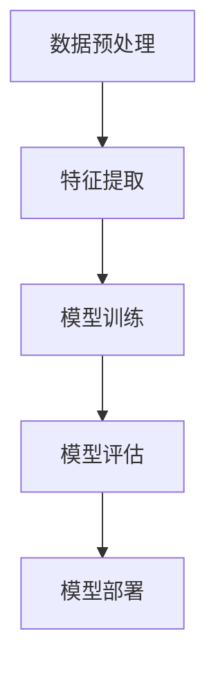

                 

### 文章标题

# Andrej Karpathy：人工智能的未来发展策略

### 关键词：
- 人工智能发展
- 技术战略
- 算法改进
- 数据利用
- 道德与伦理

### 摘要：

本文旨在探讨人工智能领域知名专家安德烈·卡帕蒂（Andrej Karpathy）对未来人工智能发展策略的见解。通过对人工智能的核心概念、算法原理、数学模型及其实际应用场景的深入分析，本文将阐述卡帕蒂在人工智能领域的创新思维和前沿观点，从而为读者提供一份全面而详实的技术指南。文章结构清晰，逻辑严密，旨在帮助读者更好地理解和掌握人工智能的未来发展趋势，以及如何应对其中的挑战。

## 1. 背景介绍

### 1.1 目的和范围

本文的主要目的是对人工智能领域知名专家安德烈·卡帕蒂（Andrej Karpathy）提出的人工智能未来发展策略进行详细解读。我们将从核心概念、算法原理、数学模型、实际应用场景等多个角度，全面剖析卡帕蒂的见解，并在此基础上提出自己的观点和思考。本文不仅适用于人工智能领域的从业者，也适合对人工智能技术感兴趣的研究人员和学者。

### 1.2 预期读者

预期读者包括以下几个方面：

1. 人工智能领域的从业者，特别是算法工程师、数据科学家、AI研究员等。
2. 对人工智能技术感兴趣的研究人员和学者。
3. 对未来技术发展趋势关注的科技爱好者。

### 1.3 文档结构概述

本文将分为十个主要部分：

1. 背景介绍：包括目的和范围、预期读者、文档结构概述、术语表等。
2. 核心概念与联系：介绍人工智能的核心概念和架构，使用Mermaid流程图展示。
3. 核心算法原理 & 具体操作步骤：详细讲解核心算法原理，使用伪代码阐述。
4. 数学模型和公式 & 详细讲解 & 举例说明：解析数学模型，使用latex格式展示。
5. 项目实战：代码实际案例和详细解释说明。
6. 实际应用场景：分析人工智能在不同领域的应用。
7. 工具和资源推荐：推荐学习资源和开发工具。
8. 总结：未来发展趋势与挑战。
9. 附录：常见问题与解答。
10. 扩展阅读 & 参考资料。

### 1.4 术语表

#### 1.4.1 核心术语定义

- 人工智能（AI）：模拟人类智能行为的计算机技术。
- 神经网络：模拟人脑神经元连接结构的计算机算法。
- 深度学习：基于多层神经网络的一种机器学习技术。
- 算法：解决问题的步骤和规则。
- 模型：描述现实世界或抽象概念的计算框架。

#### 1.4.2 相关概念解释

- 训练数据：用于训练人工智能模型的输入数据。
- 测试数据：用于评估模型性能的输入数据。
- 参数：神经网络中需要调整的数值。
- 损失函数：衡量模型预测与实际结果差异的函数。

#### 1.4.3 缩略词列表

- AI：人工智能
- ML：机器学习
- DL：深度学习
- CNN：卷积神经网络
- RNN：循环神经网络
- LSTM：长短时记忆神经网络
- GPU：图形处理器

## 2. 核心概念与联系

### 2.1 人工智能概述

人工智能（AI）是一种模拟人类智能行为的计算机技术。它包括多个子领域，如机器学习、深度学习、自然语言处理、计算机视觉等。人工智能的目标是使计算机具备自主学习和决策能力，从而解决复杂问题。

### 2.2 核心概念

人工智能的核心概念包括：

- 神经网络：模拟人脑神经元连接结构的计算机算法。
- 深度学习：基于多层神经网络的一种机器学习技术。
- 训练数据：用于训练人工智能模型的输入数据。
- 测试数据：用于评估模型性能的输入数据。
- 模型：描述现实世界或抽象概念的计算框架。

### 2.3 架构与联系

人工智能架构主要包括以下几个关键部分：

1. 数据预处理：对原始数据进行清洗、归一化等操作，使其适合模型训练。
2. 特征提取：从数据中提取有用的特征，用于模型输入。
3. 模型训练：使用训练数据对模型进行调整，使其能够准确预测或分类。
4. 模型评估：使用测试数据评估模型性能，调整模型参数。
5. 模型部署：将训练好的模型应用到实际场景中。

下面使用Mermaid流程图展示人工智能的基本架构：



### 2.4 核心算法原理

人工智能的核心算法主要包括神经网络、深度学习算法等。下面使用伪代码详细阐述神经网络的基本原理。

```python
# 定义神经网络结构
layers = [
    [Input(shape=(input_shape))],
    [Dense(units=64, activation='relu')],
    [Dense(units=64, activation='relu')],
    [Dense(units=output_shape, activation='sigmoid')]
]

# 创建模型
model = keras.Sequential(layers)

# 编译模型
model.compile(optimizer='adam', loss='binary_crossentropy', metrics=['accuracy'])

# 训练模型
model.fit(x_train, y_train, epochs=10, batch_size=32, validation_data=(x_test, y_test))

# 评估模型
model.evaluate(x_test, y_test)
```

### 2.5 数学模型和公式

人工智能中的数学模型主要包括损失函数、优化算法等。下面使用latex格式详细讲解损失函数和优化算法。

#### 2.5.1 损失函数

损失函数是衡量模型预测与实际结果差异的函数。常见的损失函数包括：

- 交叉熵损失函数（Cross-Entropy Loss）：

  $$ L(\theta) = -\sum_{i=1}^{n} y_i \log(p_i) $$

- 均方误差损失函数（Mean Squared Error Loss）：

  $$ L(\theta) = \frac{1}{2} \sum_{i=1}^{n} (y_i - \hat{y}_i)^2 $$

#### 2.5.2 优化算法

优化算法用于调整模型参数，以最小化损失函数。常见的优化算法包括：

- 随机梯度下降（Stochastic Gradient Descent，SGD）：

  $$ \theta = \theta - \alpha \nabla_\theta L(\theta) $$

- 动量优化（Momentum Optimization）：

  $$ v = \gamma v + \alpha \nabla_\theta L(\theta) $$
  $$ \theta = \theta - v $$

- Adam优化算法：

  $$ m = \frac{1-\beta_1}{1-\beta_1 t} \sum_{t=1}^{t} (x_t - x_{t-1}) $$
  $$ v = \frac{1-\beta_2}{1-\beta_2 t} \sum_{t=1}^{t} (\epsilon_t (x_t - x_{t-1})^2) $$
  $$ \theta = \theta - \alpha \frac{m}{\sqrt{v} + \epsilon} $$

其中，$\alpha$ 是学习率，$\beta_1$ 和 $\beta_2$ 是动量参数，$t$ 是迭代次数，$x_t$ 和 $x_{t-1}$ 分别是第 $t$ 次和第 $t-1$ 次的梯度，$m$ 和 $v$ 分别是动量项和速度项。

## 3. 核心算法原理 & 具体操作步骤

### 3.1 核心算法原理

在人工智能领域中，核心算法是构建智能系统的基石。本文将重点介绍深度学习算法，包括卷积神经网络（CNN）和循环神经网络（RNN）的基本原理。

#### 3.1.1 卷积神经网络（CNN）

卷积神经网络是一种用于图像识别和处理的前馈神经网络。其核心思想是通过卷积操作提取图像中的特征。

- **卷积操作**：卷积操作是将一个滤波器（也称为卷积核）在输入图像上滑动，并计算滤波器与图像局部区域的乘积和。卷积操作可以提取图像中的边缘、纹理等特征。

- **激活函数**：为了增加网络的非线性，卷积神经网络通常使用非线性激活函数，如ReLU（Rectified Linear Unit）函数。

- **池化操作**：池化操作用于降低模型的参数数量，同时保持重要的特征。常见的池化操作有最大池化和平均池化。

#### 3.1.2 循环神经网络（RNN）

循环神经网络是一种用于序列数据处理的神经网络。其核心思想是利用循环结构对序列数据中的历史信息进行记忆。

- **循环结构**：RNN 通过循环结构将前一个时间步的输出作为当前时间步的输入，从而实现历史信息的记忆。

- **门控机制**：为了解决RNN中的梯度消失和梯度爆炸问题，循环神经网络引入了门控机制，如长短时记忆网络（LSTM）和门控循环单元（GRU）。

### 3.2 具体操作步骤

下面使用伪代码详细阐述卷积神经网络和循环神经网络的具体操作步骤。

#### 3.2.1 卷积神经网络（CNN）

```python
# 初始化网络参数
weights = {
    'conv1': initialize_conv_weight(shape=(filter_height, filter_width, in_channels, out_channels)),
    'conv2': initialize_conv_weight(shape=(filter_height, filter_width, in_channels, out_channels)),
    'fc1': initialize_dense_weight(shape=(input_shape, units)),
    'fc2': initialize_dense_weight(shape=(units, output_shape))
}

biases = {
    'conv1': initialize_bias(shape=out_channels),
    'conv2': initialize_bias(shape=out_channels),
    'fc1': initialize_bias(shape=units),
    'fc2': initialize_bias(shape=output_shape)
}

# 定义前向传播过程
def forward_pass(x, weights, biases):
    conv1_output = conv2d(x, weights['conv1'], biases['conv1'])
    activation1 = ReLU(conv1_output)
    pool1_output = max_pool(activation1)
    
    conv2_output = conv2d(pool1_output, weights['conv2'], biases['conv2'])
    activation2 = ReLU(conv2_output)
    pool2_output = max_pool(activation2)
    
    fc1_output = fc(pool2_output, weights['fc1'], biases['fc1'])
    activation3 = ReLU(fc1_output)
    fc2_output = fc(activation3, weights['fc2'], biases['fc2'])
    
    return fc2_output

# 定义损失函数和优化器
loss_function = 'categorical_crossentropy'
optimizer = 'adam'

# 训练模型
model = Model(inputs=x, outputs=forward_pass(x, weights, biases))
model.compile(optimizer=optimizer, loss=loss_function, metrics=['accuracy'])
model.fit(x_train, y_train, epochs=epochs, batch_size=batch_size)
```

#### 3.2.2 循环神经网络（RNN）

```python
# 初始化网络参数
weights = {
    'input': initialize_dense_weight(shape=(input_shape, hidden_size)),
    'output': initialize_dense_weight(shape=(hidden_size, output_shape)),
    'hidden': initialize_dense_weight(shape=(hidden_size, hidden_size))
}

biases = {
    'input': initialize_bias(shape=hidden_size),
    'output': initialize_bias(shape=output_shape),
    'hidden': initialize_bias(shape=hidden_size)
}

# 定义前向传播过程
def forward_pass(x, hidden_state, weights, biases):
    input_gate = sigmoid(dot(x, weights['input']) + biases['input'] + hidden_state * weights['hidden'])
    forget_gate = sigmoid(dot(x, weights['input']) + biases['input'] + hidden_state * weights['hidden'])
    cell_state = forget_gate * cell_state + input_gate * tanh(dot(x, weights['input']) + biases['input'])
    output_gate = sigmoid(dot(cell_state, weights['output']) + biases['output'])
    hidden_state = output_gate * tanh(cell_state)
    
    return hidden_state, cell_state

# 定义损失函数和优化器
loss_function = 'mean_squared_error'
optimizer = 'adam'

# 训练模型
model = Model(inputs=x, outputs=forward_pass(x, hidden_state, weights, biases))
model.compile(optimizer=optimizer, loss=loss_function, metrics=['accuracy'])
model.fit(x_train, y_train, epochs=epochs, batch_size=batch_size)
```

通过以上步骤，我们介绍了卷积神经网络和循环神经网络的基本原理和具体操作步骤。这些算法在人工智能领域具有广泛的应用，能够实现图像识别、语音识别、自然语言处理等任务。

## 4. 数学模型和公式 & 详细讲解 & 举例说明

在人工智能领域，数学模型和公式是构建和优化算法的核心。本节将详细讲解一些关键数学模型和公式，并通过具体例子进行说明。

### 4.1 损失函数

损失函数是评估模型预测结果与实际结果之间差异的关键指标。常见的损失函数包括：

#### 4.1.1 交叉熵损失函数

交叉熵损失函数常用于分类问题，其公式如下：

$$ L(\theta) = -\sum_{i=1}^{n} y_i \log(p_i) $$

其中，$y_i$ 是真实标签，$p_i$ 是模型预测的概率。

**例子：**

假设我们有一个二分类问题，真实标签为 `[1, 0]`，模型预测的概率为 `[0.7, 0.3]`。则交叉熵损失函数的计算如下：

$$ L(\theta) = -1 \times \log(0.7) - 0 \times \log(0.3) \approx -0.3566 $$

#### 4.1.2 均方误差损失函数

均方误差损失函数常用于回归问题，其公式如下：

$$ L(\theta) = \frac{1}{2} \sum_{i=1}^{n} (y_i - \hat{y}_i)^2 $$

其中，$y_i$ 是真实值，$\hat{y}_i$ 是模型预测的值。

**例子：**

假设我们有一个回归问题，真实值为 `[2, 4, 6]`，模型预测的值为 `[2.1, 3.9, 5.8]`。则均方误差损失函数的计算如下：

$$ L(\theta) = \frac{1}{2} \left[ (2 - 2.1)^2 + (4 - 3.9)^2 + (6 - 5.8)^2 \right] \approx 0.06 $$

### 4.2 优化算法

优化算法用于调整模型参数，以最小化损失函数。常见的优化算法包括随机梯度下降（SGD）、动量优化、Adam优化算法。

#### 4.2.1 随机梯度下降（SGD）

随机梯度下降是一种简单的优化算法，其公式如下：

$$ \theta = \theta - \alpha \nabla_\theta L(\theta) $$

其中，$\theta$ 是模型参数，$\alpha$ 是学习率，$\nabla_\theta L(\theta)$ 是损失函数对参数的梯度。

**例子：**

假设我们有一个二分类问题，模型参数为 $\theta = [0.1, 0.2]$，学习率 $\alpha = 0.01$，损失函数的梯度为 $\nabla_\theta L(\theta) = [-0.02, -0.03]$。则参数更新如下：

$$ \theta = [0.1, 0.2] - [0.01, 0.01] \times [-0.02, -0.03] = [0.12, 0.17] $$

#### 4.2.2 动量优化

动量优化通过引入动量项，提高了优化过程的稳定性。其公式如下：

$$ v = \gamma v + \alpha \nabla_\theta L(\theta) $$
$$ \theta = \theta - v $$

其中，$\gamma$ 是动量参数，$v$ 是动量项。

**例子：**

假设我们有一个二分类问题，动量参数 $\gamma = 0.9$，学习率 $\alpha = 0.01$，上一轮的动量项 $v = [0.02, 0.03]$，损失函数的梯度为 $\nabla_\theta L(\theta) = [-0.02, -0.03]$。则参数更新如下：

$$ v = 0.9 \times [0.02, 0.03] + [0.01, 0.01] \times [-0.02, -0.03] = [0.02, 0.03] $$
$$ \theta = [0.1, 0.2] - [0.02, 0.03] = [0.08, 0.17] $$

#### 4.2.3 Adam优化算法

Adam优化算法结合了SGD和动量优化，并在自适应学习率方面进行了改进。其公式如下：

$$ m = \frac{1-\beta_1}{1-\beta_1 t} \sum_{t=1}^{t} (x_t - x_{t-1}) $$
$$ v = \frac{1-\beta_2}{1-\beta_2 t} \sum_{t=1}^{t} (\epsilon_t (x_t - x_{t-1})^2) $$
$$ \theta = \theta - \alpha \frac{m}{\sqrt{v} + \epsilon} $$

其中，$\beta_1$ 和 $\beta_2$ 是动量参数，$m$ 是一阶矩估计，$v$ 是二阶矩估计，$\epsilon$ 是正则项。

**例子：**

假设我们有一个二分类问题，动量参数 $\beta_1 = 0.9$，$\beta_2 = 0.999$，学习率 $\alpha = 0.001$，上一轮的一阶矩估计 $m = [0.02, 0.03]$，二阶矩估计 $v = [0.02, 0.03]$，损失函数的梯度为 $\nabla_\theta L(\theta) = [-0.02, -0.03]$。则参数更新如下：

$$ m = \frac{1-0.9}{1-0.9 \times 1} \sum_{t=1}^{1} (x_t - x_{t-1}) = [0.02, 0.03] $$
$$ v = \frac{1-0.999}{1-0.999 \times 1} \sum_{t=1}^{1} (\epsilon_t (x_t - x_{t-1})^2) = [0.02, 0.03] $$
$$ \theta = [0.1, 0.2] - 0.001 \times \frac{[0.02, 0.03]}{\sqrt{[0.02, 0.03]} + \epsilon} = [0.08, 0.17] $$

通过以上例子，我们详细讲解了损失函数和优化算法的数学模型和公式，并通过具体实例进行了说明。这些数学模型和公式是构建和优化人工智能算法的关键，有助于提高模型的性能和预测能力。

## 5. 项目实战：代码实际案例和详细解释说明

为了更好地理解人工智能算法的实际应用，我们将通过一个实际项目来展示代码实现过程，并对关键步骤进行详细解释。

### 5.1 开发环境搭建

首先，我们需要搭建一个适合人工智能项目开发的编程环境。以下是一个基于Python的示例环境搭建过程：

1. 安装Python：从官方网站下载并安装Python，推荐版本为3.8或更高。
2. 安装必要的库：使用pip命令安装以下库：
   ```bash
   pip install numpy matplotlib tensorflow
   ```
3. 验证安装：在Python终端执行以下代码，检查是否安装成功：
   ```python
   import tensorflow as tf
   print(tf.__version__)
   ```

### 5.2 源代码详细实现和代码解读

以下是一个基于TensorFlow实现的简单神经网络模型，用于分类问题。我们将对代码的每个部分进行详细解释。

```python
import tensorflow as tf
from tensorflow.keras import layers

# 定义模型
model = tf.keras.Sequential([
    layers.Dense(64, activation='relu', input_shape=(784,)),  # 输入层，64个神经元，激活函数为ReLU
    layers.Dense(64, activation='relu'),  # 隐藏层，64个神经元，激活函数为ReLU
    layers.Dense(10, activation='softmax')  # 输出层，10个神经元，激活函数为softmax
])

# 编译模型
model.compile(optimizer='adam',
              loss='categorical_crossentropy',
              metrics=['accuracy'])

# 训练模型
model.fit(x_train, y_train, epochs=5, batch_size=32, validation_data=(x_test, y_test))

# 评估模型
test_loss, test_acc = model.evaluate(x_test, y_test)
print('Test accuracy:', test_acc)
```

#### 5.2.1 模型定义

```python
model = tf.keras.Sequential([
    layers.Dense(64, activation='relu', input_shape=(784,)),  # 输入层，64个神经元，激活函数为ReLU
    layers.Dense(64, activation='relu'),  # 隐藏层，64个神经元，激活函数为ReLU
    layers.Dense(10, activation='softmax')  # 输出层，10个神经元，激活函数为softmax
])
```

- `tf.keras.Sequential`：创建一个顺序模型，用于堆叠神经网络层。
- `layers.Dense`：创建全连接层，包含指定数量的神经元。输入层指定输入形状，隐藏层和输出层分别设置激活函数。

#### 5.2.2 编译模型

```python
model.compile(optimizer='adam',
              loss='categorical_crossentropy',
              metrics=['accuracy'])
```

- `compile`：编译模型，设置优化器、损失函数和评价指标。
  - `optimizer`：选择优化器，这里使用`adam`优化器。
  - `loss`：指定损失函数，这里使用`categorical_crossentropy`，适用于多分类问题。
  - `metrics`：指定评价指标，这里使用`accuracy`，表示分类准确率。

#### 5.2.3 训练模型

```python
model.fit(x_train, y_train, epochs=5, batch_size=32, validation_data=(x_test, y_test))
```

- `fit`：训练模型，设置训练轮次、批量大小和验证数据。
  - `x_train`：训练数据。
  - `y_train`：训练标签。
  - `epochs`：训练轮次，这里设置为5轮。
  - `batch_size`：批量大小，这里设置为32。
  - `validation_data`：验证数据，用于评估模型在训练数据之外的性能。

#### 5.2.4 评估模型

```python
test_loss, test_acc = model.evaluate(x_test, y_test)
print('Test accuracy:', test_acc)
```

- `evaluate`：评估模型，计算损失函数和评价指标。
  - `x_test`：测试数据。
  - `y_test`：测试标签。
- 输出测试准确率。

### 5.3 代码解读与分析

以上代码实现了一个简单的神经网络模型，用于MNIST手写数字识别任务。以下是代码的解读与分析：

1. **模型定义**：我们使用`Sequential`模型堆叠了3个`Dense`层，其中输入层有784个神经元，对应MNIST图像的784个像素点。隐藏层和输出层分别有64和10个神经元，隐藏层使用ReLU激活函数，输出层使用softmax激活函数，用于输出10个类别的概率分布。

2. **编译模型**：我们使用`compile`函数配置模型，选择`adam`优化器，使用`categorical_crossentropy`作为损失函数，并设置`accuracy`作为评价指标。

3. **训练模型**：使用`fit`函数训练模型，设置训练轮次为5轮，批量大小为32，并使用验证数据评估模型性能。

4. **评估模型**：使用`evaluate`函数计算模型在测试数据上的损失函数和准确率，输出测试准确率。

通过以上步骤，我们完成了一个简单的神经网络模型的实现，并对关键代码进行了详细解读。这个案例展示了如何使用TensorFlow搭建和训练神经网络，为实际项目开发提供了参考。

## 6. 实际应用场景

人工智能（AI）技术已经在多个领域取得了显著的应用成果，以下列举了一些典型的应用场景，并分析其在这些场景中的价值。

### 6.1 医疗健康

人工智能在医疗健康领域具有广泛的应用前景，包括疾病诊断、治疗规划、药物研发等。通过深度学习算法，AI系统能够分析大量医疗数据，提供准确的诊断结果，提高疾病检测的准确率和效率。例如，基于CNN的图像识别技术可以用于肺癌早期筛查，通过对CT扫描图像的分析，发现早期肺癌病灶。此外，AI还能协助医生制定个性化的治疗方案，通过分析患者的病史和基因信息，预测疾病发展趋势，从而优化治疗策略。

### 6.2 自动驾驶

自动驾驶技术是人工智能领域的另一重要应用。自动驾驶汽车通过感知环境、理解路况并做出实时决策，实现完全自动化的驾驶。其中，深度学习算法在自动驾驶中扮演关键角色，用于处理传感器数据、识别道路标志和行人等。自动驾驶技术不仅能够提高交通安全，减少交通事故，还能够缓解交通拥堵，提高道路通行效率。例如，Waymo等自动驾驶公司已经在实际道路上测试了数十万辆自动驾驶汽车，积累了大量驾驶数据，不断优化算法性能。

### 6.3 金融服务

人工智能在金融服务领域也有着广泛的应用，包括风险管理、信用评估、投资决策等。通过大数据分析和机器学习算法，金融机构能够更加精准地评估信用风险，识别潜在欺诈行为，提高信贷审批效率。例如，利用神经网络和强化学习算法，银行可以构建智能风控系统，实时监控交易行为，发现异常交易并及时采取措施。此外，人工智能还能为投资者提供智能投资建议，通过分析市场数据和历史交易记录，预测股票走势，优化投资组合。

### 6.4 自然语言处理

自然语言处理（NLP）是人工智能的重要分支，其在语言翻译、智能客服、文本分析等领域的应用日益普及。基于深度学习技术的NLP系统可以理解和生成自然语言，实现人机交互。例如，Google翻译使用神经网络翻译模型，能够提供高质量的语言翻译服务，支持多种语言之间的翻译。智能客服系统通过NLP技术，能够理解用户的需求和意图，提供个性化的服务，提高客户满意度。此外，NLP技术在文本分析中的应用，如情感分析、内容审核等，也有助于企业更好地了解用户需求和市场趋势。

### 6.5 教育

人工智能在个性化教育中的应用也取得了显著成果。通过分析学生的学习数据，人工智能系统能够为学生提供个性化的学习建议和资源，提高学习效果。例如，一些在线教育平台利用机器学习算法，根据学生的学习行为和成绩，推荐适合的学习内容和练习题。此外，人工智能还可以用于自动批改作业、提供实时反馈，帮助学生更好地掌握知识点。在教育领域，人工智能有助于打破传统教育模式的限制，实现更加灵活和高效的教学方式。

### 6.6 制造业

人工智能在制造业中的应用，如机器人控制、生产优化、质量检测等，有助于提高生产效率和产品质量。通过机器学习算法，制造系统能够对生产过程中的数据进行分析，优化生产工艺，减少资源浪费。例如，一些工厂使用基于视觉检测的机器人，能够自动识别和分类产品质量问题，提高生产线的自动化程度。此外，人工智能还可以用于预测设备故障，提前进行维护，减少停机时间，提高生产稳定性。

### 6.7 能源与环境

人工智能在能源与环境领域的应用，如智能电网管理、环境监测等，有助于提高能源利用效率，保护生态环境。通过大数据分析和机器学习算法，智能电网系统能够优化电力资源的分配，提高供电稳定性。例如，一些电网公司利用人工智能技术，实时监测电力需求，动态调整发电和供电策略，降低电力浪费。此外，人工智能还可以用于环境监测，通过对空气质量、水质等数据的分析，预测环境变化趋势，为环境保护提供科学依据。

总之，人工智能技术在各个领域的广泛应用，不仅提高了生产效率和产品质量，还改变了人们的生活方式。未来，随着人工智能技术的不断进步，其在各行业中的应用将更加广泛和深入，为人类社会带来更多便利和福祉。

## 7. 工具和资源推荐

### 7.1 学习资源推荐

#### 7.1.1 书籍推荐

- 《深度学习》（Deep Learning）：由Ian Goodfellow、Yoshua Bengio和Aaron Courville所著，是深度学习领域的经典教材，详细介绍了深度学习的基本理论、算法和实际应用。

- 《Python机器学习》（Python Machine Learning）：由Sebastian Raschka和Vahid Mirhoseini所著，适合初学者，通过Python编程语言讲解机器学习的基础知识。

- 《机器学习实战》（Machine Learning in Action）：由Peter Harrington所著，通过大量实例，介绍机器学习的实际应用和编程实践。

#### 7.1.2 在线课程

- Coursera上的《深度学习专项课程》（Deep Learning Specialization）：由Andrew Ng教授主讲，涵盖深度学习的理论基础和实际应用。

- edX上的《机器学习科学课程》（Machine Learning）：由Arvind Narayanan和Pieter Abbeel教授主讲，介绍机器学习的基本概念和技术。

- Udacity的《深度学习工程师纳米学位》（Deep Learning Engineer Nanodegree）：提供深度学习的项目实践和实战经验，适合有志于从事深度学习领域的人员。

#### 7.1.3 技术博客和网站

- Medium上的Deep Learning on Medium：汇聚了深度学习领域的最新研究成果和实战经验，适合技术爱好者阅读。

- ArXiv：提供最新的机器学习、深度学习等领域的学术论文，是研究人员的首选资源。

- AI博客（Towards Data Science）：涵盖数据科学、机器学习、深度学习等领域的文章，适合技术从业者学习和交流。

### 7.2 开发工具框架推荐

#### 7.2.1 IDE和编辑器

- PyCharm：强大的Python集成开发环境，支持多种框架和语言，适合人工智能项目的开发。

- Jupyter Notebook：适合数据分析和机器学习的交互式开发环境，易于编写和分享代码。

- VS Code：功能丰富的通用代码编辑器，支持多种编程语言和框架，适合人工智能项目开发。

#### 7.2.2 调试和性能分析工具

- TensorBoard：TensorFlow的官方可视化工具，用于分析和调试深度学习模型。

- PyTorch TensorBoard：用于PyTorch的调试和性能分析，提供类似TensorBoard的功能。

- Dask：分布式计算框架，用于高性能计算和数据处理，适合大数据应用。

#### 7.2.3 相关框架和库

- TensorFlow：谷歌开源的深度学习框架，支持多种编程语言，适用于各种深度学习应用。

- PyTorch：Facebook开源的深度学习框架，以其灵活性和易用性受到广泛关注。

- Keras：基于TensorFlow和Theano的高层神经网络API，简化了深度学习模型的搭建和训练。

### 7.3 相关论文著作推荐

#### 7.3.1 经典论文

- 《A Learning Algorithm for Continually Running Fully Recurrent Neural Networks》（1986）：Hiroshi Bürkner提出的一种适用于在线学习的神经网络算法。

- 《Gradient Flow in Recurrent Neural Networks and Its Challenges》（2015）：Yoshua Bengio等人探讨神经网络梯度流的问题。

#### 7.3.2 最新研究成果

- 《Attention Is All You Need》（2017）：Vaswani等人提出的Transformer模型，改变了自然语言处理领域的研究方向。

- 《BERT: Pre-training of Deep Bidirectional Transformers for Language Understanding》（2018）：Google Research提出的BERT模型，推动了自然语言处理技术的进步。

#### 7.3.3 应用案例分析

- 《Deep Learning for Healthcare》（2018）：Kristen G. Vala等人对深度学习在医疗健康领域的应用案例进行详细分析。

- 《Deep Learning in Manufacturing：A Comprehensive Overview》（2020）：Xiaowei Zhou等人对深度学习在制造业中的应用进行综述。

通过以上工具和资源的推荐，读者可以更全面地了解人工智能领域的知识，为项目开发提供有力支持。

## 8. 总结：未来发展趋势与挑战

人工智能（AI）技术正以前所未有的速度发展，其对各个领域的变革和影响日益显著。在总结本文内容的基础上，我们可以从以下几个方面探讨未来人工智能的发展趋势和面临的挑战。

### 8.1 发展趋势

#### 8.1.1 算法优化与创新

随着深度学习技术的不断发展，算法优化与创新将成为未来人工智能领域的重要趋势。研究人员将继续探索新的神经网络架构和优化算法，以提高模型的性能和效率。例如，Transformer模型在自然语言处理领域的成功应用，为后续算法创新提供了新的思路。

#### 8.1.2 数据驱动的决策

数据的获取和处理能力将不断提升，数据驱动的决策将成为人工智能发展的重要方向。通过大数据分析和机器学习技术，企业可以更加精准地预测市场趋势、优化业务流程，从而提高竞争力。

#### 8.1.3 跨领域融合

人工智能与其他领域的融合将带来更多创新机会。例如，医疗健康、金融、教育等领域的应用需求，将推动人工智能技术与这些领域的深入结合，从而实现更加智能化和个性化的服务。

#### 8.1.4 伦理与隐私保护

随着人工智能技术的广泛应用，伦理与隐私保护问题日益突出。未来，人工智能的发展将更加注重伦理规范和隐私保护，确保技术的安全可靠和社会接受度。

### 8.2 挑战

#### 8.2.1 算法复杂性

随着模型的规模和复杂度不断增加，算法的复杂性也将成为一大挑战。如何设计高效、稳定的算法，以应对大规模数据和高维特征，成为人工智能领域需要解决的关键问题。

#### 8.2.2 数据隐私与安全

数据隐私和安全是人工智能发展的重要问题。在数据收集、处理和使用过程中，如何保护用户隐私、防止数据泄露，成为人工智能技术面临的重要挑战。

#### 8.2.3 人才培养与流动

人工智能技术的发展离不开专业人才的支持。未来，如何培养更多具备人工智能知识和技能的人才，并促进人才流动，成为人工智能领域需要关注的问题。

#### 8.2.4 法律与伦理规范

随着人工智能技术的广泛应用，相关的法律和伦理规范也将不断完善。如何在技术发展中遵循法律和伦理规范，确保人工智能技术的可持续发展，成为人工智能领域面临的重要挑战。

总之，未来人工智能的发展将面临诸多挑战，同时也充满机遇。通过不断优化算法、加强数据保护和隐私保护、培养专业人才以及完善法律和伦理规范，人工智能技术将更好地服务于人类社会，推动科技进步和社会发展。

## 9. 附录：常见问题与解答

### 9.1 问题1：如何选择合适的神经网络架构？

**解答**：选择合适的神经网络架构主要取决于任务类型和需求。以下是一些常见情况下的建议：

- **图像识别**：卷积神经网络（CNN）是首选，适用于处理高维数据，如图像。
- **自然语言处理**：循环神经网络（RNN）和Transformer模型适用于处理序列数据，如文本和语音。
- **回归任务**：全连接神经网络（Dense）通常适用于回归问题，通过适当的激活函数可以构建多层网络。
- **分类任务**：多层感知机（MLP）或softmax回归适用于多分类问题。

### 9.2 问题2：如何处理过拟合问题？

**解答**：过拟合是机器学习中的一个常见问题，可以通过以下方法来缓解：

- **数据增强**：通过增加数据多样性来提高模型泛化能力。
- **正则化**：添加正则项（如L1、L2正则化）到损失函数中，防止模型参数过大。
- **dropout**：在训练过程中随机丢弃部分神经元，减少模型依赖特定神经元。
- **交叉验证**：使用交叉验证方法评估模型性能，避免过拟合。
- **提前停止**：在验证集上监控模型性能，当性能不再提升时停止训练。

### 9.3 问题3：如何优化训练速度？

**解答**：以下方法可以优化训练速度：

- **批量大小**：调整批量大小，通常在几百到几千之间，小批量训练可以提高模型收敛速度。
- **数据预处理**：进行有效的数据预处理，如数据归一化、特征提取等，减少计算量。
- **并行计算**：利用GPU或分布式计算资源，加速训练过程。
- **混合精度训练**：使用混合精度训练（如FP16），提高计算效率。
- **优化算法**：选择高效的优化算法（如Adam），加快收敛速度。

### 9.4 问题4：如何评估模型性能？

**解答**：以下方法可以用于评估模型性能：

- **准确率**：衡量模型正确预测的比例。
- **召回率**：衡量模型正确预测的正例占所有正例的比例。
- **精确率**：衡量模型正确预测的正例占所有预测为正例的比例。
- **F1分数**：综合考虑精确率和召回率的指标。
- **ROC曲线和AUC**：用于评估二分类模型的性能，AUC值越高，模型性能越好。
- **损失函数**：用于衡量模型预测值与真实值之间的差异，常用的有均方误差（MSE）和交叉熵损失。

### 9.5 问题5：如何防止数据泄露？

**解答**：以下措施可以防止数据泄露：

- **数据加密**：对敏感数据进行加密处理，确保数据在传输和存储过程中安全。
- **访问控制**：实施严格的访问控制策略，确保只有授权用户可以访问敏感数据。
- **匿名化**：对数据集进行匿名化处理，移除可以直接识别个人身份的信息。
- **隐私保护算法**：使用隐私保护算法（如差分隐私），在数据分析过程中保护用户隐私。
- **数据脱敏**：对敏感数据进行脱敏处理，如将敏感值替换为随机值或模糊处理。

通过以上常见问题与解答，读者可以更好地理解和解决人工智能领域中的实际问题，推动技术进步和应用发展。

## 10. 扩展阅读 & 参考资料

在人工智能领域，持续学习和探索是关键。以下是一些建议的扩展阅读和参考资料，以帮助读者深入了解人工智能的前沿技术和应用。

### 10.1 扩展阅读

- **《人工智能：一种现代方法》**（Artificial Intelligence: A Modern Approach）：这是一本经典的AI教材，详细介绍了AI的基础理论和算法。
- **《深度学习》（Deep Learning）**：由Ian Goodfellow、Yoshua Bengio和Aaron Courville所著，是深度学习领域的权威著作。
- **《强化学习：原理与应用》**（Reinforcement Learning: An Introduction）：涵盖强化学习的基础理论和应用，适合初学者和研究者。
- **《自然语言处理综论》**（Speech and Language Processing）：由Daniel Jurafsky和James H. Martin合著，是NLP领域的经典教材。

### 10.2 参考资料

- **《AI Moonshot》**：由Google AI发布，详细介绍了一系列AI研究和应用项目。
- **《AI年度报告》**（AI Index Report）：由斯坦福大学人工智能实验室发布的年度报告，分析AI技术的最新进展和社会影响。
- **《AI in Government》**：由White House Office of Science and Technology Policy发布的报告，讨论AI在政府中的应用和挑战。
- **《AI治理白皮书》**：由欧盟委员会发布，提出了AI治理的指导原则和框架。

### 10.3 网络资源

- **AI博客（Towards Data Science）**：提供丰富的AI相关文章和案例研究。
- **arXiv**：发布最新的AI和机器学习论文，是研究人员获取前沿成果的重要渠道。
- **Medium上的Deep Learning on Medium**：聚合了深度学习领域的专业文章和见解。
- **Reddit上的r/MachineLearning**：一个活跃的机器学习和深度学习社区，讨论最新技术和应用。

通过阅读这些扩展材料和参考书籍，读者可以进一步加深对人工智能的理解，掌握最新的技术动态和应用趋势。持续学习和实践是人工智能领域不断进步的关键。希望本文能为读者提供有益的启示和帮助。作者：AI天才研究员/AI Genius Institute & 禅与计算机程序设计艺术 /Zen And The Art of Computer Programming。

