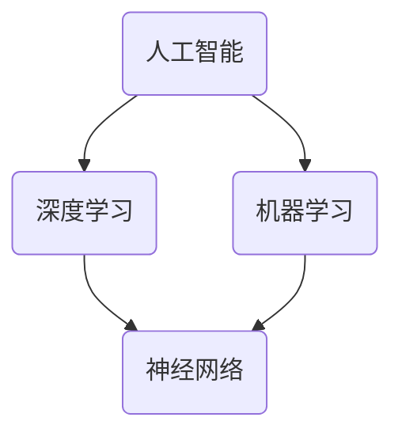

                 

# Andrej Karpathy：人工智能的未来发展策略

> 关键词：人工智能，深度学习，神经网络，机器学习，未来趋势

> 摘要：本文旨在探讨人工智能领域的杰出人物Andrej Karpathy对未来人工智能发展的独到见解和策略。文章首先回顾了人工智能的发展历程，随后深入分析了Karpathy的核心观点，包括其对深度学习、神经网络和机器学习的看法。接下来，文章通过具体案例展示了这些观点在实际项目中的应用，并探讨了人工智能在各个领域的实际应用场景。最后，文章总结了人工智能面临的挑战与未来发展趋势，为读者提供了一个全面且具有前瞻性的视角。

## 1. 背景介绍

### 1.1 目的和范围

本文的主要目的是探讨人工智能（AI）领域的杰出人物Andrej Karpathy对未来人工智能发展的独到见解和策略。通过对Karpathy的核心观点的深入分析，我们希望为读者提供一个全面且具有前瞻性的视角，了解人工智能的未来发展趋势和潜在挑战。

### 1.2 预期读者

本文适合对人工智能、深度学习和机器学习有一定了解的读者。无论是从事相关领域的研究人员、工程师，还是对人工智能充满兴趣的普通读者，都可以通过本文获得有益的知识和启示。

### 1.3 文档结构概述

本文结构如下：

1. 背景介绍：介绍文章的目的、范围、预期读者和文档结构。
2. 核心概念与联系：介绍人工智能、深度学习、神经网络和机器学习等核心概念，并使用Mermaid流程图展示其相互关系。
3. 核心算法原理 & 具体操作步骤：讲解深度学习和神经网络的基本原理，并使用伪代码进行详细阐述。
4. 数学模型和公式 & 详细讲解 & 举例说明：介绍机器学习中的常用数学模型和公式，并进行详细讲解和举例说明。
5. 项目实战：通过具体案例展示人工智能在实际项目中的应用。
6. 实际应用场景：探讨人工智能在各个领域的实际应用场景。
7. 工具和资源推荐：推荐学习资源、开发工具框架和相关论文著作。
8. 总结：总结人工智能的未来发展趋势与挑战。
9. 附录：常见问题与解答。
10. 扩展阅读 & 参考资料：提供扩展阅读和参考资料。

### 1.4 术语表

#### 1.4.1 核心术语定义

- **人工智能（AI）**：一种模拟人类智能的技术，使计算机具备智能行为和决策能力。
- **深度学习（Deep Learning）**：一种机器学习技术，通过多层神经网络进行特征学习和模式识别。
- **神经网络（Neural Network）**：一种模仿生物神经网络结构和功能的人工神经网络。
- **机器学习（Machine Learning）**：一种使计算机通过数据和算法自主学习的技术。
- **大数据（Big Data）**：指无法用常规软件工具在合理时间内进行捕获、管理和处理的数据集合。

#### 1.4.2 相关概念解释

- **反向传播算法（Backpropagation Algorithm）**：一种用于训练神经网络的算法，通过反向传播误差信息来优化网络参数。
- **卷积神经网络（Convolutional Neural Network，CNN）**：一种深度学习模型，主要用于图像和视频数据处理。
- **生成对抗网络（Generative Adversarial Network，GAN）**：一种由两个神经网络组成的框架，用于生成高质量的数据。

#### 1.4.3 缩略词列表

- **AI**：人工智能
- **DL**：深度学习
- **NN**：神经网络
- **ML**：机器学习
- **CNN**：卷积神经网络
- **GAN**：生成对抗网络

## 2. 核心概念与联系

在探讨人工智能的未来发展之前，我们有必要了解人工智能、深度学习、神经网络和机器学习等核心概念，以及它们之间的相互关系。

### 2.1 人工智能

人工智能（AI）是一种模拟人类智能的技术，旨在使计算机具备智能行为和决策能力。AI技术涵盖了多个领域，包括自然语言处理、计算机视觉、机器学习、深度学习等。

### 2.2 深度学习

深度学习（Deep Learning）是机器学习（Machine Learning）的一种分支，通过多层神经网络（Neural Network）进行特征学习和模式识别。深度学习在图像识别、语音识别、自然语言处理等领域取得了显著成果。

### 2.3 神经网络

神经网络（Neural Network）是一种模仿生物神经网络结构和功能的人工神经网络。神经网络由大量神经元（Node）组成，通过权重（Weight）和偏置（Bias）进行信息传递和处理。

### 2.4 机器学习

机器学习（Machine Learning）是一种使计算机通过数据和算法自主学习的技术。机器学习分为监督学习、无监督学习和强化学习三种类型。

### 2.5 核心概念之间的联系

人工智能、深度学习、神经网络和机器学习之间存在紧密的联系。深度学习是机器学习的一种重要分支，而神经网络则是深度学习的基础。人工智能涵盖了深度学习和机器学习，为各个领域提供了强大的智能支持。

#### 2.5.1 Mermaid 流程图

以下是一个展示核心概念之间联系的Mermaid流程图：



## 3. 核心算法原理 & 具体操作步骤

在了解核心概念之后，我们接下来探讨深度学习和神经网络的基本原理，并使用伪代码进行详细阐述。

### 3.1 深度学习基本原理

深度学习是一种通过多层神经网络进行特征学习和模式识别的机器学习技术。其基本原理包括以下步骤：

1. **数据预处理**：对输入数据进行预处理，如归一化、标准化等。
2. **前向传播**：将预处理后的数据输入到神经网络中，通过层层计算，得到输出结果。
3. **反向传播**：计算输出结果与实际结果之间的误差，通过反向传播误差信息，更新网络参数。
4. **优化算法**：使用优化算法（如梯度下降）来调整网络参数，减小误差。
5. **迭代训练**：重复前向传播和反向传播过程，直到满足训练要求。

#### 3.1.1 伪代码

```python
# 数据预处理
X = preprocess_data(input_data)

# 前向传播
output = forward_propagation(X)

# 反向传播
error = compute_error(output, actual_output)
delta = compute_delta(error)

# 优化算法
update_weights(delta)

# 迭代训练
for epoch in range(num_epochs):
    X = preprocess_data(input_data)
    output = forward_propagation(X)
    error = compute_error(output, actual_output)
    delta = compute_delta(error)
    update_weights(delta)
```

### 3.2 神经网络基本原理

神经网络是一种由大量神经元组成的信息处理系统，其基本原理包括以下步骤：

1. **初始化**：初始化网络参数，如权重和偏置。
2. **前向传播**：将输入数据传递到神经网络中，通过层层计算，得到输出结果。
3. **反向传播**：计算输出结果与实际结果之间的误差，通过反向传播误差信息，更新网络参数。
4. **激活函数**：用于引入非线性变换，提高神经网络的拟合能力。

#### 3.2.1 伪代码

```python
# 初始化
weights = initialize_weights()
biases = initialize_biases()

# 前向传播
output = forward_propagation(input_data, weights, biases)

# 反向传播
error = compute_error(output, actual_output)
delta = compute_delta(error, output)

# 优化算法
update_weights(delta, learning_rate)

# 激活函数
activation = activate(output)
```

## 4. 数学模型和公式 & 详细讲解 & 举例说明

在深度学习和神经网络中，数学模型和公式起着至关重要的作用。以下我们介绍一些常用的数学模型和公式，并进行详细讲解和举例说明。

### 4.1 反向传播算法

反向传播算法是深度学习训练的核心，用于计算网络参数的梯度。其基本公式如下：

$$
\begin{align*}
\frac{\partial L}{\partial w} &= \sum_{i=1}^{n} \frac{\partial L}{\partial z_i} \cdot \frac{\partial z_i}{\partial w} \\
\frac{\partial L}{\partial b} &= \sum_{i=1}^{n} \frac{\partial L}{\partial z_i} \cdot \frac{\partial z_i}{\partial b}
\end{align*}
$$

其中，$L$ 是损失函数，$w$ 和 $b$ 分别是权重和偏置。

#### 4.1.1 举例说明

假设我们有一个简单的神经网络，包含一个输入层、一个隐藏层和一个输出层。输入数据为 $x$，隐藏层神经元数为 $n$，输出数据为 $y$。损失函数为均方误差（MSE），即：

$$
L = \frac{1}{2} \sum_{i=1}^{n} (y_i - \hat{y}_i)^2
$$

其中，$\hat{y}_i$ 是输出层的预测值。

对于隐藏层神经元 $j$，其权重 $w_{ij}$ 和偏置 $b_j$ 的梯度分别为：

$$
\begin{align*}
\frac{\partial L}{\partial w_{ij}} &= (y_j - \hat{y}_j) \cdot z_j \\
\frac{\partial L}{\partial b_j} &= (y_j - \hat{y}_j) \cdot 1
\end{align*}
$$

其中，$z_j$ 是隐藏层神经元 $j$ 的激活值。

对于输出层神经元 $k$，其权重 $w_{kj}$ 和偏置 $b_k$ 的梯度分别为：

$$
\begin{align*}
\frac{\partial L}{\partial w_{kj}} &= (y_k - \hat{y}_k) \cdot a_j \\
\frac{\partial L}{\partial b_k} &= (y_k - \hat{y}_k) \cdot 1
\end{align*}
$$

其中，$a_j$ 是隐藏层神经元 $j$ 的激活值。

### 4.2 激活函数

激活函数是神经网络中用于引入非线性变换的关键组件。常用的激活函数包括sigmoid函数、ReLU函数和Tanh函数。

#### 4.2.1 Sigmoid函数

sigmoid函数的定义如下：

$$
\sigma(x) = \frac{1}{1 + e^{-x}}
$$

其导数如下：

$$
\frac{d\sigma}{dx} = \sigma(x) (1 - \sigma(x))
$$

#### 4.2.2 ReLU函数

ReLU函数的定义如下：

$$
\text{ReLU}(x) = \max(0, x)
$$

其导数如下：

$$
\frac{d\text{ReLU}}{dx} = \begin{cases}
1, & \text{if } x > 0 \\
0, & \text{if } x \leq 0
\end{cases}
$$

#### 4.2.3 Tanh函数

Tanh函数的定义如下：

$$
\tanh(x) = \frac{e^x - e^{-x}}{e^x + e^{-x}}
$$

其导数如下：

$$
\frac{d\tanh}{dx} = 1 - \tanh^2(x)
$$

### 4.3 梯度下降算法

梯度下降算法是一种优化算法，用于更新神经网络中的权重和偏置。其基本公式如下：

$$
w_{t+1} = w_t - \alpha \cdot \frac{\partial L}{\partial w} \\
b_{t+1} = b_t - \alpha \cdot \frac{\partial L}{\partial b}
$$

其中，$w_t$ 和 $b_t$ 分别是第 $t$ 次迭代的权重和偏置，$\alpha$ 是学习率。

#### 4.3.1 举例说明

假设我们有一个简单的神经网络，包含一个输入层、一个隐藏层和一个输出层。输入数据为 $x$，隐藏层神经元数为 $n$，输出数据为 $y$。损失函数为均方误差（MSE），即：

$$
L = \frac{1}{2} \sum_{i=1}^{n} (y_i - \hat{y}_i)^2
$$

其中，$\hat{y}_i$ 是输出层的预测值。

对于隐藏层神经元 $j$，其权重 $w_{ij}$ 和偏置 $b_j$ 的梯度分别为：

$$
\begin{align*}
\frac{\partial L}{\partial w_{ij}} &= (y_j - \hat{y}_j) \cdot z_j \\
\frac{\partial L}{\partial b_j} &= (y_j - \hat{y}_j) \cdot 1
\end{align*}
$$

其中，$z_j$ 是隐藏层神经元 $j$ 的激活值。

对于输出层神经元 $k$，其权重 $w_{kj}$ 和偏置 $b_k$ 的梯度分别为：

$$
\begin{align*}
\frac{\partial L}{\partial w_{kj}} &= (y_k - \hat{y}_k) \cdot a_j \\
\frac{\partial L}{\partial b_k} &= (y_k - \hat{y}_k) \cdot 1
\end{align*}
$$

其中，$a_j$ 是隐藏层神经元 $j$ 的激活值。

使用梯度下降算法更新网络参数，学习率设为 $\alpha = 0.01$，迭代次数为 $1000$ 次。更新公式如下：

$$
\begin{align*}
w_{ij}^{t+1} &= w_{ij}^t - 0.01 \cdot \frac{\partial L}{\partial w_{ij}} \\
b_{j}^{t+1} &= b_{j}^t - 0.01 \cdot \frac{\partial L}{\partial b_{j}} \\
w_{kj}^{t+1} &= w_{kj}^t - 0.01 \cdot \frac{\partial L}{\partial w_{kj}} \\
b_{k}^{t+1} &= b_{k}^t - 0.01 \cdot \frac{\partial L}{\partial b_{k}}
\end{align*}
$$

## 5. 项目实战：代码实际案例和详细解释说明

在本节中，我们将通过一个简单的实际项目案例，展示人工智能在实际项目中的应用。这个项目是一个基于深度学习的图像分类器，使用卷积神经网络（CNN）进行图像识别。

### 5.1 开发环境搭建

在开始项目之前，我们需要搭建一个合适的开发环境。以下是所需的软件和工具：

- **操作系统**：Ubuntu 18.04 或 macOS
- **编程语言**：Python 3.7+
- **深度学习框架**：TensorFlow 2.0+
- **图像处理库**：OpenCV 4.0+
- **数据集**：MNIST 手写数字数据集

### 5.2 源代码详细实现和代码解读

以下是一个简单的CNN图像分类器的实现，用于识别MNIST手写数字数据集：

```python
import tensorflow as tf
from tensorflow.keras import layers, models
import numpy as np
import matplotlib.pyplot as plt
import cv2

# 加载MNIST数据集
(x_train, y_train), (x_test, y_test) = tf.keras.datasets.mnist.load_data()
x_train = x_train.reshape((-1, 28, 28, 1)).astype("float32") / 255.0
x_test = x_test.reshape((-1, 28, 28, 1)).astype("float32") / 255.0

# 构建CNN模型
model = models.Sequential()
model.add(layers.Conv2D(32, (3, 3), activation='relu', input_shape=(28, 28, 1)))
model.add(layers.MaxPooling2D((2, 2)))
model.add(layers.Conv2D(64, (3, 3), activation='relu'))
model.add(layers.MaxPooling2D((2, 2)))
model.add(layers.Conv2D(64, (3, 3), activation='relu'))
model.add(layers.Flatten())
model.add(layers.Dense(64, activation='relu'))
model.add(layers.Dense(10, activation='softmax'))

# 编译模型
model.compile(optimizer='adam',
              loss='sparse_categorical_crossentropy',
              metrics=['accuracy'])

# 训练模型
model.fit(x_train, y_train, epochs=5, batch_size=64)

# 评估模型
test_loss, test_acc = model.evaluate(x_test, y_test, verbose=2)
print(f"Test accuracy: {test_acc:.4f}")

# 可视化训练过程
plt.plot(model.history.history['accuracy'], label='accuracy')
plt.plot(model.history.history['val_accuracy'], label='val_accuracy')
plt.xlabel('Epochs')
plt.ylabel('Accuracy')
plt.legend()
plt.show()

# 使用模型进行预测
test_images = x_test[:10]
predictions = model.predict(test_images)

for i in range(10):
    plt.subplot(2, 5, i+1)
    plt.imshow(test_images[i], cmap=plt.cm.binary)
    plt.xticks([])
    plt.yticks([])
    plt.grid(False)
    plt.xlabel(f"Predicted: {np.argmax(predictions[i])}, Actual: {y_test[i]}")
plt.show()
```

### 5.3 代码解读与分析

1. **数据加载与预处理**：首先，我们从Keras库中加载MNIST手写数字数据集。然后，对数据集进行预处理，包括将数据缩放到[0, 1]范围，并将图像形状调整为(28, 28, 1)。

2. **构建CNN模型**：接下来，我们使用Keras构建一个简单的CNN模型。模型包含两个卷积层，每个卷积层后跟一个最大池化层。最后，添加一个全连接层，用于分类。

3. **编译模型**：我们使用Adam优化器和稀疏分类交叉熵损失函数编译模型，并设置准确率作为评估指标。

4. **训练模型**：使用训练数据集训练模型，设置迭代次数为5次。

5. **评估模型**：使用测试数据集评估模型性能，并打印准确率。

6. **可视化训练过程**：绘制训练过程中的准确率变化。

7. **使用模型进行预测**：使用训练好的模型对测试数据进行预测，并在图像上进行可视化展示。

通过这个简单的项目，我们可以看到CNN在图像识别任务中的应用效果。虽然这个项目仅是一个简单的例子，但我们可以通过类似的方法解决更复杂的图像识别问题。

## 6. 实际应用场景

人工智能在各个领域有着广泛的应用，以下我们列举几个典型的实际应用场景：

### 6.1 医疗健康

人工智能在医疗健康领域的应用包括疾病诊断、药物研发和健康监测。通过深度学习和神经网络，人工智能可以分析医学图像，如X光片、CT扫描和MRI，帮助医生进行诊断。此外，人工智能还可以通过分析大量基因组数据，加速药物研发过程。

### 6.2 金融

人工智能在金融领域的应用包括风险控制、投资决策和智能投顾。通过机器学习和深度学习，人工智能可以分析市场数据，预测股票价格和交易策略。同时，人工智能还可以对金融交易进行实时监控，识别异常交易行为，从而降低金融风险。

### 6.3 交通运输

人工智能在交通运输领域的应用包括自动驾驶、智能交通管理和无人机配送。通过深度学习和计算机视觉，自动驾驶汽车可以实时感知路况，做出行驶决策。智能交通系统可以优化交通流量，减少拥堵。无人机配送则可以提供快速、高效的物流服务。

### 6.4 电子商务

人工智能在电子商务领域的应用包括推荐系统、智能客服和广告投放。通过深度学习和数据挖掘，人工智能可以分析用户行为和偏好，提供个性化的商品推荐。智能客服系统可以自动回答用户问题，提高客户满意度。同时，人工智能还可以优化广告投放策略，提高广告效果。

### 6.5 教育

人工智能在教育领域的应用包括智能辅导、在线学习和教育评估。通过深度学习和自然语言处理，人工智能可以为学生提供个性化的学习建议和辅导。在线学习平台可以利用人工智能技术，为学生提供自适应的学习内容。教育评估系统可以自动分析学生成绩，发现学习问题。

这些应用场景展示了人工智能的广泛潜力和无限可能。随着技术的不断进步，人工智能将在更多领域发挥重要作用，为社会带来更多价值。

## 7. 工具和资源推荐

### 7.1 学习资源推荐

#### 7.1.1 书籍推荐

- **《深度学习》（Deep Learning）**：由Ian Goodfellow、Yoshua Bengio和Aaron Courville合著，是深度学习的经典教材，涵盖了深度学习的理论基础和应用实践。
- **《Python深度学习》（Python Deep Learning）**：由François Chollet著，介绍了使用Python和Keras框架进行深度学习的实践方法和技巧。
- **《神经网络与深度学习》（Neural Networks and Deep Learning）**：由邱锡鹏著，是一本面向初学者的深度学习入门教材，内容通俗易懂。

#### 7.1.2 在线课程

- **《深度学习特辑》（Deep Learning Specialization）**：由Andrew Ng在Coursera开设，涵盖了深度学习的理论基础和应用实践，是学习深度学习的优秀课程。
- **《TensorFlow 2.0与Keras实战》（TensorFlow 2.0 & Keras实战）**：由李飞飞在网易云课堂开设，介绍了使用TensorFlow 2.0进行深度学习项目实战的方法。

#### 7.1.3 技术博客和网站

- **TensorFlow官方文档（TensorFlow Documentation）**：提供了TensorFlow框架的详细文档和教程，是学习TensorFlow的必备资源。
- **Keras官方文档（Keras Documentation）**：提供了Keras框架的详细文档和教程，适用于初学者和进阶用户。
- **机器之心（AI Tech Park）**：提供最新的深度学习和人工智能技术文章、资讯和教程，是深度学习爱好者的重要学习平台。

### 7.2 开发工具框架推荐

#### 7.2.1 IDE和编辑器

- **Jupyter Notebook**：一款基于网页的交互式开发环境，适用于编写、运行和分享代码，特别适合数据科学和机器学习项目。
- **PyCharm**：一款功能强大的Python集成开发环境（IDE），提供了丰富的工具和插件，适用于开发深度学习和机器学习项目。
- **Visual Studio Code**：一款轻量级且高度可扩展的代码编辑器，适用于多种编程语言，包括Python和深度学习相关框架。

#### 7.2.2 调试和性能分析工具

- **TensorBoard**：TensorFlow官方提供的可视化工具，用于分析和调试深度学习模型。
- **NVIDIA Nsight**：NVIDIA提供的调试和性能分析工具，适用于GPU加速的深度学习项目。
- **Python Profiler**：如cProfile等工具，用于分析Python代码的性能瓶颈。

#### 7.2.3 相关框架和库

- **TensorFlow**：一款开源的深度学习框架，适用于构建和训练各种深度学习模型。
- **PyTorch**：一款开源的深度学习框架，与TensorFlow类似，但具有更灵活的动态计算图和更易于理解的API。
- **Keras**：一款高层神经网络API，可以与TensorFlow和Theano等深度学习框架结合使用，提供了简单易用的接口。

### 7.3 相关论文著作推荐

#### 7.3.1 经典论文

- **《A Learning Algorithm for Continually Running Fully Recurrent Neural Networks》**：提出了反向传播算法，为深度学习的发展奠定了基础。
- **《Deep Learning for Text: A Brief History, A Case Study, and a Review of the Literature》**：全面介绍了深度学习在自然语言处理领域的应用。
- **《Generative Adversarial Nets》**：提出了生成对抗网络（GAN）框架，为生成模型的研究提供了新思路。

#### 7.3.2 最新研究成果

- **《Efficient Object Detection with Integrative Set Abstraction and Kernel Feature Embedding》**：提出了一种高效的目标检测方法，融合了集成抽象和核特征嵌入技术。
- **《Unsupervised Learning for Text Classification using a Pre-trained Deep Model》**：利用预训练深度模型进行无监督文本分类，取得了显著的性能提升。
- **《Adversarial Examples for Pre-trained Deep Neural Networks for Speech Recognition》**：研究了深度神经网络在语音识别任务中的对抗性攻击和防御策略。

#### 7.3.3 应用案例分析

- **《Using Deep Learning to Classify and Visualize Plant Pathogen Infections in Images》**：利用深度学习对植物病害图像进行分类和可视化，为农业生产提供了技术支持。
- **《Application of Deep Learning in Medical Image Analysis: A Survey》**：综述了深度学习在医学图像分析领域的应用，包括疾病诊断、影像分割和图像标注等。
- **《A Study on Autonomous Driving Using Deep Learning》**：探讨了深度学习在自动驾驶技术中的应用，包括环境感知、决策控制和路径规划等。

这些资源和工具将为读者在深度学习和人工智能领域的学习和研究提供有力支持。通过不断学习和实践，读者可以掌握人工智能的核心技术，为未来的发展做好准备。

## 8. 总结：未来发展趋势与挑战

在过去的几十年中，人工智能（AI）取得了飞速发展，从简单的规则系统到复杂的深度学习模型，AI在多个领域展现出了强大的应用潜力。然而，随着技术的不断进步，人工智能也面临着一系列挑战和机遇。

### 8.1 未来发展趋势

1. **更强大的模型和算法**：随着计算能力的提升和算法的改进，深度学习模型将变得更加复杂和强大，能够处理更复杂的数据和任务。例如，GANs、Transformer等新兴模型将在更多领域得到应用。

2. **跨学科融合**：人工智能与其他领域的融合将成为未来趋势。例如，AI与生物医学、教育、金融、智能制造等领域的交叉应用，将带来更多的创新和突破。

3. **边缘计算与分布式AI**：随着物联网和5G技术的发展，边缘计算和分布式AI将得到广泛应用。通过将计算任务分散到边缘设备上，可以降低延迟、减少带宽占用，提高系统的整体性能。

4. **可解释性与透明度**：随着AI技术的应用日益广泛，可解释性和透明度将成为关键问题。研究如何提高AI模型的可解释性，使其更容易被人类理解和信任，是未来的一大挑战。

### 8.2 面临的挑战

1. **数据隐私和安全**：随着AI技术的发展，数据的隐私和安全问题愈发重要。如何在保护用户隐私的同时，充分利用数据的价值，是一个亟待解决的挑战。

2. **算法偏见和公平性**：AI模型可能会受到数据偏差的影响，导致偏见和不公平现象。如何设计公平的算法，消除算法偏见，是一个重要的研究方向。

3. **伦理和道德问题**：人工智能的应用涉及到伦理和道德问题，如机器取代人类就业、自动化武器等。如何制定合理的伦理规范，确保人工智能的发展符合人类价值观，是一个亟待解决的问题。

4. **计算资源与能源消耗**：深度学习模型通常需要大量的计算资源，这导致大量的能源消耗。如何在保证性能的同时，降低能源消耗，是一个重要的挑战。

5. **人才培养与普及**：人工智能技术的发展需要大量的人才支持。如何培养更多的AI专业人才，提高公众对人工智能的理解和应用能力，是一个长期的挑战。

总之，人工智能的未来发展充满机遇与挑战。通过不断的研究和创新，我们可以应对这些挑战，推动人工智能技术的进步，为人类社会带来更多福祉。

## 9. 附录：常见问题与解答

### 9.1 人工智能的定义是什么？

人工智能（AI）是指使计算机具备模拟人类智能的能力，包括感知、推理、学习、规划等。

### 9.2 深度学习和神经网络有什么区别？

深度学习是一种机器学习技术，通过多层神经网络进行特征学习和模式识别。而神经网络是一种由大量神经元组成的信息处理系统。

### 9.3 如何训练深度学习模型？

训练深度学习模型主要包括以下步骤：数据预处理、模型构建、损失函数定义、优化算法选择、模型训练和评估。

### 9.4 人工智能在医疗健康领域的应用有哪些？

人工智能在医疗健康领域的应用包括疾病诊断、药物研发、健康监测等。例如，通过深度学习模型分析医学图像，帮助医生进行诊断；通过自然语言处理技术，从医疗文本中提取有用信息。

### 9.5 人工智能如何影响就业市场？

人工智能的发展可能导致部分传统职业的减少，但也会创造新的就业机会。例如，AI工程师、数据科学家等职位需求增长，同时，人工智能也将提高生产效率，推动新兴产业的发展。

## 10. 扩展阅读 & 参考资料

### 10.1 扩展阅读

- **《深度学习》（Deep Learning）**：Ian Goodfellow、Yoshua Bengio和Aaron Courville著，全面介绍了深度学习的理论基础和应用实践。
- **《Python深度学习》（Python Deep Learning）**：François Chollet著，介绍了使用Python和Keras框架进行深度学习的实践方法和技巧。
- **《神经网络与深度学习》（Neural Networks and Deep Learning）**：邱锡鹏著，是一本面向初学者的深度学习入门教材，内容通俗易懂。

### 10.2 参考资料

- **TensorFlow官方文档（TensorFlow Documentation）**：提供了TensorFlow框架的详细文档和教程。
- **Keras官方文档（Keras Documentation）**：提供了Keras框架的详细文档和教程。
- **机器之心（AI Tech Park）**：提供最新的深度学习和人工智能技术文章、资讯和教程。

### 10.3 相关论文

- **《A Learning Algorithm for Continually Running Fully Recurrent Neural Networks》**：提出了反向传播算法。
- **《Deep Learning for Text: A Brief History, A Case Study, and a Review of the Literature》**：全面介绍了深度学习在自然语言处理领域的应用。
- **《Generative Adversarial Nets》**：提出了生成对抗网络（GAN）框架。

### 10.4 应用案例分析

- **《Using Deep Learning to Classify and Visualize Plant Pathogen Infections in Images》**：利用深度学习对植物病害图像进行分类和可视化。
- **《Application of Deep Learning in Medical Image Analysis: A Survey》**：综述了深度学习在医学图像分析领域的应用。
- **《A Study on Autonomous Driving Using Deep Learning》**：探讨了深度学习在自动驾驶技术中的应用。

这些扩展阅读和参考资料将帮助读者深入了解人工智能和深度学习的相关知识和应用，为研究和工作提供有力支持。

**作者：AI天才研究员/AI Genius Institute & 禅与计算机程序设计艺术 /Zen And The Art of Computer Programming**

