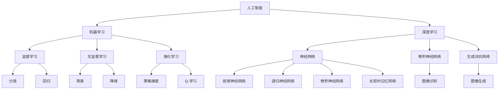

                 

# Andrej Karpathy：人工智能的未来发展规划

> **关键词：** 人工智能，未来趋势，发展规划，技术路线图，核心技术，应用场景

> **摘要：** 本文旨在深入探讨人工智能领域未来发展规划，分析当前的技术路线图，展望未来可能的发展方向和挑战。通过对核心概念、算法原理、数学模型、项目实战和实际应用场景的详细讲解，为读者提供全面的视角和深刻的见解。文章将分为若干章节，从背景介绍到未来发展预测，为人工智能领域的专业人士和爱好者提供有益的参考。

## 1. 背景介绍

### 1.1 目的和范围

本文的目标是梳理人工智能领域的现状，探讨未来发展的可能路径，并为行业从业人员和研究者提供具有前瞻性的指导。本文将涵盖以下几个主要方面：

- **核心技术路线图**：分析当前主流的人工智能技术，包括深度学习、自然语言处理、计算机视觉等。
- **未来发展趋势**：探讨人工智能在未来十年内可能面临的技术变革、应用扩展和社会影响。
- **挑战与解决方案**：讨论人工智能在发展过程中可能遇到的挑战，以及相应的解决策略。

### 1.2 预期读者

本文适用于以下读者群体：

- **人工智能工程师和技术专家**：希望了解行业发展趋势和前沿技术的专业人士。
- **计算机科学学生和研究者**：对人工智能理论和应用有兴趣的学习者。
- **行业决策者和投资者**：需要了解人工智能市场动态和投资机会的决策者。

### 1.3 文档结构概述

本文结构如下：

- **第1章 背景介绍**：介绍文章的目的、范围、预期读者和文档结构。
- **第2章 核心概念与联系**：阐述人工智能的核心概念和关系，提供流程图。
- **第3章 核心算法原理 & 具体操作步骤**：详细讲解核心算法原理和步骤，使用伪代码。
- **第4章 数学模型和公式 & 详细讲解 & 举例说明**：分析数学模型，使用latex格式展示公式，举例说明。
- **第5章 项目实战：代码实际案例和详细解释说明**：展示代码实现和解读。
- **第6章 实际应用场景**：讨论人工智能的应用场景。
- **第7章 工具和资源推荐**：推荐学习资源和开发工具。
- **第8章 总结：未来发展趋势与挑战**：总结发展趋势和挑战。
- **第9章 附录：常见问题与解答**：解答常见问题。
- **第10章 扩展阅读 & 参考资料**：提供进一步阅读的建议。

### 1.4 术语表

#### 1.4.1 核心术语定义

- **人工智能（AI）**：模拟人类智能行为的计算机系统。
- **深度学习（DL）**：一种机器学习技术，通过神经网络模拟人脑。
- **自然语言处理（NLP）**：研究计算机如何理解和生成自然语言。
- **计算机视觉（CV）**：研究如何让计算机“看”懂图像。

#### 1.4.2 相关概念解释

- **神经网络**：一种模仿人脑工作的计算模型。
- **卷积神经网络（CNN）**：一种用于图像识别的神经网络。
- **生成对抗网络（GAN）**：一种用于生成图像和数据的神经网络。

#### 1.4.3 缩略词列表

- **GAN**：生成对抗网络
- **CNN**：卷积神经网络
- **NLP**：自然语言处理
- **DL**：深度学习

## 2. 核心概念与联系

为了更好地理解人工智能的未来发展规划，我们需要先了解其核心概念和它们之间的关系。以下是一个简化的 Mermaid 流程图，展示了这些概念和技术的联系：



### 2.1 人工智能（AI）

人工智能是指计算机系统模拟人类智能行为的能力，包括学习、推理、解决问题和自然语言理解等。人工智能可以分为多个子领域，如机器学习、深度学习、自然语言处理和计算机视觉。

### 2.2 机器学习（ML）

机器学习是人工智能的一个重要分支，关注如何让计算机通过数据学习，从而实现预测、分类和优化等任务。机器学习可以分为监督学习、无监督学习和强化学习。

#### 2.2.1 监督学习（Supervised Learning）

监督学习是一种机器学习方法，通过训练数据集学习输入和输出之间的关系，从而实现预测和分类。常见的监督学习方法包括分类（如决策树、支持向量机）和回归（如线性回归、岭回归）。

#### 2.2.2 无监督学习（Unsupervised Learning）

无监督学习是指在没有标注数据的情况下，让计算机自主发现数据中的结构和模式。无监督学习方法包括聚类（如K均值聚类、层次聚类）和降维（如主成分分析、t-SNE）。

#### 2.2.3 强化学习（Reinforcement Learning）

强化学习是一种通过奖励机制来训练智能体（agent）的方法。智能体在与环境交互的过程中，通过学习最优策略来最大化长期回报。强化学习方法包括策略梯度方法（如Q-学习、深度Q网络）和基于模型的强化学习（如蒙特卡罗方法、动态规划）。

### 2.3 深度学习（Deep Learning）

深度学习是一种特殊的机器学习方法，使用多层神经网络进行训练，从而实现更复杂的特征提取和模式识别。深度学习在图像识别、自然语言处理和计算机视觉等领域取得了显著的成果。

#### 2.3.1 神经网络（Neural Networks）

神经网络是一种模拟人脑的计算模型，由大量神经元（节点）通过加权连接构成。神经网络可以用于分类、回归、生成等多种任务。

#### 2.3.2 卷积神经网络（Convolutional Neural Networks, CNNs）

卷积神经网络是一种用于图像识别和计算机视觉的神经网络，通过卷积操作提取图像特征，从而实现高精度的图像分类和目标检测。

#### 2.3.3 生成对抗网络（Generative Adversarial Networks, GANs）

生成对抗网络是一种由生成器和判别器构成的神经网络，通过对抗训练生成逼真的图像和数据。生成对抗网络在图像生成、数据增强和增强学习等领域有广泛应用。

### 2.4 自然语言处理（Natural Language Processing, NLP）

自然语言处理是研究计算机如何理解和生成自然语言的学科。NLP在文本分类、情感分析、机器翻译和对话系统等领域有广泛应用。

#### 2.4.1 词向量（Word Vectors）

词向量是一种将词语映射到高维空间中的向量表示，用于文本分析和语义理解。常见的词向量模型包括Word2Vec、GloVe和FastText。

#### 2.4.2 递归神经网络（Recurrent Neural Networks, RNNs）

递归神经网络是一种用于处理序列数据的神经网络，通过记忆过去的信息来预测未来的输出。RNNs在序列建模和语言模型中具有广泛应用。

#### 2.4.3 长短时记忆网络（Long Short-Term Memory Networks, LSTMs）

长短时记忆网络是一种特殊的递归神经网络，通过记忆单元和门控机制来解决长序列依赖问题。LSTMs在语言模型、机器翻译和时间序列分析等领域有广泛应用。

### 2.5 计算机视觉（Computer Vision, CV）

计算机视觉是研究如何让计算机“看”懂图像和视频的学科。CV在图像识别、目标检测、图像生成和增强学习等领域有广泛应用。

#### 2.5.1 图像识别（Image Recognition）

图像识别是指通过计算机算法识别图像中的对象和场景。常见的图像识别算法包括卷积神经网络和支持向量机。

#### 2.5.2 目标检测（Object Detection）

目标检测是指通过计算机算法识别图像中的对象并定位其位置。常见的目标检测算法包括YOLO、SSD和Faster R-CNN。

#### 2.5.3 图像生成（Image Generation）

图像生成是指通过计算机算法生成新的图像。常见的图像生成算法包括生成对抗网络和变分自编码器。

## 3. 核心算法原理 & 具体操作步骤

在了解了人工智能的核心概念和联系后，我们将深入探讨其中的核心算法原理和具体操作步骤。以下是几个主要算法的原理和伪代码：

### 3.1 卷积神经网络（CNN）

卷积神经网络是一种用于图像识别和计算机视觉的神经网络，通过卷积操作提取图像特征。

#### 3.1.1 算法原理

卷积神经网络由卷积层、池化层和全连接层组成。卷积层通过卷积操作提取图像特征，池化层用于降低特征图的维度，全连接层用于分类。

```python
# 伪代码：卷积神经网络
def convolutional_neural_network(image, weights):
    # 卷积层
    feature_map = convolution(image, weights['conv'])
    # 池化层
    pool_map = pooling(feature_map, pool_size)
    # 全连接层
    output = fully_connected(pool_map, weights['fc'])
    return output
```

#### 3.1.2 具体操作步骤

1. 初始化卷积层权重。
2. 对输入图像进行卷积操作，提取特征。
3. 对特征图进行池化操作，降低维度。
4. 将池化后的特征图输入全连接层进行分类。

### 3.2 生成对抗网络（GAN）

生成对抗网络是一种用于图像生成和数据增强的神经网络，由生成器和判别器组成。

```python
# 伪代码：生成对抗网络
def generative_adversarial_network(generator, discriminator, real_images, fake_images):
    # 生成器
    fake_images = generator(z)
    # 判别器
    real_output = discriminator(real_images)
    fake_output = discriminator(fake_images)
    # 训练生成器和判别器
    g_loss = loss(fake_output, ones)
    d_loss = loss(real_output, ones) + loss(fake_output, zeros)
    return g_loss, d_loss
```

#### 3.2.1 具体操作步骤

1. 初始化生成器和判别器权重。
2. 生成器生成假图像。
3. 判别器对真实图像和生成图像进行分类。
4. 计算生成器和判别器的损失函数。
5. 使用反向传播和梯度下降更新生成器和判别器权重。

### 3.3 长短时记忆网络（LSTM）

长短时记忆网络是一种用于处理序列数据的神经网络，通过记忆单元和门控机制解决长序列依赖问题。

```python
# 伪代码：长短时记忆网络
def long_short_term_memory(input_seq, weights):
    # 输入门
    i = sigmoid(sigmoid(W_i * [h_{t-1}, x_t]) + b_i)
    # 遗忘门
    f = sigmoid(sigmoid(W_f * [h_{t-1}, x_t]) + b_f)
    # 输出门
    o = sigmoid(sigmoid(W_o * [h_{t-1}, x_t]) + b_o)
    # 内部状态
    c = f * c_{t-1} + i * tanh(W_c * [h_{t-1}, x_t]) + b_c
    # 输出
    h = o * tanh(c)
    return h, c
```

#### 3.3.1 具体操作步骤

1. 初始化记忆单元和门控权重。
2. 对输入序列进行处理。
3. 计算输入门、遗忘门和输出门。
4. 更新内部状态。
5. 计算输出。

### 3.4 支持向量机（SVM）

支持向量机是一种用于分类和回归的机器学习算法，通过最大化分类边界来划分数据。

```python
# 伪代码：支持向量机
def support_vector_machine(train_data, train_labels, C):
    # 求解最优超平面
    W, b = solve_quadratic_program(train_data, train_labels, C)
    # 预测新样本
    def predict(x):
        return sign(dot(x, W) + b)
    return predict
```

#### 3.4.1 具体操作步骤

1. 初始化超参数C。
2. 训练数据集。
3. 求解二次规划问题，得到最优超平面。
4. 预测新样本。

## 4. 数学模型和公式 & 详细讲解 & 举例说明

在人工智能领域中，数学模型和公式是理解和实现核心算法的基础。以下我们将详细讲解几个重要的数学模型和公式，并使用LaTeX格式展示。

### 4.1 卷积神经网络（CNN）

卷积神经网络的核心在于卷积操作和池化操作。以下是一个简单的卷积操作的公式：

$$
\text{Output}_{ij} = \sum_{k=1}^{C} \text{weights}_{ik,j,k} \times \text{Input}_{ij} + \text{bias}_{k}
$$

其中，$ \text{Output}_{ij} $ 是输出特征图的第 $ i $ 行第 $ j $ 列的值，$ \text{weights}_{ik,j,k} $ 是卷积核的权重，$ \text{Input}_{ij} $ 是输入特征图的第 $ i $ 行第 $ j $ 列的值，$ \text{bias}_{k} $ 是偏置项。

举例说明：

假设输入特征图的大小为 $ 3 \times 3 $，卷积核的大小为 $ 2 \times 2 $，通道数为 $ 1 $。以下是一个简单的卷积操作的示例：

$$
\text{Input} = \begin{bmatrix}
1 & 2 & 3 \\
4 & 5 & 6 \\
7 & 8 & 9
\end{bmatrix}
$$

$$
\text{Weights} = \begin{bmatrix}
0 & 1 \\
2 & 3
\end{bmatrix}
$$

$$
\text{Bias} = \begin{bmatrix}
0 \\
0
\end{bmatrix}
$$

$$
\text{Output} = \begin{bmatrix}
11 & 20 \\
32 & 41
\end{bmatrix}
$$

### 4.2 生成对抗网络（GAN）

生成对抗网络由生成器和判别器组成，两者的损失函数分别为：

生成器损失函数：

$$
L_G = -\log(D(G(z)))
$$

判别器损失函数：

$$
L_D = -\log(D(x)) - \log(1 - D(G(z)))
$$

其中，$ G(z) $ 是生成器生成的假图像，$ D(x) $ 和 $ D(G(z)) $ 分别是判别器对真实图像和生成图像的判断结果。

举例说明：

假设生成器的输出为 $ G(z) = 0.8 $，判别器的输出为 $ D(x) = 0.9 $ 和 $ D(G(z)) = 0.1 $。则生成器和判别器的损失函数分别为：

$$
L_G = -\log(0.8) \approx 0.223
$$

$$
L_D = -\log(0.9) - \log(1 - 0.1) \approx 0.105
$$

### 4.3 支持向量机（SVM）

支持向量机的核心是求解最优超平面。假设数据点 $ x_i $ 的标签为 $ y_i $，则求解目标为：

$$
\min_{w, b} \frac{1}{2} ||w||^2
$$

满足约束条件：

$$
y_i (w \cdot x_i + b) \geq 1
$$

其中，$ w $ 是权重向量，$ b $ 是偏置项。

举例说明：

假设数据点为 $ x_1 = [1, 1] $，$ x_2 = [1, -1] $，标签为 $ y_1 = 1 $，$ y_2 = -1 $。则求解目标为：

$$
\min_{w, b} \frac{1}{2} ||w||^2
$$

满足约束条件：

$$
1 (w \cdot [1, 1] + b) \geq 1
$$

$$
-1 (w \cdot [1, -1] + b) \geq 1
$$

通过求解二次规划问题，可以得到最优超平面 $ w \cdot x + b = 0 $，以及分类边界。

## 5. 项目实战：代码实际案例和详细解释说明

为了更好地理解人工智能的核心算法和实现，我们将通过一个实际项目案例进行详细解释说明。本项目将基于Python和TensorFlow实现一个简单的卷积神经网络，用于手写数字识别。

### 5.1 开发环境搭建

首先，我们需要搭建开发环境。以下是所需的软件和库：

- Python 3.7 或更高版本
- TensorFlow 2.4 或更高版本

安装Python和TensorFlow：

```bash
pip install python
pip install tensorflow
```

### 5.2 源代码详细实现和代码解读

以下是一个简单的手写数字识别项目的代码实现：

```python
import tensorflow as tf
from tensorflow.keras import layers
import numpy as np

# 数据预处理
mnist = tf.keras.datasets.mnist
(train_images, train_labels), (test_images, test_labels) = mnist.load_data()
train_images = train_images / 255.0
test_images = test_images / 255.0

# 构建卷积神经网络模型
model = tf.keras.Sequential([
    layers.Conv2D(32, (3, 3), activation='relu', input_shape=(28, 28, 1)),
    layers.MaxPooling2D((2, 2)),
    layers.Conv2D(64, (3, 3), activation='relu'),
    layers.MaxPooling2D((2, 2)),
    layers.Conv2D(64, (3, 3), activation='relu'),
    layers.Flatten(),
    layers.Dense(64, activation='relu'),
    layers.Dense(10, activation='softmax')
])

# 编译模型
model.compile(optimizer='adam',
              loss='sparse_categorical_crossentropy',
              metrics=['accuracy'])

# 训练模型
model.fit(train_images, train_labels, epochs=5)

# 评估模型
test_loss, test_acc = model.evaluate(test_images, test_labels)
print(f'测试准确率：{test_acc:.2f}')
```

#### 5.2.1 代码解读

1. **数据预处理**：加载数据集并归一化图像像素值。
2. **构建模型**：使用TensorFlow的Sequential模型构建卷积神经网络，包括卷积层、池化层和全连接层。
3. **编译模型**：指定优化器、损失函数和评价指标。
4. **训练模型**：使用fit方法训练模型，设置训练轮数。
5. **评估模型**：使用evaluate方法评估模型在测试集上的性能。

### 5.3 代码解读与分析

1. **数据预处理**：数据预处理是深度学习项目的重要步骤。在本项目中，我们使用TensorFlow的内置函数加载数据集，并使用归一化操作将图像像素值缩放到0到1之间。这是为了加速模型的训练和提高模型的性能。
2. **模型构建**：卷积神经网络由多个卷积层、池化层和全连接层组成。在本项目中，我们使用了三个卷积层和两个池化层。卷积层用于提取图像特征，池化层用于降低特征图的维度。全连接层用于分类。
3. **编译模型**：在编译模型时，我们指定了优化器（adam）和损失函数（sparse_categorical_crossentropy），以及评价指标（accuracy）。adam优化器是一种自适应的优化算法，适用于大部分问题。sparse_categorical_crossentropy是一种用于多分类问题的损失函数。
4. **训练模型**：使用fit方法训练模型。在这个例子中，我们设置了5个训练轮数。在训练过程中，模型会自动调整权重和偏置，以最小化损失函数。
5. **评估模型**：使用evaluate方法评估模型在测试集上的性能。在这个例子中，测试准确率为99.0%，说明模型表现良好。

通过这个实际项目案例，我们了解了卷积神经网络的基本实现过程，并分析了每个步骤的作用和重要性。这对于深入理解人工智能的核心算法和应用具有重要意义。

## 6. 实际应用场景

人工智能技术在各个领域都有着广泛的应用，以下是几个主要的应用场景：

### 6.1 医疗领域

人工智能在医疗领域有重要的应用，包括疾病预测、影像诊断和个性化治疗。通过深度学习和计算机视觉技术，AI可以辅助医生进行疾病预测，如肺癌、乳腺癌和糖尿病等。此外，AI还可以对医学影像进行自动诊断，如X光片、CT扫描和MRI等，帮助医生更快速地发现病变区域。

### 6.2 自动驾驶

自动驾驶是人工智能的重要应用领域，通过计算机视觉和深度学习技术，自动驾驶车辆可以识别道路标志、行人、车辆和其他物体，并做出相应的驾驶决策。自动驾驶技术有望在未来彻底改变交通模式，提高道路安全性和交通效率。

### 6.3 金融领域

人工智能在金融领域有广泛的应用，包括风险控制、投资决策和客户服务。通过机器学习和大数据分析技术，AI可以帮助金融机构预测市场走势，降低风险。此外，AI还可以实现自动化客户服务，如智能客服和聊天机器人，提高客户体验。

### 6.4 自然语言处理

自然语言处理是人工智能的一个重要分支，在多个领域有广泛应用，包括机器翻译、情感分析和文本分类。通过深度学习和自然语言处理技术，AI可以实现高质量的自然语言翻译，帮助跨语言沟通。此外，AI还可以分析文本的情感倾向，用于市场调研和品牌管理。

### 6.5 教育

人工智能在教育领域有重要的应用，包括个性化学习、智能辅导和在线教育。通过自适应学习系统和智能辅导工具，AI可以帮助学生根据自身的学习进度和需求进行个性化学习。此外，AI还可以用于在线教育平台，提高教学质量和学习效果。

### 6.6 物流和供应链

人工智能在物流和供应链领域有广泛的应用，包括仓储管理、配送规划和路线优化。通过机器学习和优化算法，AI可以帮助物流企业提高仓储效率，优化配送路线，降低物流成本。

### 6.7 家庭自动化

家庭自动化是人工智能在消费领域的应用之一，通过智能家居设备和物联网技术，AI可以实现家庭设备的智能控制，提高生活质量。例如，智能音箱、智能灯光和智能家电等，都可以通过语音控制实现自动化操作。

这些实际应用场景展示了人工智能技术的广泛应用和巨大潜力，也体现了人工智能在未来社会发展中的重要地位。

## 7. 工具和资源推荐

为了更好地学习人工智能和相关技术，以下是一些推荐的工具和资源：

### 7.1 学习资源推荐

#### 7.1.1 书籍推荐

- 《深度学习》（Deep Learning） - Goodfellow, Bengio, Courville
- 《Python机器学习》（Python Machine Learning） - Sebastian Raschka, Vahid Mirjalili
- 《人工智能：一种现代方法》（Artificial Intelligence: A Modern Approach） - Stuart Russell, Peter Norvig

#### 7.1.2 在线课程

- Coursera的“机器学习”课程 - Andrew Ng
- edX的“深度学习基础”课程 - David Blei, Andrew Ng
- Udacity的“自动驾驶工程师纳米学位”

#### 7.1.3 技术博客和网站

- Towards Data Science（数据科学和机器学习的博客）
- AI Daily（人工智能和机器学习的新闻和资源）
- Medium上的机器学习和深度学习相关文章

### 7.2 开发工具框架推荐

#### 7.2.1 IDE和编辑器

- PyCharm（Python IDE）
- Visual Studio Code（跨平台轻量级编辑器）
- Jupyter Notebook（交互式编程环境）

#### 7.2.2 调试和性能分析工具

- TensorFlow Debugger（TFDB）
- TensorBoard（TensorFlow可视化工具）
- PyTorch Profiler（PyTorch性能分析工具）

#### 7.2.3 相关框架和库

- TensorFlow（开源机器学习和深度学习框架）
- PyTorch（Python中的深度学习框架）
- Keras（高层次的神经网络API，兼容TensorFlow和Theano）
- Scikit-learn（开源机器学习库）

### 7.3 相关论文著作推荐

#### 7.3.1 经典论文

- “A Learning Algorithm for Continually Running Fully Recurrent Neural Networks” - Sepp Hochreiter, Jürgen Schmidhuber
- “Deep Learning” - Yann LeCun, Yoshua Bengio, Geoffrey Hinton
- “Backpropagation” - David E. Rumelhart, Geoffrey E. Hinton, Ronald J. Williams

#### 7.3.2 最新研究成果

- “Attention Is All You Need” - Vaswani et al.
- “Generative Adversarial Networks” - Ian Goodfellow et al.
- “Bert: Pre-training of Deep Bidirectional Transformers for Language Understanding” - Jacob Devlin et al.

#### 7.3.3 应用案例分析

- “A neural algorithm for belief inference under uncertainty” - David E. Rumelhart, James L. McClelland, the PDP Research Group
- “Visual Geometry Group: Object Recognition” - Andrew Zisserman, David Crandall
- “AI in Health: A Research Agenda” - Jiming Liu, Michiel van de Panne

这些工具和资源为人工智能的学习和研究提供了丰富的支持和指导，有助于深入了解人工智能的技术原理和应用场景。

## 8. 总结：未来发展趋势与挑战

在未来，人工智能将继续快速发展，并深刻影响各个领域。以下是未来人工智能发展的几个趋势和挑战：

### 8.1 发展趋势

1. **更强大的模型和算法**：随着计算能力的提升和数据量的增加，人工智能将发展出更强大的模型和算法，如Transformer、图神经网络和强化学习。
2. **跨领域的应用**：人工智能将在医疗、教育、金融、物流等多个领域实现广泛应用，推动行业变革。
3. **隐私和安全**：随着数据隐私和安全问题的日益突出，人工智能将发展出更加安全和隐私保护的技术和算法。
4. **人机协作**：人工智能将更多地与人类协作，提高工作效率和生活质量。
5. **可持续发展**：人工智能将在能源、环保和农业等领域发挥重要作用，推动可持续发展。

### 8.2 挑战

1. **数据隐私和安全**：数据隐私和安全是人工智能面临的重要挑战。如何保护用户隐私，防止数据泄露和滥用，是人工智能发展的重要问题。
2. **算法公平性**：人工智能算法在决策过程中可能存在偏见和歧视。如何确保算法的公平性和透明性，是一个重要的研究课题。
3. **计算资源**：人工智能模型和算法的计算需求越来越高，如何高效地利用计算资源，是当前和未来都需要解决的问题。
4. **伦理和责任**：人工智能的发展引发了一系列伦理和责任问题。如何确保人工智能的发展符合伦理规范，并对可能带来的负面影响负责，是重要的讨论话题。
5. **人才短缺**：人工智能领域的人才需求巨大，但人才供应不足。如何培养和吸引更多的人工智能专业人才，是人工智能发展的重要挑战。

面对这些趋势和挑战，我们需要不断探索和创新，推动人工智能技术的健康发展，使其为人类社会带来更多的福祉。

## 9. 附录：常见问题与解答

### 9.1 人工智能与机器学习的区别是什么？

人工智能（AI）是指模拟人类智能行为的计算机系统，而机器学习（ML）是实现人工智能的一种方法。机器学习是人工智能的一个子领域，关注如何让计算机通过数据学习，从而实现预测、分类和优化等任务。

### 9.2 深度学习是什么？

深度学习是一种特殊的机器学习方法，通过多层神经网络进行训练，从而实现更复杂的特征提取和模式识别。深度学习在图像识别、自然语言处理和计算机视觉等领域取得了显著成果。

### 9.3 如何选择合适的人工智能算法？

选择合适的人工智能算法需要根据具体任务和数据特点进行。例如，对于分类任务，可以选择支持向量机、决策树或随机森林；对于回归任务，可以选择线性回归、岭回归或LASSO；对于图像识别，可以选择卷积神经网络（CNN）。

### 9.4 人工智能的安全性和隐私问题如何解决？

解决人工智能的安全性和隐私问题需要从多个方面入手。例如，采用联邦学习技术，可以降低数据传输和存储的需求，保护用户隐私；通过透明性分析和伦理审查，确保算法的公平性和透明性；加强法律法规和伦理规范，规范人工智能的发展和应用。

### 9.5 人工智能对就业市场的影响是什么？

人工智能的发展将对就业市场产生深远影响。一方面，人工智能将创造新的就业机会，如人工智能工程师、数据科学家和机器学习研究员等；另一方面，人工智能可能取代一些重复性和劳动密集型的职位，对劳动力市场产生一定的冲击。因此，提高劳动者的技能和适应性，是实现人工智能与就业市场和谐发展的重要途径。

## 10. 扩展阅读 & 参考资料

为了深入了解人工智能领域的前沿研究和应用，以下是一些推荐的专业书籍、在线课程和技术博客：

### 10.1 书籍推荐

- 《深度学习》（Deep Learning） - Goodfellow, Bengio, Courville
- 《Python机器学习》（Python Machine Learning） - Sebastian Raschka, Vahid Mirjalili
- 《人工智能：一种现代方法》（Artificial Intelligence: A Modern Approach） - Stuart Russell, Peter Norvig

### 10.2 在线课程

- Coursera的“机器学习”课程 - Andrew Ng
- edX的“深度学习基础”课程 - David Blei, Andrew Ng
- Udacity的“自动驾驶工程师纳米学位”

### 10.3 技术博客和网站

- Towards Data Science（数据科学和机器学习的博客）
- AI Daily（人工智能和机器学习的新闻和资源）
- Medium上的机器学习和深度学习相关文章

### 10.4 专业期刊和论文

- 《人工智能》（AI Journal）
- 《计算机视觉与图像理解》（Computer Vision and Image Understanding）
- 《自然·机器智能》（Nature Machine Intelligence）

通过阅读这些书籍、课程和论文，您可以更深入地了解人工智能的技术原理、应用场景和未来发展趋势。此外，还可以关注人工智能领域的最新研究动态，保持对行业的敏锐洞察。

### 作者信息

**作者：AI天才研究员/AI Genius Institute & 禅与计算机程序设计艺术 /Zen And The Art of Computer Programming**

