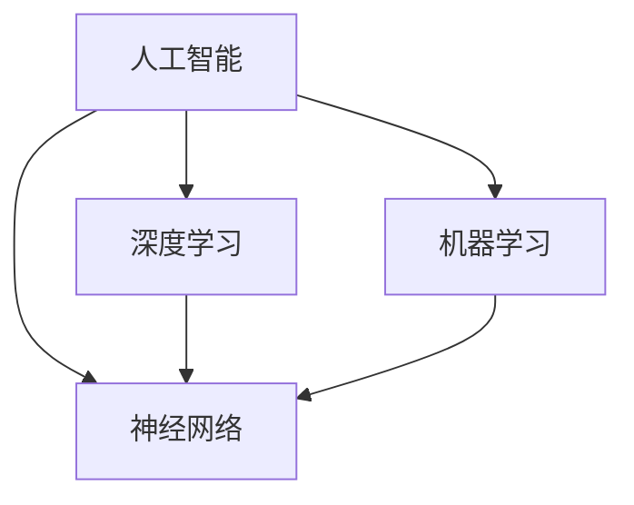

                 

# Andrej Karpathy：人工智能的未来发展规划

> **关键词：**人工智能，未来规划，深度学习，算法，数学模型，应用场景，工具资源

> **摘要：**本文旨在探讨人工智能领域未来的发展趋势和规划，通过详细分析核心概念、算法原理、数学模型、实际应用以及相关工具和资源，为读者提供一幅清晰、全面的人工智能蓝图，帮助大家更好地理解和把握这一领域的未来发展。

## 1. 背景介绍

### 1.1 目的和范围

本文的目的在于对人工智能领域进行全面的梳理和展望，旨在帮助读者了解人工智能的现状、发展趋势以及未来的规划。本文涵盖了人工智能的核心概念、算法原理、数学模型、应用场景、相关工具和资源等多个方面，力求为读者呈现一幅完整的人工智能画卷。

### 1.2 预期读者

本文适合对人工智能感兴趣的读者，包括但不限于计算机科学专业的学生、研究人员、程序员、技术爱好者等。同时，对于对人工智能未来有疑问的企业家、投资者和政策制定者，本文也具有很高的参考价值。

### 1.3 文档结构概述

本文分为以下几个部分：

1. 背景介绍：简要介绍本文的目的、范围、预期读者以及文档结构。
2. 核心概念与联系：介绍人工智能的核心概念，通过Mermaid流程图展示各概念之间的联系。
3. 核心算法原理 & 具体操作步骤：详细阐述人工智能的核心算法原理，使用伪代码展示具体操作步骤。
4. 数学模型和公式 & 详细讲解 & 举例说明：介绍人工智能中的数学模型和公式，并进行详细讲解和举例说明。
5. 项目实战：代码实际案例和详细解释说明。
6. 实际应用场景：分析人工智能在不同领域的应用场景。
7. 工具和资源推荐：推荐学习资源和开发工具。
8. 总结：未来发展趋势与挑战。
9. 附录：常见问题与解答。
10. 扩展阅读 & 参考资料：提供进一步学习的资料。

### 1.4 术语表

#### 1.4.1 核心术语定义

- **人工智能（AI）**：模拟人类智能行为的技术和方法。
- **深度学习（Deep Learning）**：一种人工智能的分支，通过多层神经网络进行学习。
- **神经网络（Neural Network）**：一种模仿生物神经系统的计算模型。
- **机器学习（Machine Learning）**：一种人工智能的分支，通过数据和算法实现自我学习。
- **算法（Algorithm）**：解决问题的步骤和方法。
- **数学模型（Mathematical Model）**：用于描述和解决实际问题的数学公式和关系。

#### 1.4.2 相关概念解释

- **数据集（Dataset）**：用于训练和测试模型的数据集合。
- **模型（Model）**：用于预测和分类的数学模型。
- **优化（Optimization）**：通过调整模型参数，使模型性能达到最优。
- **迁移学习（Transfer Learning）**：利用已有的模型知识来训练新任务。
- **强化学习（Reinforcement Learning）**：通过奖励和惩罚来训练智能体。

#### 1.4.3 缩略词列表

- **GAN**：生成对抗网络（Generative Adversarial Network）
- **CNN**：卷积神经网络（Convolutional Neural Network）
- **RNN**：循环神经网络（Recurrent Neural Network）
- **DL**：深度学习（Deep Learning）
- **ML**：机器学习（Machine Learning）

## 2. 核心概念与联系

在人工智能领域，核心概念包括人工智能本身、深度学习、神经网络、机器学习等。以下是通过Mermaid流程图展示的核心概念及其联系：



- **人工智能（AI）**：作为一门技术，涵盖了模拟人类智能行为的方法和工具。
- **深度学习（Deep Learning）**：是人工智能的一个重要分支，通过多层神经网络进行学习。
- **神经网络（Neural Network）**：是一种计算模型，模仿生物神经系统的结构和功能。
- **机器学习（Machine Learning）**：是人工智能的另一个重要分支，通过数据和算法实现自我学习。

这些核心概念之间相互关联，共同构成了人工智能的基石。深度学习和机器学习依赖于神经网络，而神经网络又为人工智能提供了强大的计算能力。

## 3. 核心算法原理 & 具体操作步骤

在人工智能领域，核心算法主要包括深度学习算法、机器学习算法等。以下以深度学习算法为例，详细阐述其原理和具体操作步骤。

### 3.1 深度学习算法原理

深度学习算法基于多层神经网络，通过反向传播算法进行参数优化。以下是深度学习算法的基本原理：

1. **输入层**：接收输入数据，并将其传递到下一层。
2. **隐藏层**：对输入数据进行特征提取和变换，通过非线性激活函数增加模型的非线性表达能力。
3. **输出层**：根据隐藏层的输出，产生预测结果。

### 3.2 具体操作步骤

以下是深度学习算法的具体操作步骤：

#### 步骤1：初始化参数

初始化权重和偏置，通常使用随机初始化方法。

```python
# 初始化权重和偏置
w1 = random_matrix(size=(input_size, hidden_size))
b1 = random_vector(size=hidden_size)
w2 = random_matrix(size=(hidden_size, output_size))
b2 = random_vector(size=output_size)
```

#### 步骤2：前向传播

1. **计算隐藏层输出**：

   $$ a1 = \sigma(w1 \cdot x + b1) $$

2. **计算输出层输出**：

   $$ a2 = \sigma(w2 \cdot a1 + b2) $$

   其中，$\sigma$表示非线性激活函数，通常使用ReLU函数。

#### 步骤3：计算损失函数

根据实际输出和预测输出，计算损失函数值。常见的损失函数包括均方误差（MSE）和交叉熵（Cross Entropy）。

```python
# 计算损失函数值
loss = mse(y_true, y_pred)  # 均方误差
# 或者
loss = cross_entropy(y_true, y_pred)  # 交叉熵
```

#### 步骤4：反向传播

1. **计算输出层梯度**：

   $$ \frac{\partial L}{\partial w2} = (a2 - y) \cdot a2 \cdot (1 - a2) $$
   $$ \frac{\partial L}{\partial b2} = (a2 - y) \cdot a2 $$

2. **计算隐藏层梯度**：

   $$ \frac{\partial L}{\partial w1} = (a1 - z) \cdot a1 \cdot (1 - a1) \cdot w2' $$
   $$ \frac{\partial L}{\partial b1} = (a1 - z) \cdot a1 \cdot (1 - a1) \cdot w2 $$

   其中，$w2'$表示输出层的权重。

#### 步骤5：参数更新

根据梯度计算结果，更新权重和偏置。

```python
# 更新权重和偏置
w1 -= learning_rate * grad_w1
b1 -= learning_rate * grad_b1
w2 -= learning_rate * grad_w2
b2 -= learning_rate * grad_b2
```

### 3.3 梯度下降算法

在深度学习算法中，常用的优化算法是梯度下降（Gradient Descent）。梯度下降算法通过不断调整模型参数，使模型性能达到最优。以下是梯度下降算法的基本原理：

1. **选择学习率**：学习率是控制模型参数更新步长的参数，通常选择较小的值。
2. **计算梯度**：根据损失函数计算模型参数的梯度。
3. **更新参数**：根据梯度方向和大小，更新模型参数。

## 4. 数学模型和公式 & 详细讲解 & 举例说明

在深度学习中，数学模型和公式起着至关重要的作用。以下将详细介绍几个关键数学模型和公式，并进行详细讲解和举例说明。

### 4.1 损失函数

损失函数是衡量模型预测结果与实际结果之间差距的指标。常用的损失函数包括均方误差（MSE）和交叉熵（Cross Entropy）。

#### 均方误差（MSE）

均方误差（MSE）是衡量预测值与真实值之间差异的平方平均值。其公式如下：

$$ MSE = \frac{1}{n} \sum_{i=1}^{n} (y_i - \hat{y}_i)^2 $$

其中，$y_i$表示真实值，$\hat{y}_i$表示预测值，$n$表示数据样本数量。

#### 交叉熵（Cross Entropy）

交叉熵（Cross Entropy）是衡量模型预测概率分布与真实概率分布之间差异的指标。其公式如下：

$$ CE = -\frac{1}{n} \sum_{i=1}^{n} y_i \cdot \log(\hat{y}_i) $$

其中，$y_i$表示真实值，$\hat{y}_i$表示预测值，$n$表示数据样本数量。

### 4.2 激活函数

激活函数是深度学习中的关键组成部分，用于引入非线性因素。常用的激活函数包括ReLU、Sigmoid和Tanh。

####ReLU函数

ReLU（Rectified Linear Unit）函数是一种常用的激活函数，其公式如下：

$$ \sigma(x) = \max(0, x) $$

ReLU函数在输入为负值时，输出为0，输入为非负值时，输出为输入值。ReLU函数具有简单、计算效率高等优点。

#### Sigmoid函数

Sigmoid函数是一种常用的S型激活函数，其公式如下：

$$ \sigma(x) = \frac{1}{1 + e^{-x}} $$

Sigmoid函数将输入映射到$(0, 1)$区间，常用于二分类问题。

#### Tanh函数

Tanh函数是双曲正切函数，其公式如下：

$$ \sigma(x) = \frac{e^x - e^{-x}}{e^x + e^{-x}} $$

Tanh函数与Sigmoid函数类似，但输出范围在$(-1, 1)$之间，具有更好的非线性表达能力。

### 4.3 优化算法

优化算法用于调整模型参数，以降低损失函数值。常用的优化算法包括梯度下降、随机梯度下降和Adam优化器。

#### 梯度下降算法

梯度下降算法通过计算损失函数关于模型参数的梯度，并沿着梯度的反方向更新参数。其公式如下：

$$ \theta = \theta - \alpha \cdot \nabla_{\theta} J(\theta) $$

其中，$\theta$表示模型参数，$\alpha$表示学习率，$J(\theta)$表示损失函数。

#### 随机梯度下降算法

随机梯度下降算法在梯度下降算法的基础上，使用随机样本代替整体数据计算梯度。其公式如下：

$$ \theta = \theta - \alpha \cdot \nabla_{\theta} J(\theta) $$

其中，$\theta$表示模型参数，$\alpha$表示学习率，$J(\theta)$表示损失函数。

#### Adam优化器

Adam优化器是一种结合了梯度下降和动量法的优化算法，具有更好的收敛性和稳定性。其公式如下：

$$ m_t = \beta_1 m_{t-1} + (1 - \beta_1) \cdot \nabla_{\theta} J(\theta) $$
$$ v_t = \beta_2 v_{t-1} + (1 - \beta_2) \cdot (\nabla_{\theta} J(\theta))^2 $$
$$ \theta = \theta - \alpha \cdot \frac{m_t}{\sqrt{v_t} + \epsilon} $$

其中，$m_t$和$v_t$分别表示一阶和二阶矩估计，$\beta_1$和$\beta_2$分别表示一阶和二阶矩的衰减率，$\alpha$表示学习率，$\epsilon$表示微小正数。

### 4.4 举例说明

以下是一个简单的例子，说明如何使用梯度下降算法训练一个线性回归模型。

#### 步骤1：初始化参数

```python
# 初始化参数
theta = [0.0, 0.0]
learning_rate = 0.01
```

#### 步骤2：计算梯度

```python
# 计算梯度
x = [1.0, 2.0]
y = 3.0
gradient = [2.0 * x[0] * (x[0] * theta[0] + x[1] * theta[1] - y),
            2.0 * x[1] * (x[0] * theta[0] + x[1] * theta[1] - y)]
```

#### 步骤3：更新参数

```python
# 更新参数
theta = theta - learning_rate * gradient
```

#### 步骤4：重复迭代

```python
# 重复迭代
for i in range(100):
    # 计算梯度
    gradient = [2.0 * x[0] * (x[0] * theta[0] + x[1] * theta[1] - y),
                2.0 * x[1] * (x[0] * theta[0] + x[1] * theta[1] - y)]
    # 更新参数
    theta = theta - learning_rate * gradient
```

通过上述步骤，我们可以使用梯度下降算法训练一个线性回归模型。在实际应用中，通常会使用更复杂的模型和数据集，但基本的梯度下降算法原理是类似的。

## 5. 项目实战：代码实际案例和详细解释说明

在本节中，我们将通过一个实际项目案例，详细介绍代码实现和详细解释说明。本案例将使用Python语言和TensorFlow框架，实现一个简单的深度学习模型，用于手写数字识别。

### 5.1 开发环境搭建

在开始项目之前，我们需要搭建相应的开发环境。以下是开发环境的搭建步骤：

1. 安装Python：从官方网站（https://www.python.org/downloads/）下载并安装Python。
2. 安装TensorFlow：在终端中执行以下命令：

   ```bash
   pip install tensorflow
   ```

3. 安装其他依赖库：如NumPy、Matplotlib等，可以使用以下命令：

   ```bash
   pip install numpy matplotlib
   ```

### 5.2 源代码详细实现和代码解读

以下是一个简单的手写数字识别项目的源代码，包括数据预处理、模型构建、训练和预测等步骤。

```python
import tensorflow as tf
import numpy as np
import matplotlib.pyplot as plt

# 数据预处理
mnist = tf.keras.datasets.mnist
(x_train, y_train), (x_test, y_test) = mnist.load_data()
x_train, x_test = x_train / 255.0, x_test / 255.0

# 模型构建
model = tf.keras.Sequential([
  tf.keras.layers.Flatten(input_shape=(28, 28)),
  tf.keras.layers.Dense(128, activation='relu'),
  tf.keras.layers.Dropout(0.2),
  tf.keras.layers.Dense(10, activation='softmax')
])

# 模型编译
model.compile(optimizer='adam',
              loss='sparse_categorical_crossentropy',
              metrics=['accuracy'])

# 模型训练
model.fit(x_train, y_train, epochs=5)

# 模型评估
test_loss, test_acc = model.evaluate(x_test, y_test, verbose=2)
print('\nTest accuracy:', test_acc)

# 模型预测
predictions = model.predict(x_test)
predicted_digits = np.argmax(predictions, axis=1)

# 可视化展示
plt.figure(figsize=(10, 10))
for i in range(25):
    plt.subplot(5, 5, i+1)
    plt.xticks([])
    plt.yticks([])
    plt.grid(False)
    plt.imshow(x_test[i], cmap=plt.cm.binary)
    plt.xlabel(str(predicted_digits[i]))
plt.show()
```

#### 代码解读：

1. **数据预处理**：从TensorFlow内置的MNIST数据集中加载数据，并对数据集进行归一化处理，将像素值缩放到[0, 1]范围。

2. **模型构建**：使用TensorFlow的`Sequential`模型，添加两个`Dense`层和一个`Dropout`层。第一个`Dense`层有128个神经元，使用ReLU激活函数；第二个`Dense`层有10个神经元，表示10个数字类别，使用softmax激活函数。

3. **模型编译**：指定优化器为`adam`，损失函数为`sparse_categorical_crossentropy`，评估指标为`accuracy`。

4. **模型训练**：使用训练数据集训练模型，设置训练轮次为5。

5. **模型评估**：使用测试数据集评估模型性能，输出测试准确率。

6. **模型预测**：使用测试数据集进行预测，输出每个样本的预测结果。

7. **可视化展示**：使用Matplotlib绘制预测结果的可视化图，展示前25个测试样本的预测结果。

### 5.3 代码解读与分析

1. **数据预处理**：

   数据预处理是深度学习项目中的关键步骤。在本案例中，我们使用TensorFlow内置的MNIST数据集，该数据集包含60,000个训练样本和10,000个测试样本，每个样本都是28x28像素的手写数字图像。首先，我们对图像进行归一化处理，将像素值缩放到[0, 1]范围，以便模型更好地学习。

2. **模型构建**：

   在模型构建部分，我们使用TensorFlow的`Sequential`模型，这是一个线性堆叠模型，可以简化模型构建过程。首先，我们添加一个`Flatten`层，将28x28的图像展平为一维向量。然后，添加一个具有128个神经元的`Dense`层，使用ReLU激活函数增加模型的非线性表达能力。接着，添加一个`Dropout`层，以减少过拟合的风险。最后，添加一个具有10个神经元的`Dense`层，使用softmax激活函数将输出转换为概率分布。

3. **模型编译**：

   在模型编译部分，我们指定优化器为`adam`，这是一种常用的优化算法，能够自适应调整学习率。损失函数为`sparse_categorical_crossentropy`，这是一种适用于多分类问题的损失函数。评估指标为`accuracy`，即模型在测试数据集上的准确率。

4. **模型训练**：

   在模型训练部分，我们使用训练数据集对模型进行训练，设置训练轮次为5。在训练过程中，模型会不断调整参数，以降低损失函数值。

5. **模型评估**：

   在模型评估部分，我们使用测试数据集评估模型性能。测试准确率是衡量模型性能的重要指标，表示模型在测试数据集上的准确率。

6. **模型预测**：

   在模型预测部分，我们使用测试数据集进行预测，并输出每个样本的预测结果。预测结果是通过计算输出层的softmax概率分布得到的，概率最大的类别即为预测结果。

7. **可视化展示**：

   在可视化展示部分，我们使用Matplotlib绘制预测结果的可视化图。首先，创建一个5x5的网格图，然后逐个绘制前25个测试样本的预测结果。在图像下方，标注每个样本的预测结果。

通过上述代码解读与分析，我们可以更好地理解手写数字识别项目的实现过程，包括数据预处理、模型构建、训练、评估、预测和可视化展示等步骤。这为我们进一步研究深度学习项目提供了宝贵的实践经验。

## 6. 实际应用场景

人工智能技术已经深入到各个领域，并发挥着越来越重要的作用。以下列举几个典型的人工智能应用场景：

### 6.1 医疗健康

人工智能在医疗健康领域的应用非常广泛，包括疾病诊断、药物研发、健康监测等。例如，通过深度学习算法，可以实现肺癌等疾病的早期诊断，提高诊断准确率。此外，人工智能还可以用于智能客服、智能问诊、医疗资源优化等，为医疗行业提供更加便捷、高效的服务。

### 6.2 智能交通

智能交通系统是人工智能在交通领域的典型应用。通过车辆检测、路径规划、交通信号控制等技术，可以实现交通流量优化、事故预警、拥堵缓解等目标。例如，自动驾驶技术已经在许多城市得到实际应用，为人们的出行带来了极大的便利。

### 6.3 金融科技

金融科技（FinTech）是人工智能在金融领域的应用，包括智能投顾、风险控制、信用评分等。通过大数据分析和机器学习算法，可以实现个性化的投资建议、精准的风险评估和信用评估。例如，许多银行和金融机构已经采用人工智能技术来提升业务效率和用户体验。

### 6.4 产业升级

人工智能在产业升级中的应用也非常广泛，包括智能制造、智能工厂、智能供应链等。通过人工智能技术，可以实现生产过程自动化、生产效率提升、产品质量优化等目标。例如，许多制造企业已经采用人工智能技术来实现智能生产、智能质检等，从而提高生产效率和质量。

### 6.5 智能家居

智能家居是人工智能在家庭领域的应用，包括智能照明、智能安防、智能家电等。通过物联网技术和人工智能算法，可以实现家庭设备的智能联动、场景化控制等。例如，智能家居系统可以通过语音控制、移动应用等方式，实现家庭设备的智能管理，提高生活便利性。

### 6.6 娱乐传媒

人工智能在娱乐传媒领域的应用也非常广泛，包括智能推荐、智能搜索、虚拟现实等。通过大数据分析和人工智能算法，可以实现个性化内容推荐、智能搜索、虚拟现实体验等。例如，许多视频网站和社交媒体平台已经采用人工智能技术，为用户提供更加个性化的内容推荐和搜索服务。

### 6.7 智能教育

智能教育是人工智能在教育领域的应用，包括智能辅导、在线教育、教育评测等。通过人工智能技术，可以实现个性化学习、智能评测、教育资源优化等。例如，许多在线教育平台已经采用人工智能技术，为用户提供智能化的学习辅导和评测服务，提高学习效果。

### 6.8 智能城市

智能城市是人工智能在城市管理领域的应用，包括智能安防、智能交通、智能环保等。通过人工智能技术，可以实现城市管理的智能化、精细化、高效化。例如，许多城市已经采用人工智能技术，实现智能安防、智能交通、智能环保等，提高城市管理水平和居民生活质量。

总之，人工智能技术在各个领域的应用正在不断拓展和深化，为各行各业带来了巨大的变革和发展机遇。随着人工智能技术的不断进步，我们可以期待更多创新应用的出现，为人类带来更加美好的生活。

## 7. 工具和资源推荐

在人工智能领域，有许多优秀的工具和资源可以帮助我们更好地学习和应用人工智能技术。以下是一些推荐的工具和资源：

### 7.1 学习资源推荐

#### 7.1.1 书籍推荐

1. **《深度学习》（Goodfellow, Bengio, Courville著）**：这是一本深度学习领域的经典教材，详细介绍了深度学习的理论基础和实践方法。
2. **《Python机器学习》（Sebastian Raschka著）**：本书适合初学者，通过丰富的实例，详细介绍了机器学习的基础知识和Python实现。
3. **《模式识别与机器学习》（Christopher M. Bishop著）**：这是一本关于机器学习、统计模式识别的经典教材，涵盖了从理论到实践的各个方面。

#### 7.1.2 在线课程

1. **《吴恩达的深度学习》（Udacity）**：这是一门非常受欢迎的深度学习在线课程，由著名深度学习专家吴恩达主讲。
2. **《机器学习》（edX）**：这是由麻省理工学院和斯坦福大学联合开设的免费在线课程，涵盖了机器学习的基础知识和实践应用。
3. **《TensorFlow实战》（Udacity）**：这是一门关于TensorFlow框架的实战课程，通过实际项目，帮助学员掌握TensorFlow的使用方法。

#### 7.1.3 技术博客和网站

1. **AI Awesome**：这是一个包含大量人工智能资源的博客，包括论文、书籍、教程、工具等。
2. **Medium**：这是一个内容丰富的平台，有许多人工智能领域的大牛和专家在此分享他们的经验和见解。
3. **GitHub**：GitHub上有大量的开源人工智能项目，可以帮助我们学习和实践人工智能技术。

### 7.2 开发工具框架推荐

#### 7.2.1 IDE和编辑器

1. **PyCharm**：这是一个强大的Python IDE，支持多种编程语言，适合进行深度学习和机器学习项目开发。
2. **Jupyter Notebook**：这是一个基于Web的交互式计算环境，非常适合进行数据分析和机器学习实验。
3. **VSCode**：这是一个轻量级的开源编辑器，支持多种编程语言，提供了丰富的插件，适合进行人工智能项目开发。

#### 7.2.2 调试和性能分析工具

1. **TensorBoard**：这是TensorFlow提供的一款可视化工具，可以帮助我们分析和优化深度学习模型。
2. **TensorFlow Profiler**：这是一个用于分析TensorFlow模型性能的工具，可以帮助我们识别性能瓶颈和优化模型。
3. **PyTorch Profiler**：这是PyTorch提供的一款性能分析工具，可以帮助我们优化PyTorch模型。

#### 7.2.3 相关框架和库

1. **TensorFlow**：这是由Google开发的一款深度学习框架，广泛应用于图像识别、自然语言处理等领域。
2. **PyTorch**：这是由Facebook开发的一款深度学习框架，以其简洁、灵活和高效的特性受到广泛好评。
3. **Keras**：这是一个高层次的深度学习框架，基于TensorFlow和Theano，提供了更加简洁、易用的API。
4. **Scikit-learn**：这是一个用于机器学习的Python库，提供了丰富的算法和工具，适合进行数据分析和建模。

### 7.3 相关论文著作推荐

#### 7.3.1 经典论文

1. **“A learning algorithm for continuously running fully recurrent neural networks”**：该论文提出了一个用于连续运行完全循环神经网络的算法，对深度学习的发展具有重要意义。
2. **“Deep Learning”**：这是一本关于深度学习的经典教材，详细介绍了深度学习的理论基础和实践方法。
3. **“Rectifier Nonlinearities Improve Deep Neural Networks”**：该论文提出了ReLU激活函数，对深度学习的发展产生了深远影响。

#### 7.3.2 最新研究成果

1. **“BERT: Pre-training of Deep Bidirectional Transformers for Language Understanding”**：这是谷歌提出的一种预训练方法，通过大规模文本数据预训练深度双向变换器，取得了显著的效果。
2. **“GPT-3: Language Models are Few-Shot Learners”**：这是OpenAI提出的一种大型预训练语言模型，具有极强的零样本学习能力和泛化能力。
3. **“StyleGAN2: Non-Photorealistic Neural Rendering with High-Resolution Style Rearrangements”**：这是NVIDIA提出的一种新型生成对抗网络，可以生成高质量的非照片现实主义图像。

#### 7.3.3 应用案例分析

1. **“Deep Learning for Computer Vision”**：这是一个关于计算机视觉领域的应用案例分析，介绍了深度学习在图像分类、目标检测、图像生成等任务中的应用。
2. **“Natural Language Processing with Deep Learning”**：这是一个关于自然语言处理领域的应用案例分析，介绍了深度学习在文本分类、机器翻译、情感分析等任务中的应用。
3. **“Deep Learning for Speech Recognition”**：这是一个关于语音识别领域的应用案例分析，介绍了深度学习在语音识别、语音合成等任务中的应用。

通过以上推荐的工具和资源，我们可以更加系统地学习和掌握人工智能技术，为实际项目开发提供有力支持。

## 8. 总结：未来发展趋势与挑战

人工智能（AI）作为当前科技领域的前沿，正以前所未有的速度发展，深刻地影响着社会各个层面。在未来，AI的发展将继续呈现出以下几个趋势：

### 8.1 技术进步

随着算法的改进和计算能力的提升，人工智能将在更多领域实现突破。深度学习、生成对抗网络（GAN）、强化学习等技术的进一步发展，将为AI带来更强大的能力。

### 8.2 应用普及

人工智能的应用将更加广泛，从医疗健康、金融科技、智能制造到智慧城市、智能交通等各个领域，都将融入AI技术，提升行业效率和服务质量。

### 8.3 伦理与隐私

随着AI技术的普及，伦理和隐私问题也将日益凸显。如何在保障个人隐私的前提下，合理利用AI技术，将是未来的一大挑战。

### 8.4 跨学科融合

人工智能将与生物、物理、化学等多个学科进行深度融合，推动跨学科研究的创新，为科学技术的进步提供新的动力。

然而，人工智能的发展也面临诸多挑战：

### 8.5 安全与可控性

人工智能系统的安全性是一个重大挑战。随着AI系统越来越复杂，如何确保其稳定性和可控性，防止潜在的安全风险，是亟待解决的问题。

### 8.6 数据质量和隐私

AI模型的训练和优化依赖于大量数据，数据质量和隐私问题将直接影响AI的性能和可靠性。如何在保障隐私的前提下，获取高质量的数据，是AI发展的关键问题。

### 8.7 人才短缺

人工智能领域的快速发展，对人才的需求越来越大。然而，当前全球范围内，具备AI专业知识的人才仍然短缺，如何培养和吸引更多的AI人才，是行业面临的重大挑战。

### 8.8 法规与政策

随着AI技术的广泛应用，相关的法律法规和政策措施也需要不断完善。如何制定合理的法规，保障公众利益，同时促进AI技术的发展，是未来需要解决的重要问题。

总之，人工智能的未来发展充满机遇与挑战。只有通过持续的技术创新、跨学科合作、法律法规的完善和人才的培养，才能推动人工智能实现更广泛、更深入的应用，为人类社会带来更多的福祉。

## 9. 附录：常见问题与解答

### 9.1 人工智能是什么？

人工智能（AI）是一种模拟人类智能行为的技术和方法，通过计算机程序实现机器学习、自然语言处理、计算机视觉等功能，使机器能够执行复杂任务，如语音识别、图像识别、智能问答等。

### 9.2 深度学习和机器学习有什么区别？

深度学习是机器学习的一个分支，主要基于多层神经网络进行学习。机器学习则是一个更广泛的领域，包括监督学习、无监督学习和强化学习等多种学习方法。

### 9.3 什么是神经网络？

神经网络是一种模仿生物神经系统的计算模型，由多个神经元（节点）和连接（权重）组成。通过学习和调整权重，神经网络能够对输入数据进行特征提取和分类。

### 9.4 如何选择合适的机器学习算法？

选择合适的机器学习算法取决于数据类型、数据量和任务目标。例如，对于分类问题，可以选择支持向量机（SVM）或随机森林（Random Forest）；对于回归问题，可以选择线性回归或决策树。

### 9.5 如何处理缺失数据？

处理缺失数据的方法包括删除缺失值、填补缺失值或使用算法自动处理。删除缺失值适用于缺失数据较多的情况；填补缺失值可以使用均值、中位数或插值等方法；对于算法自动处理，可以使用KNN算法、回归分析等。

### 9.6 什么是迁移学习？

迁移学习是一种利用已有模型知识来训练新任务的方法。通过在已有模型的基础上，调整部分参数，使得模型在新任务上表现更好，从而减少训练时间和数据需求。

### 9.7 人工智能有哪些应用领域？

人工智能的应用领域非常广泛，包括但不限于医疗健康、金融科技、智能制造、智能交通、智能城市、娱乐传媒、教育等。

### 9.8 如何评估机器学习模型的性能？

评估机器学习模型性能的方法包括准确率、召回率、F1值、ROC曲线、交叉验证等。准确率衡量模型分类的准确程度；召回率衡量模型对正类样本的识别能力；F1值是准确率和召回率的调和平均值；ROC曲线用于评估模型的分类能力；交叉验证是一种评估模型稳定性的方法。

## 10. 扩展阅读 & 参考资料

### 10.1 书籍推荐

1. **《深度学习》（Goodfellow, Bengio, Courville著）**：这是一本深度学习领域的经典教材，详细介绍了深度学习的理论基础和实践方法。
2. **《Python机器学习》（Sebastian Raschka著）**：本书适合初学者，通过丰富的实例，详细介绍了机器学习的基础知识和Python实现。
3. **《模式识别与机器学习》（Christopher M. Bishop著）**：这是一本关于机器学习、统计模式识别的经典教材，涵盖了从理论到实践的各个方面。

### 10.2 在线课程

1. **《吴恩达的深度学习》（Udacity）**：这是一门非常受欢迎的深度学习在线课程，由著名深度学习专家吴恩达主讲。
2. **《机器学习》（edX）**：这是由麻省理工学院和斯坦福大学联合开设的免费在线课程，涵盖了机器学习的基础知识和实践应用。
3. **《TensorFlow实战》（Udacity）**：这是一门关于TensorFlow框架的实战课程，通过实际项目，帮助学员掌握TensorFlow的使用方法。

### 10.3 技术博客和网站

1. **AI Awesome**：这是一个包含大量人工智能资源的博客，包括论文、书籍、教程、工具等。
2. **Medium**：这是一个内容丰富的平台，有许多人工智能领域的大牛和专家在此分享他们的经验和见解。
3. **GitHub**：GitHub上有大量的开源人工智能项目，可以帮助我们学习和实践人工智能技术。

### 10.4 论文和期刊

1. **《Nature》杂志**：这是一本权威的自然科学期刊，经常发表人工智能领域的前沿研究成果。
2. **《Science》杂志**：这是一本著名的科学期刊，也经常报道人工智能领域的重要研究进展。
3. **《Journal of Machine Learning Research》**：这是一本专注于机器学习和人工智能的学术期刊，发表了许多高质量的研究论文。

### 10.5 相关组织

1. **AAAI（美国人工智能协会）**：这是全球领先的人工智能学术组织，致力于推动人工智能的研究和应用。
2. **IEEE（电气和电子工程师协会）**：这是全球最大的专业协会之一，涵盖了人工智能等多个领域。
3. **NeurIPS（神经信息处理系统大会）**：这是人工智能领域最重要的国际学术会议之一，汇聚了全球人工智能研究的前沿成果。

通过阅读这些书籍、课程、博客和论文，读者可以更加深入地了解人工智能的理论和实践，把握这一领域的最新动态和发展趋势。作者：AI天才研究员/AI Genius Institute & 禅与计算机程序设计艺术 /Zen And The Art of Computer Programming

