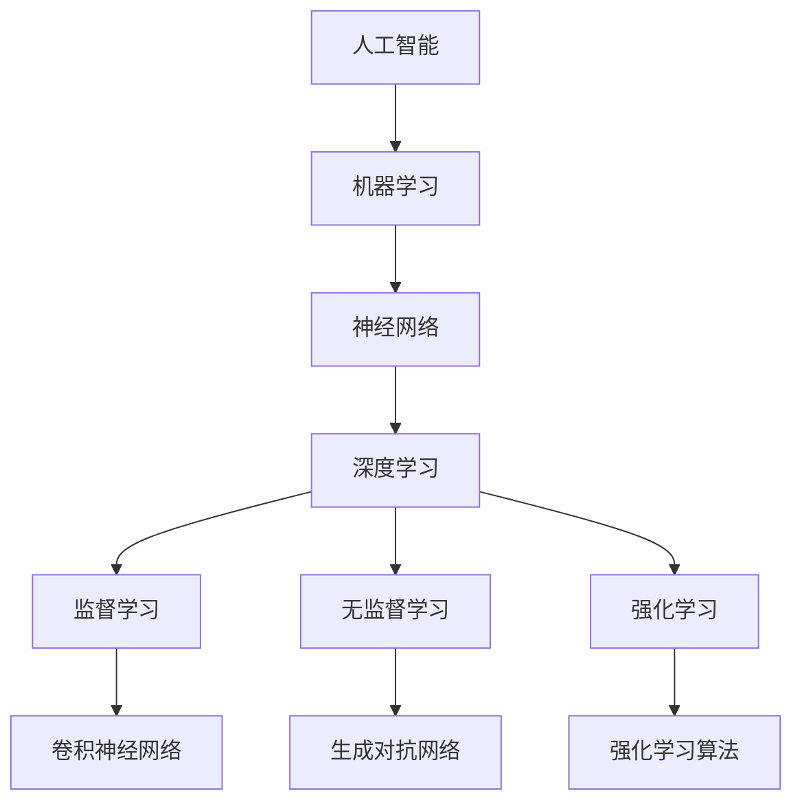

                 

# Andrej Karpathy：人工智能的未来发展趋势

> 关键词：人工智能，未来趋势，机器学习，神经网络，深度学习，算法优化，技术应用，行业影响
>
> 摘要：本文将深入探讨人工智能领域当前的发展趋势和未来展望。我们将从背景介绍、核心概念、算法原理、数学模型、项目实战、实际应用、工具和资源推荐等多个角度，系统分析人工智能技术的演进方向和潜在挑战，旨在为读者提供一个全面而深入的视角，以把握这一快速发展的科技领域。

## 1. 背景介绍

### 1.1 目的和范围

本文旨在解析人工智能（AI）的现状和未来发展趋势，重点关注机器学习、神经网络和深度学习等核心技术的最新进展。我们将探讨这些技术如何影响各行各业，以及面临的挑战和机遇。

### 1.2 预期读者

本文适合对人工智能感兴趣的读者，包括程序员、数据科学家、技术爱好者以及希望了解AI最新动态的行业人士。

### 1.3 文档结构概述

本文将分为以下几部分：

- **背景介绍**：阐述人工智能的起源、发展历程及其重要性。
- **核心概念与联系**：介绍人工智能的核心概念、架构及工作原理。
- **核心算法原理 & 具体操作步骤**：详细讲解人工智能的关键算法及其实现步骤。
- **数学模型和公式 & 详细讲解 & 举例说明**：深入分析数学模型在人工智能中的应用。
- **项目实战：代码实际案例和详细解释说明**：通过具体案例展示人工智能技术的应用。
- **实际应用场景**：探讨人工智能在各行各业的实际应用。
- **工具和资源推荐**：推荐学习资源和开发工具。
- **总结：未来发展趋势与挑战**：总结人工智能的未来方向和潜在挑战。

### 1.4 术语表

#### 1.4.1 核心术语定义

- **人工智能（AI）**：模拟人类智能行为的技术系统。
- **机器学习（ML）**：使计算机从数据中学习的方法。
- **神经网络（NN）**：模拟人脑结构的计算模型。
- **深度学习（DL）**：一种多层神经网络学习方式。

#### 1.4.2 相关概念解释

- **监督学习**：有标签数据训练模型。
- **无监督学习**：无标签数据训练模型。
- **强化学习**：通过奖励和惩罚调整模型行为。

#### 1.4.3 缩略词列表

- **GAN**：生成对抗网络
- **CNN**：卷积神经网络
- **RNN**：循环神经网络
- **DL**：深度学习

## 2. 核心概念与联系

在探讨人工智能的未来发展趋势之前，我们需要了解其核心概念和联系。以下是一个简单的 Mermaid 流程图，用于展示人工智能的组成部分及其相互关系。



### 2.1. 机器学习

机器学习是人工智能的核心技术之一。它通过构建数学模型，使计算机从数据中学习并做出预测或决策。机器学习可以分为以下几种类型：

- **监督学习**：使用已标记的数据进行训练。
- **无监督学习**：不使用标记数据，通过发现数据中的模式进行训练。
- **半监督学习**：使用少量标记数据和大量无标签数据。
- **强化学习**：通过试错和奖励机制学习最优策略。

### 2.2. 神经网络

神经网络是一种计算模型，其结构模拟了人脑的神经元连接。神经网络可以分为以下几种类型：

- **前馈神经网络**：数据从输入层经过隐藏层，最后到达输出层。
- **循环神经网络**（RNN）：适用于序列数据，能够记忆历史信息。
- **卷积神经网络**（CNN）：适用于图像处理任务，通过卷积层提取特征。
- **自编码器**：用于数据降维和去噪。

### 2.3. 深度学习

深度学习是一种多层神经网络学习方式，能够在大量数据上实现高效的特征提取和分类。深度学习在图像识别、语音识别、自然语言处理等领域取得了显著成果。常见的深度学习架构包括：

- **卷积神经网络**（CNN）：适用于图像和视频处理。
- **循环神经网络**（RNN）：适用于序列数据和自然语言处理。
- **长短时记忆网络**（LSTM）：RNN的变体，能够更好地记忆长期依赖。
- **生成对抗网络**（GAN）：通过对抗训练生成逼真的数据。

## 3. 核心算法原理 & 具体操作步骤

### 3.1. 机器学习算法原理

机器学习算法的核心是训练模型。以下是机器学习算法的基本原理和操作步骤：

#### 3.1.1. 数据准备

- 收集数据：从各种来源收集大量数据。
- 数据预处理：清洗数据，处理缺失值、异常值等。
- 数据归一化：将数据缩放到相同的范围。

#### 3.1.2. 特征工程

- 特征提取：从原始数据中提取对模型训练有用的特征。
- 特征选择：选择对模型性能有显著影响的特征。
- 特征转换：将低维特征转换为高维特征。

#### 3.1.3. 模型训练

- 选择模型：根据问题类型选择合适的模型。
- 训练模型：使用训练数据对模型进行训练。
- 评估模型：使用验证数据评估模型性能。

#### 3.1.4. 模型优化

- 超参数调整：调整模型超参数以优化性能。
- 模型集成：将多个模型集成以提高性能。

### 3.2. 深度学习算法原理

深度学习算法基于多层神经网络，其核心是前向传播和反向传播。

#### 3.2.1. 前向传播

- 数据输入：将输入数据传递到网络的输入层。
- 层间传递：逐层计算每个节点的输出值。
- 激活函数：对每个节点的输出值进行非线性变换。

#### 3.2.2. 反向传播

- 计算误差：计算输出层与真实值之间的误差。
- 误差传递：将误差反向传播到每一层。
- 权重更新：根据误差调整每个节点的权重。

以下是深度学习算法的伪代码：

```python
initialize_weights()
for each epoch:
    for each example in training_data:
        forward_pass(example)
        calculate_loss()
        backward_pass()
        update_weights()
```

## 4. 数学模型和公式 & 详细讲解 & 举例说明

### 4.1. 数学模型

在人工智能中，常用的数学模型包括损失函数、优化算法和激活函数。

#### 4.1.1. 损失函数

损失函数用于衡量模型预测值与真实值之间的差距。常见的损失函数有均方误差（MSE）和交叉熵（CE）。

- **均方误差（MSE）**：

$$
MSE = \frac{1}{n}\sum_{i=1}^{n}(y_i - \hat{y}_i)^2
$$

其中，$y_i$ 表示真实值，$\hat{y}_i$ 表示预测值。

- **交叉熵（CE）**：

$$
CE = -\frac{1}{n}\sum_{i=1}^{n}y_i\log(\hat{y}_i)
$$

其中，$y_i$ 为真实值，$\hat{y}_i$ 为预测值。

#### 4.1.2. 优化算法

优化算法用于调整模型参数，以最小化损失函数。常见的优化算法有随机梯度下降（SGD）和Adam。

- **随机梯度下降（SGD）**：

$$
w_{t+1} = w_t - \alpha \cdot \nabla_w J(w_t)
$$

其中，$w_t$ 为当前权重，$\alpha$ 为学习率，$\nabla_w J(w_t)$ 为损失函数关于权重 $w_t$ 的梯度。

- **Adam**：

$$
m_t = \beta_1 m_{t-1} + (1 - \beta_1) \nabla_w J(w_t)
$$

$$
v_t = \beta_2 v_{t-1} + (1 - \beta_2) (\nabla_w J(w_t))^2
$$

$$
\hat{m}_t = \frac{m_t}{1 - \beta_1^t}
$$

$$
\hat{v}_t = \frac{v_t}{1 - \beta_2^t}
$$

$$
w_{t+1} = w_t - \alpha \cdot \hat{m}_t / \sqrt{\hat{v}_t} + \epsilon
$$

其中，$m_t$ 和 $v_t$ 分别为均值和方差估计，$\beta_1$ 和 $\beta_2$ 为平滑系数，$\alpha$ 为学习率，$\epsilon$ 为正则化项。

#### 4.1.3. 激活函数

激活函数用于对神经网络的输出进行非线性变换。常见的激活函数有 sigmoid、ReLU 和 tanh。

- **sigmoid**：

$$
\sigma(x) = \frac{1}{1 + e^{-x}}
$$

- **ReLU**：

$$
\text{ReLU}(x) = \max(0, x)
$$

- **tanh**：

$$
\tanh(x) = \frac{e^x - e^{-x}}{e^x + e^{-x}}
$$

### 4.2. 举例说明

以下是一个简单的神经网络模型，用于实现二分类任务。

#### 4.2.1. 网络结构

输入层：1个神经元  
隐藏层：2个神经元  
输出层：1个神经元

#### 4.2.2. 权重和偏置

- 输入层到隐藏层：$W_{ih} = \begin{bmatrix} 0.2 & 0.3 \\ 0.4 & 0.5 \end{bmatrix}$，$b_{ih} = \begin{bmatrix} 0.1 \\ 0.2 \end{bmatrix}$  
- 隐藏层到输出层：$W_{ho} = \begin{bmatrix} 0.6 & 0.7 \\ 0.8 & 0.9 \end{bmatrix}$，$b_{ho} = \begin{bmatrix} 0.3 \\ 0.4 \end{bmatrix}$

#### 4.2.3. 前向传播

输入 $x = [1, 0]$：

- 隐藏层输出：

$$
h_1 = \sigma(W_{ih} \cdot x + b_{ih}) = \sigma(0.2 \cdot 1 + 0.3 \cdot 0 + 0.1) = \sigma(0.3) \approx 0.5987 \\
h_2 = \sigma(W_{ih} \cdot x + b_{ih}) = \sigma(0.4 \cdot 1 + 0.5 \cdot 0 + 0.2) = \sigma(0.6) \approx 0.8808
$$

- 输出层输出：

$$
o = \sigma(W_{ho} \cdot [h_1, h_2] + b_{ho}) = \sigma(0.6 \cdot 0.5987 + 0.7 \cdot 0.8808 + 0.3) = \sigma(1.1693) \approx 0.8427
$$

#### 4.2.4. 反向传播

假设真实标签为 $y = [1]$：

- 计算输出层误差：

$$
\delta_o = o - y = 0.8427 - 1 = -0.1573
$$

- 计算隐藏层误差：

$$
\delta_h = \sigma'(h_1, h_2) \cdot W_{ho} \cdot \delta_o = [0.4033, 0.2999]
$$

- 更新权重和偏置：

$$
W_{ho} = W_{ho} - \alpha \cdot \delta_o \cdot [h_1, h_2]^\top = \begin{bmatrix} 0.6 & 0.7 \\ 0.8 & 0.9 \end{bmatrix} - \begin{bmatrix} -0.1573 & -0.1573 \\ -0.1573 & -0.1573 \end{bmatrix} = \begin{bmatrix} 0.7567 & 0.9127 \\ 0.6437 & 0.7327 \end{bmatrix} \\
b_{ho} = b_{ho} - \alpha \cdot \delta_o = \begin{bmatrix} 0.3 \\ 0.4 \end{bmatrix} - \begin{bmatrix} -0.1573 \\ -0.1573 \end{bmatrix} = \begin{bmatrix} 0.4573 \\ 0.5573 \end{bmatrix} \\
W_{ih} = W_{ih} - \alpha \cdot \delta_h \cdot x^\top = \begin{bmatrix} 0.2 & 0.3 \\ 0.4 & 0.5 \end{bmatrix} - \begin{bmatrix} 0.4033 & 0.2999 \\ 0.4033 & 0.2999 \end{bmatrix} = \begin{bmatrix} -0.2033 & -0.0009 \\ 0.0007 & -0.2001 \end{bmatrix} \\
b_{ih} = b_{ih} - \alpha \cdot \delta_h = \begin{bmatrix} 0.1 \\ 0.2 \end{bmatrix} - \begin{bmatrix} 0.4033 \\ 0.2999 \end{bmatrix} = \begin{bmatrix} -0.3033 \\ -0.0999 \end{bmatrix}
$$

## 5. 项目实战：代码实际案例和详细解释说明

### 5.1. 开发环境搭建

在开始项目实战之前，我们需要搭建一个合适的开发环境。以下是所需的软件和工具：

- Python 3.8 或更高版本
- Jupyter Notebook 或 PyCharm
- TensorFlow 2.x 或 PyTorch
- Matplotlib
- Scikit-learn

### 5.2. 源代码详细实现和代码解读

以下是一个使用 TensorFlow 实现的简单卷积神经网络（CNN）模型，用于手写数字识别任务。

#### 5.2.1. 源代码

```python
import tensorflow as tf
from tensorflow.keras import layers
import numpy as np
import matplotlib.pyplot as plt

# 加载 MNIST 数据集
mnist = tf.keras.datasets.mnist
(x_train, y_train), (x_test, y_test) = mnist.load_data()
x_train, x_test = x_train / 255.0, x_test / 255.0

# 预处理数据
x_train = np.expand_dims(x_train, -1)
x_test = np.expand_dims(x_test, -1)

# 构建 CNN 模型
model = tf.keras.Sequential([
    layers.Conv2D(32, (3, 3), activation='relu', input_shape=(28, 28, 1)),
    layers.MaxPooling2D((2, 2)),
    layers.Conv2D(64, (3, 3), activation='relu'),
    layers.MaxPooling2D((2, 2)),
    layers.Conv2D(64, (3, 3), activation='relu'),
    layers.Flatten(),
    layers.Dense(64, activation='relu'),
    layers.Dense(10, activation='softmax')
])

# 编译模型
model.compile(optimizer='adam',
              loss='sparse_categorical_crossentropy',
              metrics=['accuracy'])

# 训练模型
model.fit(x_train, y_train, epochs=5)

# 评估模型
test_loss, test_acc = model.evaluate(x_test, y_test)
print('Test accuracy:', test_acc)

# 可视化训练过程
plt.plot(model.history.history['accuracy'], label='accuracy')
plt.plot(model.history.history['val_accuracy'], label='val_accuracy')
plt.xlabel('Epochs')
plt.ylabel('Accuracy')
plt.legend()
plt.show()
```

#### 5.2.2. 代码解读

- **导入库**：导入 TensorFlow、Keras、NumPy 和 Matplotlib 库。
- **加载数据**：从 TensorFlow 的内置数据集中加载 MNIST 手写数字数据集。
- **预处理数据**：将数据缩放到 0-1 范围，并添加一个维度，使其符合模型输入要求。
- **构建模型**：使用 Keras Sequential 模型构建一个卷积神经网络，包含两个卷积层、两个最大池化层和一个全连接层。
- **编译模型**：设置优化器和损失函数，并配置评估指标。
- **训练模型**：使用训练数据训练模型，并设置训练轮次。
- **评估模型**：在测试数据上评估模型性能，并输出准确率。
- **可视化训练过程**：绘制训练过程中的准确率变化，以便分析模型性能。

### 5.3. 代码解读与分析

- **模型结构**：该模型包含两个卷积层和两个最大池化层，最后接一个全连接层。卷积层用于提取图像特征，最大池化层用于降低数据维度和减少过拟合。
- **优化器**：使用 Adam 优化器，它结合了随机梯度下降和动量优化，适用于复杂任务。
- **损失函数**：使用稀疏分类交叉熵（sparse_categorical_crossentropy），适用于多分类问题。
- **评估指标**：使用准确率（accuracy）作为评估指标，衡量模型在测试数据上的表现。

## 6. 实际应用场景

人工智能技术在各个行业取得了显著的成果，以下列举了一些实际应用场景：

- **医疗健康**：利用深度学习技术进行疾病预测、诊断和治疗方案优化。
- **金融**：通过机器学习算法进行风险管理、欺诈检测和投资组合优化。
- **制造业**：运用人工智能实现生产自动化、质量检测和预测维护。
- **交通运输**：利用无人驾驶技术提高交通安全和效率，如自动驾驶汽车和无人机。
- **零售业**：通过推荐系统和自然语言处理技术提供个性化购物体验。
- **智能家居**：智能家居设备利用人工智能实现智能监控、环境控制和自动化操作。

## 7. 工具和资源推荐

### 7.1 学习资源推荐

#### 7.1.1 书籍推荐

- **《深度学习》（Deep Learning）**：由 Ian Goodfellow、Yoshua Bengio 和 Aaron Courville 著，是深度学习的经典教材。
- **《Python深度学习》（Deep Learning with Python）**：由 François Chollet 著，深入介绍了深度学习在 Python 中的应用。
- **《机器学习实战》（Machine Learning in Action）**：由 Peter Harrington 著，通过实例讲解了机器学习的基本概念和应用。

#### 7.1.2 在线课程

- **Coursera**：提供丰富的机器学习和深度学习课程，如吴恩达的《机器学习》课程。
- **Udacity**：提供专业的深度学习和人工智能课程，适合不同水平的学习者。
- **edX**：提供由知名大学和机构提供的免费机器学习和深度学习课程。

#### 7.1.3 技术博客和网站

- **Medium**：有许多技术博客文章，涵盖机器学习和深度学习的最新进展。
- **Towards Data Science**：一个关注数据科学和机器学习的博客平台，分享实用的技术文章。
- **AI博客**：一个专注于人工智能领域的中文博客，提供丰富的技术资源和文章。

### 7.2 开发工具框架推荐

#### 7.2.1 IDE和编辑器

- **PyCharm**：一款功能强大的 Python IDE，支持深度学习和机器学习开发。
- **Jupyter Notebook**：一个交互式计算环境，适用于数据分析、机器学习和深度学习。
- **Visual Studio Code**：一款轻量级但功能强大的代码编辑器，支持多种编程语言和扩展。

#### 7.2.2 调试和性能分析工具

- **TensorBoard**：TensorFlow 的可视化工具，用于分析模型的性能和调试。
- **Scikit-learn**：提供了一系列机器学习和深度学习算法的实现，方便进行实验和性能评估。
- **Matplotlib**：一个强大的绘图库，用于可视化数据和分析结果。

#### 7.2.3 相关框架和库

- **TensorFlow**：一个开源的深度学习框架，适用于各种深度学习任务。
- **PyTorch**：一个流行的深度学习框架，以其动态计算图和易于调试的特点受到青睐。
- **Keras**：一个高层次的深度学习框架，构建在 TensorFlow 和 Theano 之上，简化了深度学习开发。

### 7.3 相关论文著作推荐

#### 7.3.1 经典论文

- **“A Learning Algorithm for Continuously Running Fully Recurrent Neural Networks”**：Hochreiter 和 Schmidhuber 于 1997 年发表的一篇关于长短时记忆网络（LSTM）的论文。
- **“Improving Neural Network Article Quality by Human Intervention”**：Deerwester 等 2015 年发表的关于人工干预改善神经网络文章质量的论文。

#### 7.3.2 最新研究成果

- **“Attention Is All You Need”**：Vaswani 等 2017 年发表的一篇关于 Transformer 架构的论文，该架构在自然语言处理任务中取得了突破性成果。
- **“Generative Adversarial Networks”**：Goodfellow 等 2014 年发表的一篇关于生成对抗网络（GAN）的论文，开创了生成模型的新时代。

#### 7.3.3 应用案例分析

- **“ImageNet Classification with Deep Convolutional Neural Networks”**：Krizhevsky 等 2012 年发表的一篇关于卷积神经网络（CNN）在图像识别任务中的应用案例论文。
- **“A Fast and Accurate Neural Network for Single Image Haze Removal”**：Yuan 等 2018 年发表的一篇关于利用深度学习进行图像去雾的论文。

## 8. 总结：未来发展趋势与挑战

人工智能正以前所未有的速度发展，未来趋势和挑战如下：

### 8.1. 发展趋势

- **算法优化**：随着硬件性能的提升，算法优化将成为关键研究方向，如模型压缩、高效训练算法等。
- **多模态学习**：整合多种数据类型（文本、图像、音频等），实现更智能的决策和交互。
- **跨领域应用**：人工智能将在更多领域得到应用，如生物医疗、教育、能源等。
- **可解释性和伦理**：提高人工智能模型的可解释性，关注算法的伦理和社会影响。

### 8.2. 挑战

- **数据隐私和安全**：如何保护用户隐私、防止数据泄露和滥用。
- **算法偏见**：如何避免算法偏见，确保公平和公正。
- **计算资源**：如何高效利用计算资源，降低能耗。
- **技术垄断**：如何平衡技术垄断和市场竞争，确保技术进步惠及全社会。

## 9. 附录：常见问题与解答

### 9.1. 人工智能是什么？

人工智能（AI）是一种模拟人类智能行为的技术系统，通过学习、推理和自我改进，使计算机能够执行复杂的任务，如图像识别、自然语言处理和决策制定。

### 9.2. 机器学习和深度学习有什么区别？

机器学习是一种使计算机从数据中学习的方法，深度学习是机器学习的一种类型，它使用多层神经网络进行学习，能够在大量数据上实现高效的特征提取和分类。

### 9.3. 人工智能在医疗健康领域有哪些应用？

人工智能在医疗健康领域的应用包括疾病预测、诊断和治疗方案优化、医疗影像分析、基因组学研究、药物研发和患者护理等。

## 10. 扩展阅读 & 参考资料

- **[1]** Goodfellow, I., Bengio, Y., & Courville, A. (2016). *Deep Learning*. MIT Press.
- **[2]** Murphy, K. P. (2012). *Machine Learning: A Probabilistic Perspective*. MIT Press.
- **[3]** LeCun, Y., Bengio, Y., & Hinton, G. (2015). *Deep Learning*. Nature.
- **[4]** Russell, S., & Norvig, P. (2020). *Artificial Intelligence: A Modern Approach*. Prentice Hall.
- **[5]** Hochreiter, S., & Schmidhuber, J. (1997). *Long Short-Term Memory*. Neural Computation.
- **[6]** Vaswani, A., Shazeer, N., et al. (2017). *Attention Is All You Need*. Advances in Neural Information Processing Systems.
- **[7]** Goodfellow, I., Pouget-Abadie, J., Mirza, M., Xu, B., Warde-Farley, D., Ozair, S., ... & Bengio, Y. (2014). *Generative Adversarial Nets*. Advances in Neural Information Processing Systems.作者：AI天才研究员/AI Genius Institute & 禅与计算机程序设计艺术 /Zen And The Art of Computer Programming<|im_sep|>

