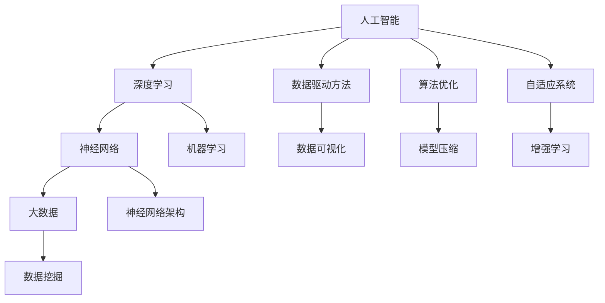

                 

# Andrej Karpathy：人工智能的未来发展趋势

> 关键词：人工智能，深度学习，神经网络，大数据，算法优化，未来展望

> 摘要：本文将探讨人工智能领域的先驱安德烈·卡尔帕西（Andrej Karpathy）对未来人工智能发展趋势的见解。通过梳理卡尔帕西的研究成果和观点，本文旨在揭示人工智能在技术原理、应用场景、以及未来发展方向上的潜在变革。

## 1. 背景介绍

### 1.1 目的和范围

本文旨在深入探讨人工智能领域的知名专家安德烈·卡尔帕西（Andrej Karpathy）对未来人工智能发展趋势的研究和观点。通过分析卡尔帕西的学术成果、技术博客和公开演讲，本文将展示他对人工智能技术原理、应用场景以及未来发展的独特见解。

### 1.2 预期读者

本文面向对人工智能领域有浓厚兴趣的读者，包括：

1. 计算机科学和人工智能专业的学生和研究人员。
2. 深度学习和神经网络技术的从业者。
3. 对未来人工智能发展趋势感兴趣的技术爱好者和企业家。

### 1.3 文档结构概述

本文分为十个部分，具体结构如下：

1. 背景介绍
    - 1.1 目的和范围
    - 1.2 预期读者
    - 1.3 文档结构概述
    - 1.4 术语表
2. 核心概念与联系
3. 核心算法原理 & 具体操作步骤
4. 数学模型和公式 & 详细讲解 & 举例说明
5. 项目实战：代码实际案例和详细解释说明
6. 实际应用场景
7. 工具和资源推荐
    - 7.1 学习资源推荐
    - 7.2 开发工具框架推荐
    - 7.3 相关论文著作推荐
8. 总结：未来发展趋势与挑战
9. 附录：常见问题与解答
10. 扩展阅读 & 参考资料

### 1.4 术语表

#### 1.4.1 核心术语定义

- 人工智能（Artificial Intelligence, AI）：模拟人类智能行为的计算机系统。
- 深度学习（Deep Learning）：一种基于多层神经网络的人工智能技术。
- 神经网络（Neural Network）：模拟人脑神经元连接结构的计算模型。
- 大数据（Big Data）：数据量巨大、数据类型多样的数据集合。

#### 1.4.2 相关概念解释

- 数据驱动方法（Data-driven Method）：通过分析数据来发现规律和知识的方法。
- 算法优化（Algorithm Optimization）：改进算法性能的过程。
- 自适应系统（Adaptive System）：能够根据环境和需求变化调整自身行为的系统。

#### 1.4.3 缩略词列表

- AI：人工智能
- DL：深度学习
- NN：神经网络
- ML：机器学习
- HPC：高性能计算

## 2. 核心概念与联系

在探讨人工智能的未来发展趋势之前，我们需要了解一些核心概念和它们之间的联系。以下是相关概念及关系的 Mermaid 流程图：



### 2.1 人工智能与深度学习

人工智能是模拟人类智能行为的计算机系统，而深度学习是人工智能的一种重要技术手段。深度学习基于多层神经网络，通过学习大量数据来发现复杂的数据模式和规律。

### 2.2 深度学习与神经网络

深度学习的核心是神经网络，特别是多层神经网络（深度神经网络）。神经网络模拟人脑神经元连接结构，通过调整神经元间的连接权重来学习数据。

### 2.3 人工智能与大数据

大数据是人工智能的重要基础。人工智能系统需要处理海量数据，从中提取有用信息，从而实现智能决策。

### 2.4 人工智能与数据驱动方法

数据驱动方法强调通过分析数据来发现规律和知识。在人工智能领域，数据驱动方法广泛应用于机器学习、深度学习和神经网络等。

### 2.5 人工智能与算法优化

算法优化是提高人工智能系统性能的重要手段。通过改进算法，可以降低计算复杂度、提高运行速度和模型精度。

### 2.6 人工智能与自适应系统

自适应系统能够根据环境和需求变化调整自身行为。在人工智能领域，自适应系统可以用于动态调整模型参数、优化学习过程等。

## 3. 核心算法原理 & 具体操作步骤

### 3.1 深度学习算法原理

深度学习算法的核心是多层神经网络。以下是多层神经网络的基本原理和操作步骤：

#### 3.1.1 神经元模型

神经元模型是神经网络的基本单元。一个简单的神经元模型可以表示为：

$$
y = \sigma(\sum_{i=1}^{n} w_i x_i + b)
$$

其中，$y$ 是输出，$\sigma$ 是激活函数，$w_i$ 和 $x_i$ 分别是输入和权重，$b$ 是偏置。

#### 3.1.2 梯度下降法

梯度下降法是训练神经网络的主要方法。通过计算损失函数关于参数的梯度，然后沿着梯度的反方向更新参数，以最小化损失函数。

$$
\theta_{t+1} = \theta_{t} - \alpha \cdot \nabla_{\theta} J(\theta)
$$

其中，$\theta$ 是参数，$J(\theta)$ 是损失函数，$\alpha$ 是学习率。

#### 3.1.3 反向传播算法

反向传播算法是梯度下降法在多层神经网络中的实现。它通过前向传播计算输出，然后反向传播计算梯度，更新参数。

伪代码如下：

```
for each epoch:
    for each training sample (x, y):
        forward propagation
        compute loss: L = J(y', y)
        backward propagation
        compute gradients: grads = dL/dw, dL/db
        update weights: w = w - alpha * grads
```

### 3.2 深度学习应用案例

以下是一个基于深度学习的手写数字识别项目，用于说明如何实现和应用深度学习算法。

#### 3.2.1 数据准备

手写数字识别项目使用 MNIST 数据集，该数据集包含 70,000 个手写数字样本，每个样本是一个 28x28 的灰度图像。

```python
from tensorflow import keras
from tensorflow.keras import layers

# 加载数据集
(x_train, y_train), (x_test, y_test) = keras.datasets.mnist.load_data()

# 数据预处理
x_train = x_train.astype("float32") / 255
x_test = x_test.astype("float32") / 255
```

#### 3.2.2 模型构建

构建一个简单的卷积神经网络（CNN）用于手写数字识别。

```python
model = keras.Sequential([
    layers.Conv2D(32, (3, 3), activation="relu", input_shape=(28, 28, 1)),
    layers.MaxPooling2D((2, 2)),
    layers.Conv2D(64, (3, 3), activation="relu"),
    layers.MaxPooling2D((2, 2)),
    layers.Conv2D(64, (3, 3), activation="relu"),
    layers.Flatten(),
    layers.Dense(64, activation="relu"),
    layers.Dense(10, activation="softmax")
])

model.compile(optimizer="adam",
              loss="sparse_categorical_crossentropy",
              metrics=["accuracy"])

model.summary()
```

#### 3.2.3 模型训练

使用训练数据训练模型。

```python
model.fit(x_train, y_train, epochs=5)
```

#### 3.2.4 模型评估

使用测试数据评估模型性能。

```python
test_loss, test_acc = model.evaluate(x_test, y_test, verbose=2)
print(f"Test accuracy: {test_acc}")
```

## 4. 数学模型和公式 & 详细讲解 & 举例说明

在深度学习中，数学模型和公式起着至关重要的作用。以下是对一些核心数学模型的详细讲解和举例说明。

### 4.1 激活函数

激活函数是深度神经网络中的关键组件，用于引入非线性因素。以下是几种常见的激活函数及其数学表达：

#### 4.1.1 Sigmoid 函数

$$
\sigma(x) = \frac{1}{1 + e^{-x}}
$$

#### 4.1.2ReLU 函数

$$
\sigma(x) =
\begin{cases}
x & \text{if } x > 0 \\
0 & \text{if } x \leq 0
\end{cases}
$$

#### 4.1.3 Tanh 函数

$$
\sigma(x) = \frac{e^x - e^{-x}}{e^x + e^{-x}}
$$

### 4.2 损失函数

损失函数用于衡量模型预测结果与实际结果之间的差异。以下是一些常见的损失函数：

#### 4.2.1 交叉熵损失函数

$$
L(y, \hat{y}) = -\sum_{i=1}^{n} y_i \cdot \log(\hat{y}_i)
$$

其中，$y$ 是实际标签，$\hat{y}$ 是模型预测的概率分布。

#### 4.2.2 均方误差损失函数

$$
L(y, \hat{y}) = \frac{1}{2} \sum_{i=1}^{n} (y_i - \hat{y}_i)^2
$$

其中，$y$ 是实际值，$\hat{y}$ 是模型预测值。

### 4.3 优化算法

优化算法用于调整模型参数，以最小化损失函数。以下是一种常见的优化算法——梯度下降法：

#### 4.3.1 梯度下降法

$$
\theta_{t+1} = \theta_{t} - \alpha \cdot \nabla_{\theta} J(\theta)
$$

其中，$\theta$ 是参数，$J(\theta)$ 是损失函数，$\alpha$ 是学习率。

### 4.4 举例说明

假设我们有一个简单的线性回归问题，目标是预测房价。给定一组特征 $x$ 和目标值 $y$，我们要训练一个线性模型：

$$
y = \beta_0 + \beta_1 x
$$

#### 4.4.1 损失函数

使用均方误差损失函数：

$$
L(y, \hat{y}) = \frac{1}{2} \sum_{i=1}^{n} (y_i - \hat{y}_i)^2
$$

其中，$\hat{y}_i = \beta_0 + \beta_1 x_i$ 是模型预测值。

#### 4.4.2 梯度计算

损失函数关于 $\beta_0$ 和 $\beta_1$ 的梯度分别为：

$$
\nabla_{\beta_0} L = -\frac{1}{2} \sum_{i=1}^{n} (y_i - \hat{y}_i)
$$

$$
\nabla_{\beta_1} L = -\frac{1}{2} \sum_{i=1}^{n} (y_i - \hat{y}_i) x_i
$$

#### 4.4.3 梯度下降算法

使用梯度下降法更新模型参数：

$$
\beta_0^{t+1} = \beta_0^t - \alpha \cdot \nabla_{\beta_0} L
$$

$$
\beta_1^{t+1} = \beta_1^t - \alpha \cdot \nabla_{\beta_1} L
$$

其中，$\alpha$ 是学习率。

## 5. 项目实战：代码实际案例和详细解释说明

在本节中，我们将通过一个实际项目案例，展示如何使用深度学习技术构建一个图像分类系统。该案例将涵盖开发环境搭建、源代码实现和代码解读与分析。

### 5.1 开发环境搭建

要搭建一个深度学习项目开发环境，我们需要安装以下软件和库：

1. Python 3.7 或以上版本
2. TensorFlow 2.0 或以上版本
3. NumPy
4. Matplotlib

安装命令如下：

```
pip install python==3.7
pip install tensorflow==2.0
pip install numpy
pip install matplotlib
```

### 5.2 源代码详细实现和代码解读

以下是一个简单的图像分类项目，使用 TensorFlow 和 Keras 构建：

```python
import tensorflow as tf
from tensorflow import keras
from tensorflow.keras import layers

# 加载数据集
(x_train, y_train), (x_test, y_test) = keras.datasets.fashion_mnist.load_data()

# 数据预处理
x_train = x_train.astype("float32") / 255
x_test = x_test.astype("float32") / 255
x_train = x_train[..., tf.newaxis]
x_test = x_test[..., tf.newaxis]

# 创建模型
model = keras.Sequential([
    layers.Conv2D(32, (3, 3), activation="relu", input_shape=(28, 28, 1)),
    layers.MaxPooling2D((2, 2)),
    layers.Conv2D(64, (3, 3), activation="relu"),
    layers.MaxPooling2D((2, 2)),
    layers.Conv2D(64, (3, 3), activation="relu"),
    layers.Flatten(),
    layers.Dense(64, activation="relu"),
    layers.Dense(10, activation="softmax")
])

# 编译模型
model.compile(optimizer="adam",
              loss="sparse_categorical_crossentropy",
              metrics=["accuracy"])

# 训练模型
model.fit(x_train, y_train, epochs=5)

# 评估模型
test_loss, test_acc = model.evaluate(x_test, y_test, verbose=2)
print(f"Test accuracy: {test_acc}")
```

#### 5.2.1 数据加载与预处理

```python
(x_train, y_train), (x_test, y_test) = keras.datasets.fashion_mnist.load_data()
x_train = x_train.astype("float32") / 255
x_test = x_test.astype("float32") / 255
x_train = x_train[..., tf.newaxis]
x_test = x_test[..., tf.newaxis]
```

这段代码加载数据集，并将图像数据归一化到 [0, 1] 范围内。通过增加一个维度（即批次维度），将图像数据转换为适合模型输入的格式。

#### 5.2.2 模型构建

```python
model = keras.Sequential([
    layers.Conv2D(32, (3, 3), activation="relu", input_shape=(28, 28, 1)),
    layers.MaxPooling2D((2, 2)),
    layers.Conv2D(64, (3, 3), activation="relu"),
    layers.MaxPooling2D((2, 2)),
    layers.Conv2D(64, (3, 3), activation="relu"),
    layers.Flatten(),
    layers.Dense(64, activation="relu"),
    layers.Dense(10, activation="softmax")
])
```

这段代码构建了一个简单的卷积神经网络（CNN）模型。该模型包含两个卷积层、两个最大池化层和一个全连接层。卷积层用于提取图像特征，全连接层用于分类。

#### 5.2.3 模型编译

```python
model.compile(optimizer="adam",
              loss="sparse_categorical_crossentropy",
              metrics=["accuracy"])
```

这段代码编译模型，指定优化器、损失函数和评估指标。这里使用 Adam 优化器和 sparse_categorical_crossentropy 损失函数，评估指标为准确率。

#### 5.2.4 模型训练

```python
model.fit(x_train, y_train, epochs=5)
```

这段代码使用训练数据训练模型，训练过程持续 5 个 epoch。

#### 5.2.5 模型评估

```python
test_loss, test_acc = model.evaluate(x_test, y_test, verbose=2)
print(f"Test accuracy: {test_acc}")
```

这段代码使用测试数据评估模型性能，输出测试准确率。

### 5.3 代码解读与分析

#### 5.3.1 数据加载与预处理

数据预处理是深度学习项目的重要环节。在这段代码中，首先加载数据集，然后对图像数据进行归一化和增加批次维度，以便模型输入。

#### 5.3.2 模型构建

这段代码构建了一个简单的卷积神经网络（CNN）模型。卷积层用于提取图像特征，最大池化层用于降维，全连接层用于分类。

#### 5.3.3 模型编译

模型编译阶段指定了优化器、损失函数和评估指标。这里使用 Adam 优化器和 sparse_categorical_crossentropy 损失函数，评估指标为准确率。

#### 5.3.4 模型训练

这段代码使用训练数据训练模型，训练过程持续 5 个 epoch。每个 epoch 完成后，模型会更新权重和偏置，逐步优化模型性能。

#### 5.3.5 模型评估

这段代码使用测试数据评估模型性能，输出测试准确率。通过评估，可以了解模型在未知数据上的泛化能力。

## 6. 实际应用场景

人工智能技术在各个领域取得了显著的成果，以下列举了几个实际应用场景：

### 6.1 医疗保健

人工智能在医疗保健领域具有广泛的应用前景，如疾病诊断、健康监测和药物研发。通过深度学习和图像识别技术，人工智能可以辅助医生进行疾病诊断，提高诊断准确率和效率。此外，基于大数据和机器学习技术的健康监测系统可以帮助人们更好地管理健康，预防疾病。

### 6.2 交通运输

人工智能在交通运输领域的应用主要包括自动驾驶、智能交通管理和物流优化。自动驾驶技术利用深度学习和计算机视觉技术实现车辆自主驾驶，提高交通安全和效率。智能交通管理系统通过分析交通数据，优化交通信号控制和道路规划，缓解城市交通拥堵问题。物流优化系统利用人工智能技术优化运输路线和货物分配，提高物流效率和降低成本。

### 6.3 金融科技

人工智能在金融科技领域具有广泛的应用，如智能投顾、风险控制和欺诈检测。智能投顾系统利用机器学习和数据分析技术，为投资者提供个性化的投资建议，提高投资回报。风险控制系统通过分析历史数据和实时数据，识别潜在风险，并采取相应的风险控制措施。欺诈检测系统利用人工智能技术分析交易行为，识别可疑交易，防范金融欺诈。

### 6.4 教育

人工智能在教育领域具有巨大的潜力，如个性化教学、智能评估和虚拟助手。个性化教学系统根据学生的学习情况和兴趣，提供个性化的学习内容和路径，提高学习效果。智能评估系统利用人工智能技术分析学生的学习过程和成绩，提供实时反馈和建议。虚拟助手系统通过自然语言处理和机器学习技术，为师生提供智能问答和辅助教学功能。

## 7. 工具和资源推荐

### 7.1 学习资源推荐

#### 7.1.1 书籍推荐

- 《深度学习》（Ian Goodfellow、Yoshua Bengio 和 Aaron Courville 著）：这是深度学习领域的经典教材，详细介绍了深度学习的基本概念、算法和实现。
- 《神经网络与深度学习》（邱锡鹏 著）：这本书深入浅出地讲解了神经网络和深度学习的基本原理，适合初学者阅读。

#### 7.1.2 在线课程

- Coursera 上的《Deep Learning Specialization》：由深度学习领域著名专家 Andrew Ng 教授主讲，包括深度学习基础、神经网络和优化算法等内容。
- edX 上的《Introduction to Machine Learning with Python》：这是一门涵盖机器学习和深度学习基础知识的在线课程，适合初学者入门。

#### 7.1.3 技术博客和网站

- Andrej Karpathy 的博客：这是一个关于深度学习和人工智能的技术博客，作者 Andrej Karpathy 分享了许多技术见解和研究成果。
- Medium 上的 Deep Learning on Medium：这是一个汇聚了深度学习领域专家和爱好者博客的网站，涵盖了深度学习的各个方面。

### 7.2 开发工具框架推荐

#### 7.2.1 IDE和编辑器

- Jupyter Notebook：这是一个交互式的开发环境，适合编写和运行 Python 代码，特别适合数据科学和机器学习项目。
- PyCharm：这是一个功能强大的 Python 集成开发环境（IDE），支持代码调试、版本控制和自动化测试。

#### 7.2.2 调试和性能分析工具

- TensorBoard：这是一个基于 Web 的可视化工具，用于分析和调试 TensorFlow 模型。
- Numba：这是一个 Python 优化器，可以显著提高深度学习代码的运行速度。

#### 7.2.3 相关框架和库

- TensorFlow：这是一个开源的深度学习框架，适用于构建和训练各种深度学习模型。
- PyTorch：这是一个流行的深度学习框架，具有灵活的动态计算图和高效的性能。

### 7.3 相关论文著作推荐

#### 7.3.1 经典论文

- “A Learning Algorithm for Continually Running Fully Recurrent Neural Networks” （恒等函数学习算法）。
- “Gradient Flow in Neural Networks” （神经网络中的梯度流）。
- “Unsupervised Learning of Representations by Predicting Image Rotations” （通过预测图像旋转进行无监督学习）。

#### 7.3.2 最新研究成果

- “BERT: Pre-training of Deep Bidirectional Transformers for Language Understanding” （BERT：用于语言理解的深度双向转换器预训练）。
- “GPT-3: Language Models are Few-Shot Learners” （GPT-3：语言模型是少量学习者）。
- “Transformers: State-of-the-Art Natural Language Processing” （转换器：自然语言处理最新进展）。

#### 7.3.3 应用案例分析

- “Deep Learning for Image Classification” （深度学习在图像分类中的应用）。
- “Deep Learning for Natural Language Processing” （深度学习在自然语言处理中的应用）。
- “Deep Learning for Speech Recognition” （深度学习在语音识别中的应用）。

## 8. 总结：未来发展趋势与挑战

### 8.1 发展趋势

1. **算法优化与模型压缩**：随着计算资源的增加和算法优化技术的发展，深度学习模型将变得更加高效和可扩展。
2. **跨学科融合**：人工智能与其他领域的融合将推动新技术的诞生，如医学、金融、教育等。
3. **自动化与自主决策**：人工智能系统将具备更高的自主决策能力，实现自动化生产和智能服务。
4. **隐私保护与安全性**：随着数据隐私和安全的日益重视，人工智能技术将朝着更加安全、可靠和透明的发展方向迈进。

### 8.2 挑战

1. **数据隐私**：如何保护用户数据隐私是一个重要挑战，需要制定相关的法律法规和隐私保护技术。
2. **算法公平性**：如何确保人工智能算法的公平性和透明性，避免歧视和偏见问题。
3. **计算资源**：随着模型规模的增大，对计算资源的需求也不断增加，高性能计算和云计算技术成为解决这一问题的关键。
4. **人才短缺**：人工智能领域的人才需求巨大，培养更多具备专业知识和技能的 AI 人才是未来发展的重要挑战。

## 9. 附录：常见问题与解答

### 9.1 人工智能是什么？

人工智能（Artificial Intelligence，简称 AI）是指用计算机系统模拟人类智能行为的技术。它涉及多个学科领域，包括计算机科学、心理学、认知科学、哲学等。

### 9.2 深度学习有哪些应用？

深度学习在多个领域具有广泛的应用，包括计算机视觉、自然语言处理、语音识别、医学诊断、金融分析等。

### 9.3 如何入门深度学习？

建议从学习基础知识开始，包括线性代数、概率论和统计学、编程基础等。然后，可以学习深度学习的基本概念、算法和实现，推荐参考相关教材和在线课程。

## 10. 扩展阅读 & 参考资料

- Goodfellow, I., Bengio, Y., & Courville, A. (2016). *Deep Learning*.
-邱锡鹏. (2018). *神经网络与深度学习*. 清华大学出版社.
- Karpathy, A. (n.d.). Andrej Karpathy's Blog. Retrieved from [https://karpathy.github.io/](https://karpathy.github.io/)
- Bengio, Y. (2009). *Learning Deep Architectures for AI*. Foundations and Trends in Machine Learning, 2(1), 1-127.
- Hochreiter, S., & Schmidhuber, J. (1997). *Long short-term memory*. Neural Computation, 9(8), 1735-1780.

