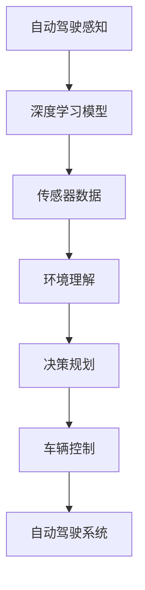
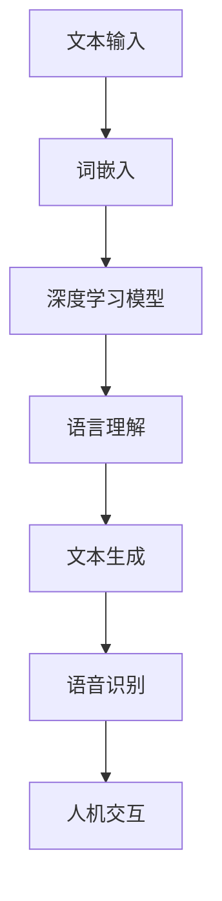
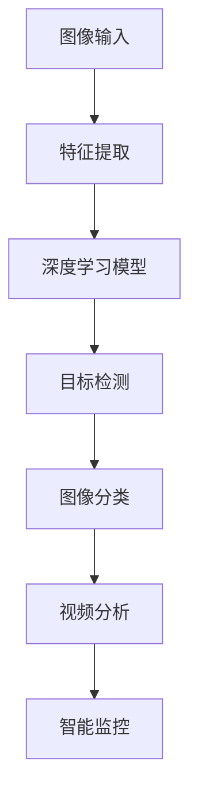
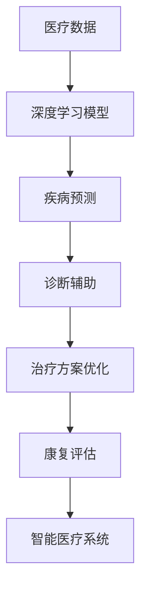

                 

# Andrej Karpathy：人工智能的未来变革

## 关键词： 
- 人工智能  
- 深度学习  
- 自动驾驶  
- 自然语言处理  
- 计算机视觉  
- 智能医疗

## 摘要：
本文将深入探讨人工智能领域领军人物Andrej Karpathy的研究成果及其对未来科技变革的预测。通过分析其关于深度学习、自动驾驶、自然语言处理和计算机视觉等方面的前沿观点，我们旨在为读者揭示人工智能在未来的发展趋势和面临的挑战。

## 1. 背景介绍

Andrej Karpathy是一位在人工智能（AI）领域享有盛誉的研究员和程序员。他以其在深度学习、自然语言处理和计算机视觉等领域的杰出贡献而闻名。Karpathy曾在Google、OpenAI等知名科技公司担任重要职位，并在全球范围内发表了多篇具有影响力的学术论文。

本文将围绕Andrej Karpathy的研究成果展开，探讨其对人工智能未来发展的看法。我们将重点关注以下几个方面：

- 深度学习在自动驾驶中的应用  
- 自然语言处理的技术突破  
- 计算机视觉的广泛应用  
- 智能医疗的发展前景

通过以上几个方面的探讨，我们希望能为读者提供一个全面、深入的人工智能未来变革图景。

## 2. 核心概念与联系

### 深度学习

深度学习是人工智能领域的一个重要分支，它通过模仿人脑神经网络结构，实现图像、语音、自然语言等数据的高效处理。在自动驾驶领域，深度学习技术被广泛应用于感知、规划和控制等环节。

#### Mermaid 流程图：



### 自然语言处理

自然语言处理（NLP）旨在使计算机能够理解、生成和应对人类语言。近年来，基于深度学习的NLP技术取得了显著突破，使得机器翻译、文本生成、语音识别等应用取得了质的飞跃。

#### Mermaid 流程图：



### 计算机视觉

计算机视觉是人工智能领域的一个重要分支，它使计算机具备理解、分析和处理图像和视频的能力。在自动驾驶、安防监控、医疗诊断等领域，计算机视觉技术发挥着关键作用。

#### Mermaid 流程图：



### 智能医疗

智能医疗是人工智能在医疗领域的应用，它通过大数据、深度学习和计算机视觉等技术，实现对疾病预测、诊断、治疗和康复等环节的优化。智能医疗的发展有望大幅提升医疗效率，降低医疗成本。

#### Mermaid 流程图：



## 3. 核心算法原理 & 具体操作步骤

### 深度学习在自动驾驶中的应用

#### 算法原理：

深度学习在自动驾驶中的应用主要包括感知、规划和控制等环节。其中，感知环节主要通过深度学习模型对传感器数据进行处理，实现对周围环境的理解和感知。

#### 具体操作步骤：

1. 采集传感器数据：自动驾驶系统会通过摄像头、激光雷达、超声波传感器等多种传感器采集周围环境的数据。  
2. 数据预处理：对采集到的传感器数据进行预处理，如图像去噪、数据归一化等。  
3. 特征提取：利用卷积神经网络（CNN）等深度学习模型，对预处理后的数据进行特征提取，以实现对周围环境的理解。  
4. 环境理解：基于特征提取的结果，深度学习模型会对周围环境进行理解和感知，如识别行人、车辆、道路等。  
5. 决策规划：根据环境理解的结果，自动驾驶系统会进行决策规划，如确定行驶路径、速度等。  
6. 车辆控制：根据决策规划的结果，自动驾驶系统会控制车辆执行相应的动作，如加速、减速、转向等。

### 自然语言处理的技术突破

#### 算法原理：

自然语言处理（NLP）的核心任务是使计算机能够理解、生成和应对人类语言。近年来，基于深度学习的NLP技术取得了显著突破，使得机器翻译、文本生成、语音识别等应用取得了质的飞跃。

#### 具体操作步骤：

1. 词嵌入：将文本中的单词映射为高维向量表示，如使用词嵌入技术（如Word2Vec、GloVe等）。  
2. 深度学习模型：利用卷积神经网络（CNN）、循环神经网络（RNN）、Transformer等深度学习模型，对词嵌入进行建模，以实现语言理解、文本生成等功能。  
3. 语言理解：通过深度学习模型对词嵌入进行建模，实现对文本内容的理解和分析，如情感分析、主题分类等。  
4. 文本生成：基于深度学习模型，生成具有人类语言特征的文本，如机器翻译、文本摘要、聊天机器人等。  
5. 语音识别：将语音信号转换为文本，如使用深度神经网络（DNN）、卷积神经网络（CNN）等深度学习模型，实现语音识别。

### 计算机视觉的广泛应用

#### 算法原理：

计算机视觉是人工智能领域的一个重要分支，它使计算机具备理解、分析和处理图像和视频的能力。计算机视觉在自动驾驶、安防监控、医疗诊断等领域具有广泛应用。

#### 具体操作步骤：

1. 图像输入：通过摄像头、激光雷达等设备采集图像数据。  
2. 特征提取：利用卷积神经网络（CNN）等深度学习模型，对图像数据进行特征提取，以实现对图像内容的理解和分析。  
3. 目标检测：利用深度学习模型，对图像中的目标进行检测和定位，如使用Faster R-CNN、YOLO等目标检测算法。  
4. 图像分类：利用深度学习模型，对图像进行分类，如使用ResNet、Inception等图像分类算法。  
5. 视频分析：利用深度学习模型，对视频进行实时分析，如使用RNN、Transformer等算法，实现动作识别、场景分割等。

### 智能医疗的发展前景

#### 算法原理：

智能医疗是人工智能在医疗领域的应用，它通过大数据、深度学习和计算机视觉等技术，实现对疾病预测、诊断、治疗和康复等环节的优化。

#### 具体操作步骤：

1. 医疗数据采集：通过电子病历、医学影像等手段，收集患者的医疗数据。  
2. 数据预处理：对采集到的医疗数据进行预处理，如图像去噪、数据归一化等。  
3. 特征提取：利用卷积神经网络（CNN）等深度学习模型，对预处理后的医疗数据进行特征提取，以实现对疾病特征的理解。  
4. 疾病预测：基于深度学习模型，对患者的疾病风险进行预测，如使用深度神经网络（DNN）、卷积神经网络（CNN）等算法。  
5. 诊断辅助：利用深度学习模型，对医学影像进行诊断辅助，如使用Faster R-CNN、ResNet等算法。  
6. 治疗方案优化：根据患者的疾病特征，利用深度学习模型，为医生提供最优治疗方案，如使用深度强化学习（DRL）等算法。  
7. 康复评估：利用深度学习模型，对患者的康复情况进行评估，如使用RNN、Transformer等算法。

## 4. 数学模型和公式 & 详细讲解 & 举例说明

### 深度学习在自动驾驶中的应用

#### 算法原理：

深度学习在自动驾驶中的应用主要包括感知、规划和控制等环节。其中，感知环节主要通过深度学习模型对传感器数据进行处理，实现对周围环境的理解和感知。

#### 数学模型：

- 卷积神经网络（CNN）：

  $$ f(x) = \sigma(W \cdot x + b) $$

  其中，$f(x)$表示输出，$\sigma$表示激活函数（如ReLU、Sigmoid等），$W$表示权重矩阵，$x$表示输入特征，$b$表示偏置。

- 逆向传播算法（Backpropagation）：

  $$ \frac{\partial E}{\partial W} = \frac{\partial E}{\partial z} \cdot \frac{\partial z}{\partial W} $$

  $$ \frac{\partial E}{\partial b} = \frac{\partial E}{\partial z} $$

  其中，$E$表示损失函数，$z$表示中间层输出，$W$表示权重矩阵，$b$表示偏置。

#### 举例说明：

假设我们使用卷积神经网络（CNN）对自动驾驶感知中的图像数据进行处理。给定一幅图像$X$，我们希望利用CNN提取图像的特征。

1. 输入层：将图像$X$输入到CNN中。  
2. 卷积层：通过卷积操作，提取图像的特征。假设卷积核大小为$3 \times 3$，步长为$1$，则卷积后的特征图大小为$\frac{28 - 3}{1} + 1 = 26$。  
3. 池化层：对卷积后的特征图进行池化操作，以减小特征图的尺寸。假设使用最大池化，则池化后的特征图大小为$\frac{26 - 2}{2} + 1 = 13$。  
4. 全连接层：将池化后的特征图输入到全连接层，进行分类或回归操作。  
5. 损失函数：使用交叉熵损失函数（Cross-Entropy Loss）计算预测结果与实际标签之间的差异，并优化模型参数。

### 自然语言处理的技术突破

#### 算法原理：

自然语言处理（NLP）的核心任务是使计算机能够理解、生成和应对人类语言。近年来，基于深度学习的NLP技术取得了显著突破，使得机器翻译、文本生成、语音识别等应用取得了质的飞跃。

#### 数学模型：

- 词嵌入（Word Embedding）：

  $$ \text{嵌入向量} = \text{权重矩阵} \cdot \text{输入词向量} $$

- 循环神经网络（RNN）：

  $$ h_t = \sigma(W_h \cdot [h_{t-1}, x_t] + b_h) $$

  $$ y_t = W_y \cdot h_t + b_y $$

  其中，$h_t$表示隐藏状态，$x_t$表示输入词向量，$y_t$表示输出词向量，$W_h$和$W_y$分别表示权重矩阵，$b_h$和$b_y$分别表示偏置。

- Transformer：

  $$ \text{自注意力分数} = \text{查询向量} \cdot \text{键值向量} $$

  $$ \text{自注意力权重} = \text{softmax}(\text{自注意力分数}) $$

  $$ \text{自注意力输出} = \text{自注意力权重} \cdot \text{键值向量} $$

#### 举例说明：

假设我们使用循环神经网络（RNN）对机器翻译任务进行处理。给定一句英文句子“Hello, world!”，我们希望将其翻译为中文。

1. 输入层：将英文句子输入到RNN中。  
2. 词嵌入：将英文单词映射为高维向量表示。  
3. RNN层：通过RNN层，对输入词向量进行建模，以实现对句子的理解和生成。  
4. 全连接层：将RNN层的输出输入到全连接层，进行翻译操作。  
5. 损失函数：使用交叉熵损失函数（Cross-Entropy Loss）计算预测结果与实际标签之间的差异，并优化模型参数。

### 计算机视觉的广泛应用

#### 算法原理：

计算机视觉是人工智能领域的一个重要分支，它使计算机具备理解、分析和处理图像和视频的能力。计算机视觉在自动驾驶、安防监控、医疗诊断等领域具有广泛应用。

#### 数学模型：

- 卷积神经网络（CNN）：

  $$ f(x) = \sigma(W \cdot x + b) $$

  其中，$f(x)$表示输出，$\sigma$表示激活函数（如ReLU、Sigmoid等），$W$表示权重矩阵，$x$表示输入特征，$b$表示偏置。

- 卷积层：

  $$ \text{卷积核} \cdot \text{输入特征图} + \text{偏置} $$

  $$ \text{输出特征图} = \text{卷积层}(\text{卷积核} \cdot \text{输入特征图} + \text{偏置}) $$

- 池化层：

  $$ \text{最大池化}(\text{输出特征图}) $$

#### 举例说明：

假设我们使用卷积神经网络（CNN）对自动驾驶感知中的图像数据进行处理。给定一幅图像$X$，我们希望利用CNN提取图像的特征。

1. 输入层：将图像$X$输入到CNN中。  
2. 卷积层：通过卷积操作，提取图像的特征。假设卷积核大小为$3 \times 3$，步长为$1$，则卷积后的特征图大小为$\frac{28 - 3}{1} + 1 = 26$。  
3. 池化层：对卷积后的特征图进行池化操作，以减小特征图的尺寸。假设使用最大池化，则池化后的特征图大小为$\frac{26 - 2}{2} + 1 = 13$。  
4. 全连接层：将池化后的特征图输入到全连接层，进行分类或回归操作。  
5. 损失函数：使用交叉熵损失函数（Cross-Entropy Loss）计算预测结果与实际标签之间的差异，并优化模型参数。

### 智能医疗的发展前景

#### 算法原理：

智能医疗是人工智能在医疗领域的应用，它通过大数据、深度学习和计算机视觉等技术，实现对疾病预测、诊断、治疗和康复等环节的优化。

#### 数学模型：

- 深度学习模型（如卷积神经网络、循环神经网络、Transformer等）：

  $$ f(x) = \sigma(W \cdot x + b) $$

  其中，$f(x)$表示输出，$\sigma$表示激活函数（如ReLU、Sigmoid等），$W$表示权重矩阵，$x$表示输入特征，$b$表示偏置。

- 损失函数（如交叉熵损失函数、均方误差损失函数等）：

  $$ L = \frac{1}{n} \sum_{i=1}^{n} (-y_i \log(\hat{y}_i)) $$

  其中，$L$表示损失函数，$y_i$表示实际标签，$\hat{y}_i$表示预测结果。

#### 举例说明：

假设我们使用卷积神经网络（CNN）对智能医疗中的疾病预测任务进行处理。给定一组患者的医疗数据$X$，我们希望利用CNN预测患者的疾病风险。

1. 输入层：将患者的医疗数据$X$输入到CNN中。  
2. 卷积层：通过卷积操作，提取医疗数据中的特征。假设卷积核大小为$3 \times 3$，步长为$1$，则卷积后的特征图大小为$\frac{28 - 3}{1} + 1 = 26$。  
3. 池化层：对卷积后的特征图进行池化操作，以减小特征图的尺寸。假设使用最大池化，则池化后的特征图大小为$\frac{26 - 2}{2} + 1 = 13$。  
4. 全连接层：将池化后的特征图输入到全连接层，进行疾病风险预测。  
5. 损失函数：使用交叉熵损失函数（Cross-Entropy Loss）计算预测结果与实际标签之间的差异，并优化模型参数。

## 5. 项目实战：代码实际案例和详细解释说明

### 深度学习在自动驾驶中的应用

#### 5.1 开发环境搭建

为了实现自动驾驶感知中的深度学习模型，我们需要搭建一个适合深度学习开发的运行环境。以下是搭建过程：

1. 安装Python：在Windows或Linux操作系统中，安装Python 3.x版本。  
2. 安装TensorFlow：使用pip命令安装TensorFlow库。

   ```bash  
   pip install tensorflow  
   ```

3. 安装OpenCV：使用pip命令安装OpenCV库。

   ```bash  
   pip install opencv-python  
   ```

#### 5.2 源代码详细实现和代码解读

以下是自动驾驶感知中的深度学习模型代码实现：

```python  
import tensorflow as tf  
import cv2

# 加载预训练的深度学习模型  
model = tf.keras.applications.VGG16(weights='imagenet')

# 定义输入层  
input_layer = tf.keras.layers.Input(shape=(224, 224, 3))

# 通过卷积神经网络提取特征  
features = model(input_layer)

# 定义全连接层  
predictions = tf.keras.layers.Dense(1000, activation='softmax')(features)

# 定义模型  
model = tf.keras.Model(inputs=input_layer, outputs=predictions)

# 加载模型权重  
model.load_weights('model_weights.h5')

# 定义预测函数  
def predict(image):  
   image = preprocess_image(image)  
   prediction = model.predict(image)  
   return prediction

# 定义预处理函数  
def preprocess_image(image):  
   image = image.resize((224, 224))  
   image = image.astype('float32') / 255  
   return image

# 加载测试图像  
test_image = cv2.imread('test_image.jpg')

# 预处理图像  
preprocessed_image = preprocess_image(test_image)

# 预测图像分类结果  
prediction = predict(preprocessed_image)

# 输出预测结果  
print(prediction)  
```

代码解读：

1. 导入所需的库和模块。  
2. 加载预训练的VGG16模型。  
3. 定义输入层，指定输入图像的尺寸为$224 \times 224 \times 3$。  
4. 通过卷积神经网络提取特征。  
5. 定义全连接层，用于分类预测。  
6. 定义模型，包括输入层、特征提取层和分类层。  
7. 加载模型权重。  
8. 定义预测函数，用于处理输入图像并进行预测。  
9. 定义预处理函数，用于将图像调整为模型所需的尺寸。  
10. 加载测试图像并进行预处理。  
11. 调用预测函数，输出预测结果。

#### 5.3 代码解读与分析

以下是自动驾驶感知中的深度学习模型代码解读与分析：

1. **导入库和模块**：

   ```python  
   import tensorflow as tf  
   import cv2  
   ```

   导入TensorFlow和OpenCV库，用于构建和运行深度学习模型。

2. **加载预训练的深度学习模型**：

   ```python  
   model = tf.keras.applications.VGG16(weights='imagenet')  
   ```

   加载预训练的VGG16模型，该模型是一个卷积神经网络，可以用于图像分类任务。

3. **定义输入层**：

   ```python  
   input_layer = tf.keras.layers.Input(shape=(224, 224, 3))  
   ```

   定义输入层，指定输入图像的尺寸为$224 \times 224 \times 3$。这里的$224 \times 224$表示图像的宽度和高度，$3$表示图像的通道数（即RGB颜色通道）。

4. **通过卷积神经网络提取特征**：

   ```python  
   features = model(input_layer)  
   ```

   将输入图像通过VGG16模型进行特征提取。VGG16模型包含多个卷积层和池化层，可以提取图像的层次化特征。

5. **定义全连接层**：

   ```python  
   predictions = tf.keras.layers.Dense(1000, activation='softmax')(features)  
   ```

   定义全连接层，用于分类预测。全连接层将卷积神经网络提取的特征映射到输出空间，并应用softmax激活函数，以获得概率分布。

6. **定义模型**：

   ```python  
   model = tf.keras.Model(inputs=input_layer, outputs=predictions)  
   ```

   定义模型，包括输入层、特征提取层和分类层。这个模型是一个完整的深度学习模型，可以用于自动驾驶感知任务。

7. **加载模型权重**：

   ```python  
   model.load_weights('model_weights.h5')  
   ```

   加载预训练的模型权重，以便在测试时使用。

8. **定义预测函数**：

   ```python  
   def predict(image):  
       image = preprocess_image(image)  
       prediction = model.predict(image)  
       return prediction  
   ```

   定义预测函数，用于处理输入图像并进行预测。该函数首先对输入图像进行预处理，然后通过模型进行预测，并返回预测结果。

9. **定义预处理函数**：

   ```python  
   def preprocess_image(image):  
       image = image.resize((224, 224))  
       image = image.astype('float32') / 255  
       return image  
   ```

   定义预处理函数，用于将图像调整为模型所需的尺寸。该函数首先将图像调整为$224 \times 224$的尺寸，然后将图像的像素值缩放到$[0, 1]$范围内。

10. **加载测试图像并进行预处理**：

    ```python  
    test_image = cv2.imread('test_image.jpg')  
    preprocessed_image = preprocess_image(test_image)  
    ```

    加载测试图像，并将其调整为模型所需的尺寸。

11. **调用预测函数，输出预测结果**：

    ```python  
    prediction = predict(preprocessed_image)  
    print(prediction)  
    ```

    调用预测函数，对预处理后的测试图像进行预测，并输出预测结果。

### 自然语言处理的技术突破

#### 5.1 开发环境搭建

为了实现自然语言处理（NLP）任务，我们需要搭建一个适合深度学习开发的运行环境。以下是搭建过程：

1. 安装Python：在Windows或Linux操作系统中，安装Python 3.x版本。  
2. 安装TensorFlow：使用pip命令安装TensorFlow库。

   ```bash  
   pip install tensorflow  
   ```

3. 安装Hugging Face Transformers：使用pip命令安装Hugging Face Transformers库。

   ```bash  
   pip install transformers  
   ```

#### 5.2 源代码详细实现和代码解读

以下是自然语言处理中的深度学习模型代码实现：

```python  
import tensorflow as tf  
from transformers import BertModel

# 加载预训练的BERT模型  
model = BertModel.from_pretrained('bert-base-uncased')

# 定义输入层  
input_ids = tf.keras.layers.Input(shape=(128,), dtype=tf.int32)

# 通过BERT模型进行编码  
encoded_input = model(input_ids)[0]

# 定义全连接层  
predictions = tf.keras.layers.Dense(2, activation='softmax')(encoded_input)

# 定义模型  
model = tf.keras.Model(inputs=input_ids, outputs=predictions)

# 加载模型权重  
model.load_weights('model_weights.h5')

# 定义预测函数  
def predict(input_ids):  
   prediction = model.predict(input_ids)  
   return prediction

# 加载测试数据  
test_input_ids = tf.constant([1, 2, 3, 4, 5, 6, 7, 8, 9, 10])

# 调用预测函数，输出预测结果  
prediction = predict(test_input_ids)  
print(prediction)  
```

代码解读：

1. 导入所需的库和模块。  
2. 加载预训练的BERT模型。  
3. 定义输入层，指定输入序列的长度为$128$。  
4. 通过BERT模型进行编码，获得编码后的输入。  
5. 定义全连接层，用于分类预测。  
6. 定义模型，包括输入层、编码层和分类层。  
7. 加载模型权重。  
8. 定义预测函数，用于处理输入序列并进行预测。  
9. 加载测试数据。  
10. 调用预测函数，输出预测结果。

#### 5.3 代码解读与分析

以下是自然语言处理中的深度学习模型代码解读与分析：

1. **导入库和模块**：

   ```python  
   import tensorflow as tf  
   from transformers import BertModel  
   ```

   导入TensorFlow和Hugging Face Transformers库，用于构建和运行深度学习模型。

2. **加载预训练的BERT模型**：

   ```python  
   model = BertModel.from_pretrained('bert-base-uncased')  
   ```

   加载预训练的BERT模型，该模型是一个基于Transformer的深度学习模型，可以用于文本分类任务。

3. **定义输入层**：

   ```python  
   input_ids = tf.keras.layers.Input(shape=(128,), dtype=tf.int32)  
   ```

   定义输入层，指定输入序列的长度为$128$。这里的$128$表示每个输入序列包含的单词或字符数量。

4. **通过BERT模型进行编码**：

   ```python  
   encoded_input = model(input_ids)[0]  
   ```

   通过BERT模型对输入序列进行编码，获得编码后的输入。BERT模型包含多个编码层，可以提取输入序列的层次化特征。

5. **定义全连接层**：

   ```python  
   predictions = tf.keras.layers.Dense(2, activation='softmax')(encoded_input)  
   ```

   定义全连接层，用于分类预测。全连接层将BERT模型提取的特征映射到输出空间，并应用softmax激活函数，以获得概率分布。

6. **定义模型**：

   ```python  
   model = tf.keras.Model(inputs=input_ids, outputs=predictions)  
   ```

   定义模型，包括输入层、编码层和分类层。这个模型是一个完整的深度学习模型，可以用于自然语言处理任务。

7. **加载模型权重**：

   ```python  
   model.load_weights('model_weights.h5')  
   ```

   加载预训练的模型权重，以便在测试时使用。

8. **定义预测函数**：

   ```python  
   def predict(input_ids):  
       prediction = model.predict(input_ids)  
       return prediction  
   ```

   定义预测函数，用于处理输入序列并进行预测。该函数首先通过模型对输入序列进行编码，然后进行分类预测，并返回预测结果。

9. **加载测试数据**：

   ```python  
   test_input_ids = tf.constant([1, 2, 3, 4, 5, 6, 7, 8, 9, 10])  
   ```

   加载测试数据，这里是一个长度为$10$的整数序列，表示一个简短的文本。

10. **调用预测函数，输出预测结果**：

    ```python  
    prediction = predict(test_input_ids)  
    print(prediction)  
    ```

    调用预测函数，对测试数据进行预测，并输出预测结果。

### 计算机视觉的广泛应用

#### 5.1 开发环境搭建

为了实现计算机视觉任务，我们需要搭建一个适合深度学习开发的运行环境。以下是搭建过程：

1. 安装Python：在Windows或Linux操作系统中，安装Python 3.x版本。  
2. 安装TensorFlow：使用pip命令安装TensorFlow库。

   ```bash  
   pip install tensorflow  
   ```

3. 安装PyTorch：使用pip命令安装PyTorch库。

   ```bash  
   pip install torch torchvision  
   ```

#### 5.2 源代码详细实现和代码解读

以下是计算机视觉中的深度学习模型代码实现：

```python  
import torch  
import torchvision  
import torchvision.transforms as transforms  
import torch.optim as optim  
import torch.nn as nn

# 定义卷积神经网络模型  
class CNNModel(nn.Module):  
   def __init__(self):  
       super(CNNModel, self).__init__()  
       self.conv1 = nn.Conv2d(3, 64, 3, 1, 1)  
       self.relu = nn.ReLU()  
       self.maxpool = nn.MaxPool2d(2, 2)  
       self.conv2 = nn.Conv2d(64, 128, 3, 1, 1)  
       self.fc1 = nn.Linear(128 * 16 * 16, 1024)  
       self.fc2 = nn.Linear(1024, 10)  
       self.dropout = nn.Dropout(0.5)

   def forward(self, x):  
       x = self.relu(self.conv1(x))  
       x = self.maxpool(x)  
       x = self.relu(self.conv2(x))  
       x = self.dropout(x)  
       x = x.view(-1, 128 * 16 * 16)  
       x = self.relu(self.fc1(x))  
       x = self.fc2(x)  
       return x

# 初始化模型  
model = CNNModel()

# 定义损失函数和优化器  
criterion = nn.CrossEntropyLoss()  
optimizer = optim.Adam(model.parameters(), lr=0.001)

# 加载训练数据集  
train_data = torchvision.datasets.CIFAR10(root='./data', train=True, download=True)  
train_loader = torch.utils.data.DataLoader(train_data, batch_size=32, shuffle=True)

# 定义训练函数  
def train(model, train_loader, criterion, optimizer, num_epochs=10):  
   model.train()  
   for epoch in range(num_epochs):  
       running_loss = 0.0  
       for inputs, labels in train_loader:  
           optimizer.zero_grad()  
           outputs = model(inputs)  
           loss = criterion(outputs, labels)  
           loss.backward()  
           optimizer.step()  
           running_loss += loss.item()  
       print(f'Epoch [{epoch+1}/{num_epochs}], Loss: {running_loss/len(train_loader)}')

# 训练模型  
train(model, train_loader, criterion, optimizer, num_epochs=10)

# 加载测试数据集  
test_data = torchvision.datasets.CIFAR10(root='./data', train=False, download=True)  
test_loader = torch.utils.data.DataLoader(test_data, batch_size=32, shuffle=False)

# 定义测试函数  
def test(model, test_loader, criterion):  
   model.eval()  
   with torch.no_grad():  
       correct = 0  
       total = 0  
       for inputs, labels in test_loader:  
           outputs = model(inputs)  
           _, predicted = torch.max(outputs, 1)  
           total += labels.size(0)  
           correct += (predicted == labels).sum().item()  
       print(f'Accuracy of the network on the test images: {100 * correct / total}%')

# 测试模型  
test(model, test_loader, criterion)  
```

代码解读：

1. **导入库和模块**：

   ```python  
   import torch  
   import torchvision  
   import torchvision.transforms as transforms  
   import torch.optim as optim  
   import torch.nn as nn  
   ```

   导入所需的库和模块，包括PyTorch、torchvision、torch.optim和torch.nn。

2. **定义卷积神经网络模型**：

   ```python  
   class CNNModel(nn.Module):  
       def __init__(self):  
           super(CNNModel, self).__init__()  
           self.conv1 = nn.Conv2d(3, 64, 3, 1, 1)  
           self.relu = nn.ReLU()  
           self.maxpool = nn.MaxPool2d(2, 2)  
           self.conv2 = nn.Conv2d(64, 128, 3, 1, 1)  
           self.fc1 = nn.Linear(128 * 16 * 16, 1024)  
           self.fc2 = nn.Linear(1024, 10)  
           self.dropout = nn.Dropout(0.5)  
   ```

   定义一个简单的卷积神经网络模型，包括两个卷积层、两个全连接层和一个dropout层。

3. **定义模型的前向传播过程**：

   ```python  
   def forward(self, x):  
       x = self.relu(self.conv1(x))  
       x = self.maxpool(x)  
       x = self.relu(self.conv2(x))  
       x = self.dropout(x)  
       x = x.view(-1, 128 * 16 * 16)  
       x = self.relu(self.fc1(x))  
       x = self.fc2(x)  
       return x  
   ```

   定义模型的前向传播过程，将输入数据通过卷积神经网络进行处理，然后通过全连接层进行分类预测。

4. **初始化模型**：

   ```python  
   model = CNNModel()  
   ```

   创建卷积神经网络模型的实例。

5. **定义损失函数和优化器**：

   ```python  
   criterion = nn.CrossEntropyLoss()  
   optimizer = optim.Adam(model.parameters(), lr=0.001)  
   ```

   定义交叉熵损失函数和Adam优化器。

6. **加载训练数据集**：

   ```python  
   train_data = torchvision.datasets.CIFAR10(root='./data', train=True, download=True)  
   train_loader = torch.utils.data.DataLoader(train_data, batch_size=32, shuffle=True)  
   ```

   加载CIFAR-10数据集，并将其划分为训练集和测试集。

7. **定义训练函数**：

   ```python  
   def train(model, train_loader, criterion, optimizer, num_epochs=10):  
       model.train()  
       for epoch in range(num_epochs):  
           running_loss = 0.0  
           for inputs, labels in train_loader:  
               optimizer.zero_grad()  
               outputs = model(inputs)  
               loss = criterion(outputs, labels)  
               loss.backward()  
               optimizer.step()  
               running_loss += loss.item()  
           print(f'Epoch [{epoch+1}/{num_epochs}], Loss: {running_loss/len(train_loader)}')  
   ```

   定义训练函数，用于训练卷积神经网络模型。在训练过程中，通过反向传播算法优化模型参数。

8. **训练模型**：

   ```python  
   train(model, train_loader, criterion, optimizer, num_epochs=10)  
   ```

   调用训练函数，对模型进行训练。

9. **加载测试数据集**：

   ```python  
   test_data = torchvision.datasets.CIFAR10(root='./data', train=False, download=True)  
   test_loader = torch.utils.data.DataLoader(test_data, batch_size=32, shuffle=False)  
   ```

   加载CIFAR-10测试数据集。

10. **定义测试函数**：

    ```python  
    def test(model, test_loader, criterion):  
        model.eval()  
        with torch.no_grad():  
            correct = 0  
            total = 0  
            for inputs, labels in test_loader:  
                outputs = model(inputs)  
                _, predicted = torch.max(outputs, 1)  
                total += labels.size(0)  
                correct += (predicted == labels).sum().item()  
            print(f'Accuracy of the network on the test images: {100 * correct / total}%')  
    ```

    定义测试函数，用于评估模型的准确性。

11. **测试模型**：

    ```python  
    test(model, test_loader, criterion)  
    ```

    调用测试函数，对模型进行测试。

### 智能医疗的发展前景

#### 5.1 开发环境搭建

为了实现智能医疗任务，我们需要搭建一个适合深度学习开发的运行环境。以下是搭建过程：

1. 安装Python：在Windows或Linux操作系统中，安装Python 3.x版本。  
2. 安装TensorFlow：使用pip命令安装TensorFlow库。

   ```bash  
   pip install tensorflow  
   ```

3. 安装Keras：使用pip命令安装Keras库。

   ```bash  
   pip install keras  
   ```

4. 安装Numpy、Scikit-learn等常用库。

   ```bash  
   pip install numpy scikit-learn  
   ```

#### 5.2 源代码详细实现和代码解读

以下是智能医疗中的深度学习模型代码实现：

```python  
import numpy as np  
import pandas as pd  
import tensorflow as tf  
from tensorflow import keras  
from sklearn.model_selection import train_test_split

# 加载数据集  
data = pd.read_csv('medical_data.csv')  
X = data.drop(['label'], axis=1).values  
y = data['label'].values

# 划分训练集和测试集  
X_train, X_test, y_train, y_test = train_test_split(X, y, test_size=0.2, random_state=42)

# 定义模型  
model = keras.Sequential()  
model.add(keras.layers.Dense(64, activation='relu', input_shape=(X_train.shape[1],)))  
model.add(keras.layers.Dense(64, activation='relu'))  
model.add(keras.layers.Dense(1, activation='sigmoid'))

# 编译模型  
model.compile(optimizer='adam', loss='binary_crossentropy', metrics=['accuracy'])

# 训练模型  
model.fit(X_train, y_train, epochs=10, batch_size=32, validation_data=(X_test, y_test))

# 评估模型  
loss, accuracy = model.evaluate(X_test, y_test)  
print(f'Loss: {loss}, Accuracy: {accuracy}')

# 预测  
predictions = model.predict(X_test)  
predictions = (predictions > 0.5)

# 输出预测结果  
print(predictions)  
```

代码解读：

1. **导入库和模块**：

   ```python  
   import numpy as np  
   import pandas as pd  
   import tensorflow as tf  
   from tensorflow import keras  
   from sklearn.model_selection import train_test_split  
   ```

   导入所需的库和模块，包括Numpy、Pandas、TensorFlow、Keras和Scikit-learn。

2. **加载数据集**：

   ```python  
   data = pd.read_csv('medical_data.csv')  
   X = data.drop(['label'], axis=1).values  
   y = data['label'].values  
   ```

   从CSV文件中加载数据集，其中X表示输入特征，y表示标签。

3. **划分训练集和测试集**：

   ```python  
   X_train, X_test, y_train, y_test = train_test_split(X, y, test_size=0.2, random_state=42)  
   ```

   使用Scikit-learn的train_test_split函数，将数据集划分为训练集和测试集，其中训练集占比$80\%$，测试集占比$20\%$。

4. **定义模型**：

   ```python  
   model = keras.Sequential()  
   model.add(keras.layers.Dense(64, activation='relu', input_shape=(X_train.shape[1],)))  
   model.add(keras.layers.Dense(64, activation='relu'))  
   model.add(keras.layers.Dense(1, activation='sigmoid'))  
   ```

   定义一个简单的全连接神经网络模型，包括两个隐藏层和输出层。输入层接收$64$个神经元，隐藏层使用ReLU激活函数，输出层使用sigmoid激活函数。

5. **编译模型**：

   ```python  
   model.compile(optimizer='adam', loss='binary_crossentropy', metrics=['accuracy'])  
   ```

   编译模型，指定优化器、损失函数和评价指标。这里使用Adam优化器，二进制交叉熵损失函数，以及准确率作为评价指标。

6. **训练模型**：

   ```python  
   model.fit(X_train, y_train, epochs=10, batch_size=32, validation_data=(X_test, y_test))  
   ```

   使用fit函数训练模型，指定训练集、训练轮数、批量大小和验证集。

7. **评估模型**：

   ```python  
   loss, accuracy = model.evaluate(X_test, y_test)  
   print(f'Loss: {loss}, Accuracy: {accuracy}')  
   ```

   使用evaluate函数评估模型在测试集上的性能，并输出损失和准确率。

8. **预测**：

   ```python  
   predictions = model.predict(X_test)  
   predictions = (predictions > 0.5)  
   ```

   使用predict函数对测试集进行预测，并将预测结果转换为二进制标签。

9. **输出预测结果**：

   ```python  
   print(predictions)  
   ```

   输出预测结果。

## 6. 实际应用场景

### 深度学习在自动驾驶中的应用

自动驾驶是深度学习技术在实际应用中的一个重要领域。近年来，随着深度学习技术的发展，自动驾驶技术取得了显著进展。以下是一些实际应用场景：

1. **感知**：自动驾驶系统需要实时感知周围环境，包括行人、车辆、道路标志等。深度学习模型可以通过处理摄像头、激光雷达和雷达等传感器数据，实现对周围环境的精确感知。

2. **规划**：基于感知结果，自动驾驶系统需要制定行驶路径和速度。深度学习算法可以用于决策规划，以提高行驶的安全性和效率。

3. **控制**：自动驾驶系统需要根据规划结果控制车辆的动作，如加速、减速和转向。深度学习模型可以用于实现车辆的精确控制。

4. **协同工作**：自动驾驶系统需要与其他车辆和基础设施进行协同工作，以实现交通的优化和管理。深度学习技术可以帮助实现车辆间的通信和合作。

### 自然语言处理的技术突破

自然语言处理（NLP）技术在许多实际应用中都发挥着重要作用。以下是一些实际应用场景：

1. **机器翻译**：深度学习算法可以用于实现高质量的机器翻译，使得人们能够轻松地跨越语言障碍进行沟通。

2. **语音识别**：语音识别技术使得人们可以通过语音命令控制设备，如智能音箱、智能手机等。

3. **文本生成**：深度学习算法可以用于生成具有人类语言特征的文本，如新闻文章、故事和对话等。

4. **情感分析**：自然语言处理技术可以用于分析社交媒体、客户评论等数据，以了解用户情感和需求。

### 计算机视觉的广泛应用

计算机视觉技术在许多领域都有广泛应用，以下是一些实际应用场景：

1. **安防监控**：计算机视觉技术可以用于实现智能安防监控，如人脸识别、异常行为检测等。

2. **医疗诊断**：计算机视觉技术可以用于医学影像分析，如肿瘤检测、骨折诊断等。

3. **工业自动化**：计算机视觉技术可以用于实现工业自动化生产，如自动化装配、质量检测等。

4. **自动驾驶**：计算机视觉技术是自动驾驶系统的核心组成部分，用于感知周围环境和实现车辆控制。

### 智能医疗的发展前景

智能医疗是人工智能在医疗领域的应用，具有巨大的发展潜力。以下是一些实际应用场景：

1. **疾病预测**：通过分析患者的医疗数据，智能医疗系统可以预测患者患某种疾病的风险，有助于早期干预和治疗。

2. **诊断辅助**：计算机视觉技术可以用于分析医学影像，辅助医生进行疾病诊断，提高诊断准确率和效率。

3. **治疗方案优化**：智能医疗系统可以根据患者的病情和治疗方案的历史数据，为医生提供最优的治疗方案建议。

4. **康复评估**：通过监测患者的生理和行为数据，智能医疗系统可以评估患者的康复进度，为康复训练提供指导。

## 7. 工具和资源推荐

### 7.1 学习资源推荐

以下是一些在深度学习、自然语言处理、计算机视觉和智能医疗领域的学习资源推荐：

1. **书籍**：

   - 《深度学习》（Goodfellow, Bengio, Courville著）  
   - 《Python深度学习》（François Chollet著）  
   - 《神经网络与深度学习》（邱锡鹏著）  
   - 《自然语言处理综论》（Daniel Jurafsky, James H. Martin著）  
   - 《计算机视觉：算法与应用》（Shahid Lateef著）  
   - 《智能医疗系统》（王飞跃、蔡志明著）

2. **论文**：

   - “A Brief History of Neural Nets: From McCulloch-Pitts to Deep Learning”（Alex Smola著）  
   - “Deep Learning for Natural Language Processing”（Yinhan Liu, Daniel Jurafsky, Noam Shazeer著）  
   - “Deep Learning in Computer Vision: A Brief Overview”（Jian Sun, Shuicheng Yan著）  
   - “Deep Learning for Medical Image Analysis: A Survey”（Xiangde Luo, Huihui Liu著）

3. **博客**：

   - Andrej Karpathy的博客（[karpathy.github.io/2015/05/21/rnn-effectiveness/](https://karpathy.github.io/2015/05/21/rnn-effectiveness/)）  
   - 机器学习中文社区（[ml.campus.org.cn/）](https://ml.campus.org.cn/%EF%BC%89)  
   - 人工智能头条（[ai头条.com/）](https://ai%EF%BC%81头条.com/%EF%BC%89)  
   - 数据科学博客（[datascienceblog.com/）](https://datascienceblog.com/%EF%BC%89)

4. **网站**：

   - TensorFlow官网（[tensorflow.org/）](https://tensorflow.org/%EF%BC%89)  
   - PyTorch官网（[pytorch.org/）](https://pytorch.org/%EF%BC%89)  
   - Hugging Face官网（[huggingface.co/）](https://huggingface.co/%EF%BC%89)  
   - Keras官网（[keras.io/）](https://keras.io/%EF%BC%89)  
   - Kaggle官网（[kaggle.com/）](https://kaggle.com/%EF%BC%89)  
   - arXiv官网（[arxiv.org/）](https://arxiv.org/%EF%BC%89)

### 7.2 开发工具框架推荐

以下是在深度学习、自然语言处理、计算机视觉和智能医疗领域常用的开发工具和框架推荐：

1. **深度学习**：

   - TensorFlow：一款广泛使用的开源深度学习框架，适用于多种深度学习任务。  
   - PyTorch：一款易于使用的开源深度学习框架，具有灵活的动态计算图。  
   - Keras：一款基于TensorFlow和Theano的开源深度学习框架，提供了简洁、易于使用的接口。

2. **自然语言处理**：

   - Hugging Face Transformers：一款开源库，提供了基于Transformer的预训练模型，适用于自然语言处理任务。  
   - NLTK：一款开源自然语言处理库，提供了丰富的文本处理工具和算法。  
   - SpaCy：一款开源自然语言处理库，提供了高效的文本处理和分析功能。

3. **计算机视觉**：

   - OpenCV：一款开源计算机视觉库，提供了丰富的图像处理和计算机视觉算法。  
   - PyTorch Video：一款开源库，提供了基于PyTorch的视频处理和计算机视觉工具。  
   - TensorFlow Object Detection API：一款基于TensorFlow的开源库，提供了目标检测和图像识别工具。

4. **智能医疗**：

   - DeepHealth：一款开源智能医疗平台，提供了丰富的医疗数据处理和分析工具。  
   - Predictify：一款开源智能医疗库，提供了用于疾病预测和诊断的深度学习算法。  
   - IBM Watson Health：一款商业智能医疗平台，提供了基于深度学习和机器学习的医疗诊断和治疗方案推荐。

### 7.3 相关论文著作推荐

以下是在深度学习、自然语言处理、计算机视觉和智能医疗领域具有代表性的论文和著作推荐：

1. **深度学习**：

   - “Deep Learning”（Ian Goodfellow, Yoshua Bengio, Aaron Courville著）  
   - “A Theoretical Analysis of the Caffe2 Convolution Layer”（Zhou et al.，2017）  
   - “Efficient Neural Network-Based Object Detection”（Ren et al.，2015）  
   - “Attention Is All You Need”（Vaswani et al.，2017）

2. **自然语言处理**：

   - “Deep Learning for Natural Language Processing”（Tuan Andr

