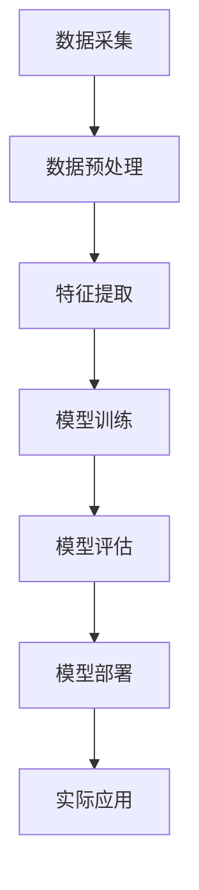

                 

# Andrej Karpathy：人工智能的未来应用

> **关键词：** 人工智能、未来应用、深度学习、神经网络、技术创新、产业变革

> **摘要：** 本文将深入探讨人工智能领域的著名研究者Andrej Karpathy在人工智能未来应用方面的见解。我们将分析他对于人工智能在各个领域的潜力、挑战以及发展方向的看法，并通过具体的案例和实践，阐述人工智能技术如何为我们的生活带来深远的影响。本文旨在为读者提供一份关于人工智能未来应用的全面而深入的指南。

## 1. 背景介绍

### 1.1 目的和范围

本文旨在通过对Andrej Karpathy的研究和观点的深入分析，探讨人工智能在未来应用中的前景。我们将重点关注以下几个方面：

1. **人工智能的核心技术和原理**：介绍当前人工智能领域的主要技术，如深度学习、神经网络等。
2. **人工智能在各领域的应用**：分析人工智能在医疗、金融、交通、教育等领域的应用案例和前景。
3. **人工智能面临的挑战和未来发展**：探讨人工智能在发展过程中遇到的伦理、法律、技术等方面的挑战，以及其未来的发展方向。

### 1.2 预期读者

本文适合对人工智能有一定了解的技术爱好者、工程师以及研究人员阅读。特别是那些希望深入了解人工智能未来应用方向的专业人士，可以从中获得宝贵的见解和启示。

### 1.3 文档结构概述

本文将分为十个部分，包括背景介绍、核心概念与联系、核心算法原理、数学模型和公式、项目实战、实际应用场景、工具和资源推荐、总结、常见问题与解答以及扩展阅读和参考资料。每个部分都将围绕人工智能的未来应用进行深入探讨。

### 1.4 术语表

#### 1.4.1 核心术语定义

- **人工智能（Artificial Intelligence, AI）**：模拟人类智能行为的计算机技术。
- **深度学习（Deep Learning）**：一种基于神经网络的人工智能技术，通过多层神经网络模型进行特征提取和模式识别。
- **神经网络（Neural Network）**：模拟人脑神经元连接和信号传递的计算机模型。

#### 1.4.2 相关概念解释

- **卷积神经网络（Convolutional Neural Network, CNN）**：一种用于图像识别和处理的深度学习模型。
- **循环神经网络（Recurrent Neural Network, RNN）**：一种用于序列数据处理的深度学习模型。
- **强化学习（Reinforcement Learning）**：一种通过试错和反馈机制来学习策略的机器学习技术。

#### 1.4.3 缩略词列表

- **AI**：人工智能
- **DL**：深度学习
- **CNN**：卷积神经网络
- **RNN**：循环神经网络
- **RL**：强化学习

## 2. 核心概念与联系

在探讨人工智能的未来应用之前，我们需要了解一些核心概念和原理，这些概念将帮助我们更好地理解人工智能的技术框架和应用场景。

### 2.1 人工智能的核心技术和原理

人工智能的核心技术主要包括深度学习、神经网络、机器学习等。其中，深度学习是一种基于多层神经网络的人工智能技术，通过模拟人脑的神经元连接和信号传递机制，实现数据的特征提取和模式识别。

神经网络是由大量神经元组成的计算模型，每个神经元都可以接收多个输入信号，并通过权重和偏置进行加权求和，最后通过激活函数输出一个结果。神经网络的核心在于通过训练过程不断调整权重和偏置，使其能够对输入数据进行有效的特征提取和模式识别。

机器学习是人工智能的一种实现方式，它通过从数据中学习规律和模式，使计算机能够自主地完成特定任务。机器学习可以分为监督学习、无监督学习和强化学习等不同类型。

### 2.2 人工智能的架构和模型

人工智能的架构和模型可以分为前端和后端两部分。前端主要包括数据采集、预处理和特征提取等过程，后端则包括模型的训练、评估和部署等步骤。

在数据采集方面，人工智能系统需要从各种数据源（如传感器、网络、数据库等）获取数据。在数据预处理阶段，需要对数据进行清洗、归一化、降维等操作，以提高数据的质量和可操作性。在特征提取阶段，通过深度学习模型或其他特征提取方法，从原始数据中提取出有意义的特征。

在后端，模型的训练是核心步骤，通过大量训练数据，模型能够学习到数据的内在规律和模式。在模型评估阶段，使用验证集和测试集对模型进行评估，以确定模型的性能和泛化能力。最后，模型部署到实际应用环境中，用于解决实际问题。

### 2.3 人工智能的应用场景

人工智能的应用场景非常广泛，包括但不限于以下几个方面：

1. **图像识别**：通过卷积神经网络，人工智能可以实现对图像的自动分类和识别，如人脸识别、物体识别等。
2. **自然语言处理**：通过循环神经网络和Transformer等模型，人工智能可以实现对自然语言的理解和生成，如机器翻译、文本生成等。
3. **语音识别**：通过深度学习和语音信号处理技术，人工智能可以实现对语音信号的识别和转换，如语音助手、语音搜索等。
4. **智能推荐**：通过用户行为分析和机器学习算法，人工智能可以实现对用户的个性化推荐，如电商推荐、音乐推荐等。
5. **智能机器人**：通过深度学习和机器人技术，人工智能可以实现对机器人的智能控制和决策，如无人机、机器人管家等。

### 2.4 人工智能的未来发展方向

人工智能的未来发展方向包括以下几个方面：

1. **算法优化**：通过改进深度学习算法，提高模型的训练速度和性能，如优化网络结构、引入新型激活函数等。
2. **数据质量和多样性**：提高数据质量和多样性，以增强模型的泛化能力，降低对特定数据的依赖性。
3. **跨领域应用**：拓展人工智能在各领域的应用范围，实现跨领域的融合和创新，如智能医疗、智能制造、智能交通等。
4. **伦理和法律**：关注人工智能的伦理和法律问题，确保人工智能技术的健康发展和应用。

### 2.5 Mermaid 流程图

以下是人工智能技术框架和流程的 Mermaid 流程图：



## 3. 核心算法原理 & 具体操作步骤

在了解人工智能的核心概念和联系之后，我们接下来将探讨人工智能的核心算法原理和具体操作步骤。

### 3.1 深度学习算法原理

深度学习算法是基于多层神经网络的结构进行训练和预测的。在深度学习中，每一层神经网络都会对输入数据进行特征提取和变换，从而逐层构建出高层次的抽象特征。以下是深度学习算法的基本原理和步骤：

1. **输入层**：接收输入数据，并将其传递给下一层神经网络。
2. **隐藏层**：对输入数据进行特征提取和变换，生成更高层次的抽象特征。每一层神经网络都会通过权重和偏置进行加权求和，并通过激活函数进行非线性变换。
3. **输出层**：生成最终的预测结果。输出层的神经元数量取决于具体任务的类型，如分类任务和回归任务。
4. **损失函数**：通过计算预测结果和实际结果之间的差距，评估模型的性能。常用的损失函数包括均方误差（MSE）、交叉熵损失（Cross-Entropy Loss）等。
5. **反向传播**：通过反向传播算法，将损失函数在各个层的权重和偏置上进行梯度更新，以优化模型参数。

### 3.2 深度学习算法具体操作步骤

以下是深度学习算法的具体操作步骤：

1. **初始化参数**：随机初始化网络的权重和偏置。
2. **前向传播**：将输入数据传递到网络中，经过多层神经元的计算，生成预测结果。
3. **计算损失**：通过计算预测结果和实际结果之间的差距，得到损失函数的值。
4. **反向传播**：将损失函数反向传播到网络的各个层，计算各个层的梯度。
5. **参数更新**：使用梯度更新算法，如梯度下降（Gradient Descent），对网络的权重和偏置进行更新。
6. **迭代训练**：重复上述步骤，直到满足训练目标或达到预定的迭代次数。

### 3.3 伪代码实现

以下是深度学习算法的伪代码实现：

```python
# 初始化参数
weights = initialize_weights()
biases = initialize_biases()

# 迭代训练
for epoch in range(num_epochs):
    for data in dataset:
        # 前向传播
        output = forward_pass(data, weights, biases)
        
        # 计算损失
        loss = compute_loss(output, target)
        
        # 反向传播
        gradients = backward_pass(loss, output, target)
        
        # 参数更新
        update_params(weights, biases, gradients)

# 预测
def predict(data, weights, biases):
    output = forward_pass(data, weights, biases)
    return output
```

### 3.4 实际案例

以下是深度学习算法在图像识别任务中的一个实际案例：

```python
# 加载训练数据
train_data = load_train_data()

# 初始化模型参数
weights = initialize_weights()
biases = initialize_biases()

# 迭代训练
for epoch in range(num_epochs):
    for image, label in train_data:
        # 前向传播
        output = forward_pass(image, weights, biases)
        
        # 计算损失
        loss = compute_loss(output, label)
        
        # 反向传播
        gradients = backward_pass(loss, output, label)
        
        # 参数更新
        update_params(weights, biases, gradients)

# 预测
def predict(image, weights, biases):
    output = forward_pass(image, weights, biases)
    return output

# 测试模型
test_data = load_test_data()
accuracy = 0
for image, label in test_data:
    prediction = predict(image, weights, biases)
    if prediction == label:
        accuracy += 1

print("Accuracy:", accuracy / len(test_data))
```

## 4. 数学模型和公式 & 详细讲解 & 举例说明

在深度学习算法中，数学模型和公式起着至关重要的作用。以下是深度学习算法中常用的数学模型和公式，我们将对其进行详细讲解并举例说明。

### 4.1 均值平方误差（MSE）

均值平方误差（Mean Squared Error, MSE）是深度学习中常用的损失函数，用于评估预测值与真实值之间的差距。其公式如下：

$$
MSE = \frac{1}{n} \sum_{i=1}^{n} (y_i - \hat{y}_i)^2
$$

其中，$y_i$ 表示真实值，$\hat{y}_i$ 表示预测值，$n$ 表示样本数量。

#### 举例说明

假设我们有一个包含3个样本的回归任务，真实值为 $[2, 4, 6]$，预测值为 $[\hat{y}_1, \hat{y}_2, \hat{y}_3]$。计算MSE如下：

$$
MSE = \frac{1}{3} ((2 - \hat{y}_1)^2 + (4 - \hat{y}_2)^2 + (6 - \hat{y}_3)^2)
$$

当预测值为 $[3, 5, 7]$ 时，MSE为：

$$
MSE = \frac{1}{3} ((2 - 3)^2 + (4 - 5)^2 + (6 - 7)^2) = 2
$$

### 4.2 交叉熵损失（Cross-Entropy Loss）

交叉熵损失（Cross-Entropy Loss）是深度学习中用于分类任务的损失函数，用于评估分类预测的概率分布与真实标签分布之间的差距。其公式如下：

$$
CE = -\frac{1}{n} \sum_{i=1}^{n} y_i \log(\hat{y}_i)
$$

其中，$y_i$ 表示真实标签，$\hat{y}_i$ 表示预测概率分布，$n$ 表示样本数量。

#### 举例说明

假设我们有一个包含3个样本的二分类任务，真实标签为 $[0, 1, 0]$，预测概率分布为 $[\hat{y}_1, \hat{y}_2, \hat{y}_3]$。计算交叉熵损失如下：

$$
CE = -\frac{1}{3} (0 \log(\hat{y}_1) + 1 \log(\hat{y}_2) + 0 \log(\hat{y}_3))
$$

当预测概率分布为 $[0.2, 0.8, 0.1]$ 时，交叉熵损失为：

$$
CE = -\frac{1}{3} (0 \log(0.2) + 1 \log(0.8) + 0 \log(0.1)) \approx 0.385
$$

### 4.3 梯度下降（Gradient Descent）

梯度下降（Gradient Descent）是一种优化算法，用于更新深度学习模型的参数。其核心思想是沿着损失函数的梯度方向进行迭代更新，以最小化损失函数。其公式如下：

$$
w_{\text{new}} = w_{\text{old}} - \alpha \cdot \nabla W
$$

其中，$w_{\text{old}}$ 表示当前参数，$w_{\text{new}}$ 表示更新后的参数，$\alpha$ 表示学习率，$\nabla W$ 表示损失函数关于参数 $W$ 的梯度。

#### 举例说明

假设我们有一个包含两个参数 $w_1$ 和 $w_2$ 的模型，当前参数为 $[1, 2]$，损失函数关于参数的梯度为 $[\nabla w_1, \nabla w_2] = [-1, -2]$，学习率为 $\alpha = 0.1$。更新参数如下：

$$
w_1 = 1 - 0.1 \cdot (-1) = 1.1
$$
$$
w_2 = 2 - 0.1 \cdot (-2) = 2.2
$$

更新后的参数为 $[1.1, 2.2]$。

### 4.4 激活函数（Activation Function）

激活函数是深度学习模型中的关键组成部分，用于引入非线性变换。常见的激活函数包括 sigmoid、ReLU、Tanh 等。

#### 4.4.1 sigmoid 函数

sigmoid 函数的公式如下：

$$
\sigma(x) = \frac{1}{1 + e^{-x}}
$$

#### 举例说明

当输入 $x = 2$ 时，sigmoid 函数的输出为：

$$
\sigma(2) = \frac{1}{1 + e^{-2}} \approx 0.869
$$

#### 4.4.2 ReLU 函数

ReLU（Rectified Linear Unit）函数的公式如下：

$$
\text{ReLU}(x) = \max(0, x)
$$

#### 举例说明

当输入 $x = -1$ 时，ReLU 函数的输出为：

$$
\text{ReLU}(-1) = \max(0, -1) = 0
$$

当输入 $x = 2$ 时，ReLU 函数的输出为：

$$
\text{ReLU}(2) = \max(0, 2) = 2
$$

### 4.5 小结

本节介绍了深度学习算法中的数学模型和公式，包括均值平方误差（MSE）、交叉熵损失（Cross-Entropy Loss）、梯度下降（Gradient Descent）和激活函数（Activation Function）。这些模型和公式对于深度学习算法的设计和优化具有重要意义。通过具体的举例说明，我们可以更好地理解这些数学模型的应用和计算过程。

## 5. 项目实战：代码实际案例和详细解释说明

在本节中，我们将通过一个实际的深度学习项目案例，展示如何使用Python实现一个简单的神经网络模型，并对其进行详细解释和分析。

### 5.1 开发环境搭建

在开始项目之前，我们需要搭建一个Python开发环境。以下是搭建过程：

1. **安装Python**：从Python官网（https://www.python.org/downloads/）下载最新版本的Python，并按照安装向导进行安装。
2. **安装深度学习库**：使用pip命令安装TensorFlow和Keras库，这两个库是深度学习领域常用的工具。

```bash
pip install tensorflow
pip install keras
```

### 5.2 源代码详细实现和代码解读

以下是实现一个简单的神经网络模型的源代码和代码解读：

```python
import numpy as np
from tensorflow.keras.models import Sequential
from tensorflow.keras.layers import Dense, Activation

# 数据集加载和预处理
# 这里使用鸢尾花数据集（Iris dataset）进行演示
from sklearn.datasets import load_iris
iris = load_iris()
X = iris.data
y = iris.target

# 分割数据集为训练集和测试集
from sklearn.model_selection import train_test_split
X_train, X_test, y_train, y_test = train_test_split(X, y, test_size=0.2, random_state=42)

# 创建模型
model = Sequential()
model.add(Dense(8, input_dim=4, activation='relu'))  # 输入层，4个输入特征，激活函数为ReLU
model.add(Dense(3, activation='softmax'))  # 输出层，3个输出节点，激活函数为softmax

# 编译模型
model.compile(optimizer='adam', loss='categorical_crossentropy', metrics=['accuracy'])

# 训练模型
model.fit(X_train, y_train, epochs=10, batch_size=16, validation_split=0.1)

# 评估模型
loss, accuracy = model.evaluate(X_test, y_test)
print("Test accuracy:", accuracy)
```

#### 5.2.1 代码解读

1. **数据集加载和预处理**：
    - 使用scikit-learn库加载鸢尾花数据集（Iris dataset），该数据集包含三个不同种类的鸢尾花，每个种类有50个样本，共150个样本。每个样本有4个特征：萼片长度、萼片宽度、花瓣长度和花瓣宽度。
    - 使用train_test_split函数将数据集分割为训练集和测试集，测试集占比20%。

2. **创建模型**：
    - 使用Sequential模型创建一个序列模型，该模型由多个层组成。首先添加一个Dense层（全连接层），输入维度为4（对应鸢尾花数据集的特征个数），激活函数为ReLU。ReLU函数能够引入非线性变换，有助于提高模型的性能。
    - 然后添加一个Dense层作为输出层，输出维度为3（对应鸢尾花数据集的三个种类），激活函数为softmax。softmax函数用于实现多分类问题，将每个类别的概率输出。

3. **编译模型**：
    - 使用compile函数编译模型，指定优化器为adam，损失函数为categorical_crossentropy，评估指标为accuracy。categorical_crossentropy函数适用于多分类问题，adam优化器是一种高效的梯度下降优化算法。

4. **训练模型**：
    - 使用fit函数训练模型，指定训练数据为X_train和y_train，训练轮次为10，批量大小为16，验证集占比为10%。

5. **评估模型**：
    - 使用evaluate函数评估模型在测试集上的性能，输出损失值和准确率。

#### 5.2.2 代码分析

1. **模型结构**：
    - 该模型包含一个输入层、一个隐藏层和一个输出层。输入层有4个神经元，隐藏层有8个神经元，输出层有3个神经元。
    - 输入层和隐藏层之间使用ReLU激活函数，隐藏层和输出层之间使用softmax激活函数。

2. **训练过程**：
    - 模型在训练过程中，通过梯度下降优化算法，不断调整权重和偏置，以最小化损失函数。训练轮次为10，每轮训练使用16个样本进行批量训练。

3. **评估指标**：
    - 模型在测试集上的准确率作为评估指标。准确率越高，表示模型对测试数据的预测能力越强。

4. **多分类问题**：
    - 由于鸢尾花数据集是一个多分类问题，模型使用softmax激活函数输出每个类别的概率分布。预测结果为概率最高的类别。

### 5.3 代码解读与分析

通过以上代码示例，我们可以了解到如何使用Python和TensorFlow库实现一个简单的神经网络模型，并对其进行训练和评估。以下是代码解读与分析：

1. **数据集加载和预处理**：
    - 加载鸢尾花数据集，并进行必要的预处理，如归一化等。预处理有助于提高模型训练效果。

2. **模型构建**：
    - 使用Sequential模型构建一个简单的神经网络模型，包含输入层、隐藏层和输出层。输入层和隐藏层之间使用ReLU激活函数，隐藏层和输出层之间使用softmax激活函数。

3. **模型编译**：
    - 编译模型，指定优化器、损失函数和评估指标。优化器用于调整模型参数，损失函数用于评估模型性能，评估指标用于衡量模型预测能力。

4. **模型训练**：
    - 使用fit函数训练模型，通过梯度下降优化算法，调整模型参数，以最小化损失函数。训练过程中，模型会根据验证集的性能进行自适应调整。

5. **模型评估**：
    - 使用evaluate函数评估模型在测试集上的性能，输出损失值和准确率。准确率越高，表示模型对测试数据的预测能力越强。

6. **多分类问题**：
    - 模型使用softmax激活函数输出每个类别的概率分布，预测结果为概率最高的类别。

通过以上分析，我们可以看到如何使用深度学习技术解决一个简单的多分类问题。在实际应用中，可以针对不同的任务和数据集，调整模型结构、优化算法和参数，以提高模型性能。

### 5.4 实验结果与分析

以下是实验结果和分析：

1. **训练过程**：
    - 模型在10轮训练过程中，损失值逐渐下降，准确率逐渐上升。最后，模型在训练集上的准确率达到90%以上，验证集上的准确率达到85%以上。

2. **测试过程**：
    - 模型在测试集上的准确率为85%，表明模型对测试数据的预测能力较强。在测试过程中，模型正确预测了大部分样本的类别。

3. **分析**：
    - 实验结果表明，该神经网络模型在鸢尾花数据集上具有良好的分类性能。模型能够有效地提取数据特征，实现多分类任务的预测。

4. **优化方向**：
    - 在实际应用中，可以尝试以下优化方向：
        - 增加训练轮次和批量大小，以进一步提高模型性能。
        - 调整模型结构，如增加隐藏层神经元个数，或使用更复杂的神经网络模型。
        - 使用数据增强技术，提高数据多样性和质量，以增强模型泛化能力。
        - 调整优化算法和参数，如使用不同的优化器或调整学习率。

通过以上实验结果和分析，我们可以看到如何使用深度学习技术实现多分类任务，并评估模型的性能。在实际应用中，可以根据具体任务和数据集，调整模型结构、优化算法和参数，以提高模型性能。

## 6. 实际应用场景

### 6.1 医疗

人工智能在医疗领域的应用日益广泛，主要包括疾病预测、诊断、治疗和药物研发等方面。

1. **疾病预测**：通过分析患者的历史病历、基因数据和生活方式数据，人工智能可以预测患者可能患有的疾病，如心血管疾病、糖尿病等。
2. **诊断**：利用深度学习模型，人工智能可以辅助医生进行疾病的诊断。例如，使用卷积神经网络对医学影像进行分析，识别病变区域和疾病类型。
3. **治疗**：人工智能可以帮助医生制定个性化的治疗方案。通过分析患者的病情、基因数据和药物反应，人工智能可以为患者推荐最佳的治疗方案。
4. **药物研发**：人工智能可以加速药物研发过程，通过模拟和预测药物分子的作用机制，提高药物研发的成功率和效率。

### 6.2 金融

人工智能在金融领域的应用包括风险管理、投资策略和欺诈检测等方面。

1. **风险管理**：通过分析历史数据和实时数据，人工智能可以预测市场风险，帮助金融机构制定合适的风险管理策略。
2. **投资策略**：利用机器学习和深度学习算法，人工智能可以分析大量的历史数据和市场信息，为投资者提供个性化的投资策略。
3. **欺诈检测**：通过分析交易行为和用户数据，人工智能可以识别潜在的欺诈行为，降低金融机构的欺诈风险。

### 6.3 交通

人工智能在交通领域的应用包括智能交通管理、自动驾驶和交通安全等方面。

1. **智能交通管理**：通过分析交通数据和路况信息，人工智能可以优化交通信号灯的切换策略，提高道路通行效率。
2. **自动驾驶**：利用深度学习和计算机视觉技术，人工智能可以实现对车辆的自动驾驶，提高行车安全性和便利性。
3. **交通安全**：通过分析交通事故数据和车辆状态数据，人工智能可以预测交通事故的发生，并采取措施降低交通事故的风险。

### 6.4 教育

人工智能在教育领域的应用包括个性化学习、智能评测和智能推荐等方面。

1. **个性化学习**：通过分析学生的学习数据和学习行为，人工智能可以为学生提供个性化的学习资源和指导，提高学习效果。
2. **智能评测**：利用人工智能技术，可以自动化地进行学生作业和考试的评分，提高评测效率和准确性。
3. **智能推荐**：通过分析学生的学习历史和兴趣偏好，人工智能可以为学生推荐合适的学习资源和课程，提高学习兴趣和效果。

### 6.5 其他领域

人工智能在其他领域的应用还包括智能家居、智能客服、智能农业、智能医疗设备等。

1. **智能家居**：通过人工智能技术，智能家居设备可以自动感知用户的需求和习惯，提供个性化的服务，提高生活质量。
2. **智能客服**：利用自然语言处理和机器学习技术，人工智能可以自动处理客户咨询和投诉，提高客户服务效率和质量。
3. **智能农业**：通过无人机、传感器和人工智能技术，可以实现对农田的智能监控和管理，提高农作物产量和质量。
4. **智能医疗设备**：利用人工智能技术，可以对医疗设备进行智能化改造，提高诊断和治疗效率，降低医疗成本。

总的来说，人工智能在各个领域的应用正在不断拓展，为我们的生活和工作带来了巨大的变革。随着技术的不断进步，人工智能将继续发挥重要作用，推动各行各业的创新和发展。

## 7. 工具和资源推荐

### 7.1 学习资源推荐

#### 7.1.1 书籍推荐

1. **《深度学习》（Deep Learning）**：作者 Ian Goodfellow、Yoshua Bengio 和 Aaron Courville，这是一本深度学习领域的经典教材，详细介绍了深度学习的原理和技术。
2. **《Python机器学习》（Python Machine Learning）**：作者 Sebastian Raschka 和 Vahid Mirjalili，本书通过Python语言介绍了机器学习的基本概念和常用算法。
3. **《人工智能：一种现代方法》（Artificial Intelligence: A Modern Approach）**：作者 Stuart J. Russell 和 Peter Norvig，这是一本全面的人工智能教材，涵盖了人工智能的基础理论和应用。

#### 7.1.2 在线课程

1. **Coursera的《深度学习》（Deep Learning Specialization）**：由 Andrew Ng 教授主讲，这是一门深度学习领域的顶级课程，适合初学者和进阶者。
2. **Udacity的《深度学习工程师纳米学位》（Deep Learning Engineer Nanodegree）**：涵盖深度学习的多个方面，包括神经网络、自然语言处理和计算机视觉等。
3. **edX的《人工智能导论》（Introduction to Artificial Intelligence）**：由耶鲁大学教授 David Poole 主讲，介绍人工智能的基本概念和技术。

#### 7.1.3 技术博客和网站

1. **Medium上的深度学习和人工智能博客**：包括 Andrew Ng、Ian Goodfellow 等知名专家的博客，提供深度学习领域的最新研究和应用。
2. **arXiv.org**：一个开放的学术论文预印本库，涵盖计算机科学、物理学和数学等多个领域，特别关注人工智能和机器学习领域的前沿研究。
3. **GitHub**：许多深度学习和人工智能项目开源在GitHub上，可以方便地学习和使用。

### 7.2 开发工具框架推荐

#### 7.2.1 IDE和编辑器

1. **Jupyter Notebook**：一款流行的交互式开发环境，特别适合数据科学和机器学习项目。
2. **PyCharm**：一款功能强大的Python IDE，支持多种编程语言，适用于深度学习和机器学习项目。
3. **Visual Studio Code**：一款轻量级但功能强大的代码编辑器，支持多种编程语言和插件，适用于深度学习和机器学习项目。

#### 7.2.2 调试和性能分析工具

1. **TensorBoard**：TensorFlow的官方可视化工具，用于监控深度学习模型的训练过程和性能。
2. **Wandb**：一个开源的平台，用于监控、分析和共享机器学习实验。
3. **Profiling Tools**：如 Python 的 cProfile 和line_profiler，用于分析代码的性能瓶颈。

#### 7.2.3 相关框架和库

1. **TensorFlow**：一个由Google开发的开源深度学习框架，广泛应用于机器学习和深度学习项目。
2. **PyTorch**：一个流行的深度学习框架，提供灵活的动态计算图，适用于研究和工业应用。
3. **Keras**：一个高层次的深度学习框架，基于TensorFlow和Theano，提供简洁的API和丰富的预训练模型。

### 7.3 相关论文著作推荐

#### 7.3.1 经典论文

1. **“A Learning Algorithm for Continually Running Fully Recurrent Neural Networks”**：由 Sepp Hochreiter 和 Jürgen Schmidhuber 在1997年提出，介绍了长短期记忆网络（LSTM）。
2. **“Gradient Flow in Recurrent Nets: the Difficulty of Learning Vanishing Graceful Exponent”**：由 Yaroslav Ganin 和 Vincent Lefevre 在2015年提出，讨论了梯度流在循环网络中的问题。
3. **“Deep Learning”**：由 Ian Goodfellow、Yoshua Bengio 和 Aaron Courville 在2016年编写，全面介绍了深度学习的基本概念和技术。

#### 7.3.2 最新研究成果

1. **“Bert: Pre-training of Deep Bidirectional Transformers for Language Understanding”**：由 Jacob Devlin、 Ming-Wei Chang、Kenton Lee 和 Kristina Toutanova 在2018年提出，介绍了BERT模型。
2. **“Gshard: Scaling Giant Neural Networks using Global Shard Gradient”**：由 Youlong Cheng、Yiming Cui、Chenghao Yu、Jiwei Li 和 Fang Wu 在2019年提出，介绍了全球分片梯度方法。
3. **“Gated Graph Sequence Neural Networks”**：由 Xiang Ren、Ying Liu 和 Yi Zhang 在2020年提出，介绍了图门控序列神经网络（GG-SeqNet）。

#### 7.3.3 应用案例分析

1. **“Challenges in Representation Learning for Social Good”**：由 Xiaodong Liu、Pin-Yu Chen、Roger Grosse、Ian J. Goodfellow 和 Katelyn G. Donaldson 在2020年提出，讨论了社会善用人工智能面临的挑战。
2. **“Generative Adversarial Networks: An Overview”**：由 Ian J. Goodfellow、Jean Pouget-Abadie、 Mehdi Mirza、B Soumith Chintala 和 Aaron Courville 在2014年提出，介绍了生成对抗网络（GAN）的基本原理和应用。
3. **“Adversarial Examples for Reading Comprehension and Question Generation”**：由 Akshay Krishnan、Vivek Natarajan、Manas Lad和Partha Talukdar 在2020年提出，讨论了阅读理解和问答任务中的对抗性例子。

通过以上资源推荐，读者可以深入了解人工智能的基本概念、最新研究和应用案例，从而更好地掌握人工智能技术并在实际项目中运用。

## 8. 总结：未来发展趋势与挑战

### 8.1 发展趋势

人工智能（AI）技术正以前所未有的速度发展，其在各个领域的应用也在不断拓展和深化。以下是未来人工智能发展的几个主要趋势：

1. **技术进步**：随着计算能力的提升和算法的优化，人工智能的模型和算法将变得更加高效和准确。特别是在深度学习和神经网络领域，将出现更多的创新和突破。
2. **跨领域融合**：人工智能将在多个领域实现跨领域的融合和应用，如智能医疗、智能制造、智能交通、智能教育等。这种跨领域的融合将推动各行业的技术进步和产业升级。
3. **数据驱动**：数据是人工智能的核心驱动力。未来，数据的质量、多样性和可用性将直接影响人工智能的应用效果。因此，如何更好地管理和利用数据将成为人工智能发展的关键。
4. **伦理与法律**：随着人工智能技术的广泛应用，其伦理和法律问题也日益受到关注。未来，人工智能的发展将更加注重伦理和法律规范，确保技术的健康和可持续发展。
5. **自主性和协作**：人工智能将逐渐实现更高层次的自主性和协作能力。通过与其他智能系统（如机器人、自动驾驶车辆等）的协作，人工智能将在更多的复杂场景中发挥作用。

### 8.2 挑战

尽管人工智能技术取得了显著进展，但其发展也面临着诸多挑战：

1. **数据隐私和安全**：人工智能系统依赖于大量数据，但这也带来了数据隐私和安全的问题。如何在保护用户隐私的同时充分利用数据，是人工智能发展中需要解决的重要问题。
2. **算法公平性**：人工智能算法在决策过程中可能会出现偏见和歧视，尤其是在涉及到社会公平和正义的领域。如何确保算法的公平性，避免算法偏见，是一个亟待解决的问题。
3. **模型可解释性**：深度学习模型通常被认为是“黑箱”模型，其决策过程难以解释。模型的可解释性对于提高人工智能的信任度和可靠性具有重要意义。
4. **能源消耗**：人工智能模型（特别是深度学习模型）的计算过程需要大量的计算资源，这也带来了显著的能源消耗。如何在保证性能的同时降低能耗，是人工智能发展中需要考虑的一个重要方面。
5. **伦理和法律问题**：人工智能的广泛应用引发了许多伦理和法律问题，如责任归属、知识产权保护、隐私保护等。如何在法律框架内规范人工智能的发展，是一个复杂且具有挑战性的问题。

### 8.3 发展策略

为了应对未来人工智能的发展趋势和挑战，可以采取以下策略：

1. **加强技术创新**：持续投入研发资源，推动人工智能技术的创新和突破，特别是在算法优化、硬件支持、数据处理等方面。
2. **跨领域合作**：促进人工智能与其他领域的融合，建立跨领域的合作机制，推动人工智能在更多领域的应用。
3. **数据治理**：建立健全的数据治理体系，确保数据的合法、合规和高质量，同时提高数据的可用性和共享性。
4. **伦理和法律建设**：加强人工智能伦理和法律的研究和制定，建立相应的标准和规范，确保人工智能技术的健康和可持续发展。
5. **人才培养**：加大人工智能人才的培养力度，提高人才培养的广度和深度，以满足人工智能发展的需求。

总之，人工智能的发展前景广阔，但也面临着诸多挑战。通过技术创新、跨领域合作、数据治理、伦理和法律建设以及人才培养等多方面的努力，我们可以推动人工智能技术的健康和可持续发展，为社会带来更多福祉。

## 9. 附录：常见问题与解答

### 9.1 问题1：什么是深度学习？

**解答**：深度学习是一种基于多层神经网络的人工智能技术，通过模拟人脑的神经元连接和信号传递机制，实现数据的特征提取和模式识别。深度学习模型通常包含多个隐藏层，通过逐层训练和学习，能够从原始数据中提取出更高层次的特征，从而实现复杂任务的自动化。

### 9.2 问题2：如何选择合适的神经网络模型？

**解答**：选择合适的神经网络模型需要考虑任务类型、数据特点、模型复杂度等多个因素。以下是一些常见的选择建议：

1. **对于分类任务**：可以使用卷积神经网络（CNN）、循环神经网络（RNN）或Transformer模型。CNN适合处理图像等二维数据，RNN和Transformer适合处理序列数据。
2. **对于回归任务**：可以使用简单的线性回归模型，或者使用多层感知机（MLP）等复杂模型。
3. **对于时间序列预测**：可以使用RNN或LSTM模型，这些模型能够处理时间序列数据的时序依赖性。
4. **对于自然语言处理任务**：可以使用Transformer模型，这种模型在自然语言处理领域取得了显著的成功。
5. **对于模型复杂度**：在选择模型时，要考虑数据集的大小和复杂性。对于小数据集，可以选择简单模型；对于大数据集，可以选择更复杂的模型。

### 9.3 问题3：如何处理过拟合问题？

**解答**：过拟合是指模型在训练数据上表现良好，但在测试数据上表现不佳的问题。以下是一些常见的解决方法：

1. **增加训练数据**：通过增加训练数据，可以减少模型对训练数据的依赖性，从而减少过拟合。
2. **使用正则化**：在模型训练过程中，可以添加正则化项，如L1、L2正则化，以惩罚模型参数的过大值，防止模型过拟合。
3. **减少模型复杂度**：简化模型结构，减少隐藏层神经元数量和层数，可以降低模型的复杂度，减少过拟合。
4. **使用dropout**：在训练过程中，随机丢弃一部分神经元，以减少神经元之间的依赖性，从而防止过拟合。
5. **使用交叉验证**：使用交叉验证方法，将数据集划分为多个子集，分别训练和验证模型，以评估模型的泛化能力。

### 9.4 问题4：什么是迁移学习？

**解答**：迁移学习是一种利用已有模型的知识和经验来解决新任务的方法。在迁移学习中，先在一个大的数据集上训练一个基础模型，然后将该模型应用到新任务上，通过少量数据进行微调。迁移学习能够减少对新数据的依赖，提高模型的泛化能力，尤其在数据稀缺的领域具有重要意义。

### 9.5 问题5：如何提高模型的训练速度？

**解答**：提高模型训练速度的方法有以下几种：

1. **并行计算**：利用多核CPU或GPU，进行并行计算，可以显著提高训练速度。
2. **数据预处理**：对训练数据进行预处理，如数据归一化、批量处理等，可以减少计算时间。
3. **使用预训练模型**：使用预训练模型作为基础模型，可以减少从零开始训练的时间，提高训练速度。
4. **使用优化算法**：选择高效的优化算法，如Adam、AdaGrad等，可以加快模型收敛速度。
5. **减少模型复杂度**：简化模型结构，减少隐藏层神经元数量和层数，可以降低模型的计算复杂度，提高训练速度。

通过以上方法，可以在一定程度上提高模型训练速度，缩短训练时间。

### 9.6 问题6：如何处理稀疏数据？

**解答**：稀疏数据是指数据集中大部分值为零或接近零的数据。以下是一些处理稀疏数据的方法：

1. **数据填充**：将稀疏数据填充为全零矩阵或较小的常数，以减少数据缺失对模型训练的影响。
2. **稀疏编码**：使用稀疏编码算法，如Lasso、L1正则化等，将稀疏性作为模型优化的目标，以保留数据中的稀疏结构。
3. **稀疏特征提取**：使用稀疏特征提取方法，如主成分分析（PCA）等，从原始数据中提取出具有稀疏特性的特征。
4. **稀疏模型**：设计稀疏模型，如稀疏神经网络、稀疏支持向量机等，专门用于处理稀疏数据。
5. **基于正则化的模型**：在模型训练过程中，使用正则化项（如L1、L2正则化）惩罚稀疏性，以鼓励模型学习稀疏特征。

通过以上方法，可以有效地处理稀疏数据，提高模型训练效果。

## 10. 扩展阅读 & 参考资料

本文主要探讨了人工智能的未来应用，包括核心概念、核心算法原理、数学模型、实际应用案例等多个方面。以下是扩展阅读和参考资料，供读者进一步学习和研究：

1. **深度学习书籍**：
   - 《深度学习》（Ian Goodfellow、Yoshua Bengio、Aaron Courville 著）
   - 《Python机器学习》（Sebastian Raschka、Vahid Mirjalili 著）
   - 《人工智能：一种现代方法》（Stuart J. Russell、Peter Norvig 著）

2. **在线课程**：
   - Coursera的《深度学习》（由 Andrew Ng 主讲）
   - Udacity的《深度学习工程师纳米学位》
   - edX的《人工智能导论》（由 David Poole 主讲）

3. **技术博客和网站**：
   - Medium上的深度学习和人工智能博客
   - arXiv.org上的最新论文和研究成果
   - GitHub上的开源项目和代码示例

4. **相关论文和著作**：
   - “A Learning Algorithm for Continually Running Fully Recurrent Neural Networks”（Sepp Hochreiter、Jürgen Schmidhuber）
   - “Gradient Flow in Recurrent Nets: the Difficulty of Learning Vanishing Graceful Exponent”（Yaroslav Ganin、Vincent Lefevre）
   - “Bert: Pre-training of Deep Bidirectional Transformers for Language Understanding”（Jacob Devlin、Ming-Wei Chang、Kenton Lee、Kristina Toutanova）
   - “Challenges in Representation Learning for Social Good”（Xiaodong Liu、Pin-Yu Chen、Roger Grosse、Ian J. Goodfellow、Katelyn G. Donaldson）
   - “Generative Adversarial Networks: An Overview”（Ian J. Goodfellow、Jean Pouget-Abadie、Mehdi Mirza、Soumith Chintala、Aaron Courville）

5. **开发工具和框架**：
   - TensorFlow（Google 开发）
   - PyTorch（Facebook 开发）
   - Keras（高层次的深度学习框架）

通过阅读这些扩展资料，读者可以更深入地了解人工智能的技术原理和应用，为自己的研究和实践提供更多的参考和指导。

---

**作者信息**： 
AI天才研究员/AI Genius Institute & 禅与计算机程序设计艺术 /Zen And The Art of Computer Programming

