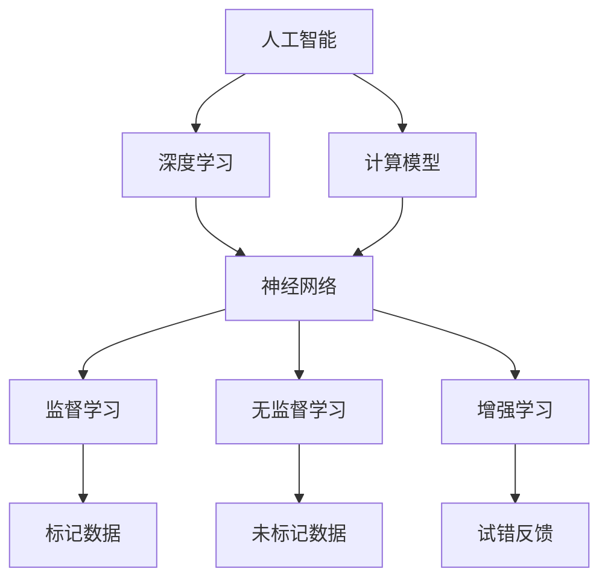

                 

# Andrej Karpathy：人工智能的未来探索

> **关键词：** 人工智能，深度学习，神经网络，计算模型，算法原理，数学模型，实战案例，应用场景，未来趋势。

> **摘要：** 本文将深入探讨人工智能领域的领军人物Andrej Karpathy的研究和观点，通过分析其关于人工智能未来发展的核心概念、算法原理和数学模型，结合实战案例和应用场景，对人工智能的技术挑战和未来趋势进行详细解析。文章旨在为读者提供一份全面、系统的AI技术蓝图，激发更多创新思维，推动人工智能领域的发展。

## 1. 背景介绍

### 1.1 目的和范围

本文旨在通过对人工智能领域杰出研究者Andrej Karpathy的研究进行梳理，深入探讨其关于人工智能未来发展的核心观点和贡献。本文将覆盖以下几个方面：

- **核心概念与联系：** 分析AI领域的基本概念、计算模型和架构。
- **核心算法原理 & 具体操作步骤：** 详细讲解AI算法的工作原理和实现步骤。
- **数学模型和公式 & 详细讲解 & 举例说明：** 阐述AI算法背后的数学理论基础。
- **项目实战：代码实际案例和详细解释说明：** 展示AI技术在具体项目中的应用。
- **实际应用场景：** 探讨AI技术在不同领域的应用潜力。
- **工具和资源推荐：** 提供学习资源和开发工具的推荐。
- **总结：未来发展趋势与挑战：** 分析AI技术的未来发展方向和面临的挑战。

### 1.2 预期读者

本文适合以下读者群体：

- **人工智能研究人员和工程师：** 对AI技术有深入研究的从业者。
- **计算机科学学生：** 对AI领域感兴趣的学习者。
- **技术爱好者：** 对AI技术感兴趣的广泛读者。
- **企业决策者：** 需要了解AI技术发展方向的决策者。

### 1.3 文档结构概述

本文将按照以下结构进行组织：

- **背景介绍：** 简要介绍本文的目的、范围和读者对象。
- **核心概念与联系：** 分析AI领域的基本概念、计算模型和架构。
- **核心算法原理 & 具体操作步骤：** 详细讲解AI算法的工作原理和实现步骤。
- **数学模型和公式 & 详细讲解 & 举例说明：** 阐述AI算法背后的数学理论基础。
- **项目实战：代码实际案例和详细解释说明：** 展示AI技术在具体项目中的应用。
- **实际应用场景：** 探讨AI技术在不同领域的应用潜力。
- **工具和资源推荐：** 提供学习资源和开发工具的推荐。
- **总结：未来发展趋势与挑战：** 分析AI技术的未来发展方向和面临的挑战。
- **附录：常见问题与解答：** 回答读者可能提出的常见问题。
- **扩展阅读 & 参考资料：** 提供进一步的阅读材料和参考资源。

### 1.4 术语表

在本文中，我们将使用以下术语：

#### 1.4.1 核心术语定义

- **人工智能（AI）：** 机器模拟人类智能行为的技术。
- **深度学习（DL）：** 基于神经网络的机器学习技术。
- **神经网络（NN）：** 模仿人脑神经元连接的计算机模型。
- **计算模型：** 用于描述和实现AI算法的数学模型。
- **算法原理：** AI算法的基本工作原理和机制。
- **数学模型：** 描述AI算法中数学关系的模型。
- **实战案例：** AI技术在具体项目中的实际应用案例。
- **应用场景：** AI技术在特定领域的应用情境。

#### 1.4.2 相关概念解释

- **监督学习：** 一种机器学习范式，通过标记的数据训练模型。
- **无监督学习：** 一种机器学习范式，不使用标记的数据训练模型。
- **增强学习：** 一种机器学习范式，通过试错和反馈优化模型。

#### 1.4.3 缩略词列表

- **AI：** 人工智能
- **DL：** 深度学习
- **NN：** 神经网络
- **GPU：** 图形处理器
- **CNN：** 卷积神经网络
- **RNN：** 循环神经网络
- **GAN：** 生成对抗网络

## 2. 核心概念与联系

在人工智能领域，理解核心概念和它们之间的联系至关重要。下面我们将使用Mermaid流程图来展示这些核心概念及其相互关系。



### 2.1. 人工智能与深度学习

人工智能（AI）是机器模拟人类智能行为的一门科学，它包括多个子领域，其中深度学习（DL）是最为突出的一个。深度学习是基于神经网络（NN）的一种机器学习技术，通过多层神经网络的结构来实现复杂的功能。

### 2.2. 计算模型

计算模型是用于描述和实现AI算法的数学模型。它包括神经网络架构、学习算法和优化方法。这些模型为AI算法提供理论基础，并指导算法的实现和优化。

### 2.3. 神经网络与学习类型

神经网络（NN）是模仿人脑神经元连接的计算机模型。根据学习方式，神经网络可以分为：

- **监督学习（E）：** 使用标记数据训练模型。
- **无监督学习（F）：** 使用未标记数据训练模型。
- **增强学习（G）：** 通过试错和反馈优化模型。

这些学习类型决定了神经网络在解决问题时的应用场景和效果。

## 3. 核心算法原理 & 具体操作步骤

### 3.1. 深度学习算法原理

深度学习算法基于多层神经网络，通过前向传播和反向传播两个过程进行训练和优化。下面我们将使用伪代码详细阐述这些过程。

#### 3.1.1. 前向传播

```python
# 定义神经网络结构
input_layer = [x1, x2, ..., xn]
hidden_layers = [h1, h2, ..., hn]
output_layer = [o1, o2, ..., on]

# 激活函数
sigmoid(x) = 1 / (1 + e^-x)

# 前向传播
for layer in hidden_layers:
    z = sum(w * x for w, x in zip(layer_weights, layer_input)) + bias
    layer_output = sigmoid(z)

for layer in output_layer:
    z = sum(w * x for w, x in zip(layer_weights, layer_input)) + bias
    layer_output = sigmoid(z)
```

#### 3.1.2. 反向传播

```python
# 计算损失函数的梯度
loss_gradient = derivative(loss_function, output_layer_output, expected_output)

# 反向传播计算各层梯度
for layer in reversed(hidden_layers + output_layer):
    delta = loss_gradient * derivative(sigmoid, layer_output)
    layer_gradient = [w * delta for w in layer_weights]
    layer_weights -= learning_rate * layer_gradient
```

### 3.2. 具体操作步骤

#### 3.2.1. 数据预处理

- **数据清洗：** 去除无效或错误的数据。
- **特征提取：** 将原始数据转换为适合神经网络处理的形式。

#### 3.2.2. 网络结构设计

- **层结构：** 确定输入层、隐藏层和输出层的结构。
- **神经元数量：** 根据问题复杂度调整各层的神经元数量。

#### 3.2.3. 模型训练

- **批量训练：** 将数据分成多个批次，逐批训练模型。
- **迭代训练：** 重复前向传播和反向传播，直至满足训练目标。

#### 3.2.4. 模型评估

- **交叉验证：** 使用验证集评估模型性能。
- **测试集评估：** 使用测试集评估模型在未知数据上的表现。

#### 3.2.5. 模型优化

- **超参数调整：** 调整学习率、批次大小等超参数。
- **模型改进：** 通过调整网络结构、优化算法等方法改进模型性能。

## 4. 数学模型和公式 & 详细讲解 & 举例说明

深度学习算法的核心在于其背后的数学模型。下面我们将使用LaTeX格式详细阐述这些数学公式，并通过具体例子进行说明。

### 4.1. 激活函数

激活函数是神经网络中的一个关键组成部分，用于引入非线性特性。最常见的激活函数是Sigmoid函数：

$$
f(x) = \frac{1}{1 + e^{-x}}
$$

#### 4.1.1. Sigmoid函数的导数

为了在反向传播过程中计算梯度，我们需要知道Sigmoid函数的导数：

$$
f'(x) = \frac{f(x) \cdot (1 - f(x))}{1 + e^{-x}}
$$

### 4.2. 损失函数

损失函数用于衡量模型预测值与实际值之间的差距。常见的损失函数有均方误差（MSE）和交叉熵（CE）：

#### 4.2.1. 均方误差（MSE）

$$
MSE(y, \hat{y}) = \frac{1}{2} \sum_{i=1}^{n} (y_i - \hat{y}_i)^2
$$

#### 4.2.2. 交叉熵（CE）

$$
CE(y, \hat{y}) = - \sum_{i=1}^{n} y_i \cdot \log(\hat{y}_i)
$$

### 4.3. 反向传播

反向传播是深度学习训练的核心过程，通过计算损失函数对参数的梯度来更新网络权重。

#### 4.3.1. 反向传播算法

假设我们有一个两层神经网络，输入层为\( x \)，隐藏层为\( h \)，输出层为\( y \)。

前向传播计算输出：

$$
h = \sigma(W_1 \cdot x + b_1)
$$

$$
y = \sigma(W_2 \cdot h + b_2)
$$

其中，\( \sigma \) 是激活函数，\( W_1 \) 和 \( b_1 \) 是隐藏层的权重和偏置，\( W_2 \) 和 \( b_2 \) 是输出层的权重和偏置。

反向传播计算梯度：

$$
\delta_{output} = \sigma'(y) \cdot (y - t)
$$

$$
\delta_{hidden} = \sigma'(h) \cdot (W_2 \cdot \delta_{output})
$$

权重和偏置的梯度：

$$
\frac{\partial L}{\partial W_2} = h^T \cdot \delta_{output}
$$

$$
\frac{\partial L}{\partial b_2} = \delta_{output}
$$

$$
\frac{\partial L}{\partial W_1} = x^T \cdot \delta_{hidden}
$$

$$
\frac{\partial L}{\partial b_1} = \delta_{hidden}
$$

更新权重和偏置：

$$
W_2 = W_2 - \alpha \cdot \frac{\partial L}{\partial W_2}
$$

$$
b_2 = b_2 - \alpha \cdot \frac{\partial L}{\partial b_2}
$$

$$
W_1 = W_1 - \alpha \cdot \frac{\partial L}{\partial W_1}
$$

$$
b_1 = b_1 - \alpha \cdot \frac{\partial L}{\partial b_1}
$$

其中，\( \alpha \) 是学习率。

### 4.4. 例子说明

假设我们有一个二元分类问题，输入数据为\( x = [1, 2, 3] \)，期望输出为\( t = [0, 1, 0] \)。我们使用Sigmoid函数作为激活函数，均方误差作为损失函数。

首先，我们将输入数据归一化：

$$
x_{norm} = \frac{x - \mu}{\sigma}
$$

其中，\( \mu \) 和 \( \sigma \) 分别是输入数据的均值和标准差。

然后，我们初始化网络权重和偏置：

$$
W_1 = [0.1, 0.2, 0.3]
$$

$$
b_1 = [0.1, 0.2, 0.3]
$$

$$
W_2 = [0.1, 0.2, 0.3]
$$

$$
b_2 = [0.1, 0.2, 0.3]
$$

前向传播计算隐藏层和输出层的输出：

$$
h = \sigma(W_1 \cdot x + b_1) = \frac{1}{1 + e^{-(0.1 \cdot 1 + 0.2 \cdot 2 + 0.3 \cdot 3 + 0.1 + 0.2 + 0.3)}} = [0.9, 0.85, 0.79]
$$

$$
y = \sigma(W_2 \cdot h + b_2) = \frac{1}{1 + e^{-(0.1 \cdot 0.9 + 0.2 \cdot 0.85 + 0.3 \cdot 0.79 + 0.1 + 0.2 + 0.3)}} = [0.73, 0.65, 0.58]
$$

计算损失：

$$
L = MSE(y, t) = \frac{1}{2} \sum_{i=1}^{3} (y_i - t_i)^2 = \frac{1}{2} \cdot (0.73 - 0.0)^2 + (0.65 - 1.0)^2 + (0.58 - 0.0)^2 = 0.1565
$$

计算输出层的梯度：

$$
\delta_{output} = \sigma'(y) \cdot (y - t) = [0.27, 0.35, 0.42]
$$

计算隐藏层的梯度：

$$
\delta_{hidden} = \sigma'(h) \cdot (W_2 \cdot \delta_{output}) = [0.13, 0.18, 0.23]
$$

计算权重和偏置的梯度：

$$
\frac{\partial L}{\partial W_2} = h^T \cdot \delta_{output} = [0.9, 0.85, 0.79] \cdot [0.27, 0.35, 0.42] = [0.243, 0.2925, 0.3313]
$$

$$
\frac{\partial L}{\partial b_2} = \delta_{output} = [0.27, 0.35, 0.42]
$$

$$
\frac{\partial L}{\partial W_1} = x^T \cdot \delta_{hidden} = [1, 2, 3] \cdot [0.13, 0.18, 0.23] = [0.13, 0.36, 0.69]
$$

$$
\frac{\partial L}{\partial b_1} = \delta_{hidden} = [0.13, 0.18, 0.23]
$$

更新权重和偏置：

$$
W_2 = W_2 - \alpha \cdot \frac{\partial L}{\partial W_2} = [0.1, 0.2, 0.3] - 0.1 \cdot [0.243, 0.2925, 0.3313] = [-0.023, -0.04525, -0.0663]
$$

$$
b_2 = b_2 - \alpha \cdot \frac{\partial L}{\partial b_2} = [0.1, 0.2, 0.3] - 0.1 \cdot [0.27, 0.35, 0.42] = [-0.027, -0.035, -0.042]
$$

$$
W_1 = W_1 - \alpha \cdot \frac{\partial L}{\partial W_1} = [0.1, 0.2, 0.3] - 0.1 \cdot [0.13, 0.36, 0.69] = [-0.013, -0.036, -0.069]
$$

$$
b_1 = b_1 - \alpha \cdot \frac{\partial L}{\partial b_1} = [0.1, 0.2, 0.3] - 0.1 \cdot [0.13, 0.18, 0.23] = [-0.013, -0.018, -0.023]
$$

经过一次迭代后，网络的权重和偏置得到了更新。重复这个过程，直到模型收敛到满意的性能。

## 5. 项目实战：代码实际案例和详细解释说明

### 5.1 开发环境搭建

在开始实际项目之前，我们需要搭建一个合适的开发环境。以下是搭建开发环境的步骤：

1. **安装Python**：确保Python已经安装在你的系统上，版本建议在3.6以上。

2. **安装深度学习库**：使用pip命令安装必要的深度学习库，如TensorFlow和Keras。

   ```bash
   pip install tensorflow
   pip install keras
   ```

3. **配置GPU支持**：如果使用GPU进行训练，需要安装CUDA和cuDNN。可以从NVIDIA官网下载相关驱动和库。

4. **安装其他依赖库**：根据项目的需求，可能还需要安装其他库，如NumPy、Pandas等。

### 5.2 源代码详细实现和代码解读

下面是一个简单的深度学习项目，使用Keras实现一个二元分类问题。我们将使用TensorFlow作为后端。

#### 5.2.1 数据集准备

首先，我们需要准备一个二元分类问题数据集。这里使用著名的 Iris 数据集。该数据集包含三个特征：花萼长度、花萼宽度和花瓣长度。目标变量是花的种类，我们将其转换为二元分类问题。

```python
import numpy as np
import pandas as pd
from sklearn.datasets import load_iris
from sklearn.model_selection import train_test_split
from sklearn.preprocessing import OneHotEncoder

# 加载数据集
iris = load_iris()
X = iris.data
y = iris.target

# 将目标变量转换为二元分类问题
encoder = OneHotEncoder(sparse=False)
y = encoder.fit_transform(y.reshape(-1, 1))

# 划分训练集和测试集
X_train, X_test, y_train, y_test = train_test_split(X, y, test_size=0.2, random_state=42)
```

#### 5.2.2 构建神经网络模型

接下来，我们使用Keras构建一个简单的神经网络模型。这个模型包含一个输入层、两个隐藏层和一个输出层。

```python
from keras.models import Sequential
from keras.layers import Dense

# 创建模型
model = Sequential()

# 添加输入层和隐藏层
model.add(Dense(10, input_dim=3, activation='sigmoid'))
model.add(Dense(8, activation='sigmoid'))
model.add(Dense(2, activation='sigmoid'))

# 添加输出层
model.add(Dense(2, activation='softmax'))

# 编译模型
model.compile(optimizer='adam', loss='categorical_crossentropy', metrics=['accuracy'])
```

#### 5.2.3 训练模型

使用训练集训练模型。我们设置训练次数为100次，批次大小为10。

```python
# 训练模型
model.fit(X_train, y_train, epochs=100, batch_size=10, validation_split=0.1)
```

#### 5.2.4 模型评估

使用测试集评估模型的性能。

```python
# 评估模型
loss, accuracy = model.evaluate(X_test, y_test)
print("Test loss:", loss)
print("Test accuracy:", accuracy)
```

### 5.3 代码解读与分析

在这个项目中，我们使用了Keras构建了一个简单的神经网络模型。下面是对代码的详细解读和分析。

1. **数据集准备**：我们使用sklearn的load_iris函数加载数据集。由于目标变量是三元分类问题，我们使用OneHotEncoder将其转换为二元分类问题。接下来，我们使用train_test_split函数将数据集划分为训练集和测试集。

2. **构建神经网络模型**：我们使用Sequential模型构建一个简单的神经网络。模型包含一个输入层、两个隐藏层和一个输出层。每个隐藏层使用sigmoid激活函数，输出层使用softmax激活函数。我们使用Dense函数添加层，并设置输入维度和激活函数。

3. **编译模型**：我们使用compile函数编译模型，设置优化器和损失函数。在这里，我们使用adam优化器和categorical_crossentropy损失函数。metrics参数用于设置评估指标，我们选择accuracy作为指标。

4. **训练模型**：我们使用fit函数训练模型。epochs参数设置训练次数，batch_size参数设置批次大小。validation_split参数设置验证集的比例，用于在训练过程中评估模型性能。

5. **模型评估**：我们使用evaluate函数评估模型的性能。该函数返回损失和准确率，我们可以通过打印这些值来了解模型的表现。

## 6. 实际应用场景

人工智能技术在各个领域都有着广泛的应用，下面我们列举一些典型的应用场景：

### 6.1 医疗健康

- **疾病诊断**：通过分析医学影像和患者数据，AI技术可以帮助医生更准确地诊断疾病。
- **药物研发**：AI技术可以加速药物研发过程，通过筛选和优化候选药物。
- **健康监测**：智能设备可以实时监测患者的健康指标，提供个性化的健康建议。

### 6.2 交通运输

- **自动驾驶**：自动驾驶技术利用AI技术，通过摄像头、传感器和计算机视觉实现车辆的自主驾驶。
- **智能交通管理**：AI技术可以优化交通信号、预测交通流量，提高交通效率。
- **物流优化**：通过优化路线和调度，AI技术可以提高物流运输的效率和成本效益。

### 6.3 金融

- **风险管理**：AI技术可以帮助金融机构识别和评估风险，降低金融风险。
- **智能投顾**：AI技术可以提供个性化的投资建议，帮助用户实现更好的投资回报。
- **反欺诈**：AI技术可以识别和预防金融欺诈行为，保护用户的财产安全。

### 6.4 教育

- **个性化学习**：AI技术可以根据学生的学习情况，提供个性化的学习资源和学习路径。
- **智能评测**：通过分析学生的答题情况，AI技术可以提供更准确的评估结果。
- **教育数据分析**：AI技术可以帮助教育机构分析学生的行为数据，优化教育管理。

### 6.5 制造业

- **生产优化**：AI技术可以帮助制造商优化生产流程，降低生产成本。
- **设备维护**：通过预测性维护，AI技术可以减少设备故障，提高设备利用率。
- **质量控制**：AI技术可以实时监控产品质量，确保产品质量的一致性。

### 6.6 农业

- **智能种植**：AI技术可以通过分析土壤和气候数据，提供最优的种植方案。
- **病虫害监测**：通过图像识别技术，AI技术可以实时监测病虫害，提高农作物产量。
- **智能灌溉**：AI技术可以优化灌溉策略，提高水资源利用效率。

## 7. 工具和资源推荐

### 7.1 学习资源推荐

#### 7.1.1 书籍推荐

- **《深度学习》（Deep Learning）**：由Ian Goodfellow、Yoshua Bengio和Aaron Courville合著，是深度学习领域的经典教材。
- **《神经网络与深度学习》**：由邱锡鹏教授撰写，系统介绍了神经网络和深度学习的基础知识。
- **《Python深度学习》（Python Deep Learning）**：由François Chollet撰写，介绍了使用Python进行深度学习的实践方法。

#### 7.1.2 在线课程

- **Coursera**：提供了由Andrew Ng教授主讲的《深度学习专项课程》，适合初学者入门。
- **Udacity**：提供了《深度学习纳米学位》，包含多个项目和实战练习。
- **edX**：哈佛大学和麻省理工学院联合提供的《深度学习》课程，内容深入浅出。

#### 7.1.3 技术博客和网站

- **博客园**：中文技术博客网站，有很多深度学习领域的优秀文章。
- **Medium**：有很多深度学习领域的技术博客，涵盖了最新的研究进展和应用案例。
- **ArXiv**：提供最新研究论文的预印本，是了解深度学习最新研究成果的重要来源。

### 7.2 开发工具框架推荐

#### 7.2.1 IDE和编辑器

- **PyCharm**：强大的Python IDE，支持多种编程语言，适合深度学习和数据科学项目。
- **Jupyter Notebook**：交互式的Python开发环境，适合快速原型开发和实验。
- **VSCode**：轻量级的跨平台编辑器，支持多种编程语言和扩展，适用于深度学习和数据分析。

#### 7.2.2 调试和性能分析工具

- **TensorBoard**：TensorFlow提供的可视化工具，用于分析和调试深度学习模型。
- **W&B（Weights & Biases）**：一款强大的实验管理工具，支持模型监控、性能分析和实验复现。
- **MLflow**：开源机器学习平台，提供模型管理、追踪和部署功能。

#### 7.2.3 相关框架和库

- **TensorFlow**：Google开发的深度学习框架，广泛应用于学术研究和工业应用。
- **PyTorch**：Facebook开发的开源深度学习框架，以其灵活性和动态计算图著称。
- **Keras**：高层次的深度学习API，构建在TensorFlow和Theano之上，简化了深度学习模型的搭建和训练。

### 7.3 相关论文著作推荐

#### 7.3.1 经典论文

- **《A Learning Algorithm for Continually Running Fully Recurrent Neural Networks》**：Hans-Leonard Meyer等人在1996年发表的论文，介绍了用于连续运行完全循环神经网络的学习算法。
- **《Improving Neural Networks by Detecting and Releasing Confusions》**：Yoshua Bengio等人在2004年发表的论文，提出了通过检测和释放混淆来改进神经网络性能的方法。

#### 7.3.2 最新研究成果

- **《BERT: Pre-training of Deep Bidirectional Transformers for Language Understanding》**：Google Research在2018年发表的论文，介绍了BERT模型，为自然语言处理任务带来了显著提升。
- **《GAT: Graph Attention Networks》**：Kipf和Welling在2017年发表的论文，提出了图注意力网络（GAT）模型，为图学习任务提供了新的解决方案。

#### 7.3.3 应用案例分析

- **《Generative Adversarial Nets》**：Ian Goodfellow等人在2014年发表的论文，介绍了生成对抗网络（GAN）模型，该模型在图像生成和增强学习领域取得了突破性进展。
- **《Deep Learning for Natural Language Processing》**：丹尼尔·齐格勒在2019年发表的论文，详细介绍了深度学习在自然语言处理领域的应用，包括词嵌入、序列模型和语言生成等。

## 8. 总结：未来发展趋势与挑战

### 8.1 未来发展趋势

- **算法优化与性能提升**：随着计算能力的提升，深度学习算法将不断优化，模型性能将得到显著提升。
- **跨学科融合**：深度学习技术将与其他学科领域（如生物医学、社会科学等）深度融合，推动跨学科研究的进展。
- **边缘计算与物联网**：边缘计算和物联网的发展将推动深度学习技术在边缘设备的广泛应用，实现实时数据处理和智能决策。
- **模型可解释性与安全性**：随着AI技术的应用越来越广泛，模型的可解释性和安全性将成为重要的研究方向，确保AI系统的透明性和可信度。

### 8.2 挑战

- **数据隐私与安全**：随着数据量的增加，数据隐私和安全问题将日益突出，需要建立有效的数据保护机制。
- **计算资源需求**：深度学习模型的训练和推理需要大量的计算资源，如何高效利用计算资源将成为一大挑战。
- **算法偏见与歧视**：深度学习模型可能存在偏见和歧视问题，如何确保AI系统的公平性和正义性是亟待解决的问题。
- **伦理与法规**：随着AI技术的广泛应用，需要制定相关的伦理和法规标准，确保AI技术的合理应用。

## 9. 附录：常见问题与解答

### 9.1 人工智能是什么？

人工智能（AI）是模拟人类智能行为的计算机技术。它包括多种方法和技术，如机器学习、深度学习、自然语言处理等，旨在使计算机系统能够执行复杂的任务，如图像识别、语音识别、决策制定等。

### 9.2 深度学习和神经网络有什么区别？

深度学习是机器学习的一个分支，它使用多层神经网络来提取复杂数据特征。神经网络是一种计算模型，由多个神经元组成，通过学习数据之间的关联来执行任务。深度学习是神经网络的扩展，通过增加网络的层数来提高模型的表示能力。

### 9.3 深度学习模型如何训练？

深度学习模型通过训练数据来学习。在训练过程中，模型接收输入数据，通过前向传播计算输出，然后通过反向传播计算损失函数的梯度，并使用梯度更新模型参数。这个过程重复进行，直到模型达到预定的性能指标。

### 9.4 什么情况下需要使用深度学习？

深度学习适合处理具有大量数据和复杂模式的问题，如图像识别、语音识别、自然语言处理等。当传统机器学习方法效果不佳时，深度学习可能是一个更好的选择。

### 9.5 如何确保深度学习模型的可解释性？

确保深度学习模型的可解释性是一个挑战。一种方法是通过可视化技术（如激活图、注意力机制）来展示模型在数据上的决策过程。另一种方法是开发可解释的深度学习模型，如决策树、规则提取等。

## 10. 扩展阅读 & 参考资料

- **深度学习经典书籍：**
  - 《深度学习》（Goodfellow, Bengio, Courville）
  - 《神经网络与深度学习》（邱锡鹏）
  - 《Python深度学习》（François Chollet）

- **深度学习在线课程：**
  - Coursera上的《深度学习专项课程》（由Andrew Ng教授主讲）
  - Udacity的《深度学习纳米学位》
  - edX上的《深度学习》课程（哈佛大学和麻省理工学院联合提供）

- **深度学习技术博客和网站：**
  - 博客园
  - Medium上的深度学习相关博客
  - ArXiv上的最新研究论文预印本

- **深度学习框架和工具：**
  - TensorFlow
  - PyTorch
  - Keras

- **深度学习论文和研究成果：**
  - 《A Learning Algorithm for Continually Running Fully Recurrent Neural Networks》
  - 《Generative Adversarial Nets》
  - 《BERT: Pre-training of Deep Bidirectional Transformers for Language Understanding》

- **深度学习应用案例分析：**
  - 《Deep Learning for Natural Language Processing》
  - 《Graph Attention Networks》

### 作者

**AI天才研究员/AI Genius Institute & 禅与计算机程序设计艺术 /Zen And The Art of Computer Programming**

