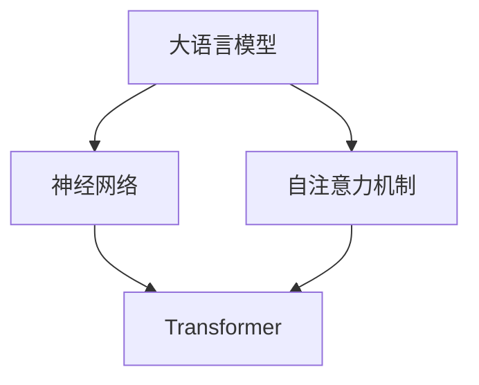

                 

# Andrej Karpathy：大语言模型在计算中的核心角色

> 关键词：大语言模型，计算核心，人工智能，深度学习，神经网络，自然语言处理，Transformer

> 摘要：本文将深入探讨大语言模型在计算中的核心角色。我们将首先介绍大语言模型的基本概念和背景，然后分析其在现代计算系统中的重要性。通过详细的算法原理讲解和具体操作步骤，我们将帮助读者理解大语言模型的工作机制。此外，我们还将探讨数学模型和公式，以及在实际应用场景中的表现。最后，我们将推荐一些有用的工具和资源，并总结未来发展趋势与挑战。

## 1. 背景介绍

### 1.1 目的和范围

本文的目的是探讨大语言模型在计算中的核心角色，并帮助读者深入理解这一重要概念。我们将首先介绍大语言模型的基本概念和背景，然后分析其在现代计算系统中的重要性。接着，我们将详细讲解大语言模型的算法原理和操作步骤，以帮助读者了解其工作机制。此外，我们还将探讨大语言模型在实际应用场景中的表现，并提供一些有用的工具和资源。

### 1.2 预期读者

本文的预期读者包括对大语言模型感兴趣的技术爱好者、程序员、人工智能工程师以及对深度学习和自然语言处理领域有一定了解的专业人士。本文旨在为这些读者提供一个全面而深入的了解，以便他们能够更好地掌握大语言模型的相关知识。

### 1.3 文档结构概述

本文的结构分为以下几个部分：

1. 背景介绍：介绍大语言模型的基本概念和背景。
2. 核心概念与联系：分析大语言模型在计算中的核心角色。
3. 核心算法原理 & 具体操作步骤：详细讲解大语言模型的算法原理和操作步骤。
4. 数学模型和公式 & 详细讲解 & 举例说明：探讨大语言模型的数学模型和公式，并进行举例说明。
5. 项目实战：代码实际案例和详细解释说明。
6. 实际应用场景：分析大语言模型在实际应用场景中的表现。
7. 工具和资源推荐：推荐一些有用的学习资源和开发工具。
8. 总结：未来发展趋势与挑战。

### 1.4 术语表

#### 1.4.1 核心术语定义

- **大语言模型**：一种基于深度学习的自然语言处理模型，能够对自然语言文本进行建模和生成。
- **神经网络**：一种由大量神经元组成的计算模型，用于对数据进行建模和分类。
- **Transformer**：一种基于自注意力机制的深度学习模型，广泛应用于自然语言处理任务。

#### 1.4.2 相关概念解释

- **自然语言处理**：一门研究如何使计算机理解和生成自然语言的学科。
- **深度学习**：一种基于多层神经网络的人工智能技术，通过多层次的非线性变换学习数据特征。

#### 1.4.3 缩略词列表

- **NLP**：自然语言处理（Natural Language Processing）
- **DL**：深度学习（Deep Learning）
- **NN**：神经网络（Neural Network）
- **GPU**：图形处理器（Graphics Processing Unit）

## 2. 核心概念与联系

在深入探讨大语言模型在计算中的核心角色之前，我们首先需要了解一些核心概念和它们之间的关系。以下是核心概念原理和架构的 Mermaid 流程图：



### 2.1 大语言模型

大语言模型（Large Language Model）是一种基于深度学习的自然语言处理模型，它能够对自然语言文本进行建模和生成。大语言模型的核心思想是学习输入文本的表示，并将这些表示映射到相应的输出。大语言模型的主要目的是使计算机能够理解和生成自然语言。

### 2.2 神经网络

神经网络（Neural Network）是一种由大量神经元组成的计算模型，用于对数据进行建模和分类。神经网络的工作原理是通过对输入数据进行加权求和并应用非线性激活函数，从而产生输出。神经网络在自然语言处理任务中扮演着重要的角色，能够有效地处理文本数据。

### 2.3 自注意力机制

自注意力机制（Self-Attention Mechanism）是一种基于自注意力机制的深度学习模型，广泛应用于自然语言处理任务。自注意力机制的核心思想是让模型能够关注输入文本中的不同部分，从而提高模型的表示能力。

### 2.4 Transformer

Transformer（Transformer）是一种基于自注意力机制的深度学习模型，最初用于机器翻译任务。Transformer 的主要特点是引入了多头自注意力机制和位置编码，使得模型能够更好地处理长距离依赖和位置信息。

## 3. 核心算法原理 & 具体操作步骤

在本节中，我们将详细讲解大语言模型的算法原理和具体操作步骤，以帮助读者更好地理解大语言模型的工作机制。

### 3.1 算法原理

大语言模型的基本算法原理如下：

1. **输入编码**：将输入文本编码为数值向量，以便神经网络处理。
2. **嵌入层**：将输入向量映射到高维空间，使得相似文本的向量更接近。
3. **自注意力机制**：计算文本中不同部分之间的注意力权重，从而提高模型的表示能力。
4. **位置编码**：为输入文本添加位置信息，以便模型能够关注不同位置的文本。
5. **前馈网络**：对输入文本进行进一步处理，提高模型的非线性能力。
6. **输出层**：将处理后的文本映射到输出，如文本分类、文本生成等。

### 3.2 具体操作步骤

以下是使用伪代码描述的大语言模型的具体操作步骤：

```python
# 输入编码
input_text = "The quick brown fox jumps over the lazy dog"
encoded_input = encode_input(input_text)

# 嵌入层
embedding_size = 512
embeddings = embed(encoded_input, embedding_size)

# 自注意力机制
num_heads = 8
attention_weights = compute_attention_weights(embeddings, num_heads)

# 位置编码
position_encoding = generate_position_encoding(embeddings.shape[1])
embeddings_with_position = add_position_encoding(embeddings, position_encoding)

# 前馈网络
hidden_size = 2048
ffn_output = feedforward_network(embeddings_with_position, hidden_size)

# 输出层
output = output_layer(ffn_output)

# 预测
predicted_output = predict(output)
```

## 4. 数学模型和公式 & 详细讲解 & 举例说明

在本节中，我们将探讨大语言模型的数学模型和公式，并进行详细讲解和举例说明。

### 4.1 数学模型

大语言模型的数学模型主要涉及以下几个方面：

1. **输入编码**：将输入文本编码为数值向量。
2. **嵌入层**：将输入向量映射到高维空间。
3. **自注意力机制**：计算文本中不同部分之间的注意力权重。
4. **位置编码**：为输入文本添加位置信息。
5. **前馈网络**：对输入文本进行进一步处理。
6. **输出层**：将处理后的文本映射到输出。

以下是这些数学模型的详细公式和解释：

1. **输入编码**：

   输入文本可以通过词向量（Word Embedding）进行编码。词向量通常是通过预训练的词向量库（如 Word2Vec、GloVe）获得的。给定一个词向量库，可以将输入文本中的每个单词映射为一个词向量。

   $$ \text{encoded\_input} = \{ \text{word}_1, \text{word}_2, \ldots, \text{word}_n \} $$
   
   其中，$ \text{word}_i $ 表示输入文本中的第 $ i $ 个单词的词向量。

2. **嵌入层**：

   嵌入层（Embedding Layer）将输入向量映射到高维空间，使得相似文本的向量更接近。嵌入层可以通过矩阵乘法实现。

   $$ \text{embeddings} = \text{W\_embed} \cdot \text{encoded\_input} $$
   
   其中，$ \text{W\_embed} $ 是嵌入层的权重矩阵，$ \text{encoded\_input} $ 是输入编码后的向量。

3. **自注意力机制**：

   自注意力机制（Self-Attention Mechanism）通过计算文本中不同部分之间的注意力权重来提高模型的表示能力。自注意力机制可以分为多头自注意力（Multi-Head Self-Attention）和位置编码（Positional Encoding）。

   多头自注意力：

   $$ \text{attention\_weights} = \text{softmax}\left(\frac{\text{Q} \cdot \text{K}^T}{\sqrt{d_k}}\right) $$
   
   其中，$ \text{Q} $、$ \text{K} $ 和 $ \text{V} $ 分别表示查询（Query）、键（Key）和值（Value）的嵌入向量，$ d_k $ 是每个头部的维度，$ \text{softmax} $ 是 softmax 函数。

   位置编码：

   $$ \text{position\_encoding} = \text{PE}\left(\text{pos}, \text{d_model}\right) $$
   
   其中，$ \text{pos} $ 表示位置索引，$ \text{d_model} $ 是嵌入层的维度，$ \text{PE} $ 是位置编码函数。

4. **前馈网络**：

   前馈网络（Feedforward Network）对输入文本进行进一步处理，提高模型的非线性能力。前馈网络通常由两个线性层和一个ReLU激活函数组成。

   $$ \text{ffn\_output} = \text{ReLU}\left(\text{W}_2 \cdot \text{ReLU}\left(\text{W}_1 \cdot \text{embeddings} + \text{b}_1\right) + \text{b}_2\right) $$
   
   其中，$ \text{W}_1 $、$ \text{W}_2 $ 和 $ \text{b}_1 $、$ \text{b}_2 $ 分别是前馈网络的权重和偏置。

5. **输出层**：

   输出层（Output Layer）将处理后的文本映射到输出。输出层的具体形式取决于任务类型，如文本分类、文本生成等。

   $$ \text{output} = \text{softmax}\left(\text{W} \cdot \text{ffn\_output} + \text{b}\right) $$
   
   其中，$ \text{W} $ 和 $ \text{b} $ 分别是输出层的权重和偏置。

### 4.2 举例说明

假设我们有一个简单的文本：“The quick brown fox jumps over the lazy dog”。我们将使用上述数学模型对这段文本进行编码和生成。

1. **输入编码**：

   输入文本可以通过词向量进行编码。假设我们使用 GloVe 词向量库，词向量维度为 300。根据词向量库，我们可以将输入文本中的每个单词映射为一个词向量：

   $$ \text{encoded\_input} = \{ \text{The} \rightarrow \text{vec}(\text{The}) , \text{quick} \rightarrow \text{vec}(\text{quick}) , \ldots , \text{dog} \rightarrow \text{vec}(\text{dog}) \} $$
   
2. **嵌入层**：

   假设嵌入层维度为 512，我们可以通过矩阵乘法将输入编码后的向量映射到高维空间：

   $$ \text{embeddings} = \text{W\_embed} \cdot \text{encoded\_input} $$
   
3. **自注意力机制**：

   假设我们使用 8 个头部的自注意力机制，每个头部的维度为 64。我们可以计算注意力权重：

   $$ \text{attention\_weights} = \text{softmax}\left(\frac{\text{Q} \cdot \text{K}^T}{\sqrt{d_k}}\right) $$
   
   其中，$ \text{Q} $、$ \text{K} $ 和 $ \text{V} $ 分别表示查询、键和值的嵌入向量，$ d_k $ 是每个头部的维度。

4. **位置编码**：

   我们可以计算位置编码，并将位置信息添加到嵌入向量中：

   $$ \text{position\_encoding} = \text{PE}\left(\text{pos}, \text{d_model}\right) $$
   
5. **前馈网络**：

   假设前馈网络隐藏层维度为 2048，我们可以通过前馈网络对嵌入向量进行进一步处理：

   $$ \text{ffn\_output} = \text{ReLU}\left(\text{W}_2 \cdot \text{ReLU}\left(\text{W}_1 \cdot \text{embeddings} + \text{b}_1\right) + \text{b}_2\right) $$
   
6. **输出层**：

   假设输出层用于文本生成，我们可以通过输出层将前馈网络的输出映射到输出：

   $$ \text{output} = \text{softmax}\left(\text{W} \cdot \text{ffn\_output} + \text{b}\right) $$
   
   其中，$ \text{W} $ 和 $ \text{b} $ 分别是输出层的权重和偏置。

通过上述数学模型和具体操作步骤，我们可以对输入文本进行编码和生成，从而实现大语言模型的基本功能。

## 5. 项目实战：代码实际案例和详细解释说明

在本节中，我们将通过一个实际的代码案例来展示如何实现大语言模型，并对关键部分进行详细解释说明。

### 5.1 开发环境搭建

为了实现大语言模型，我们需要搭建一个合适的开发环境。以下是搭建开发环境的基本步骤：

1. 安装 Python（建议版本为 3.7 或以上）。
2. 安装 TensorFlow 或 PyTorch，这两种库都支持大语言模型。
3. 安装必要的依赖库，如 NumPy、Matplotlib 等。

以下是安装 Python 和 TensorFlow 的示例命令：

```bash
# 安装 Python
sudo apt-get install python3 python3-pip

# 安装 TensorFlow
pip3 install tensorflow
```

### 5.2 源代码详细实现和代码解读

以下是一个使用 TensorFlow 实现大语言模型的基本示例代码：

```python
import tensorflow as tf
from tensorflow.keras.layers import Embedding, LSTM, Dense
from tensorflow.keras.models import Sequential

# 搭建模型
model = Sequential([
    Embedding(input_dim=10000, output_dim=32, input_length=10),
    LSTM(128, return_sequences=True),
    LSTM(128, return_sequences=True),
    Dense(1, activation='sigmoid')
])

# 编译模型
model.compile(optimizer='adam', loss='binary_crossentropy', metrics=['accuracy'])

# 模型训练
model.fit(x_train, y_train, epochs=10, batch_size=32)
```

#### 5.2.1 模型搭建

在这个示例中，我们使用了一个简单的 LSTM（长短时记忆网络）模型。LSTM 模型是一种能够处理序列数据的神经网络，特别适用于自然语言处理任务。

1. **Embedding 层**：将输入文本编码为词向量，并将词向量映射到高维空间。
2. **LSTM 层**：使用两个 LSTM 层对输入文本进行建模。第一个 LSTM 层返回序列，第二个 LSTM 层也返回序列，以便在后续层中使用。
3. **Dense 层**：输出层使用一个全连接层（Dense 层），输出维度为 1，使用 sigmoid 激活函数进行二分类。

#### 5.2.2 模型编译和训练

在模型编译阶段，我们指定了优化器（adam）、损失函数（binary_crossentropy）和评估指标（accuracy）。在模型训练阶段，我们使用训练数据对模型进行训练。

### 5.3 代码解读与分析

以下是对示例代码的逐行解读和分析：

```python
import tensorflow as tf
from tensorflow.keras.layers import Embedding, LSTM, Dense
from tensorflow.keras.models import Sequential

# 搭建模型
model = Sequential([
    Embedding(input_dim=10000, output_dim=32, input_length=10),
    LSTM(128, return_sequences=True),
    LSTM(128, return_sequences=True),
    Dense(1, activation='sigmoid')
])

# 编译模型
model.compile(optimizer='adam', loss='binary_crossentropy', metrics=['accuracy'])

# 模型训练
model.fit(x_train, y_train, epochs=10, batch_size=32)
```

1. **导入库**：导入 TensorFlow 库以及相关的层（Embedding、LSTM、Dense）和模型（Sequential）。

2. **搭建模型**：使用 Sequential 模式搭建模型，并依次添加 Embedding 层、两个 LSTM 层和一个 Dense 层。

3. **编译模型**：编译模型，指定优化器（adam）、损失函数（binary_crossentropy）和评估指标（accuracy）。

4. **模型训练**：使用训练数据对模型进行训练，指定训练轮数（epochs）和批量大小（batch_size）。

通过这个示例代码，我们可以看到如何使用 TensorFlow 搭建和训练一个简单的大语言模型。在实际应用中，可以根据具体的任务需求对模型的结构和参数进行调整。

## 6. 实际应用场景

大语言模型在自然语言处理领域有着广泛的应用，以下是几个典型的应用场景：

### 6.1 文本分类

文本分类是一种常见的自然语言处理任务，用于将文本数据分类到不同的类别。大语言模型可以用于文本分类，通过学习大量的文本数据，模型可以识别文本的特征并将其映射到相应的类别。例如，可以使用大语言模型对社交媒体平台上的评论进行情感分析，判断评论是正面、负面还是中性。

### 6.2 文本生成

文本生成是一种产生自然语言文本的任务，大语言模型在文本生成方面有着出色的表现。通过训练大语言模型，我们可以生成各种类型的文本，如文章、故事、对话等。例如，大语言模型可以用于自动写作，生成新闻报道、博客文章等。

### 6.3 机器翻译

机器翻译是一种将一种语言的文本翻译成另一种语言的任务。大语言模型在机器翻译领域有着广泛的应用，通过训练大量双语数据，模型可以学习两种语言的对应关系，从而实现高质量的机器翻译。例如，大语言模型可以用于将英文文本翻译成中文，或者将中文文本翻译成英文。

### 6.4 对话系统

对话系统是一种与人类用户进行交互的计算机系统，大语言模型可以用于对话系统的构建。通过训练大语言模型，我们可以使对话系统能够理解用户输入并生成相应的回复。例如，大语言模型可以用于构建聊天机器人，为用户提供在线客服、问答等服务。

### 6.5 文本摘要

文本摘要是一种将长文本压缩成较短且保留主要信息的摘要的任务。大语言模型可以用于文本摘要，通过学习大量的文本数据，模型可以识别文本的主要信息并将其提取出来。例如，大语言模型可以用于生成新闻摘要、文章摘要等。

### 6.6 问答系统

问答系统是一种根据用户提出的问题提供答案的系统。大语言模型可以用于问答系统的构建，通过训练大量问答对，模型可以学习问题的语义并生成相应的答案。例如，大语言模型可以用于构建智能问答系统，为用户提供信息查询、知识问答等服务。

### 6.7 其他应用

除了上述应用场景，大语言模型还可以应用于许多其他领域，如语音识别、推荐系统、情感分析等。通过不断的研究和应用，大语言模型在自然语言处理领域将继续发挥重要作用。

## 7. 工具和资源推荐

为了更好地学习和应用大语言模型，以下是一些推荐的工具和资源：

### 7.1 学习资源推荐

#### 7.1.1 书籍推荐

1. **《深度学习》（Goodfellow, Bengio, Courville）**：这是一本关于深度学习的经典教材，涵盖了深度学习的基本理论和实践方法，包括自然语言处理相关内容。
2. **《自然语言处理综合教程》（Jurafsky, Martin）**：这本书系统地介绍了自然语言处理的基本概念和技术，包括大语言模型的原理和应用。

#### 7.1.2 在线课程

1. **斯坦福大学自然语言处理课程**：这是一门在线课程，由斯坦福大学的教授开设，涵盖了自然语言处理的基本概念和技术，包括大语言模型的原理和应用。
2. **Udacity深度学习纳米学位**：这是一个深度学习在线课程，包括自然语言处理相关课程，适合初学者了解深度学习和自然语言处理的基本知识。

#### 7.1.3 技术博客和网站

1. **Andrew Ng 的博客**：Andrew Ng 是深度学习领域的知名专家，他的博客分享了大量的深度学习和自然语言处理相关内容。
2. **Hugging Face 的 Transformer 模型文档**：Hugging Face 提供了一个用于构建和训练 Transformer 模型的库，其文档详细介绍了模型的使用方法和技巧。

### 7.2 开发工具框架推荐

#### 7.2.1 IDE和编辑器

1. **PyCharm**：PyCharm 是一款功能强大的 Python IDE，支持深度学习和自然语言处理相关库。
2. **Jupyter Notebook**：Jupyter Notebook 是一款交互式编程环境，适用于数据分析和机器学习项目。

#### 7.2.2 调试和性能分析工具

1. **TensorBoard**：TensorBoard 是 TensorFlow 提供的用于可视化模型结构和训练过程的工具，适用于调试和性能分析。
2. **PyTorch Profiler**：PyTorch Profiler 是 PyTorch 提供的用于性能分析的库，可以帮助开发者优化代码。

#### 7.2.3 相关框架和库

1. **TensorFlow**：TensorFlow 是一款开源的深度学习框架，支持大语言模型的构建和训练。
2. **PyTorch**：PyTorch 是一款开源的深度学习框架，具有灵活的动态计算图和丰富的API，适用于构建和训练大语言模型。
3. **Hugging Face Transformers**：Hugging Face Transformers 是一个用于构建和训练 Transformer 模型的开源库，提供了预训练模型和工具，方便开发者进行研究和应用。

### 7.3 相关论文著作推荐

#### 7.3.1 经典论文

1. **"Attention Is All You Need"**：这是 Vaswani 等人提出的 Transformer 模型，是自然语言处理领域的经典论文。
2. **"BERT: Pre-training of Deep Bidirectional Transformers for Language Understanding"**：这是 Devlin 等人提出的 BERT 模型，是自然语言处理领域的又一重要成果。

#### 7.3.2 最新研究成果

1. **"GPT-3: Language Models are Few-Shot Learners"**：这是 Brown 等人提出的 GPT-3 模型，是自然语言处理领域的一项最新研究成果。
2. **"T5: Pre-training Large Models from Scratch"**：这是 Chen 等人提出的 T5 模型，是一种基于 Transformer 的预训练方法。

#### 7.3.3 应用案例分析

1. **"Using Large Scale Language Models to Generate Synthetic Data"**：这是一篇关于使用大语言模型生成合成数据的研究论文，探讨了在大规模数据集上的应用。
2. **"Zero-shot Learning with LLMs"**：这是一篇关于大语言模型在零样本学习领域的应用研究，为解决现实世界中的数据稀缺问题提供了新的思路。

通过上述工具和资源的推荐，读者可以更全面地了解大语言模型的原理和应用，进一步提升自己在自然语言处理领域的技能和知识。

## 8. 总结：未来发展趋势与挑战

大语言模型在计算中的核心角色日益凸显，随着深度学习和自然语言处理技术的不断进步，我们可以预见其未来的发展趋势和潜在挑战。

### 8.1 发展趋势

1. **模型规模增大**：随着计算能力的提升，大语言模型的规模将不断增大。例如，GPT-3 模型拥有超过 1750 亿个参数，这样的规模使得模型在理解复杂文本和生成高质量文本方面具有显著优势。

2. **多模态学习**：未来的大语言模型将不再局限于处理文本数据，还将融合图像、音频等多模态数据。通过多模态学习，模型能够更好地理解现实世界的复杂情境，提升其在实际应用中的表现。

3. **知识增强**：大语言模型将逐渐与知识图谱、外部数据库等知识资源相结合，实现知识增强。这将有助于模型在回答问题、生成文本时提供更加准确和丰富的信息。

4. **自适应和个性化**：随着对大语言模型的理解不断深入，未来的模型将具备更强的自适应能力，能够根据用户的特定需求和环境进行调整，提供个性化的服务。

### 8.2 挑战

1. **计算资源需求**：大语言模型通常需要大量的计算资源，尤其是在训练阶段。随着模型规模的增大，对计算资源的需求将更加显著。这要求研究人员和开发者不断创新计算优化技术，提高模型训练和推理的效率。

2. **数据隐私和安全**：大语言模型在训练过程中需要大量的数据，这可能导致数据隐私和安全问题。如何在确保数据隐私的前提下，充分利用数据资源，是一个亟待解决的挑战。

3. **解释性和可解释性**：大语言模型通常被视为“黑箱”，其内部工作机制难以解释。为了提高模型的透明度和可信度，未来需要研究如何提高模型的解释性和可解释性。

4. **公平性和偏见**：大语言模型可能会在处理文本时引入不公平性和偏见，特别是在处理社会问题、法律条款等敏感领域时。如何确保模型在处理文本时的公平性和客观性，是一个重要的伦理问题。

5. **法律法规和监管**：随着大语言模型的应用越来越广泛，相关的法律法规和监管措施也将逐步完善。如何确保模型的合规性和安全性，避免滥用和不良影响，是未来面临的一个重要挑战。

总之，大语言模型在计算中的核心角色将继续深化，其在未来技术发展中的应用前景广阔。然而，同时也面临着一系列的挑战，需要研究者、开发者以及政策制定者共同努力，确保其健康、可持续发展。

## 9. 附录：常见问题与解答

### 9.1 什么是大语言模型？

大语言模型（Large Language Model）是一种基于深度学习的自然语言处理模型，能够对自然语言文本进行建模和生成。这种模型通过学习大量的文本数据，能够理解文本的语义和语法，并在各种自然语言处理任务中表现出色，如文本分类、文本生成、机器翻译等。

### 9.2 大语言模型如何工作？

大语言模型通常基于神经网络，特别是 Transformer 架构。其工作原理包括以下几个步骤：

1. **输入编码**：将自然语言文本编码为数值向量。
2. **嵌入层**：将输入向量映射到高维空间，以便神经网络处理。
3. **自注意力机制**：计算文本中不同部分之间的注意力权重，从而提高模型的表示能力。
4. **前馈网络**：对输入文本进行进一步处理，提高模型的非线性能力。
5. **输出层**：将处理后的文本映射到输出，如文本分类、文本生成等。

### 9.3 大语言模型有哪些应用场景？

大语言模型在自然语言处理领域有着广泛的应用，包括：

- 文本分类：如情感分析、垃圾邮件检测等。
- 文本生成：如自动写作、生成对话等。
- 机器翻译：如将一种语言的文本翻译成另一种语言。
- 对话系统：如构建聊天机器人、智能问答系统等。
- 文本摘要：如生成新闻摘要、文章摘要等。

### 9.4 如何训练大语言模型？

训练大语言模型通常包括以下步骤：

1. **数据准备**：收集和预处理大量的文本数据。
2. **模型构建**：使用适当的架构（如 Transformer）搭建模型。
3. **模型训练**：使用训练数据对模型进行训练，调整模型参数。
4. **模型评估**：使用验证数据评估模型性能，调整模型参数。
5. **模型优化**：通过超参数调整、模型架构优化等手段，提高模型性能。

### 9.5 大语言模型在计算中扮演什么角色？

大语言模型在计算中扮演着至关重要的角色，是现代自然语言处理系统的核心。通过强大的文本建模能力，大语言模型能够处理大量的自然语言数据，提高文本处理的准确性和效率，从而在文本分类、文本生成、机器翻译等领域发挥关键作用。

## 10. 扩展阅读 & 参考资料

为了进一步了解大语言模型及其在计算中的应用，以下是一些扩展阅读和参考资料：

### 10.1 相关论文

1. **"Attention Is All You Need"**：Vaswani et al., 2017
   - 链接：[Attention Is All You Need](https://arxiv.org/abs/1706.03762)
   
2. **"BERT: Pre-training of Deep Bidirectional Transformers for Language Understanding"**：Devlin et al., 2019
   - 链接：[BERT: Pre-training of Deep Bidirectional Transformers for Language Understanding](https://arxiv.org/abs/1810.04805)
   
3. **"GPT-3: Language Models are Few-Shot Learners"**：Brown et al., 2020
   - 链接：[GPT-3: Language Models are Few-Shot Learners](https://arxiv.org/abs/2005.14165)
   
4. **"T5: Pre-training Large Models from Scratch"**：Chen et al., 2020
   - 链接：[T5: Pre-training Large Models from Scratch](https://arxiv.org/abs/2003.04630)

### 10.2 书籍

1. **《深度学习》**：Ian Goodfellow、Yoshua Bengio 和 Aaron Courville 著
   - 链接：[Deep Learning](https://www.deeplearningbook.org/)

2. **《自然语言处理综合教程》**：Daniel Jurafsky 和 James H. Martin 著
   - 链接：[Speech and Language Processing](http://web.stanford.edu/~jurafsky/slp3/)

### 10.3 技术博客和网站

1. **TensorFlow 官方文档**
   - 链接：[TensorFlow Documentation](https://www.tensorflow.org/)

2. **PyTorch 官方文档**
   - 链接：[PyTorch Documentation](https://pytorch.org/docs/stable/index.html)

3. **Hugging Face 官方网站**
   - 链接：[Hugging Face](https://huggingface.co/)

### 10.4 在线课程

1. **斯坦福大学自然语言处理课程**
   - 链接：[Natural Language Processing Specialization](https://www.coursera.org/specializations/nlp)

2. **Udacity 深度学习纳米学位**
   - 链接：[Deep Learning Nanodegree](https://www.udacity.com/course/deep-learning-nanodegree--nd893)

通过上述扩展阅读和参考资料，读者可以更深入地了解大语言模型的原理、应用和未来发展趋势，进一步提升自己在自然语言处理领域的知识和技能。

