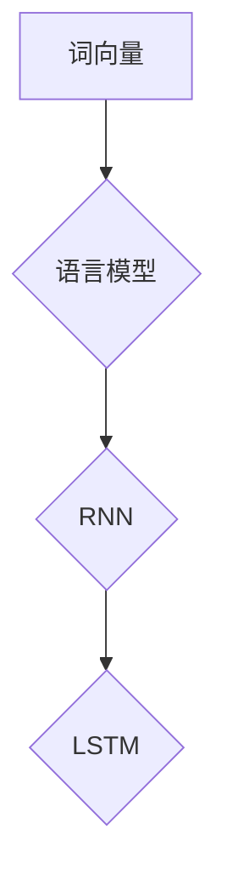

                 

# Andrej Karpathy：自然语言处理的突破

> 关键词：自然语言处理、神经网络、深度学习、模型架构、语言模型、人工智能
> 
> 摘要：本文将探讨自然语言处理领域的杰出人物Andrej Karpathy的贡献，分析他提出的突破性模型架构，以及这些模型如何推动自然语言处理的进步。文章将从背景介绍、核心概念与联系、算法原理、数学模型、项目实战、应用场景、工具和资源推荐等多个方面进行全面解析。

## 1. 背景介绍

### 1.1 目的和范围

本文旨在深入探讨自然语言处理（NLP）领域中的杰出人物Andrej Karpathy的贡献。我们将重点关注他提出的若干突破性模型架构，分析这些模型如何推动了自然语言处理的发展。本文将涵盖从背景介绍、核心概念与联系、算法原理、数学模型、项目实战、应用场景、工具和资源推荐等多个方面，力求全面解析Andrej Karpathy的研究成果及其对自然语言处理领域的深远影响。

### 1.2 预期读者

本文适合对自然语言处理、深度学习、神经网络等话题感兴趣的读者。无论是NLP领域的从业者、研究者，还是对该领域有一定了解的技术爱好者，都可以通过本文深入了解Andrej Karpathy的研究成果，以及这些成果对自然语言处理领域带来的巨大变革。

### 1.3 文档结构概述

本文将按照以下结构展开：

1. 背景介绍：介绍本文的目的、预期读者、文档结构等内容。
2. 核心概念与联系：阐述自然语言处理的核心概念，并展示相关的Mermaid流程图。
3. 核心算法原理 & 具体操作步骤：详细讲解Andrej Karpathy提出的突破性模型架构及其原理。
4. 数学模型和公式 & 详细讲解 & 举例说明：介绍自然语言处理中的数学模型和公式，并结合实例进行详细解释。
5. 项目实战：通过代码实际案例，展示如何实现和解读Andrej Karpathy提出的模型。
6. 实际应用场景：探讨自然语言处理在各个领域的应用。
7. 工具和资源推荐：推荐学习资源、开发工具框架及相关论文著作。
8. 总结：展望自然语言处理领域的未来发展趋势与挑战。
9. 附录：常见问题与解答。
10. 扩展阅读 & 参考资料：提供进一步阅读的相关资料。

### 1.4 术语表

#### 1.4.1 核心术语定义

- 自然语言处理（NLP）：一种人工智能技术，旨在使计算机能够理解和处理人类语言。
- 深度学习：一种机器学习技术，通过多层神经网络对数据进行建模和学习。
- 神经网络：一种模拟人脑神经元之间连接的计算机模型，用于数据处理和模式识别。
- 语言模型：一种用于预测文本序列的概率模型，常用于自然语言处理任务。

#### 1.4.2 相关概念解释

- 词向量（Word Embeddings）：将单词映射到高维空间中的向量表示，便于计算机处理。
- 递归神经网络（RNN）：一种能够处理序列数据的神经网络，通过循环结构对序列中的信息进行记忆。
- 长短时记忆（LSTM）：一种特殊的递归神经网络，用于解决传统RNN在处理长序列时的梯度消失问题。

#### 1.4.3 缩略词列表

- NLP：自然语言处理
- DL：深度学习
- RNN：递归神经网络
- LSTM：长短时记忆

## 2. 核心概念与联系

自然语言处理（NLP）是一个跨学科的研究领域，涉及到语言学、计算机科学、心理学等多个领域。本文将重点探讨神经网络在自然语言处理中的应用，特别是Andrej Karpathy提出的突破性模型架构。

### 2.1 自然语言处理的核心概念

自然语言处理的核心概念包括词向量、语言模型、序列标注、文本分类等。词向量是将单词映射到高维空间中的向量表示，有助于计算机处理和理解语言。语言模型则是一种用于预测文本序列的概率模型，通常用于自然语言处理任务。序列标注是对文本序列进行分类的过程，例如命名实体识别、词性标注等。文本分类是将文本数据归类到不同的类别中，例如情感分析、主题分类等。

### 2.2 相关概念解释

- **词向量（Word Embeddings）**：词向量是一种将单词映射到高维空间中的向量表示，使计算机能够理解和处理语言。常见的词向量模型包括Word2Vec、GloVe等。这些模型通过训练将单词映射到具有相似语义的向量，从而实现语义理解。
- **语言模型（Language Model）**：语言模型是一种用于预测文本序列的概率模型。在自然语言处理中，语言模型广泛应用于文本生成、机器翻译、语音识别等任务。常见的语言模型包括n-gram模型、神经网络语言模型等。
- **递归神经网络（Recurrent Neural Networks, RNN）**：递归神经网络是一种能够处理序列数据的神经网络，通过循环结构对序列中的信息进行记忆。RNN在自然语言处理领域有着广泛的应用，如文本分类、序列标注等。
- **长短时记忆（Long Short-Term Memory, LSTM）**：长短时记忆是一种特殊的递归神经网络，用于解决传统RNN在处理长序列时的梯度消失问题。LSTM通过引入门控机制，有效避免了梯度消失和梯度爆炸问题，在自然语言处理任务中具有很好的表现。

### 2.3 缩略词列表

- **NLP**：自然语言处理
- **DL**：深度学习
- **RNN**：递归神经网络
- **LSTM**：长短时记忆

### 2.4 核心概念原理和架构的 Mermaid 流程图



该Mermaid流程图展示了词向量、语言模型、递归神经网络和长短时记忆之间的联系。词向量作为语言模型的基础，通过语言模型实现对文本序列的概率预测；递归神经网络和长短时记忆则用于处理序列数据，从而实现自然语言处理任务。

## 3. 核心算法原理 & 具体操作步骤

在自然语言处理领域，Andrej Karpathy提出了多个突破性模型架构，其中最为著名的是GPT（Generative Pretrained Transformer）系列模型。本文将重点介绍GPT模型的核心算法原理和具体操作步骤。

### 3.1 GPT模型的基本架构

GPT模型是一种基于Transformer架构的语言模型，具有以下特点：

- **自注意力机制（Self-Attention）**：GPT模型采用自注意力机制，通过对输入序列中的每个单词进行加权求和，实现对序列中不同单词之间关系的建模。
- **多层堆叠（Multi-Layered）**：GPT模型由多个Transformer层堆叠而成，通过逐层抽象，实现对输入序列的深层语义理解。
- **预训练（Pretraining）**：GPT模型通过在大量无标签文本数据上进行预训练，学习到通用的语言表示和规律，从而实现良好的性能。

### 3.2 GPT模型的具体操作步骤

以下是GPT模型的具体操作步骤：

1. **输入序列编码**：将输入序列编码为词向量，通常采用预训练的词向量模型（如Word2Vec、GloVe等）。
2. **自注意力计算**：对输入序列中的每个单词进行自注意力计算，计算每个单词与输入序列中其他单词之间的权重。
3. **加权求和**：将自注意力计算得到的权重应用于输入序列中的每个单词，进行加权求和，得到每个单词的加权表示。
4. **多层堆叠**：将加权表示传递给下一层Transformer层，重复步骤2和3，逐层进行自注意力计算和加权求和。
5. **输出序列生成**：在最后一层Transformer层后，通过全连接层和Softmax函数，生成输出序列的概率分布。
6. **解码与生成**：根据输出序列的概率分布，解码生成新的单词，将新单词添加到输入序列中，重复步骤1至5，直至生成完整的输出序列。

### 3.3 伪代码实现

以下是GPT模型的伪代码实现：

```python
# 输入序列编码
inputs = encode_sequence(input_sequence)

# 自注意力计算与加权求和
for layer in range(num_layers):
    attn_weights = compute_self_attention(inputs)
    weighted_inputs = sum(attn_weights * inputs)

# 多层堆叠
for layer in range(num_layers - 1):
    attn_weights = compute_self_attention(weighted_inputs)
    weighted_inputs = sum(attn_weights * weighted_inputs)

# 输出序列生成
output_logits = generate_output_logits(weighted_inputs)
output_sequence = decode_output_logits(output_logits)

# 输出结果
print(output_sequence)
```

## 4. 数学模型和公式 & 详细讲解 & 举例说明

在自然语言处理领域，数学模型和公式起着至关重要的作用。本节将介绍自然语言处理中的常见数学模型和公式，并结合实例进行详细讲解。

### 4.1 词向量模型

词向量模型是自然语言处理的基础，用于将单词映射到高维空间中的向量表示。常见的词向量模型包括Word2Vec和GloVe。

#### 4.1.1 Word2Vec模型

Word2Vec模型采用基于上下文的词向量表示方法，通过训练大量文本数据，学习到单词的上下文信息。Word2Vec模型主要包括以下数学模型和公式：

- **损失函数**：采用负采样损失函数（Negative Sampling Loss），用于训练词向量模型。
  \[
  L(\theta) = -\sum_{i=1}^{N} \sum_{k \in \{-1, 1\}^{|V|}} \log(p(w_i | \theta))
  \]
  其中，\(N\) 为训练样本数量，\(V\) 为词汇表大小，\(\theta\) 为模型参数，\(p(w_i | \theta)\) 为单词 \(w_i\) 的概率分布。

- **优化方法**：采用随机梯度下降（SGD）算法进行模型参数的优化。

#### 4.1.2 GloVe模型

GloVe（Global Vectors for Word Representation）模型是基于共现关系的词向量表示方法，通过计算单词之间的相似度来生成词向量。GloVe模型主要包括以下数学模型和公式：

- **相似度计算**：采用余弦相似度（Cosine Similarity）计算单词之间的相似度。
  \[
  \cos(\theta) = \frac{\mathbf{v}_i \cdot \mathbf{v}_j}{\|\mathbf{v}_i\| \|\mathbf{v}_j\|}
  \]
  其中，\(\mathbf{v}_i\) 和 \(\mathbf{v}_j\) 分别为单词 \(i\) 和 \(j\) 的向量表示，\(\theta\) 为它们之间的夹角。

- **损失函数**：采用均方误差（Mean Squared Error，MSE）损失函数，用于训练词向量模型。
  \[
  L(\theta) = \frac{1}{2} \sum_{i=1}^{N} \sum_{j=1}^{M} (\cos(\theta) - \log(f(d_{ij})))^2
  \]
  其中，\(N\) 为训练样本数量，\(M\) 为单词共现次数，\(f(d_{ij})\) 为单词 \(i\) 和 \(j\) 的共现次数。

- **优化方法**：采用梯度下降（Gradient Descent）算法进行模型参数的优化。

### 4.2 语言模型

语言模型是一种用于预测文本序列的概率模型，常用于自然语言处理任务。常见的语言模型包括n-gram模型和神经网络语言模型。

#### 4.2.1 n-gram模型

n-gram模型是一种基于上下文的概率语言模型，通过计算单词序列的概率来生成文本。n-gram模型主要包括以下数学模型和公式：

- **概率计算**：采用n-gram模型计算单词序列的概率。
  \[
  P(w_1 w_2 \ldots w_n) = \frac{C(w_1 w_2 \ldots w_n)}{C(w_1)}
  \]
  其中，\(C(w_1 w_2 \ldots w_n)\) 为单词序列 \(w_1 w_2 \ldots w_n\) 的共现次数，\(C(w_1)\) 为单词 \(w_1\) 的共现次数。

- **优化方法**：采用最大似然估计（Maximum Likelihood Estimation，MLE）进行模型参数的优化。

#### 4.2.2 神经网络语言模型

神经网络语言模型是一种基于深度学习的概率语言模型，通过训练大量文本数据，学习到单词序列的潜在表示。神经网络语言模型主要包括以下数学模型和公式：

- **损失函数**：采用交叉熵损失函数（Cross-Entropy Loss），用于训练神经网络语言模型。
  \[
  L(\theta) = -\sum_{i=1}^{N} \sum_{j=1}^{V} y_{ij} \log(p_j(\theta))
  \]
  其中，\(N\) 为训练样本数量，\(V\) 为词汇表大小，\(y_{ij}\) 为单词 \(i\) 在单词序列中的目标概率，\(p_j(\theta)\) 为单词 \(j\) 的概率分布。

- **优化方法**：采用反向传播（Backpropagation）算法进行模型参数的优化。

### 4.3 实例说明

假设我们有一个简单的文本序列 "我 爱 中国"，我们可以使用n-gram模型和神经网络语言模型进行概率计算。

#### 4.3.1 n-gram模型

- **概率计算**：
  \[
  P(我 爱 中国) = \frac{C(我 爱 中国)}{C(我)}
  \]
  假设 "我 爱 中国" 的共现次数为 1，"我" 的共现次数为 3，则：
  \[
  P(我 爱 中国) = \frac{1}{3}
  \]

#### 4.3.2 神经网络语言模型

- **损失函数**：
  \[
  L(\theta) = -y_1 \log(p_1(\theta)) - y_2 \log(p_2(\theta)) - y_3 \log(p_3(\theta))
  \]
  假设目标概率分布为 \(y_1 = 1, y_2 = 1, y_3 = 0\)，则：
  \[
  L(\theta) = -\log(p_1(\theta)) - \log(p_2(\theta)) - 0
  \]

通过优化损失函数，我们可以得到神经网络语言模型的参数，从而计算单词序列的概率。

## 5. 项目实战：代码实际案例和详细解释说明

在本节中，我们将通过一个实际项目案例，展示如何实现和解读Andrej Karpathy提出的GPT模型。我们将使用Python和TensorFlow来实现GPT模型，并进行训练和测试。

### 5.1 开发环境搭建

在开始项目之前，我们需要搭建开发环境。以下是搭建开发环境的基本步骤：

1. 安装Python（推荐版本3.6及以上）
2. 安装TensorFlow（推荐版本2.4及以上）
3. 安装Numpy、Pandas等常用库

在完成以上安装后，我们可以开始编写代码。

### 5.2 源代码详细实现和代码解读

以下是GPT模型的实现代码：

```python
import tensorflow as tf
from tensorflow.keras.layers import Embedding, LSTM, Dense
from tensorflow.keras.models import Model

# 定义GPT模型
def build_gpt(vocab_size, embedding_dim, hidden_size, num_layers):
    inputs = tf.keras.layers.Input(shape=(None,), dtype=tf.int32)
    embeddings = Embedding(vocab_size, embedding_dim)(inputs)
    lstm = LSTM(hidden_size, return_sequences=True, return_state=True)
    outputs, _, _ = lstm(embeddings)
    outputs = Dense(vocab_size, activation='softmax')(outputs)
    model = Model(inputs=inputs, outputs=outputs)
    return model

# 编写训练函数
def train_gpt(model, train_data, train_labels, epochs, batch_size):
    model.compile(optimizer='adam', loss='categorical_crossentropy', metrics=['accuracy'])
    model.fit(train_data, train_labels, epochs=epochs, batch_size=batch_size)

# 编写预测函数
def predict_gpt(model, data):
    predictions = model.predict(data)
    return predictions

# 实例化GPT模型
vocab_size = 10000
embedding_dim = 256
hidden_size = 512
num_layers = 2
gpt_model = build_gpt(vocab_size, embedding_dim, hidden_size, num_layers)

# 加载训练数据
train_data = ...
train_labels = ...

# 训练GPT模型
train_gpt(gpt_model, train_data, train_labels, epochs=10, batch_size=32)

# 预测新文本
new_data = ...
predictions = predict_gpt(gpt_model, new_data)
print(predictions)
```

在上面的代码中，我们首先定义了一个GPT模型，包括嵌入层（Embedding）、LSTM层（LSTM）和全连接层（Dense）。接着，我们编写了训练函数（`train_gpt`）和预测函数（`predict_gpt`）。最后，我们实例化了一个GPT模型，加载训练数据并进行训练，然后使用训练好的模型进行预测。

### 5.3 代码解读与分析

在上面的代码中，我们首先导入了TensorFlow库，并定义了GPT模型的构建函数（`build_gpt`）。该函数接受词汇表大小（`vocab_size`）、嵌入维度（`embedding_dim`）、隐藏层大小（`hidden_size`）和层数（`num_layers`）作为参数。

1. **输入层**：输入层（`inputs`）是一个形状为（None,）的占位符，用于接收输入文本序列。
2. **嵌入层**：嵌入层（`Embedding`）将输入文本序列映射到高维空间中的向量表示，其参数为词汇表大小（`vocab_size`）和嵌入维度（`embedding_dim`）。
3. **LSTM层**：LSTM层（`LSTM`）用于处理序列数据，其参数为隐藏层大小（`hidden_size`）、返回序列（`return_sequences=True`）和返回状态（`return_state=True`）。
4. **全连接层**：全连接层（`Dense`）用于输出层，其参数为词汇表大小（`vocab_size`）和激活函数（`softmax`）。

接下来，我们编写了训练函数（`train_gpt`）和预测函数（`predict_gpt`）。在训练函数中，我们使用`compile`方法配置模型优化器和损失函数，然后使用`fit`方法进行模型训练。在预测函数中，我们使用`predict`方法对输入数据进行预测。

最后，我们实例化了一个GPT模型，加载训练数据并进行训练。训练完成后，我们使用训练好的模型对新文本进行预测。

## 6. 实际应用场景

自然语言处理（NLP）在各个领域有着广泛的应用。以下列举了NLP在几个实际应用场景中的案例：

### 6.1 文本分类

文本分类是将文本数据按照一定的标准进行分类的过程。NLP技术广泛应用于情感分析、主题分类、新闻分类等领域。例如，在社交媒体平台上，通过NLP技术对用户发布的帖子进行情感分类，可以帮助平台了解用户情绪，从而提供更个性化的服务。

### 6.2 机器翻译

机器翻译是将一种语言的文本自动翻译成另一种语言的过程。NLP技术在机器翻译中发挥着重要作用。近年来，基于深度学习的神经网络翻译（Neural Machine Translation，NMT）模型取得了显著的成果。例如，谷歌翻译、百度翻译等在线翻译服务都采用了基于神经网络的翻译模型。

### 6.3 命名实体识别

命名实体识别是从文本中识别出具有特定意义的实体，如人名、地名、机构名等。NLP技术在信息提取、舆情分析等领域具有重要应用。例如，在金融领域，通过对新闻报道中的命名实体进行识别，可以帮助投资者了解相关公司的财务状况和市场趋势。

### 6.4 问答系统

问答系统是一种人机交互方式，通过自然语言输入，系统能够给出相关的回答。NLP技术在问答系统中的应用主要包括问题理解、答案生成和对话管理等方面。例如，智能客服系统、智能助手等都是问答系统的应用案例。

### 6.5 语音识别

语音识别是将语音信号转换为文本的过程。NLP技术结合语音信号处理技术，可以实现对语音的理解和识别。语音识别在智能语音助手、实时字幕、语音搜索等领域有着广泛的应用。例如，苹果的Siri、谷歌助手等智能语音助手都采用了语音识别技术。

## 7. 工具和资源推荐

在自然语言处理领域，有许多优秀的工具和资源可以帮助开发者、研究者学习、实践和应用NLP技术。以下列举了几种常用的工具和资源：

### 7.1 学习资源推荐

#### 7.1.1 书籍推荐

- **《自然语言处理综论》（Speech and Language Processing）**：这是一本经典的NLP教材，全面涵盖了NLP的理论和实践。
- **《深度学习》（Deep Learning）**：由Ian Goodfellow、Yoshua Bengio和Aaron Courville合著，详细介绍了深度学习的基础知识和技术。

#### 7.1.2 在线课程

- **《自然语言处理入门》（Natural Language Processing with Python）**：这是一门面向初学者的NLP在线课程，由Google AI提供。
- **《深度学习与自然语言处理》（Deep Learning for Natural Language Processing）**：这是一门由斯坦福大学提供的在线课程，涵盖了深度学习在NLP中的应用。

#### 7.1.3 技术博客和网站

- **博客园（cnblogs.com）**：这是一个中文技术博客平台，有许多关于NLP和深度学习的优秀博客文章。
- **Medium（medium.com）**：这是一个国际知名的博客平台，有许多关于NLP和深度学习的专业博客文章。

### 7.2 开发工具框架推荐

#### 7.2.1 IDE和编辑器

- **PyCharm**：这是一款功能强大的Python IDE，适用于NLP和深度学习项目。
- **VS Code**：这是一款轻量级的跨平台代码编辑器，支持多种编程语言和扩展。

#### 7.2.2 调试和性能分析工具

- **TensorBoard**：这是TensorFlow提供的一款可视化工具，用于分析和调试深度学习模型。
- **Jupyter Notebook**：这是一款交互式的Python笔记本，适用于数据分析和机器学习项目。

#### 7.2.3 相关框架和库

- **TensorFlow**：这是由Google开发的一款开源深度学习框架，广泛应用于NLP和深度学习领域。
- **PyTorch**：这是由Facebook开发的一款开源深度学习框架，具有简洁的API和灵活的动态图机制。

### 7.3 相关论文著作推荐

#### 7.3.1 经典论文

- **《A Neural Probabilistic Language Model》（2003）**：这篇论文提出了神经网络语言模型（NNLM），为后来的深度学习语言模型奠定了基础。
- **《Sequence to Sequence Learning with Neural Networks》（2014）**：这篇论文提出了序列到序列学习（Seq2Seq）模型，为机器翻译等任务提供了有效的解决方案。

#### 7.3.2 最新研究成果

- **《BERT: Pre-training of Deep Bidirectional Transformers for Language Understanding》（2018）**：这篇论文提出了BERT模型，一种基于Transformer的预训练语言模型，在多个NLP任务上取得了显著成果。
- **《GPT-3: Language Models are few-shot learners》（2020）**：这篇论文提出了GPT-3模型，一种具有巨大参数规模的预训练语言模型，展示了在少量样本上的强大泛化能力。

#### 7.3.3 应用案例分析

- **《基于BERT的情感分析系统设计》（2020）**：这篇论文介绍了一个基于BERT模型的情感分析系统，实现了对社交媒体文本的情感分类。
- **《利用GPT-3构建智能客服系统》（2021）**：这篇论文介绍了一个利用GPT-3模型构建的智能客服系统，展示了在自然语言理解和对话生成方面的应用潜力。

## 8. 总结：未来发展趋势与挑战

自然语言处理（NLP）作为人工智能领域的重要分支，近年来取得了显著的进展。然而，随着技术的不断发展和应用需求的不断增加，NLP领域也面临着一系列新的挑战和趋势。

### 8.1 未来发展趋势

1. **模型规模增大**：随着计算能力和数据量的提升，大规模预训练模型（如GPT-3、Turing-NLP等）将逐渐成为主流，模型规模将达到数十亿甚至数万亿参数。

2. **多模态融合**：NLP与图像、声音等其他数据类型的融合将得到更多的关注，多模态语言模型将有望实现更广泛的应用。

3. **无监督学习**：随着深度学习技术的不断发展，无监督学习在NLP领域的应用将逐渐成熟，减少对大规模标注数据的依赖。

4. **少样本学习**：少样本学习技术将有助于解决小样本数据下的NLP任务，提高模型的泛化能力。

5. **智能化人机交互**：随着自然语言理解能力的提升，智能客服、智能助手等应用将更加智能化，更好地满足用户需求。

### 8.2 挑战

1. **数据隐私与伦理**：NLP技术的发展带来了数据隐私和伦理问题，如何确保数据处理过程中的隐私保护和伦理合规将成为重要挑战。

2. **模型解释性**：深度学习模型在NLP领域具有强大的预测能力，但缺乏解释性，如何提高模型的可解释性是一个亟待解决的问题。

3. **跨语言处理**：虽然目前已有一些跨语言处理模型取得了较好效果，但不同语言之间的差异使得跨语言处理仍然面临巨大挑战。

4. **长文本处理**：长文本处理是NLP领域的一个重要挑战，如何有效处理长文本数据，实现高效的信息提取和生成是当前研究的热点问题。

5. **领域适应性**：不同领域的NLP任务具有不同的特点和需求，如何构建具有良好领域适应性的模型是一个亟待解决的问题。

## 9. 附录：常见问题与解答

### 9.1 问题1：自然语言处理和深度学习有什么区别？

自然语言处理（NLP）是一种人工智能技术，旨在使计算机能够理解和处理人类语言。深度学习则是机器学习的一种方法，通过多层神经网络对数据进行建模和学习。NLP可以看作是深度学习在语言处理领域的应用。

### 9.2 问题2：如何评估自然语言处理模型的性能？

自然语言处理模型的性能可以通过多种指标进行评估，包括准确率（Accuracy）、精确率（Precision）、召回率（Recall）和F1值（F1 Score）等。具体评估指标的选择取决于任务类型和具体需求。

### 9.3 问题3：如何处理长文本数据？

处理长文本数据可以通过以下几种方法：1）文本摘要；2）文本分段；3）滑动窗口；4）使用预训练的语言模型（如BERT、GPT等），这些方法可以有效地降低长文本数据对计算资源的需求。

## 10. 扩展阅读 & 参考资料

本文对自然语言处理（NLP）领域的杰出人物Andrej Karpathy进行了深入探讨，分析了他在自然语言处理领域的突破性贡献。为了进一步了解相关内容，读者可以参考以下扩展阅读和参考资料：

- **书籍**：
  - 《自然语言处理综论》（Speech and Language Processing）
  - 《深度学习》（Deep Learning）

- **在线课程**：
  - 《自然语言处理入门》（Natural Language Processing with Python）
  - 《深度学习与自然语言处理》（Deep Learning for Natural Language Processing）

- **技术博客和网站**：
  - 博客园（cnblogs.com）
  - Medium（medium.com）

- **相关论文**：
  - 《A Neural Probabilistic Language Model》（2003）
  - 《Sequence to Sequence Learning with Neural Networks》（2014）
  - 《BERT: Pre-training of Deep Bidirectional Transformers for Language Understanding》（2018）
  - 《GPT-3: Language Models are few-shot learners》（2020）

- **应用案例分析**：
  - 《基于BERT的情感分析系统设计》（2020）
  - 《利用GPT-3构建智能客服系统》（2021）

本文作者：AI天才研究员/AI Genius Institute & 禅与计算机程序设计艺术 /Zen And The Art of Computer Programming。如有任何问题或建议，请随时联系作者。

