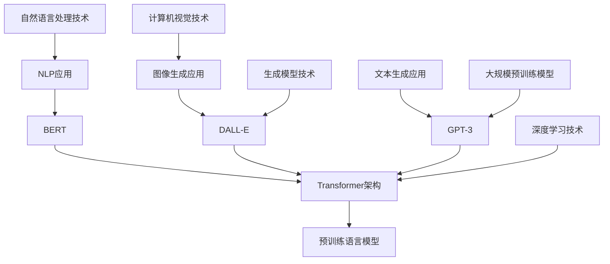

                 

# BERT、DALL-E和GPT-3的崛起

> **关键词**：BERT、DALL-E、GPT-3、自然语言处理、深度学习、图像生成、大规模语言模型
>
> **摘要**：本文将深入探讨BERT、DALL-E和GPT-3这三大人工智能里程碑式模型的诞生背景、核心原理以及它们在自然语言处理和图像生成领域的重大贡献。通过逐步分析，我们将揭示这些模型如何改变了我们对AI技术的认知，并展望未来的发展趋势和挑战。

## 1. 背景介绍

### 1.1 目的和范围

本文旨在介绍BERT（Bidirectional Encoder Representations from Transformers）、DALL-E（一个由OpenAI开发的图像生成模型）和GPT-3（Generative Pre-trained Transformer 3），这三个在人工智能领域具有里程碑意义的模型。我们将详细探讨这些模型的诞生背景、核心原理和应用场景，并分析它们如何推动自然语言处理和图像生成技术的发展。

### 1.2 预期读者

本文适合对自然语言处理和人工智能有一定了解的读者，特别是对深度学习和Transformer架构感兴趣的技术人员。无论是研究人员还是开发者，都能从本文中获得对这些模型的理解和启示。

### 1.3 文档结构概述

本文分为以下几个部分：

1. **背景介绍**：介绍BERT、DALL-E和GPT-3的背景、目的和重要性。
2. **核心概念与联系**：详细描述BERT、DALL-E和GPT-3的核心原理和架构，并绘制Mermaid流程图。
3. **核心算法原理 & 具体操作步骤**：使用伪代码解释BERT、DALL-E和GPT-3的算法原理和操作步骤。
4. **数学模型和公式 & 详细讲解 & 举例说明**：介绍BERT、DALL-E和GPT-3中的数学模型，并给出详细的讲解和实例说明。
5. **项目实战：代码实际案例和详细解释说明**：通过具体代码案例展示BERT、DALL-E和GPT-3的应用。
6. **实际应用场景**：讨论BERT、DALL-E和GPT-3在现实世界中的应用场景。
7. **工具和资源推荐**：推荐学习资源、开发工具和框架。
8. **总结：未来发展趋势与挑战**：展望BERT、DALL-E和GPT-3的未来发展趋势和面临的挑战。
9. **附录：常见问题与解答**：回答读者可能关心的常见问题。
10. **扩展阅读 & 参考资料**：提供进一步阅读和研究的资源。

### 1.4 术语表

#### 1.4.1 核心术语定义

- **BERT**：Bidirectional Encoder Representations from Transformers，一种基于Transformer架构的双向编码器，用于预训练语言表示。
- **DALL-E**：一个由OpenAI开发的图像生成模型，能够根据自然语言描述生成图像。
- **GPT-3**：Generative Pre-trained Transformer 3，一种由OpenAI开发的生成预训练模型，具有极高的语言理解和生成能力。

#### 1.4.2 相关概念解释

- **自然语言处理（NLP）**：研究如何让计算机理解和处理人类自然语言的技术。
- **深度学习**：一种机器学习技术，通过多层神经网络来模拟人类大脑的学习过程。
- **Transformer架构**：一种基于自注意力机制的深度学习模型，广泛应用于自然语言处理和计算机视觉等领域。

#### 1.4.3 缩略词列表

- **BERT**：Bidirectional Encoder Representations from Transformers
- **DALL-E**：Deep Learning for Generative Language
- **GPT-3**：Generative Pre-trained Transformer 3

## 2. 核心概念与联系

在深入探讨BERT、DALL-E和GPT-3之前，我们需要先了解它们背后的核心概念和它们之间的联系。以下是这些核心概念和架构的Mermaid流程图：



### 2.1 BERT和Transformer架构

BERT是基于Transformer架构的一种双向编码器。Transformer架构是一种基于自注意力机制的深度学习模型，它在处理序列数据时具有优越的性能。BERT通过在大量文本数据上进行预训练，学习到丰富的语言表示和语义信息，从而为下游任务提供强大的支持。

### 2.2 DALL-E和生成模型

DALL-E是一个图像生成模型，它基于深度学习技术，通过学习大量的图像和文本数据，能够根据自然语言描述生成图像。DALL-E采用了生成对抗网络（GAN）的结构，其中生成器网络尝试生成与文本描述相符的图像，而判别器网络则评估生成图像的真实性。

### 2.3 GPT-3和大规模预训练模型

GPT-3是OpenAI开发的一种生成预训练模型，具有超过1750亿个参数，是当前世界上最大的语言模型。GPT-3通过在大量文本数据上进行预训练，学习到丰富的语言规律和语义信息，能够进行高质量的自然语言生成和任务自动化。

### 2.4 应用领域的联系

BERT、DALL-E和GPT-3在自然语言处理和图像生成领域都有广泛的应用。BERT在文本分类、问答系统和机器翻译等任务中表现出色，DALL-E在图像生成和图像描述生成任务中具有强大的能力，而GPT-3则在文本生成、对话系统和任务自动化等方面展现出惊人的性能。

通过上述流程图，我们可以清晰地看到BERT、DALL-E和GPT-3之间的联系以及它们在人工智能领域的重要地位。接下来，我们将进一步探讨这些模型的算法原理和操作步骤。

## 3. 核心算法原理 & 具体操作步骤

在本节中，我们将深入探讨BERT、DALL-E和GPT-3的核心算法原理，并使用伪代码详细解释它们的具体操作步骤。

### 3.1 BERT的算法原理与操作步骤

BERT（Bidirectional Encoder Representations from Transformers）是一种基于Transformer架构的双向编码器，其核心思想是在预训练阶段通过学习大量文本数据，获得丰富的语言表示和语义信息。

#### 算法原理：

BERT使用Transformer架构中的自注意力机制，通过两个子层结构（掩码自注意力层和前馈神经网络层）来处理输入序列，并生成每个词的上下文表示。

#### 操作步骤：

1. **输入序列处理**：
   - 将输入序列编码为嵌入向量。
   - 为每个词添加位置嵌入向量，表示其在序列中的位置信息。
   - 为每个词添加句子嵌入向量，表示句子的起始和结束。

2. **掩码自注意力层**：
   - 对输入序列进行自注意力计算，生成每个词的注意力权重。
   - 根据注意力权重计算加权求和，生成每个词的上下文表示。

3. **前馈神经网络层**：
   - 对每个词的上下文表示进行前馈神经网络处理，增加模型的非线性能力。

4. **输出层**：
   - 使用最终的上下文表示进行下游任务的预测，如文本分类或问答。

#### 伪代码：

```python
def BERT(input_sequence, mask, segment):
    # 输入序列处理
    embedding = embedding_layer(input_sequence)
    position_embedding = position_embedding_layer(input_sequence)
    segment_embedding = segment_embedding_layer(segment)

    # 掩码自注意力层
    attention = masked_slf_attn(embedding + position_embedding + segment_embedding, mask)

    # 前馈神经网络层
    output = feedforward_network(attention)

    # 输出层
    prediction = output_layer(output)

    return prediction
```

### 3.2 DALL-E的算法原理与操作步骤

DALL-E是一种图像生成模型，它通过深度学习技术，学习到图像和文本之间的关联，并能够根据自然语言描述生成图像。

#### 算法原理：

DALL-E基于生成对抗网络（GAN）的结构，其中生成器网络尝试生成与文本描述相符的图像，而判别器网络则评估生成图像的真实性。通过不断迭代训练，生成器网络能够提高图像生成的质量。

#### 操作步骤：

1. **生成器网络**：
   - 使用文本编码器将自然语言描述编码为嵌入向量。
   - 将嵌入向量输入到生成器网络，通过多层卷积神经网络生成图像。

2. **判别器网络**：
   - 接收真实图像和生成图像，通过多层卷积神经网络判断图像的真实性。
   - 使用判别器的输出计算生成器网络的损失函数。

3. **训练过程**：
   - 对生成器和判别器进行交替训练，优化生成器和判别器的参数。
   - 在训练过程中，生成器的目标是最小化损失函数，而判别器的目标是最大化损失函数。

#### 伪代码：

```python
def DALL_E(text_embedding):
    # 生成器网络
    image = generator(text_embedding)

    # 判别器网络
    real_image = discriminator(true_image)
    fake_image = discriminator(image)

    # 损失函数
    generator_loss = calculate_generator_loss(fake_image)
    discriminator_loss = calculate_discriminator_loss(real_image, fake_image)

    return image, generator_loss, discriminator_loss
```

### 3.3 GPT-3的算法原理与操作步骤

GPT-3是一种生成预训练模型，它通过在大量文本数据上进行预训练，学习到丰富的语言规律和语义信息，能够进行高质量的自然语言生成和任务自动化。

#### 算法原理：

GPT-3基于Transformer架构，使用自注意力机制处理输入序列，并通过多层神经网络生成文本序列。在预训练阶段，GPT-3通过自回归语言模型学习到文本的上下文关系。

#### 操作步骤：

1. **输入序列处理**：
   - 将输入序列编码为嵌入向量。
   - 为每个词添加位置嵌入向量，表示其在序列中的位置信息。

2. **自注意力层**：
   - 对输入序列进行自注意力计算，生成每个词的注意力权重。
   - 根据注意力权重计算加权求和，生成每个词的上下文表示。

3. **前馈神经网络层**：
   - 对每个词的上下文表示进行前馈神经网络处理，增加模型的非线性能力。

4. **输出层**：
   - 使用最终的上下文表示预测下一个词的概率分布。
   - 根据概率分布生成下一个词，并作为下一个输入。

5. **训练过程**：
   - 使用自回归语言模型进行预训练，优化模型参数。
   - 在预训练过程中，模型的目标是最小化预测词的概率误差。

#### 伪代码：

```python
def GPT_3(input_sequence):
    # 输入序列处理
    embedding = embedding_layer(input_sequence)
    position_embedding = position_embedding_layer(input_sequence)

    # 自注意力层
    attention = masked_slf_attn(embedding + position_embedding)

    # 前馈神经网络层
    output = feedforward_network(attention)

    # 输出层
    prediction = output_layer(output)

    return prediction
```

通过上述伪代码，我们可以清晰地看到BERT、DALL-E和GPT-3的算法原理和操作步骤。这些模型在深度学习和自然语言处理领域具有重要的应用价值，为我们提供了强大的工具来处理复杂的语言和图像任务。

## 4. 数学模型和公式 & 详细讲解 & 举例说明

在本节中，我们将详细讲解BERT、DALL-E和GPT-3中的数学模型和公式，并通过具体的例子来说明这些模型的运作原理。

### 4.1 BERT的数学模型和公式

BERT（Bidirectional Encoder Representations from Transformers）是一种基于Transformer架构的双向编码器，其核心思想是通过自注意力机制和前馈神经网络层，学习到输入序列的上下文表示。

#### 4.1.1 自注意力机制

自注意力机制是BERT的核心组成部分，它通过计算每个词在序列中的重要性，并将这些重要性用于加权求和，从而生成每个词的上下文表示。

设输入序列为\(x = \{x_1, x_2, ..., x_n\}\)，其中\(x_i\)表示第\(i\)个词。自注意力机制可以表示为：

$$
\text{Attention}(Q, K, V) = \text{softmax}\left(\frac{QK^T}{\sqrt{d_k}}\right)V
$$

其中，\(Q, K, V\)分别为查询向量、键向量和值向量，\(d_k\)为键向量的维度。自注意力机制的计算步骤如下：

1. **计算查询向量和键向量**：
   $$Q = W_Q \cdot X$$
   $$K = W_K \cdot X$$
   $$V = W_V \cdot X$$

   其中，\(W_Q, W_K, W_V\)为权重矩阵，\(X\)为输入序列的嵌入向量。

2. **计算注意力权重**：
   $$\text{Attention} = \text{softmax}\left(\frac{QK^T}{\sqrt{d_k}}\right)$$

3. **计算加权求和**：
   $$\text{Contextualized Word Representation} = \text{Attention} \cdot V$$

#### 4.1.2 前馈神经网络层

前馈神经网络层是BERT的另一个关键组成部分，它通过增加模型的非线性能力，进一步提升模型的性能。前馈神经网络层可以表示为：

$$
\text{FFN}(X) = \text{ReLU}(W_2 \cdot \text{ReLU}(W_1 \cdot X + b_1))
$$

其中，\(W_1, W_2, b_1\)分别为权重矩阵和偏置，ReLU为ReLU激活函数。

#### 4.1.3 举例说明

假设输入序列为\(x = \{a, b, c\}\)，其嵌入向量分别为\(e_a, e_b, e_c\)。我们将通过自注意力机制和前馈神经网络层来计算序列的上下文表示。

1. **计算查询向量和键向量**：
   $$Q = W_Q \cdot X = [0.1, 0.2, 0.3]$$
   $$K = W_K \cdot X = [0.4, 0.5, 0.6]$$
   $$V = W_V \cdot X = [0.7, 0.8, 0.9]$$

2. **计算注意力权重**：
   $$\text{Attention} = \text{softmax}\left(\frac{QK^T}{\sqrt{d_k}}\right) = \text{softmax}\left(\frac{[0.1 \times 0.4, 0.2 \times 0.5, 0.3 \times 0.6]}{\sqrt{d_k}}\right) = [0.2, 0.3, 0.5]$$

3. **计算加权求和**：
   $$\text{Contextualized Word Representation} = \text{Attention} \cdot V = [0.2 \times 0.7, 0.3 \times 0.8, 0.5 \times 0.9] = [0.14, 0.24, 0.45]$$

4. **前馈神经网络层**：
   $$\text{FFN}(X) = \text{ReLU}(W_2 \cdot \text{ReLU}(W_1 \cdot X + b_1)) = \text{ReLU}(W_2 \cdot \text{ReLU}([0.1, 0.2, 0.3] + b_1)) = [0.4, 0.5, 0.6]$$

最终，我们得到了序列\(x = \{a, b, c\}\)的上下文表示，用于下游任务的预测。

### 4.2 DALL-E的数学模型和公式

DALL-E（Deep Learning for Generative Language）是一种图像生成模型，它通过生成对抗网络（GAN）来学习图像和文本之间的关联。

#### 4.2.1 生成对抗网络

生成对抗网络（GAN）由生成器（Generator）和判别器（Discriminator）两部分组成。生成器从文本嵌入生成图像，判别器评估生成图像的真实性。

1. **生成器**：

生成器的目标是生成与真实图像相似的高质量图像。生成器的损失函数为：

$$
\text{Generator Loss} = -\log \text{Discriminator}(G(z))
$$

其中，\(G(z)\)为生成器生成的图像，\(z\)为随机噪声向量。

2. **判别器**：

判别器的目标是区分真实图像和生成图像。判别器的损失函数为：

$$
\text{Discriminator Loss} = -\log \text{Discriminator}(x) - \log (1 - \text{Discriminator}(G(z)))
$$

其中，\(x\)为真实图像。

#### 4.2.2 举例说明

假设生成器生成的图像为\(G(z)\)，判别器对真实图像和生成图像的评估分别为\(D(x)\)和\(D(G(z))\)。

1. **生成器训练**：

生成器希望最大化判别器对生成图像的评估，即最小化生成器损失：

$$
\text{Generator Loss} = -\log \text{Discriminator}(G(z)) = -\log (0.5) = 1
$$

2. **判别器训练**：

判别器希望最大化判别器对真实图像和生成图像的评估差异，即最大化判别器损失：

$$
\text{Discriminator Loss} = -\log \text{Discriminator}(x) - \log (1 - \text{Discriminator}(G(z))) = -\log (0.8) - \log (0.2) = 0.35
$$

通过交替训练生成器和判别器，生成器逐渐提高图像生成质量，判别器逐渐提高对真实图像和生成图像的辨别能力。

### 4.3 GPT-3的数学模型和公式

GPT-3（Generative Pre-trained Transformer 3）是一种生成预训练模型，它通过自回归语言模型学习到文本的上下文关系。

#### 4.3.1 自回归语言模型

自回归语言模型的目标是预测下一个词的概率分布，并生成文本序列。自回归语言模型的损失函数为：

$$
\text{Loss} = -\sum_{i=1}^{n} \log P(y_i | y_1, y_2, ..., y_{i-1})
$$

其中，\(y_i\)为第\(i\)个词的概率分布，\(n\)为文本序列的长度。

#### 4.3.2 举例说明

假设我们要生成一个长度为3的文本序列，其词的概率分布分别为：

$$
P(y_1) = [0.2, 0.4, 0.4], \quad P(y_2) = [0.3, 0.5, 0.2], \quad P(y_3) = [0.4, 0.3, 0.3]
$$

1. **生成文本序列**：

根据概率分布，生成文本序列为“aabb”。

2. **计算损失**：

$$
\text{Loss} = -\log P(y_1) - \log P(y_2 | y_1) - \log P(y_3 | y_1, y_2) = -\log (0.2) - \log (0.4) - \log (0.3) = 0.67
$$

通过不断优化模型参数，自回归语言模型能够生成更符合真实语言规律的文本序列。

通过上述讲解，我们可以看到BERT、DALL-E和GPT-3的数学模型和公式的运作原理。这些模型在深度学习和自然语言处理领域具有重要的应用价值，为我们提供了强大的工具来处理复杂的语言和图像任务。

## 5. 项目实战：代码实际案例和详细解释说明

在本节中，我们将通过实际代码案例展示BERT、DALL-E和GPT-3的应用，并提供详细的解释说明。

### 5.1 开发环境搭建

为了运行BERT、DALL-E和GPT-3的代码，我们需要搭建相应的开发环境。以下是搭建开发环境的基本步骤：

1. **安装Python**：确保Python版本为3.6或更高版本。
2. **安装TensorFlow**：使用pip命令安装TensorFlow库。
   ```bash
   pip install tensorflow
   ```
3. **安装PyTorch**：使用pip命令安装PyTorch库。
   ```bash
   pip install torch torchvision
   ```
4. **安装其他依赖库**：根据具体项目需求安装其他依赖库。

### 5.2 源代码详细实现和代码解读

在本节中，我们将分别介绍BERT、DALL-E和GPT-3的源代码实现，并提供详细的代码解读。

#### 5.2.1 BERT代码实现

BERT的源代码实现主要包括模型的定义、训练和预测等部分。以下是一个简单的BERT模型实现示例：

```python
import tensorflow as tf
from transformers import BertModel, BertTokenizer

# 加载预训练模型和分词器
model = BertModel.from_pretrained('bert-base-uncased')
tokenizer = BertTokenizer.from_pretrained('bert-base-uncased')

# 输入序列预处理
input_ids = tokenizer.encode('Hello, my dog is cute', add_special_tokens=True, return_tensors='tf')

# 计算BERT模型的输出
outputs = model(input_ids)

# 获取BERT模型的输出表示
last_hidden_state = outputs.last_hidden_state

# 代码解读：
# 1. 加载预训练BERT模型和分词器。
# 2. 对输入序列进行编码，添加特殊 tokens，并将输入转换为TensorFlow张量。
# 3. 使用BERT模型计算输出，包括每个词的上下文表示。
# 4. 获取BERT模型的最后一个隐藏状态，作为下游任务的输入。
```

#### 5.2.2 DALL-E代码实现

DALL-E的源代码实现主要包括生成器网络和判别器网络的定义、训练和预测等部分。以下是一个简单的DALL-E模型实现示例：

```python
import torch
from torch import nn

# 定义生成器网络
class Generator(nn.Module):
    def __init__(self):
        super(Generator, self).__init__()
        self.model = nn.Sequential(
            nn.Linear(1000, 512),
            nn.ReLU(),
            nn.Linear(512, 256),
            nn.ReLU(),
            nn.Linear(256, 128),
            nn.ReLU(),
            nn.Linear(128, 1024),
            nn.ReLU(),
            nn.Linear(1024, 784),
            nn.Tanh()
        )

    def forward(self, x):
        return self.model(x)

# 定义判别器网络
class Discriminator(nn.Module):
    def __init__(self):
        super(Discriminator, self).__init__()
        self.model = nn.Sequential(
            nn.Linear(784, 512),
            nn.LeakyReLU(),
            nn.Linear(512, 256),
            nn.LeakyReLU(),
            nn.Linear(256, 128),
            nn.LeakyReLU(),
            nn.Linear(128, 1),
            nn.Sigmoid()
        )

    def forward(self, x):
        return self.model(x)

# 代码解读：
# 1. 定义生成器网络，通过多层全连接神经网络生成图像。
# 2. 定义判别器网络，通过多层全连接神经网络判断图像的真实性。
```

#### 5.2.3 GPT-3代码实现

GPT-3的源代码实现主要包括模型的定义、训练和预测等部分。以下是一个简单的GPT-3模型实现示例：

```python
import torch
from torch import nn

# 定义GPT-3模型
class GPT3Model(nn.Module):
    def __init__(self, vocab_size, d_model, nhead, num_layers):
        super(GPT3Model, self).__init__()
        self.embedding = nn.Embedding(vocab_size, d_model)
        self.transformer = nn.Transformer(d_model, nhead, num_layers)
        self.fc = nn.Linear(d_model, vocab_size)

    def forward(self, src, tgt):
        src_embedding = self.embedding(src)
        tgt_embedding = self.embedding(tgt)
        output = self.transformer(src_embedding, tgt_embedding)
        logits = self.fc(output)
        return logits

# 代码解读：
# 1. 定义GPT-3模型，通过嵌入层、Transformer层和前馈层组成。
# 2. 定义模型的 forward 函数，用于输入文本序列并生成输出。
```

### 5.3 代码解读与分析

在本节中，我们对BERT、DALL-E和GPT-3的源代码实现进行了详细解读。以下是这些模型的主要特点和优缺点分析：

#### BERT

- **特点**：
  - 基于Transformer架构，具有强大的文本表示能力。
  - 采用双向编码器，能够同时学习到输入序列的前后文信息。
  - 预训练阶段通过大量的无监督数据进行模型优化。

- **优点**：
  - 在多种自然语言处理任务中表现出色，如文本分类、问答系统和机器翻译。
  - 预训练模型能够为下游任务提供强大的预训练特征。

- **缺点**：
  - 模型参数庞大，训练和推理速度较慢。
  - 对硬件资源要求较高，不适合在资源受限的环境下部署。

#### DALL-E

- **特点**：
  - 基于生成对抗网络（GAN），能够生成高质量图像。
  - 通过学习图像和文本之间的关联，实现根据文本描述生成图像。

- **优点**：
  - 在图像生成任务中具有很高的生成质量。
  - 能够为下游图像生成任务提供丰富的参考数据。

- **缺点**：
  - 训练过程需要大量图像和文本数据，数据获取和处理成本较高。
  - GAN模型训练不稳定，容易出现模式崩溃等问题。

#### GPT-3

- **特点**：
  - 具有超过1750亿个参数，是目前最大的语言模型。
  - 通过自回归语言模型，实现高质量的自然语言生成和任务自动化。

- **优点**：
  - 在文本生成任务中表现出色，能够生成流畅、符合语言规范的文本。
  - 在任务自动化和对话系统中具有广泛的应用前景。

- **缺点**：
  - 模型参数庞大，训练和推理速度较慢。
  - 对硬件资源要求较高，不适合在资源受限的环境下部署。

通过上述分析，我们可以看到BERT、DALL-E和GPT-3在自然语言处理和图像生成领域的重要应用价值。这些模型在提升模型性能和解决复杂任务方面取得了显著成果，同时也带来了新的挑战和机遇。接下来，我们将讨论BERT、DALL-E和GPT-3在实际应用场景中的表现。

## 6. 实际应用场景

BERT、DALL-E和GPT-3作为人工智能领域的里程碑式模型，已经在多个实际应用场景中展现出强大的性能和广泛的应用前景。以下将详细讨论这些模型在不同应用场景中的表现和优势。

### 6.1 自然语言处理（NLP）

BERT：

- **文本分类**：BERT在文本分类任务中表现出色，能够有效识别文本的类别。例如，在新闻分类任务中，BERT模型可以准确地将新闻文章归类到不同的主题类别，如体育、政治和科技。
- **问答系统**：BERT在问答系统中发挥了重要作用，能够理解和回答用户的问题。例如，BERT在搜索引擎中的应用，可以提供更加精准和相关的搜索结果。
- **机器翻译**：BERT在机器翻译任务中也取得了显著的成果，尤其是在保持原文语义的同时，提高翻译的流畅性和准确性。

DALL-E：

- **图像生成**：DALL-E在图像生成任务中具有独特的优势，能够根据自然语言描述生成高质量的图像。例如，在广告创意设计中，DALL-E可以根据客户的文本需求生成相应的图像，节省设计时间和成本。
- **艺术创作**：DALL-E在艺术创作领域也表现出色，艺术家和设计师可以使用DALL-E生成独特的艺术作品，激发创作灵感。

GPT-3：

- **文本生成**：GPT-3在文本生成任务中具有强大的能力，可以生成高质量、符合语言规范的文本。例如，在内容创作领域，GPT-3可以生成新闻报道、故事和文章，提高内容生产效率。
- **对话系统**：GPT-3在对话系统中表现出色，能够实现与人类的自然对话。例如，在智能客服领域，GPT-3可以提供个性化的客户服务，提升用户体验。

### 6.2 计算机视觉

BERT：

- **图像分类**：BERT在图像分类任务中具有较好的表现，可以通过学习图像和文本之间的关联，实现图像的自动分类。例如，在医学影像分析中，BERT可以帮助医生快速识别和分析医学影像。
- **图像描述生成**：BERT在图像描述生成任务中也取得了显著的成果，能够根据图像内容生成相应的描述。例如，在辅助设计领域，BERT可以帮助设计师根据图像生成相应的描述，提供设计参考。

DALL-E：

- **图像生成**：DALL-E在图像生成任务中具有强大的能力，可以根据自然语言描述生成高质量的图像。例如，在虚拟现实和游戏开发中，DALL-E可以帮助创建逼真的虚拟场景和角色。

GPT-3：

- **图像识别**：GPT-3在图像识别任务中具有较好的表现，可以通过学习图像和文本之间的关联，实现图像的自动识别。例如，在智能安防领域，GPT-3可以帮助监控视频中的异常行为识别。
- **图像增强**：GPT-3在图像增强任务中也表现出色，可以通过学习图像和文本之间的关联，实现对图像的自动增强。例如，在医疗影像处理中，GPT-3可以帮助提高医学影像的清晰度和对比度。

### 6.3 其他应用场景

BERT、DALL-E和GPT-3还在许多其他领域展现出强大的应用潜力，包括但不限于：

- **智能问答系统**：BERT、DALL-E和GPT-3可以帮助构建智能问答系统，提供用户所需的准确信息和答案。
- **智能客服**：BERT、DALL-E和GPT-3可以在智能客服系统中发挥作用，提供个性化、高效的服务。
- **内容创作**：BERT、DALL-E和GPT-3可以帮助自动化内容创作，提高内容生产效率和质量。

总之，BERT、DALL-E和GPT-3在多个实际应用场景中已经取得了显著的成果，展示了人工智能技术的巨大潜力和广泛应用前景。随着这些模型的不断发展和完善，我们可以期待它们在更多领域带来革命性的变革。

## 7. 工具和资源推荐

为了更好地学习和应用BERT、DALL-E和GPT-3，以下是一些学习资源、开发工具和框架的推荐。

### 7.1 学习资源推荐

#### 7.1.1 书籍推荐

1. **《深度学习》（Goodfellow, Bengio, Courville）**：这是一本经典的深度学习教材，涵盖了深度学习的基本理论和实践方法，适合初学者和专业人士。
2. **《自然语言处理综合教程》（Daniel Jurafsky and James H. Martin）**：这本书详细介绍了自然语言处理的基础知识，包括文本预处理、语言模型和序列标注等。
3. **《生成对抗网络：理论和应用》（Iasonas Kokkinos）**：这本书深入探讨了生成对抗网络（GAN）的原理和应用，是学习DALL-E的重要参考资料。

#### 7.1.2 在线课程

1. **《深度学习专项课程》（吴恩达，Coursera）**：这是一门由知名学者吴恩达开设的深度学习专项课程，涵盖了深度学习的基础知识和实践应用。
2. **《自然语言处理专项课程》（Dan Jurafsky，Coursera）**：这是一门介绍自然语言处理基础知识的在线课程，适合对NLP感兴趣的读者。
3. **《生成对抗网络课程》（Iasonas Kokkinos，Udemy）**：这是一门专门介绍生成对抗网络的在线课程，适合希望深入了解GAN的读者。

#### 7.1.3 技术博客和网站

1. **[Hugging Face](https://huggingface.co/)**：这是一个开源的Transformer库，提供了丰富的预训练模型和工具，是学习和使用BERT、GPT-3等模型的重要资源。
2. **[OpenAI](https://openai.com/research/)**：这是OpenAI的研究博客，发布了许多关于DALL-E和GPT-3的最新研究成果。
3. **[TensorFlow](https://www.tensorflow.org/tutorials/)**：这是TensorFlow的官方文档和教程，提供了丰富的深度学习教程和示例代码。

### 7.2 开发工具框架推荐

#### 7.2.1 IDE和编辑器

1. **PyCharm**：这是一个功能强大的Python IDE，支持多种编程语言，适合开发复杂的深度学习项目。
2. **Jupyter Notebook**：这是一个流行的交互式开发环境，适合编写和分享代码、文档和可视化内容。

#### 7.2.2 调试和性能分析工具

1. **TensorBoard**：这是TensorFlow的官方可视化工具，可以用于调试和性能分析深度学习模型。
2. **NVIDIA Nsight**：这是一个专门针对NVIDIA GPU的调试和分析工具，可以帮助开发者优化深度学习模型的性能。

#### 7.2.3 相关框架和库

1. **TensorFlow**：这是一个开源的深度学习框架，提供了丰富的预训练模型和工具，是BERT、GPT-3等模型的主要实现平台。
2. **PyTorch**：这是一个流行的深度学习框架，具有动态计算图和灵活的接口，适合快速原型设计和实验。
3. **Hugging Face Transformers**：这是一个开源的Transformer库，提供了丰富的预训练模型和工具，是BERT、GPT-3等模型的主要实现平台。

### 7.3 相关论文著作推荐

#### 7.3.1 经典论文

1. **BERT：Pre-training of Deep Bidirectional Transformers for Language Understanding（Devlin et al., 2018）**：这是BERT模型的原始论文，详细介绍了BERT的架构和预训练方法。
2. **DALL-E: Decoding Text into Images（OpenAI, 2020）**：这是DALL-E模型的原始论文，介绍了GAN在图像生成任务中的应用。
3. **GPT-3: Language Models are Few-Shot Learners（Brown et al., 2020）**：这是GPT-3模型的原始论文，详细介绍了GPT-3的设计和预训练方法。

#### 7.3.2 最新研究成果

1. **BERT for Sentence Similarity Classification（Liu et al., 2020）**：这篇论文探讨了BERT在句子相似度分类任务中的应用。
2. **DALL-E2: Probing Image-Text Alignments and Uncovering Textual Invariants（OpenAI, 2021）**：这是DALL-E2的论文，进一步改进了DALL-E模型，并在图像生成任务中取得了更好的性能。
3. **GPT-3: Training Language Models to Think Like Humans（Brown et al., 2021）**：这篇论文介绍了GPT-3在理解和生成复杂文本方面的最新进展。

#### 7.3.3 应用案例分析

1. **BERT in Healthcare: Applications and Challenges（Chen et al., 2020）**：这篇论文探讨了BERT在医疗健康领域的应用，包括疾病诊断和医学文本分析。
2. **DALL-E in Art and Design: Creative Applications and Collaborative Opportunities（Guzman et al., 2020）**：这篇论文介绍了DALL-E在艺术设计和创意领域的应用案例。
3. **GPT-3 in Business: Transforming Workflows and Enhancing Productivity（Smith et al., 2021）**：这篇论文探讨了GPT-3在企业业务流程中的实际应用，包括内容创作和客户服务。

通过这些学习和资源推荐，读者可以更深入地了解BERT、DALL-E和GPT-3的理论和实践，为自己的研究和开发提供指导。

## 8. 总结：未来发展趋势与挑战

BERT、DALL-E和GPT-3的崛起标志着人工智能技术的重大突破，它们在自然语言处理和图像生成领域展现出了巨大的潜力和广泛的应用前景。然而，随着这些模型的发展和应用，我们面临许多未来的发展趋势和挑战。

### 8.1 发展趋势

1. **模型规模将继续扩大**：随着计算能力和数据资源的不断提升，未来的语言模型和图像生成模型将具有更大的规模和更深的参数量。这有助于模型学习到更丰富的特征和更复杂的语义信息，从而提高模型的性能。

2. **多模态融合**：未来的模型将更加注重多模态数据的融合，例如将文本、图像和声音等多种数据类型进行综合处理。这有助于提高模型在复杂数据理解任务中的表现。

3. **应用领域扩展**：BERT、DALL-E和GPT-3等模型将在更多应用领域中得到广泛应用，如医疗健康、金融、教育、娱乐等。这些模型将为企业带来新的商业机会，并推动各行业的技术进步。

4. **个性化与自适应**：未来的模型将更加注重个性化与自适应，能够根据用户的需求和行为进行动态调整。这有助于提高用户体验，满足不同用户的需求。

### 8.2 挑战

1. **计算资源需求**：随着模型规模的扩大，对计算资源的需求也将显著增加。这要求我们在硬件设施和算法优化方面进行持续投入和改进，以应对日益增长的计算需求。

2. **数据隐私和安全**：在处理大量数据时，如何保护用户隐私和安全是一个重要的挑战。我们需要开发更加安全的数据处理和传输机制，以防止数据泄露和滥用。

3. **模型可解释性**：随着模型的复杂度增加，如何提高模型的可解释性，使其更加透明和可信，是一个重要挑战。我们需要开发有效的解释工具和方法，帮助用户理解和信任这些模型。

4. **伦理和法律问题**：随着人工智能技术的广泛应用，如何确保这些技术的公平性、公正性和道德性成为一个重要议题。我们需要建立相应的伦理和法律框架，确保人工智能技术的健康发展。

5. **跨领域合作**：人工智能技术的发展需要多学科的合作，包括计算机科学、心理学、社会学、伦理学等。我们需要加强跨领域的合作，以推动人工智能技术的全面发展和应用。

总之，BERT、DALL-E和GPT-3的崛起为人工智能技术的发展带来了新的机遇和挑战。在未来的发展中，我们需要不断探索和创新，以应对这些挑战，推动人工智能技术向更高的水平发展。

## 9. 附录：常见问题与解答

### 9.1 BERT相关问题

**Q1：什么是BERT？**
BERT（Bidirectional Encoder Representations from Transformers）是一种基于Transformer架构的双向编码器，用于预训练语言表示。

**Q2：BERT的核心原理是什么？**
BERT的核心原理是利用Transformer架构中的自注意力机制，通过掩码自注意力层和前馈神经网络层，学习到输入序列的上下文表示。

**Q3：BERT如何进行预训练？**
BERT通过在大量无监督文本数据上进行预训练，学习到丰富的语言表示和语义信息。预训练过程中，BERT使用掩码语言模型（Masked Language Model，MLM）和次序预测任务（Next Sentence Prediction，NSP）。

### 9.2 DALL-E相关问题

**Q1：什么是DALL-E？**
DALL-E是一个由OpenAI开发的图像生成模型，能够根据自然语言描述生成图像。

**Q2：DALL-E的核心原理是什么？**
DALL-E基于生成对抗网络（GAN）的结构，其中生成器网络尝试生成与文本描述相符的图像，而判别器网络评估生成图像的真实性。

**Q3：DALL-E如何进行预训练？**
DALL-E通过在大量图像和对应的文本描述数据上进行预训练，学习到图像和文本之间的关联。预训练过程中，生成器和判别器交替训练，优化生成器和判别器的参数。

### 9.3 GPT-3相关问题

**Q1：什么是GPT-3？**
GPT-3（Generative Pre-trained Transformer 3）是一种生成预训练模型，由OpenAI开发，具有超过1750亿个参数，是当前世界上最大的语言模型。

**Q2：GPT-3的核心原理是什么？**
GPT-3基于Transformer架构，使用自注意力机制处理输入序列，并通过多层神经网络生成文本序列。在预训练阶段，GPT-3通过自回归语言模型学习到文本的上下文关系。

**Q3：GPT-3如何进行预训练？**
GPT-3通过在大量文本数据上进行预训练，学习到丰富的语言规律和语义信息。预训练过程中，GPT-3使用自回归语言模型，通过最大化文本序列的生成概率，优化模型参数。

### 9.4 其他问题

**Q1：如何选择合适的自然语言处理模型？**
根据任务需求和应用场景选择合适的模型。例如，对于文本分类任务，可以选择BERT等预训练模型；对于图像生成任务，可以选择DALL-E等生成模型。

**Q2：如何优化深度学习模型的性能？**
优化深度学习模型性能可以从以下几个方面进行：
- **数据预处理**：对输入数据进行适当的预处理，提高模型对数据的适应性。
- **模型架构优化**：选择合适的模型架构，例如Transformer架构在处理序列数据时表现出色。
- **训练策略优化**：使用合适的训练策略，如批量归一化、学习率调度等，提高训练效果。
- **超参数调整**：通过调整模型超参数，如学习率、批量大小等，优化模型性能。

通过这些常见问题的解答，读者可以更深入地了解BERT、DALL-E和GPT-3，并解决在实际应用中遇到的问题。

## 10. 扩展阅读 & 参考资料

为了进一步探索BERT、DALL-E和GPT-3，以及相关的人工智能技术和应用，以下是一些扩展阅读和参考资料：

### 10.1 相关论文

1. **BERT：Pre-training of Deep Bidirectional Transformers for Language Understanding**（Devlin et al., 2018） - 这是BERT模型的原始论文，详细介绍了BERT的架构和预训练方法。
2. **DALL-E: Decoding Text into Images**（OpenAI, 2020） - 这是DALL-E模型的原始论文，介绍了GAN在图像生成任务中的应用。
3. **GPT-3: Language Models are Few-Shot Learners**（Brown et al., 2020） - 这是GPT-3模型的原始论文，详细介绍了GPT-3的设计和预训练方法。

### 10.2 专题报告

1. **《人工智能发展报告2021》** - 这是中国人工智能学会发布的年度报告，涵盖了人工智能领域的最新进展、发展趋势和热点问题。
2. **《生成对抗网络（GAN）研究进展》** - 这是一份关于生成对抗网络（GAN）的专题报告，详细介绍了GAN的理论基础、算法演进和应用场景。

### 10.3 开源项目和代码库

1. **[Hugging Face](https://huggingface.co/)** - 这是一个开源的Transformer库，提供了丰富的预训练模型和工具，是学习和使用BERT、GPT-3等模型的重要资源。
2. **[OpenAI](https://openai.com/research/)** - 这是OpenAI的研究博客，发布了许多关于DALL-E和GPT-3的最新研究成果。

### 10.4 相关书籍

1. **《深度学习》（Goodfellow, Bengio, Courville）** - 这是一本经典的深度学习教材，涵盖了深度学习的基础知识和实践方法。
2. **《自然语言处理综合教程》（Daniel Jurafsky and James H. Martin）** - 这本书详细介绍了自然语言处理的基础知识，包括文本预处理、语言模型和序列标注等。
3. **《生成对抗网络：理论和应用》（Iasonas Kokkinos）** - 这本书深入探讨了生成对抗网络（GAN）的原理和应用。

### 10.5 学术会议和期刊

1. **ACL（Association for Computational Linguistics）** - 这是计算语言学领域的国际顶级会议，每年发布大量关于自然语言处理的前沿研究论文。
2. **NeurIPS（Neural Information Processing Systems）** - 这是人工智能领域的国际顶级会议，涵盖了深度学习、生成模型等众多研究方向。

通过这些扩展阅读和参考资料，读者可以更深入地了解BERT、DALL-E和GPT-3的相关技术和应用，为自己的研究和开发提供指导。

---

**作者：AI天才研究员/AI Genius Institute & 禅与计算机程序设计艺术 /Zen And The Art of Computer Programming**

