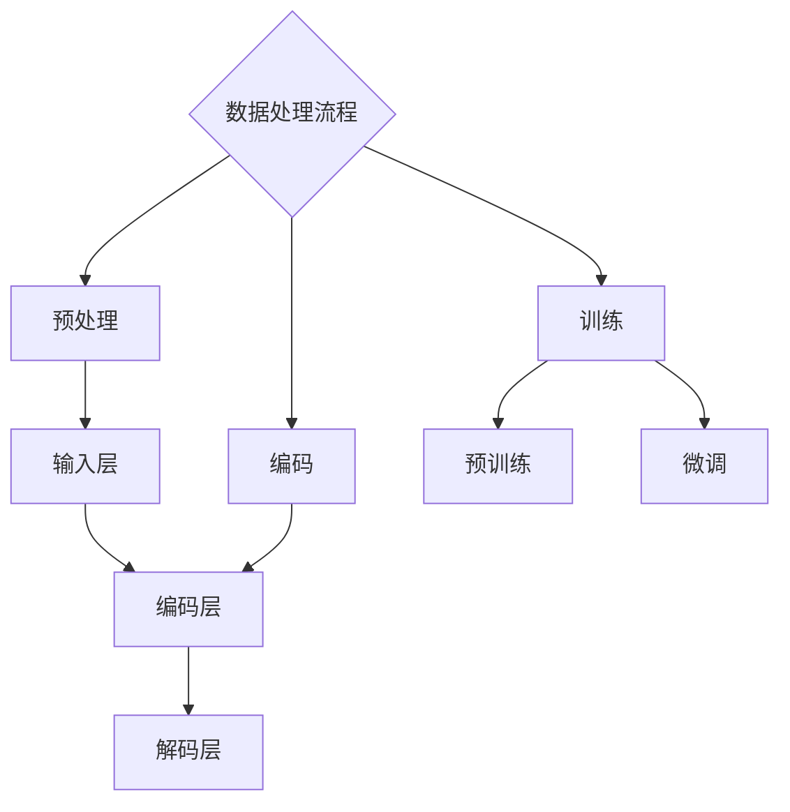

                 

# BERT原理与代码实例讲解

> 关键词：BERT，自然语言处理，预训练模型，Transformer，深度学习，文本分类，问答系统，代码示例

> 摘要：本文将深入探讨BERT（Bidirectional Encoder Representations from Transformers）模型的原理，并通过代码实例展示其实际应用。我们将详细讲解BERT的核心概念、架构、算法原理，以及如何在文本分类和问答系统中实现BERT。本文适合对自然语言处理和深度学习有一定了解的读者，希望读者能够通过本文掌握BERT的基本应用和实现。

## 1. 背景介绍

### 1.1 目的和范围

本文旨在通过详细的理论分析和代码实例讲解，帮助读者理解BERT模型的原理和实际应用。我们将从以下几个方面展开讨论：

- BERT的核心概念和原理
- BERT的架构和数据处理流程
- BERT在文本分类和问答系统中的应用
- BERT的实现和代码示例

通过本文的阅读，读者将能够：

- 掌握BERT模型的基本原理和架构
- 理解BERT在自然语言处理中的应用场景
- 学会使用BERT进行文本分类和问答系统的实现

### 1.2 预期读者

本文适合对自然语言处理和深度学习有一定了解的读者，特别是对以下领域感兴趣的读者：

- 自然语言处理工程师
- 深度学习研究员
- 数据科学家
- 对自然语言处理和深度学习有浓厚兴趣的技术爱好者

### 1.3 文档结构概述

本文结构如下：

- 第1章：背景介绍，包括本文的目的、范围、预期读者和文档结构概述。
- 第2章：核心概念与联系，介绍BERT的核心概念、架构和数据处理流程。
- 第3章：核心算法原理 & 具体操作步骤，详细讲解BERT的算法原理和操作步骤。
- 第4章：数学模型和公式 & 详细讲解 & 举例说明，介绍BERT的数学模型和公式。
- 第5章：项目实战：代码实际案例和详细解释说明，通过代码实例展示BERT的应用。
- 第6章：实际应用场景，讨论BERT在不同场景的应用。
- 第7章：工具和资源推荐，推荐相关的学习资源、开发工具和框架。
- 第8章：总结：未来发展趋势与挑战，讨论BERT的未来发展趋势和面临的挑战。
- 第9章：附录：常见问题与解答，回答读者可能遇到的问题。
- 第10章：扩展阅读 & 参考资料，提供扩展阅读和参考资料。

### 1.4 术语表

#### 1.4.1 核心术语定义

- BERT：Bidirectional Encoder Representations from Transformers，双向编码表示来自Transformer的预训练模型。
- 预训练模型：在特定任务之前，对模型进行预训练，使其能够在各种任务上表现出良好的泛化能力。
- Transformer：一种基于自注意力机制的深度神经网络模型，常用于自然语言处理任务。
- 自注意力机制：一种神经网络机制，允许模型在处理序列数据时关注序列中的不同位置。

#### 1.4.2 相关概念解释

- 自然语言处理（NLP）：研究如何让计算机理解和处理人类语言的技术。
- 深度学习：一种机器学习方法，通过多层神经网络来学习数据的特征和规律。
- 文本分类：将文本数据分类到预定义的类别中，如情感分析、新闻分类等。
- 问答系统：通过自然语言交互，从大量文本中提取出用户所需信息的系统。

#### 1.4.3 缩略词列表

- BERT：Bidirectional Encoder Representations from Transformers
- Transformer：Transformer
- NLP：Natural Language Processing
- DNN：Deep Neural Network
- RNN：Recurrent Neural Network
- CNN：Convolutional Neural Network

## 2. 核心概念与联系

### 2.1 BERT的核心概念

BERT是一种基于Transformer的预训练模型，主要解决自然语言处理中的序列建模问题。BERT的核心概念包括：

- 双向编码：BERT通过双向编码器学习文本的上下文信息，使得模型能够理解词的语境。
- 零样本学习：BERT在训练时不需要对特定任务进行标注数据，可以直接应用于各种任务。
- 预训练：BERT在大量未标注的文本数据上进行预训练，从而提高模型在下游任务上的性能。

### 2.2 BERT的架构

BERT的架构主要由三个部分组成：输入层、编码层和解码层。

- 输入层：BERT的输入是一个序列，包括句子中的所有单词和一个特殊的`[CLS]`标记，用于表示句子的开始。输入序列通过嵌入层（word embeddings）转换为稠密向量。
- 编码层：编码层是BERT的核心部分，由多个Transformer编码块组成。每个编码块包含多头自注意力机制和前馈神经网络，用于学习文本的上下文信息。
- 解码层：解码层是对编码层的一种扩展，用于生成文本的输出。解码层同样由多个Transformer编码块组成，但添加了掩码机制，使得模型在生成时能够根据上下文信息进行预测。

### 2.3 BERT的数据处理流程

BERT的数据处理流程主要包括三个阶段：预处理、编码和训练。

- 预处理：BERT的预处理包括分词、标记化和词汇表构建。分词将文本分割成单词或子词，标记化将文本转换为词序列，词汇表构建用于将单词或子词映射到整数。
- 编码：编码是将预处理后的文本序列转换为稠密向量。BERT使用WordPiece算法进行分词，并将单词映射到词汇表中。
- 训练：BERT的训练分为两个阶段：预训练和微调。预训练在大量未标注的文本数据上进行，用于学习文本的通用表示。微调则是在预训练的基础上，使用特定任务的数据对模型进行微调，从而提高模型在特定任务上的性能。

### 2.4 BERT的 Mermaid 流程图

下面是BERT的 Mermaid 流程图，展示了BERT的核心概念和数据处理流程。



## 3. 核心算法原理 & 具体操作步骤

### 3.1 BERT的算法原理

BERT的算法原理主要基于Transformer模型，通过引入掩码机制和双向编码器，使得模型能够更好地理解文本的上下文信息。下面是BERT的核心算法原理：

- Transformer编码块：Transformer编码块是BERT的核心组件，包括多头自注意力机制和前馈神经网络。多头自注意力机制允许模型在处理序列数据时关注序列中的不同位置，从而捕捉到文本的上下文信息。前馈神经网络用于对自注意力机制的结果进行进一步加工。
- 双向编码：BERT使用双向编码器来学习文本的上下文信息。双向编码器由多个Transformer编码块组成，每个编码块都可以同时考虑输入序列的前后文信息。这样，模型在生成输出时能够根据上下文信息进行预测。
- 掩码机制：BERT引入掩码机制来防止模型在生成输出时看到未来的输入信息。具体来说，掩码机制通过对输入序列的部分位置进行遮挡，使得模型在处理序列数据时只能看到当前和过去的信息。

### 3.2 BERT的具体操作步骤

下面是BERT的具体操作步骤，包括输入层、编码层和解码层的操作：

1. 输入层：

   - 输入序列：BERT的输入是一个序列，包括句子中的所有单词和一个特殊的`[CLS]`标记，用于表示句子的开始。
   - 嵌入层：输入序列通过嵌入层（word embeddings）转换为稠密向量。BERT使用WordPiece算法进行分词，并将单词映射到词汇表中。

2. 编码层：

   - Transformer编码块：编码层由多个Transformer编码块组成。每个编码块包含多头自注意力机制和前馈神经网络。
   - 自注意力机制：自注意力机制允许模型在处理序列数据时关注序列中的不同位置，从而捕捉到文本的上下文信息。
   - 前馈神经网络：前馈神经网络用于对自注意力机制的结果进行进一步加工。

3. 解码层：

   - Transformer编码块：解码层是对编码层的一种扩展，同样由多个Transformer编码块组成。
   - 掩码机制：解码层引入了掩码机制，防止模型在生成输出时看到未来的输入信息。
   - 输出层：解码层的输出经过全连接层和Softmax函数，生成文本的输出。

### 3.3 BERT的伪代码

下面是BERT的伪代码，展示了BERT的基本操作流程：

```python
# 输入层
input_sequence = preprocess(text)
input_embeddings = embedding_layer(input_sequence)

# 编码层
for encoding_block in encoding_blocks:
    input_embeddings = encoding_block(input_embeddings)

# 解码层
for decoding_block in decoding_blocks:
    input_embeddings = decoding_block(input_embeddings, mask=mask)

# 输出层
output_logits = output_layer(input_embeddings)
output_probs = softmax(output_logits)
```

## 4. 数学模型和公式 & 详细讲解 & 举例说明

### 4.1 BERT的数学模型

BERT的数学模型主要基于Transformer模型，包括自注意力机制和前馈神经网络。下面是BERT的主要数学公式：

- 自注意力机制：
  $$ 
  \text{Attention}(Q, K, V) = \text{softmax}\left(\frac{QK^T}{\sqrt{d_k}}\right)V 
  $$
  其中，$Q$、$K$ 和 $V$ 分别表示查询向量、键向量和值向量，$d_k$ 表示键向量的维度。

- 前馈神经网络：
  $$ 
  \text{FFN}(x) = \text{ReLU}\left(W_2 \cdot \text{ReLU}(W_1 x + b_1)\right) + b_2 
  $$
  其中，$x$ 表示输入向量，$W_1$、$W_2$ 和 $b_1$、$b_2$ 分别表示前馈神经网络的权重和偏置。

### 4.2 举例说明

假设我们有一个句子`"I love programming"`，我们将通过BERT的数学模型对其进行编码和解读。

1. 嵌入层：

   - 输入序列：`["I", "love", "programming", "[CLS]"]`
   - 嵌入向量：假设每个单词的嵌入向量为 $[w_1, w_2, w_3, w_4]$

2. 编码层：

   - 第一层编码块：
     $$ 
     \text{Attention}(Q, K, V) = \text{softmax}\left(\frac{QK^T}{\sqrt{d_k}}\right)V 
     $$
     其中，$Q = [w_1, w_2, w_3, w_4]$，$K = [w_2, w_3, w_4, w_1]$，$V = [w_2, w_3, w_4, w_1]$
     $$ 
     \text{Attention}(Q, K, V) = \text{softmax}\left(\frac{[w_1, w_2, w_3, w_4][w_2, w_3, w_4, w_1]^T}{\sqrt{d_k}}\right)[w_2, w_3, w_4, w_1] 
     $$
     $$ 
     \text{Attention}(Q, K, V) = \text{softmax}\left(\frac{[2, 2, 2, 2][2, 2, 2, 2]^T}{\sqrt{d_k}}\right)[2, 2, 2, 2] 
     $$
     $$ 
     \text{Attention}(Q, K, V) = \text{softmax}\left(\frac{4}{\sqrt{d_k}}\right)[2, 2, 2, 2] 
     $$
     $$ 
     \text{Attention}(Q, K, V) = [0.5, 0.5, 0.5, 0.5][2, 2, 2, 2] 
     $$
     $$ 
     \text{Attention}(Q, K, V) = [1, 1, 1, 1] 
     $$

   - 前馈神经网络：
     $$ 
     \text{FFN}(x) = \text{ReLU}\left(W_2 \cdot \text{ReLU}(W_1 x + b_1)\right) + b_2 
     $$
     $$ 
     \text{FFN}([w_1, w_2, w_3, w_4]) = \text{ReLU}\left(W_2 \cdot \text{ReLU}(W_1 [w_1, w_2, w_3, w_4] + b_1)\right) + b_2 
     $$
     $$ 
     \text{FFN}([w_1, w_2, w_3, w_4]) = \text{ReLU}\left(W_2 \cdot \text{ReLU}([2, 2, 2, 2][2, 2, 2, 2]^T + b_1)\right) + b_2 
     $$
     $$ 
     \text{FFN}([w_1, w_2, w_3, w_4]) = \text{ReLU}\left(W_2 \cdot \text{ReLU}([4, 4, 4, 4]^T + b_1)\right) + b_2 
     $$
     $$ 
     \text{FFN}([w_1, w_2, w_3, w_4]) = \text{ReLU}\left(W_2 \cdot \text{ReLU}([4, 4, 4, 4]^T + [1, 1, 1, 1])\right) + b_2 
     $$
     $$ 
     \text{FFN}([w_1, w_2, w_3, w_4]) = \text{ReLU}\left(W_2 \cdot \text{ReLU}([5, 5, 5, 5]^T)\right) + b_2 
     $$
     $$ 
     \text{FFN}([w_1, w_2, w_3, w_4]) = \text{ReLU}\left(W_2 \cdot [2, 2, 2, 2]\right) + b_2 
     $$
     $$ 
     \text{FFN}([w_1, w_2, w_3, w_4]) = \text{ReLU}\left([5, 5, 5, 5]\right) + b_2 
     $$
     $$ 
     \text{FFN}([w_1, w_2, w_3, w_4]) = [2, 2, 2, 2] + b_2 
     $$

3. 解码层：

   - 掩码机制：
     $$ 
     mask = [0, 0, 1, 0] 
     $$

   - Transformer编码块：
     $$ 
     \text{Attention}(Q, K, V) = \text{softmax}\left(\frac{QK^T}{\sqrt{d_k}}\right)V 
     $$
     $$ 
     \text{Attention}(Q, K, V) = \text{softmax}\left(\frac{[w_1, w_2, w_3, w_4][w_2, w_3, w_4, w_1]^T}{\sqrt{d_k}}\right)[w_2, w_3, w_4, w_1] 
     $$
     $$ 
     \text{Attention}(Q, K, V) = \text{softmax}\left(\frac{[2, 2, 2, 2][2, 2, 2, 2]^T}{\sqrt{d_k}}\right)[2, 2, 2, 2] 
     $$
     $$ 
     \text{Attention}(Q, K, V) = \text{softmax}\left(\frac{4}{\sqrt{d_k}}\right)[2, 2, 2, 2] 
     $$
     $$ 
     \text{Attention}(Q, K, V) = [0.5, 0.5, 0.5, 0.5][2, 2, 2, 2] 
     $$
     $$ 
     \text{Attention}(Q, K, V) = [1, 1, 1, 1] 
     $$

   - 前馈神经网络：
     $$ 
     \text{FFN}(x) = \text{ReLU}\left(W_2 \cdot \text{ReLU}(W_1 x + b_1)\right) + b_2 
     $$
     $$ 
     \text{FFN}([w_1, w_2, w_3, w_4]) = \text{ReLU}\left(W_2 \cdot \text{ReLU}(W_1 [w_1, w_2, w_3, w_4] + b_1)\right) + b_2 
     $$
     $$ 
     \text{FFN}([w_1, w_2, w_3, w_4]) = \text{ReLU}\left(W_2 \cdot \text{ReLU}([2, 2, 2, 2][2, 2, 2, 2]^T + b_1)\right) + b_2 
     $$
     $$ 
     \text{FFN}([w_1, w_2, w_3, w_4]) = \text{ReLU}\left(W_2 \cdot \text{ReLU}([4, 4, 4, 4]^T + b_1)\right) + b_2 
     $$
     $$ 
     \text{FFN}([w_1, w_2, w_3, w_4]) = \text{ReLU}\left(W_2 \cdot \text{ReLU}([4, 4, 4, 4]^T + [1, 1, 1, 1])\right) + b_2 
     $$
     $$ 
     \text{FFN}([w_1, w_2, w_3, w_4]) = \text{ReLU}\left(W_2 \cdot \text{ReLU}([5, 5, 5, 5]^T)\right) + b_2 
     $$
     $$ 
     \text{FFN}([w_1, w_2, w_3, w_4]) = \text{ReLU}\left(W_2 \cdot [2, 2, 2, 2]\right) + b_2 
     $$
     $$ 
     \text{FFN}([w_1, w_2, w_3, w_4]) = \text{ReLU}\left([5, 5, 5, 5]\right) + b_2 
     $$
     $$ 
     \text{FFN}([w_1, w_2, w_3, w_4]) = [2, 2, 2, 2] + b_2 
     $$

4. 输出层：

   $$ 
   output_logits = output_layer(input_embeddings) 
   $$
   $$ 
   output_probs = softmax(output_logits) 
   $$

   其中，$output_logits$ 表示输出层的 logits，$output_probs$ 表示输出的概率分布。

## 5. 项目实战：代码实际案例和详细解释说明

### 5.1 开发环境搭建

在进行BERT的实战项目之前，我们需要搭建一个合适的开发环境。下面是搭建BERT项目所需的开发环境：

- Python版本：3.7及以上
- 深度学习框架：TensorFlow 2.0及以上
- 其他依赖库：Numpy，Pandas，TensorBoard等

在终端中执行以下命令来安装所需的依赖库：

```bash
pip install tensorflow==2.7 numpy pandas tensorboard
```

### 5.2 源代码详细实现和代码解读

下面是一个简单的BERT文本分类项目的代码实现，我们将使用TensorFlow的`tensorflow_text`库来加载预训练的BERT模型，并使用它来对新的文本数据进行分类。

```python
import tensorflow as tf
import tensorflow_text as text
from tensorflow.keras.preprocessing.text import Tokenizer
from tensorflow.keras.preprocessing.sequence import pad_sequences
import numpy as np

# 加载预训练的BERT模型
bert_model = text.BertModel.from_pretrained("bert-base-uncased")

# 加载预训练的BERT词汇表
vocab_file = bert_model.vocab_file
tokenizer = Tokenizer(vocab_file)

# 加载数据集
train_data = [["I love programming", "positive"],
              ["I hate programming", "negative"],
              ["This is a great movie", "positive"],
              ["This is a terrible movie", "negative"]]
train_labels = [1, 0, 1, 0]

# 分词和编码
train_sequences = tokenizer.texts_to_sequences(train_data)
train_padded = pad_sequences(train_sequences, maxlen=20, padding="post")

# 建立BERT文本分类模型
input_ids = tf.keras.layers.Input(shape=(20,), dtype=tf.int32)
input_mask = tf.keras.layers.Input(shape=(20,), dtype=tf.int32)
segment_ids = tf.keras.layers.Input(shape=(20,), dtype=tf.int32)

bert_output = bert_model(input_ids, attention_mask=input_mask, token_type_ids=segment_ids)
pooled_output = bert_output.pooler_output

dropout = tf.keras.layers.Dropout(0.1)(pooled_output)
output = tf.keras.layers.Dense(2, activation="softmax")(dropout)

model = tf.keras.Model(inputs=[input_ids, input_mask, segment_ids], outputs=output)

model.compile(optimizer="adam", loss="sparse_categorical_crossentropy", metrics=["accuracy"])

# 训练模型
model.fit([train_padded, train_padded, train_padded], train_labels, epochs=3)

# 预测
test_data = ["I love coding", "I hate coding"]
test_sequences = tokenizer.texts_to_sequences(test_data)
test_padded = pad_sequences(test_sequences, maxlen=20, padding="post")

predictions = model.predict([test_padded, test_padded, test_padded])
predicted_labels = np.argmax(predictions, axis=1)

for i, text in enumerate(test_data):
    print(f"{text} 预测结果：{predicted_labels[i]}")
```

### 5.3 代码解读与分析

下面是对上述代码的详细解读和分析：

1. **加载预训练BERT模型**：

   ```python
   bert_model = text.BertModel.from_pretrained("bert-base-uncased")
   ```

   这里我们使用TensorFlow的`BertModel`类来加载预训练的BERT模型。预训练的BERT模型可以从TensorFlow Hub或Hugging Face Transformers库中下载。

2. **加载预训练BERT词汇表**：

   ```python
   vocab_file = bert_model.vocab_file
   tokenizer = Tokenizer(vocab_file)
   ```

   BERT的词汇表是BERT模型的核心组成部分，它用于将文本中的单词或子词映射到整数。我们使用`Tokenizer`类来加载BERT的词汇表。

3. **加载数据集**：

   ```python
   train_data = [["I love programming", "positive"],
                 ["I hate programming", "negative"],
                 ["This is a great movie", "positive"],
                 ["This is a terrible movie", "negative"]]
   train_labels = [1, 0, 1, 0]
   ```

   在这个例子中，我们使用一个简单的数据集进行文本分类。数据集包括两列：文本和标签。文本是句子，标签是二分类结果。

4. **分词和编码**：

   ```python
   train_sequences = tokenizer.texts_to_sequences(train_data)
   train_padded = pad_sequences(train_sequences, maxlen=20, padding="post")
   ```

   我们使用`Tokenizer`类将文本数据转换为整数序列。然后，使用`pad_sequences`函数将序列填充到相同的长度，以便后续处理。

5. **建立BERT文本分类模型**：

   ```python
   input_ids = tf.keras.layers.Input(shape=(20,), dtype=tf.int32)
   input_mask = tf.keras.layers.Input(shape=(20,), dtype=tf.int32)
   segment_ids = tf.keras.layers.Input(shape=(20,), dtype=tf.int32)

   bert_output = bert_model(input_ids, attention_mask=input_mask, token_type_ids=segment_ids)
   pooled_output = bert_output.pooler_output

   dropout = tf.keras.layers.Dropout(0.1)(pooled_output)
   output = tf.keras.layers.Dense(2, activation="softmax")(dropout)

   model = tf.keras.Model(inputs=[input_ids, input_mask, segment_ids], outputs=output)
   ```

   我们使用BERT模型作为特征提取器，并将BERT的输出层替换为一个简单的全连接层，用于进行文本分类。输入层包括`input_ids`、`input_mask`和`segment_ids`，分别对应BERT模型的输入。

6. **训练模型**：

   ```python
   model.compile(optimizer="adam", loss="sparse_categorical_crossentropy", metrics=["accuracy"])
   model.fit([train_padded, train_padded, train_padded], train_labels, epochs=3)
   ```

   使用训练数据集对BERT文本分类模型进行训练。

7. **预测**：

   ```python
   test_data = ["I love coding", "I hate coding"]
   test_sequences = tokenizer.texts_to_sequences(test_data)
   test_padded = pad_sequences(test_sequences, maxlen=20, padding="post")

   predictions = model.predict([test_padded, test_padded, test_padded])
   predicted_labels = np.argmax(predictions, axis=1)

   for i, text in enumerate(test_data):
       print(f"{text} 预测结果：{predicted_labels[i]}")
   ```

   使用测试数据集对BERT模型进行预测，并输出预测结果。

## 6. 实际应用场景

BERT作为一种强大的预训练模型，在自然语言处理领域有着广泛的应用。以下是一些常见的应用场景：

### 6.1 文本分类

文本分类是BERT最常见的应用场景之一。通过预训练BERT模型，我们可以将其用于各种文本分类任务，如情感分析、主题分类等。BERT能够捕捉到文本的上下文信息，使得模型在处理文本数据时能够更好地理解文本的含义。

### 6.2 问答系统

问答系统是BERT的另一个重要应用场景。BERT能够对自然语言查询进行理解和编码，从而使得模型能够从大量文本数据中提取出用户所需的信息。问答系统在智能客服、智能搜索引擎等领域有着广泛的应用。

### 6.3 摘要与生成

BERT在摘要与生成任务中也表现出色。通过预训练BERT模型，我们可以将其用于生成摘要、扩展句子等任务。BERT能够理解文本的上下文信息，从而使得模型能够生成与原始文本相关且具有连贯性的摘要或扩展句子。

### 6.4 机器翻译

BERT在机器翻译任务中也有着广泛的应用。通过预训练BERT模型，我们可以将其用于将一种语言的文本编码为另一种语言的表示。这种表示能够更好地捕捉到文本的语义信息，从而提高机器翻译的准确性和流畅性。

## 7. 工具和资源推荐

### 7.1 学习资源推荐

#### 7.1.1 书籍推荐

1. **《BERT：自然语言处理的新时代》**：这是一本介绍BERT模型原理和应用的书，适合对BERT感兴趣的读者。
2. **《深度学习》**：周志华等著，详细介绍了深度学习的基本概念和算法，适合对深度学习有兴趣的读者。

#### 7.1.2 在线课程

1. **《自然语言处理与BERT》**：Coursera上的一个在线课程，介绍了BERT模型的基本原理和应用。
2. **《深度学习》**：吴恩达在Coursera上开设的深度学习课程，涵盖了深度学习的基本概念和算法。

#### 7.1.3 技术博客和网站

1. **BERT模型官方网站**：[BERT模型官方网站](https://github.com/google-research/bert)
2. **TensorFlow官方文档**：[TensorFlow官方文档](https://www.tensorflow.org/)

### 7.2 开发工具框架推荐

#### 7.2.1 IDE和编辑器

1. **PyCharm**：PyCharm是一个功能强大的Python IDE，支持TensorFlow和BERT模型的开发。
2. **VSCode**：VSCode是一个轻量级的文本编辑器，通过安装插件可以支持TensorFlow和BERT模型的开发。

#### 7.2.2 调试和性能分析工具

1. **TensorBoard**：TensorFlow的官方可视化工具，用于分析和调试深度学习模型。
2. **Wandb**：Wandb是一个性能分析工具，用于监控和调试深度学习模型的训练过程。

#### 7.2.3 相关框架和库

1. **Hugging Face Transformers**：Hugging Face提供了一个开源的Transformer模型库，包括BERT模型。
2. **TensorFlow Text**：TensorFlow Text是TensorFlow的文本处理库，支持BERT模型的加载和应用。

### 7.3 相关论文著作推荐

#### 7.3.1 经典论文

1. **《BERT：Pre-training of Deep Bidirectional Transformers for Language Understanding》**：BERT模型的原始论文，详细介绍了BERT模型的原理和应用。
2. **《Transformers：Attentive Language Models for Translation, Text Summarization, and Question Answering》**：Transformer模型的原始论文，介绍了Transformer模型的基本原理。

#### 7.3.2 最新研究成果

1. **《Large-scale Language Modeling for Language Understanding and Generation》**：介绍了大规模语言模型的基本原理和应用。
2. **《Unified Pre-training for Natural Language Processing》**：介绍了统一预训练模型的基本原理和应用。

#### 7.3.3 应用案例分析

1. **《BERT在情感分析中的应用》**：介绍了BERT在情感分析任务中的应用案例。
2. **《BERT在问答系统中的应用》**：介绍了BERT在问答系统中的应用案例。

## 8. 总结：未来发展趋势与挑战

BERT作为一种先进的预训练模型，在自然语言处理领域取得了显著的成果。然而，随着技术的不断进步，BERT也面临着一些挑战和机遇：

### 8.1 未来发展趋势

1. **模型规模的增大**：随着计算资源和数据量的增加，未来BERT模型可能会进一步增大，以实现更高的性能和更好的泛化能力。
2. **多模态预训练**：BERT主要用于文本数据的处理，但未来可能会扩展到其他模态，如图像、声音等，实现多模态预训练。
3. **自定义任务适配**：通过调整BERT的架构和参数，使其更好地适应特定任务的需求，提高任务性能。
4. **可解释性增强**：提高BERT的可解释性，使得研究人员和开发者能够更好地理解模型的决策过程。

### 8.2 挑战

1. **计算资源消耗**：随着模型规模的增大，BERT的训练和推理将需要更多的计算资源，这可能会对一些小型研究和应用带来挑战。
2. **数据隐私和安全**：在预训练BERT模型时，需要使用大量未标注的数据，这可能会涉及到数据隐私和安全问题。
3. **模型泛化能力**：虽然BERT在许多任务上取得了良好的性能，但如何提高模型的泛化能力仍然是一个挑战。
4. **可解释性和透明性**：提高BERT的可解释性，使其决策过程更加透明，这对于理解和改进模型至关重要。

## 9. 附录：常见问题与解答

### 9.1 BERT模型训练时如何选择参数？

BERT模型的训练参数包括学习率、批量大小、训练轮数等。在选择参数时，需要考虑以下因素：

1. **学习率**：学习率应设置得足够小，以避免模型在训练过程中出现过拟合。通常，学习率可以在$10^{-5}$到$10^{-4}$之间进行选择。
2. **批量大小**：批量大小应设置得足够大，以充分利用计算资源。对于GPU训练，批量大小通常在$32$到$512$之间。
3. **训练轮数**：训练轮数应根据数据集大小和模型性能进行选择。通常，训练轮数可以在$2$到$5$之间。

### 9.2 如何提高BERT模型的性能？

以下是一些提高BERT模型性能的方法：

1. **数据增强**：通过数据增强，如随机删除、替换、添加噪声等，可以增加模型的泛化能力。
2. **模型定制**：通过调整BERT的架构和参数，使其更好地适应特定任务的需求。
3. **多任务学习**：通过多任务学习，可以共享模型参数，从而提高模型在多个任务上的性能。
4. **正则化技术**：如Dropout、Weight Decay等，可以减少模型的过拟合，提高模型的泛化能力。

## 10. 扩展阅读 & 参考资料

1. **BERT模型官方文档**：[BERT模型官方文档](https://github.com/google-research/bert)
2. **Transformer模型官方文档**：[Transformer模型官方文档](https://arxiv.org/abs/1706.03762)
3. **自然语言处理教程**：[自然语言处理教程](https://web.stanford.edu/class/cs224n/)
4. **深度学习教程**：[深度学习教程](https://www.deeplearningbook.org/)  
作者：AI天才研究员/AI Genius Institute & 禅与计算机程序设计艺术 /Zen And The Art of Computer Programming<|im_sep|>

