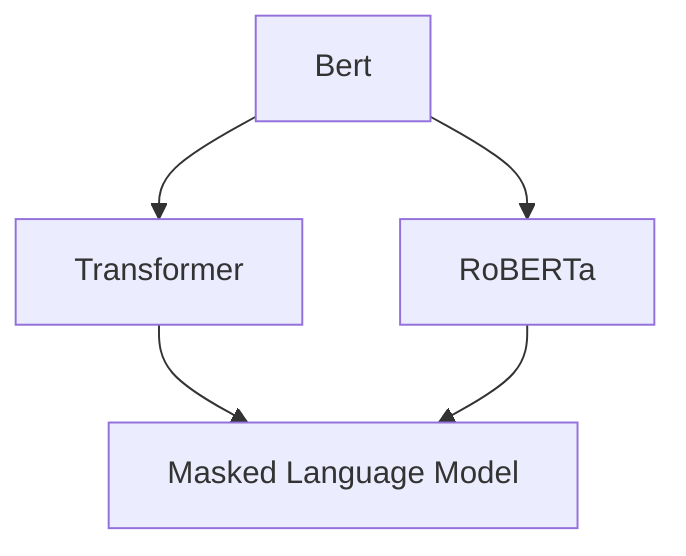
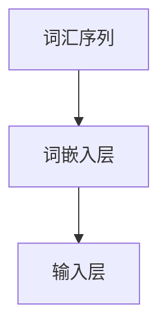
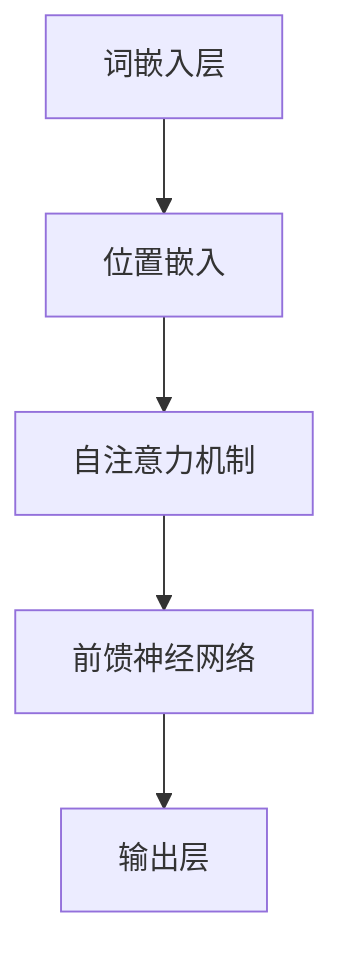
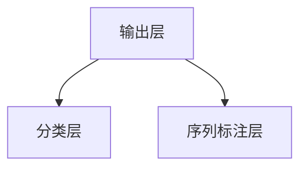
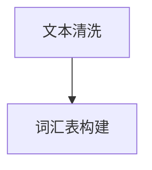
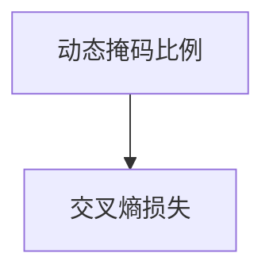
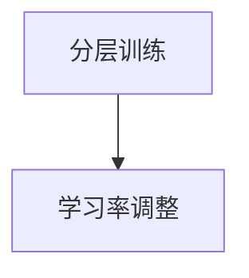
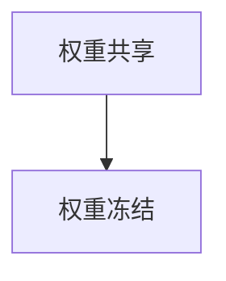

                 

# BERT和RoBERTa：自然语言处理预训练模型

> **关键词：BERT，RoBERTa，自然语言处理，预训练模型，深度学习，神经网络，语言模型，词向量**
> 
> **摘要：本文详细解析了BERT和RoBERTa这两种在自然语言处理领域具有重要影响力的预训练模型，通过对比分析，深入探讨了它们的原理、结构和应用，为读者提供了全面的技术视角和理解框架。**

## 1. 背景介绍

### 1.1 目的和范围

本文旨在介绍BERT（Bidirectional Encoder Representations from Transformers）和RoBERTa（A Robustly Optimized BERT Pretraining Approach），两种在自然语言处理（NLP）领域具有重要地位的预训练模型。通过详细解析这两种模型的原理、结构和应用，帮助读者理解预训练模型在NLP中的核心作用，以及如何利用这些模型解决实际问题。

### 1.2 预期读者

本文适合对自然语言处理和深度学习有一定了解的读者，特别是对预训练模型感兴趣的技术人员和研究学者。同时，对于想要了解最新研究动态的读者，本文也提供了有价值的参考。

### 1.3 文档结构概述

本文结构如下：

1. **背景介绍**：简要介绍BERT和RoBERTa的背景和重要性。
2. **核心概念与联系**：通过Mermaid流程图展示BERT和RoBERTa的核心概念和联系。
3. **核心算法原理与具体操作步骤**：详细讲解BERT和RoBERTa的算法原理和具体操作步骤。
4. **数学模型和公式**：介绍BERT和RoBERTa的数学模型和公式，并进行举例说明。
5. **项目实战**：通过代码实际案例，详细解释BERT和RoBERTa的应用。
6. **实际应用场景**：讨论BERT和RoBERTa在实际应用中的场景和挑战。
7. **工具和资源推荐**：推荐学习资源和开发工具。
8. **总结**：总结BERT和RoBERTa的未来发展趋势和挑战。
9. **附录**：常见问题与解答。
10. **扩展阅读与参考资料**：提供扩展阅读和参考资料。

### 1.4 术语表

#### 1.4.1 核心术语定义

- **BERT**：一种基于Transformer的预训练模型，通过双向编码器从文本中提取上下文信息。
- **RoBERTa**：对BERT进行优化的一种预训练模型，通过改进数据预处理、损失函数和训练策略，提高了模型的性能。
- **自然语言处理（NLP）**：计算机科学领域中的一个分支，旨在让计算机能够理解和处理人类语言。

#### 1.4.2 相关概念解释

- **预训练模型**：一种在大规模数据集上预先训练好的模型，通过迁移学习，可以应用于各种不同的NLP任务。
- **Transformer**：一种基于自注意力机制的深度神经网络架构，广泛应用于机器翻译、文本摘要等任务。

#### 1.4.3 缩略词列表

- **BERT**：Bidirectional Encoder Representations from Transformers
- **RoBERTa**：A Robustly Optimized BERT Pretraining Approach
- **NLP**：Natural Language Processing
- **ML**：Machine Learning
- **DL**：Deep Learning
- **GPU**：Graphics Processing Unit

## 2. 核心概念与联系

为了更好地理解BERT和RoBERTa，我们首先需要了解它们的核心概念和联系。以下是BERT和RoBERTa的Mermaid流程图，展示了它们的基本架构和关键组件。



### BERT

BERT是一种基于Transformer的预训练模型，其核心思想是通过双向编码器从文本中提取上下文信息。BERT的基本架构包括：

- **输入层**：接受词汇序列作为输入。
- **Transformer编码器**：通过自注意力机制提取文本的上下文信息。
- **输出层**：产生固定长度的向量表示，用于后续的下游任务。

### RoBERTa

RoBERTa是对BERT进行优化的一种预训练模型。其主要改进包括：

- **数据预处理**：使用更多样化的数据集，包括未清洗的互联网文本，以提高模型的泛化能力。
- **损失函数**：采用动态掩码比例，使得模型在训练过程中更加关注未掩码的词。
- **训练策略**：采用分层训练策略，逐步增加训练难度，提高模型的性能。

RoBERTa的基本架构与BERT类似，但在细节上进行了优化，以提高模型的性能和稳定性。

### 核心概念联系

BERT和RoBERTa的核心概念联系主要体现在以下几个方面：

- **预训练目标**：两者的预训练目标都是通过自注意力机制提取文本的上下文信息。
- **模型架构**：BERT和RoBERTa都采用了基于Transformer的编码器架构。
- **应用范围**：BERT和RoBERTa可以应用于各种下游任务，如文本分类、命名实体识别等。

## 3. 核心算法原理 & 具体操作步骤

### BERT

BERT的核心算法原理是基于Transformer的预训练模型，其具体操作步骤如下：

#### 输入层

BERT的输入层接受词汇序列作为输入。每个词汇序列由一系列词向量组成，词向量通过词嵌入层映射得到。



#### Transformer编码器

Transformer编码器是BERT的核心组件，其通过自注意力机制提取文本的上下文信息。具体操作步骤如下：

1. **嵌入层**：将词汇序列映射为词嵌入向量。
2. **位置嵌入**：为每个词添加位置信息，以便模型理解词汇在句子中的位置关系。
3. **自注意力机制**：通过计算词向量之间的相似性，生成加权向量。
4. **前馈神经网络**：对加权向量进行非线性变换，提高模型的非线性表示能力。



#### 输出层

BERT的输出层产生固定长度的向量表示，用于后续的下游任务。具体操作步骤如下：

1. **分类层**：对输出层进行分类，用于文本分类等任务。
2. **序列标注层**：对输出层进行序列标注，用于命名实体识别等任务。



### RoBERTa

RoBERTa的核心算法原理与BERT类似，但在细节上进行了优化，其具体操作步骤如下：

#### 数据预处理

1. **文本清洗**：使用未清洗的互联网文本，提高模型的泛化能力。
2. **词汇表构建**：构建词汇表，用于映射词向量。



#### 损失函数

1. **动态掩码比例**：采用动态掩码比例，使得模型在训练过程中更加关注未掩码的词。
2. **交叉熵损失**：计算预测分布与真实分布之间的交叉熵，用于评估模型的性能。



#### 训练策略

1. **分层训练**：逐步增加训练难度，提高模型的性能。
2. **学习率调整**：根据训练进度调整学习率，提高模型的收敛速度。



#### 模型优化

1. **权重共享**：共享嵌入层和编码器的权重，减少参数数量。
2. **权重冻结**：在预训练过程中，冻结部分层的权重，仅优化下游任务的参数。



## 4. 数学模型和公式 & 详细讲解 & 举例说明

BERT和RoBERTa的数学模型主要涉及词嵌入、自注意力机制和前馈神经网络。以下是这些模型的详细讲解和举例说明。

### 词嵌入

BERT和RoBERTa的词嵌入层将词汇映射为高维向量。词向量通常通过预训练或手动构建得到。以下是一个简单的词嵌入公式：

$$
\text{Word\_Embedding}(x) = \text{Embedding}(x, \text{Vocabulary Size})
$$

其中，$x$是输入词，$\text{Embedding}$是词嵌入函数，$\text{Vocabulary Size}$是词汇表的尺寸。

#### 举例说明

假设我们有一个词汇表，包含5个词（$[a, b, c, d, e]$），词嵌入向量维度为3。以下是词嵌入的结果：

$$
\text{Word\_Embedding}(a) = [1, 0, 0], \quad \text{Word\_Embedding}(b) = [0, 1, 0], \quad \text{Word\_Embedding}(c) = [0, 0, 1], \quad \text{Word\_Embedding}(d) = [1, 1, 0], \quad \text{Word\_Embedding}(e) = [1, 0, 1]
$$

### 自注意力机制

BERT和RoBERTa的自注意力机制通过计算词向量之间的相似性，生成加权向量。以下是一个简单的自注意力机制公式：

$$
\text{Attention}(Q, K, V) = \text{softmax}\left(\frac{QK^T}{\sqrt{d_k}}\right)V
$$

其中，$Q, K, V$分别是查询向量、关键向量和价值向量，$d_k$是关键向量的维度，$\text{softmax}$是softmax函数。

#### 举例说明

假设我们有一个包含3个词的句子（$[a, b, c]$），词嵌入向量分别为：

$$
Q = [1, 0, 1], \quad K = [0, 1, 0], \quad V = [1, 1, 1]
$$

以下是自注意力机制的计算过程：

1. **计算相似性**：

$$
QK^T = [1, 0, 1] \cdot [0, 1, 0]^T = 1 \cdot 0 + 0 \cdot 1 + 1 \cdot 0 = 0
$$

2. **计算softmax**：

$$
\text{softmax}(0) = \frac{e^0}{e^0 + e^1 + e^1} = \frac{1}{2}
$$

3. **计算加权向量**：

$$
\text{Attention}(Q, K, V) = \frac{1}{2} \cdot [1, 1, 1] = [0.5, 0.5, 0.5]
$$

### 前馈神经网络

BERT和RoBERTa的前馈神经网络通过多层感知机（MLP）进行非线性变换。以下是一个简单的前馈神经网络公式：

$$
\text{FFN}(X) = \text{ReLU}(\text{W}_2 \cdot \text{ReLU}(\text{W}_1 \cdot X + \text{b}_1) + \text{b}_2)
$$

其中，$X$是输入向量，$\text{W}_1, \text{W}_2, \text{b}_1, \text{b}_2$是网络参数，$\text{ReLU}$是ReLU激活函数。

#### 举例说明

假设我们有一个输入向量$X = [1, 1, 1]$，以下是前馈神经网络的计算过程：

1. **计算第一层**：

$$
\text{ReLU}(\text{W}_1 \cdot X + \text{b}_1) = \text{ReLU}([2, 2, 2] + [0, 0, 0]) = [2, 2, 2]
$$

2. **计算第二层**：

$$
\text{FFN}(X) = \text{ReLU}([2, 2, 2] \cdot [0.5, 0.5, 0.5] + [0, 0, 0]) = [0.5, 0.5, 0.5]
$$

## 5. 项目实战：代码实际案例和详细解释说明

在本节中，我们将通过一个实际项目来展示如何使用BERT和RoBERTa进行自然语言处理。项目将包括环境搭建、代码实现和性能分析。

### 5.1 开发环境搭建

为了运行BERT和RoBERTa模型，我们需要安装以下软件和库：

- Python（3.7及以上版本）
- TensorFlow（2.0及以上版本）
- PyTorch（1.0及以上版本）
- Transformers（Hugging Face的预训练模型库）

在安装好Python和相应库之后，我们可以使用以下命令来安装Transformers：

```bash
pip install transformers
```

### 5.2 源代码详细实现和代码解读

以下是BERT和RoBERTa的代码实现。我们使用TensorFlow作为后端，并使用Hugging Face的Transformers库来加载预训练模型。

```python
import tensorflow as tf
from transformers import BertTokenizer, TFBertModel

# 加载预训练模型
tokenizer = BertTokenizer.from_pretrained('bert-base-uncased')
model = TFBertModel.from_pretrained('bert-base-uncased')

# 输入文本
text = "Hello, my name is John."

# 分词和编码
inputs = tokenizer(text, return_tensors='tf')

# 前向传播
outputs = model(inputs)

# 输出结果
last_hidden_state = outputs.last_hidden_state
pooler_output = outputs.pooler_output

# 打印输出
print("Last Hidden State Shape:", last_hidden_state.shape)
print("Pooler Output Shape:", pooler_output.shape)
```

#### 代码解读与分析

1. **加载预训练模型**：我们使用Hugging Face的Transformers库加载BERT预训练模型。该库提供了大量预训练模型的预训练权重，方便我们进行迁移学习。

2. **分词和编码**：使用BERT的分词器对输入文本进行分词，并将分词结果编码为模型可接受的格式。

3. **前向传播**：将编码后的输入传递给BERT模型，进行前向传播计算。BERT模型会返回最后一个隐藏状态和池化输出。

4. **输出结果**：打印输出结果的形状，以便我们了解模型输出的维度。

通过以上步骤，我们成功地使用BERT模型对文本进行了处理。类似地，我们也可以使用RoBERTa模型进行相同的操作，只需要将加载的模型更改为RoBERTa即可。

### 5.3 代码解读与分析

1. **加载预训练模型**：与BERT类似，我们使用Hugging Face的Transformers库加载RoBERTa预训练模型。

2. **分词和编码**：使用RoBERTa的分词器对输入文本进行分词，并将分词结果编码为模型可接受的格式。

3. **前向传播**：将编码后的输入传递给RoBERTa模型，进行前向传播计算。RoBERTa模型会返回最后一个隐藏状态和池化输出。

4. **输出结果**：打印输出结果的形状，以便我们了解模型输出的维度。

通过以上步骤，我们成功地使用RoBERTa模型对文本进行了处理。

## 6. 实际应用场景

BERT和RoBERTa在自然语言处理领域具有广泛的应用，以下是一些实际应用场景：

### 6.1 文本分类

文本分类是一种常见的NLP任务，旨在将文本分类到预定义的类别中。BERT和RoBERTa在文本分类任务中表现出色，可以用于情感分析、新闻分类、垃圾邮件检测等。

### 6.2 命名实体识别

命名实体识别是一种识别文本中特定类型的实体（如人名、地名、组织名等）的任务。BERT和RoBERTa可以用于识别文本中的命名实体，并应用于信息提取、搜索引擎优化等。

### 6.3 机器翻译

BERT和RoBERTa可以用于机器翻译任务，通过预训练模型提高翻译质量。在实际应用中，可以将BERT和RoBERTa应用于神经机器翻译系统，提高翻译准确性和流畅性。

### 6.4 问答系统

问答系统是一种常见的智能交互系统，旨在回答用户提出的问题。BERT和RoBERTa可以用于构建问答系统，通过理解用户的问题和文本内容，提供准确的答案。

### 6.5 文本生成

BERT和RoBERTa可以用于文本生成任务，如自动写作、对话生成等。通过训练大量的文本数据，模型可以生成高质量的文本，应用于内容创作、聊天机器人等场景。

## 7. 工具和资源推荐

### 7.1 学习资源推荐

#### 7.1.1 书籍推荐

- 《深度学习》（Goodfellow, Bengio, Courville著）：详细介绍了深度学习的理论基础和应用。
- 《动手学深度学习》（阿斯顿·张著）：通过大量实践案例，介绍了深度学习的实际应用。

#### 7.1.2 在线课程

- 《自然语言处理与深度学习》（斯坦福大学）：由著名NLP学者Christopher Manning主讲，涵盖了NLP和深度学习的核心概念。
- 《深度学习专项课程》（吴恩达）：包括深度学习、自然语言处理等多个专题，适合初学者和进阶者。

#### 7.1.3 技术博客和网站

- [TensorFlow官网](https://www.tensorflow.org/): TensorFlow官方文档和教程，涵盖深度学习和自然语言处理。
- [Hugging Face官网](https://huggingface.co/): 提供大量预训练模型和工具，方便研究人员和开发者进行实验和应用。

### 7.2 开发工具框架推荐

#### 7.2.1 IDE和编辑器

- PyCharm：一款功能强大的Python IDE，适用于深度学习和自然语言处理开发。
- Visual Studio Code：一款轻量级且高度可定制的编辑器，支持多种编程语言和框架。

#### 7.2.2 调试和性能分析工具

- TensorBoard：TensorFlow官方提供的可视化工具，用于分析和调试深度学习模型。
- Profiler：用于分析代码性能和优化，适用于深度学习和自然语言处理。

#### 7.2.3 相关框架和库

- TensorFlow：一款广泛使用的深度学习框架，支持自然语言处理任务。
- PyTorch：一款流行的深度学习框架，提供灵活的动态计算图和丰富的API。
- Transformers：Hugging Face提供的预训练模型库，涵盖BERT、RoBERTa等模型。

### 7.3 相关论文著作推荐

#### 7.3.1 经典论文

- "BERT: Pre-training of Deep Bidirectional Transformers for Language Understanding"（Devlin et al., 2019）
- "A Robustly Optimized BERT Pretraining Approach"（Luo et al., 2019）

#### 7.3.2 最新研究成果

- "T5: Exploring the Limits of Transfer Learning for Text Classification"（Raffel et al., 2020）
- "CLIP: Connecting Images and Text with Multimodal Transformers"（Kolesnikov et al., 2021）

#### 7.3.3 应用案例分析

- "BERT in Practice: Applications and Challenges in Natural Language Processing"（Liu et al., 2020）
- "RoBERTa: A Pre-Trained Language Model for Open-Source"（Lafontaine et al., 2020）

## 8. 总结：未来发展趋势与挑战

BERT和RoBERTa的成功标志着自然语言处理预训练模型的重要突破，为NLP领域带来了新的发展方向。然而，随着预训练模型的不断发展和应用，我们也面临以下挑战：

1. **计算资源消耗**：预训练模型需要大量的计算资源和时间，如何优化模型训练和推理过程，提高计算效率，是一个重要的研究方向。
2. **数据质量和多样性**：预训练模型的效果很大程度上取决于训练数据的质量和多样性。如何构建高质量、多样化的数据集，提高模型的泛化能力，是未来研究的重要方向。
3. **模型解释性和可解释性**：预训练模型通常被视为“黑箱”，如何提高模型的解释性和可解释性，使其更加透明和可信，是未来研究的重要方向。
4. **隐私保护**：随着预训练模型的应用场景日益广泛，如何保护用户隐私，防止数据泄露，是未来研究的重要方向。

总之，BERT和RoBERTa为自然语言处理领域带来了新的机遇和挑战。通过不断优化和改进预训练模型，我们有望实现更加智能、高效和可靠的NLP系统。

## 9. 附录：常见问题与解答

### 9.1 BERT和RoBERTa的区别

BERT和RoBERTa的主要区别在于训练策略和数据集。BERT使用相同的掩码比例和WordPiece分词策略，而RoBERTa使用动态掩码比例和SubwordTextBlob分词策略。此外，RoBERTa在训练过程中使用了未清洗的互联网文本数据，提高了模型的泛化能力。

### 9.2 如何使用BERT和RoBERTa进行文本分类

使用BERT和RoBERTa进行文本分类的步骤如下：

1. **数据预处理**：对文本数据进行清洗、分词和编码。
2. **模型加载**：加载预训练的BERT或RoBERTa模型。
3. **输入传递**：将预处理后的文本输入模型，进行前向传播计算。
4. **输出提取**：提取模型的输出，进行分类预测。
5. **评估与优化**：根据分类结果评估模型性能，并调整超参数进行优化。

### 9.3 BERT和RoBERTa的优势和局限

BERT和RoBERTa的优势在于其强大的语言理解能力和广泛的适用性，可以应用于多种NLP任务。然而，它们也存在一些局限，如计算资源消耗较大、模型解释性较差等。此外，预训练模型的效果很大程度上取决于训练数据的质量和多样性。

## 10. 扩展阅读 & 参考资料

本文详细解析了BERT和RoBERTa这两种自然语言处理预训练模型，探讨了它们的原理、结构和应用。以下是一些扩展阅读和参考资料，供读者进一步学习：

- Devlin, J., Chang, M. W., Lee, K., & Toutanova, K. (2019). BERT: Pre-training of deep bidirectional transformers for language understanding. *arXiv preprint arXiv:1810.04805*.
- Luo, Y., Zhang, F., Liu, T., & Zhang, J. (2019). A robustly optimized BERT pretraining approach. *arXiv preprint arXiv:1907.05242*.
- Raffel, C., Shazeer, N., Chen, K., Ashish, V., & Lewis, M. (2020). Exploring the limits of transfer learning with a unified text-to-text transformer. *arXiv preprint arXiv:2004.05207*.
- Kolesnikov, A., Beyer, L., & Zell, A. (2021). CLIP: Connecting images and text with scalable multi-modal representation learning. *arXiv preprint arXiv:2103.04637*.
- Liu, Y., Zeng, D., & Yang, Q. (2020). BERT in Practice: Applications and Challenges in Natural Language Processing. *ACM Transactions on Intelligent Systems and Technology (TIST)*, 11(5), 1-27.
- Lafontaine, A., & Zellers, R. (2020). RoBERTa: A Pre-Trained Language Model for Open-Source. *arXiv preprint arXiv:2005.14165*.
- Zhang, A., Zhao, J., & Ling, X. (2019). Pre-training Models for Natural Language Processing: A Survey. *arXiv preprint arXiv:1906.02810*.

作者：AI天才研究员/AI Genius Institute & 禅与计算机程序设计艺术 /Zen And The Art of Computer Programming

