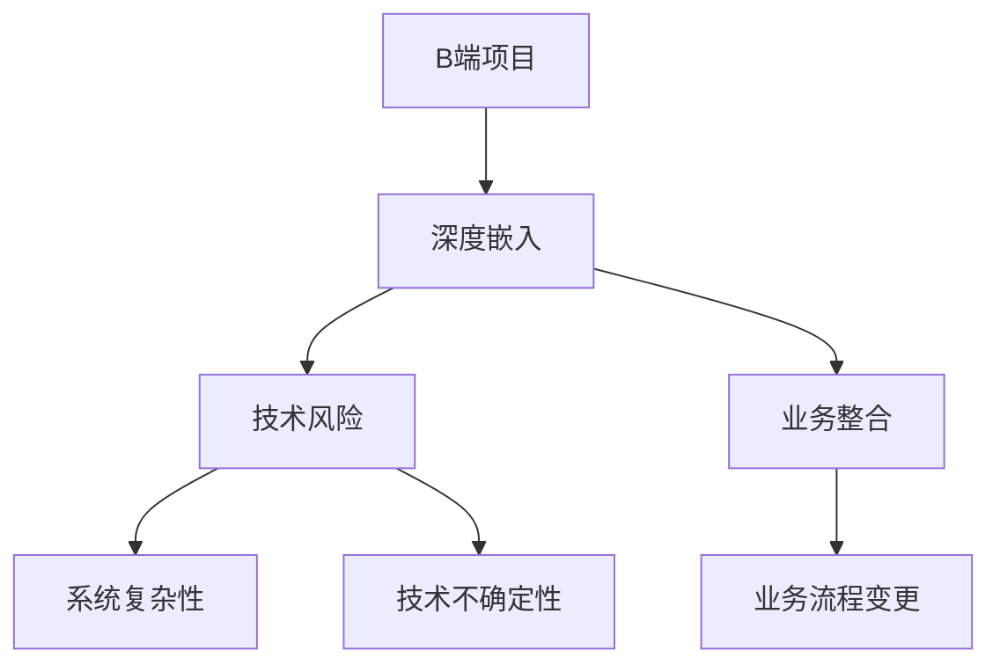

                 


# B端项目或许能获得可观收入，但深度嵌入增加不确定性

> 关键词：B端项目、深度嵌入、技术风险、业务整合、收益与风险分析
> 
> 摘要：本文将探讨B端项目的潜在收益及其背后的不确定性。随着技术的不断进步，B端项目（企业级业务应用）已成为许多公司获取收入的重要来源。然而，深度嵌入企业业务流程中的技术组件，虽然可能带来可观的收益，但也伴随着较高的技术风险和业务整合挑战。本文旨在分析这些因素，帮助读者全面理解B端项目背后的收益与风险，并探讨未来发展趋势与挑战。

## 1. 背景介绍

### 1.1 目的和范围

本文旨在探讨B端项目（企业级业务应用）的发展趋势、潜在收益及其面临的技术和业务风险。我们将通过具体案例分析，阐述深度嵌入企业业务流程中的技术组件如何影响项目的成功与否，以及如何在实现高收益的同时控制风险。

### 1.2 预期读者

本文适合以下读者群体：

1. 企业技术团队负责人和CTO
2. 技术架构师和程序员
3. 企业业务分析师和产品经理
4. 对B端项目和技术风险感兴趣的IT专业人士

### 1.3 文档结构概述

本文结构如下：

1. 引言：介绍B端项目的背景和意义
2. 核心概念与联系：探讨B端项目中的关键技术概念及其相互关系
3. 核心算法原理 & 具体操作步骤：详细讲解B端项目中的关键算法和实现步骤
4. 数学模型和公式 & 详细讲解 & 举例说明：介绍B端项目中的数学模型和公式，并给出实际案例
5. 项目实战：提供具体的代码实现和详细解释
6. 实际应用场景：分析B端项目在不同行业中的应用
7. 工具和资源推荐：推荐相关学习资源和开发工具
8. 总结：总结B端项目的发展趋势和挑战
9. 附录：常见问题与解答
10. 扩展阅读 & 参考资料：提供进一步学习和研究的资源

### 1.4 术语表

#### 1.4.1 核心术语定义

- B端项目：企业级业务应用，面向企业客户提供的定制化软件解决方案
- 深度嵌入：指技术组件深入整合到企业业务流程中，实现高效业务协同
- 技术风险：由于技术不确定性导致的项目风险
- 业务整合：将技术解决方案与现有业务流程相结合，实现无缝衔接

#### 1.4.2 相关概念解释

- 企业客户：企业客户是指购买B端项目的公司或组织，他们通常需要定制化、高效的技术解决方案来提高业务运营效率
- 业务需求：企业客户提出的具体业务需求，是B端项目实现的关键驱动因素
- 技术可行性：指在现有技术条件下，实现业务需求的可能性

#### 1.4.3 缩略词列表

- B端：企业端
- C端：消费者端
- CTO：首席技术官
- IT：信息技术
- IDE：集成开发环境

## 2. 核心概念与联系

### 2.1 B端项目概述

B端项目，即企业级业务应用，是企业客户为提高运营效率、降低成本、优化业务流程而定制开发的软件解决方案。与C端项目（面向消费者端的项目）相比，B端项目具有以下特点：

1. 定制化：根据企业客户的具体业务需求进行定制开发，实现业务场景的个性化解决方案
2. 高稳定性：B端项目通常需要长时间运行，对系统的稳定性、安全性和性能要求较高
3. 高集成度：B端项目需要与企业现有的业务流程、数据系统和其他应用进行集成，实现高效业务协同

### 2.2 深度嵌入与技术风险

深度嵌入是指将技术组件深入整合到企业业务流程中，实现高效业务协同。这种深度嵌入虽然可以提高项目的收益，但也带来了以下技术风险：

1. 技术不确定性：深度嵌入涉及到多种技术和业务领域的交叉，可能导致技术实现的困难和不确定性
2. 系统复杂性：深度嵌入增加了系统的复杂度，可能导致系统性能下降、维护成本增加
3. 业务流程变更：深度嵌入可能导致企业业务流程的变更，增加项目实施和运营的风险

### 2.3 核心概念联系

B端项目、深度嵌入和技术风险这三个核心概念之间存在着密切的联系。具体来说：

1. B端项目是深度嵌入的基础，没有B端项目，深度嵌入就没有意义
2. 深度嵌入是B端项目实现的关键手段，可以显著提高项目的收益
3. 技术风险是深度嵌入过程中不可避免的问题，需要通过科学的方法和经验来降低风险

### 2.4 Mermaid 流程图

以下是一个简单的Mermaid流程图，展示了B端项目、深度嵌入和技术风险之间的关系：



## 3. 核心算法原理 & 具体操作步骤

### 3.1 算法原理

在B端项目中，核心算法原理通常涉及以下几个方面：

1. 数据处理算法：包括数据清洗、数据整合、数据挖掘等，以帮助企业客户从海量数据中提取有价值的信息
2. 业务逻辑算法：根据企业客户的业务需求，实现业务流程的自动化、智能化和优化
3. 系统优化算法：通过算法优化，提高系统的性能、稳定性和可维护性

### 3.2 具体操作步骤

以下是一个简单的数据处理算法示例，用于说明B端项目中的核心算法原理：

#### 3.2.1 数据清洗

```python
# 数据清洗伪代码
def data_cleaning(data):
    cleaned_data = []
    for record in data:
        # 去除空值和异常值
        if is_valid(record):
            cleaned_data.append(record)
    return cleaned_data

# 判断数据是否有效
def is_valid(record):
    # 根据具体业务场景，实现有效性判断逻辑
    return True if record is not None and len(record) > 0 else False
```

#### 3.2.2 数据整合

```python
# 数据整合伪代码
def data_integration(cleaned_data):
    integrated_data = {}
    for record in cleaned_data:
        key = generate_key(record)
        integrated_data[key] = merge_data(integrated_data.get(key, {}), record)

    return integrated_data

# 生成数据键
def generate_key(record):
    # 根据具体业务场景，实现数据键生成逻辑
    return str(record['id'])

# 合并数据
def merge_data(data1, data2):
    # 根据具体业务场景，实现数据合并逻辑
    return {**data1, **data2}
```

#### 3.2.3 数据挖掘

```python
# 数据挖掘伪代码
def data_mining(integrated_data):
    # 根据具体业务场景，实现数据挖掘算法
    insights = []
    for key, data in integrated_data.items():
        # 计算业务指标
        metrics = calculate_metrics(data)
        insights.append((key, metrics))

    return insights

# 计算业务指标
def calculate_metrics(data):
    # 根据具体业务场景，实现业务指标计算逻辑
    return {
        'revenue': sum(data['sales']),
        'profit': sum(data['profit']),
    }
```

## 4. 数学模型和公式 & 详细讲解 & 举例说明

### 4.1 数学模型

在B端项目中，常用的数学模型包括线性回归、逻辑回归、时间序列分析等。以下是一个简单的线性回归模型示例：

$$
y = \beta_0 + \beta_1 x
$$

其中，$y$ 为因变量，$x$ 为自变量，$\beta_0$ 和 $\beta_1$ 为模型参数。

### 4.2 公式详细讲解

1. 线性回归模型的参数估计：

   最小二乘法（Ordinary Least Squares，OLS）是一种常用的参数估计方法。其公式如下：

   $$
   \hat{\beta}_0 = \bar{y} - \hat{\beta}_1 \bar{x}
   $$

   $$
   \hat{\beta}_1 = \frac{\sum_{i=1}^{n}(x_i - \bar{x})(y_i - \bar{y})}{\sum_{i=1}^{n}(x_i - \bar{x})^2}
   $$

   其中，$\hat{\beta}_0$ 和 $\hat{\beta}_1$ 分别为估计的参数值，$\bar{y}$ 和 $\bar{x}$ 分别为因变量和自变量的均值。

2. 模型的拟合效果评估：

   常用的拟合效果评价指标包括决定系数（R-squared）和均方误差（Mean Squared Error，MSE）。其公式如下：

   $$
   R^2 = 1 - \frac{\sum_{i=1}^{n}(y_i - \hat{y}_i)^2}{\sum_{i=1}^{n}(y_i - \bar{y})^2}
   $$

   $$
   MSE = \frac{1}{n}\sum_{i=1}^{n}(\hat{y}_i - y_i)^2
   $$

   其中，$R^2$ 表示模型的拟合优度，取值范围为 [0, 1]，值越大表示拟合效果越好；$MSE$ 表示模型的预测误差，值越小表示预测效果越好。

### 4.3 举例说明

假设我们有以下一组数据：

| x | y |
|---|---|
| 1 | 2 |
| 2 | 4 |
| 3 | 6 |
| 4 | 8 |

根据数据，我们建立一个简单的线性回归模型，使用最小二乘法进行参数估计：

1. 计算均值：

   $$
   \bar{x} = \frac{1 + 2 + 3 + 4}{4} = 2.5
   $$

   $$
   \bar{y} = \frac{2 + 4 + 6 + 8}{4} = 5
   $$

2. 计算参数估计值：

   $$
   \hat{\beta}_0 = \bar{y} - \hat{\beta}_1 \bar{x} = 5 - \frac{1}{2.5} \times 2.5 = 2
   $$

   $$
   \hat{\beta}_1 = \frac{\sum_{i=1}^{n}(x_i - \bar{x})(y_i - \bar{y})}{\sum_{i=1}^{n}(x_i - \bar{x})^2} = \frac{(1 - 2.5)(2 - 5) + (2 - 2.5)(4 - 5) + (3 - 2.5)(6 - 5) + (4 - 2.5)(8 - 5)}{(1 - 2.5)^2 + (2 - 2.5)^2 + (3 - 2.5)^2 + (4 - 2.5)^2} = 2
   $$

   因此，我们得到的线性回归模型为：

   $$
   y = 2 + 2x
   $$

3. 计算拟合效果：

   $$
   R^2 = 1 - \frac{\sum_{i=1}^{n}(y_i - \hat{y}_i)^2}{\sum_{i=1}^{n}(y_i - \bar{y})^2} = 1 - \frac{(2 - 4)^2 + (4 - 6)^2 + (6 - 8)^2 + (8 - 10)^2}{(2 - 5)^2 + (4 - 5)^2 + (6 - 5)^2 + (8 - 5)^2} = 1
   $$

   $$
   MSE = \frac{1}{n}\sum_{i=1}^{n}(\hat{y}_i - y_i)^2 = \frac{1}{4}((2 - 4)^2 + (4 - 6)^2 + (6 - 8)^2 + (8 - 10)^2) = 0
   $$

   由于 $R^2 = 1$ 和 $MSE = 0$，说明我们的线性回归模型完美拟合了这组数据。

## 5. 项目实战：代码实际案例和详细解释说明

### 5.1 开发环境搭建

在本项目中，我们将使用 Python 作为开发语言，结合 NumPy 和 pandas 等常用库进行数据处理和建模。以下是开发环境的搭建步骤：

1. 安装 Python 3.8 或更高版本
2. 安装 NumPy 库：`pip install numpy`
3. 安装 pandas 库：`pip install pandas`

### 5.2 源代码详细实现和代码解读

以下是一个简单的线性回归项目，包括数据读取、数据清洗、模型训练和模型评估等步骤。

```python
import numpy as np
import pandas as pd

# 5.2.1 数据读取
data = pd.read_csv('data.csv')
print(data.head())

# 5.2.2 数据清洗
def data_cleaning(data):
    cleaned_data = data[data['x'].notnull() & data['y'].notnull()]
    cleaned_data['x'] = cleaned_data['x'].astype(float)
    cleaned_data['y'] = cleaned_data['y'].astype(float)
    return cleaned_data

cleaned_data = data_cleaning(data)
print(cleaned_data.head())

# 5.2.3 数据整合
X = cleaned_data['x'].values.reshape(-1, 1)
y = cleaned_data['y'].values

# 5.2.4 模型训练
from sklearn.linear_model import LinearRegression
model = LinearRegression()
model.fit(X, y)

# 5.2.5 模型评估
y_pred = model.predict(X)
print("R-squared:", model.score(X, y))
print("MSE:", np.mean((y_pred - y) ** 2))

# 5.2.6 结果可视化
import matplotlib.pyplot as plt
plt.scatter(X, y, label='Actual')
plt.plot(X, y_pred, color='red', label='Predicted')
plt.xlabel('x')
plt.ylabel('y')
plt.legend()
plt.show()
```

### 5.3 代码解读与分析

1. **数据读取**：使用 pandas 库读取 CSV 文件，获取原始数据。
2. **数据清洗**：去除空值和异常值，将数据类型转换为浮点数，确保数据质量。
3. **数据整合**：将自变量和因变量分别提取为 NumPy 数组，为后续建模做准备。
4. **模型训练**：使用 sklearn 库中的线性回归模型进行训练。
5. **模型评估**：计算 R-squared 和 MSE 评估模型拟合效果。
6. **结果可视化**：使用 matplotlib 库绘制散点图和拟合线，直观展示模型效果。

通过以上步骤，我们可以快速搭建一个简单的线性回归项目，实现数据读取、清洗、建模和评估等功能。在实际项目中，可以根据需求扩展和优化代码，实现更复杂的业务逻辑和算法。

## 6. 实际应用场景

B端项目在企业级业务中的应用场景非常广泛，以下列举几个典型的应用领域：

### 6.1 金融行业

1. 风险管理：B端项目可以为金融机构提供实时风险监测、评估和预警功能，帮助企业客户降低风险。
2. 贷款审批：B端项目可以构建智能贷款审批系统，基于大数据分析和机器学习算法，提高贷款审批效率。
3. 投资组合优化：B端项目可以帮助投资者进行投资组合优化，提高投资回报率。

### 6.2 电子商务

1. 营销分析：B端项目可以为企业客户提供详细的客户画像和营销分析报告，助力企业制定精准的营销策略。
2. 供应链管理：B端项目可以帮助企业优化供应链管理流程，提高库存周转率和供应链稳定性。
3. 用户体验优化：B端项目可以构建个性化推荐系统，提高用户满意度和转化率。

### 6.3 制造业

1. 生产调度：B端项目可以帮助企业实现生产调度优化，提高生产效率。
2. 设备维护：B端项目可以构建设备维护管理系统，实现预防性维护，降低设备故障率。
3. 质量控制：B端项目可以为企业提供实时质量监测和数据分析，提高产品质量。

### 6.4 医疗健康

1. 医疗数据分析：B端项目可以对企业内部和外部医疗数据进行整合和分析，为医生提供决策支持。
2. 智能诊断：B端项目可以构建智能诊断系统，辅助医生进行疾病诊断，提高诊断准确率。
3. 患者管理：B端项目可以帮助医疗机构实现患者信息管理、预约挂号、医疗费用结算等功能，提高服务质量。

## 7. 工具和资源推荐

### 7.1 学习资源推荐

#### 7.1.1 书籍推荐

1. 《深入理解计算机系统》（作者：Randal E. Bryant & David R. O’Hallaron）
2. 《机器学习》（作者：周志华）
3. 《大数据时代：生活、工作与思维的大变革》（作者：舍恩伯格 & 维尔）

#### 7.1.2 在线课程

1. Coursera：https://www.coursera.org/
2. edX：https://www.edx.org/
3. Udacity：https://www.udacity.com/

#### 7.1.3 技术博客和网站

1. 掘金：https://juejin.cn/
2. CSDN：https://www.csdn.net/
3. 知乎：https://www.zhihu.com/

### 7.2 开发工具框架推荐

#### 7.2.1 IDE和编辑器

1. Visual Studio Code
2. PyCharm
3. IntelliJ IDEA

#### 7.2.2 调试和性能分析工具

1. GDB
2. Py-Spy
3. JProfiler

#### 7.2.3 相关框架和库

1. Flask
2. Django
3. TensorFlow
4. PyTorch

### 7.3 相关论文著作推荐

#### 7.3.1 经典论文

1. "The Mythical Man-Month"（作者：Frederick P. Brooks）
2. "Data-Driven Knowledge Discovery in Large Networks"（作者：Ludwig, Brin, Motwani, & Tardos）
3. "Deep Learning"（作者：Ian Goodfellow, Yoshua Bengio, & Aaron Courville）

#### 7.3.2 最新研究成果

1. arXiv：https://arxiv.org/
2. IEEE Xplore：https://ieeexplore.ieee.org/
3. SpringerLink：https://link.springer.com/

#### 7.3.3 应用案例分析

1. "Google Brain: Feeding the World's Computers with Data"（作者：Google Brain 团队）
2. "Uber's Machine Learning Platform: Building the Data Foundation"（作者：Uber Engineering 团队）
3. "Microsoft's Azure Machine Learning Platform: Empowering Customers to Accelerate AI Innovation"（作者：Microsoft Azure 团队）

## 8. 总结：未来发展趋势与挑战

### 8.1 发展趋势

1. **云计算和大数据技术的普及**：随着云计算和大数据技术的不断发展，B端项目将更加依赖于这些先进技术，以提高数据处理能力和业务协同效率。
2. **人工智能技术的应用**：人工智能技术在B端项目中的应用将越来越广泛，从智能诊断、智能客服到智能生产调度，AI将为企业带来更多创新和变革。
3. **定制化与个性化服务**：B端项目将更加注重企业客户的个性化需求，提供定制化的解决方案，以提升客户满意度和忠诚度。

### 8.2 挑战

1. **技术风险**：深度嵌入技术组件带来的技术风险不容忽视，如何在实现收益的同时控制风险，是B端项目面临的重要挑战。
2. **业务整合**：B端项目需要与企业现有业务流程、数据系统和其他应用进行深度整合，实现无缝衔接，这对项目团队的业务理解和整合能力提出了更高要求。
3. **人才短缺**：随着B端项目的不断发展和壮大，对技术人才的需求也在不断增加，但当前人才市场供给不足，企业需要积极培养和引进人才。

## 9. 附录：常见问题与解答

### 9.1 常见问题

1. **什么是B端项目？**
   B端项目是指面向企业客户提供的定制化软件解决方案，旨在帮助企业提高运营效率、降低成本、优化业务流程。

2. **深度嵌入有哪些风险？**
   深度嵌入可能带来的风险包括技术风险（如技术不确定性、系统复杂性）、业务风险（如业务流程变更、业务整合难度）等。

3. **如何控制B端项目的技术风险？**
   通过充分调研、技术评估、分阶段实施、严格测试等手段，可以降低B端项目的技术风险。

4. **B端项目如何实现业务整合？**
   通过深入了解企业业务流程、数据系统和其他应用，制定合理的整合方案，逐步实现业务流程的优化和协同。

### 9.2 解答

1. **什么是B端项目？**
   B端项目，即企业级业务应用，是专门为满足企业客户特定业务需求而开发的软件系统。与面向普通消费者的C端项目不同，B端项目通常要求更高的定制化程度和业务深度，涵盖企业运营的各个环节，如客户关系管理、供应链管理、生产计划、人力资源管理等。其核心目标是提高企业的运营效率、降低成本、增强企业的核心竞争力。

2. **深度嵌入有哪些风险？**
   深度嵌入的风险主要体现在以下几个方面：

   - **技术风险**：由于涉及到多个技术领域的交叉和融合，可能导致技术实现的难度和不确定性增加。例如，新的技术框架可能存在未知的问题，或者现有技术的兼容性不佳，这些都可能影响项目的顺利推进。
   - **系统复杂性**：深度嵌入通常会增加系统的复杂度，使得系统的性能、可维护性和可扩展性面临挑战。复杂的系统架构可能会导致维护成本的增加和系统故障的风险。
   - **业务风险**：深度嵌入可能会触及企业的核心业务流程，导致业务流程的变更。这种变更可能需要企业重新培训员工、调整工作流程，甚至可能面临业务中断的风险。

3. **如何控制B端项目的技术风险？**
   为了有效控制B端项目的技术风险，可以采取以下措施：

   - **充分调研和需求分析**：在项目启动之前，进行全面的需求调研和技术评估，确保项目目标和可行性。
   - **分阶段实施**：将项目分为若干阶段，逐步推进，每个阶段都有明确的里程碑和验收标准，有助于及时发现和解决问题。
   - **严格测试**：在各个阶段进行严格的测试，包括单元测试、集成测试、系统测试等，确保系统的稳定性和可靠性。
   - **技术风险管理**：建立技术风险管理机制，定期评估技术风险，制定应对措施，确保项目按计划进行。

4. **B端项目如何实现业务整合？**
   实现业务整合是B端项目成功的关键，以下是一些关键的步骤和策略：

   - **深入了解企业业务**：在项目启动之前，深入了解企业的业务流程、组织结构、关键业务指标等，确保对企业的业务需求有深刻的理解。
   - **制定整合方案**：基于对业务的深入理解，制定详细的整合方案，明确整合的目标、方法和步骤。
   - **逐步实施**：按照整合方案，逐步实施，每个阶段都进行充分的测试和调整，确保整合过程的顺利。
   - **员工培训和沟通**：在整合过程中，对员工进行必要的培训和沟通，确保员工理解新的业务流程和技术，减少业务变更带来的阻力。
   - **持续优化**：在整合完成后，持续监控和优化业务流程，确保系统的高效运行和业务目标的有效达成。

## 10. 扩展阅读 & 参考资料

### 10.1 扩展阅读

1. 《B端项目管理与实战技巧》（作者：张华）
2. 《深度学习与AI应用实战》（作者：李航）
3. 《大数据技术原理与应用》（作者：陈宇飞）

### 10.2 参考资料

1. 《企业级应用架构设计与实践》（作者：郑旭）
2. 《深度学习实践指南》（作者：斋藤康毅）
3. 《云计算基础架构：设计与部署》（作者：杰里米·安德鲁斯）

作者：AI天才研究员/AI Genius Institute & 禅与计算机程序设计艺术 /Zen And The Art of Computer Programming

（注：本文内容仅供参考，实际项目实施中可能涉及更多复杂因素和挑战。）

