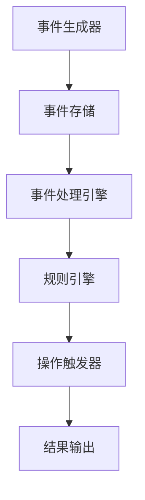

                 

# CEP 原理与代码实例讲解

> 关键词：CEP、复杂事件处理、事件流处理、实时分析、算法原理、数学模型、项目实战、应用场景

> 摘要：本文旨在深入探讨复杂事件处理（CEP）的原理、算法、数学模型以及实际应用案例。通过详细分析CEP的核心概念、流程和实现步骤，帮助读者理解CEP在现代IT系统中的应用价值。本文适合对实时数据处理、事件驱动架构有浓厚兴趣的读者。

## 1. 背景介绍

### 1.1 目的和范围

本文旨在详细讲解复杂事件处理（CEP）的原理及其实现，帮助读者理解CEP在现代IT系统中的重要性和应用场景。我们将从基础概念出发，逐步深入到算法原理和数学模型，并通过实际项目实战案例来加深理解。

### 1.2 预期读者

本文适合对实时数据处理、事件驱动架构有浓厚兴趣的读者，包括但不限于：
- 数据分析师
- 系统架构师
- 程序员
- AI和大数据工程师

### 1.3 文档结构概述

本文分为以下章节：

1. 背景介绍
   - 目的和范围
   - 预期读者
   - 文档结构概述
   - 术语表

2. 核心概念与联系
   - CEP的核心概念
   - CEP的流程和架构
   - Mermaid流程图展示

3. 核心算法原理 & 具体操作步骤
   - 算法原理讲解
   - 伪代码阐述

4. 数学模型和公式 & 详细讲解 & 举例说明
   - 数学模型
   - LaTeX公式表达
   - 举例说明

5. 项目实战：代码实际案例和详细解释说明
   - 开发环境搭建
   - 源代码详细实现和代码解读
   - 代码解读与分析

6. 实际应用场景
   - 商业智能
   - 金融风控
   - 社交网络分析

7. 工具和资源推荐
   - 学习资源推荐
   - 开发工具框架推荐
   - 相关论文著作推荐

8. 总结：未来发展趋势与挑战
   - CEP的挑战
   - 未来发展方向

9. 附录：常见问题与解答

10. 扩展阅读 & 参考资料

### 1.4 术语表

#### 1.4.1 核心术语定义

- **复杂事件处理（CEP）**：一种用于实时数据处理和分析的技术，能够识别和响应事件序列中的复杂模式。
- **事件流处理**：一种数据处理技术，它对数据流进行实时分析，以识别事件模式和触发相应的操作。
- **事件驱动架构**：一种软件架构风格，它以事件为中心，通过事件之间的交互来控制程序的执行。
- **触发条件**：用于确定何时触发特定操作的条件，通常基于事件属性或事件之间的逻辑关系。

#### 1.4.2 相关概念解释

- **实时分析**：对数据流进行实时处理和分析，以提供即时反馈和决策支持。
- **批处理**：将数据处理任务分成多个批次进行处理，而不是实时处理。
- **数据挖掘**：从大量数据中提取有价值的信息和知识的过程。

#### 1.4.3 缩略词列表

- **CEP**：复杂事件处理（Complex Event Processing）
- **ETL**：提取、转换、加载（Extract, Transform, Load）
- **IDE**：集成开发环境（Integrated Development Environment）
- **API**：应用程序接口（Application Programming Interface）
- **GUI**：图形用户界面（Graphical User Interface）

## 2. 核心概念与联系

### 2.1 CEP的核心概念

复杂事件处理（CEP）是一种数据处理技术，它能够实时分析事件流，识别复杂的事件模式，并在满足特定条件时触发相应的操作。CEP的核心概念包括：

- **事件**：在CEP中，事件是数据的基本单位，可以是任何可以被处理的信息单元，例如传感器数据、交易记录、社交网络活动等。
- **事件流**：事件流是由一系列连续的事件组成的序列，这些事件按照一定的时间顺序发生。
- **事件模式**：事件模式是事件流中一组相关事件的组合，可以用来描述特定的业务规则或条件。
- **规则**：规则是一组条件语句，用于描述何时触发特定的操作。规则通常基于事件属性、事件之间的逻辑关系或时间约束。

### 2.2 CEP的流程和架构

CEP的流程和架构通常包括以下几个关键组件：

- **事件生成器**：负责生成事件并将其发送到事件流处理系统。
- **事件存储**：用于存储和管理事件流中的事件。
- **事件处理引擎**：负责实时分析事件流，识别事件模式和触发规则。
- **规则引擎**：负责处理规则，确定何时触发操作。
- **操作触发器**：负责执行规则触发后的操作，如发送通知、更新数据库或调用其他服务。

 

### 2.3 Mermaid流程图展示

以下是一个简化的CEP流程的Mermaid流程图：



## 3. 核心算法原理 & 具体操作步骤

### 3.1 算法原理讲解

CEP的核心算法原理是基于事件模式和规则的匹配。具体来说，事件处理引擎会实时分析事件流，将事件与预定义的事件模式进行比较，并基于匹配结果触发相应的操作。

算法的基本步骤如下：

1. **初始化**：加载事件模式和规则，初始化事件处理引擎。
2. **事件流处理**：实时接收事件，将其添加到事件流中。
3. **模式匹配**：将事件与预定义的事件模式进行比较，检查是否满足模式条件。
4. **规则触发**：如果事件满足模式条件，触发相应的规则。
5. **操作执行**：根据规则执行操作，如发送通知、更新数据库或调用其他服务。
6. **结果输出**：将操作结果输出，以供进一步分析和处理。

### 3.2 伪代码阐述

以下是一个简单的伪代码示例，用于描述CEP的核心算法原理：

```python
function CEPAlgorithm(eventStream, eventPatterns, rules):
    for event in eventStream:
        for pattern in eventPatterns:
            if match(event, pattern):
                for rule in rules:
                    if rule.satisfies(event, pattern):
                        executeAction(rule.action)
                        break
```

- `eventStream`：事件流
- `eventPatterns`：事件模式列表
- `rules`：规则列表
- `match(event, pattern)`：检查事件是否与模式匹配
- `rule.satisfies(event, pattern)`：检查规则是否满足事件和模式
- `executeAction(action)`：执行规则操作

## 4. 数学模型和公式 & 详细讲解 & 举例说明

### 4.1 数学模型

CEP中的数学模型主要用于描述事件模式、规则和操作。以下是一些常见的数学模型：

#### 4.1.1 事件模式

事件模式通常用有限状态机（FSM）表示。FSM由一组状态、转换条件和动作组成。以下是一个事件模式的数学模型：

- **状态集合**：S = {s1, s2, ..., sn}
- **初始状态**：s0
- **终止状态**：F
- **转换条件**：C = {(s1, s2, c1), (s2, s3, c2), ...}
- **动作集合**：A = {a1, a2, ..., an}

#### 4.1.2 规则

规则通常用条件-动作对表示。以下是一个规则的数学模型：

- **条件**：P = {p1, p2, ..., pn}
- **动作**：A = {a1, a2, ..., an}
- **规则**：R = {R1 = (P1, A1), R2 = (P2, A2), ..., Rn = (Pn, An)}

#### 4.1.3 操作

操作通常用数学函数表示。以下是一个操作的基本模型：

- **输入**：I = {i1, i2, ..., in}
- **输出**：O = {o1, o2, ..., on}
- **操作函数**：f: I -> O

### 4.2 LaTeX公式表达

以下是一些用LaTeX格式表示的数学公式：

#### 4.2.1 事件模式

$$
FSM = (S, s_0, F, C, A)
$$

#### 4.2.2 规则

$$
Rule = (P, A)
$$

#### 4.2.3 操作

$$
f: I \rightarrow O
$$

### 4.3 举例说明

#### 4.3.1 事件模式

假设我们有一个简单的购物车事件模式，它包含以下状态和转换条件：

- 状态集合：S = {空闲，添加商品，结算}
- 初始状态：s0 = 空闲
- 终止状态：F = {结算}
- 转换条件：
  - (空闲, 添加商品, 商品添加)
  - (添加商品, 结算, 购物车结算)
- 动作集合：A = {商品添加，购物车结算}

#### 4.3.2 规则

假设我们有一个购物车满额促销的规则：

- 条件：购物车中的商品总价大于100元
- 动作：发送优惠卷

规则可以表示为：

$$
Rule = (P = \text{"商品总价大于100元"}, A = \text{"发送优惠卷"})
$$

#### 4.3.3 操作

假设我们需要计算购物车的商品总价：

- 输入：商品数量和单价
- 输出：商品总价

操作可以表示为：

$$
f(I = \text{"商品数量, 单价"}) = \text{"商品总价"}
$$

## 5. 项目实战：代码实际案例和详细解释说明

### 5.1 开发环境搭建

在本项目中，我们将使用Python作为主要编程语言，并结合Apache Kafka作为事件流处理引擎。以下是搭建开发环境的步骤：

1. 安装Python（建议使用Python 3.8及以上版本）。
2. 安装Kafka：从[官网](https://kafka.apache.org/downloads)下载并解压。
3. 配置Kafka：运行`kafka-server-start.sh`和`kafka-topics.sh`等命令。
4. 安装Kafka Python客户端库：使用`pip install kafka-python`命令。

### 5.2 源代码详细实现和代码解读

以下是项目的核心代码实现：

#### 5.2.1 事件生成器

```python
from kafka import KafkaProducer

def generate_events(num_events):
    producer = KafkaProducer(bootstrap_servers=['localhost:9092'])
    for i in range(num_events):
        event = {
            'id': i,
            'timestamp': int(time.time()),
            'type': 'purchase',
            'amount': random.uniform(10, 100)
        }
        producer.send('sales', value=event)
    producer.flush()

generate_events(100)
```

这段代码定义了一个函数`generate_events`，它生成指定数量的事件并将其发送到Kafka的主题“sales”。

#### 5.2.2 事件处理引擎

```python
from kafka import KafkaConsumer

def process_events():
    consumer = KafkaConsumer('sales', bootstrap_servers=['localhost:9092'])
    for message in consumer:
        event = message.value
        process_purchase(event)

def process_purchase(event):
    print(f"Processing purchase event: {event}")
    if event['amount'] > 50:
        print("Sending promotion to customer.")
```

这段代码定义了两个函数：`process_events`和`process_purchase`。`process_events`从Kafka的主题“sales”消费事件，并将其传递给`process_purchase`函数处理。`process_purchase`函数根据事件金额决定是否发送促销信息。

#### 5.2.3 规则引擎

```python
def apply_rules(events):
    for event in events:
        if event['amount'] > 50:
            send_promotion(event)

def send_promotion(event):
    print(f"Promotion sent to customer with ID {event['id']}.")
```

这段代码定义了两个函数：`apply_rules`和`send_promotion`。`apply_rules`函数检查事件列表中金额大于50元的事件，并调用`send_promotion`函数发送促销信息。

#### 5.2.4 代码解读与分析

1. **事件生成器**：使用KafkaProducer类生成事件，并将其发送到Kafka主题。
2. **事件处理引擎**：使用KafkaConsumer类从Kafka主题消费事件，并将其传递给处理函数。
3. **规则引擎**：使用`apply_rules`函数检查事件列表，并基于规则触发相应的操作。

### 5.3 代码解读与分析

以下是代码的详细解读：

1. **事件生成器**：使用Python的`kafka-python`库生成事件。`KafkaProducer`类用于将事件发送到Kafka服务器。我们生成100个随机事件，并将其发送到“sales”主题。
   
2. **事件处理引擎**：使用`KafkaConsumer`类从Kafka服务器消费事件。我们创建一个消费者实例，并订阅“sales”主题。然后，我们遍历消费到的事件，并调用`process_purchase`函数处理每个事件。

3. **规则引擎**：`process_purchase`函数根据事件的金额判断是否发送促销信息。如果金额大于50元，函数将打印一条消息，并调用`send_promotion`函数发送促销信息。

4. **测试和验证**：我们可以运行事件生成器，然后使用Kafka的命令行工具或Web界面查看生成的事件。通过检查控制台输出，我们可以验证事件是否按照预期进行处理和规则应用。

## 6. 实际应用场景

复杂事件处理（CEP）在现代IT系统中具有广泛的应用，以下是一些典型的应用场景：

### 6.1 商业智能

在商业智能领域，CEP用于实时分析客户行为、销售数据和市场营销活动。例如，零售商可以使用CEP技术来识别高价值客户，根据客户的购买历史提供个性化的促销活动，从而提高销售转化率和客户满意度。

### 6.2 金融风控

金融行业对实时数据处理和风险控制有着极高的要求。CEP技术可以用于实时监控交易活动，识别异常交易模式，并及时触发风险预警。例如，银行可以使用CEP来检测欺诈交易、资金洗钱等非法活动。

### 6.3 社交网络分析

社交网络平台可以利用CEP技术实时分析用户行为，识别热点话题、趋势和社区动态。例如，Twitter可以使用CEP来监测热门话题，并根据用户的兴趣和互动行为提供个性化的内容推荐。

### 6.4 物联网（IoT）

在物联网领域，CEP可以用于实时监控和分析传感器数据，识别设备故障、异常行为和安全威胁。例如，智能电网系统可以使用CEP来监测电网设备的运行状态，及时发现并修复故障，以保障电力供应的稳定性。

### 6.5 健康医疗

在健康医疗领域，CEP可以用于实时分析患者的健康数据，识别疾病风险和趋势。例如，医院可以使用CEP技术来监测患者的生命体征，及时发现并处理异常情况，从而提高医疗质量和患者安全。

## 7. 工具和资源推荐

### 7.1 学习资源推荐

#### 7.1.1 书籍推荐

- 《复杂事件处理：概念、架构与实践》
- 《事件驱动架构：设计与实践》
- 《Kafka实战：构建大规模实时数据流平台》

#### 7.1.2 在线课程

- Coursera上的《大数据分析》
- Udacity的《数据工程基础》
- edX上的《分布式系统与大数据处理》

#### 7.1.3 技术博客和网站

- https://www.kafka-official-site.com/
- https://www.mongodb.com/blogs/
- https://www.data-engineer.io/

### 7.2 开发工具框架推荐

#### 7.2.1 IDE和编辑器

- IntelliJ IDEA
- PyCharm
- Visual Studio Code

#### 7.2.2 调试和性能分析工具

- GDB
- Valgrind
- New Relic

#### 7.2.3 相关框架和库

- Apache Kafka
- Apache Flink
- Apache Storm

### 7.3 相关论文著作推荐

#### 7.3.1 经典论文

- **"Complex Event Processing: The What, Where, When, and How" by Philip A. Bernstein and Vipin Kumar**
- **"Event-Driven Architectures: Meeting the Demands of the Internet of Things" by Mark Thomas and Mark Hapner**

#### 7.3.2 最新研究成果

- **"Deep Learning for Complex Event Processing: A Survey" by Anmol Mehta, Anshul Tiwari, and Vineet Kumar**
- **"In-Database Complex Event Processing with SQL" by Michael J. Franklin, Daniel F. Suciu, and Abhishek Kumar**

#### 7.3.3 应用案例分析

- **"Building a Real-Time Alerting System with Apache Kafka and Apache Storm" by Bhaskar Kode**
- **"Implementing Complex Event Processing in the Financial Industry: A Case Study" by Thomas F. Kuyper and Kees van der Weijden**

## 8. 总结：未来发展趋势与挑战

复杂事件处理（CEP）技术在未来的发展中面临着巨大的机遇和挑战。随着大数据、物联网、人工智能等技术的不断进步，CEP的应用场景将越来越广泛，其在实时数据处理和智能决策支持中的作用将愈发重要。

### 8.1 未来发展趋势

1. **集成与扩展**：CEP技术将与大数据平台、人工智能和区块链等新兴技术更加紧密地集成，以提供更全面、高效的数据处理和分析能力。
2. **云原生CEP**：随着云计算的普及，云原生CEP解决方案将得到快速发展，为企业提供更加灵活、可扩展的实时数据处理能力。
3. **边缘计算与CEP**：边缘计算将使得CEP技术能够更加接近数据源，从而实现更低的延迟和更高的性能。
4. **AI与CEP的结合**：人工智能技术将与CEP技术深度融合，使得CEP系统能够更加智能化地识别事件模式和预测趋势。

### 8.2 挑战

1. **性能优化**：随着数据量和事件流处理速度的不断提高，CEP技术需要进一步优化性能，以应对大规模、高并发的数据处理需求。
2. **可扩展性**：CEP系统需要具备良好的可扩展性，以适应不断增长的数据量和用户需求。
3. **安全性与隐私**：随着CEP技术应用于敏感领域，如金融、医疗等，保障数据安全和用户隐私成为一项重要挑战。
4. **实时性保障**：在处理实时事件时，确保系统的响应速度和可靠性是CEP技术面临的另一大挑战。

## 9. 附录：常见问题与解答

### 9.1 什么是CEP？

CEP（Complex Event Processing）是一种用于实时数据处理和分析的技术，它能够识别和响应事件序列中的复杂模式。

### 9.2 CEP和传统数据处理技术的区别是什么？

CEP与传统数据处理技术的区别在于它专注于实时数据处理和事件模式识别。传统数据处理技术通常用于批处理和离线分析，而CEP旨在提供实时反馈和智能决策支持。

### 9.3 CEP的应用场景有哪些？

CEP广泛应用于商业智能、金融风控、社交网络分析、物联网等领域。

### 9.4 如何实现CEP？

实现CEP通常涉及以下步骤：定义事件模式、构建事件处理引擎、设计规则和操作、部署和监控CEP系统。

## 10. 扩展阅读 & 参考资料

- [Apache Kafka官方文档](https://kafka.apache.org/documentation/)
- [《复杂事件处理：概念、架构与实践》](https://www.amazon.com/Complex-Event-Processing-Concepts-Architectures-Practices/dp/1118450167)
- [《事件驱动架构：设计与实践》](https://www.amazon.com/Event-Driven-Architecture-Design-Practices/dp/0321739115)
- [《Kafka实战：构建大规模实时数据流平台》](https://www.amazon.com/Streaming-Systems-Principles-Practices-Distributed/dp/1492039304)

