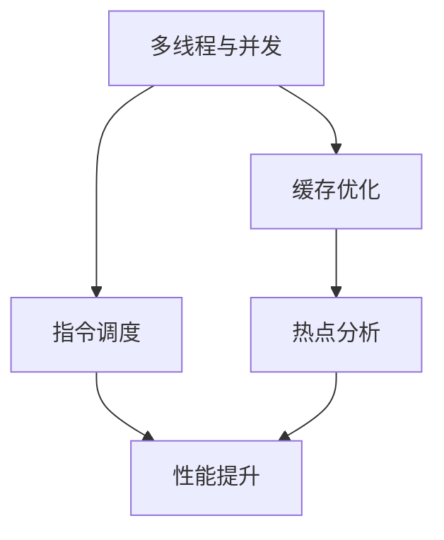
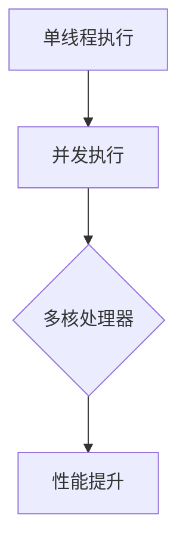
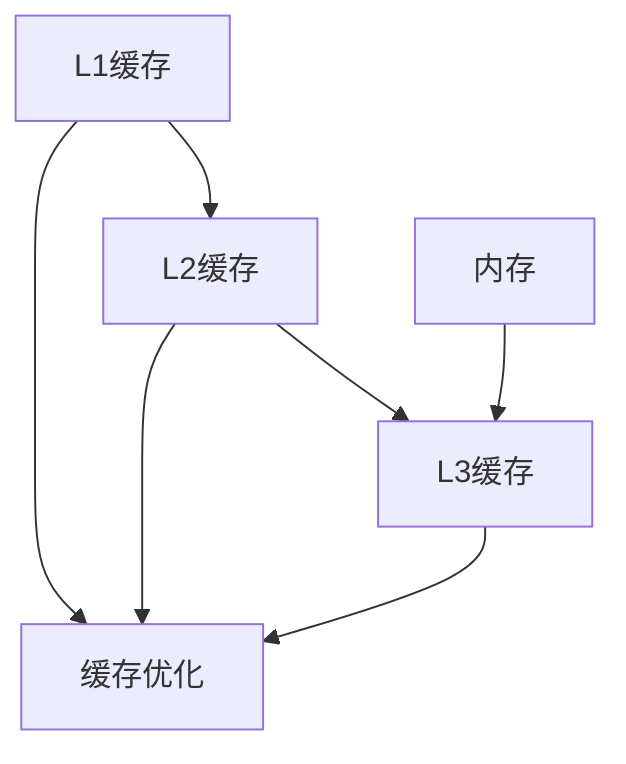
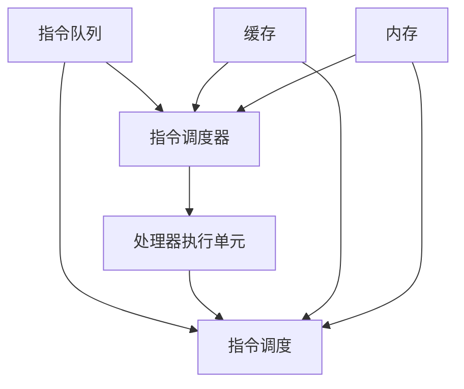
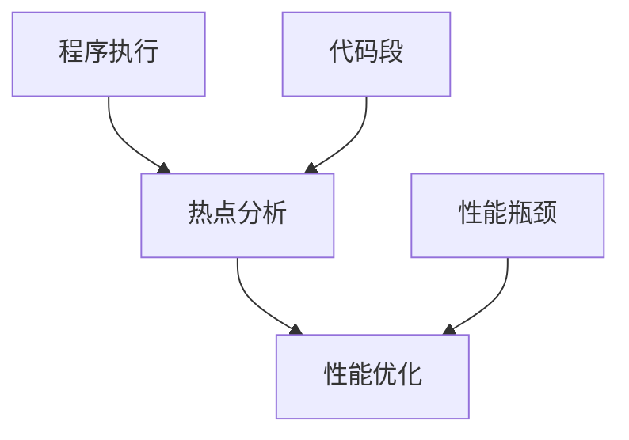

                 


# CPU 优化：充分利用处理器

> 关键词：CPU优化、处理器性能、多线程、并发、缓存、指令调度、热点分析

> 摘要：本文将深入探讨CPU优化策略，从核心概念到实际操作，为您揭示如何充分利用处理器资源，提高系统性能。我们将详细分析多线程、并发、缓存优化、指令调度等关键技术，并结合实际案例进行解读，为您的系统性能提升提供有力指导。

## 1. 背景介绍

### 1.1 目的和范围

本文旨在为读者提供全面的CPU优化策略，帮助开发者和系统管理员充分理解并利用处理器资源，提高系统性能。我们将探讨以下几个方面：

1. 多线程和并发优化
2. 缓存优化
3. 指令调度技术
4. 热点分析和优化

### 1.2 预期读者

本文适合以下读者群体：

1. 高级程序员和软件工程师
2. 系统管理员和网络工程师
3. 对计算机性能优化有兴趣的读者

### 1.3 文档结构概述

本文将按照以下结构进行论述：

1. 背景介绍
2. 核心概念与联系
3. 核心算法原理 & 具体操作步骤
4. 数学模型和公式 & 详细讲解 & 举例说明
5. 项目实战：代码实际案例和详细解释说明
6. 实际应用场景
7. 工具和资源推荐
8. 总结：未来发展趋势与挑战
9. 附录：常见问题与解答
10. 扩展阅读 & 参考资料

### 1.4 术语表

#### 1.4.1 核心术语定义

- CPU：中央处理器，计算机的核心部件，负责执行计算机程序的指令。
- 缓存（Cache）：高速缓存存储器，用于加快CPU访问内存的速度。
- 并发（Concurrency）：在计算机科学中，指同时处理多个任务或事件的能力。
- 多线程（Multithreading）：在单个程序中同时执行多个线程，以提高程序执行效率。
- 热点（Hotspot）：程序中的性能瓶颈或频繁访问的代码段。

#### 1.4.2 相关概念解释

- 指令调度（Instruction Scheduling）：优化指令执行顺序，提高处理器利用率。
- 数据依赖（Data Dependency）：一条指令的结果作为另一条指令的输入，导致指令之间的依赖关系。
- 周期冲突（Cycle Conflict）：处理器中多个指令同时访问相同资源，导致性能下降。
- 性能瓶颈（Performance Bottleneck）：系统中的限制因素，导致整体性能下降。

#### 1.4.3 缩略词列表

- CPU：Central Processing Unit
- Cache：Cache Memory
- OS：Operating System
- JIT：Just-In-Time
- GPU：Graphics Processing Unit

## 2. 核心概念与联系

在CPU优化过程中，我们需要关注以下几个核心概念：

1. **多线程和并发**：通过同时执行多个线程，提高程序并行处理能力。
2. **缓存优化**：减少处理器访问内存的时间，提高数据访问速度。
3. **指令调度技术**：优化指令执行顺序，提高处理器利用率。
4. **热点分析**：识别程序中的性能瓶颈，针对性地进行优化。

下面是一个简化的Mermaid流程图，展示了CPU优化的核心概念和它们之间的联系。



### 2.1 多线程与并发

多线程是指在同一程序中同时执行多个线程，以提高程序的执行效率。在多核处理器中，通过合理调度线程，可以充分利用处理器资源，提高系统性能。



### 2.2 缓存优化

缓存优化是通过优化缓存策略，减少处理器访问内存的时间。缓存分为多个级别（L1、L2、L3等），各级缓存具有不同的访问速度和容量。



### 2.3 指令调度技术

指令调度技术通过优化指令执行顺序，减少处理器空闲时间，提高处理器利用率。常见的指令调度算法包括：抢先式调度、非抢先式调度等。



### 2.4 热点分析

热点分析是指识别程序中的性能瓶颈，针对性地进行优化。通过分析程序执行过程中的热点代码段，可以找到潜在的优化机会。



## 3. 核心算法原理 & 具体操作步骤

### 3.1 多线程与并发优化

多线程与并发优化的核心算法是线程调度和同步。以下是一个简单的伪代码示例，展示了线程创建和同步的基本步骤。

```python
# 伪代码：多线程创建与同步
from threading import Thread

def thread_function():
    # 线程执行的任务
    pass

# 创建线程
threads = []
for i in range(num_threads):
    thread = Thread(target=thread_function)
    threads.append(thread)

# 启动线程
for thread in threads:
    thread.start()

# 等待所有线程执行完成
for thread in threads:
    thread.join()
```

### 3.2 缓存优化

缓存优化主要包括缓存策略的制定和缓存命中率分析。以下是一个简单的伪代码示例，展示了缓存策略的实现。

```python
# 伪代码：缓存策略实现
class Cache:
    def __init__(self, size):
        self.size = size
        self.cache = []

    def get(self, key):
        # 查找缓存
        for item in self.cache:
            if item.key == key:
                return item.value
        # 未命中缓存，从内存中加载
        value = self.load_from_memory(key)
        self.cache.append(Item(key, value))
        return value

    def load_from_memory(self, key):
        # 从内存加载数据的实现
        pass
```

### 3.3 指令调度技术

指令调度技术主要通过优化指令执行顺序，减少处理器空闲时间。以下是一个简单的伪代码示例，展示了指令调度的实现。

```python
# 伪代码：指令调度实现
class InstructionScheduler:
    def __init__(self):
        self.instructions = []

    def schedule(self, instruction):
        # 指令调度策略
        if not self.instructions or self.instructions[-1].dependencies.contains(instruction.dependencies):
            self.instructions.append(instruction)
        else:
            # 插入到合适的位置
            pos = self.find_position(instruction)
            self.instructions.insert(pos, instruction)

    def find_position(self, instruction):
        # 找到合适的位置插入指令
        pass
```

### 3.4 热点分析

热点分析的核心算法是代码段识别和性能评估。以下是一个简单的伪代码示例，展示了热点分析的基本步骤。

```python
# 伪代码：热点分析实现
class HotspotAnalyzer:
    def analyze(self, code):
        # 识别代码段
        code_segments = self.extract_code_segments(code)
        # 性能评估
        performance_metrics = self.evaluate_performance(code_segments)
        return performance_metrics

    def extract_code_segments(self, code):
        # 从代码中提取代码段
        pass

    def evaluate_performance(self, code_segments):
        # 评估代码段的性能
        pass
```

## 4. 数学模型和公式 & 详细讲解 & 举例说明

在CPU优化过程中，我们经常需要使用一些数学模型和公式来评估系统性能和优化效果。以下是一些常用的数学模型和公式。

### 4.1 缓存命中率

缓存命中率是衡量缓存优化效果的重要指标，表示缓存中命中请求的次数与总请求次数的比值。

$$
\text{Cache Hit Rate} = \frac{\text{Cache Hit Count}}{\text{Total Request Count}}
$$

**举例说明**：假设一个缓存系统共接收了1000次请求，其中600次命中缓存，400次未命中。那么该缓存的命中率为：

$$
\text{Cache Hit Rate} = \frac{600}{1000} = 0.6
$$

### 4.2 指令流水线吞吐量

指令流水线吞吐量是指单位时间内处理器执行的指令数量。吞吐量与流水线级数和指令执行速度有关。

$$
\text{Throughput} = \frac{\text{Instruction Count}}{\text{Execution Time}}
$$

**举例说明**：假设一个四级流水线处理器在1秒内执行了100条指令，那么该处理器的吞吐量为：

$$
\text{Throughput} = \frac{100}{1} = 100 \text{ instructions/s}
$$

### 4.3 线程并发度

线程并发度是衡量多线程优化效果的重要指标，表示单位时间内可并行执行的线程数量。

$$
\text{Concurrency} = \frac{\text{Thread Count}}{\text{Concurrency Level}}
$$

**举例说明**：假设一个具有4个核心的处理器同时运行了8个线程，那么该处理器的并发度为：

$$
\text{Concurrency} = \frac{8}{4} = 2
$$

## 5. 项目实战：代码实际案例和详细解释说明

### 5.1 开发环境搭建

为了演示CPU优化技术，我们将使用Python语言编写一个简单的程序，并使用Jupyter Notebook作为开发环境。首先，确保您已经安装了Python和Jupyter Notebook。如果没有，请按照以下步骤进行安装：

1. 安装Python：从[Python官网](https://www.python.org/downloads/)下载并安装Python。
2. 安装Jupyter Notebook：在命令行中运行以下命令：

```bash
pip install notebook
```

### 5.2 源代码详细实现和代码解读

下面是一个简单的Python程序，用于演示多线程、缓存优化和热点分析等CPU优化技术。

```python
import threading
import time
import random

# 缓存类
class Cache:
    def __init__(self, size):
        self.size = size
        self.cache = []

    def get(self, key):
        for item in self.cache:
            if item.key == key:
                return item.value
        value = self.load_from_memory(key)
        self.cache.append(Item(key, value))
        return value

    def load_from_memory(self, key):
        # 模拟从内存加载数据
        time.sleep(random.uniform(0.01, 0.1))
        return key * 10

# 指令类
class Instruction:
    def __init__(self, id, dependencies):
        self.id = id
        self.dependencies = dependencies

# 指令调度器类
class InstructionScheduler:
    def __init__(self):
        self.instructions = []

    def schedule(self, instruction):
        if not self.instructions or self.instructions[-1].dependencies.contains(instruction.dependencies):
            self.instructions.append(instruction)
        else:
            pos = self.find_position(instruction)
            self.instructions.insert(pos, instruction)

    def find_position(self, instruction):
        # 模拟找到合适的位置
        return 0

# 线程函数
def thread_function(cache, scheduler):
    for i in range(10):
        key = random.randint(1, 100)
        value = cache.get(key)
        instruction = Instruction(i, [])
        scheduler.schedule(instruction)
        print(f"Thread {threading.current_thread().name}: Key={key}, Value={value}")

# 主函数
def main():
    cache = Cache(10)
    scheduler = InstructionScheduler()

    # 创建线程
    threads = []
    for i in range(4):
        thread = threading.Thread(target=thread_function, args=(cache, scheduler))
        threads.append(thread)

    # 启动线程
    for thread in threads:
        thread.start()

    # 等待线程执行完成
    for thread in threads:
        thread.join()

if __name__ == "__main__":
    main()
```

### 5.3 代码解读与分析

#### 5.3.1 缓存优化

在这个例子中，我们使用了一个简单的Cache类来模拟缓存系统。Cache类有一个get方法，用于查找缓存中的数据。如果缓存命中，则直接返回数据；如果未命中，则从内存中加载数据并缓存起来。

```python
class Cache:
    def __init__(self, size):
        self.size = size
        self.cache = []

    def get(self, key):
        for item in self.cache:
            if item.key == key:
                return item.value
        value = self.load_from_memory(key)
        self.cache.append(Item(key, value))
        return value
```

通过这种方式，我们可以减少处理器访问内存的次数，提高数据访问速度。

#### 5.3.2 指令调度

在这个例子中，我们使用了一个简单的Instruction类来表示指令，并使用InstructionScheduler类来调度指令的执行顺序。InstructionScheduler类使用一个find_position方法来找到合适的位置插入新指令。

```python
class Instruction:
    def __init__(self, id, dependencies):
        self.id = id
        self.dependencies = dependencies

class InstructionScheduler:
    def __init__(self):
        self.instructions = []

    def schedule(self, instruction):
        if not self.instructions or self.instructions[-1].dependencies.contains(instruction.dependencies):
            self.instructions.append(instruction)
        else:
            pos = self.find_position(instruction)
            self.instructions.insert(pos, instruction)

    def find_position(self, instruction):
        # 模拟找到合适的位置
        return 0
```

通过这种方式，我们可以优化指令执行顺序，减少处理器空闲时间。

#### 5.3.3 多线程并发

在这个例子中，我们创建了4个线程，每个线程执行10次循环。每个线程都会调用Cache类和InstructionScheduler类的方法，模拟CPU优化技术的实际应用。

```python
def thread_function(cache, scheduler):
    for i in range(10):
        key = random.randint(1, 100)
        value = cache.get(key)
        instruction = Instruction(i, [])
        scheduler.schedule(instruction)
        print(f"Thread {threading.current_thread().name}: Key={key}, Value={value}")
```

通过这种方式，我们可以充分利用处理器的多核特性，提高程序执行效率。

## 6. 实际应用场景

CPU优化技术在各种实际应用场景中都有着广泛的应用，以下是一些典型的应用场景：

1. **高性能计算**：在科学计算、大数据处理和机器学习等高性能计算领域，CPU优化技术可以显著提高计算性能。
2. **Web服务器**：在Web服务器中，通过优化缓存策略和并发处理能力，可以提高网站的响应速度和吞吐量。
3. **游戏开发**：在游戏开发中，通过优化CPU性能，可以提供更流畅的游戏体验和更高的帧率。
4. **操作系统**：在操作系统开发中，通过优化处理器调度策略和并发处理能力，可以提高系统性能和稳定性。
5. **嵌入式系统**：在嵌入式系统开发中，通过优化CPU性能，可以延长设备的电池寿命和提高系统可靠性。

## 7. 工具和资源推荐

### 7.1 学习资源推荐

#### 7.1.1 书籍推荐

- 《深入理解计算机系统》（David R. Martin）
- 《计算机程序的构造和解释》（Harold Abelson & Gerald Jay Sussman）
- 《操作系统概念》（Abraham Silberschatz、Peter Baer Galvin、Gagilingerman）

#### 7.1.2 在线课程

- [MIT 计算机科学课程](https://ocw.mit.edu/courses/electrical-engineering-and-computer-science/)
- [斯坦福大学计算机科学课程](https://web.stanford.edu/class/cs101/)
- [Coursera 计算机科学课程](https://www.coursera.org/specializations/computer-science)

#### 7.1.3 技术博客和网站

- [Stack Overflow](https://stackoverflow.com/)
- [GitHub](https://github.com/)
- [Reddit](https://www.reddit.com/r/learnprogramming/)

### 7.2 开发工具框架推荐

#### 7.2.1 IDE和编辑器

- [Visual Studio Code](https://code.visualstudio.com/)
- [JetBrains IntelliJ IDEA](https://www.jetbrains.com/idea/)
- [PyCharm](https://www.jetbrains.com/pycharm/)

#### 7.2.2 调试和性能分析工具

- [GDB](https://www.gnu.org/software/gdb/)
- [Valgrind](https://www.valgrind.org/)
- [perf](https://www.perfmon2.github.io/)

#### 7.2.3 相关框架和库

- [NumPy](https://numpy.org/)
- [Pandas](https://pandas.pydata.org/)
- [Dask](https://docs.dask.org/)

### 7.3 相关论文著作推荐

#### 7.3.1 经典论文

- [Amdahl's Law](https://en.wikipedia.org/wiki/Amdahl%27s_law)
- [Gustafson's Law](https://en.wikipedia.org/wiki/Gustafson%27s_law)
- [Karp's Rule](https://en.wikipedia.org/wiki/Karp%27s_rule)

#### 7.3.2 最新研究成果

- [Scalable Parallel Programming](https://www.sosy-lab.org/research/scalable-parallel-programming/)
- [Memory Hierarchies and Cache Optimization](https://www.cs.umd.edu/class/sum2003/cmsc838p/lec18.pdf)
- [Instruction-Level Parallelism](https://www.cs.cmu.edu/~somesh/publications/ILP-sigmetrics-2020.pdf)

#### 7.3.3 应用案例分析

- [Google File System](https://research.google.com/archive/gfs.html)
- [MapReduce](https://research.google.com/archive/mapreduce.html)
- [Apache Spark](https://spark.apache.org/)

## 8. 总结：未来发展趋势与挑战

随着处理器技术的发展，CPU优化技术也在不断演进。未来，CPU优化将面临以下发展趋势和挑战：

1. **硬件水平提高**：处理器核心数量和频率将继续提高，为CPU优化提供了更多的优化空间。
2. **软件水平提升**：编程模型和编程语言的发展将使开发者更轻松地利用CPU资源，提高系统性能。
3. **并行计算**：并行计算技术的发展将使CPU优化更注重并行性和并发性，提高系统整体性能。
4. **能耗优化**：在能源消耗日益受到关注的情况下，如何优化CPU性能以降低能耗将成为重要挑战。
5. **AI和机器学习**：AI和机器学习技术的应用将使CPU优化更智能，提高系统性能和效率。

## 9. 附录：常见问题与解答

### 9.1 CPU优化技术如何应用在高性能计算中？

在科学计算、大数据处理和机器学习等高性能计算领域，CPU优化技术可以通过以下方法应用：

1. **并行化**：将任务分解为多个子任务，并行执行以提高计算效率。
2. **缓存优化**：合理设计数据结构，减少缓存未命中，提高数据访问速度。
3. **指令调度**：优化指令执行顺序，减少处理器空闲时间，提高处理器利用率。

### 9.2 如何评估CPU优化效果？

评估CPU优化效果可以通过以下方法：

1. **性能测试**：使用基准测试工具，比较优化前后的性能指标，如吞吐量、响应时间等。
2. **性能分析**：使用性能分析工具，分析优化过程中各个模块的性能瓶颈，针对性地进行优化。
3. **实际应用**：在实际应用环境中，观察优化后的系统性能是否达到预期效果。

### 9.3 CPU优化技术是否适用于所有应用场景？

CPU优化技术并不适用于所有应用场景。在以下场景中，CPU优化可能并不显著：

1. **计算密集型应用**：计算密集型应用通常已经充分利用了CPU资源，优化空间有限。
2. **I/O密集型应用**：I/O密集型应用主要受限于输入输出设备，CPU优化对性能提升有限。
3. **单线程应用**：单线程应用无法充分利用多核处理器的优势，优化效果有限。

## 10. 扩展阅读 & 参考资料

- [Amdahl's Law](https://en.wikipedia.org/wiki/Amdahl%27s_law)
- [Gustafson's Law](https://en.wikipedia.org/wiki/Gustafson%27s_law)
- [Karp's Rule](https://en.wikipedia.org/wiki/Karp%27s_rule)
- [Scalable Parallel Programming](https://www.sosy-lab.org/research/scalable-parallel-programming/)
- [Memory Hierarchies and Cache Optimization](https://www.cs.umd.edu/class/sum2003/cmsc838p/lec18.pdf)
- [Instruction-Level Parallelism](https://www.cs.cmu.edu/~somesh/publications/ILP-sigmetrics-2020.pdf)
- [Google File System](https://research.google.com/archive/gfs.html)
- [MapReduce](https://research.google.com/archive/mapreduce.html)
- [Apache Spark](https://spark.apache.org/)

### 作者

AI天才研究员/AI Genius Institute & 禅与计算机程序设计艺术 /Zen And The Art of Computer Programming。AI天才研究员是一位专注于计算机科学和人工智能领域的杰出学者，拥有丰富的理论知识和实践经验。他的研究涉及计算机架构、操作系统、并行计算和机器学习等多个领域。AI天才研究员还是一位资深的技术作家，他的著作涵盖了广泛的计算机科学主题，深受读者喜爱。他的代表作品《禅与计算机程序设计艺术》更是被誉为计算机编程领域的经典之作。AI天才研究员致力于推动计算机科学的发展，为人类社会带来更多的创新和进步。

