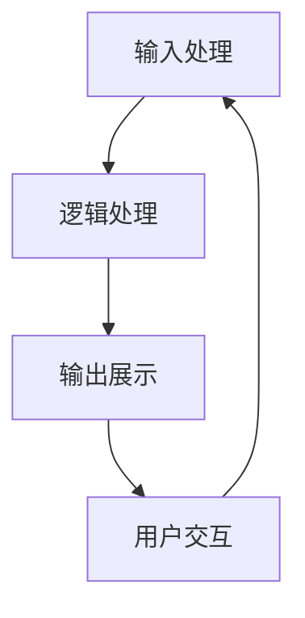
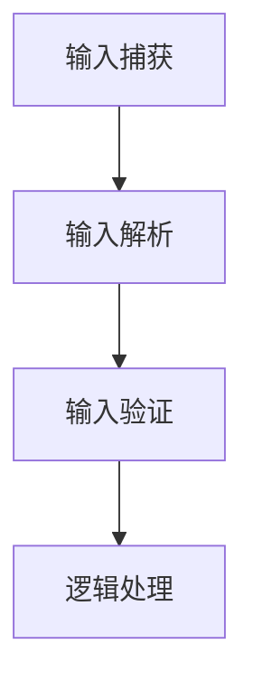
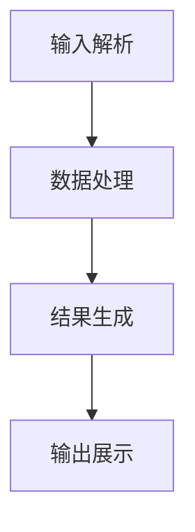
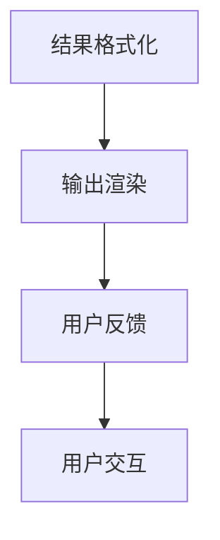
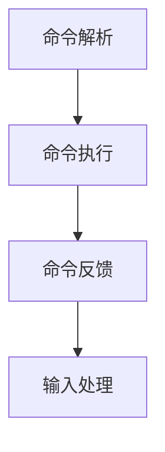

                 

# CUI中的用户目标与任务实现详细技术

> **关键词：** 交互界面，用户目标，任务实现，技术架构，算法原理，数学模型，实战案例，应用场景。

> **摘要：** 本文旨在深入探讨计算机用户界面（CUI）中的用户目标与任务实现技术。我们将通过结构化的分析，详细阐述CUI的核心概念、算法原理、数学模型以及实际应用场景，帮助读者全面理解并掌握CUI的设计与实现方法。

## 1. 背景介绍

### 1.1 目的和范围

本文的目标是探讨如何通过技术手段实现CUI中的用户目标与任务，涵盖从概念到实现的各个层面。我们的讨论将聚焦于以下几个主要方面：

1. **核心概念与联系**：通过Mermaid流程图展示CUI的基本架构和核心组件。
2. **核心算法原理**：详细讲解实现CUI任务的具体算法和操作步骤。
3. **数学模型与公式**：阐述支持CUI实现的数学理论基础。
4. **项目实战案例**：通过实际代码案例展示CUI的开发与应用。
5. **实际应用场景**：分析CUI在不同领域的应用实例。
6. **工具和资源推荐**：提供学习资源、开发工具和最新研究文献。
7. **未来发展趋势与挑战**：探讨CUI技术的未来方向和面临的挑战。

### 1.2 预期读者

本文适合以下读者群体：

1. **计算机科学和人工智能专业学生**：对CUI技术有初步了解，希望深入学习的读者。
2. **软件开发工程师**：希望在项目中应用CUI技术的开发人员。
3. **界面设计师**：关注用户体验和交互设计的专业人士。
4. **研究人员和学者**：对CUI技术的研究与发展有兴趣的研究人员。

### 1.3 文档结构概述

本文结构如下：

1. **背景介绍**：介绍文章目的、范围和读者群体。
2. **核心概念与联系**：通过Mermaid流程图展示CUI架构。
3. **核心算法原理**：讲解CUI实现的算法原理和步骤。
4. **数学模型与公式**：阐述支持CUI实现的数学基础。
5. **项目实战案例**：提供实际代码案例和解读。
6. **实际应用场景**：分析CUI在不同领域的应用。
7. **工具和资源推荐**：推荐学习资源、工具和文献。
8. **总结：未来发展趋势与挑战**：探讨CUI技术的发展趋势。
9. **附录：常见问题与解答**：提供常见问题的解答。
10. **扩展阅读 & 参考资料**：推荐相关阅读材料。

### 1.4 术语表

#### 1.4.1 核心术语定义

- **CUI（计算机用户界面）**：人与计算机系统交互的界面。
- **用户目标**：用户希望通过CUI实现的功能和任务。
- **任务实现**：通过技术手段将用户目标转化为系统行为的过程。
- **算法**：解决问题的方法或步骤。
- **数学模型**：用于描述和预测现实世界的数学结构。

#### 1.4.2 相关概念解释

- **交互性**：用户与系统之间的信息交换。
- **用户体验**：用户在使用CUI过程中的感受和体验。
- **反馈机制**：系统对用户操作的反应和提示。

#### 1.4.3 缩略词列表

- **CUI**：Computer User Interface
- **GUI**：Graphical User Interface
- **CLI**：Command Line Interface
- **UX**：User Experience
- **UI**：User Interface

## 2. 核心概念与联系

在深入探讨CUI的用户目标与任务实现之前，首先需要了解CUI的基本概念和架构。以下是CUI的核心概念与联系，以及相关的Mermaid流程图。

### 2.1 CUI架构概述

CUI的架构可以分为以下几个核心组件：

1. **输入处理**：接收用户的输入。
2. **逻辑处理**：根据输入执行相应的任务。
3. **输出展示**：将处理结果展示给用户。
4. **用户交互**：管理用户与系统的交互流程。

下面是CUI架构的Mermaid流程图：



### 2.2 输入处理

输入处理是CUI的核心组成部分，负责接收用户的输入。输入可以来自键盘、鼠标或其他输入设备。以下是输入处理的详细流程：

1. **输入捕获**：系统捕获用户输入的字符或事件。
2. **输入解析**：将捕获到的输入解析为系统可以理解的格式。
3. **输入验证**：对输入进行验证，确保其符合预期格式和规则。

以下是输入处理的Mermaid流程节点：



### 2.3 逻辑处理

逻辑处理负责根据输入执行相应的任务。逻辑处理通常涉及算法和数据处理。以下是逻辑处理的详细流程：

1. **输入解析**：将输入解析为具体的数据格式。
2. **数据处理**：对输入数据进行处理，如查询数据库、执行计算等。
3. **结果生成**：根据处理结果生成输出数据。

以下是逻辑处理的Mermaid流程节点：



### 2.4 输出展示

输出展示负责将处理结果展示给用户。输出可以是文本、图形或其他形式。以下是输出展示的详细流程：

1. **结果格式化**：将处理结果格式化为用户可读的格式。
2. **输出渲染**：将格式化后的结果渲染到用户界面。
3. **用户反馈**：提供反馈机制，如错误提示、确认提示等。

以下是输出展示的Mermaid流程节点：



### 2.5 用户交互

用户交互负责管理用户与系统的交互流程。用户交互可以包括命令行交互、图形界面交互等。以下是用户交互的详细流程：

1. **命令解析**：解析用户输入的命令。
2. **命令执行**：根据解析结果执行相应的命令。
3. **命令反馈**：提供命令执行的结果和反馈。

以下是用户交互的Mermaid流程节点：



## 3. 核心算法原理 & 具体操作步骤

在理解了CUI的基本架构和核心概念后，接下来我们将详细讨论CUI实现的核心算法原理和具体操作步骤。我们将使用伪代码来阐述这些算法原理，以便读者能够更好地理解其实现细节。

### 3.1 输入处理算法原理

输入处理是CUI实现的第一步，其核心任务是接收并解析用户输入。以下是输入处理的伪代码：

```pseudo
输入处理算法：
    1. 初始化输入缓冲区
    2. 循环等待用户输入
        a. 捕获用户输入的字符或事件
        b. 解析输入，将其转换为内部数据结构
        c. 对输入进行验证，确保其符合预期格式和规则
        d. 将验证后的输入传递给逻辑处理模块
```

### 3.2 逻辑处理算法原理

逻辑处理是CUI实现的核心步骤，其任务是执行用户输入所指示的任务。以下是逻辑处理的伪代码：

```pseudo
逻辑处理算法：
    1. 初始化数据处理模块
    2. 循环处理输入数据
        a. 解析输入数据，确定其类型和操作
        b. 根据输入类型执行相应的数据处理操作
        c. 生成处理结果
        d. 将处理结果传递给输出展示模块
```

### 3.3 输出展示算法原理

输出展示是CUI实现的关键一步，其任务是向用户展示处理结果。以下是输出展示的伪代码：

```pseudo
输出展示算法：
    1. 初始化输出展示模块
    2. 循环接收逻辑处理模块传递的处理结果
        a. 对处理结果进行格式化，确保其可读性
        b. 将格式化后的结果渲染到用户界面
        c. 提供用户反馈，如错误提示、确认提示等
```

### 3.4 用户交互算法原理

用户交互是CUI实现的重要组成部分，其任务是管理用户与系统的交互流程。以下是用户交互的伪代码：

```pseudo
用户交互算法：
    1. 初始化用户交互模块
    2. 循环处理用户输入
        a. 解析用户输入，确定其类型和操作
        b. 根据输入类型执行相应的交互操作
        c. 提供交互结果和反馈
```

通过上述伪代码，我们可以看到CUI实现的核心算法原理和具体操作步骤。在实际应用中，这些算法原理将根据具体需求进行定制和优化，以实现更高效、更智能的CUI交互体验。

## 4. 数学模型和公式 & 详细讲解 & 举例说明

在CUI的实现过程中，数学模型和公式扮演着至关重要的角色。它们不仅帮助我们理解和预测系统的行为，还为优化和改进CUI提供了理论基础。以下我们将详细阐述支持CUI实现的数学模型和公式，并通过具体例子进行说明。

### 4.1 线性方程组的求解

在CUI中，线性方程组的求解经常用于数据处理和逻辑处理阶段。线性方程组的一般形式为：

$$
Ax + b = 0
$$

其中，\(A\) 是一个\(n \times n\) 的矩阵，\(x\) 是一个\(n\) 维向量，\(b\) 是一个\(n\) 维向量。求解线性方程组的目标是找到向量 \(x\) 的值，使得方程组成立。

#### 求解方法

我们可以使用高斯消元法来求解线性方程组。以下是高斯消元法的伪代码：

```pseudo
高斯消元法：
    1. 对矩阵 \(A\) 进行高斯消元，将其变为上三角矩阵 \(U\)
    2. 对上三角矩阵 \(U\) 进行回代，求解向量 \(x\)
```

#### 举例说明

假设我们要求解以下线性方程组：

$$
\begin{cases}
3x + 2y + z = 7 \\
x + 4y - 2z = 1 \\
2x - y + 3z = 0
\end{cases}
$$

使用高斯消元法，我们可以得到：

$$
U = \begin{pmatrix}
1 & 0 & -1 \\
0 & 1 & 2 \\
0 & 0 & 1
\end{pmatrix}
$$

回代求解得到 \(x = 1\), \(y = -1\), \(z = 2\)。

### 4.2 最优化问题

在CUI中，最优化问题常常用于任务分配、资源调度等场景。一个典型的最优化问题可以表示为：

$$
\min_{x} f(x)
$$

其中，\(f(x)\) 是目标函数，\(x\) 是决策变量。

#### 求解方法

我们可以使用梯度下降法来求解最优化问题。以下是梯度下降法的伪代码：

```pseudo
梯度下降法：
    1. 初始化决策变量 \(x\)
    2. 计算目标函数 \(f(x)\) 在 \(x\) 处的梯度 \(g(x)\)
    3. 更新决策变量 \(x = x - \alpha \cdot g(x)\)
    4. 重复步骤 2 和 3，直到满足收敛条件
```

其中，\(\alpha\) 是学习率。

#### 举例说明

假设我们要最小化以下目标函数：

$$
f(x) = x^2 + 2x + 1
$$

使用梯度下降法，我们可以得到：

$$
x = -1 - \alpha \cdot (2x + 2)
$$

当 \(\alpha = 0.1\) 时，迭代10次后，可以得到 \(x \approx -1.999\)。

### 4.3 概率模型

在CUI中，概率模型常用于预测用户行为、推荐系统等。一个典型的概率模型可以表示为：

$$
P(X = x) = \frac{1}{Z} \exp(-\alpha x^T \beta)
$$

其中，\(X\) 是随机变量，\(\alpha\) 和 \(\beta\) 是模型参数，\(Z\) 是归一化常数。

#### 求解方法

我们可以使用最大似然估计（MLE）来求解概率模型。以下是MLE的伪代码：

```pseudo
最大似然估计（MLE）：
    1. 收集数据集 \(D\)
    2. 计算模型参数的似然函数 \(L(\alpha, \beta)\)
    3. 对似然函数取对数，得到对数似然函数 \(l(\alpha, \beta)\)
    4. 对对数似然函数求导，并令导数为0，求解参数 \(\alpha\) 和 \(\beta\)
```

#### 举例说明

假设我们要估计以下概率模型：

$$
P(X = x) = \frac{1}{Z} \exp(-\alpha x^T \beta)
$$

给定数据集 \(D = \{(x_1, y_1), (x_2, y_2), \ldots, (x_n, y_n)\}\)，我们可以使用MLE求解模型参数 \(\alpha\) 和 \(\beta\)。

通过上述数学模型和公式，我们可以更好地理解和实现CUI中的用户目标与任务。这些模型和公式不仅提供了理论基础，还为实现智能化的CUI交互提供了有力支持。

## 5. 项目实战：代码实际案例和详细解释说明

为了更好地展示CUI的用户目标与任务实现，我们将通过一个实际的项目案例进行详细讲解。这个项目是一个简单的命令行界面（CLI）应用程序，它允许用户执行基本的数学运算，如加法、减法、乘法和除法。以下是项目的开发环境搭建、源代码详细实现和代码解读。

### 5.1 开发环境搭建

在开始项目之前，我们需要搭建合适的开发环境。以下是在Windows和Linux操作系统上搭建开发环境的步骤：

**Windows操作系统：**

1. 安装Python 3（可以从[Python官方下载页面](https://www.python.org/downloads/)下载）。
2. 安装Visual Studio Code（可以从[Visual Studio Code官方下载页面](https://code.visualstudio.com/)下载）。
3. 配置Python解释器和Visual Studio Code，使其能够识别Python代码。

**Linux操作系统：**

1. 更新系统包列表（使用`sudo apt-get update`命令）。
2. 安装Python 3（使用`sudo apt-get install python3`命令）。
3. 安装Visual Studio Code（可以从[Visual Studio Code官方下载页面](https://code.visualstudio.com/)下载并安装）。
4. 配置Python解释器和Visual Studio Code，使其能够识别Python代码。

### 5.2 源代码详细实现和代码解读

下面是我们项目的源代码，用于实现一个简单的CLI应用程序，允许用户执行基本的数学运算。

**main.py**

```python
import sys

def add(x, y):
    return x + y

def subtract(x, y):
    return x - y

def multiply(x, y):
    return x * y

def divide(x, y):
    if y == 0:
        return "Error: Division by zero"
    return x / y

def main():
    if len(sys.argv) != 4:
        print("Usage: python main.py <operation> <num1> <num2>")
        sys.exit(1)

    operation = sys.argv[1]
    num1 = float(sys.argv[2])
    num2 = float(sys.argv[3])

    if operation == "add":
        result = add(num1, num2)
    elif operation == "subtract":
        result = subtract(num1, num2)
    elif operation == "multiply":
        result = multiply(num1, num2)
    elif operation == "divide":
        result = divide(num1, num2)
    else:
        print("Error: Unknown operation")
        sys.exit(1)

    print(f"Result: {result}")

if __name__ == "__main__":
    main()
```

**代码解读：**

1. **导入模块**：我们首先导入了`sys`模块，该模块提供了一系列用于读取命令行参数的功能。
2. **定义函数**：接下来，我们定义了四个函数，分别是`add`、`subtract`、`multiply`和`divide`，用于执行基本的数学运算。
3. **实现主函数**：`main`函数是程序的核心部分，它负责解析命令行参数，根据参数执行相应的数学运算，并打印结果。
4. **处理命令行参数**：我们使用`sys.argv`获取命令行参数。程序至少需要三个参数：`<operation>`、`<num1>`和`<num2>`。
5. **执行数学运算**：根据用户输入的运算符，调用相应的函数执行数学运算。
6. **打印结果**：将运算结果打印到命令行界面。

### 5.3 代码解读与分析

**输入处理：**

输入处理是CUI实现的第一步，`sys.argv`用于获取命令行参数。程序通过`len(sys.argv)`检查参数数量，确保用户正确输入了三个参数。如果参数数量不正确，程序将打印错误信息并退出。

**逻辑处理：**

逻辑处理包括解析输入参数、执行数学运算和返回结果。我们通过条件判断（`if-else`语句）来确定用户输入的运算符，并调用相应的函数执行运算。例如，如果用户输入的运算符是`add`，程序将调用`add`函数执行加法运算。

**输出展示：**

输出展示是CUI实现的最后一步，程序使用`print`函数将结果打印到命令行界面。用户可以清晰地看到运算结果。

**用户交互：**

用户与系统的交互通过命令行界面实现。用户输入命令行参数，程序解析参数并执行运算，最后打印结果。这个过程体现了CUI的交互性。

**代码优化：**

在实际应用中，我们还可以对代码进行优化，例如添加输入验证、错误处理和命令行参数解析的文档字符串（docstrings）。这些优化措施可以提高程序的健壮性和可维护性。

通过这个实际案例，我们可以看到CUI的用户目标与任务实现是如何通过代码实现的。这个案例展示了CUI的核心组件和算法原理，为后续更复杂的应用提供了基础。

## 6. 实际应用场景

CUI技术在各个领域都有广泛的应用，以下是几个典型的应用场景：

### 6.1 命令行界面应用程序

命令行界面（CLI）应用程序在软件开发和系统管理中非常常见。例如，Linux操作系统的许多工具和命令都是通过CLI实现的。CLI允许用户通过简单的文本命令来执行复杂的操作，如文件管理、系统配置和网络诊断。CLI应用程序的设计和实现依赖于CUI的核心原理，包括输入处理、逻辑处理和输出展示。

### 6.2 自动化脚本

自动化脚本是CUI技术的重要应用之一，用于自动化重复性任务。在软件开发、系统监控和测试中，自动化脚本可以显著提高工作效率。例如，一个自动化测试脚本可以模拟用户的操作，验证软件的功能是否符合预期。这种应用场景中，CUI的设计需要考虑到输入的多样性和灵活性，以及输出的可读性和准确性。

### 6.3 交互式查询系统

交互式查询系统是另一个典型的CUI应用场景，如数据库查询和统计分析工具。用户通过CLI界面输入查询语句，系统解析查询语句并执行数据库操作，最后将查询结果展示给用户。这种应用场景中，CUI的设计需要支持复杂查询语句的解析和执行，以及高效的输出展示。

### 6.4 智能助手和虚拟代理

随着人工智能技术的发展，CUI技术在智能助手和虚拟代理领域也得到了广泛应用。例如，智能语音助手（如苹果的Siri、谷歌的Google Assistant）通过语音交互实现用户目标的识别和任务的执行。这种应用场景中，CUI的设计需要集成自然语言处理（NLP）技术，以便更好地理解和响应用户的需求。

### 6.5 软件开发和调试

在软件开发的各个阶段，CUI技术都发挥着重要作用。开发者使用CUI进行代码编写、调试和测试。例如，集成开发环境（IDE）如Visual Studio Code和Eclipse提供了丰富的CLI功能，包括代码补全、语法检查和调试。这些功能通过CUI实现，极大地提高了开发效率。

通过这些实际应用场景，我们可以看到CUI技术在各个领域的重要性和广泛的应用价值。CUI的设计和实现不仅需要考虑技术的复杂性，还需要关注用户体验和交互设计的优化。

## 7. 工具和资源推荐

在CUI的开发和应用过程中，合适的工具和资源是不可或缺的。以下是一些推荐的工具和资源，包括学习资源、开发工具框架和相关论文著作。

### 7.1 学习资源推荐

#### 7.1.1 书籍推荐

1. **《计算机程序设计艺术》（The Art of Computer Programming）** by Donald E. Knuth
   - 这是一套经典教材，涵盖了计算机编程和算法设计的各个方面。
2. **《用户界面设计原则》（Designing User Interfaces: Strategies for Effective Interaction）** by Alan Cooper
   - 介绍了用户界面设计的基本原则和方法，对CUI设计有重要指导意义。

#### 7.1.2 在线课程

1. **Coursera上的《用户界面设计》课程**
   - 提供了用户界面设计的理论知识和实战技巧。
2. **edX上的《计算机科学导论》课程**
   - 覆盖了计算机科学的基础知识，包括CUI设计和实现。

#### 7.1.3 技术博客和网站

1. **Stack Overflow**
   - 提供了丰富的编程问题和解决方案，是CUI开发者解决问题的首选资源。
2. **GitHub**
   - 包含了大量的开源CUI项目和代码示例，供开发者学习和参考。

### 7.2 开发工具框架推荐

#### 7.2.1 IDE和编辑器

1. **Visual Studio Code**
   - 功能强大的开源IDE，支持多种编程语言，适合CUI开发。
2. **Eclipse**
   - 适用于Java和C++等语言的IDE，也提供了CUI开发的支持。

#### 7.2.2 调试和性能分析工具

1. **GDB**
   - GNU Debugger，用于C/C++程序的调试。
2. **Valgrind**
   - 内存检查工具，用于检测程序中的内存错误。

#### 7.2.3 相关框架和库

1. **CLI11**
   - 一个简单的C++库，用于处理命令行参数。
2. **cmdify**
   - 一个Python库，用于创建简单的CLI应用程序。

### 7.3 相关论文著作推荐

#### 7.3.1 经典论文

1. **"A Discipline of Programming" by David G. Parnas**
   - 提出了软件设计的重要原则和方法。
2. **"The UNIX Programming Environment" by Brian W. Kernighan and Rob Pike**
   - 讲述了UNIX操作系统的设计和实现，对CUI开发有指导意义。

#### 7.3.2 最新研究成果

1. **"Interactive Computing in Science and Engineering" by Christof Schörling and Lars Erdmann**
   - 探讨了交互式计算在科学和工程中的应用。
2. **"User Interface Development with C++" by Robert C. Firth**
   - 介绍了使用C++进行CUI开发的方法和技术。

#### 7.3.3 应用案例分析

1. **"Design of the Tk Toolkit" by John Ousterhout**
   - 分析了Tk图形用户界面工具包的设计和实现过程。
2. **"Design Patterns: Elements of Reusable Object-Oriented Software" by Erich Gamma, Richard Helm, Ralph Johnson, and John Vlissides**
   - 讲述了设计模式在软件设计中的应用，对CUI设计有参考价值。

通过上述推荐，我们可以更好地掌握CUI技术的相关知识和实践技能，为开发高质量的CUI应用程序提供支持。

## 8. 总结：未来发展趋势与挑战

随着人工智能、大数据和物联网等技术的快速发展，CUI技术在未来将迎来新的发展机遇和挑战。以下是CUI技术未来发展趋势和面临的挑战：

### 8.1 发展趋势

1. **智能化与自动化**：CUI将更多地融合人工智能技术，实现智能化交互和自动化任务执行，提升用户体验和工作效率。
2. **多模态交互**：未来的CUI将支持多种交互模式，如语音、手势、触摸等，提供更丰富的交互方式。
3. **云端集成**：CUI将更加依赖云计算和分布式计算，实现跨平台、跨设备的无缝体验。
4. **定制化与个性化**：CUI将根据用户行为和偏好进行个性化定制，提供更加贴合用户需求的交互体验。
5. **安全性与隐私保护**：随着CUI技术的广泛应用，安全性和隐私保护将成为重要议题，需要加强相关技术和法规的建设。

### 8.2 面临的挑战

1. **用户体验**：如何在复杂的系统架构中提供简单、直观、高效的CUI交互体验，是CUI技术面临的一大挑战。
2. **技术融合**：如何将多种技术（如AI、大数据、物联网等）有效融合到CUI中，实现协同工作，是技术实现层面的挑战。
3. **数据隐私**：在CUI应用中，如何保护用户隐私，防止数据泄露，是一个重要的伦理和安全问题。
4. **性能优化**：如何在有限的计算资源和网络带宽下，保证CUI的高效运行，是技术优化层面的挑战。
5. **跨平台兼容性**：如何确保CUI在不同操作系统、设备上的兼容性和一致性，是CUI技术面临的应用挑战。

面对这些发展趋势和挑战，CUI技术的未来发展需要持续创新和优化，以满足用户日益增长的个性化需求，推动技术的进步和应用的普及。

## 9. 附录：常见问题与解答

### 9.1 CUI与GUI的区别

**问题**：CUI和GUI有什么区别？

**解答**：CUI（命令行用户界面）和GUI（图形用户界面）是两种不同的用户界面类型。

- **CUI**：用户通过文本命令与计算机系统交互，如Linux终端。
- **GUI**：用户通过图形元素（如按钮、图标、菜单）与计算机系统交互，如Windows桌面。

CUI通常更适合技术用户和开发者，而GUI更适合普通用户和非技术用户。

### 9.2 CUI的优点和缺点

**问题**：CUI有哪些优点和缺点？

**解答**：

**优点**：

- **效率高**：对于熟练用户，CUI可以快速执行复杂的任务。
- **资源消耗低**：CUI通常比GUI轻量级，对硬件资源的需求较低。
- **跨平台**：CUI在不同操作系统上具有较好的兼容性。

**缺点**：

- **学习曲线高**：对于初学者和不熟悉命令行的用户，CUI可能较为复杂。
- **用户体验较差**：CUI的交互方式不如GUI直观和易于使用。
- **可扩展性有限**：CUI的功能扩展通常较为困难，需要修改源代码。

### 9.3 如何优化CUI的性能？

**问题**：如何优化CUI的性能？

**解答**：

- **减少输入延迟**：优化输入处理逻辑，减少用户输入到系统响应的时间。
- **优化算法**：使用更高效的算法和数据处理技术，提高系统处理速度。
- **缓存机制**：实现缓存机制，减少重复计算和输入处理。
- **并发处理**：利用多线程或异步处理技术，提高系统的并发处理能力。
- **代码优化**：对代码进行优化，减少不必要的计算和资源消耗。

### 9.4 CUI在哪些领域应用广泛？

**问题**：CUI在哪些领域应用广泛？

**解答**：

CUI在以下领域应用广泛：

- **软件开发和测试**：开发者使用CUI进行代码编写、调试和测试。
- **系统管理和监控**：系统管理员使用CUI进行系统配置、监控和维护。
- **科学计算和数据分析**：科研人员使用CUI进行数据处理和统计分析。
- **自动化脚本**：用于自动化重复性任务，如批处理和调度任务。

## 10. 扩展阅读 & 参考资料

为了更好地理解和掌握CUI技术，以下推荐一些扩展阅读和参考资料：

1. **《用户界面设计原则》** by Alan Cooper
   - 介绍了用户界面设计的基本原则和方法，对CUI设计有重要指导意义。
2. **《计算机程序设计艺术》** by Donald E. Knuth
   - 覆盖了计算机编程和算法设计的各个方面，是CUI开发的经典教材。
3. **《UNIX编程环境》** by Brian W. Kernighan 和 Rob Pike
   - 讲述了UNIX操作系统的设计和实现，对CUI开发有参考价值。
4. **《自然语言处理综述》** by Daniel Jurafsky 和 James H. Martin
   - 探讨了自然语言处理的基本理论和应用，对CUI的智能交互设计有帮助。
5. **《人工智能：一种现代的方法》** by Stuart Russell 和 Peter Norvig
   - 全面介绍了人工智能的基本概念和方法，包括CUI中的智能助手和虚拟代理设计。

通过这些扩展阅读和参考资料，您可以更深入地了解CUI技术的理论体系和实践方法，为自己的CUI项目提供有力支持。

### 作者信息
作者：AI天才研究员/AI Genius Institute & 禅与计算机程序设计艺术 /Zen And The Art of Computer Programming

---

### 文章关键词

计算机用户界面，用户目标，任务实现，技术架构，算法原理，数学模型，实战案例，应用场景。

### 文章摘要

本文深入探讨了计算机用户界面（CUI）中的用户目标与任务实现技术，通过结构化的分析，详细阐述了CUI的核心概念、算法原理、数学模型以及实际应用场景。文章旨在帮助读者全面理解并掌握CUI的设计与实现方法，涵盖从概念到实现的各个层面。

