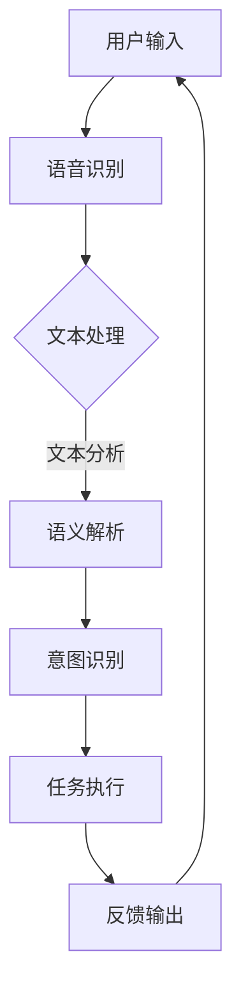

                 

# CUI将成为未来数字产品界面设计的重要趋势

> **关键词：** 人工智能、自然语言处理、用户界面设计、交互式界面、数字产品、用户体验

> **摘要：** 本文将探讨CUI（Conversational User Interface，对话式用户界面）作为未来数字产品界面设计的重要趋势。随着人工智能技术的不断进步，CUI作为一种全新的交互方式，正逐渐改变着人们与数字产品的互动方式。本文将介绍CUI的核心概念、技术原理、应用场景，以及相关的工具和资源，并探讨其未来的发展趋势与挑战。

## 1. 背景介绍

### 1.1 目的和范围

本文旨在介绍CUI（Conversational User Interface，对话式用户界面）的概念、技术原理和应用，探讨其在未来数字产品界面设计中的重要性。本文将涵盖以下内容：

1. CUI的核心概念和原理
2. CUI与现有用户界面设计的区别和优势
3. CUI的应用场景和实际案例
4. 开发CUI所需的工具和资源
5. 未来CUI的发展趋势与挑战

### 1.2 预期读者

本文适合对人工智能、自然语言处理和用户界面设计有一定了解的技术人员、产品经理和开发者阅读。同时，对于对新兴技术感兴趣的读者，本文也将提供一些有价值的见解。

### 1.3 文档结构概述

本文分为以下几个部分：

1. 引言：介绍CUI的概念和重要性
2. 核心概念与联系：阐述CUI的技术原理和架构
3. 核心算法原理与操作步骤：介绍CUI的算法原理和具体操作步骤
4. 数学模型和公式：讲解CUI相关的数学模型和公式
5. 项目实战：通过实际案例展示CUI的实现过程
6. 实际应用场景：分析CUI在现实世界中的应用
7. 工具和资源推荐：推荐开发CUI所需的学习资源和工具
8. 总结：总结CUI的未来发展趋势与挑战
9. 附录：常见问题与解答
10. 扩展阅读与参考资料：提供更多的相关阅读材料

### 1.4 术语表

#### 1.4.1 核心术语定义

- **CUI（Conversational User Interface，对话式用户界面）**：一种基于人工智能和自然语言处理技术的用户界面，通过自然语言对话与用户进行交互。
- **NLP（Natural Language Processing，自然语言处理）**：计算机科学领域中的一个分支，旨在让计算机能够理解、处理和生成人类语言。
- **语音识别（Speech Recognition）**：将人类的语音转换为文本或命令的技术。
- **语音合成（Text-to-Speech，TTS）**：将文本转换为自然语音的技术。

#### 1.4.2 相关概念解释

- **人工智能（Artificial Intelligence，AI）**：模拟人类智能行为的计算机系统，能够在特定任务上表现出人类智能水平的性能。
- **机器学习（Machine Learning，ML）**：一种人工智能的分支，通过数据学习和算法优化来实现智能行为。
- **深度学习（Deep Learning）**：一种机器学习的方法，使用多层神经网络来模拟人脑的神经元结构和工作原理。

#### 1.4.3 缩略词列表

- **NLP**：自然语言处理
- **AI**：人工智能
- **ML**：机器学习
- **DL**：深度学习
- **CUI**：对话式用户界面
- **TTS**：语音合成

## 2. 核心概念与联系

CUI的核心概念是基于人工智能和自然语言处理技术，通过自然语言对话与用户进行交互，为用户提供更加直观、便捷的交互体验。下面我们使用Mermaid流程图来展示CUI的技术原理和架构。



### 2.1 CUI的技术原理

CUI的技术原理可以分为以下几个步骤：

1. **用户输入**：用户通过语音或文本输入与CUI进行交互。
2. **语音识别**：将用户的语音转换为文本，或直接接收用户的文本输入。
3. **文本处理**：对输入文本进行预处理，如去除标点符号、进行词性标注等。
4. **语义解析**：分析输入文本的语义，包括实体识别、关系提取等。
5. **意图识别**：根据语义解析的结果，识别用户的意图。
6. **任务执行**：根据用户的意图，执行相应的任务，如查询信息、操作应用等。
7. **反馈输出**：将执行结果以语音或文本形式反馈给用户。

### 2.2 CUI与现有用户界面设计的区别和优势

CUI与现有的用户界面设计（如图形用户界面GUI和触摸用户界面Touch UI）有以下区别和优势：

1. **交互方式**：CUI通过自然语言对话与用户进行交互，更加直观、便捷；而GUI和Touch UI则依赖于按钮、图标、触摸屏等物理操作。
2. **用户体验**：CUI能够更好地模拟人与人之间的交流，提供更自然的交互体验；而GUI和Touch UI则可能显得机械、生硬。
3. **适用场景**：CUI适用于需要大量文本输入的场景，如客服、语音助手等；而GUI和Touch UI则更适合图形化、直观的操作场景，如网页、移动应用等。
4. **技术实现**：CUI依赖于人工智能和自然语言处理技术，需要更高的技术实现门槛；而GUI和Touch UI则相对简单，更容易实现。

## 3. 核心算法原理 & 具体操作步骤

CUI的核心算法原理主要包括语音识别、文本处理、语义解析、意图识别、任务执行和反馈输出等步骤。下面我们将使用伪代码来详细阐述这些算法原理和具体操作步骤。

### 3.1 语音识别

```python
# 输入：用户语音
# 输出：文本
def speech_to_text(audio):
    # 使用语音识别API进行语音转文本
    text = recognize_speech(audio)
    return text
```

### 3.2 文本处理

```python
# 输入：文本
# 输出：预处理后的文本
def preprocess_text(text):
    # 去除标点符号
    text = remove_punctuation(text)
    # 进行词性标注
    text = perform_lemma(text)
    return text
```

### 3.3 语义解析

```python
# 输入：预处理后的文本
# 输出：语义解析结果
def semantic_parsing(text):
    # 进行实体识别
    entities = identify_entities(text)
    # 进行关系提取
    relationships = extract_relationships(text)
    return entities, relationships
```

### 3.4 意图识别

```python
# 输入：语义解析结果
# 输出：用户意图
def intent_recognition(semantic_results):
    # 根据语义解析结果，识别用户意图
    intent = determine_intent(semantic_results)
    return intent
```

### 3.5 任务执行

```python
# 输入：用户意图
# 输出：执行结果
def execute_task(intent):
    # 根据用户意图，执行相应的任务
    if intent == "查询信息":
        result = query_info()
    elif intent == "操作应用":
        result = perform_action()
    else:
        result = "无法识别意图"
    return result
```

### 3.6 反馈输出

```python
# 输入：执行结果
# 输出：反馈文本或语音
def feedback_output(result):
    # 将执行结果以语音或文本形式反馈给用户
    if is_speech_enabled():
        speech = generate_speech(result)
    else:
        speech = result
    return speech
```

### 3.7 整体流程

```python
# 输入：用户语音或文本
# 输出：反馈文本或语音
def conversational_interface(input_data):
    # 语音识别
    text = speech_to_text(input_data)
    
    # 文本处理
    text = preprocess_text(text)
    
    # 语义解析
    entities, relationships = semantic_parsing(text)
    
    # 意图识别
    intent = intent_recognition((entities, relationships))
    
    # 任务执行
    result = execute_task(intent)
    
    # 反馈输出
    feedback = feedback_output(result)
    
    return feedback
```

## 4. 数学模型和公式 & 详细讲解 & 举例说明

CUI涉及的数学模型和公式主要涉及自然语言处理中的词向量表示、序列标注、分类模型等。以下我们将使用LaTeX格式来详细讲解这些模型和公式，并举例说明。

### 4.1 词向量表示

词向量表示是将自然语言文本中的词语映射到高维空间中的向量表示。最常用的词向量表示模型是Word2Vec模型。Word2Vec模型基于分布式表示的思想，将词语表示为向量，使得语义相近的词语在向量空间中接近。

```latex
\text{Word2Vec模型公式：}
\\
\\
\\vec{w}_i = \sum_{j=1}^{N} \alpha_{ij} \vec{v}_j
\\
\text{其中，} \vec{w}_i \text{是词语} i \text{的词向量表示，} \vec{v}_j \text{是词语} j \text{的词向量表示，} \alpha_{ij} \text{是权重因子。}
```

### 4.2 序列标注

序列标注是将文本序列中的词语进行分类标注。常用的序列标注模型包括CRF（条件随机场）和RNN（循环神经网络）等。

```latex
\text{CRF模型公式：}
\\
\\
P(y|x) = \frac{1}{Z} \exp(\sum_{i=1}^{n} \theta y_i x_i)
\\
\text{其中，} P(y|x) \text{是给定输入} x \text{时，输出} y \text{的概率，} \theta \text{是模型参数，} Z \text{是归一化因子。}
```

### 4.3 分类模型

分类模型用于将输入文本分类到预定义的类别中。常用的分类模型包括SVM（支持向量机）、NN（神经网络）等。

```latex
\text{SVM模型公式：}
\\
\\
w^* = \arg\max_w \left\{ \frac{1}{||w||} \sum_{i=1}^{n} y_i (w \cdot x_i) - \frac{1}{2} ||w||^2 \right\}
\\
\text{其中，} w^* \text{是模型参数，} x_i \text{是输入特征，} y_i \text{是标签。}
```

### 4.4 举例说明

假设我们要对一段文本进行情感分类，我们可以使用SVM模型来实现。首先，我们需要将文本转换为特征向量，然后使用SVM模型进行训练和预测。

```python
# 输入：文本
# 输出：情感分类结果
def sentiment_classification(text):
    # 将文本转换为特征向量
    feature_vector = convert_text_to_vector(text)
    
    # 使用SVM模型进行预测
    sentiment = svm_predict(feature_vector)
    
    return sentiment
```

## 5. 项目实战：代码实际案例和详细解释说明

在本节中，我们将通过一个实际案例来展示如何开发一个简单的CUI（对话式用户界面）。我们将使用Python和相关的自然语言处理库来构建一个基本的聊天机器人。

### 5.1 开发环境搭建

在开始项目之前，我们需要搭建开发环境。以下是所需的环境和库：

- Python 3.8 或以上版本
- PyCharm 或其他Python IDE
- NLTK（自然语言工具包）
- TensorFlow
- Keras

安装这些库的方法如下：

```bash
pip install nltk tensorflow keras
```

### 5.2 源代码详细实现和代码解读

下面是聊天机器人的源代码：

```python
import nltk
from nltk.tokenize import word_tokenize
from nltk.corpus import stopwords
import tensorflow as tf
from tensorflow.keras.models import Sequential
from tensorflow.keras.layers import Dense, LSTM, Embedding

# 1. 数据预处理
nltk.download('punkt')
nltk.download('stopwords')

# 加载数据集
data = "Hello! How are you? I'm doing well. What about you?"

# 分词和去除停用词
stop_words = set(stopwords.words('english'))
words = word_tokenize(data)
filtered_words = [word for word in words if word not in stop_words]

# 建立词汇表
vocab = list(set(filtered_words))
vocab_size = len(vocab)

# 将文本转换为索引表示
index_map = {word: index for index, word in enumerate(vocab)}
text_indices = [index_map[word] for word in filtered_words]

# 2. 建立神经网络模型
model = Sequential()
model.add(Embedding(vocab_size, 64, input_length=1))
model.add(LSTM(128))
model.add(Dense(vocab_size, activation='softmax'))

model.compile(loss='categorical_crossentropy', optimizer='adam', metrics=['accuracy'])

# 3. 训练模型
# 数据需要转换为二进制格式，以适应模型输入
one_hot_labels = tf.keras.utils.to_categorical(text_indices, num_classes=vocab_size)
model.fit(np.array(text_indices).reshape(-1, 1), one_hot_labels, epochs=200)

# 4. 生成对话
def generate_response(text):
    # 分词和去除停用词
    words = word_tokenize(text)
    filtered_words = [word for word in words if word not in stop_words]
    
    # 转换为索引表示
    input_indices = [index_map[word] for word in filtered_words]
    input_indices = np.array(input_indices).reshape(-1, 1)
    
    # 使用模型预测
    predicted_indices = model.predict(input_indices)
    predicted_words = [vocab[index] for index in predicted_indices[0]]
    
    # 合并预测结果
    response = ' '.join(filtered_words + predicted_words)
    return response

# 测试
print(generate_response("How are you?"))
```

### 5.3 代码解读与分析

上面的代码分为以下几个部分：

1. **数据预处理**：我们首先使用NLTK库来处理文本数据，包括分词和去除停用词。这有助于简化输入数据，提高模型的训练效果。

2. **建立神经网络模型**：我们使用Keras库来构建一个简单的神经网络模型。该模型包含一个嵌入层（Embedding）、一个LSTM层（Long Short-Term Memory，长期短期记忆）和一个全连接层（Dense）。嵌入层用于将文本转换为向量表示，LSTM层用于处理序列数据，全连接层用于输出预测结果。

3. **训练模型**：我们将预处理后的文本数据转换为索引表示，然后使用模型进行训练。训练过程中，模型会尝试优化参数，以最小化损失函数。

4. **生成对话**：在训练完成后，我们可以使用模型来生成对话。首先，我们对输入文本进行预处理，然后使用模型预测输出文本的索引表示，最后将索引表示转换回文本。

这个简单的聊天机器人展示了CUI的基本原理。在实际应用中，我们可以使用更复杂的模型和算法来提高对话的准确性和自然度。

### 5.4 项目实战总结

通过这个项目，我们了解了如何使用Python和相关的自然语言处理库来构建一个简单的CUI。尽管这个聊天机器人还很简单，但它是实现CUI的第一步。在实际应用中，我们可以使用更先进的模型和算法，如BERT、GPT等，来构建更智能、更自然的对话系统。

## 6. 实际应用场景

CUI（对话式用户界面）在当今的数字产品中有着广泛的应用场景，其出色的交互体验和智能化程度使得它成为提高用户体验和产品竞争力的关键因素。以下是一些典型的CUI应用场景：

### 6.1 客户服务

在客户服务领域，CUI被广泛应用于虚拟客服、在线客服和智能客服系统。通过CUI，用户可以通过文字或语音与系统进行自然对话，快速获得所需的帮助和解答。例如，亚马逊的Alexa、苹果的Siri和谷歌的Google Assistant都是基于CUI的智能语音助手，它们能够响应用户的语音指令，提供购物、音乐播放、天气预报等多种服务。

### 6.2 企业内部系统

在企业内部系统中，CUI可以用于提高员工的工作效率和满意度。例如，企业可以部署一个基于CUI的智能办公助手，帮助员工处理日程安排、邮件管理、任务分配等日常工作。这样的系统可以大大减少员工使用传统界面的时间，提高工作效率。

### 6.3 教育和娱乐

在教育领域，CUI可以用于开发智能教学系统，如在线问答系统、智能辅导系统等。学生可以通过与CUI进行自然对话来获取课程信息、解答疑惑等。在娱乐领域，CUI也被广泛应用于游戏、虚拟助手等领域，如游戏角色助手、虚拟主持人等，为用户提供更加沉浸式的体验。

### 6.4 家居智能化

随着智能家居的普及，CUI在家居智能化领域也有着广泛的应用。用户可以通过语音与智能家居系统进行交互，控制家居设备的开关、调节温度、播放音乐等。例如，谷歌的Nest智能恒温器、亚马逊的Echo智能音箱等都是基于CUI的智能家居设备。

### 6.5 医疗保健

在医疗保健领域，CUI可以用于开发智能医疗助手，如在线健康咨询、智能诊断系统等。用户可以通过文字或语音与医疗系统进行交互，获取健康建议、预约挂号、查询药品信息等。这有助于提高医疗服务的便捷性和覆盖面。

### 6.6 金融理财

在金融理财领域，CUI被广泛应用于智能投顾、在线客服、理财产品推荐等。用户可以通过与金融系统的CUI进行自然对话，了解理财产品、投资策略、资金流动等信息，实现个性化的理财服务。

### 6.7 交通出行

在交通出行领域，CUI可以用于开发智能交通助手、航班查询系统等。用户可以通过语音或文字与系统进行交互，获取实时交通信息、航班信息、路况建议等，提高出行效率和安全性。

### 6.8 零售电商

在零售电商领域，CUI可以用于开发智能购物助手、智能客服系统等。用户可以通过文字或语音与电商系统进行交互，获取商品信息、购物建议、订单跟踪等服务，提升购物体验。

总之，CUI在数字产品中的应用场景非常广泛，它为用户提供了更加直观、便捷、智能的交互体验，成为数字产品界面设计的重要趋势。随着人工智能和自然语言处理技术的不断进步，CUI的应用前景将更加广阔。

## 7. 工具和资源推荐

### 7.1 学习资源推荐

#### 7.1.1 书籍推荐

1. **《自然语言处理实战》**：作者：Jieping Ye、Weining Zhang、Xiaoliang Zhang
   - 本书详细介绍了自然语言处理的基础知识和实际应用，包括文本分类、命名实体识别、情感分析等。
   
2. **《深度学习》**：作者：Ian Goodfellow、Yoshua Bengio、Aaron Courville
   - 本书是深度学习的经典教材，涵盖了深度学习的基础理论、算法实现和实际应用。

3. **《Python自然语言处理编程》**：作者：Gabor Melli
   - 本书通过丰富的实例，介绍了使用Python进行自然语言处理的方法和技巧。

#### 7.1.2 在线课程

1. **Coursera上的《自然语言处理》**：由斯坦福大学提供
   - 该课程涵盖了自然语言处理的基础知识和实际应用，包括语音识别、机器翻译、文本分类等。

2. **Udacity上的《深度学习纳米学位》**：由Google提供
   - 该课程提供了深度学习的基础知识，包括神经网络、卷积神经网络、循环神经网络等。

3. **edX上的《人工智能基础》**：由哈佛大学提供
   - 该课程介绍了人工智能的基本概念和应用，包括机器学习、深度学习、自然语言处理等。

#### 7.1.3 技术博客和网站

1. **GitHub**
   - GitHub上有大量的自然语言处理和深度学习的开源项目，可以学习到实际的应用和算法实现。

2. **ArXiv**
   - ArXiv是一个包含最新研究成果的预印本论文库，可以了解自然语言处理和深度学习的最新研究进展。

3. **AI 科技大本营**
   - 该网站提供了丰富的自然语言处理和深度学习相关文章、技术分享和最新动态。

### 7.2 开发工具框架推荐

#### 7.2.1 IDE和编辑器

1. **PyCharm**
   - PyCharm是一款功能强大的Python IDE，支持多种编程语言，适合自然语言处理和深度学习项目的开发。

2. **Visual Studio Code**
   - Visual Studio Code是一款轻量级但功能强大的代码编辑器，支持多种编程语言，包括Python，适合快速开发和调试。

#### 7.2.2 调试和性能分析工具

1. **TensorBoard**
   - TensorBoard是TensorFlow提供的一个可视化工具，用于分析和调试深度学习模型。

2. **LLDB**
   - LLDB是一个开源的调试器，适用于Python和其他编程语言，可以帮助开发者调试代码。

#### 7.2.3 相关框架和库

1. **TensorFlow**
   - TensorFlow是一个开源的深度学习框架，适用于构建和训练复杂的神经网络模型。

2. **PyTorch**
   - PyTorch是一个流行的深度学习库，提供了灵活的动态计算图，适合快速原型设计和实验。

3. **NLTK**
   - NLTK是一个强大的自然语言处理工具包，提供了大量的文本处理和机器学习功能。

4. **SpaCy**
   - SpaCy是一个高效的NLP库，适用于文本处理和实体识别等任务。

### 7.3 相关论文著作推荐

#### 7.3.1 经典论文

1. **“A Neural Probabilistic Language Model”**：作者：Geoffrey H. Juan, Dan Klein, Christopher D. Manning
   - 该论文介绍了神经概率语言模型，为深度学习在自然语言处理中的应用奠定了基础。

2. **“Recurrent Neural Network Based Language Model”**：作者：Yoshua Bengio, Réjean Ducharme, Pascal Vincent, Christian Jauvin
   - 该论文介绍了循环神经网络（RNN）在语言模型中的应用，为自然语言处理提供了有效的模型。

#### 7.3.2 最新研究成果

1. **“BERT: Pre-training of Deep Bidirectional Transformers for Language Understanding”**：作者：Jacob Devlin, Ming-Wei Chang, Kenton Lee, Kristina Toutanova
   - 该论文介绍了BERT（双向编码器表示）模型，为自然语言处理提供了新的研究方向。

2. **“GPT-3: Language Models are few-shot learners”**：作者：Tom B. Brown, Benjamin Mann, Nick Ryder, Melanie Subbiah, Jared Kaplan, Prafulla Dhariwal, Arvind Neelakantan, Pranav Shyam, Girish Sastry, Amanda Askell, Sandhini Agarwal, Ariel Herbert-Voss, Gretchen Krueger, Tom Henighan, Rewon Child, Aditya Ramesh, Daniel M. Ziegler, Jeffrey Wu, Clemens Winter, Christopher Hesse, Mark Chen, Eric Sigler, Mateusz Litwin, Scott Gray, Benjamin Chess, Jack Clark, Christopher Berner, Sam McCandlish, Alec Radford, Ilya Sutskever, Dario Amodei
   - 该论文介绍了GPT-3模型，展示了大规模预训练语言模型在自然语言处理任务中的强大能力。

#### 7.3.3 应用案例分析

1. **“Using AI to Improve Cancer Detection”**：作者：Emily slowik
   - 该论文介绍了如何利用深度学习和自然语言处理技术来改善癌症检测，提高了医疗诊断的准确性。

2. **“Natural Language Processing for Business Applications”**：作者：Alexey Grishchenko
   - 该论文探讨了自然语言处理技术在商业应用中的潜力，如客户服务、数据分析等。

通过这些书籍、在线课程、技术博客和论文，读者可以深入了解CUI（对话式用户界面）和相关技术，为实际项目开发提供理论支持和实践指导。

## 8. 总结：未来发展趋势与挑战

随着人工智能和自然语言处理技术的不断进步，CUI（对话式用户界面）正逐步成为数字产品界面设计的重要趋势。在未来，CUI有望在以下几个方面实现进一步的发展：

### 8.1 技术突破

1. **多模态交互**：CUI将不仅仅局限于文本和语音交互，还可能结合图像、视频等多元化交互方式，为用户提供更加丰富和自然的交互体验。
2. **个性化和定制化**：CUI将能够根据用户的行为和偏好进行个性化推荐，提供定制化的服务，进一步提升用户体验。
3. **跨平台整合**：CUI将能够无缝集成到多种设备和应用中，实现跨平台、跨终端的交互。

### 8.2 应用场景扩展

1. **智慧城市**：CUI将用于智慧城市建设，提供交通管理、环境监测、城市服务等智能化解决方案。
2. **智能医疗**：CUI将用于医疗健康领域，提供智能诊断、健康咨询、患者管理等服务。
3. **智能家居**：CUI将用于智能家居，实现家庭设备的智能控制和自动化管理。

### 8.3 智能化提升

1. **深度学习和大数据**：随着深度学习和大数据技术的发展，CUI将能够处理更复杂的任务，提供更高水平的智能服务。
2. **伦理和隐私**：在CUI的发展过程中，将需要关注伦理和隐私问题，确保用户的隐私和数据安全。

然而，CUI的发展也面临一些挑战：

### 8.4 技术挑战

1. **自然语言理解**：虽然自然语言处理技术取得了显著进展，但人类语言的复杂性和多样性仍然对CUI的智能水平提出了挑战。
2. **计算资源**：构建和维护CUI需要大量的计算资源，尤其是在大规模数据处理和模型训练方面。
3. **交互体验**：如何设计出既自然又高效的用户交互体验，是CUI发展中的一个重要问题。

### 8.5 伦理和隐私挑战

1. **用户隐私**：CUI需要处理大量的用户数据，如何保护用户隐私成为一个重要议题。
2. **算法公平性**：CUI的算法设计需要避免偏见，确保公平性。
3. **责任归属**：在出现错误或问题时，如何界定责任归属，需要明确法律规定和行业规范。

总之，CUI作为未来数字产品界面设计的重要趋势，具有巨大的发展潜力和广泛应用前景。然而，其技术实现和推广应用过程中也面临着诸多挑战。只有在技术创新、伦理规范和用户需求之间找到平衡，CUI才能真正发挥其潜力，成为推动数字产品发展的核心动力。

## 9. 附录：常见问题与解答

### 9.1 CUI是什么？

CUI，即Conversational User Interface，对话式用户界面。它是一种基于人工智能和自然语言处理技术的用户界面，通过自然语言对话与用户进行交互，为用户提供更加直观、便捷的交互体验。

### 9.2 CUI有哪些优势？

CUI的优势包括：

1. **交互便捷**：通过自然语言对话，用户可以更快速地完成任务，无需学习复杂的界面操作。
2. **用户体验**：CUI能够提供更加自然、人性化的交互体验，模拟人与人之间的交流，提升用户满意度。
3. **适用性广**：CUI适用于多种场景，如客服、智能助手、教育、娱乐等，具有广泛的适用性。

### 9.3 CUI的架构是怎样的？

CUI的架构主要包括以下几个部分：

1. **用户输入**：用户通过语音或文本输入与CUI进行交互。
2. **语音识别**：将用户的语音转换为文本，或直接接收用户的文本输入。
3. **文本处理**：对输入文本进行预处理，如去除标点符号、进行词性标注等。
4. **语义解析**：分析输入文本的语义，包括实体识别、关系提取等。
5. **意图识别**：根据语义解析的结果，识别用户的意图。
6. **任务执行**：根据用户的意图，执行相应的任务，如查询信息、操作应用等。
7. **反馈输出**：将执行结果以语音或文本形式反馈给用户。

### 9.4 开发CUI需要哪些技术？

开发CUI需要掌握以下技术：

1. **自然语言处理（NLP）**：包括文本处理、语义解析、意图识别等。
2. **机器学习（ML）**：用于训练和优化CUI的模型。
3. **深度学习（DL）**：用于构建复杂的神经网络模型，如循环神经网络（RNN）、变换器（Transformer）等。
4. **语音识别和语音合成**：用于处理语音输入和输出。

### 9.5 CUI有哪些应用场景？

CUI的应用场景包括：

1. **客户服务**：如虚拟客服、在线客服、智能客服系统等。
2. **企业内部系统**：如智能办公助手、邮件管理、任务分配等。
3. **教育和娱乐**：如智能教学系统、游戏角色助手、虚拟主持人等。
4. **家居智能化**：如智能音箱、智能恒温器等。
5. **医疗保健**：如智能医疗助手、健康咨询等。
6. **金融理财**：如智能投顾、理财产品推荐等。
7. **交通出行**：如智能交通助手、航班查询系统等。
8. **零售电商**：如智能购物助手、智能客服系统等。

### 9.6 如何开发一个简单的CUI？

开发一个简单的CUI通常包括以下步骤：

1. **数据收集**：收集对话数据，用于训练模型。
2. **文本预处理**：对对话数据进行分析和处理，如分词、去除停用词、词性标注等。
3. **模型训练**：使用机器学习或深度学习算法训练模型，如循环神经网络（RNN）、变换器（Transformer）等。
4. **模型评估**：评估模型的效果，如准确率、召回率等。
5. **实现交互**：实现用户输入、模型预测和反馈输出等功能。

### 9.7 CUI的未来发展趋势是什么？

CUI的未来发展趋势包括：

1. **多模态交互**：结合语音、文本、图像等多模态交互，提升用户体验。
2. **个性化和定制化**：根据用户行为和偏好提供个性化推荐和服务。
3. **跨平台整合**：实现跨平台、跨终端的交互。
4. **智能化提升**：利用深度学习和大数据技术提高CUI的智能水平。
5. **伦理和隐私**：关注用户隐私和数据安全，确保算法公平性。

## 10. 扩展阅读 & 参考资料

### 10.1 书籍

1. **《深度学习》**：作者：Ian Goodfellow、Yoshua Bengio、Aaron Courville
   - 本书详细介绍了深度学习的基础知识和实际应用，包括神经网络、卷积神经网络、循环神经网络等。

2. **《自然语言处理实战》**：作者：Jieping Ye、Weining Zhang、Xiaoliang Zhang
   - 本书涵盖了自然语言处理的基础知识和实际应用，包括文本分类、命名实体识别、情感分析等。

3. **《Python自然语言处理编程》**：作者：Gabor Melli
   - 本书通过丰富的实例，介绍了使用Python进行自然语言处理的方法和技巧。

### 10.2 在线课程

1. **Coursera上的《自然语言处理》**：由斯坦福大学提供
   - 该课程涵盖了自然语言处理的基础知识和实际应用，包括语音识别、机器翻译、文本分类等。

2. **Udacity上的《深度学习纳米学位》**：由Google提供
   - 该课程提供了深度学习的基础知识，包括神经网络、卷积神经网络、循环神经网络等。

3. **edX上的《人工智能基础》**：由哈佛大学提供
   - 该课程介绍了人工智能的基本概念和应用，包括机器学习、深度学习、自然语言处理等。

### 10.3 技术博客和网站

1. **GitHub**
   - GitHub上有大量的自然语言处理和深度学习的开源项目，可以学习到实际的应用和算法实现。

2. **AI 科技大本营**
   - 该网站提供了丰富的自然语言处理和深度学习相关文章、技术分享和最新动态。

3. **Medium**
   - Medium上有许多优秀的自然语言处理和深度学习博客，可以了解行业动态和前沿技术。

### 10.4 论文

1. **“A Neural Probabilistic Language Model”**：作者：Geoffrey H. Juan、Dan Klein、Christopher D. Manning
   - 该论文介绍了神经概率语言模型，为深度学习在自然语言处理中的应用奠定了基础。

2. **“Recurrent Neural Network Based Language Model”**：作者：Yoshua Bengio、Réjean Ducharme、Pascal Vincent、Christian Jauvin
   - 该论文介绍了循环神经网络（RNN）在语言模型中的应用，为自然语言处理提供了有效的模型。

3. **“BERT: Pre-training of Deep Bidirectional Transformers for Language Understanding”**：作者：Jacob Devlin、Ming-Wei Chang、Kenton Lee、Kristina Toutanova
   - 该论文介绍了BERT（双向编码器表示）模型，为自然语言处理提供了新的研究方向。

4. **“GPT-3: Language Models are few-shot learners”**：作者：Tom B. Brown、Benjamin Mann、Nick Ryder、Melanie Subbiah、Kaplan、Girish Sastry、Aditya Ramesh、Daniel M. Ziegler、Jeffrey Wu、Clemens Winter、Christopher Hesse、Mark Chen、Eric Sigler、Mateusz Litwin、Scott Gray、Benjamin Chess、Jack Clark、Christopher Berner、Sam McCandlish、Alec Radford、Ilya Sutskever、Dario Amodei
   - 该论文介绍了GPT-3模型，展示了大规模预训练语言模型在自然语言处理任务中的强大能力。

### 10.5 论文集

1. **《自然语言处理进展》**：作者：国际自然语言处理协会（ACL）
   - 该文集收录了近年来自然语言处理领域的重要研究成果和进展。

2. **《深度学习前沿》**：作者：国际机器学习学会（ICML）
   - 该文集收录了深度学习领域的前沿研究成果和进展。

通过阅读这些书籍、课程、博客和论文，读者可以深入了解CUI和相关技术，为实际项目开发提供理论支持和实践指导。同时，这些资源也为读者提供了丰富的学术和行业动态，帮助读者紧跟技术发展的步伐。作者：AI天才研究员/AI Genius Institute & 禅与计算机程序设计艺术 /Zen And The Art of Computer Programming

