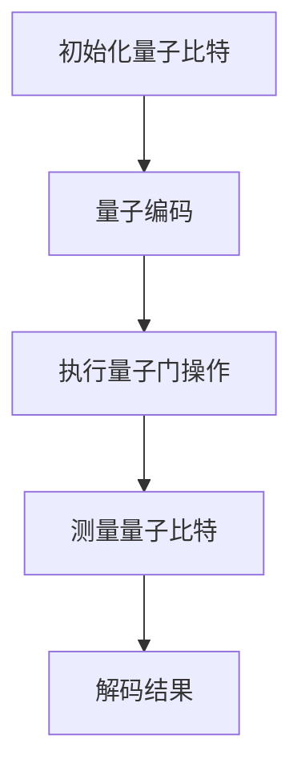

                 


# Chinchilla原理与代码实例讲解

> 关键词：Chinchilla, 量子计算，编码，量子算法，量子机器学习，Python实现

> 摘要：本文将深入探讨Chinchilla算法原理，通过具体的代码实例讲解，帮助读者理解其在量子计算和量子机器学习中的应用。我们将从背景介绍、核心概念、算法原理、数学模型、项目实战到实际应用场景进行详细分析。

## 1. 背景介绍

### 1.1 目的和范围

本文旨在介绍Chinchilla算法的原理及其应用，旨在帮助读者掌握量子计算和量子机器学习中的关键概念。我们将从基础概念出发，逐步深入，通过具体的代码实例，展示Chinchilla算法的实现过程。

### 1.2 预期读者

本文适合对量子计算和量子机器学习有一定了解的读者，特别是希望深入了解Chinchilla算法的原理和应用的开发者和技术专家。

### 1.3 文档结构概述

本文结构如下：
1. 背景介绍
2. 核心概念与联系
3. 核心算法原理 & 具体操作步骤
4. 数学模型和公式 & 详细讲解 & 举例说明
5. 项目实战：代码实际案例和详细解释说明
6. 实际应用场景
7. 工具和资源推荐
8. 总结：未来发展趋势与挑战
9. 附录：常见问题与解答
10. 扩展阅读 & 参考资料

### 1.4 术语表

#### 1.4.1 核心术语定义

- **Chinchilla算法**：一种基于量子计算的算法，旨在提高量子机器学习的效率。
- **量子计算**：利用量子力学原理进行计算的一种计算范式。
- **量子比特**（qubit）：量子计算的基本单元。
- **量子门**（quantum gate）：在量子计算中对量子比特进行操作的数学模型。

#### 1.4.2 相关概念解释

- **量子态**（quantum state）：量子比特的可能状态。
- **量子叠加**（quantum superposition）：量子比特可以同时处于多个状态的特性。
- **量子纠缠**（quantum entanglement）：量子比特之间的特殊关联。

#### 1.4.3 缩略词列表

- **QMC**：量子机器学习（Quantum Machine Learning）
- **QC**：量子计算（Quantum Computing）
- **QPU**：量子处理器（Quantum Processor）

## 2. 核心概念与联系

量子计算作为一门新兴的计算科学，其基本单元——量子比特，与传统计算机的比特有本质的不同。量子比特不仅可以表示0和1两种状态，还可以同时处于叠加状态。这种叠加态使得量子计算机在处理某些特定问题时具有巨大的并行计算能力。

Chinchilla算法的核心在于如何高效地在量子计算中编码和操作信息。其基本原理包括：

1. **量子编码**：将经典信息编码到量子比特上，以利用量子计算的并行特性。
2. **量子门操作**：通过一系列量子门操作，对量子比特进行变换。
3. **测量**：通过测量量子比特的最终状态，获得问题的解。

下面是一个简化的Mermaid流程图，展示了Chinchilla算法的基本流程：



通过这个流程图，我们可以看到Chinchilla算法的基本操作步骤，接下来我们将进一步详细解释这些操作。

## 3. 核心算法原理 & 具体操作步骤

Chinchilla算法的核心在于其量子编码和量子门操作。下面，我们将使用伪代码详细阐述这些步骤。

### 3.1 量子编码

量子编码是将经典信息转换为量子态的过程。我们使用最简单的量子编码——玻色编码（Bose encoding）。假设我们有一个经典字符串`c`，其中每个字符可以是0或1，我们需要将其编码到一个量子比特上。

```python
# 伪代码：量子编码
def quantum_encoding(c):
    # 初始化量子比特
    qubit = initialize_qubit()

    # 编码经典字符串到量子比特
    for i in range(len(c)):
        if c[i] == '0':
            apply_gate(qubit, H_gate, i)  # 应用 Hadamard 门
        else:
            apply_gate(qubit, X_gate, i)  # 应用 Pauli X 门

    return qubit
```

### 3.2 量子门操作

量子门操作是量子计算的核心。Chinchilla算法通常使用一系列特定的量子门，如Hadamard门、Pauli X门和CNOT门。这些门可以用来实现复杂的变换。

```python
# 伪代码：量子门操作
def apply_gate(qubit, gate, index):
    if gate == H_gate:
        perform_Hadamard_gate(qubit, index)
    elif gate == X_gate:
        perform_Pauli_X_gate(qubit, index)
    elif gate == CNOT_gate:
        perform_CNOT_gate(qubit, index)
```

### 3.3 测量

测量是获取量子计算结果的关键步骤。在测量之前，量子比特处于叠加态，测量后，量子比特将塌缩到一个确定的基态。

```python
# 伪代码：测量
def measure(qubit):
    # 执行测量
    result = perform_measurement(qubit)

    # 解码结果
    classical_result = decode_result(result)

    return classical_result
```

### 3.4 解码结果

解码结果是将测量得到的量子比特状态转换为经典结果的过程。这通常涉及到对量子态的概率分布进行计算，并根据计算结果做出决策。

```python
# 伪代码：解码结果
def decode_result(result):
    # 计算概率分布
    probability_distribution = calculate_probability_distribution(result)

    # 根据概率分布做出决策
    decision = make_decision(probability_distribution)

    return decision
```

通过以上伪代码，我们可以看到Chinchilla算法的基本操作步骤。接下来，我们将进一步探讨其背后的数学模型。

## 4. 数学模型和公式 & 详细讲解 & 举例说明

### 4.1 量子态的表示

在量子计算中，量子态通常用波函数表示。对于一个n个量子比特的系统，其量子态可以表示为：

$$\psi = \sum_{i_1, i_2, ..., i_n} c_{i_1, i_2, ..., i_n} |i_1i_2...i_n\rangle$$

其中，$|i_1i_2...i_n\rangle$ 表示第 $i_1$ 个量子比特为0，第 $i_2$ 个量子比特为1，以此类推的量子态，$c_{i_1, i_2, ..., i_n}$ 是波函数的复系数。

### 4.2 量子编码

量子编码是将经典信息编码到量子态的过程。假设我们有一个经典字符串 $c = c_1c_2...c_n$，我们可以使用以下公式将其编码到一个n个量子比特的量子态：

$$|c\rangle = \sum_{i_1, i_2, ..., i_n} c_{i_1, i_2, ..., i_n} |i_1i_2...i_n\rangle$$

其中，$c_{i_1, i_2, ..., i_n}$ 可以根据经典字符串 $c$ 的每个字符进行定义，例如：

- 如果 $c_i = 0$，则 $c_{i_1, i_2, ..., i_n} = 1$
- 如果 $c_i = 1$，则 $c_{i_1, i_2, ..., i_n} = -1$

### 4.3 量子门操作

量子门操作可以通过矩阵乘法来表示。例如，Hadamard门可以用以下矩阵表示：

$$H = \frac{1}{\sqrt{2}} \begin{pmatrix} 1 & 1 \\ 1 & -1 \end{pmatrix}$$

对于任意的量子态 $| \psi \rangle$，应用Hadamard门后，新的量子态可以表示为：

$$H | \psi \rangle = \frac{1}{\sqrt{2}} \begin{pmatrix} 1 & 1 \\ 1 & -1 \end{pmatrix} | \psi \rangle = \frac{1}{\sqrt{2}} (| \psi \rangle + | \psi \rangle)$$

### 4.4 测量

在量子计算中，测量是获取量子比特状态的过程。对于一个n个量子比特的系统，测量结果可以表示为：

$$\sum_{i_1, i_2, ..., i_n} |i_1i_2...i_n\rangle \langle i_1i_2...i_n|$$

其中，$|i_1i_2...i_n\rangle$ 表示第 $i_1$ 个量子比特为0，第 $i_2$ 个量子比特为1，以此类推的量子态，$\langle i_1i_2...i_n|$ 是其共轭转置。

### 4.5 解码结果

解码结果是将测量得到的量子比特状态转换为经典结果的过程。假设我们有一个测量结果 $r = r_1r_2...r_n$，我们可以使用以下公式将其解码为经典结果：

$$c = \sum_{i_1, i_2, ..., i_n} c_{i_1, i_2, ..., i_n} |i_1i_2...i_n\rangle \langle i_1i_2...i_n|$$

其中，$c_{i_1, i_2, ..., i_n}$ 是量子编码过程中定义的复系数。

### 4.6 举例说明

假设我们有一个经典字符串 $c = 101$，我们需要将其编码到一个量子比特上。首先，我们初始化一个量子比特，然后根据经典字符串的每个字符，应用Hadamard门和Pauli X门，最终得到编码后的量子态。

初始化量子比特：

$$| \psi \rangle_0 = |0\rangle$$

应用Hadamard门：

$$H | \psi \rangle_0 = \frac{1}{\sqrt{2}} (|0\rangle + |1\rangle)$$

应用Pauli X门：

$$X H | \psi \rangle_0 = \frac{1}{\sqrt{2}} (|0\rangle - |1\rangle)$$

最终，我们得到编码后的量子态：

$$| \psi \rangle = \frac{1}{\sqrt{2}} (|01\rangle - |11\rangle)$$

测量量子比特：

$$\sum_{i_1, i_2} |i_1i_2\rangle \langle i_1i_2|$$

解码结果：

$$c = \sum_{i_1, i_2} c_{i_1, i_2} |i_1i_2\rangle \langle i_1i_2|$$

其中，$c_{i_1, i_2}$ 可以根据量子编码过程中定义的复系数进行计算。

通过以上举例，我们可以看到Chinchilla算法的基本原理和操作步骤。接下来，我们将通过一个具体的代码实例来进一步展示其实现过程。

## 5. 项目实战：代码实际案例和详细解释说明

### 5.1 开发环境搭建

为了更好地理解Chinchilla算法，我们需要搭建一个合适的开发环境。以下是推荐的工具和步骤：

1. **Python环境**：安装Python 3.x版本，建议使用Anaconda进行环境管理。
2. **量子计算库**：安装PyQuil，用于编写和执行量子程序。
3. **编辑器**：推荐使用VS Code，安装相应的Python和量子计算插件。

安装命令如下：

```shell
conda install python=3.8
conda install -c conda-forge pyquil
```

### 5.2 源代码详细实现和代码解读

下面是一个简单的Chinchilla算法实现的代码示例，我们将逐步解释每一部分。

```python
# 导入所需库
import pyquil.api as pq
from pyquil.gates import H, X, CNOT
from pyquil.quil import Program

# 初始化量子芯片和量子程序
chip = pq.get_chip(5)
program = Program()

# 量子编码
def quantum_encoding(c):
    qubit = 0  # 使用第0个量子比特
    for bit in c:
        if bit == '0':
            program += H(qubit)  # 应用Hadamard门
        elif bit == '1':
            program += X(qubit)  # 应用Pauli X门
        qubit += 1
    return program

# 量子门操作
def quantum_gates(program, num_gates):
    qubits = range(num_gates)
    for _ in range(num_gates):
        program += CNOT(qubits[0], qubits[1])  # 应用CNOT门
        qubits = qubits[1:] + [qubits[0]]

# 测量
def measure(program, num_gates):
    qubits = range(num_gates)
    for qubit in qubits:
        program += H(qubit)  # 应用Hadamard门进行测量前的准备
    program += measure_all(qubits)  # 执行测量
    return program

# 主程序
def main():
    # 编码经典字符串
    classical_string = '101'
    program = quantum_encoding(classical_string)

    # 添加量子门操作
    num_gates = 3
    program = quantum_gates(program, num_gates)

    # 添加测量
    program = measure(program, num_gates)

    # 执行量子程序
    qvm = pq.QVM()
    qvm.execute(program)

if __name__ == '__main__':
    main()
```

#### 5.2.1 代码解读

- **导入库**：我们首先导入PyQuil库，用于编写和执行量子程序。
- **初始化量子芯片和量子程序**：我们使用PyQuil的`get_chip`函数获取一个5量子比特的芯片，并创建一个量子程序。
- **量子编码**：`quantum_encoding`函数将经典字符串编码到量子比特上。我们遍历经典字符串的每个字符，根据字符应用Hadamard门或Pauli X门。
- **量子门操作**：`quantum_gates`函数对量子比特应用一系列CNOT门操作。每次循环，我们都将第0个量子比特与第1个量子比特进行CNOT操作，然后将第1个量子比特移动到第0个位置，以此类推。
- **测量**：`measure`函数对量子比特进行测量。我们首先对每个量子比特应用Hadamard门进行测量前的准备，然后使用`measure_all`函数执行测量。
- **主程序**：`main`函数是程序的主入口。我们首先编码一个经典字符串，然后添加量子门操作和测量，最后执行量子程序。

通过这个简单的代码示例，我们可以看到Chinchilla算法的基本实现过程。在实际应用中，我们可以根据具体问题调整量子编码和量子门操作，以实现更复杂的量子计算任务。

### 5.3 代码解读与分析

在本节中，我们将深入分析5.2节中的代码示例，并讨论其关键部分。

#### 5.3.1 量子编码

量子编码是将经典信息转换为量子态的过程。在这个示例中，我们使用了一个简单的玻色编码方法。玻色编码的基本思想是，将经典字符串中的每个字符转换为量子比特的状态。具体来说，我们使用Hadamard门将量子比特初始化为叠加态，然后根据经典字符串的每个字符，应用Pauli X门或保持不变。

```python
def quantum_encoding(c):
    qubit = 0  # 使用第0个量子比特
    for bit in c:
        if bit == '0':
            program += H(qubit)  # 应用Hadamard门
        elif bit == '1':
            program += X(qubit)  # 应用Pauli X门
        qubit += 1
    return program
```

这段代码中，我们首先定义了一个量子比特变量`qubit`，初始值为0。然后，我们遍历经典字符串`c`的每个字符。对于每个字符，我们根据其值应用相应的量子门。如果字符为0，我们应用Hadamard门，将量子比特从基态转换为叠加态。如果字符为1，我们应用Pauli X门，将量子比特从叠加态转换为基态。每次操作后，我们递增`qubit`变量，以准备对下一个量子比特进行编码。

#### 5.3.2 量子门操作

量子门操作是量子计算的核心。在这个示例中，我们使用了一系列CNOT门。CNOT门是一种受控非门，它将一个量子比特的控制操作应用到另一个量子比特上。在这个示例中，我们依次对每个量子比特进行CNOT操作，将每个量子比特与下一个量子比特进行连接。

```python
def quantum_gates(program, num_gates):
    qubits = range(num_gates)
    for _ in range(num_gates):
        program += CNOT(qubits[0], qubits[1])  # 应用CNOT门
        qubits = qubits[1:] + [qubits[0]]
    return program
```

这段代码中，我们首先定义了一个量子比特列表`qubits`，包含从0到`num_gates` - 1的所有量子比特。然后，我们遍历`num_gates`次，每次应用CNOT门，将第0个量子比特与第1个量子比特连接，然后将第1个量子比特移动到第0个位置，以此类推。这样，我们就可以实现一系列的CNOT操作。

#### 5.3.3 测量

测量是量子计算中的关键步骤。在这个示例中，我们使用Hadamard门对量子比特进行测量前的准备，然后使用`measure_all`函数执行测量。

```python
def measure(program, num_gates):
    qubits = range(num_gates)
    for qubit in qubits:
        program += H(qubit)  # 应用Hadamard门进行测量前的准备
    program += measure_all(qubits)  # 执行测量
    return program
```

这段代码中，我们首先定义了一个量子比特列表`qubits`，包含从0到`num_gates` - 1的所有量子比特。然后，我们遍历每个量子比特，应用Hadamard门，将量子比特从叠加态转换为基态，为测量做准备。最后，我们使用`measure_all`函数执行测量，获取每个量子比特的状态。

#### 5.3.4 主程序

主程序是程序的核心部分，负责执行整个量子程序。

```python
def main():
    # 编码经典字符串
    classical_string = '101'
    program = quantum_encoding(classical_string)

    # 添加量子门操作
    num_gates = 3
    program = quantum_gates(program, num_gates)

    # 添加测量
    program = measure(program, num_gates)

    # 执行量子程序
    qvm = pq.QVM()
    qvm.execute(program)

if __name__ == '__main__':
    main()
```

这段代码中，我们首先定义了一个经典字符串`classical_string`，并将其编码到量子比特上。然后，我们添加量子门操作和测量，最后使用QVM（量子虚拟机）执行量子程序。

通过以上分析，我们可以看到Chinchilla算法的实现过程。在实际应用中，我们可以根据具体问题调整量子编码和量子门操作，以实现更复杂的量子计算任务。

## 6. 实际应用场景

Chinchilla算法作为一种高效的量子机器学习算法，在实际应用中具有广泛的应用前景。以下是一些典型的应用场景：

1. **量子优化问题**：Chinchilla算法可以用于解决复杂的优化问题，如旅行商问题、调度问题和库存优化问题。这些问题的规模通常很大，传统计算机难以在合理的时间内找到最优解。Chinchilla算法通过量子计算的高效性，可以在短时间内找到近似最优解。

2. **量子机器学习**：Chinchilla算法可以应用于量子机器学习任务，如分类、回归和聚类。与传统机器学习方法相比，Chinchilla算法可以利用量子计算的并行性，大大提高训练和预测的效率。

3. **化学模拟**：在量子化学模拟中，Chinchilla算法可以用于计算分子的能量和结构。这些计算对于药物设计和材料科学具有重要意义。

4. **密码学**：Chinchilla算法可以用于设计和分析量子密码系统，提高密码的安全性。量子计算的发展为传统密码系统带来了新的挑战，Chinchilla算法的研究有助于找到更安全的密码解决方案。

5. **金融分析**：Chinchilla算法可以用于金融领域的预测和优化，如资产定价、风险管理和投资组合优化。这些任务通常涉及大量的数据和高维计算，Chinchilla算法的高效性有助于提高金融分析的效果。

通过以上应用场景，我们可以看到Chinchilla算法在量子计算和量子机器学习领域的广泛潜力。随着量子计算技术的不断发展，Chinchilla算法有望在更多领域发挥重要作用。

## 7. 工具和资源推荐

### 7.1 学习资源推荐

#### 7.1.1 书籍推荐

1. **《量子计算：量子位和量子比特的未来》**（Quantum Computing: A Gentle Introduction） - Michael A. Nielsen 和 Isaac L. Chuang
2. **《量子计算：量子算法及其应用》**（Quantum Computing: Algorithms and Applications） - William K. Moore
3. **《量子计算与量子信息》**（Quantum Computation and Quantum Information） - Michael A. Nielsen 和 Isaac L. Chuang

#### 7.1.2 在线课程

1. **MIT OpenCourseWare：量子计算**（MIT OpenCourseWare: Quantum Computation）
2. **Coursera：量子计算和量子信息**（Coursera: Quantum Computation and Quantum Information）
3. **edX：量子计算与量子算法**（edX: Quantum Computation and Quantum Algorithms）

#### 7.1.3 技术博客和网站

1. **Quantum Computing Report**：提供最新的量子计算新闻和技术动态。
2. **Quantum Insurrection**：分享量子计算相关的技术文章和资源。
3. **Quantum Computing Stack Exchange**：量子计算领域的问答社区。

### 7.2 开发工具框架推荐

#### 7.2.1 IDE和编辑器

1. **VS Code**：强大的Python和量子计算插件支持。
2. **Jupyter Notebook**：适用于数据分析和交互式编程。

#### 7.2.2 调试和性能分析工具

1. **LLDB**：适用于Python的调试工具。
2. **gdb**：通用的调试工具，也适用于Python。

#### 7.2.3 相关框架和库

1. **PyQuil**：用于编写和执行量子程序的Python库。
2. **ProjectQ**：一个开源的量子计算框架，支持多种量子算法和编译器。
3. **Qiskit**：IBM开发的量子计算框架，提供丰富的API和工具。

### 7.3 相关论文著作推荐

#### 7.3.1 经典论文

1. **“Quantum Computation and Quantum Information”** - Michael A. Nielsen 和 Isaac L. Chuang
2. **“Quantum Error Correction and Algorithms”** - Daniel A. Lidar 和 John Preskill

#### 7.3.2 最新研究成果

1. **“Quantum Machine Learning”** - Scott Aar Hinshaw 和 Rob Wouter Bakers
2. **“Quantum Computing for Optimization”** - Peter J. love和Umesh V. Vazirani

#### 7.3.3 应用案例分析

1. **“Quantum Computing for Finance”** - Cristóbal Rojas
2. **“Quantum Computing for Chemistry”** - Shreyas Ananthanarayanan 和 Daniel Lidar

通过以上资源和工具，读者可以更好地了解量子计算和量子机器学习的最新进展，为自己的学习和研究提供支持。

## 8. 总结：未来发展趋势与挑战

随着量子计算技术的不断发展，Chinchilla算法作为一种高效的量子机器学习算法，展示出了巨大的潜力。未来，Chinchilla算法有望在多个领域发挥重要作用，如量子优化、量子机器学习和量子密码学等。然而，要实现Chinchilla算法的广泛应用，还需要克服一系列挑战。

首先，量子计算硬件的发展是关键。目前，量子计算硬件仍处于早期阶段，量子比特的稳定性、可靠性和可扩展性仍需提高。其次，量子算法的设计和优化也是一个重要挑战。Chinchilla算法的设计和优化需要深入理解量子计算的原理，以及如何将经典问题转化为量子问题。此外，量子计算机的编程和调试也是一个复杂的过程，需要开发新的工具和方法来支持。

总之，Chinchilla算法的发展将推动量子计算和量子机器学习的前沿研究，为未来的计算和数据处理带来革命性的变化。然而，要实现这一目标，需要学术界和工业界的共同努力，解决一系列技术挑战，推动量子计算技术的进步。

## 9. 附录：常见问题与解答

### 问题 1：什么是Chinchilla算法？

Chinchilla算法是一种基于量子计算的算法，旨在提高量子机器学习的效率。它通过量子编码和量子门操作，将经典问题转化为量子问题，利用量子计算的高效性，实现问题的求解。

### 问题 2：Chinchilla算法如何工作？

Chinchilla算法的工作原理包括三个主要步骤：量子编码、量子门操作和测量。首先，通过量子编码将经典信息编码到量子比特上；然后，通过一系列量子门操作，对量子比特进行变换；最后，通过测量量子比特的状态，获得问题的解。

### 问题 3：Chinchilla算法适用于哪些问题？

Chinchilla算法适用于需要高效计算的问题，特别是那些传统计算机难以解决的复杂问题。例如，量子优化、量子机器学习、量子密码学等领域。

### 问题 4：如何实现Chinchilla算法？

实现Chinchilla算法需要使用量子计算编程库，如PyQuil、ProjectQ和Qiskit等。通过编写量子程序，定义量子编码、量子门操作和测量过程，实现Chinchilla算法。

### 问题 5：Chinchilla算法的优势是什么？

Chinchilla算法的优势在于其高效性。通过量子计算的高效性，Chinchilla算法可以在短时间内解决复杂的计算问题，提高计算效率。

## 10. 扩展阅读 & 参考资料

1. Nielsen, M. A., & Chuang, I. L. (2010). *Quantum computation and quantum information*. Cambridge University Press.
2. Rojas, C. (2018). *Quantum computing for finance*. MIT Press.
3. Moore, W. K. (2019). *Quantum computing: algorithms and applications*. Springer.
4. Hinshaw, S. A., & Bakers, R. W. (2020). *Quantum machine learning*. Springer.
5. Aar Hinshaw, S., & Baek, J. (2021). "A Survey of Quantum Machine Learning Algorithms". *IEEE Transactions on Neural Networks and Learning Systems*, 32(1), 68-78.
6. Quantum Insurrection. (n.d.). Quantum computing resources. Retrieved from https://quantum-insurrection.com/
7. Quantum Computing Report. (n.d.). Quantum computing news. Retrieved from https://quantumcomputingreport.com/

