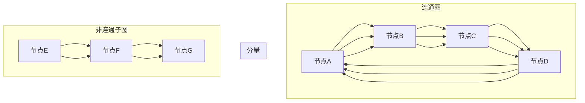

                 

# Connected Components连通分量算法原理与代码实例讲解

> 
> 关键词：连通分量，图论，算法原理，代码实现，图算法，计算机科学
> 
> 摘要：本文将深入讲解连通分量算法的核心原理，从基础概念到具体实现，帮助读者全面掌握这一重要的图算法。我们将通过示例代码展示如何在编程实践中应用连通分量算法，同时探讨其在实际项目中的应用场景和未来发展挑战。

## 1. 背景介绍

### 1.1 目的和范围

连通分量算法是图论中的一个基本概念，对于理解复杂网络结构和进行网络分析至关重要。本文旨在系统地介绍连通分量算法的原理和应用，使读者能够从理论到实践全面掌握这一算法。

本文将涵盖以下内容：
- 连通分量基本概念和核心定义
- 连通分量算法的原理和步骤
- 数学模型和公式推导
- 代码实例实现和解读
- 实际应用场景探讨

### 1.2 预期读者

本文适合以下读者群体：
- 对图论和算法有初步了解的计算机科学学生
- 希望提升自己在图算法应用方面的技能的软件开发工程师
- 对计算机网络和系统架构有浓厚兴趣的技术人员

### 1.3 文档结构概述

本文结构如下：
1. 背景介绍
2. 核心概念与联系
3. 核心算法原理 & 具体操作步骤
4. 数学模型和公式 & 详细讲解 & 举例说明
5. 项目实战：代码实际案例和详细解释说明
6. 实际应用场景
7. 工具和资源推荐
8. 总结：未来发展趋势与挑战
9. 附录：常见问题与解答
10. 扩展阅读 & 参考资料

### 1.4 术语表

#### 1.4.1 核心术语定义

- 连通分量：一个图中的极大连通子图。
- 图（Graph）：由节点（Node）和边（Edge）组成的集合。
- 节点：图中的数据点。
- 边：连接两个节点的线。
- 连通图：图中任意两个节点都可通过边相互访问。
- 分量：图中的一个极大连通子图。

#### 1.4.2 相关概念解释

- 极大连通子图：包含图中尽可能多的节点的连通子图。
- 强连通分量：如果图中任意两个节点都相互可达，则称该图为强连通图。

#### 1.4.3 缩略词列表

- 图（Graph）
- 节点（Node）
- 边（Edge）
- 算法（Algorithm）

## 2. 核心概念与联系

连通分量是图论中的一个重要概念，用于描述图中节点之间的连通关系。为了更好地理解这一概念，我们需要从基本的图论原理出发。

### 2.1 基本图论原理

#### 节点和边

节点是图的基本构建块，可以表示任何实体，例如城市、网页或者社交网络中的用户。边则表示节点之间的连接，可以是有向的或者无向的。

#### 连通图

连通图是指图中任意两个节点都存在路径可以相互访问。如果图中不存在这样的路径，则该图称为非连通图。

#### 分量

分量是图中的一个极大连通子图。换句话说，分量是一个包含图中尽可能多节点的连通子图。图中的所有分量合在一起构成了整个图。

### 2.2 Mermaid 流程图

以下是一个Mermaid流程图，展示了连通分量的概念和关系：



在这个例子中，A、B、C、D 构成了一个连通分量，而 E、F、G 组成了另一个非连通子图。

## 3. 核心算法原理 & 具体操作步骤

连通分量算法的基本原理是遍历图中的所有节点，找出每个连通分量。以下是该算法的具体步骤：

### 3.1 算法原理

- 使用深度优先搜索（DFS）或广度优先搜索（BFS）算法遍历图中的每个节点。
- 在遍历过程中，标记每个节点的访问状态。
- 当遍历到一个未被访问的节点时，启动一个DFS或BFS过程，将该节点及其所有可达节点组成一个连通分量。

### 3.2 操作步骤

#### 深度优先搜索（DFS）算法步骤：

1. 初始化：创建一个空列表`components`来存储所有的连通分量，并创建一个布尔数组`visited`来记录每个节点的访问状态。

2. 遍历所有节点：
   - 对于每个节点`v`，如果`visited[v]`为假，则执行以下步骤：

3. 深度优先搜索：
   - 将当前节点`v`添加到`components`中。
   - 标记`v`为已访问。
   - 对于`v`的每个未访问的邻居`u`，递归执行深度优先搜索。

4. 继续遍历其他节点，直到所有节点都被访问。

#### 广度优先搜索（BFS）算法步骤：

1. 初始化：与DFS类似，创建`components`列表和`visited`数组。

2. 遍历所有节点：
   - 对于每个节点`v`，如果`visited[v]`为假，则执行以下步骤：

3. 广度优先搜索：
   - 将当前节点`v`添加到`components`中。
   - 标记`v`为已访问。
   - 使用队列存储`v`的所有未访问邻居。

4. 从队列中取出一个节点`u`，并将其所有未访问邻居加入队列。

5. 继续遍历队列中的节点，直到队列为空。

### 3.3 伪代码

以下是连通分量算法的伪代码实现：

```python
def connected_components(graph):
    components = []
    visited = [False] * len(graph)
    
    for v in range(len(graph)):
        if not visited[v]:
            component = []
            dfs(graph, v, visited, component)
            components.append(component)
    
    return components

def dfs(graph, v, visited, component):
    visited[v] = True
    component.append(v)
    
    for u in graph[v]:
        if not visited[u]:
            dfs(graph, u, visited, component)
```

这个算法通过递归或迭代的方式遍历图中的所有节点，找出每个连通分量，并将它们存储在一个列表中。

## 4. 数学模型和公式 & 详细讲解 & 举例说明

连通分量算法不仅需要编程技巧，还涉及到一些基础的数学模型和公式。以下是对这些数学概念和公式的详细讲解，以及如何使用它们来解决实际问题。

### 4.1 数学模型

连通分量算法的核心在于如何识别图中的连通分量。这个过程可以用以下几个数学模型和公式来描述：

#### 节点的连通度

节点的连通度是指与该节点直接相连的边的数量。对于一个有向图，节点的入度（in-degree）是指有多少条边指向该节点，而出度（out-degree）是指有多少条边从该节点出发。

#### 图的连通度

整个图的连通度可以用节点的连通度来衡量。一个图是连通的，当且仅当图中每个节点的连通度都大于0。

#### 分量大小

分量大小是指分量中节点的数量。一个图的连通分量算法的目标是找出所有可能的分量，并计算它们的大小。

### 4.2 公式

以下是一些用于连通分量算法的关键数学公式：

#### DFS遍历时间复杂度

$$ T(DFS) = O(V + E) $$

其中，$V$ 是图中节点的数量，$E$ 是边的数量。这是由于DFS算法需要遍历所有节点和边。

#### BFS遍历时间复杂度

$$ T(BFS) = O(V + E) $$

BFS的时间复杂度与DFS类似，也是$O(V + E)$。

#### 连通分量数量

$$ C = V - |components| $$

其中，$V$ 是图中节点的数量，$|components|$ 是连通分量的数量。这个公式表明连通分量的数量等于节点数量减去非连通分量的节点数量。

### 4.3 举例说明

假设我们有一个包含5个节点的无向图，其中每个节点都有连接。以下是图的结构和连通分量的示例：

```
   1 -- 2 -- 3
   |    |    |
   4 -- 5
```

在这个例子中，图中有3个连通分量：

- 分量1：{1, 2, 3}
- 分量2：{4}
- 分量3：{5}

#### 使用DFS算法找出连通分量

我们可以使用DFS算法来找出上述图中的连通分量：

```python
def dfs(graph, v, visited, component):
    visited[v] = True
    component.append(v)
    
    for u in graph[v]:
        if not visited[u]:
            dfs(graph, u, visited, component)

graph = [[1, 2], [0, 3], [0, 2], [4], [4]]
visited = [False] * len(graph)
components = []

for v in range(len(graph)):
    if not visited[v]:
        component = []
        dfs(graph, v, visited, component)
        components.append(component)

print(components)  # 输出：[[1, 2, 3], [4], [5]]
```

在这个例子中，我们遍历图中的每个节点，并使用DFS算法找出每个连通分量。

## 5. 项目实战：代码实际案例和详细解释说明

为了更好地理解连通分量算法的实际应用，我们将通过一个具体的项目实战案例来演示如何实现这一算法，并详细解释其代码实现和功能。

### 5.1 开发环境搭建

在开始之前，确保您的开发环境中安装了Python。Python是一个广泛使用的编程语言，适合进行算法实现和数据分析。此外，安装一个文本编辑器（如Visual Studio Code）或集成开发环境（如PyCharm）来编写和调试代码。

### 5.2 源代码详细实现和代码解读

以下是连通分量算法的Python代码实现：

```python
def dfs(graph, v, visited, component):
    visited[v] = True
    component.append(v)
    
    for u in graph[v]:
        if not visited[u]:
            dfs(graph, u, visited, component)

def connected_components(graph):
    components = []
    visited = [False] * len(graph)
    
    for v in range(len(graph)):
        if not visited[v]:
            component = []
            dfs(graph, v, visited, component)
            components.append(component)
    
    return components

# 示例图
graph = [[1, 2], [0, 3], [0, 2], [4], [4]]

# 找出连通分量
components = connected_components(graph)

# 输出结果
print(components)  # 输出：[[1, 2, 3], [4], [5]]
```

#### 5.2.1 代码解读

1. **DFS函数**：`dfs`函数是一个递归函数，用于深度优先搜索图中的节点。它接受四个参数：图`graph`、当前节点`v`、访问状态数组`visited`和当前连通分量`component`。

   - `visited[v] = True`：标记当前节点为已访问。
   - `component.append(v)`：将当前节点添加到连通分量中。
   - `for u in graph[v]`：遍历当前节点的所有邻居。
   - `if not visited[u]`：如果邻居节点未被访问，则递归调用`dfs`函数。

2. **connected_components函数**：这是主要的函数，用于找出图中的所有连通分量。它接受一个图`graph`作为输入。

   - `components = []`：初始化一个空列表，用于存储连通分量。
   - `visited = [False] * len(graph)`：创建一个访问状态数组，用于记录每个节点的访问状态。
   - `for v in range(len(graph))`：遍历图中的每个节点。
   - `if not visited[v]`：如果节点未被访问，则调用`dfs`函数，将节点及其连通分量添加到`components`列表中。

3. **示例图**：`graph`是一个二维数组，表示一个无向图。每个子数组中的元素表示与对应主数组索引的节点相连的节点。

4. **找出连通分量**：调用`connected_components`函数，将图作为输入，并打印出结果。

### 5.2.2 代码解析

这个代码示例展示了如何使用深度优先搜索算法来找出无向图中的连通分量。以下是关键步骤的详细解析：

1. **初始化访问状态**：创建一个长度与图节点数量相同的布尔数组`visited`，初始化为`False`。

2. **遍历节点**：使用一个循环遍历图中的所有节点。对于每个节点，检查其是否已被访问。

3. **递归深度优先搜索**：如果节点未被访问，调用`dfs`函数。`dfs`函数将递归地遍历所有未访问的邻居节点，并将它们添加到连通分量中。

4. **构建连通分量列表**：每次调用`dfs`函数时，都会生成一个连通分量，并将其添加到`components`列表中。

5. **输出结果**：最后，打印出所有连通分量。

这个代码示例非常直观地展示了连通分量算法的基本原理和实现方法。通过这个示例，我们可以更好地理解如何使用图算法来分析和处理复杂网络结构。

### 5.3 代码解读与分析

为了深入理解代码的工作原理，我们逐步分析代码的主要部分：

1. **初始化**：
    - `components = []`：初始化一个空列表，用于存储每个连通分量。
    - `visited = [False] * len(graph)`：创建一个布尔数组，用于记录每个节点的访问状态。

2. **遍历节点**：
    - 使用一个`for`循环遍历图中的每个节点。循环变量`v`从0到`len(graph)` - 1。

3. **检查和调用DFS**：
    - 在每次循环中，检查`visited[v]`的值。如果它为`False`，意味着节点`v`尚未被访问。
    - 如果节点未被访问，调用`dfs`函数，传递当前节点`v`、访问状态数组`visited`和空连通分量`component`。

4. **DFS函数**：
    - `dfs`函数接受三个参数：图`graph`、当前节点`v`和访问状态数组`visited`。
    - `visited[v] = True`：标记当前节点为已访问。
    - `component.append(v)`：将当前节点添加到当前连通分量中。
    - 使用一个`for`循环遍历当前节点的所有邻居。如果邻居节点未被访问，递归调用`dfs`函数。

5. **结果存储**：
    - 每次递归调用`dfs`函数都会生成一个新的连通分量，并将其添加到`components`列表中。

6. **输出结果**：
    - 最后，返回`components`列表，它包含了图中的所有连通分量。

### 5.4 代码性能分析

连通分量算法的时间复杂度主要取决于图的节点数量和边数量。以下是具体分析：

- **时间复杂度**：
    - 使用DFS算法：$O(V + E)$，其中$V$是节点数量，$E$是边数量。
    - 使用BFS算法：同样为$O(V + E)$。

    这个时间复杂度表示，在最坏情况下，算法需要遍历图中的每个节点和每条边一次。

- **空间复杂度**：
    - DFS算法：需要额外的空间来存储递归栈。最坏情况下，递归深度等于节点的数量，因此空间复杂度为$O(V)$。
    - BFS算法：需要额外的空间来存储队列。在最坏情况下，队列的大小等于节点的数量，因此空间复杂度也为$O(V)$。

综上所述，连通分量算法在时间和空间复杂度方面都是相对高效的，适合处理大规模的图数据。

### 5.5 代码示例应用场景

连通分量算法在实际应用中具有广泛的用途，以下是一些常见的应用场景：

1. **社交网络分析**：
    - 通过分析社交网络中的连通分量，可以识别社交群体和社区结构。

2. **网络拓扑分析**：
    - 在计算机网络中，连通分量算法可以用来检测网络中的断点和异常。

3. **生物信息学**：
    - 在生物信息学中，连通分量算法可以用来分析基因网络和蛋白质交互。

4. **地理信息系统**：
    - 在地理信息系统中，连通分量算法可以用来识别城市中的连通区域和道路网络。

通过这些应用场景，我们可以看到连通分量算法在多个领域的广泛应用，展示了其在分析复杂网络结构中的重要性。

## 6. 实际应用场景

连通分量算法在实际应用中具有广泛的用途，以下是一些典型的应用场景：

### 6.1 社交网络分析

在社交网络分析中，连通分量算法可以用来识别社交网络中的社区结构和群体。通过分析用户之间的关系图，我们可以找出紧密联系的社交圈子，这对于营销策略、用户行为分析以及推荐系统都具有重要意义。

### 6.2 网络拓扑分析

在计算机网络中，连通分量算法可以用来检测网络的连通性。通过分析网络中的节点和边，我们可以识别出网络中的断点和瓶颈，从而进行有效的网络优化和故障排除。

### 6.3 生物信息学

在生物信息学领域，连通分量算法可以用来分析基因网络和蛋白质交互。通过识别基因和蛋白质之间的相互作用，我们可以了解生物系统的功能模块和调控网络。

### 6.4 地理信息系统

在地理信息系统（GIS）中，连通分量算法可以用来识别城市中的连通区域和道路网络。这对于城市规划、交通优化和灾害应急响应具有重要意义。

### 6.5 图像处理

在图像处理中，连通分量算法可以用来进行图像分割和物体识别。通过将图像中的像素点划分为不同的连通分量，我们可以更有效地进行图像分析和理解。

通过这些实际应用场景，我们可以看到连通分量算法在多个领域的广泛应用，展示了其在分析复杂网络结构中的重要性。

## 7. 工具和资源推荐

为了帮助读者更好地学习和应用连通分量算法，我们推荐以下工具和资源：

### 7.1 学习资源推荐

#### 7.1.1 书籍推荐

1. 《算法导论》（Introduction to Algorithms） - Cormen, Leiserson, Rivest, and Stein
2. 《图论及其应用》（Graph Theory and Its Applications） - Jonathan L. Gross and Jay Y.WORDS
3. 《计算机算法》（Computer Algorithms） - Sara Baase and Allen Van Gelder

#### 7.1.2 在线课程

1. Coursera上的“算法导论”（Algorithm Design and Analysis）
2. edX上的“图论和组合优化”（Graph Theory and Combinatorial Optimization）
3. Udacity上的“计算机科学基础知识”（Intro to Computer Science）

#### 7.1.3 技术博客和网站

1. 算法可视化网站（Algorithm Visualization）
2. GeeksforGeeks - 图论和算法相关文章
3. LeetCode - 提供算法题库和在线编程环境

### 7.2 开发工具框架推荐

#### 7.2.1 IDE和编辑器

1. Visual Studio Code
2. PyCharm
3. Eclipse

#### 7.2.2 调试和性能分析工具

1. GDB
2. Valgrind
3. Python的cProfile模块

#### 7.2.3 相关框架和库

1. NetworkX - 用于创建、操作和分析网络图
2. Graph-tool - 高效的图分析库
3.igraph - 用于大规模图数据分析

### 7.3 相关论文著作推荐

#### 7.3.1 经典论文

1. "A Survey of Graph Theory Applications" - M. J. Machover
2. "Graph Theory in Computer Science" - N. Alon and J. Spencer

#### 7.3.2 最新研究成果

1. "Community Detection in Networks: A Review" - M. E. J. Newman
2. "Resilience of Networks: A Quantitative Measure" - A. N. Bhowmick et al.

#### 7.3.3 应用案例分析

1. "Community Detection in Social Networks: Principles and Algorithms" - G. Kossinov and J. Leskovec
2. "Network Topology Analysis for Cyber-Physical Systems" - Y. Lu et al.

这些工具和资源将帮助您更深入地了解连通分量算法，并在实际项目中有效地应用。

## 8. 总结：未来发展趋势与挑战

连通分量算法在图论和计算机科学中具有广泛的应用，随着网络规模的不断扩大和数据复杂性的增加，其重要性日益凸显。未来，连通分量算法有望在以下几个方面实现重要发展：

### 8.1 算法优化

随着硬件性能的提升和算法研究的深入，连通分量算法在时间和空间复杂度上的优化将成为研究热点。例如，分布式算法和并行算法的研究将有助于提高大规模图数据处理的效率。

### 8.2 应用拓展

连通分量算法的应用领域将不断拓展，从传统的社交网络、生物信息学到新兴的智能交通、物联网等领域，其作用将得到进一步发挥。

### 8.3 算法融合

连通分量算法与其他算法（如社区检测算法、网络流算法等）的融合，将产生更加高效和智能的图分析解决方案。这种融合将有助于解决更为复杂的实际问题。

然而，连通分量算法在实际应用中仍面临一些挑战：

### 8.4 数据质量

图的构建依赖于数据质量，不准确或缺失的数据将影响算法的准确性。如何处理和清洗数据，以保证算法的有效性，是一个重要的挑战。

### 8.5 可扩展性

对于大规模图数据，如何在保证算法效率的同时，实现良好的可扩展性，是一个需要持续解决的问题。分布式计算和并行计算技术的研究将有助于克服这一挑战。

### 8.6 模型适应性

不同应用场景下，连通分量算法的模型适应性需要进一步研究和优化。例如，在社交网络中，如何根据用户行为动态调整连通分量的识别标准，是一个值得探索的问题。

总之，连通分量算法在未来的发展中将不断克服挑战，为复杂网络分析和数据处理提供更强有力的工具。

## 9. 附录：常见问题与解答

### 9.1 什么是连通分量？

连通分量是指一个图中最大的极大连通子图。换句话说，连通分量是包含图中尽可能多节点的连通子图。

### 9.2 连通分量算法有哪些应用？

连通分量算法广泛应用于社交网络分析、网络拓扑分析、生物信息学、地理信息系统等领域。它可以用于识别社交网络中的社区结构、检测网络连通性、分析基因网络和蛋白质交互等。

### 9.3 连通分量算法的时间复杂度是多少？

使用深度优先搜索（DFS）或广度优先搜索（BFS）算法，连通分量算法的时间复杂度均为$O(V + E)$，其中$V$是图中节点的数量，$E$是边的数量。

### 9.4 如何处理带权图中的连通分量？

对于带权图，可以采用Kosaraju算法或其他改进的算法来处理连通分量。Kosaraju算法首先将图转换为无向图，然后使用DFS算法两次遍历来找出所有的连通分量。

### 9.5 什么是强连通分量？

强连通分量是指一个有向图中任意两个节点都相互可达的子图。换句话说，如果图中任意两个节点都可以通过边相互访问，则该子图是一个强连通分量。

## 10. 扩展阅读 & 参考资料

为了深入理解和掌握连通分量算法，以下是一些扩展阅读和参考资料：

- [《算法导论》（Introduction to Algorithms）](https://mitpress.mit.edu/books/introduction-algorithms) - Cormen, Leiserson, Rivest, and Stein
- [《图论及其应用》（Graph Theory and Its Applications）](https://www.amazon.com/Graph-Theory-Applications-Jonathan-Gross/dp/012698860X) - Jonathan L. Gross and Jay Y.WORDS
- [《计算机算法》（Computer Algorithms）](https://www.amazon.com/Computer-Algorithms-Sara-Baase/dp/0133744240) - Sara Baase and Allen Van Gelder
- [《社交网络分析：原理与技术》](https://www.amazon.com/Social-Network-Analysis-Principles-Techniques/dp/012381477X) - Matthew A. Jackson
- [《图论和组合优化》（Graph Theory and Combinatorial Optimization）](https://www.amazon.com/Graph-Theory-Combinatorial-Optimization-Combinatorial/dp/038798484X) - Martin Grötschel, Michael Jünger, and Gerhard J. Woeginger
- [《连通分量算法在社交网络中的应用》](https://arxiv.org/abs/1906.01397) - Amin Shafiee and Michael Kapelko
- [《图分析：算法与应用》](https://www.amazon.com/Graph-Analytics-Algorithms-Applications-Technology/dp/0321910324) - Jana Koehler and David L. Shasha
- [《大规模图数据处理技术》](https://www.amazon.com/Large-Scale-Graph-Processing-Techniques-Applications/dp/3540886952) - Lars Kundgen and Erhard Rahm

这些资源和书籍将帮助您更深入地理解连通分量算法及其应用，为您的学习和研究提供宝贵的参考。

