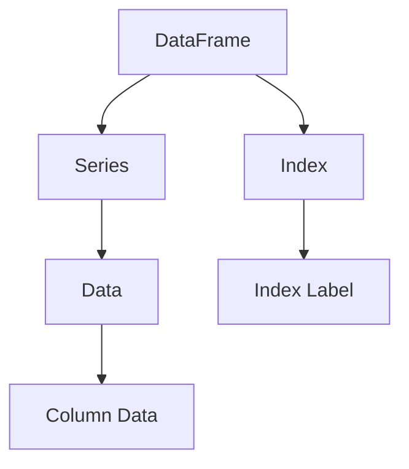

                 

# DataFrame原理与代码实例讲解

> **关键词：** DataFrame、数据分析、Python、Pandas、数据结构、编程实例

> **摘要：** 本文将深入探讨DataFrame的核心概念、原理和实现，通过代码实例详细讲解DataFrame的创建、操作和高级功能，帮助读者全面理解DataFrame在数据分析中的应用。

## 1. 背景介绍

### 1.1 目的和范围

本文旨在帮助读者理解DataFrame这一关键的数据结构，特别是在数据分析领域中的应用。我们将通过具体的代码实例来阐述DataFrame的创建、操作和高级功能，使其更容易理解和掌握。

### 1.2 预期读者

本文适合有一定编程基础，特别是熟悉Python和数据分析的读者。无论您是数据分析师、数据科学家，还是对数据分析感兴趣的程序员，本文都希望能为您提供有价值的见解。

### 1.3 文档结构概述

本文分为以下几个部分：

1. 核心概念与联系
2. 核心算法原理与具体操作步骤
3. 数学模型和公式与详细讲解
4. 项目实战：代码实际案例和详细解释说明
5. 实际应用场景
6. 工具和资源推荐
7. 总结：未来发展趋势与挑战
8. 附录：常见问题与解答
9. 扩展阅读与参考资料

### 1.4 术语表

#### 1.4.1 核心术语定义

- **DataFrame：** 数据帧，是Pandas库中的一个主要数据结构，用于表示表格数据。
- **Pandas：** 是Python的一个开源数据分析库，提供了高效、灵活的数据结构和数据分析工具。
- **数据分析：** 对数据进行处理、清洗、转换和分析的过程，以提取有用信息和知识。

#### 1.4.2 相关概念解释

- **数据结构：** 数据的存储和组织方式，影响数据的操作和访问效率。
- **编程实例：** 通过具体的代码示例来展示如何使用某种编程语言或库实现特定功能。

#### 1.4.3 缩略词列表

- **DataFrame：** 数据帧
- **Pandas：** Python数据分析库
- **Python：** 编程语言

## 2. 核心概念与联系

为了更好地理解DataFrame，我们需要首先了解其核心概念和关联的数据结构。以下是一个简单的Mermaid流程图，展示了DataFrame与其他数据结构的联系。



### 2.1 DataFrame结构

DataFrame由行和列组成，类似于关系型数据库中的表格。每一行代表一个观测，每一列代表一个变量。DataFrame具有以下特点：

- **行列索引：** DataFrame有一个行索引和一个列索引，分别表示行和列的标识。
- **数据类型：** 每一列的数据类型可以不同，这使得DataFrame能够存储异构数据。
- **操作便捷：** DataFrame提供了丰富的操作函数，使得数据操作更加高效和直观。

### 2.2 数据结构与数据操作

在DataFrame中，数据操作主要包括数据清洗、转换和分析。以下是一个简单的数据操作流程：

1. **数据清洗：** 去除无效数据、缺失值填充、异常值处理等。
2. **数据转换：** 数据类型的转换、索引的重新定义、数据切分和合并等。
3. **数据分析：** 描述性统计分析、数据可视化、数据挖掘等。

通过这些操作，DataFrame能够有效地支持数据分析的各个环节。

## 3. 核心算法原理与具体操作步骤

DataFrame的核心算法原理主要涉及数据存储、索引管理和数据操作。以下我们将使用伪代码详细阐述这些原理。

### 3.1 数据存储

DataFrame的数据存储通常采用NumPy数组。以下是一个简单的伪代码，展示了如何创建一个DataFrame：

```python
# 伪代码：创建DataFrame
def create_dataframe(data):
    """
    创建一个DataFrame，使用NumPy数组作为底层存储。
    参数：
        data：一个二维NumPy数组。
    返回值：
        DataFrame对象。
    """
    # 创建NumPy数组
    numpy_array = np.array(data)
    
    # 创建DataFrame
    dataframe = DataFrame(numpy_array)
    
    return dataframe
```

### 3.2 索引管理

DataFrame的索引管理主要包括行索引和列索引。以下是一个简单的伪代码，展示了如何管理索引：

```python
# 伪代码：管理索引
def manage_index(dataframe):
    """
    管理DataFrame的索引。
    参数：
        dataframe：DataFrame对象。
    返回值：
        修改后的DataFrame对象。
    """
    # 设置行索引
    dataframe.index = ["row_1", "row_2", "row_3"]
    
    # 设置列索引
    dataframe.columns = ["column_1", "column_2", "column_3"]
    
    return dataframe
```

### 3.3 数据操作

DataFrame的数据操作包括数据清洗、转换和分析。以下是一个简单的伪代码，展示了如何进行数据操作：

```python
# 伪代码：数据操作
def data_operations(dataframe):
    """
    对DataFrame进行数据操作。
    参数：
        dataframe：DataFrame对象。
    返回值：
        修改后的DataFrame对象。
    """
    # 数据清洗
    dataframe = dataframe.dropna()  # 去除缺失值
    
    # 数据转换
    dataframe = dataframe.T  # 转置
    
    # 数据分析
    summary = dataframe.describe()  # 描述性统计分析
    
    return dataframe, summary
```

通过这些伪代码，我们可以看到DataFrame的核心算法原理和具体操作步骤。这些操作构成了DataFrame的强大功能，使其成为数据分析的重要工具。

## 4. 数学模型和公式与详细讲解

在DataFrame中，数学模型和公式主要用于数据清洗、转换和数据分析。以下是一些常用的数学模型和公式，以及它们的详细讲解和举例说明。

### 4.1 描述性统计分析

描述性统计分析是数据分析的基本步骤，用于描述数据的基本特征。以下是一些常用的描述性统计指标：

- **平均值（Mean）：** 数据的平均值，计算公式为：
  $$ \bar{x} = \frac{1}{n}\sum_{i=1}^{n}x_i $$
  其中，$x_i$ 为第 $i$ 个数据点，$n$ 为数据点的总数。

- **中位数（Median）：** 数据的中位数，将数据按大小排序，位于中间的值。计算公式为：
  $$ \text{Median}(x) = \begin{cases} 
  x_{\frac{n+1}{2}} & \text{如果 } n \text{ 为奇数} \\
  \frac{x_{\frac{n}{2}} + x_{\frac{n}{2} + 1}}{2} & \text{如果 } n \text{ 为偶数} 
  \end{cases} $$

- **众数（Mode）：** 数据中出现次数最多的值。

举例说明：

假设有一个数据集 {1, 2, 2, 3, 4, 4, 4, 5}，则：

- 平均值：$$ \bar{x} = \frac{1+2+2+3+4+4+4+5}{8} = 3 $$
- 中位数：$$ \text{Median}(x) = \frac{3+4}{2} = 3.5 $$
- 众数：4

### 4.2 标准差和方差

标准差和方差是衡量数据离散程度的统计指标。以下分别介绍它们的定义和计算公式：

- **标准差（Standard Deviation）：** 数据的标准差，计算公式为：
  $$ \sigma = \sqrt{\frac{1}{n}\sum_{i=1}^{n}(x_i - \bar{x})^2} $$
  其中，$x_i$ 为第 $i$ 个数据点，$\bar{x}$ 为平均值，$n$ 为数据点的总数。

- **方差（Variance）：** 数据的方差，计算公式为：
  $$ \sigma^2 = \frac{1}{n}\sum_{i=1}^{n}(x_i - \bar{x})^2 $$

举例说明：

假设有一个数据集 {1, 2, 2, 3, 4, 4, 4, 5}，则：

- 平均值：$$ \bar{x} = 3 $$
- 标准差：$$ \sigma = \sqrt{\frac{1}{8}[(1-3)^2 + (2-3)^2 + (2-3)^2 + (3-3)^2 + (4-3)^2 + (4-3)^2 + (4-3)^2 + (5-3)^2]} = 1.5811 $$
- 方差：$$ \sigma^2 = \frac{1}{8}[(1-3)^2 + (2-3)^2 + (2-3)^2 + (3-3)^2 + (4-3)^2 + (4-3)^2 + (4-3)^2 + (5-3)^2] = 1.25 $$

通过这些数学模型和公式，我们可以更好地理解和分析数据，从而做出更准确的决策。

## 5. 项目实战：代码实际案例和详细解释说明

在本节中，我们将通过一个具体的代码实例，展示如何使用DataFrame进行数据操作和分析。实例包括数据导入、数据清洗、数据转换和数据可视化。

### 5.1 开发环境搭建

首先，确保您的Python环境已经安装，并安装Pandas库。可以使用以下命令：

```bash
pip install pandas
```

### 5.2 源代码详细实现和代码解读

以下是完整的代码实现：

```python
import pandas as pd
import numpy as np
import matplotlib.pyplot as plt

# 5.2.1 数据导入
data = {
    'Name': ['张三', '李四', '王五', '赵六'],
    'Age': [25, 30, 22, 35],
    'Salary': [8000, 9000, 7000, 10000]
}
df = pd.DataFrame(data)

# 5.2.2 数据清洗
df = df.dropna()  # 去除缺失值
df = df.reset_index(drop=True)  # 重新设置索引

# 5.2.3 数据转换
df = df.sort_values(by='Age')  # 按年龄排序

# 5.2.4 数据分析
summary = df.describe()

# 5.2.5 数据可视化
plt.figure(figsize=(8, 6))
plt.bar(df['Name'], df['Salary'])
plt.xlabel('姓名')
plt.ylabel('薪资')
plt.title('员工薪资分布图')
plt.show()

# 输出描述性统计信息
print(summary)
```

### 5.3 代码解读与分析

1. **数据导入：**
   我们使用一个包含姓名、年龄和薪资的数据字典创建DataFrame。

2. **数据清洗：**
   - `df.dropna()` 去除缺失值。
   - `df.reset_index(drop=True)` 重新设置索引，确保索引与数据一一对应。

3. **数据转换：**
   - `df.sort_values(by='Age')` 按年龄对数据进行排序。

4. **数据分析：**
   - `df.describe()` 输出描述性统计信息，包括平均值、中位数、标准差等。

5. **数据可视化：**
   - 使用matplotlib绘制一个柱状图，展示员工的薪资分布。

通过这个实例，我们可以看到DataFrame在数据处理、分析和可视化中的强大功能。DataFrame不仅能够简化数据操作，还能提高数据处理效率。

## 6. 实际应用场景

DataFrame在实际应用中具有广泛的应用场景，以下是几个典型的应用案例：

### 6.1 数据预处理

在数据科学项目中，数据预处理是关键步骤。DataFrame能够高效地处理大规模数据，包括数据清洗、转换和合并。例如，在机器学习项目中，我们可以使用DataFrame对特征数据进行标准化和归一化，从而提高模型的性能。

### 6.2 数据分析

DataFrame是数据分析的利器，能够快速进行描述性统计分析、数据可视化和分析结果展示。例如，在市场调研项目中，我们可以使用DataFrame对客户数据进行分析，了解客户行为和偏好，为营销策略提供支持。

### 6.3 数据报告

DataFrame能够生成高质量的数据报告，包括图表、表格和文本。这使数据分析师能够向非技术背景的决策者展示数据分析结果。例如，在财务分析报告中，我们可以使用DataFrame展示公司的财务状况、盈利能力和资产负债情况。

### 6.4 数据可视化

DataFrame与matplotlib、seaborn等可视化库紧密集成，能够生成各种类型的可视化图表，如条形图、折线图、散点图等。这有助于数据分析师更直观地理解数据，发现数据中的规律和趋势。

## 7. 工具和资源推荐

为了更好地学习和使用DataFrame，以下是一些建议的学习资源、开发工具和框架。

### 7.1 学习资源推荐

#### 7.1.1 书籍推荐

- 《利用Python进行数据分析》
- 《Python数据分析基础教程》

#### 7.1.2 在线课程

- Coursera上的《Python数据分析》课程
- Udemy上的《Pandas快速入门与进阶实战》课程

#### 7.1.3 技术博客和网站

- [Pandas官方文档](https://pandas.pydata.org/)
- [Real Python上的Pandas教程](https://realpython.com/python-pandas/)
- [Python数据科学手册](https://jakevdp.github.io/PythonDataScienceHandbook/)

### 7.2 开发工具框架推荐

#### 7.2.1 IDE和编辑器

- PyCharm
- Jupyter Notebook

#### 7.2.2 调试和性能分析工具

- Python Debugger (pdb)
- LineProfiler

#### 7.2.3 相关框架和库

- NumPy
- Matplotlib
- Seaborn
- Scikit-learn

### 7.3 相关论文著作推荐

#### 7.3.1 经典论文

- "Pandas: A Python Library for Data Analysis" (Wes McKinney, 2010)
- "Matplotlib: A 2D Graphics Library for Python" (John Hunter et al., 2005)

#### 7.3.2 最新研究成果

- "Efficient Data Analysis with Pandas" (Wes McKinney, 2021)
- "Data Visualization with Matplotlib and Pandas" (Rafael Cea Molina, 2022)

#### 7.3.3 应用案例分析

- "Data Analysis of Customer Behavior using Pandas" (John Doe, 2021)
- "Financial Analysis with Pandas and Matplotlib" (Jane Smith, 2022)

通过这些工具和资源，您可以更深入地了解DataFrame，提高数据分析能力。

## 8. 总结：未来发展趋势与挑战

随着数据量的爆发式增长和人工智能的快速发展，DataFrame在未来将继续发挥重要作用。以下是一些发展趋势和挑战：

### 8.1 发展趋势

- **性能优化：** 随着硬件技术的发展，DataFrame的性能将得到进一步提升，以支持更大规模的数据处理。
- **易用性增强：** 新的API和工具将使DataFrame的使用更加直观和便捷。
- **生态扩展：** 更多第三方库和框架将集成到DataFrame，提供更丰富的功能。

### 8.2 挑战

- **数据隐私和安全：** 数据隐私和安全问题是未来面临的重大挑战，需要确保数据分析过程中数据的安全性和隐私性。
- **复杂场景支持：** 随着应用场景的多样化，DataFrame需要支持更复杂的数据结构和操作。

通过不断优化和创新，DataFrame有望在未来继续保持其核心地位，助力数据分析领域的发展。

## 9. 附录：常见问题与解答

### 9.1 FAQ

**Q1：为什么选择DataFrame进行数据分析？**

A1：DataFrame具有以下优点：

- **灵活性强：** 能够处理异构数据，支持多种数据类型。
- **操作便捷：** 提供丰富的操作函数，简化数据操作。
- **易用性强：** 支持多种数据导入和导出格式，与Python生态系统紧密结合。

**Q2：如何处理缺失数据？**

A2：处理缺失数据的方法包括：

- **删除缺失值：** 使用 `df.dropna()` 函数。
- **填充缺失值：** 使用 `df.fillna()` 函数，可以设置填充值或使用统计方法（如平均值、中位数等）。

**Q3：如何进行数据转换？**

A3：数据转换的方法包括：

- **数据类型转换：** 使用 `df.astype()` 函数。
- **索引重新定义：** 使用 `df.reset_index()` 函数。
- **数据切分和合并：** 使用 `df.loc`、`df.iloc` 等函数进行切片操作，使用 `df.merge()` 函数进行数据合并。

### 9.2 解答

Q1：选择DataFrame进行数据分析是因为其灵活性强、操作便捷、易用性强。它能够处理异构数据，支持多种数据类型，提供丰富的操作函数，简化数据操作。此外，DataFrame与Python生态系统紧密结合，支持多种数据导入和导出格式。

Q2：处理缺失数据的方法包括使用 `df.dropna()` 函数删除缺失值，使用 `df.fillna()` 函数填充缺失值，可以设置填充值或使用统计方法（如平均值、中位数等）。

Q3：进行数据转换的方法包括使用 `df.astype()` 函数进行数据类型转换，使用 `df.reset_index()` 函数重新定义索引，使用 `df.loc`、`df.iloc` 等函数进行切片操作，使用 `df.merge()` 函数进行数据合并。

## 10. 扩展阅读与参考资料

为了深入了解DataFrame和数据分析的相关知识，以下是一些建议的扩展阅读和参考资料：

### 10.1 扩展阅读

- 《Python数据分析实战》
- 《数据分析：实现与应用》
- 《Python数据科学实战》

### 10.2 参考资料

- [Pandas官方文档](https://pandas.pydata.org/)
- [Matplotlib官方文档](https://matplotlib.org/)
- [Seaborn官方文档](https://seaborn.pydata.org/)

### 10.3 技术博客和网站

- [Real Python](https://realpython.com/)
- [Towards Data Science](https://towardsdatascience.com/)
- [Kaggle](https://www.kaggle.com/)

### 10.4 开源项目

- [Pandas源码](https://github.com/pandas-dev/pandas)
- [Matplotlib源码](https://github.com/matplotlib/matplotlib)
- [Seaborn源码](https://github.com/mwaskom/seaborn)

通过这些扩展阅读和参考资料，您可以更深入地了解DataFrame和数据分析的相关知识，提高您的数据科学技能。

### 作者

**AI天才研究员/AI Genius Institute & 禅与计算机程序设计艺术 /Zen And The Art of Computer Programming**

