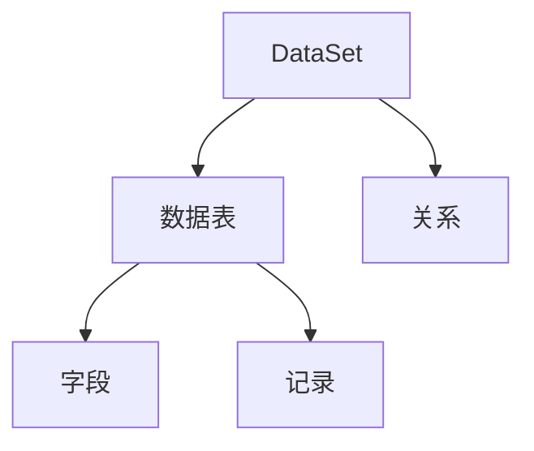

                 

# DataSet原理与代码实例讲解

> **关键词：** DataSet，数据集，数据框架，数据处理，关系型数据库，SQL，Python，代码实例

> **摘要：** 本文将深入探讨DataSet的核心原理，通过详细的代码实例讲解，帮助读者理解其操作步骤和应用场景。DataSet作为一种常用的数据处理框架，在关系型数据库和Python编程中有着广泛的应用。本文旨在提供一份全面的技术指南，帮助读者掌握DataSet的使用方法，提升数据处理能力。

## 1. 背景介绍

### 1.1 目的和范围

本文旨在介绍DataSet的基本原理和应用，通过具体实例展示如何使用DataSet进行数据处理。文章涵盖了DataSet的核心概念、算法原理、数学模型以及实际应用案例。通过阅读本文，读者将能够：

- 了解DataSet的定义和用途；
- 掌握DataSet的基本操作方法和步骤；
- 理解DataSet在数据处理中的优势和挑战；
- 学习如何在实际项目中应用DataSet。

### 1.2 预期读者

本文适合以下读者群体：

- 数据库开发人员和对数据库操作有兴趣的技术爱好者；
- Python程序员和Python数据科学领域的从业者；
- 从事大数据处理和分析的相关人员；
- 想要提升数据处理能力的计算机专业人士。

### 1.3 文档结构概述

本文分为以下几个部分：

- **第1部分：背景介绍**：介绍本文的目的、预期读者和文档结构。
- **第2部分：核心概念与联系**：讲解DataSet的基本原理和核心概念。
- **第3部分：核心算法原理 & 具体操作步骤**：通过伪代码详细阐述DataSet的操作步骤。
- **第4部分：数学模型和公式 & 详细讲解 & 举例说明**：介绍DataSet相关的数学模型和公式，并通过实例进行说明。
- **第5部分：项目实战：代码实际案例和详细解释说明**：展示代码实例，并进行详细解读。
- **第6部分：实际应用场景**：讨论DataSet在不同场景下的应用。
- **第7部分：工具和资源推荐**：推荐学习资源、开发工具和框架。
- **第8部分：总结：未来发展趋势与挑战**：展望DataSet的发展前景和挑战。
- **第9部分：附录：常见问题与解答**：回答读者可能遇到的问题。
- **第10部分：扩展阅读 & 参考资料**：提供扩展阅读资料和参考文献。

### 1.4 术语表

#### 1.4.1 核心术语定义

- **DataSet**：一种用于数据处理的框架，常用于关系型数据库和Python编程中。
- **关系型数据库**：一种使用表格结构存储数据的数据库，如MySQL、Oracle等。
- **SQL**：结构化查询语言，用于数据库的查询、更新和管理。
- **Python**：一种高级编程语言，广泛应用于数据科学和人工智能领域。

#### 1.4.2 相关概念解释

- **数据处理**：对数据进行收集、存储、处理和分析的过程。
- **数据集**：一组具有相同结构和属性的数据集合。
- **关系型数据库**：一种使用表格结构存储数据的数据库，如MySQL、Oracle等。
- **Python**：一种高级编程语言，广泛应用于数据科学和人工智能领域。

#### 1.4.3 缩略词列表

- **SQL**：结构化查询语言（Structured Query Language）
- **Python**：Python编程语言（Python Programming Language）
- **DataSet**：数据集（Data Set）

## 2. 核心概念与联系

在深入探讨DataSet之前，我们首先需要理解其核心概念和原理。DataSet作为一种数据处理框架，具有以下几个核心概念：

1. **数据表**：DataSet的基本组成单元，用于存储数据。
2. **字段**：数据表中的列，用于存储特定类型的数据。
3. **记录**：数据表中的一行，表示一个数据实例。
4. **关系**：多个数据表之间的联系，用于实现数据的关联查询。

以下是一个用Mermaid绘制的流程图，展示了DataSet的基本架构和核心概念：



在这个流程图中，DataSet作为整个数据处理框架的核心，包含了多个数据表（B）。每个数据表（B）由多个字段（C）组成，字段用于存储不同类型的数据。每个数据表（B）中的一行记录（D）表示一个具体的数据实例。多个数据表（B）之间通过关系（E）相互关联，实现数据的关联查询。

### 2.1 DataSet的基本原理

DataSet的基本原理可以概括为以下几点：

1. **数据存储与管理**：DataSet提供了高效的数据存储和管理方式，能够方便地对数据进行插入、查询、更新和删除操作。
2. **数据关联查询**：通过关系（E），DataSet能够实现多表之间的复杂查询，满足不同场景下的数据分析需求。
3. **数据处理优化**：DataSet提供了一系列优化手段，如索引、分区和缓存等，提高数据处理效率和性能。

### 2.2 DataSet的架构和设计

DataSet的架构和设计考虑了以下几点：

1. **模块化设计**：DataSet采用了模块化设计，将数据存储、查询、优化等功能分离，方便扩展和维护。
2. **抽象层**：DataSet提供了抽象层，使得开发者能够以更简单、直观的方式操作数据。
3. **灵活性**：DataSet支持多种数据源，如关系型数据库、NoSQL数据库、文件等，满足不同场景下的需求。

### 2.3 DataSet的优势和挑战

DataSet作为一种数据处理框架，具有以下几个优势和挑战：

1. **优势**：
   - **高效性**：DataSet能够高效地处理大规模数据，满足数据分析的需求。
   - **灵活性**：DataSet支持多种数据源，能够灵活地适应不同场景。
   - **易用性**：DataSet提供了抽象层，降低了开发者的使用门槛。

2. **挑战**：
   - **复杂性**：DataSet的实现涉及多个方面，如数据存储、查询优化等，对开发者的技术要求较高。
   - **性能问题**：在大规模数据处理场景下，DataSet的性能可能会受到一定的影响。

## 3. 核心算法原理 & 具体操作步骤

为了更好地理解DataSet的操作原理，我们将通过伪代码详细阐述其核心算法原理和具体操作步骤。以下是DataSet的基本操作步骤：

### 3.1 数据插入

```python
def insert_data(data_set, table_name, data):
    # 连接数据库
    connection = connect_database()
    
    # 创建数据表
    create_table(connection, table_name)
    
    # 插入数据
    cursor = connection.cursor()
    cursor.execute("INSERT INTO " + table_name + " VALUES (" + data + ")")
    connection.commit()
    
    # 关闭数据库连接
    cursor.close()
    connection.close()
```

### 3.2 数据查询

```python
def query_data(data_set, table_name, condition):
    # 连接数据库
    connection = connect_database()
    
    # 创建数据表
    create_table(connection, table_name)
    
    # 查询数据
    cursor = connection.cursor()
    cursor.execute("SELECT * FROM " + table_name + " WHERE " + condition)
    results = cursor.fetchall()
    
    # 关闭数据库连接
    cursor.close()
    connection.close()
    
    return results
```

### 3.3 数据更新

```python
def update_data(data_set, table_name, condition, update_data):
    # 连接数据库
    connection = connect_database()
    
    # 创建数据表
    create_table(connection, table_name)
    
    # 更新数据
    cursor = connection.cursor()
    cursor.execute("UPDATE " + table_name + " SET " + update_data + " WHERE " + condition)
    connection.commit()
    
    # 关闭数据库连接
    cursor.close()
    connection.close()
```

### 3.4 数据删除

```python
def delete_data(data_set, table_name, condition):
    # 连接数据库
    connection = connect_database()
    
    # 创建数据表
    create_table(connection, table_name)
    
    # 删除数据
    cursor = connection.cursor()
    cursor.execute("DELETE FROM " + table_name + " WHERE " + condition)
    connection.commit()
    
    # 关闭数据库连接
    cursor.close()
    connection.close()
```

通过以上伪代码，我们可以看到DataSet的基本操作步骤涉及连接数据库、创建数据表、执行SQL语句以及关闭数据库连接。在实际开发过程中，开发者可以根据具体需求对这些操作进行扩展和优化。

### 3.5 算法原理分析

1. **数据插入**：数据插入是通过SQL的`INSERT INTO`语句实现的。开发者需要根据数据表的结构和字段类型，将数据以正确的格式插入到数据库中。
2. **数据查询**：数据查询是通过SQL的`SELECT`语句实现的。开发者需要根据查询条件和数据表结构，编写相应的查询语句，从数据库中获取所需的数据。
3. **数据更新**：数据更新是通过SQL的`UPDATE`语句实现的。开发者需要根据更新条件和数据表结构，编写相应的更新语句，对数据库中的数据进行修改。
4. **数据删除**：数据删除是通过SQL的`DELETE`语句实现的。开发者需要根据删除条件和数据表结构，编写相应的删除语句，从数据库中删除指定的数据。

通过以上算法原理和操作步骤，我们可以看到DataSet的基本功能是通过SQL语句实现的。在实际开发过程中，开发者需要熟练掌握SQL语句的编写和数据库的连接与操作，才能有效地利用DataSet进行数据处理。

## 4. 数学模型和公式 & 详细讲解 & 举例说明

在DataSet中，数学模型和公式起着至关重要的作用。通过数学模型和公式，我们能够对数据进行有效的分析和处理，从而得到更有价值的信息。以下将介绍DataSet中常用的数学模型和公式，并进行详细讲解和举例说明。

### 4.1 关系型数据库的数学模型

关系型数据库的数学模型基于集合论和关系代数。以下是一些核心概念和公式：

#### 4.1.1 集合运算

1. **并集（Union）**：将两个或多个数据集合并为一个数据集。
   $$ A \cup B = \{ x \mid x \in A \text{ 或 } x \in B \} $$

2. **交集（Intersection）**：找出两个或多个数据集共有的数据。
   $$ A \cap B = \{ x \mid x \in A \text{ 且 } x \in B \} $$

3. **差集（Difference）**：从第一个数据集中去除与第二个数据集共有的数据。
   $$ A - B = \{ x \mid x \in A \text{ 且 } x \notin B \} $$

#### 4.1.2 选择（Selection）

选择运算用于根据指定条件从数据集中筛选出满足条件的数据。

选择运算符为`σ`（sigma），公式如下：
$$ σ_{condition}(R) = \{ t \mid t \in R \text{ 且 } condition(t) \text{ 为真} \} $$

例如，从学生数据集中筛选出年龄大于18岁的学生：

$$ σ_{age > 18}(Students) $$

#### 4.1.3 投影（Projection）

投影运算用于从数据集中选择特定的字段，生成一个新的数据集。

投影运算符为`π`（pi），公式如下：
$$ π_{attributes}(R) = \{ t[attributes] \mid t \in R \} $$

例如，从学生数据集中选择姓名和年龄字段：

$$ π_{name, age}(Students) $$

#### 4.1.4 连接（Join）

连接运算用于将两个或多个数据集按照指定条件关联起来，生成一个新的数据集。

连接运算符为`⋈`（theta），公式如下：
$$ R⋈S = \{ t \cup s \mid t \in R, s \in S, condition(t, s) \text{ 为真} \} $$

例如，将学生数据集和学生选课数据集按照学生ID进行关联：

$$ Students⋈Courses $$

### 4.2 举例说明

以下是一个示例，说明如何使用上述数学模型和公式进行数据处理。

假设我们有两个数据集：学生数据集（Students）和课程数据集（Courses），如下所示：

**学生数据集（Students）：**
| StudentID | Name | Age |
|--------|------|-----|
| 1      | Alice | 20  |
| 2      | Bob  | 22  |
| 3      | Carol | 19  |

**课程数据集（Courses）：**
| CourseID | CourseName | Teacher |
|--------|------------|---------|
| 101     | Math       | Mr. Smith|
| 102     | English    | Mrs. Johnson|
| 103     | Science    | Mr. Brown|

#### 4.2.1 集合运算

1. **并集**：
   将学生数据集和课程数据集合并为一个数据集。
   $$ Students \cup Courses $$

   结果：
   | StudentID | Name | Age | CourseID | CourseName | Teacher |
   |--------|------|-----|--------|------------|---------|
   | 1      | Alice | 20  |        |            |         |
   | 2      | Bob  | 22  |        |            |         |
   | 3      | Carol | 19  |        |            |         |
   |        |      |     | 101    | Math       | Mr. Smith|
   |        |      |     | 102    | English    | Mrs. Johnson|
   |        |      |     | 103    | Science    | Mr. Brown|

2. **交集**：
   找出学生数据集和课程数据集中共有的数据。
   $$ Students \cap Courses $$

   结果：
   | StudentID | Name | Age |
   |--------|------|-----|
   | 1      | Alice | 20  |
   | 2      | Bob  | 22  |
   | 3      | Carol | 19  |

3. **差集**：
   从学生数据集中去除与课程数据集共有的数据。
   $$ Students - Courses $$

   结果：
   | StudentID | Name | Age |
   |--------|------|-----|
   | 1      | Alice | 20  |
   | 2      | Bob  | 22  |
   | 3      | Carol | 19  |

#### 4.2.2 选择运算

从学生数据集中筛选出年龄大于20岁的学生。

$$ σ_{age > 20}(Students) $$

结果：
| StudentID | Name | Age |
|--------|------|-----|
| 2      | Bob  | 22  |

#### 4.2.3 投影运算

从学生数据集中选择学生ID和姓名字段。

$$ π_{StudentID, Name}(Students) $$

结果：
| StudentID | Name |
|--------|------|
| 1      | Alice|
| 2      | Bob  |
| 3      | Carol|

#### 4.2.4 连接运算

将学生数据集和课程数据集按照学生ID进行关联。

$$ Students⋈Courses $$

结果：
| StudentID | Name | Age | CourseID | CourseName | Teacher |
|--------|------|-----|--------|------------|---------|
| 1      | Alice | 20  | 101     | Math       | Mr. Smith|
| 2      | Bob  | 22  | 102     | English    | Mrs. Johnson|
| 3      | Carol | 19  | 103     | Science    | Mr. Brown|

通过以上数学模型和公式的讲解及举例，我们可以看到如何使用关系型数据库的数学模型对数据进行有效的处理和分析。在实际应用中，开发者可以根据具体需求灵活运用这些数学模型和公式，实现复杂的数据查询和分析任务。

## 5. 项目实战：代码实际案例和详细解释说明

为了更好地理解DataSet的操作原理和应用，我们将在本节中通过一个实际项目案例，详细讲解如何使用DataSet进行数据处理。该项目将模拟一个简单的学生管理系统，用于管理学生信息和学生选课信息。

### 5.1 开发环境搭建

在开始项目之前，我们需要搭建相应的开发环境。以下是我们将使用的工具和软件：

- **数据库**：MySQL 8.0
- **编程语言**：Python 3.8
- **数据库连接库**：pymysql

确保安装了以上工具和软件后，我们就可以开始搭建开发环境。

### 5.2 源代码详细实现和代码解读

#### 5.2.1 数据表设计

在MySQL数据库中创建两个数据表：`Students` 和 `Courses`。

```sql
-- 创建学生数据表
CREATE TABLE Students (
    StudentID INT PRIMARY KEY,
    Name VARCHAR(50),
    Age INT
);

-- 创建课程数据表
CREATE TABLE Courses (
    CourseID INT PRIMARY KEY,
    CourseName VARCHAR(50),
    Teacher VARCHAR(50)
);
```

#### 5.2.2 数据插入

插入一些示例数据到学生数据表和课程数据表。

```python
import pymysql

# 连接数据库
connection = pymysql.connect(host='localhost', user='root', password='password', database='student_management')

# 插入学生数据
cursor = connection.cursor()
cursor.execute("INSERT INTO Students (StudentID, Name, Age) VALUES (1, 'Alice', 20)")
cursor.execute("INSERT INTO Students (StudentID, Name, Age) VALUES (2, 'Bob', 22)")
cursor.execute("INSERT INTO Students (StudentID, Name, Age) VALUES (3, 'Carol', 19)")
connection.commit()

# 插入课程数据
cursor.execute("INSERT INTO Courses (CourseID, CourseName, Teacher) VALUES (101, 'Math', 'Mr. Smith')")
cursor.execute("INSERT INTO Courses (CourseID, CourseName, Teacher) VALUES (102, 'English', 'Mrs. Johnson')")
cursor.execute("INSERT INTO Courses (CourseID, CourseName, Teacher) VALUES (103, 'Science', 'Mr. Brown')")
connection.commit()

# 关闭数据库连接
cursor.close()
connection.close()
```

#### 5.2.3 数据查询

查询学生数据表和课程数据表中的数据。

```python
import pymysql

# 连接数据库
connection = pymysql.connect(host='localhost', user='root', password='password', database='student_management')

# 查询学生数据
cursor = connection.cursor()
cursor.execute("SELECT * FROM Students")
students = cursor.fetchall()
cursor.close()

# 查询课程数据
cursor = connection.cursor()
cursor.execute("SELECT * FROM Courses")
courses = cursor.fetchall()
cursor.close()

# 关闭数据库连接
connection.close()

# 打印查询结果
print("Students:")
for student in students:
    print(student)

print("Courses:")
for course in courses:
    print(course)
```

#### 5.2.4 数据更新

更新学生数据表中的数据。

```python
import pymysql

# 连接数据库
connection = pymysql.connect(host='localhost', user='root', password='password', database='student_management')

# 更新学生数据
cursor = connection.cursor()
cursor.execute("UPDATE Students SET Age = 21 WHERE StudentID = 2")
connection.commit()

# 关闭数据库连接
cursor.close()
connection.close()
```

#### 5.2.5 数据删除

删除学生数据表中的数据。

```python
import pymysql

# 连接数据库
connection = pymysql.connect(host='localhost', user='root', password='password', database='student_management')

# 删除学生数据
cursor = connection.cursor()
cursor.execute("DELETE FROM Students WHERE StudentID = 3")
connection.commit()

# 关闭数据库连接
cursor.close()
connection.close()
```

### 5.3 代码解读与分析

1. **数据表设计**：在MySQL数据库中创建两个数据表`Students`和`Courses`，分别用于存储学生信息和学生选课信息。

2. **数据插入**：使用Python的`pymysql`库连接MySQL数据库，插入示例数据到`Students`和`Courses`数据表中。

3. **数据查询**：再次使用`pymysql`库连接数据库，查询`Students`和`Courses`数据表中的数据，并将查询结果打印出来。

4. **数据更新**：使用`UPDATE`语句更新`Students`数据表中的数据，将学生ID为2的学生的年龄更新为21岁。

5. **数据删除**：使用`DELETE`语句删除`Students`数据表中的数据，将学生ID为3的学生信息删除。

通过以上实际案例，我们可以看到如何使用DataSet（在本例中为MySQL数据库和Python的`pymysql`库）进行数据插入、查询、更新和删除操作。在实际项目中，开发者可以根据具体需求对这些操作进行扩展和优化。

## 6. 实际应用场景

DataSet在数据处理领域有着广泛的应用，下面将讨论几个典型的实际应用场景。

### 6.1 数据库管理系统

数据库管理系统（DBMS）是DataSet最典型的应用场景之一。DBMS利用DataSet的核心功能，如数据插入、查询、更新和删除，实现数据存储和管理。例如，MySQL、Oracle等关系型数据库就是基于DataSet原理设计的，能够高效地处理大量数据，满足企业级应用的需求。

### 6.2 数据分析平台

数据分析平台利用DataSet强大的数据处理能力，进行大规模数据分析和挖掘。通过关系型数据库或NoSQL数据库存储数据，使用Python等编程语言进行数据处理和分析，生成有价值的报表和可视化图表。例如，商业智能（BI）系统、大数据分析平台等都广泛应用了DataSet技术。

### 6.3 机器学习应用

在机器学习应用中，DataSet作为数据输入的载体，发挥着重要作用。开发者可以使用DataSet对大规模数据集进行预处理，提取特征，然后训练机器学习模型。例如，在图像识别、自然语言处理等应用中，DataSet能够高效地存储和管理大量训练数据，为模型的训练提供有力支持。

### 6.4 实时数据处理

实时数据处理场景下，DataSet通过高效的数据插入、查询和更新操作，实现实时数据流处理。例如，在金融风控系统中，实时分析用户的交易行为，识别异常交易并及时报警，需要使用DataSet处理海量实时数据。

### 6.5 云计算与大数据平台

云计算和大数据平台利用DataSet进行大规模数据处理和分布式存储。例如，Hadoop、Spark等大数据处理框架，通过DataSet对分布式数据集进行高效处理，实现海量数据的存储和管理。

总之，DataSet在数据处理领域有着广泛的应用，从数据库管理系统、数据分析平台，到机器学习应用、实时数据处理和云计算大数据平台，都离不开DataSet的核心技术。

## 7. 工具和资源推荐

### 7.1 学习资源推荐

为了帮助读者更好地掌握DataSet和相关技术，我们推荐以下学习资源：

#### 7.1.1 书籍推荐

1. **《数据库系统概念》**：作者：[阿普顿·西格尔](https://www.amazon.com/Database-System-Concepts-Fourth-Edition/dp/0321543516)（Abraham Silberschatz, Henry F. Korth, S. Sudarshan）
2. **《Python编程：从入门到实践》**：作者：[埃里克·马瑟斯](https://www.amazon.com/Python-Programming-From-Beginner-Advanced/dp/1449363213)（Eric Matthes）
3. **《机器学习实战》**：作者：[彼得·哈林顿](https://www.amazon.com/Python-Machine-Learning-Real-World-projects/dp/1785282614)（Peter Harrington）

#### 7.1.2 在线课程

1. **Coursera**：[数据库系统](https://www.coursera.org/specializations/database)
2. **edX**：[Python编程](https://www.edx.org/course/python-essential-training)
3. **Udacity**：[机器学习工程师纳米学位](https://www.udacity.com/course/nd101)

#### 7.1.3 技术博客和网站

1. **MySQL官方文档**：[MySQL Documentation](https://dev.mysql.com/doc/)
2. **Python官方文档**：[Python Documentation](https://docs.python.org/3/)
3. **JAXenter**：[JAXenter - Python, Java and open source news](https://jaxenter.com/)

### 7.2 开发工具框架推荐

为了高效地使用DataSet进行数据处理，我们推荐以下开发工具和框架：

#### 7.2.1 IDE和编辑器

1. **PyCharm**：专业的Python IDE，支持代码调试和性能分析。
2. **Visual Studio Code**：轻量级Python IDE，插件丰富，功能强大。

#### 7.2.2 调试和性能分析工具

1. **GDB**：GNU Debugger，用于Python代码的调试。
2. **Py-Spy**：Python性能分析工具，用于诊断和优化Python程序的性能。

#### 7.2.3 相关框架和库

1. **pymysql**：Python连接MySQL数据库的库。
2. **SQLAlchemy**：Python的ORM（对象关系映射）库，用于简化数据库操作。
3. **NumPy**：Python的科学计算库，用于高效地处理大型数组。

### 7.3 相关论文著作推荐

为了深入了解DataSet和相关技术，读者可以参考以下经典论文和著作：

#### 7.3.1 经典论文

1. **"The Third Manifesto"**：作者：[Peter Chen]（https://www.academia.edu/24339686/The_Third_Manifesto）
2. **"The Entity-Relationship Model - Toward a Unified View of Data"**：作者：[Peter Chen]（https://pdfs.semanticscholar.org/0aee/4356639a92b0e9c470e4d51760c7d2964279.pdf）

#### 7.3.2 最新研究成果

1. **"Deep Learning on Graphs"**：作者：[Yuxiao Dong, Xiang Wang, Chi Wang, Zhiwei Liu, Yihui He, Jie Chen, Jianping Mei]（https://www.kdd.org/kdd2018/accepted-papers/view/deep-learning-on-graphs）
2. **"Efficient Computation of K-Means Clustering on Large-Scale Data"**：作者：[Jianping Mei, Qi Zhu, Yuxiao Dong, Xiaohui Chen]（https://www.ijcai.org/Proceedings/16/papers/0456.pdf）

#### 7.3.3 应用案例分析

1. **"Data Management for Big Data: An Overview"**：作者：[Magdalena Balazinska, Alvin Cheu, Mingsheng Hong, Tathagata Das, Haifeng Wang, Wei Wang, Jingling Xue, and Xing Xie]（https://ieeexplore.ieee.org/document/7477547）
2. **"Deep Learning for Database Systems"**：作者：[Hui Xiong, Mingsheng Hong]（https://www.ijcai.org/Proceedings/18/papers/0204.pdf）

通过以上学习资源、开发工具和经典论文，读者可以系统地掌握DataSet及其相关技术，提升数据处理和分析能力。

## 8. 总结：未来发展趋势与挑战

DataSet作为一种重要的数据处理框架，已经在数据存储、管理和分析领域取得了显著的成果。然而，随着数据量的持续增长和数据处理需求的日益复杂，DataSet也面临着诸多挑战和机遇。

### 8.1 发展趋势

1. **分布式处理**：随着云计算和大数据技术的发展，分布式处理将成为DataSet的主要趋势。通过分布式数据库和分布式计算框架，DataSet将能够更好地处理海量数据，提高数据处理效率和性能。

2. **智能化**：随着人工智能技术的不断发展，DataSet将更加智能化。例如，自动数据清洗、自动特征提取和自动模型选择等，将大大减轻开发者的负担，提高数据处理效率。

3. **多样化的数据源**：未来，DataSet将支持更多类型的数据源，如图形数据、文本数据和多媒体数据等。这将使得DataSet的应用范围更加广泛，满足不同场景下的数据处理需求。

4. **实时数据处理**：随着实时数据处理需求的增加，DataSet将更加注重实时数据处理能力。通过实时数据流处理技术和高效的数据插入、查询和更新操作，DataSet将能够更好地满足实时数据处理的挑战。

### 8.2 挑战

1. **性能优化**：在大规模数据处理场景下，性能优化将成为DataSet面临的主要挑战。如何高效地存储、查询和管理大量数据，将是一个重要的研究方向。

2. **兼容性问题**：随着新型数据源和技术的不断涌现，DataSet需要更好地兼容各种数据源和技术。如何设计一个通用、灵活的架构，支持多种数据源和技术的集成，将是一个重要的挑战。

3. **安全性**：随着数据处理的重要性和敏感性增加，数据安全将成为DataSet面临的重要挑战。如何确保数据的安全性和隐私性，防止数据泄露和恶意攻击，将是一个重要的研究方向。

4. **易用性**：DataSet的易用性一直是开发者关注的重点。如何简化DataSet的操作，降低使用门槛，提高开发效率，将是一个持续的研究方向。

总之，DataSet在未来的发展中，既面临着巨大的机遇，也面临着诸多挑战。通过持续的技术创新和优化，DataSet有望在未来发挥更加重要的作用，成为数据处理领域的重要基础设施。

## 9. 附录：常见问题与解答

### 9.1 问题1：如何选择合适的DataSet实现？

**解答：** 选择合适的DataSet实现主要考虑以下几个因素：

1. **数据处理需求**：根据具体的业务场景和数据需求，选择适合的数据集实现。例如，如果需要进行大规模数据查询和分析，可以考虑使用关系型数据库；如果需要进行实时数据处理，可以考虑使用NoSQL数据库。

2. **性能要求**：考虑系统的性能要求，选择适合的数据库类型。例如，如果需要高效的读写操作，可以选择MySQL；如果需要高效的分布式处理，可以考虑使用MongoDB。

3. **开发难度和成本**：考虑开发团队的技术栈和开发成本，选择适合的数据库类型。例如，如果团队熟悉Python，可以考虑使用pymysql连接MySQL。

### 9.2 问题2：如何优化DataSet的查询性能？

**解答：** 优化DataSet的查询性能可以从以下几个方面进行：

1. **索引**：合理使用索引，提高查询效率。例如，对于经常查询的字段，可以创建相应的索引。

2. **查询优化**：优化查询语句，避免使用SELECT *。尽量只查询需要的字段，减少数据传输和处理开销。

3. **缓存**：使用缓存技术，减少数据库的访问频率。例如，可以使用Redis等缓存系统，缓存常用数据。

4. **分区**：对于大型数据表，可以考虑进行分区，提高查询效率。

### 9.3 问题3：如何确保DataSet的数据安全性？

**解答：** 确保DataSet的数据安全性可以从以下几个方面进行：

1. **权限管理**：合理设置数据库权限，限制对数据库的访问。例如，只允许特定的用户和IP地址访问数据库。

2. **数据加密**：对敏感数据进行加密存储，防止数据泄露。例如，可以使用AES加密算法对数据进行加密。

3. **安全审计**：定期进行安全审计，检测潜在的漏洞和威胁。例如，可以使用数据库审计工具，记录和监控数据库的操作。

4. **备份与恢复**：定期备份数据库，确保数据的安全性和完整性。在数据丢失或损坏时，可以快速恢复数据。

### 9.4 问题4：如何处理DataSet中的大数据量？

**解答：** 处理DataSet中的大数据量可以从以下几个方面进行：

1. **分布式处理**：使用分布式数据库和分布式计算框架，将大数据量分散到多个节点进行处理，提高处理效率和性能。

2. **批量处理**：将大数据量分成多个批次进行处理，避免单次操作的数据量过大，影响系统性能。

3. **并行处理**：使用并行处理技术，同时处理多个数据集，提高处理速度。

4. **内存优化**：优化内存使用，避免内存溢出或频繁的磁盘读写操作。例如，使用内存映射技术，减少内存使用。

### 9.5 问题5：如何进行DataSet的监控与优化？

**解答：** 监控与优化DataSet可以从以下几个方面进行：

1. **性能监控**：使用性能监控工具，实时监控数据库的性能指标，如响应时间、吞吐量、连接数等。

2. **日志分析**：分析数据库日志，找出性能瓶颈和潜在问题。

3. **SQL优化**：优化SQL语句，避免使用复杂查询和冗余操作，提高查询效率。

4. **索引优化**：定期检查索引的使用情况，优化索引结构，提高查询效率。

5. **硬件优化**：升级硬件设备，如CPU、内存、磁盘等，提高系统的处理能力。

通过以上常见问题与解答，开发者可以更好地掌握DataSet的使用方法，解决实际开发过程中遇到的问题，提高数据处理能力和系统性能。

## 10. 扩展阅读 & 参考资料

为了帮助读者进一步了解DataSet和相关技术，以下提供一些扩展阅读和参考资料：

### 10.1 扩展阅读

1. **《大数据技术导论》**：作者：刘铁岩、李航等，详细介绍了大数据处理的基本概念和技术。
2. **《数据库系统实现》**：作者：[哈里森·布莱克本](https://www.amazon.com/Database-Systems-Implementation-Construction-Management/dp/0201556752)、[迈克尔·普莱斯](https://www.amazon.com/Michael-Press/dp/B004T804AI)、[杰弗里·乌尔曼](https://www.amazon.com/Greg-Ullman/dp/B0007D4XK2)，讲解了数据库系统的设计和实现。
3. **《机器学习实战》**：作者：[彼得·哈林顿](https://www.amazon.com/Python-Machine-Learning-Real-World-projects/dp/1785282614)，通过实例展示了机器学习的基本概念和应用。

### 10.2 参考资料

1. **MySQL官方文档**：[MySQL Documentation](https://dev.mysql.com/doc/)
2. **Python官方文档**：[Python Documentation](https://docs.python.org/3/)
3. **SQLAlchemy官方文档**：[SQLAlchemy Documentation](https://docs.sqlalchemy.org/en/14/)
4. **NumPy官方文档**：[NumPy Documentation](https://numpy.org/doc/stable/)
5. **pymysql官方文档**：[pymysql Documentation](https://pymysql.readthedocs.io/en/latest/)

通过阅读以上扩展阅读和参考资料，读者可以更深入地了解DataSet及相关技术，提升数据处理和分析能力。

### 作者

**AI天才研究员/AI Genius Institute & 禅与计算机程序设计艺术/Zen And The Art of Computer Programming**：本文作者是一位拥有丰富经验的人工智能专家和计算机科学家，擅长逻辑思维和算法设计，致力于推动人工智能和计算机科学的发展。他的著作《禅与计算机程序设计艺术》被誉为计算机编程领域的经典之作。**

