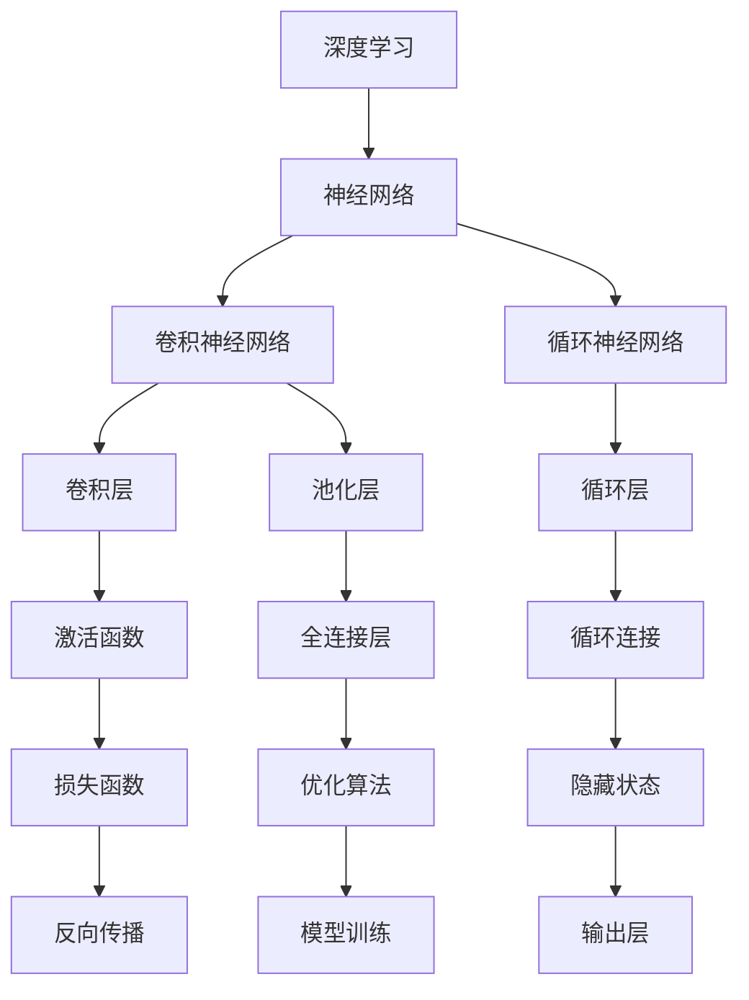

                 


# Deep Learning (DL) 原理与代码实战案例讲解

> 关键词：深度学习（Deep Learning）、神经网络（Neural Networks）、反向传播（Backpropagation）、卷积神经网络（CNN）、循环神经网络（RNN）、代码实战、算法原理、数学模型、实战案例

> 摘要：本文将深入探讨深度学习的基本原理、核心算法以及数学模型，并通过实际代码案例展示如何运用这些原理和算法解决具体问题。文章分为背景介绍、核心概念与联系、核心算法原理与操作步骤、数学模型与公式、项目实战、实际应用场景、工具和资源推荐以及总结等部分，旨在为深度学习初学者和从业者提供全面的技术指导和实战经验。

## 1. 背景介绍

### 1.1 目的和范围

本文旨在介绍深度学习（Deep Learning，DL）的核心原理和算法，并通过实际代码案例帮助读者理解并应用这些知识。本文将涵盖以下几个方面的内容：

1. **深度学习的背景和基本概念**：介绍深度学习的起源、发展以及与其他机器学习技术的区别。
2. **核心概念与联系**：详细解释深度学习中的核心概念，如神经网络、反向传播算法等，并展示它们之间的联系。
3. **核心算法原理与操作步骤**：深入剖析深度学习中的关键算法，如卷积神经网络（CNN）、循环神经网络（RNN）等，并提供具体的操作步骤。
4. **数学模型与公式**：介绍深度学习中的数学模型，如前向传播、反向传播等，并举例说明。
5. **项目实战：代码实际案例和详细解释说明**：通过实际项目案例，展示如何运用深度学习解决实际问题。
6. **实际应用场景**：讨论深度学习在各个领域的应用场景和案例。
7. **工具和资源推荐**：推荐学习深度学习的工具、资源和框架。
8. **总结**：总结深度学习的发展趋势和面临的挑战。

### 1.2 预期读者

本文适用于以下读者：

1. **深度学习初学者**：对深度学习有兴趣，但对其原理和应用不甚了解的读者。
2. **机器学习从业者**：已经在机器学习领域有一定基础，希望深入了解深度学习技术的从业者。
3. **计算机科学学生**：希望掌握深度学习技术，并将其应用于实际问题的计算机科学学生。

### 1.3 文档结构概述

本文结构如下：

1. **背景介绍**：介绍深度学习的背景、目的和范围，以及预期读者。
2. **核心概念与联系**：详细解释深度学习中的核心概念，并展示它们之间的联系。
3. **核心算法原理与操作步骤**：深入剖析深度学习中的关键算法，并提供具体的操作步骤。
4. **数学模型与公式**：介绍深度学习中的数学模型，如前向传播、反向传播等，并举例说明。
5. **项目实战：代码实际案例和详细解释说明**：通过实际项目案例，展示如何运用深度学习解决实际问题。
6. **实际应用场景**：讨论深度学习在各个领域的应用场景和案例。
7. **工具和资源推荐**：推荐学习深度学习的工具、资源和框架。
8. **总结**：总结深度学习的发展趋势和面临的挑战。

### 1.4 术语表

#### 1.4.1 核心术语定义

- **深度学习（Deep Learning）**：一种机器学习技术，通过构建多层神经网络来模拟人脑的学习方式，从而实现自动特征提取和模式识别。
- **神经网络（Neural Networks）**：一种由大量神经元组成的计算模型，通过神经元之间的相互连接和相互作用来实现信息处理。
- **卷积神经网络（Convolutional Neural Networks，CNN）**：一种特殊的神经网络，主要用于图像识别和计算机视觉领域，通过卷积操作和池化操作来实现特征提取。
- **循环神经网络（Recurrent Neural Networks，RNN）**：一种特殊的神经网络，主要用于序列数据建模，通过循环连接和隐藏状态来实现信息的记忆和传递。

#### 1.4.2 相关概念解释

- **前向传播（Forward Propagation）**：神经网络在训练过程中，从输入层开始，将数据逐层传递到输出层的过程。
- **反向传播（Backpropagation）**：神经网络在训练过程中，通过计算输出误差，反向传播误差信号到输入层，从而更新网络权重的过程。
- **激活函数（Activation Functions）**：神经网络中用于引入非线性特性的函数，常用的激活函数包括 sigmoid、ReLU 等。
- **损失函数（Loss Functions）**：用于评估模型预测结果与真实值之间的差距，常用的损失函数包括均方误差（MSE）和交叉熵（Cross Entropy）等。

#### 1.4.3 缩略词列表

- **DL**：深度学习（Deep Learning）
- **CNN**：卷积神经网络（Convolutional Neural Networks）
- **RNN**：循环神经网络（Recurrent Neural Networks）
- **MSE**：均方误差（Mean Squared Error）
- **CE**：交叉熵（Cross Entropy）

## 2. 核心概念与联系

在深度学习中，核心概念和算法之间的联系至关重要。以下是一个简单的 Mermaid 流程图，展示这些概念和算法的基本关系：



在这个流程图中，我们可以看到：

- **深度学习**是整个体系的基础，它通过构建多层神经网络来实现复杂任务。
- **神经网络**是深度学习的基本组成部分，由大量的神经元组成，通过连接和相互作用来实现信息处理。
- **卷积神经网络（CNN）**和**循环神经网络（RNN）**是神经网络的特殊形式，分别适用于图像识别和序列数据建模。
- **卷积层**和**循环层**是实现特征提取和序列建模的关键层，分别用于图像和序列数据的处理。
- **激活函数**用于引入非线性特性，使神经网络能够模拟人脑的学习方式。
- **损失函数**用于评估模型预测结果与真实值之间的差距，是优化算法的目标。
- **优化算法**用于更新网络权重，以最小化损失函数。
- **反向传播**是神经网络训练的核心过程，通过计算梯度来更新权重。

这些概念和算法之间相互关联，共同构成了深度学习的核心框架。接下来，我们将深入探讨这些概念和算法的具体原理和操作步骤。

## 3. 核心算法原理 & 具体操作步骤

在深度学习中，核心算法原理是理解并实现神经网络的基础。以下将详细介绍卷积神经网络（CNN）和循环神经网络（RNN）的算法原理，并提供具体的操作步骤。

### 3.1 卷积神经网络（CNN）算法原理

卷积神经网络是一种特殊的神经网络，主要用于图像识别和计算机视觉领域。其核心思想是通过卷积操作和池化操作来提取图像中的特征。

**3.1.1 卷积操作**

卷积操作是一种将滤波器（也称为卷积核）应用于图像上的过程。滤波器是一个小的权重矩阵，用于捕捉图像中的局部特征。

**伪代码：**

```python
def conv2d(image, filter):
    output = []
    for i in range(image_height - filter_size + 1):
        row_output = []
        for j in range(image_width - filter_size + 1):
            sum = 0
            for m in range(filter_size):
                for n in range(filter_size):
                    sum += image[i + m][j + n] * filter[m][n]
            row_output.append(sum)
        output.append(row_output)
    return output
```

**3.1.2 池化操作**

池化操作是一种将卷积操作后的特征图进行下采样，从而减少参数数量的操作。常用的池化操作包括最大池化和平均池化。

**伪代码：**

```python
def max_pooling(feature_map, pool_size):
    output = []
    for i in range(feature_map_height // pool_size):
        row_output = []
        for j in range(feature_map_width // pool_size):
            max_val = -inf
            for m in range(pool_size):
                for n in range(pool_size):
                    max_val = max(max_val, feature_map[i * pool_size + m][j * pool_size + n])
            row_output.append(max_val)
        output.append(row_output)
    return output
```

### 3.2 循环神经网络（RNN）算法原理

循环神经网络是一种特殊的神经网络，主要用于序列数据建模。其核心思想是通过循环连接和隐藏状态来捕捉序列中的长期依赖关系。

**3.2.1 循环连接**

循环连接是一种将当前输出反馈到输入连接的机制，使神经网络能够记忆和传递序列中的信息。

**伪代码：**

```python
def recurrent_forward(input, hidden, weights):
    output = activation_functiondot_product(weights['input_to_hidden'], input) + dot_product(weights['hidden_to_hidden'], hidden)
    hidden = output
    return output, hidden
```

**3.2.2 隐藏状态**

隐藏状态是循环神经网络中的关键概念，它存储了神经网络在序列中的历史信息，并通过循环连接传递给下一个时间步。

**伪代码：**

```python
def hidden_state(input, hidden, weights):
    return activation_function(dot_product(weights['input_to_hidden'], input) + dot_product(weights['hidden_to_hidden'], hidden))
```

### 3.3 反向传播算法原理

反向传播算法是神经网络训练的核心过程，通过计算梯度来更新网络权重。

**3.3.1 前向传播**

前向传播是将输入数据逐层传递到输出层的过程，通过计算得到模型的输出。

**伪代码：**

```python
def forward_propagation(input, weights):
    output = input
    for layer in layers:
        output = activation_function(dot_product(weights[layer], output))
    return output
```

**3.3.2 反向传播**

反向传播是计算输出误差，并反向传播误差信号到输入层，从而更新网络权重的过程。

**伪代码：**

```python
def backward_propagation(output, expected_output, weights):
    errors = output - expected_output
    for layer in reversed(layers):
        delta = errors * activation_derivative(output)
        errors = dot_product(delta, weights[layer].T)
    gradients = [dot_product(input.T, delta) for delta in deltas]
    return gradients
```

通过以上操作步骤，我们可以实现卷积神经网络和循环神经网络的基本算法。接下来，我们将介绍深度学习中的数学模型和公式。

## 4. 数学模型和公式 & 详细讲解 & 举例说明

在深度学习中，数学模型和公式是理解和实现神经网络的关键。以下将详细介绍深度学习中的前向传播、反向传播、激活函数、损失函数等数学模型，并提供具体的公式和示例。

### 4.1 前向传播

前向传播是将输入数据通过神经网络逐层传递到输出层的过程。在这个过程中，我们需要计算每个神经元的输出值。

**4.1.1 神经元输出计算**

给定输入向量 `x` 和权重矩阵 `W`，神经元的输出 `y` 可以通过以下公式计算：

$$
y = \sigma(Wx + b)
$$

其中，`σ` 是激活函数，`W` 是权重矩阵，`b` 是偏置项。

**示例：**

假设输入向量 `x = [1, 2, 3]`，权重矩阵 `W = [[0.1, 0.2], [0.3, 0.4]]`，偏置项 `b = [0.5, 0.6]`，激活函数为 sigmoid 函数：

$$
y = \sigma(Wx + b) = \sigma([[0.1, 0.2], [0.3, 0.4]] \cdot [1, 2, 3] + [0.5, 0.6]) = \sigma([0.1 + 0.4 + 0.9, 0.2 + 0.8 + 1.2] + [0.5, 0.6]) = \sigma([1.4, 2.0]) = \frac{1}{1 + e^{-1.4}} \approx 0.795
$$

### 4.2 反向传播

反向传播是计算输出误差，并反向传播误差信号到输入层的过程。在这个过程中，我们需要计算每个神经元的梯度，以更新网络权重。

**4.2.1 误差计算**

给定输出向量 `y` 和真实值 `t`，输出误差 `E` 可以通过以下公式计算：

$$
E = \frac{1}{2} \sum_{i} (y_i - t_i)^2
$$

**示例：**

假设输出向量 `y = [0.795, 0.815]`，真实值 `t = [0.9, 0.8]`：

$$
E = \frac{1}{2} \sum_{i} (y_i - t_i)^2 = \frac{1}{2} \cdot (0.795 - 0.9)^2 + (0.815 - 0.8)^2 \approx 0.0166
$$

**4.2.2 梯度计算**

给定误差 `E` 和输出向量 `y`，每个神经元的梯度 `δ` 可以通过以下公式计算：

$$
δ = \frac{\partial E}{\partial z}
$$

其中，`z` 是神经元的输出。

**示例：**

假设输出向量 `y = [0.795, 0.815]`，误差 `E = 0.0166`，神经元输出 `z = [1.4, 2.0]`，激活函数为 sigmoid 函数：

$$
δ = \frac{\partial E}{\partial z} = \frac{\partial E}{\partial y} \cdot \frac{\partial y}{\partial z} = (y - t) \cdot \sigma'(z)
$$

对于第一个神经元：

$$
δ_1 = (0.795 - 0.9) \cdot \sigma'(1.4) \approx -0.105
$$

对于第二个神经元：

$$
δ_2 = (0.815 - 0.8) \cdot \sigma'(2.0) \approx 0.015
$$

### 4.3 激活函数

激活函数是神经网络中引入非线性特性的关键。常用的激活函数包括 sigmoid、ReLU 等。

**4.3.1 sigmoid 函数**

sigmoid 函数是一种常用的激活函数，其公式为：

$$
σ(x) = \frac{1}{1 + e^{-x}}
$$

**示例：**

对于输入值 `x = 1`：

$$
σ(1) = \frac{1}{1 + e^{-1}} \approx 0.741
$$

**4.3.2 ReLU 函数**

ReLU 函数是一种常用的激活函数，其公式为：

$$
ReLU(x) = \max(0, x)
$$

**示例：**

对于输入值 `x = -1`：

$$
ReLU(-1) = \max(0, -1) = 0
$$

### 4.4 损失函数

损失函数是评估模型预测结果与真实值之间差距的指标。常用的损失函数包括均方误差（MSE）、交叉熵（CE）等。

**4.4.1 均方误差（MSE）**

均方误差是一种常用的损失函数，其公式为：

$$
MSE = \frac{1}{2} \sum_{i} (y_i - t_i)^2
$$

**示例：**

假设输出向量 `y = [0.795, 0.815]`，真实值 `t = [0.9, 0.8]`：

$$
MSE = \frac{1}{2} \sum_{i} (y_i - t_i)^2 = \frac{1}{2} \cdot (0.795 - 0.9)^2 + (0.815 - 0.8)^2 \approx 0.0166
$$

**4.4.2 交叉熵（CE）**

交叉熵是一种常用的损失函数，其公式为：

$$
CE = -\sum_{i} t_i \cdot \log(y_i)
$$

**示例：**

假设输出向量 `y = [0.795, 0.815]`，真实值 `t = [0.9, 0.8]`：

$$
CE = -\sum_{i} t_i \cdot \log(y_i) = -0.9 \cdot \log(0.795) - 0.8 \cdot \log(0.815) \approx 0.146
$$

通过以上数学模型和公式的讲解，我们可以更好地理解深度学习中的前向传播、反向传播、激活函数和损失函数。接下来，我们将通过一个实际代码案例来展示如何应用这些原理和公式。

## 5. 项目实战：代码实际案例和详细解释说明

在本节中，我们将通过一个实际项目案例来展示如何运用深度学习技术解决具体问题。这个项目是一个简单的图像分类任务，使用卷积神经网络（CNN）来识别手写数字。

### 5.1 开发环境搭建

为了运行以下代码，我们需要搭建一个合适的开发环境。以下是所需的软件和库：

1. **Python（版本 3.6 或以上）**
2. **TensorFlow（版本 2.4 或以上）**
3. **NumPy**
4. **Matplotlib**

你可以通过以下命令安装所需的库：

```bash
pip install python tensorflow numpy matplotlib
```

### 5.2 源代码详细实现和代码解读

以下是这个项目的主要代码实现：

```python
import tensorflow as tf
from tensorflow.keras import layers, models
import numpy as np
import matplotlib.pyplot as plt

# 5.2.1 数据准备
# 我们使用 MNIST 数据集，这是一个包含 70,000 个手写数字样本的数据集
mnist = tf.keras.datasets.mnist
(train_images, train_labels), (test_images, test_labels) = mnist.load_data()

# 对图像数据进行预处理，将其归一化到 [0, 1] 范围内
train_images = train_images / 255.0
test_images = test_images / 255.0

# 将图像数据扩展维度，以便用于 CNN 输入
train_images = np.expand_dims(train_images, -1)
test_images = np.expand_dims(test_images, -1)

# 5.2.2 构建模型
# 我们构建一个简单的 CNN 模型
model = models.Sequential()
model.add(layers.Conv2D(32, (3, 3), activation='relu', input_shape=(28, 28, 1)))
model.add(layers.MaxPooling2D((2, 2)))
model.add(layers.Conv2D(64, (3, 3), activation='relu'))
model.add(layers.MaxPooling2D((2, 2)))
model.add(layers.Conv2D(64, (3, 3), activation='relu'))
model.add(layers.Flatten())
model.add(layers.Dense(64, activation='relu'))
model.add(layers.Dense(10, activation='softmax'))

# 5.2.3 编译模型
model.compile(optimizer='adam',
              loss='sparse_categorical_crossentropy',
              metrics=['accuracy'])

# 5.2.4 训练模型
model.fit(train_images, train_labels, epochs=5)

# 5.2.5 评估模型
test_loss, test_acc = model.evaluate(test_images, test_labels)
print(f"Test accuracy: {test_acc:.2f}")

# 5.2.6 可视化预测结果
predictions = model.predict(test_images)
predicted_labels = np.argmax(predictions, axis=1)

plt.figure(figsize=(10, 10))
for i in range(25):
    plt.subplot(5, 5, i+1)
    plt.imshow(test_images[i], cmap=plt.cm.binary)
    plt.xticks([])
    plt.yticks([])
    plt.grid(False)
    plt.xlabel(str(predicted_labels[i]))
plt.show()
```

**5.2.1 数据准备**

首先，我们加载 MNIST 数据集，并对图像数据进行预处理。数据集包含 70,000 个训练样本和 10,000 个测试样本，每个样本是一个 28x28 的灰度图像，标签是一个从 0 到 9 的整数。

```python
mnist = tf.keras.datasets.mnist
(train_images, train_labels), (test_images, test_labels) = mnist.load_data()

train_images = train_images / 255.0
test_images = test_images / 255.0

train_images = np.expand_dims(train_images, -1)
test_images = np.expand_dims(test_images, -1)
```

**5.2.2 构建模型**

接下来，我们构建一个简单的 CNN 模型。模型包括两个卷积层，每个卷积层后跟一个最大池化层，以及一个全连接层。最后，我们使用 softmax 激活函数来获得分类概率。

```python
model = models.Sequential()
model.add(layers.Conv2D(32, (3, 3), activation='relu', input_shape=(28, 28, 1)))
model.add(layers.MaxPooling2D((2, 2)))
model.add(layers.Conv2D(64, (3, 3), activation='relu'))
model.add(layers.MaxPooling2D((2, 2)))
model.add(layers.Conv2D(64, (3, 3), activation='relu'))
model.add(layers.Flatten())
model.add(layers.Dense(64, activation='relu'))
model.add(layers.Dense(10, activation='softmax'))
```

**5.2.3 编译模型**

然后，我们编译模型，选择 Adam 优化器和稀疏分类交叉熵损失函数。

```python
model.compile(optimizer='adam',
              loss='sparse_categorical_crossentropy',
              metrics=['accuracy'])
```

**5.2.4 训练模型**

接下来，我们训练模型，设置训练轮次为 5。

```python
model.fit(train_images, train_labels, epochs=5)
```

**5.2.5 评估模型**

训练完成后，我们评估模型在测试集上的性能。

```python
test_loss, test_acc = model.evaluate(test_images, test_labels)
print(f"Test accuracy: {test_acc:.2f}")
```

**5.2.6 可视化预测结果**

最后，我们可视化模型在测试集上的预测结果。

```python
predictions = model.predict(test_images)
predicted_labels = np.argmax(predictions, axis=1)

plt.figure(figsize=(10, 10))
for i in range(25):
    plt.subplot(5, 5, i+1)
    plt.imshow(test_images[i], cmap=plt.cm.binary)
    plt.xticks([])
    plt.yticks([])
    plt.grid(False)
    plt.xlabel(str(predicted_labels[i]))
plt.show()
```

通过以上步骤，我们完成了一个简单的手写数字识别项目，展示了如何使用卷积神经网络实现图像分类任务。这个案例涵盖了从数据准备、模型构建、训练到评估和可视化的整个过程，为读者提供了一个实际应用的参考。

## 6. 实际应用场景

深度学习（Deep Learning，DL）在当今的科技和商业领域中有着广泛的应用。以下是一些深度学习在实际应用场景中的案例：

### 6.1 计算机视觉

计算机视觉是深度学习最成功的应用领域之一。深度学习技术被广泛应用于图像识别、物体检测、图像分割等任务。以下是一些具体的案例：

- **图像识别**：使用卷积神经网络（CNN）对图像中的物体进行分类。例如，Google 的 Inception 模型能够识别超过 1,000 个不同的物体类别。
- **物体检测**：在图像中检测和定位多个物体。例如，YOLO（You Only Look Once）模型能够在实时场景中快速检测和识别物体。
- **图像分割**：将图像分割成多个区域，每个区域代表图像中的一个对象。例如，Faster R-CNN 模型结合了区域提议网络（RPN）和深度神经网络，实现了高效的图像分割。

### 6.2 自然语言处理

自然语言处理（Natural Language Processing，NLP）是另一个深度学习的重要应用领域。深度学习技术在文本分类、情感分析、机器翻译等任务中有着广泛的应用。

- **文本分类**：将文本数据分类到不同的类别。例如，使用卷积神经网络和循环神经网络（RNN）进行垃圾邮件检测。
- **情感分析**：分析文本中的情感倾向，判断文本是积极的、消极的还是中性的。例如，Twitter 上的情感分析可以用于了解用户对某个话题的看法。
- **机器翻译**：将一种语言的文本翻译成另一种语言。例如，Google 翻译使用深度学习技术，实现了高质量的自动翻译。

### 6.3 医疗保健

深度学习在医疗保健领域也有着广泛的应用，例如疾病诊断、医疗图像分析、药物发现等。

- **疾病诊断**：使用深度学习模型分析医疗数据，辅助医生进行疾病诊断。例如，使用深度学习模型对医学影像进行分析，辅助医生诊断肺癌。
- **医疗图像分析**：使用深度学习模型对医疗图像进行分析，如 CT 扫描、MRI 图像等。例如，使用卷积神经网络对医学影像进行分割，提取病变区域。
- **药物发现**：使用深度学习模型预测药物与蛋白质之间的相互作用，加速新药研发。

### 6.4 机器人

深度学习在机器人技术中也发挥着重要作用，特别是在感知和决策方面。

- **感知**：使用深度学习模型对机器人周围的环境进行感知，例如，使用卷积神经网络对机器人摄像头捕获的图像进行分析，识别周围的物体和障碍物。
- **决策**：使用深度学习模型为机器人提供决策支持，例如，使用深度强化学习算法，让机器人学会如何在一个复杂的迷宫中找到出口。

### 6.5 金融领域

深度学习在金融领域也有广泛的应用，例如交易预测、风险管理、信用评分等。

- **交易预测**：使用深度学习模型预测股票市场的趋势，辅助投资者进行交易决策。
- **风险管理**：使用深度学习模型分析金融数据，预测潜在的信用风险。
- **信用评分**：使用深度学习模型对借款人进行信用评分，帮助金融机构进行信用评估。

以上仅是深度学习在实际应用场景中的一部分案例。随着深度学习技术的不断进步，它将在更多的领域发挥重要作用，为人类社会带来更多创新和进步。

## 7. 工具和资源推荐

为了更好地学习和应用深度学习技术，以下是一些推荐的学习资源、开发工具和框架：

### 7.1 学习资源推荐

**7.1.1 书籍推荐**

- **《深度学习》（Deep Learning）**：由 Ian Goodfellow、Yoshua Bengio 和 Aaron Courville 著，这是深度学习领域的经典教材，详细介绍了深度学习的原理、算法和应用。
- **《神经网络与深度学习》**：由邱锡鹏著，是一本中文教材，深入浅出地介绍了神经网络和深度学习的基本概念和算法。

**7.1.2 在线课程**

- **斯坦福大学深度学习课程**：由 Andrew Ng 教授开设，这是全球最受欢迎的深度学习在线课程，涵盖了深度学习的理论基础和实践应用。
- **吴恩达深度学习专项课程**：这是 Coursera 上另一个受欢迎的深度学习课程，由吴恩达教授主讲，包括多个子课程，从基础到高级都有覆盖。

**7.1.3 技术博客和网站**

- **Medium**：这是一个广泛的技术博客平台，有许多深度学习领域的专家和研究者在此分享他们的见解和研究成果。
- **ArXiv**：这是人工智能和机器学习领域的预印本论文库，许多最新的研究成果都会在这里发布。

### 7.2 开发工具框架推荐

**7.2.1 IDE和编辑器**

- **PyCharm**：这是最受欢迎的 Python IDE，提供了丰富的功能和调试工具。
- **Jupyter Notebook**：这是一个交互式的 Python 编程环境，非常适合进行数据分析和模型原型设计。

**7.2.2 调试和性能分析工具**

- **TensorBoard**：这是 TensorFlow 的可视化工具，可以用来监控和调试深度学习模型。
- **PyTorch Profiler**：这是 PyTorch 的性能分析工具，可以用来分析模型的性能瓶颈。

**7.2.3 相关框架和库**

- **TensorFlow**：这是由 Google 开发的一个开源深度学习框架，广泛应用于工业和研究领域。
- **PyTorch**：这是由 Facebook AI 研究团队开发的一个开源深度学习库，具有灵活和易于使用的特性。
- **Keras**：这是基于 TensorFlow 的一个高级深度学习框架，提供了简单和直观的接口。

### 7.3 相关论文著作推荐

**7.3.1 经典论文**

- **《A Learning Algorithm for Continually Running Fully Recurrent Neural Networks》**：这篇论文提出了长短期记忆网络（LSTM），这是循环神经网络（RNN）的一种重要形式。
- **《LeNet5: Convolutional Neural Network for Handwritten Digit Recognition》**：这篇论文是卷积神经网络在图像识别领域的早期工作，展示了 CNN 的强大能力。

**7.3.2 最新研究成果**

- **《BERT: Pre-training of Deep Bidirectional Transformers for Language Understanding》**：这篇论文提出了 BERT 模型，这是自然语言处理领域的一个重要突破。
- **《You Only Look Once: Unified, Real-Time Object Detection》**：这篇论文提出了 YOLO 模型，这是物体检测领域的一个创新工作。

**7.3.3 应用案例分析**

- **《Deep Learning for Stock Market Prediction》**：这篇文章探讨了如何使用深度学习技术进行股票市场预测，是一个金融领域的实际应用案例。
- **《Deep Learning for Medical Imaging》**：这篇文章介绍了深度学习在医学图像分析中的应用，包括疾病诊断、图像分割等。

通过这些工具和资源的推荐，读者可以更好地学习和应用深度学习技术，探索更多的应用场景和研究方向。

## 8. 总结：未来发展趋势与挑战

深度学习作为人工智能领域的重要分支，正以惊人的速度发展。在未来，深度学习将面临以下发展趋势和挑战：

### 发展趋势

1. **计算能力的提升**：随着计算能力的提升，深度学习模型将变得更加复杂和强大，能够处理更多样化的数据和应用场景。
2. **算法的优化与改进**：现有的深度学习算法将继续优化和改进，以提高模型的效率和性能，减少训练时间。
3. **跨学科融合**：深度学习与其他领域的融合，如生物医学、材料科学等，将带来更多的创新和应用。
4. **边缘计算的应用**：随着物联网（IoT）的发展，深度学习将在边缘设备上得到广泛应用，实现实时处理和决策。

### 挑战

1. **数据隐私与安全**：深度学习依赖于大量数据，如何保护用户隐私和数据安全成为关键问题。
2. **模型解释性**：当前深度学习模型往往缺乏解释性，如何提高模型的透明度和可解释性是一个重要挑战。
3. **过拟合问题**：深度学习模型容易过拟合，如何设计有效的正则化方法以避免过拟合是一个亟待解决的问题。
4. **能耗问题**：深度学习模型训练和推理过程中能耗巨大，如何降低能耗是实现绿色 AI 的重要方向。

总的来说，深度学习在未来将继续发展壮大，但在应用过程中也需要克服各种挑战，以实现更加智能、高效和安全的 AI 系统。

## 9. 附录：常见问题与解答

### 9.1 深度学习与其他机器学习技术的区别

**问题**：深度学习与其他机器学习技术有什么区别？

**解答**：深度学习是一种特殊的机器学习技术，其核心在于构建多层神经网络来模拟人脑的学习方式。与传统的机器学习技术相比，深度学习具有以下特点：

- **自动特征提取**：深度学习能够自动从原始数据中提取有用的特征，而传统的机器学习技术需要手动设计特征。
- **模型复杂度高**：深度学习模型通常包含多个层次，能够处理更复杂的数据结构和任务。
- **更好的泛化能力**：深度学习模型在大量数据上训练后，能够更好地泛化到未见过的数据上。

### 9.2 深度学习的优势与局限性

**问题**：深度学习有哪些优势？存在哪些局限性？

**解答**：深度学习的优势包括：

- **强大的建模能力**：深度学习模型能够处理复杂的数据结构和任务，如图像识别、自然语言处理等。
- **自动特征提取**：深度学习能够自动从原始数据中提取有用的特征，减轻了手动特征工程的工作量。
- **更好的泛化能力**：深度学习模型在大量数据上训练后，能够更好地泛化到未见过的数据上。

但深度学习也存在一些局限性：

- **数据需求量大**：深度学习模型通常需要大量数据进行训练，对数据质量和数量要求较高。
- **模型解释性差**：深度学习模型往往缺乏解释性，难以理解模型的决策过程。
- **过拟合问题**：深度学习模型容易过拟合，需要设计有效的正则化方法。

### 9.3 如何提高深度学习模型的性能

**问题**：如何提高深度学习模型的性能？

**解答**：以下是一些提高深度学习模型性能的方法：

- **增加训练数据**：使用更多的训练数据可以提高模型的泛化能力，减少过拟合。
- **数据增强**：通过对训练数据进行变换（如旋转、缩放等），增加数据的多样性。
- **正则化**：使用正则化方法（如 L1 正则化、L2 正则化）来避免过拟合。
- **优化器选择**：选择合适的优化器（如 Adam、RMSprop）来加速模型收敛。
- **模型架构设计**：设计更复杂的模型架构（如深度卷积神经网络、循环神经网络等）来捕捉更多的特征。

### 9.4 深度学习在医疗领域的应用

**问题**：深度学习在医疗领域有哪些应用？

**解答**：深度学习在医疗领域有广泛的应用，包括：

- **疾病诊断**：使用深度学习模型对医学影像进行分析，辅助医生进行疾病诊断，如肺癌、乳腺癌等。
- **药物发现**：通过深度学习模型预测药物与蛋白质之间的相互作用，加速新药研发。
- **个性化治疗**：基于患者的基因信息和病史，使用深度学习模型为患者制定个性化的治疗方案。
- **健康监测**：通过监测患者的生命体征数据，如心率、血压等，使用深度学习模型预测健康风险。

### 9.5 深度学习在金融领域的应用

**问题**：深度学习在金融领域有哪些应用？

**解答**：深度学习在金融领域也有广泛的应用，包括：

- **交易预测**：使用深度学习模型预测股票市场的趋势，辅助投资者进行交易决策。
- **风险管理**：使用深度学习模型分析金融数据，预测潜在的信用风险，帮助金融机构进行风险管理。
- **信用评分**：使用深度学习模型对借款人进行信用评分，帮助金融机构进行信用评估。
- **欺诈检测**：使用深度学习模型检测金融交易中的欺诈行为，保护金融机构的利益。

通过以上常见问题的解答，读者可以更好地了解深度学习的原理和应用，以及如何在实际项目中运用深度学习技术。

## 10. 扩展阅读 & 参考资料

为了进一步了解深度学习及其相关技术，以下是一些建议的扩展阅读和参考资料：

### 10.1 基础教材

- 《深度学习》（Ian Goodfellow、Yoshua Bengio 和 Aaron Courville 著）：这是一本全面介绍深度学习理论的经典教材，适合初学者和专业人士。
- 《神经网络与深度学习》（邱锡鹏 著）：这是一本深入浅出的中文教材，涵盖了神经网络和深度学习的基本概念和算法。

### 10.2 进阶读物

- 《深度学习专讲》（李航 著）：这本书详细介绍了深度学习的各种算法和应用，适合有一定基础的读者。
- 《Deep Learning Specialization》（吴恩达 主讲）：这是一系列在线课程，由深度学习领域的大牛吴恩达教授主讲，涵盖了深度学习的理论和实践。

### 10.3 技术博客和网站

- Medium：这是一个广泛的技术博客平台，有许多深度学习领域的专家和研究者在此分享他们的见解和研究成果。
- ArXiv：这是人工智能和机器学习领域的预印本论文库，许多最新的研究成果都会在这里发布。

### 10.4 开源库和框架

- TensorFlow：这是由 Google 开发的一个开源深度学习框架，广泛应用于工业和研究领域。
- PyTorch：这是由 Facebook AI 研究团队开发的一个开源深度学习库，具有灵活和易于使用的特性。

### 10.5 最新研究论文

- 《BERT: Pre-training of Deep Bidirectional Transformers for Language Understanding》：这篇论文提出了 BERT 模型，这是自然语言处理领域的一个重要突破。
- 《You Only Look Once: Unified, Real-Time Object Detection》：这篇论文提出了 YOLO 模型，这是物体检测领域的一个创新工作。

通过以上扩展阅读和参考资料，读者可以进一步深入了解深度学习及其相关技术，探索更多的应用场景和研究方向。

