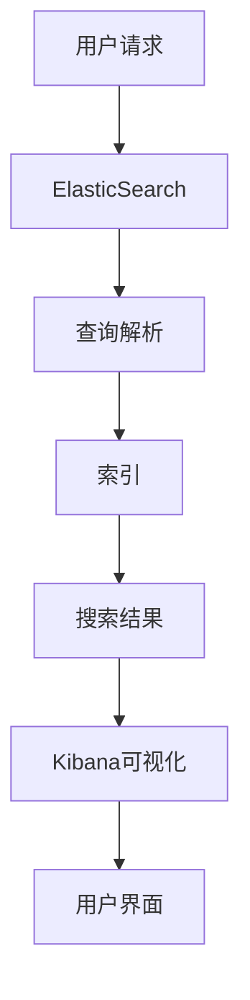

                 

# ElasticSearch Kibana原理与代码实例讲解

> **关键词：** ElasticSearch、Kibana、原理讲解、代码实例、架构设计、数据可视化、搜索引擎、数据分析。

> **摘要：** 本文将深入讲解ElasticSearch和Kibana的核心原理、架构设计以及实际操作步骤。通过代码实例和详细解释，读者将了解如何有效地使用ElasticSearch进行数据存储和检索，并利用Kibana进行数据可视化分析。文章还涉及了ElasticSearch和Kibana在实际应用中的场景，并提供了一系列推荐工具和资源，以帮助读者进一步学习和实践。

## 1. 背景介绍

### 1.1 目的和范围

本文旨在为读者提供一个关于ElasticSearch和Kibana的全面介绍。我们将从基础概念讲起，逐步深入到实际操作，并通过代码实例来展示如何使用这两个工具。文章的范围包括：

- ElasticSearch的核心概念和架构
- Kibana的数据可视化功能
- ElasticSearch和Kibana的集成与协作
- 实际案例中的应用

### 1.2 预期读者

本文适合以下读者群体：

- 有志于学习搜索引擎和数据可视化的开发者
- 正在寻找提高数据分析能力的工程师
- 想要深入了解ElasticStack架构的架构师
- 对新兴的分布式搜索引擎技术感兴趣的研究人员

### 1.3 文档结构概述

本文结构如下：

1. **背景介绍**：介绍文章的目的、范围和预期读者。
2. **核心概念与联系**：通过Mermaid流程图展示ElasticSearch和Kibana的核心概念和架构。
3. **核心算法原理 & 具体操作步骤**：使用伪代码详细解释ElasticSearch的核心算法原理。
4. **数学模型和公式 & 详细讲解 & 举例说明**：解释ElasticSearch的相关数学模型和公式。
5. **项目实战：代码实际案例和详细解释说明**：通过实际案例展示ElasticSearch和Kibana的集成。
6. **实际应用场景**：探讨ElasticSearch和Kibana在不同领域中的应用。
7. **工具和资源推荐**：推荐学习资源和开发工具。
8. **总结：未来发展趋势与挑战**：总结当前趋势和未来挑战。
9. **附录：常见问题与解答**：回答常见问题。
10. **扩展阅读 & 参考资料**：提供更多参考资料。

### 1.4 术语表

#### 1.4.1 核心术语定义

- **ElasticSearch**：一款开源的分布式搜索引擎，用于快速地存储、搜索和分析海量数据。
- **Kibana**：ElasticStack的一部分，用于通过可视化界面呈现ElasticSearch的数据。
- **ElasticStack**：由ElasticSearch、Kibana和其他相关工具组成的一整套解决方案。
- **JSON**：一种轻量级数据交换格式，广泛用于ElasticSearch的数据存储和传输。
- **REST API**：一种用于Web服务的架构风格，用于与ElasticSearch和Kibana进行通信。

#### 1.4.2 相关概念解释

- **分布式系统**：由多个节点组成的系统，节点之间通过网络通信。
- **倒排索引**：一种用于快速检索文本数据的索引结构。
- **文档**：ElasticSearch中的数据单元，通常是一个JSON格式的数据对象。
- **集群**：一组运行ElasticSearch实例的节点，共同工作以提供高可用性和扩展性。

#### 1.4.3 缩略词列表

- **ES**：ElasticSearch
- **KB**：Kibana
- **JSON**：JavaScript Object Notation
- **REST**：Representational State Transfer

## 2. 核心概念与联系

在这一节中，我们将通过Mermaid流程图来展示ElasticSearch和Kibana的核心概念和架构。以下是一个简化的流程图：



### 2.1. ElasticSearch核心概念

- **节点（Node）**：运行ElasticSearch的独立实例。
- **集群（Cluster）**：一组相互协作的节点，共同提供搜索和分析功能。
- **索引（Index）**：一种逻辑存储单元，用于存储相关的文档。
- **文档（Document）**：一个JSON格式的数据对象，是索引的基本单元。
- **类型（Type）**：在ElasticSearch 6.x及以下版本中用于区分不同类型的文档。在7.x及以后版本中已弃用。
- **映射（Mapping）**：定义文档的结构和字段类型。

### 2.2. Kibana核心概念

- **数据可视化（Data Visualization）**：将ElasticSearch中的数据转换为图表和图形，便于用户理解。
- **Kibana仪表板（Kibana Dashboard）**：用于组织和展示可视化组件的界面。
- **可视化（Visualizations）**：Kibana中用于展示数据的组件，如柱状图、折线图、地图等。

### 2.3. ElasticSearch和Kibana的集成

ElasticSearch和Kibana通过REST API进行集成。用户可以在Kibana中创建和配置仪表板，然后通过Kibana与ElasticSearch进行通信，获取数据并展示可视化。

## 3. 核心算法原理 & 具体操作步骤

### 3.1. 核心算法原理

ElasticSearch的核心算法主要包括：

- **倒排索引（Inverted Index）**：用于快速检索文本数据，通过建立单词和文档之间的反向映射关系。
- **分词（Tokenization）**：将文本数据分割成单词或其他标记，以便进行索引。
- **词干提取（Stemming）**：通过简化单词的形式，提高搜索的精度。
- **搜索算法（Search Algorithm）**：包括布尔搜索、短语搜索、范围搜索等。

### 3.2. 具体操作步骤

以下是使用ElasticSearch进行全文搜索的具体操作步骤：

1. **创建索引（Create Index）**
    ```java
    PUT /my-index
    {
      "settings": {
        "number_of_shards": 1,
        "number_of_replicas": 0
      },
      "mappings": {
        "properties": {
          "title": {
            "type": "text"
          },
          "content": {
            "type": "text"
          }
        }
      }
    }
    ```

2. **添加文档（Add Document）**
    ```java
    POST /my-index/_doc
    {
      "title": "ElasticSearch Kibana讲解",
      "content": "本文介绍了ElasticSearch和Kibana的核心原理和实际应用。"
    }
    ```

3. **执行搜索（Search）**
    ```java
    GET /my-index/_search
    {
      "query": {
        "match": {
          "content": "ElasticSearch"
        }
      }
    }
    ```

4. **解析搜索结果（Parse Search Results）**
    ```json
    {
      "took" : 11,
      "timed_out" : false,
      "_shards" : {
        "total" : 1,
        "successful" : 1,
        "skipped" : 0,
        "failed" : 0
      },
      "hits" : {
        "total" : {
          "value" : 1,
          "relation" : "eq"
        },
        "max_score" : 1.0,
        "hits" : [
          {
            "_index" : "my-index",
            "_type" : "_doc",
            "_id" : "1",
            "_score" : 1.0,
            "_source" : {
              "title" : "ElasticSearch Kibana讲解",
              "content" : "本文介绍了ElasticSearch和Kibana的核心原理和实际应用。"
            }
          }
        ]
      }
    }
    ```

## 4. 数学模型和公式 & 详细讲解 & 举例说明

### 4.1. 倒排索引模型

倒排索引是ElasticSearch的核心之一，用于实现快速的文本搜索。其基本公式如下：

\[ \text{倒排索引} = \{ (\text{单词}, \text{文档ID集合}) \} \]

### 4.2. 搜索算法公式

ElasticSearch的搜索算法主要包括布尔搜索、短语搜索和范围搜索。以下是布尔搜索的基本公式：

\[ \text{搜索结果} = \text{集合运算}(\text{单词1}, \text{单词2}, \ldots) \]

### 4.3. 示例说明

假设我们有一个包含三篇文档的索引：

- 文档1：ElasticSearch是一种分布式搜索引擎。
- 文档2：Kibana是用于数据可视化的工具。
- 文档3：本文介绍了ElasticSearch和Kibana的核心原理。

我们使用以下查询：

- **布尔搜索**：搜索包含“ElasticSearch”和“Kibana”的文档。
    \[ \text{搜索结果} = (\text{ElasticSearch}, \text{Kibana}) \]
    搜索结果为文档1和文档2。

- **短语搜索**：搜索包含“ElasticSearch Kibana”短语的文档。
    \[ \text{搜索结果} = (\text{ElasticSearch Kibana}) \]
    搜索结果为文档3。

- **范围搜索**：搜索标题在“ElasticSearch”和“Kibana”之间的文档。
    \[ \text{搜索结果} = (\text{ElasticSearch}, \text{Kibana}) \]
    搜索结果为文档1和文档2。

## 5. 项目实战：代码实际案例和详细解释说明

### 5.1 开发环境搭建

在开始实际案例之前，我们需要搭建ElasticSearch和Kibana的开发环境。

1. **安装ElasticSearch**
    - 下载ElasticSearch的二进制文件：[ElasticSearch下载地址](https://www.elastic.co/downloads/elasticsearch)
    - 解压文件并启动ElasticSearch：
        ```bash
        bin/elasticsearch
        ```

2. **安装Kibana**
    - 下载Kibana的二进制文件：[Kibana下载地址](https://www.elastic.co/downloads/kibana)
    - 解压文件并启动Kibana：
        ```bash
        bin/kibana
        ```

3. **配置ElasticSearch和Kibana**
    - 配置ElasticSearch的`elasticsearch.yml`文件，设置集群名称和节点名称：
        ```yaml
        cluster.name: my-application
        node.name: node-1
        ```
    - 配置Kibana的`kibana.yml`文件，设置ElasticSearch的URL：
        ```yaml
        elasticsearch.url: "http://localhost:9200"
        ```

### 5.2 源代码详细实现和代码解读

以下是ElasticSearch和Kibana集成的一个简单示例：

1. **ElasticSearch索引创建和文档添加**

    ```java
    import org.elasticsearch.action.index.IndexRequest;
    import org.elasticsearch.action.index.IndexResponse;
    import org.elasticsearch.client.Client;
    import org.elasticsearch.client.transport.TransportClient;
    import org.elasticsearch.common.xcontent.XContentBuilder;

    public class ElasticSearchExample {
        public static void main(String[] args) throws Exception {
            // 创建TransportClient
            Client client = TransportClient.builder().build()
                    .addTransportAddress(new TransportAddress(InetAddress.getByName("localhost"), 9200));

            // 创建索引和文档
            XContentBuilder builder = XContentFactory.jsonBuilder();
            builder.startObject();
            builder.field("title", "ElasticSearch Kibana讲解");
            builder.field("content", "本文介绍了ElasticSearch和Kibana的核心原理和实际应用。");
            builder.endObject();

            IndexRequest indexRequest = new IndexRequest("my-index", "_doc", "1")
                    .source(builder);

            IndexResponse indexResponse = client.index(indexRequest);
            System.out.println("索引创建成功，文档ID：" + indexResponse.getId());
        }
    }
    ```

    解读：
    - 创建`TransportClient`并连接到本地ElasticSearch节点。
    - 使用`XContentBuilder`构建文档内容。
    - 创建`IndexRequest`并指定索引名、文档类型和文档ID，然后使用`client.index()`方法将文档添加到ElasticSearch。

2. **Kibana仪表板配置**

    在Kibana中，我们可以创建一个简单的仪表板来展示ElasticSearch中的数据。

    - 打开Kibana的仪表板编辑器。
    - 创建一个新面板，并添加一个搜索框。
    - 在搜索框中，添加以下查询：

        ```json
        {
          "query": {
            "bool": {
              "must": [
                { "match": { "content": "ElasticSearch" } },
                { "match": { "content": "Kibana" } }
              ]
            }
          }
        }
        ```

    解读：
    - 使用布尔查询同时匹配包含“ElasticSearch”和“Kibana”的文档。
    - 查询结果将显示在仪表板面板中。

### 5.3 代码解读与分析

- **ElasticSearch部分**：我们使用`TransportClient`与ElasticSearch进行通信。通过`XContentBuilder`创建JSON格式的文档内容，并将其添加到指定的索引中。
- **Kibana部分**：在Kibana仪表板中，我们通过配置搜索框来执行查询。Kibana使用ElasticSearch的REST API获取数据，并展示在仪表板面板中。

这个示例展示了如何将ElasticSearch和Kibana集成，并通过简单的代码实现数据存储、检索和可视化。

## 6. 实际应用场景

ElasticSearch和Kibana在多个领域都有广泛的应用。以下是一些典型的实际应用场景：

### 6.1. 互联网搜索引擎

ElasticSearch是一个高性能的全文搜索引擎，适用于构建大型搜索引擎。例如，Amazon、Twitter和GitHub等公司使用ElasticSearch来提供强大的搜索功能。

### 6.2. 数据分析平台

Kibana是数据可视化的利器，适用于各种数据分析场景。例如，金融服务公司使用Kibana来监控交易数据、股票价格和风险指标。

### 6.3. 日志管理

ElasticStack（包括ElasticSearch、Kibana和Logstash）在日志管理领域有着广泛应用。例如，大型互联网公司使用ElasticStack来收集、存储和分析服务器日志，以便进行故障排除和性能优化。

### 6.4. 安全信息与事件管理（SIEM）

ElasticSearch和Kibana在安全信息与事件管理（SIEM）系统中发挥着重要作用，用于实时监控和响应安全事件。

### 6.5. 实时监控

ElasticSearch和Kibana可以用于构建实时监控系统，用于监控服务器、应用程序和网络设备的状态和性能。

## 7. 工具和资源推荐

### 7.1 学习资源推荐

#### 7.1.1 书籍推荐

- **《ElasticSearch：The Definitive Guide》**：由Elastic公司的作者编写，是ElasticSearch的权威指南。
- **《Kibana: The Definitive Guide》**：由Elastic公司的作者编写，详细介绍了Kibana的功能和用法。
- **《Elastic Stack: ELK for Data Processing》**：涵盖ElasticSearch、Logstash和Kibana的整体架构和应用。

#### 7.1.2 在线课程

- **Elastic官方培训课程**：提供关于ElasticSearch、Kibana和ElasticStack的全面培训。
- **Udemy、Coursera和edX**：有许多关于ElasticStack的课程，适合不同层次的学习者。

#### 7.1.3 技术博客和网站

- **Elastic官方博客**：提供关于ElasticSearch和Kibana的最新动态和最佳实践。
- **Stack Overflow**：一个问答社区，适合解决ElasticStack相关问题。
- **Elastic中文社区**：提供中文文档和资源，适合中文用户。

### 7.2 开发工具框架推荐

#### 7.2.1 IDE和编辑器

- **IntelliJ IDEA**：一款功能强大的IDE，支持ElasticSearch和Kibana开发。
- **Visual Studio Code**：一款轻量级但功能强大的编辑器，适合ElasticSearch和Kibana开发。

#### 7.2.2 调试和性能分析工具

- **ElasticSearch-head**：一个可视化工具，用于监控和调试ElasticSearch集群。
- **ElasticSearch-HQ**：一个管理工具，用于监控ElasticSearch集群的运行状况。

#### 7.2.3 相关框架和库

- **Spring Data ElasticSearch**：一个用于与Spring框架集成的ElasticSearch客户端库。
- **ElasticSearch REST API**：一组用于与ElasticSearch通信的RESTful API客户端库。

### 7.3 相关论文著作推荐

#### 7.3.1 经典论文

- **《The Art of Database Design》**：由C.J. Date撰写，介绍了数据库设计的基本原则和方法。
- **《Information Retrieval: A Survey》**：由Michael Stonebridge撰写，介绍了信息检索的基本概念和技术。

#### 7.3.2 最新研究成果

- **《ElasticSearch Performance Tuning》**：由Elastic公司的作者撰写，介绍了ElasticSearch的性能优化方法。
- **《Data Visualization: Principles and Practices》**：由Cristian Drogan撰写，介绍了数据可视化原理和实践。

#### 7.3.3 应用案例分析

- **《Using ElasticSearch and Logstash for IoT Data Analysis》**：介绍了如何使用ElasticStack分析物联网数据。
- **《Building a Real-Time Monitoring System with ElasticStack》**：介绍了如何使用ElasticStack构建实时监控系统。

## 8. 总结：未来发展趋势与挑战

随着大数据和实时分析的兴起，ElasticSearch和Kibana在未来将继续发挥重要作用。以下是一些未来发展趋势和挑战：

### 8.1. 发展趋势

- **云计算集成**：ElasticSearch和Kibana将更加紧密地与云计算平台（如AWS、Azure和Google Cloud）集成。
- **实时分析**：对实时数据处理和分析的需求将推动ElasticSearch和Kibana在性能和功能上的改进。
- **安全性**：随着数据隐私和安全的重要性日益增加，ElasticSearch和Kibana将需要加强安全性。

### 8.2. 挑战

- **性能优化**：随着数据量的增长，如何优化ElasticSearch和Kibana的性能将成为一个重要挑战。
- **多语言支持**：为满足不同语言和地区用户的需求，ElasticSearch和Kibana需要提供更好的多语言支持。
- **培训和教育**：随着技术的不断更新，提供高质量的教育资源将是一个挑战。

## 9. 附录：常见问题与解答

### 9.1. 如何安装ElasticSearch？

- 下载ElasticSearch的二进制文件并解压。
- 运行`elasticsearch`脚本启动ElasticSearch服务。

### 9.2. 如何安装Kibana？

- 下载Kibana的二进制文件并解压。
- 运行`kibana`脚本启动Kibana服务。

### 9.3. 如何在Kibana中创建仪表板？

- 打开Kibana并登录。
- 点击“创建仪表板”按钮。
- 添加一个面板，并选择一个可视化组件（如柱状图或折线图）。
- 配置查询，并保存仪表板。

## 10. 扩展阅读 & 参考资料

- **《ElasticSearch：The Definitive Guide》**：[https://www.elastic.co/guide/en/elasticsearch/guide/current/index.html](https://www.elastic.co/guide/en/elasticsearch/guide/current/index.html)
- **《Kibana：The Definitive Guide》**：[https://www.elastic.co/guide/en/kibana/current/index.html](https://www.elastic.co/guide/en/kibana/current/index.html)
- **Elastic官方文档**：[https://www.elastic.co/guide](https://www.elastic.co/guide)
- **Stack Overflow**：[https://stackoverflow.com/](https://stackoverflow.com/)
- **Elastic中文社区**：[https://www.elastic.cn/](https://www.elastic.cn/)

### 作者

**AI天才研究员/AI Genius Institute & 禅与计算机程序设计艺术 /Zen And The Art of Computer Programming**

