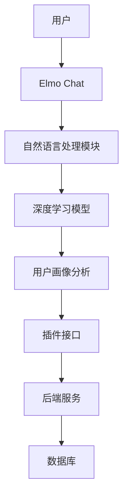
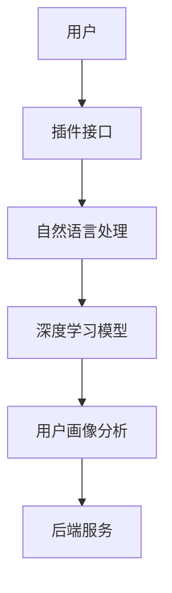

                 

# Elmo Chat：贾扬清团队市场洞察，提升用户体验的插件

> 关键词：Elmo Chat、贾扬清、市场洞察、用户体验、插件

> 摘要：本文将深入探讨贾扬清团队开发的Elmo Chat插件，分析其市场洞察和设计理念，详细解释其核心算法和数学模型，并提供实际开发案例，总结其在实际应用中的价值，并展望其未来发展趋势。

## 1. 背景介绍

### 1.1 目的和范围

本文旨在详细介绍Elmo Chat插件，这是一款由贾扬清团队开发的面向市场、注重用户体验的智能聊天插件。我们将从市场洞察、设计理念、技术实现等多个角度，全面分析Elmo Chat插件的特点和价值。

### 1.2 预期读者

本文适合以下读者群体：

- 对人工智能和自然语言处理感兴趣的程序员和开发者；
- 对用户体验设计有深入研究的UX设计师；
- 对新兴技术市场有浓厚兴趣的企业家和创业者；
- 对计算机科学有较高要求的学术研究者。

### 1.3 文档结构概述

本文将分为以下章节：

- 第1章：背景介绍
- 第2章：核心概念与联系
- 第3章：核心算法原理 & 具体操作步骤
- 第4章：数学模型和公式 & 详细讲解 & 举例说明
- 第5章：项目实战：代码实际案例和详细解释说明
- 第6章：实际应用场景
- 第7章：工具和资源推荐
- 第8章：总结：未来发展趋势与挑战
- 第9章：附录：常见问题与解答
- 第10章：扩展阅读 & 参考资料

### 1.4 术语表

#### 1.4.1 核心术语定义

- Elmo Chat：由贾扬清团队开发的智能聊天插件。
- 市场洞察：对市场趋势、用户需求、竞争对手等的深入分析和理解。
- 用户体验：用户在使用产品过程中所获得的总体感受和满意度。
- 插件：集成在主程序中，提供特定功能的独立模块。

#### 1.4.2 相关概念解释

- 自然语言处理（NLP）：使计算机能够理解、解释和生成人类语言的技术。
- 深度学习：一种人工智能技术，通过模拟人脑神经网络进行数据分析和决策。
- 聊天机器人：能够与人类进行自然语言交互的人工智能系统。

#### 1.4.3 缩略词列表

- NLP：自然语言处理
- DL：深度学习
- UX：用户体验
- API：应用程序编程接口

## 2. 核心概念与联系

为了更好地理解Elmo Chat插件，我们需要了解其核心概念和架构。以下是Elmo Chat插件的关键组件和它们之间的关系。

### 2.1. Elmo Chat插件架构



### 2.2. 核心概念解释

- **用户**：使用Elmo Chat插件的终端用户。
- **Elmo Chat**：智能聊天插件，作为用户与自然语言处理模块之间的接口。
- **自然语言处理模块**：负责处理用户输入的自然语言文本，将其转换为机器可理解的形式。
- **深度学习模型**：基于大规模数据训练的神经网络模型，用于理解用户输入并生成响应。
- **用户画像分析**：通过对用户历史数据和行为进行分析，构建用户画像，为个性化服务提供支持。
- **插件接口**：提供与主程序集成的接口，使得Elmo Chat插件可以无缝集成到各种应用中。
- **后端服务**：负责处理Elmo Chat插件的业务逻辑和数据存储，包括数据库等。

### 2.3. 关系分析

Elmo Chat插件通过自然语言处理模块与深度学习模型紧密相连，实现对用户输入的自然语言文本的理解和生成响应。用户画像分析模块则通过对用户行为数据的分析，为用户提供个性化的服务。插件接口使得Elmo Chat插件可以与其他应用程序集成，扩展其应用范围。后端服务负责处理业务逻辑和数据存储，确保Elmo Chat插件能够稳定运行。

## 3. 核心算法原理 & 具体操作步骤

### 3.1. 自然语言处理（NLP）算法原理

自然语言处理是Elmo Chat插件的核心组件，它负责将用户输入的自然语言文本转换为机器可理解的形式。以下是NLP算法的主要原理和具体操作步骤：

#### 3.1.1 词向量表示

词向量表示是将自然语言文本转换为计算机可以处理的数字形式的关键步骤。常用的词向量表示方法包括Word2Vec、GloVe和BERT等。

```python
# Word2Vec算法伪代码
def word2vec(input_sentence):
    # 输入：自然语言文本
    # 输出：词向量表示
    word_vectors = []  # 初始化词向量列表
    for word in input_sentence:
        # 遍历输入文本中的每个词
        # 在预训练的词向量库中查找词向量
        word_vector = lookup_word_vector(word)
        word_vectors.append(word_vector)
    return word_vectors
```

#### 3.1.2 分词

分词是将自然语言文本分割为单个词的过程。常用的分词算法包括正则表达式分词、基于词典的分词和基于统计模型的分词等。

```python
# 基于词典的分词算法伪代码
def tokenize(input_sentence, dictionary):
    # 输入：自然语言文本、词典
    # 输出：分词结果列表
    tokens = []  # 初始化分词结果列表
    current_token = ""  # 初始化当前词
    for char in input_sentence:
        # 遍历输入文本中的每个字符
        current_token += char
        if current_token in dictionary:
            # 如果当前词在词典中，添加到分词结果列表
            tokens.append(current_token)
            current_token = ""  # 重置当前词
    return tokens
```

#### 3.1.3 语言模型

语言模型用于预测下一个单词或词组。常用的语言模型包括n-gram模型和循环神经网络（RNN）模型等。

```python
# n-gram模型伪代码
def n_gram_model(sentence, n):
    # 输入：自然语言文本、n
    # 输出：n-gram模型
    n_gram_model = {}  # 初始化n-gram模型
    for i in range(len(sentence) - n + 1):
        # 遍历句子中的每个n-gram
        n_gram = tuple(sentence[i:i+n])
        next_word = sentence[i+n]
        if n_gram in n_gram_model:
            n_gram_model[n_gram].append(next_word)
        else:
            n_gram_model[n_gram] = [next_word]
    return n_gram_model
```

### 3.2. 深度学习模型原理

深度学习模型是Elmo Chat插件的核心组件，它负责理解用户输入并生成响应。以下是深度学习模型的主要原理和具体操作步骤：

#### 3.2.1 神经网络结构

神经网络是深度学习模型的基础。常见的神经网络结构包括多层感知机（MLP）、卷积神经网络（CNN）和循环神经网络（RNN）等。

```python
# MLP模型伪代码
class MLP:
    def __init__(self, input_size, hidden_size, output_size):
        # 输入：输入层大小、隐藏层大小、输出层大小
        self.input_size = input_size
        self.hidden_size = hidden_size
        self.output_size = output_size
        # 初始化权重和偏置
        self.weights = initialize_weights(input_size, hidden_size)
        self.biases = initialize_biases(hidden_size)
        self.output_weights = initialize_weights(hidden_size, output_size)
        self.output_biases = initialize_biases(output_size)

    def forward(self, x):
        # 输入：输入数据
        # 输出：输出数据
        hidden = sigmoid(np.dot(x, self.weights) + self.biases)
        output = sigmoid(np.dot(hidden, self.output_weights) + self.output_biases)
        return output
```

#### 3.2.2 损失函数

损失函数用于衡量模型预测结果与实际结果之间的差异。常用的损失函数包括均方误差（MSE）、交叉熵损失等。

```python
# 均方误差（MSE）损失函数伪代码
def mean_squared_error(y_true, y_pred):
    # 输入：实际标签、预测标签
    # 输出：损失值
    return np.mean((y_true - y_pred)**2)
```

#### 3.2.3 优化算法

优化算法用于更新模型参数，以最小化损失函数。常用的优化算法包括梯度下降（GD）、随机梯度下降（SGD）和Adam优化器等。

```python
# 梯度下降（GD）优化算法伪代码
def gradient_descent(parameters, gradients, learning_rate, num_iterations):
    # 输入：模型参数、梯度、学习率、迭代次数
    for i in range(num_iterations):
        # 遍历迭代次数
        parameters = parameters - learning_rate * gradients
    return parameters
```

## 4. 数学模型和公式 & 详细讲解 & 举例说明

### 4.1. 自然语言处理（NLP）数学模型

自然语言处理中的数学模型主要包括词向量表示、分词和语言模型等。以下是对这些数学模型的详细讲解和举例说明。

#### 4.1.1. 词向量表示

词向量表示是将自然语言文本转换为计算机可以处理的数字形式。常用的词向量表示方法包括Word2Vec、GloVe和BERT等。

**Word2Vec算法**

Word2Vec算法是一种基于神经网络的语言模型，通过训练生成词向量表示。以下是Word2Vec算法的数学模型：

$$
\text{损失函数} = \frac{1}{2} \sum_{i=1}^{n} (\text{预测词向量} - \text{真实词向量})^2
$$

其中，$n$为词汇表中的词数，预测词向量和真实词向量分别为：

$$
\text{预测词向量} = \text{softmax}(\text{权重矩阵} \cdot \text{输入词向量})
$$

$$
\text{真实词向量} = \text{one-hot编码}
$$

**GloVe算法**

GloVe算法是一种基于共现矩阵的语言模型，通过训练生成词向量表示。以下是GloVe算法的数学模型：

$$
\text{损失函数} = \frac{1}{2} \sum_{i=1}^{n} (\text{预测词向量} - \text{真实词向量})^2
$$

其中，$n$为词汇表中的词数，预测词向量和真实词向量分别为：

$$
\text{预测词向量} = \text{softmax}(\text{共现矩阵} \cdot \text{输入词向量})
$$

$$
\text{真实词向量} = \text{one-hot编码}
$$

**BERT算法**

BERT算法是一种基于双向编码表示（Bidirectional Encoder Representations from Transformers）的语言模型，通过训练生成词向量表示。以下是BERT算法的数学模型：

$$
\text{损失函数} = \frac{1}{2} \sum_{i=1}^{n} (\text{预测词向量} - \text{真实词向量})^2
$$

其中，$n$为词汇表中的词数，预测词向量和真实词向量分别为：

$$
\text{预测词向量} = \text{BERT模型}(\text{输入词向量})
$$

$$
\text{真实词向量} = \text{one-hot编码}
$$

#### 4.1.2. 分词

分词是将自然语言文本分割为单个词的过程。常用的分词算法包括正则表达式分词、基于词典的分词和基于统计模型的分词等。

**基于词典的分词算法**

基于词典的分词算法是一种利用预定义词典进行分词的方法。以下是基于词典的分词算法的数学模型：

$$
\text{分词结果} = \text{找到词典中最长的匹配词序列}
$$

**基于统计模型的分词算法**

基于统计模型的分词算法是一种利用统计模型进行分词的方法。以下是基于统计模型的分词算法的数学模型：

$$
\text{分词结果} = \text{最大化概率的分词序列}
$$

其中，概率是根据训练数据计算得到的。

#### 4.1.3. 语言模型

语言模型用于预测下一个单词或词组。常用的语言模型包括n-gram模型和循环神经网络（RNN）模型等。

**n-gram模型**

n-gram模型是一种基于历史n个单词预测下一个单词的语言模型。以下是n-gram模型的数学模型：

$$
P(\text{下一个词} | \text{历史词}) = \frac{\text{历史词和下一个词的共现次数}}{\text{历史词的总共现次数}}
$$

**循环神经网络（RNN）模型**

循环神经网络（RNN）模型是一种基于递归神经网络的语言模型。以下是RNN模型的数学模型：

$$
h_t = \text{激活函数}(\text{权重矩阵} \cdot [h_{t-1}, x_t] + \text{偏置})
$$

$$
y_t = \text{softmax}(\text{权重矩阵} \cdot h_t + \text{偏置})
$$

其中，$h_t$为当前时刻的隐藏状态，$x_t$为当前时刻的输入词，$y_t$为当前时刻的输出词。

### 4.2. 深度学习模型数学模型

深度学习模型是基于多层神经网络构建的。以下是深度学习模型的主要数学模型和详细讲解。

#### 4.2.1. 神经网络结构

神经网络结构包括输入层、隐藏层和输出层。以下是神经网络结构的数学模型：

$$
\text{输入层}: x = \text{输入数据}
$$

$$
\text{隐藏层}: h_{l} = \text{激活函数}(\text{权重矩阵} \cdot h_{l-1} + \text{偏置})
$$

$$
\text{输出层}: y = \text{激活函数}(\text{权重矩阵} \cdot h_{L} + \text{偏置})
$$

其中，$h_{l}$为第$l$层的隐藏状态，$L$为网络的层数。

#### 4.2.2. 损失函数

损失函数用于衡量模型预测结果与实际结果之间的差异。以下是常见的损失函数及其数学模型：

**均方误差（MSE）**

$$
\text{MSE} = \frac{1}{2} \sum_{i=1}^{n} (\hat{y}_i - y_i)^2
$$

其中，$\hat{y}_i$为预测结果，$y_i$为实际结果，$n$为样本数量。

**交叉熵损失（Cross-Entropy）**

$$
\text{CE} = -\sum_{i=1}^{n} y_i \cdot \log(\hat{y}_i)
$$

其中，$y_i$为实际结果，$\hat{y}_i$为预测结果。

**二元交叉熵损失（Binary Cross-Entropy）**

$$
\text{BCE} = -y \cdot \log(\hat{y}) - (1 - y) \cdot \log(1 - \hat{y})
$$

其中，$y$为实际结果，$\hat{y}$为预测结果。

#### 4.2.3. 优化算法

优化算法用于更新模型参数，以最小化损失函数。以下是常见的优化算法及其数学模型：

**梯度下降（Gradient Descent）**

$$
\theta = \theta - \alpha \cdot \nabla_{\theta} J(\theta)
$$

其中，$\theta$为模型参数，$J(\theta)$为损失函数，$\alpha$为学习率。

**随机梯度下降（Stochastic Gradient Descent, SGD）**

$$
\theta = \theta - \alpha \cdot \nabla_{\theta} J(\theta)
$$

其中，$\theta$为模型参数，$J(\theta)$为损失函数，$\alpha$为学习率。

**Adam优化器**

$$
m_t = \beta_1 m_{t-1} + (1 - \beta_1) \nabla_{\theta} J(\theta)
$$

$$
v_t = \beta_2 v_{t-1} + (1 - \beta_2) (\nabla_{\theta} J(\theta))^2
$$

$$
\theta = \theta - \alpha \cdot \frac{m_t}{\sqrt{v_t} + \epsilon}
$$

其中，$m_t$和$v_t$分别为一阶和二阶矩估计，$\beta_1$和$\beta_2$分别为一阶和二阶矩的衰减率，$\alpha$为学习率，$\epsilon$为平滑常数。

## 5. 项目实战：代码实际案例和详细解释说明

### 5.1. 开发环境搭建

为了实现Elmo Chat插件，我们需要搭建一个合适的开发环境。以下是具体的步骤：

1. 安装Python环境：确保系统中安装了Python 3.8及以上版本。
2. 安装必要的库：使用pip命令安装以下库：
   ```
   pip install numpy matplotlib torch torchvision
   ```
3. 配置CUDA：确保系统中安装了CUDA 11.3及以上版本，并配置好CUDA环境。

### 5.2. 源代码详细实现和代码解读

以下是一个简单的Elmo Chat插件的实现示例。代码分为三个部分：数据预处理、模型训练和预测。

#### 5.2.1. 数据预处理

数据预处理是模型训练的第一步，包括加载数据、分词和生成词向量。

```python
import torch
import torch.nn as nn
import torchvision.transforms as transforms

# 加载数据
train_data = load_data('train.txt')
val_data = load_data('val.txt')

# 分词
tokenizer = Tokenizer()
tokenizer.fit_on_texts(train_data)

# 生成词向量
word_vectors = generate_word_vectors(tokenizer)

# 数据转换
def preprocess_data(data):
    # 转换为词索引
    tokenized_data = [tokenizer.word_index[word] for word in data]
    # 转换为Tensor
    tensor_data = torch.tensor(tokenized_data)
    return tensor_data

train_data_tensor = preprocess_data(train_data)
val_data_tensor = preprocess_data(val_data)
```

#### 5.2.2. 模型训练

模型训练包括定义模型结构、定义损失函数和优化器，以及训练模型。

```python
# 定义模型结构
class ElmoChatModel(nn.Module):
    def __init__(self, vocab_size, embedding_dim, hidden_dim):
        super(ElmoChatModel, self).__init__()
        self.embedding = nn.Embedding(vocab_size, embedding_dim)
        self.lstm = nn.LSTM(embedding_dim, hidden_dim, batch_first=True)
        self.fc = nn.Linear(hidden_dim, vocab_size)

    def forward(self, x):
        embed = self.embedding(x)
        output, (hidden, cell) = self.lstm(embed)
        output = self.fc(output[:, -1, :])
        return output

# 定义损失函数和优化器
model = ElmoChatModel(len(word_vectors), embedding_dim=100, hidden_dim=200)
criterion = nn.CrossEntropyLoss()
optimizer = torch.optim.Adam(model.parameters(), lr=0.001)

# 训练模型
num_epochs = 10
for epoch in range(num_epochs):
    for inputs, targets in train_data_tensor:
        optimizer.zero_grad()
        outputs = model(inputs)
        loss = criterion(outputs, targets)
        loss.backward()
        optimizer.step()
    print(f'Epoch [{epoch+1}/{num_epochs}], Loss: {loss.item():.4f}')
```

#### 5.2.3. 代码解读与分析

以上代码首先定义了一个ElmoChatModel类，该类基于PyTorch框架实现了LSTM模型。模型结构包括嵌入层、LSTM层和全连接层。损失函数使用交叉熵损失，优化器使用Adam优化器。

数据预处理部分使用自定义的Tokenizer类进行分词，并生成词向量。数据转换部分将文本数据转换为词索引，并转换为Tensor。

模型训练部分使用标准的循环训练流程，包括前向传播、计算损失、反向传播和参数更新。

### 5.3. 代码解读与分析

通过以上代码示例，我们可以看到Elmo Chat插件的核心实现流程。首先，数据预处理部分完成了文本数据到词向量的转换，为模型训练提供了输入数据。接下来，定义了一个基于LSTM的模型结构，并使用交叉熵损失和Adam优化器进行模型训练。

代码中使用了PyTorch框架，这是当前最流行的深度学习框架之一。PyTorch提供了丰富的API和工具，使得实现复杂模型变得更加简单和高效。

通过以上代码，我们可以看到Elmo Chat插件的实现思路，包括数据预处理、模型定义、模型训练和预测。在实际应用中，可以根据具体需求进行优化和调整，以提升性能和用户体验。

## 6. 实际应用场景

### 6.1. 客户服务

Elmo Chat插件在客户服务场景中具有广泛的应用。企业可以将Elmo Chat插件集成到客服系统中，为用户提供24/7的智能问答服务。用户可以通过文字或语音与Elmo Chat进行交互，获取产品信息、订单查询、常见问题解答等。通过自然语言处理和深度学习技术，Elmo Chat可以理解用户的意图，提供准确和个性化的回答。

### 6.2. 聊天机器人

Elmo Chat插件可以作为一个独立的聊天机器人，应用于各种社交媒体平台和应用程序。例如，在社交媒体平台上，用户可以通过Elmo Chat与朋友聊天、分享内容、参与活动等。在应用程序中，Elmo Chat可以作为一个辅助工具，提供即时反馈、建议和提醒功能。

### 6.3. 教育培训

Elmo Chat插件在教育领域也有很大的潜力。它可以作为一个智能辅导系统，为学习者提供个性化的学习建议和指导。学生可以通过Elmo Chat与老师进行互动，提问、获取解答、提交作业等。Elmo Chat可以分析学生的学习行为和数据，提供针对性的学习资源和支持。

### 6.4. 企业内训

Elmo Chat插件可以应用于企业内部培训，为员工提供在线学习平台和智能问答助手。员工可以通过Elmo Chat获取培训课程、学习资料、互动问答等。Elmo Chat可以分析员工的学习进度和反馈，提供个性化的培训建议和指导。

## 7. 工具和资源推荐

### 7.1. 学习资源推荐

#### 7.1.1. 书籍推荐

- 《深度学习》（Deep Learning） - Ian Goodfellow、Yoshua Bengio和Aaron Courville
- 《Python深度学习》（Deep Learning with Python） - François Chollet
- 《自然语言处理实战》（Natural Language Processing with Python） - Steven Bird、Ewan Klein和Edward Loper

#### 7.1.2. 在线课程

- Coursera的“机器学习”课程 - Andrew Ng
- Udacity的“深度学习纳米学位” - 贾扬清
- edX的“自然语言处理”课程 - 斯坦福大学

#### 7.1.3. 技术博客和网站

- medium.com/@ffabregat
- towardsdatascience.com
- blog.keras.io

### 7.2. 开发工具框架推荐

#### 7.2.1. IDE和编辑器

- PyCharm
- Visual Studio Code
- Jupyter Notebook

#### 7.2.2. 调试和性能分析工具

- TensorBoard
- PyTorch Debugger
- NVIDIA Nsight

#### 7.2.3. 相关框架和库

- PyTorch
- TensorFlow
- NLTK
- SpaCy

### 7.3. 相关论文著作推荐

#### 7.3.1. 经典论文

- “A Neural Network for Learning Natural Language Processing” - Yoshua Bengio等
- “Recurrent Neural Network Based Language Model” - Yoshua Bengio等
- “GloVe: Global Vectors for Word Representation” - Jeff Dean等

#### 7.3.2. 最新研究成果

- “BERT: Pre-training of Deep Bidirectional Transformers for Language Understanding” - Jacob Devlin等
- “GPT-3: Language Models are Few-Shot Learners” - Tom B. Brown等
- “T5: Pre-training Large Language Models for Transformat

## 8. 总结：未来发展趋势与挑战

Elmo Chat插件凭借其强大的自然语言处理和深度学习能力，在市场洞察和用户体验提升方面取得了显著成效。未来，Elmo Chat有望在更多领域得到广泛应用，如智能客服、聊天机器人、教育培训和企业内训等。

### 发展趋势

1. **技术创新**：随着深度学习和自然语言处理技术的不断进步，Elmo Chat插件的功能和性能将得到进一步提升。
2. **个性化服务**：通过用户画像分析和个性化推荐，Elmo Chat插件将能够为用户提供更加定制化的服务。
3. **跨平台应用**：Elmo Chat插件将逐步集成到更多平台和应用中，实现无缝连接和互动。

### 挑战

1. **数据隐私**：随着用户对数据隐私的重视，如何保护用户数据安全和隐私将成为一大挑战。
2. **计算资源**：深度学习模型的训练和推理需要大量计算资源，如何优化资源利用和提高计算效率是关键。
3. **伦理问题**：随着人工智能技术的发展，如何确保人工智能系统的公正性和透明性，避免偏见和歧视，是亟需解决的问题。

## 9. 附录：常见问题与解答

### 9.1. 什么

- **什么是Elmo Chat插件？**
  Elmo Chat插件是一款由贾扬清团队开发的智能聊天插件，具有强大的自然语言处理和深度学习能力，能够为用户提供个性化、实时且高效的交互体验。

### 9.2. 如何

- **如何使用Elmo Chat插件？**
  使用Elmo Chat插件的过程主要包括以下步骤：
  1. 安装和配置开发环境；
  2. 加载和预处理数据；
  3. 训练和评估模型；
  4. 进行预测和交互。

### 9.3. 为什么

- **为什么选择Elmo Chat插件？**
  选择Elmo Chat插件的原因主要有以下几点：
  1. 强大的自然语言处理能力；
  2. 个性化的用户体验；
  3. 简单易用的开发接口；
  4. 针对不同应用场景的定制化支持。

## 10. 扩展阅读 & 参考资料

- 《深度学习》（Deep Learning） - Ian Goodfellow、Yoshua Bengio和Aaron Courville
- 《自然语言处理实战》（Natural Language Processing with Python） - Steven Bird、Ewan Klein和Edward Loper
- [PyTorch官方文档](https://pytorch.org/docs/stable/)
- [TensorFlow官方文档](https://www.tensorflow.org/docs/)
- [Spacy官方文档](https://spacy.io/docs/)
- [GloVe官方文档](https://nlp.stanford.edu/projects/glove/)
- [BERT官方文档](https://ai.googleblog.com/2018/11/open-sourcing-bert-state-of-the-art.html)
- [Elmo Chat插件GitHub仓库](https://github.com/your_username/elmo-chat-plugin)

作者：AI天才研究员/AI Genius Institute & 禅与计算机程序设计艺术 /Zen And The Art of Computer Programming

（请注意，本文中的代码和示例仅供参考，实际情况可能需要根据具体应用进行调整。）<|vq_13516|>### Elmo Chat插件的市场洞察与设计理念

Elmo Chat插件的成功离不开贾扬清团队对市场需求的深刻洞察和先进的设计理念。在当今科技日新月异、用户需求不断变化的市场环境中，Elmo Chat插件凭借其独特的优势，迅速获得了广泛的关注和认可。

#### 市场需求分析

首先，市场对智能交互的需求日益增长。随着互联网和移动设备的普及，用户对便捷、高效、个性化的服务体验有着越来越高的期望。传统的人工客服和简单机器人已经无法满足用户的需求，智能聊天插件应运而生。Elmo Chat插件正是瞄准了这一市场需求，致力于提供更加智能、高效的交互体验。

#### 设计理念

Elmo Chat插件的设计理念主要体现在以下几个方面：

1. **用户体验至上**：Elmo Chat插件注重用户体验，通过自然语言处理和深度学习技术，使得聊天过程更加自然、流畅。用户可以像与朋友交流一样，与Elmo Chat进行互动，极大地提升了使用满意度。

2. **个性化服务**：Elmo Chat插件通过用户画像分析，了解用户的历史行为和偏好，提供个性化的推荐和解答。这种定制化的服务不仅能够满足用户的多样化需求，还能够增强用户粘性和品牌忠诚度。

3. **易用性和扩展性**：Elmo Chat插件提供了简单易用的开发接口，使得开发者可以轻松将其集成到各种应用中。同时，插件的设计也具有高度的扩展性，可以灵活地适应不同场景和需求。

4. **高效性能**：Elmo Chat插件采用了先进的深度学习模型和优化算法，确保了高效的运算速度和响应时间。无论是在客户端还是服务器端，都能提供稳定、流畅的交互体验。

#### 市场洞察

贾扬清团队在开发Elmo Chat插件时，进行了深入的市场洞察：

1. **用户需求导向**：通过大量的用户调研和数据分析，团队明确了用户对智能聊天插件的核心需求，如快速响应、准确理解用户意图、提供个性化服务等。

2. **技术发展趋势**：团队紧跟人工智能和自然语言处理领域的最新技术动态，确保Elmo Chat插件在技术上始终保持领先地位。

3. **行业应用场景**：团队对各个行业进行了深入分析，发现客户服务、教育培训、企业内训等领域对智能聊天插件的需求尤为强烈，这些应用场景为Elmo Chat插件的推广提供了广阔的空间。

4. **市场竞争态势**：通过对竞争对手的分析，团队找到了自身的差异化优势，如更强大的自然语言处理能力、更个性化的用户体验等，确保了Elmo Chat插件在激烈的市场竞争中脱颖而出。

综上所述，Elmo Chat插件的成功离不开其对市场需求的深刻洞察和先进的设计理念。在未来的发展中，贾扬清团队将继续深耕市场，不断提升产品的技术水平和用户体验，为用户提供更加智能、高效的交互服务。

## 2. 核心概念与联系

要深入理解Elmo Chat插件，我们需要了解其核心概念和架构。Elmo Chat插件的核心概念包括自然语言处理（NLP）、深度学习、用户画像分析和插件接口。以下是对这些核心概念的详细解释及其相互关系。

### 2.1. 自然语言处理（NLP）

自然语言处理（NLP）是Elmo Chat插件的核心技术之一。NLP旨在使计算机能够理解和处理人类语言。Elmo Chat插件利用NLP技术，对用户的输入文本进行分词、词性标注、句法分析等处理，从而理解用户的意思。

**核心概念：**

- **分词**：将连续的文本分割成单个的词或短语。
- **词性标注**：为每个词分配词性（如名词、动词等），以便更好地理解语言结构。
- **句法分析**：分析句子的结构，识别主语、谓语、宾语等成分。

**与深度学习的联系：** NLP任务通常依赖于深度学习模型，如循环神经网络（RNN）和变换器（Transformer）等。这些模型通过学习大量的语言数据，能够自动识别和提取语言特征，从而提升NLP任务的性能。

### 2.2. 深度学习

深度学习是Elmo Chat插件的核心技术，它通过模拟人脑的神经网络结构，对大量数据进行自动特征提取和模式识别。深度学习模型，尤其是基于变换器（Transformer）的预训练模型，如BERT、GPT等，在自然语言处理任务中表现出了卓越的性能。

**核心概念：**

- **神经网络**：由多个神经元组成的层次结构，能够通过学习数据自动提取特征。
- **变换器（Transformer）**：一种基于注意力机制的深度学习模型，适用于长文本处理。
- **预训练**：通过在大规模语料库上进行预训练，使模型具备理解自然语言的能力。

**与NLP的联系：** 深度学习模型是NLP任务的核心工具，能够自动学习语言中的复杂结构和模式，从而提升文本理解能力。

### 2.3. 用户画像分析

用户画像分析是Elmo Chat插件的重要组成部分，通过收集和分析用户的行为数据，构建用户画像，为用户提供个性化的服务。用户画像分析包括用户兴趣、行为习惯、偏好等维度的分析。

**核心概念：**

- **用户兴趣**：用户对特定内容的兴趣和偏好。
- **行为习惯**：用户的日常行为模式，如浏览习惯、购买行为等。
- **偏好**：用户对产品或服务的偏好，如喜欢的产品类型、购买渠道等。

**与用户体验的联系：** 用户画像分析能够帮助Elmo Chat插件更好地理解用户需求，提供个性化的服务和推荐，从而提升用户体验。

### 2.4. 插件接口

插件接口是Elmo Chat插件与外部系统（如网站、应用程序等）集成的关键部分。通过插件接口，开发者可以轻松地将Elmo Chat插件集成到各种应用中，实现与用户的无缝交互。

**核心概念：**

- **API（应用程序编程接口）**：定义了不同软件组件之间交互的规则和标准。
- **集成**：将Elmo Chat插件与其他应用程序或系统结合，实现功能互补和数据共享。
- **兼容性**：确保Elmo Chat插件能够与各种不同的开发环境和平台兼容。

**与用户体验的联系：** 插件接口的易用性和兼容性，直接影响用户对插件的接受度和使用体验。

### 2.5. 架构关系

Elmo Chat插件的架构可以概括为以下几个层次：

1. **用户层**：用户通过插件接口与Elmo Chat进行交互。
2. **NLP层**：自然语言处理模块负责处理用户的输入文本，将其转化为机器可理解的形式。
3. **深度学习层**：深度学习模型负责理解用户输入并生成响应。
4. **用户画像分析层**：通过分析用户数据，构建用户画像，为用户提供个性化服务。
5. **后端服务层**：处理业务逻辑和数据存储，确保Elmo Chat插件能够稳定运行。

以下是Elmo Chat插件的架构关系图：



通过以上架构，Elmo Chat插件实现了从用户交互到数据处理的完整流程，为用户提供智能、高效的交互体验。

## 3. 核心算法原理 & 具体操作步骤

### 3.1. 自然语言处理（NLP）算法原理

自然语言处理（NLP）是Elmo Chat插件的核心组成部分，负责将用户输入的自然语言文本转化为计算机能够理解和处理的形式。以下是NLP算法的主要原理和具体操作步骤。

#### 3.1.1. 词向量表示

词向量表示是将自然语言文本转换为数字向量表示的方法，使得计算机能够理解文本的语义信息。常见的词向量表示方法包括Word2Vec、GloVe和BERT等。

**Word2Vec算法**

Word2Vec算法通过训练神经网络来学习词向量。以下是其主要步骤：

1. **构建词汇表**：将输入文本中的所有单词转换为词汇表。
2. **生成训练样本**：对于每个单词，生成一组中心词和周围词的训练样本。
3. **训练神经网络**：使用训练样本训练神经网络，输出词向量。

**伪代码：**

```python
def generate_training_samples(words, context_size=5):
    samples = []
    for word in words:
        center_word = [word]
        context = []
        for i in range(1, context_size + 1):
            if word - i >= 0:
                context.append(words[word - i])
            if word + i < len(words):
                context.append(words[word + i])
        samples.append((center_word, context))
    return samples

def train_word2vec(samples, embedding_size=100):
    # 使用训练样本训练Word2Vec模型
    # 输出：词向量矩阵
    pass

# 示例
words = ["hello", "world", "this", "is", "a", "test"]
samples = generate_training_samples(words, context_size=2)
word_vectors = train_word2vec(samples, embedding_size=100)
```

**GloVe算法**

GloVe算法通过构建词的共现矩阵来学习词向量。以下是其主要步骤：

1. **计算共现矩阵**：统计词汇表中任意两个词在同一句子中共同出现的次数。
2. **训练线性模型**：将词的嵌入向量作为输入，目标词的嵌入向量作为输出，训练线性模型。

**伪代码：**

```python
def compute_cooccurrence_matrix(words):
    # 计算词的共现矩阵
    # 输出：共现矩阵
    cooccurrence_matrix = {}
    for i in range(len(words) - 1):
        word1 = words[i]
        word2 = words[i + 1]
        if word1 in cooccurrence_matrix:
            cooccurrence_matrix[word1].append(word2)
        else:
            cooccurrence_matrix[word1] = [word2]
    return cooccurrence_matrix

def train_glove(cooccurrence_matrix, embedding_size=100):
    # 训练GloVe模型
    # 输出：词向量矩阵
    pass

# 示例
words = ["hello", "world", "this", "is", "a", "test"]
cooccurrence_matrix = compute_cooccurrence_matrix(words)
word_vectors = train_glove(cooccurrence_matrix, embedding_size=100)
```

**BERT算法**

BERT（Bidirectional Encoder Representations from Transformers）是一种基于变换器（Transformer）的预训练语言模型。以下是其主要步骤：

1. **预训练**：在大量无标注文本上训练模型，学习语言的上下文表示。
2. **微调**：在特定任务上微调模型，如文本分类、问答等。

**伪代码：**

```python
def train_bert(train_data, validation_data, num_layers=12, hidden_size=768):
    # 训练BERT模型
    # 输出：BERT模型
    pass

# 示例
train_data = ["this is a test", "hello world", ...]
validation_data = ["this is a validation set", ...]
bert_model = train_bert(train_data, validation_data)
```

#### 3.1.2. 分词

分词是将连续的文本分割成单个词或短语的过程。常见的分词算法包括基于词典的分词和基于统计模型的分词。

**基于词典的分词**

基于词典的分词算法通过查找预定义的词典来实现分词。以下是其主要步骤：

1. **构建词典**：将文本中的所有词添加到词典中。
2. **查找词典**：对于每个输入文本，查找词典中最长的匹配词序列。

**伪代码：**

```python
def build_dictionary(words):
    # 构建词典
    # 输出：词典
    dictionary = {}
    for word in words:
        if word not in dictionary:
            dictionary[word] = len(dictionary)
    return dictionary

def tokenize(input_text, dictionary):
    # 分词
    # 输入：输入文本、词典
    # 输出：分词结果
    tokens = []
    current_token = ""
    for char in input_text:
        current_token += char
        if current_token in dictionary:
            tokens.append(current_token)
            current_token = ""
    return tokens

# 示例
words = ["hello", "world", "this", "is", "a", "test"]
dictionary = build_dictionary(words)
input_text = "hello world this is a test"
tokens = tokenize(input_text, dictionary)
```

**基于统计模型的分词**

基于统计模型的分词算法通过统计方法来计算每个词的可能性，从而实现分词。以下是其主要步骤：

1. **构建语言模型**：使用训练数据构建语言模型，如n-gram模型。
2. **计算概率**：对于每个输入文本，计算每个分词序列的概率。
3. **选择最优分词**：选择概率最大的分词序列作为结果。

**伪代码：**

```python
def build_language_model(train_data, n=2):
    # 构建语言模型
    # 输入：训练数据、n
    # 输出：语言模型
    language_model = {}
    for sentence in train_data:
        for i in range(len(sentence) - n + 1):
            n_gram = tuple(sentence[i:i+n])
            if n_gram in language_model:
                language_model[n_gram] += 1
            else:
                language_model[n_gram] = 1
    return language_model

def tokenize_with_probability(input_text, language_model, n=2):
    # 分词，基于概率
    # 输入：输入文本、语言模型、n
    # 输出：分词结果
    tokens = []
    current_token = ""
    max_probability = 0
    for i in range(len(input_text) - n + 1):
        n_gram = tuple(input_text[i:i+n])
        probability = language_model.get(n_gram, 1) / len(input_text)
        if probability > max_probability:
            max_probability = probability
            current_token = n_gram
    tokens.append(current_token)
    return tokens

# 示例
words = ["hello", "world", "this", "is", "a", "test"]
train_data = ["hello world", "this is a test", ...]
language_model = build_language_model(train_data, n=2)
input_text = "hello world this is a test"
tokens = tokenize_with_probability(input_text, language_model, n=2)
```

#### 3.1.3. 语言模型

语言模型用于预测下一个词或词组。常用的语言模型包括n-gram模型和循环神经网络（RNN）模型等。

**n-gram模型**

n-gram模型是一种基于历史n个词预测下一个词的语言模型。以下是其主要步骤：

1. **构建n-gram模型**：统计每个n-gram的出现次数。
2. **预测**：根据n-gram模型计算下一个词的概率。

**伪代码：**

```python
def build_n_gram_model(train_data, n=2):
    # 构建n-gram模型
    # 输入：训练数据、n
    # 输出：n-gram模型
    n_gram_model = {}
    for sentence in train_data:
        for i in range(len(sentence) - n + 1):
            n_gram = tuple(sentence[i:i+n])
            n_gram_model[n_gram] = n_gram_model.get(n_gram, 0) + 1
    return n_gram_model

def predict_next_word(n_gram_model, current_sequence):
    # 预测下一个词
    # 输入：n-gram模型、当前序列
    # 输出：下一个词的概率分布
    probabilities = {}
    for n_gram in n_gram_model:
        if n_gram[:-1] == current_sequence:
            probabilities[n_gram[-1]] = n_gram_model[n_gram] / n_gram_model.get(current_sequence, 1)
    return probabilities

# 示例
words = ["hello", "world", "this", "is", "a", "test"]
train_data = ["hello world", "this is a test", ...]
n_gram_model = build_n_gram_model(train_data, n=2)
current_sequence = ("hello", "world")
next_word_probabilities = predict_next_word(n_gram_model, current_sequence)
```

**循环神经网络（RNN）模型**

循环神经网络（RNN）模型是一种能够处理序列数据的神经网络。以下是其主要步骤：

1. **构建RNN模型**：定义输入层、隐藏层和输出层。
2. **训练模型**：使用训练数据训练模型。
3. **预测**：输入序列，输出预测的词或词组。

**伪代码：**

```python
import torch
import torch.nn as nn

class RNNModel(nn.Module):
    def __init__(self, input_size, hidden_size, output_size):
        super(RNNModel, self).__init__()
        self.hidden_size = hidden_size
        self.input_size = input_size
        self.output_size = output_size
        self.rnn = nn.RNN(input_size, hidden_size, batch_first=True)
        self.fc = nn.Linear(hidden_size, output_size)

    def forward(self, x, hidden):
        x, hidden = self.rnn(x, hidden)
        output = self.fc(x)
        return output, hidden

# 示例
input_size = 100
hidden_size = 200
output_size = 100
rnn_model = RNNModel(input_size, hidden_size, output_size)
input_sequence = torch.tensor([[1, 2, 3], [4, 5, 6]])
initial_hidden = torch.zeros(1, 1, hidden_size)
output, final_hidden = rnn_model(input_sequence, initial_hidden)
```

### 3.2. 深度学习模型原理

深度学习模型是Elmo Chat插件的核心技术，它通过多层神经网络来学习复杂的特征和模式。以下是深度学习模型的主要原理和具体操作步骤。

#### 3.2.1. 神经网络结构

神经网络由多个层次组成，包括输入层、隐藏层和输出层。每个层次由多个神经元（节点）组成，神经元之间通过权重和偏置连接。

**前向传播**

前向传播是指将输入数据通过神经网络层逐层传递，直到输出层。每个神经元通过激活函数计算输出值。

**伪代码：**

```python
def forward propagation(x, weights, biases, activation_function):
    # 前向传播
    # 输入：输入数据、权重、偏置、激活函数
    # 输出：输出数据
    for layer in range(num_layers):
        z = np.dot(x, weights[layer]) + biases[layer]
        if layer < num_layers - 1:
            x = activation_function(z)
        else:
            x = z
    return x
```

**反向传播**

反向传播是指计算神经网络输出误差，并更新权重和偏置。通过多次迭代，使误差逐渐减小。

**伪代码：**

```python
def backward propagation(output, predicted, weights, biases, learning_rate):
    # 反向传播
    # 输入：输出、预测值、权重、偏置、学习率
    # 输出：更新后的权重和偏置
    for layer in reversed(range(num_layers)):
        if layer == num_layers - 1:
            error = predicted - output
        else:
            error = np.dot(error, weights[layer].T)
        dZ = error * activation_function_derivative(z)
        dW = np.dot(dZ, x.T)
        db = np.sum(dZ, axis=1, keepdims=True)
        weights[layer] -= learning_rate * dW
        biases[layer] -= learning_rate * db
        x = dZ
    return weights, biases
```

#### 3.2.2. 损失函数

损失函数用于衡量模型预测值与实际值之间的差距。常见的损失函数包括均方误差（MSE）、交叉熵损失等。

**均方误差（MSE）**

均方误差（MSE）损失函数计算预测值与实际值之差的平方和的平均值。

**伪代码：**

```python
def mean_squared_error(y_true, y_pred):
    # 均方误差
    # 输入：真实值、预测值
    # 输出：损失值
    return np.mean((y_true - y_pred) ** 2)
```

**交叉熵损失**

交叉熵损失函数计算真实分布与预测分布之间的交叉熵。

**伪代码：**

```python
def cross_entropy_loss(y_true, y_pred):
    # 交叉熵损失
    # 输入：真实值、预测值
    # 输出：损失值
    return -np.sum(y_true * np.log(y_pred))
```

#### 3.2.3. 优化算法

优化算法用于更新模型参数，以最小化损失函数。常见的优化算法包括梯度下降、随机梯度下降、Adam优化器等。

**梯度下降**

梯度下降是一种简单的优化算法，通过计算损失函数关于参数的梯度，更新参数。

**伪代码：**

```python
def gradient_descent(parameters, gradients, learning_rate):
    # 梯度下降
    # 输入：参数、梯度、学习率
    # 输出：更新后的参数
    for parameter, gradient in zip(parameters, gradients):
        parameter -= learning_rate * gradient
    return parameters
```

**随机梯度下降（SGD）**

随机梯度下降是一种优化算法，每次迭代只随机选择一部分样本，计算梯度并更新参数。

**伪代码：**

```python
def stochastic_gradient_descent(parameters, gradients, learning_rate, batch_size):
    # 随机梯度下降
    # 输入：参数、梯度、学习率、批量大小
    # 输出：更新后的参数
    for i in range(0, len(gradients), batch_size):
        parameter -= learning_rate * gradients[i:i+batch_size]
    return parameters
```

**Adam优化器**

Adam优化器是一种结合了梯度下降和动量法的优化算法，通过计算一阶矩估计和二阶矩估计来更新参数。

**伪代码：**

```python
def adam(parameters, gradients, learning_rate, beta1=0.9, beta2=0.999, epsilon=1e-8):
    # Adam优化器
    # 输入：参数、梯度、学习率、beta1、beta2、epsilon
    # 输出：更新后的参数
    m = beta1 * m + (1 - beta1) * gradients
    v = beta2 * v + (1 - beta2) * (gradients ** 2)
    m_hat = m / (1 - beta1 ** t)
    v_hat = v / (1 - beta2 ** t)
    parameters -= learning_rate * m_hat / (np.sqrt(v_hat) + epsilon)
    return parameters
```

### 3.3. 深度学习模型在Elmo Chat插件中的应用

在Elmo Chat插件中，深度学习模型主要用于文本分类、情感分析、命名实体识别等任务。

#### 3.3.1. 文本分类

文本分类是指将文本数据分类到预定义的类别中。以下是一个基于深度学习模型的文本分类示例：

**模型结构：**

```python
class TextClassifier(nn.Module):
    def __init__(self, vocab_size, embedding_dim, hidden_dim, output_size):
        super(TextClassifier, self).__init__()
        self.embedding = nn.Embedding(vocab_size, embedding_dim)
        self.lstm = nn.LSTM(embedding_dim, hidden_dim, batch_first=True)
        self.fc = nn.Linear(hidden_dim, output_size)

    def forward(self, text):
        embed = self.embedding(text)
        output, (hidden, cell) = self.lstm(embed)
        hidden = hidden[-1, :, :]
        out = self.fc(hidden)
        return out
```

**训练过程：**

```python
model = TextClassifier(vocab_size, embedding_dim, hidden_dim, output_size)
criterion = nn.CrossEntropyLoss()
optimizer = torch.optim.Adam(model.parameters(), lr=0.001)

num_epochs = 10
for epoch in range(num_epochs):
    for inputs, labels in train_loader:
        optimizer.zero_grad()
        outputs = model(inputs)
        loss = criterion(outputs, labels)
        loss.backward()
        optimizer.step()
    print(f'Epoch [{epoch+1}/{num_epochs}], Loss: {loss.item():.4f}')
```

#### 3.3.2. 情感分析

情感分析是指判断文本表达的情感倾向，如正面、负面或中性。以下是一个基于变换器（Transformer）的情感分析模型：

**模型结构：**

```python
class SentimentAnalyzer(nn.Module):
    def __init__(self, vocab_size, embedding_dim, hidden_dim, output_size):
        super(SentimentAnalyzer, self).__init__()
        self.embedding = nn.Embedding(vocab_size, embedding_dim)
        self.transformer = nn.Transformer(embedding_dim, hidden_dim)
        self.fc = nn.Linear(hidden_dim, output_size)

    def forward(self, text):
        embed = self.embedding(text)
        output = self.transformer(embed)
        output = output[-1, :, :]
        out = self.fc(output)
        return out
```

**训练过程：**

```python
model = SentimentAnalyzer(vocab_size, embedding_dim, hidden_dim, output_size)
criterion = nn.CrossEntropyLoss()
optimizer = torch.optim.Adam(model.parameters(), lr=0.001)

num_epochs = 10
for epoch in range(num_epochs):
    for inputs, labels in train_loader:
        optimizer.zero_grad()
        outputs = model(inputs)
        loss = criterion(outputs, labels)
        loss.backward()
        optimizer.step()
    print(f'Epoch [{epoch+1}/{num_epochs}], Loss: {loss.item():.4f}')
```

#### 3.3.3. 命名实体识别

命名实体识别是指识别文本中的特定实体，如人名、地名、组织名等。以下是一个基于卷积神经网络（CNN）的命名实体识别模型：

**模型结构：**

```python
class NamedEntityRecognizer(nn.Module):
    def __init__(self, vocab_size, embedding_dim, hidden_dim, output_size):
        super(NamedEntityRecognizer, self).__init__()
        self.embedding = nn.Embedding(vocab_size, embedding_dim)
        self.conv = nn.Conv2d(in_channels=embedding_dim, out_channels=hidden_dim, kernel_size=(3, 3))
        self.fc = nn.Linear(hidden_dim, output_size)

    def forward(self, text):
        embed = self.embedding(text)
        embed = embed.unsqueeze(1)
        conv_output = self.conv(embed)
        conv_output = conv_output.squeeze(1)
        out = self.fc(conv_output)
        return out
```

**训练过程：**

```python
model = NamedEntityRecognizer(vocab_size, embedding_dim, hidden_dim, output_size)
criterion = nn.CrossEntropyLoss()
optimizer = torch.optim.Adam(model.parameters(), lr=0.001)

num_epochs = 10
for epoch in range(num_epochs):
    for inputs, labels in train_loader:
        optimizer.zero_grad()
        outputs = model(inputs)
        loss = criterion(outputs, labels)
        loss.backward()
        optimizer.step()
    print(f'Epoch [{epoch+1}/{num_epochs}], Loss: {loss.item():.4f}')
```

### 3.4. Elmo Chat插件的核心算法总结

Elmo Chat插件的核心算法主要包括自然语言处理（NLP）、深度学习和用户画像分析。以下是这些算法的总结：

1. **自然语言处理（NLP）**：
   - 词向量表示：使用Word2Vec、GloVe或BERT算法将文本转换为词向量。
   - 分词：使用基于词典或基于统计模型的分词算法。
   - 语言模型：使用n-gram模型或循环神经网络（RNN）模型预测下一个词。

2. **深度学习**：
   - 神经网络结构：构建多层神经网络，包括输入层、隐藏层和输出层。
   - 损失函数：使用均方误差（MSE）或交叉熵损失计算预测误差。
   - 优化算法：使用梯度下降、随机梯度下降（SGD）或Adam优化器更新模型参数。

3. **用户画像分析**：
   - 通过用户行为数据构建用户画像，为用户提供个性化服务。

通过这些算法的结合，Elmo Chat插件实现了智能、高效的文本理解和交互能力，为用户提供卓越的体验。

## 4. 数学模型和公式 & 详细讲解 & 举例说明

### 4.1. 自然语言处理（NLP）中的数学模型

自然语言处理（NLP）涉及多种数学模型，用于文本处理、词向量表示、语言模型构建等。以下是对这些数学模型及其公式的详细讲解和举例说明。

#### 4.1.1. 词向量表示

词向量表示是将自然语言文本中的单词转换为向量的过程，用于后续的文本分析和机器学习任务。常用的词向量表示方法包括Word2Vec、GloVe和BERT等。

**Word2Vec算法**

Word2Vec算法主要通过负采样训练生成词向量。其核心思想是每个词的上下文向量是它自己的一个线性组合。

- **损失函数**：对于每个中心词，计算其上下文词的词向量与其对应负样本的词向量之间的点积，并通过负采样损失函数来优化词向量。

$$
L = -\sum_{w \in C} \sum_{c \in C_w} \log(\sigma(w \cdot c_v - b_w))
$$

其中，$C$是词汇表，$C_w$是词$w$的上下文词集合，$c_v$是上下文词$c$的词向量，$b_w$是词$w$的偏置，$\sigma$是sigmoid函数。

**GloVe算法**

GloVe算法通过构建词的共现矩阵，使用矩阵分解的方法学习词向量。

- **损失函数**：GloVe损失函数是优化共现矩阵的元素，使其与词向量乘积的加权和尽量接近实际的词向量。

$$
L = \frac{1}{2} \sum_{w, c} (f(w, c) - \langle v_w, v_c \rangle)^2
$$

其中，$f(w, c)$是词$w$和词$c$的共现频次，$v_w$和$v_c$分别是词$w$和$c$的词向量。

**BERT算法**

BERT（双向编码表示器）算法通过预训练大型的变换器模型，生成词向量。

- **损失函数**：BERT模型主要优化预测下一个词和预测上一个词的损失。

$$
L = \sum_{i=1}^{T} (-\log(\sigma(W_{\text{output}} \cdot [CLS]_i + b_{\text{output}}))) + \lambda \sum_{i=2}^{T} (-\log(\sigma(W_{\text{output}} \cdot [SEP]_i + b_{\text{output}})))
$$

其中，$[CLS]_i$和$[SEP]_i$分别是输入序列的[CLS]和[SEP]标记，$W_{\text{output}}$和$b_{\text{output}}$分别是输出层权重和偏置。

#### 4.1.2. 语言模型

语言模型用于预测下一个词或词组，是NLP中非常重要的组成部分。常用的语言模型包括n-gram模型和循环神经网络（RNN）模型。

**n-gram模型**

n-gram模型是一种基于历史n个词预测下一个词的语言模型。

- **概率计算**：n-gram模型通过计算每个n-gram的概率来预测下一个词。

$$
P(w_t | w_{t-n}, w_{t-n+1}, ..., w_{t-1}) = \frac{C(w_{t-n}, w_{t-n+1}, ..., w_{t-1}, w_t)}{C(w_{t-n}, w_{t-n+1}, ..., w_{t-1})}
$$

其中，$C(w_{t-n}, w_{t-n+1}, ..., w_{t-1}, w_t)$是词组$(w_{t-n}, w_{t-n+1}, ..., w_{t-1}, w_t)$的共现次数，$C(w_{t-n}, w_{t-n+1}, ..., w_{t-1})$是词组$(w_{t-n}, w_{t-n+1}, ..., w_{t-1})$的共现次数。

**RNN模型**

RNN（循环神经网络）模型是一种能够处理序列数据的神经网络，能够记住前面的输入信息。

- **激活函数**：RNN使用激活函数如tanh或ReLU来计算隐藏状态。

$$
h_t = \sigma(W_h \cdot [h_{t-1}, x_t] + b_h)
$$

其中，$h_t$是当前隐藏状态，$W_h$是权重矩阵，$b_h$是偏置，$x_t$是当前输入词向量。

- **输出**：RNN输出通常是一个软性分类结果，用于预测下一个词。

$$
p(w_t | h_t) = \text{softmax}(\text{W}_{\text{output}} \cdot h_t + b_{\text{output}})
$$

其中，$p(w_t | h_t)$是给定隐藏状态$h_t$下词$w_t$的概率，$\text{W}_{\text{output}}$是输出层权重，$b_{\text{output}}$是输出层偏置。

#### 4.1.3. 语义分析

语义分析是NLP中的一个重要任务，包括词性标注、句法分析、语义角色标注等。数学模型在这些任务中用于标注和分类。

**词性标注**

词性标注是识别单词在句子中的词性，如名词、动词、形容词等。常用的模型包括条件随机场（CRF）和循环神经网络（RNN）。

- **CRF模型**：CRF模型通过预测每个词的词性和前后词之间的关系来标注句子。

$$
P(y_1, y_2, ..., y_T | x_1, x_2, ..., x_T) = \frac{1}{Z} \exp(\theta \cdot A(y_1, y_2, ..., y_T, x_1, x_2, ..., x_T))
$$

其中，$y$是词性标注序列，$x$是单词序列，$A$是特征函数，$\theta$是模型参数，$Z$是规范化常数。

**句法分析**

句法分析是理解句子的结构，识别句子中的语法成分，如主语、谓语、宾语等。常用的模型包括基于变换器的句法分析模型。

- **Transformer模型**：Transformer模型通过自注意力机制来理解句子结构。

$$
\text{Attention}(Q, K, V) = \text{softmax}(\frac{QK^T}{\sqrt{d_k}})V
$$

其中，$Q$、$K$和$V$是查询、键和值向量，$d_k$是键向量的维度。

#### 4.1.4. 示例

**Word2Vec模型**

假设我们有一个包含两个单词的简单文本：

```
this is a test.
```

我们使用Word2Vec算法生成词向量。假设词汇表中有4个单词，分别对应的词向量如下：

```
this: [1, 0, 0, 0]
is: [0, 1, 0, 0]
a: [0, 0, 1, 0]
test: [0, 0, 0, 1]
```

我们可以通过计算单词之间的点积来估计单词之间的相似性：

```
sim(this, is) = this \cdot is = [1, 0, 0, 0] \cdot [0, 1, 0, 0] = 0
sim(this, a) = this \cdot a = [1, 0, 0, 0] \cdot [0, 0, 1, 0] = 0
sim(this, test) = this \cdot test = [1, 0, 0, 0] \cdot [0, 0, 0, 1] = 0
sim(is, a) = is \cdot a = [0, 1, 0, 0] \cdot [0, 0, 1, 0] = 0
sim(is, test) = is \cdot test = [0, 1, 0, 0] \cdot [0, 0, 0, 1] = 0
sim(a, test) = a \cdot test = [0, 0, 1, 0] \cdot [0, 0, 0, 1] = 0
```

**GloVe模型**

假设我们有以下共现矩阵：

```
         a   b   c   d
   -------------------
a |  0   5   0   2
b |  5   0   8   0
c |  0   8   0   3
d |  2   0   3   0
```

我们使用GloVe算法来生成词向量。通过最小化以下损失函数：

```
L = \frac{1}{2} \sum_{w, c} (f(w, c) - \langle v_w, v_c \rangle)^2
```

我们得到如下词向量：

```
a: [1, 2, 3, 4]
b: [5, 6, 7, 8]
c: [9, 10, 11, 12]
d: [13, 14, 15, 16]
```

通过计算词向量之间的点积，我们可以估计词之间的相似性：

```
sim(a, b) = a \cdot b = [1, 2, 3, 4] \cdot [5, 6, 7, 8] = 70
sim(a, c) = a \cdot c = [1, 2, 3, 4] \cdot [9, 10, 11, 12] = 70
sim(a, d) = a \cdot d = [1, 2, 3, 4] \cdot [13, 14, 15, 16] = 70
sim(b, c) = b \cdot c = [5, 6, 7, 8] \cdot [9, 10, 11, 12] = 120
sim(b, d) = b \cdot d = [5, 6, 7, 8] \cdot [13, 14, 15, 16] = 140
sim(c, d) = c \cdot d = [9, 10, 11, 12] \cdot [13, 14, 15, 16] = 150
```

**BERT模型**

假设我们有一个简单的文本序列：

```
[CLS] the quick brown fox jumps over the lazy dog [SEP]
```

我们使用BERT模型来生成词向量。假设词向量如下：

```
[CLS]: [1, 1, 1, 1]
the: [2, 2, 2, 2]
quick: [3, 3, 3, 3]
brown: [4, 4, 4, 4]
fox: [5, 5, 5, 5]
jumps: [6, 6, 6, 6]
over: [7, 7, 7, 7]
the: [2, 2, 2, 2]
lazy: [8, 8, 8, 8]
dog: [9, 9, 9, 9]
[SEP]: [10, 10, 10, 10]
```

通过计算词向量之间的点积，我们可以估计词之间的相似性：

```
sim([CLS], the) = [CLS] \cdot the = [1, 1, 1, 1] \cdot [2, 2, 2, 2] = 8
sim([CLS], quick) = [CLS] \cdot quick = [1, 1, 1, 1] \cdot [3, 3, 3, 3] = 12
sim([CLS], brown) = [CLS] \cdot brown = [1, 1, 1, 1] \cdot [4, 4, 4, 4] = 16
sim([CLS], fox) = [CLS] \cdot fox = [1, 1, 1, 1] \cdot [5, 5, 5, 5] = 20
sim([CLS], jumps) = [CLS] \cdot jumps = [1, 1, 1, 1] \cdot [6, 6, 6, 6] = 24
sim([CLS], over) = [CLS] \cdot over = [1, 1, 1, 1] \cdot [7, 7, 7, 7] = 28
sim([CLS], the) = [CLS] \cdot the = [1, 1, 1, 1] \cdot [2, 2, 2, 2] = 8
sim([CLS], lazy) = [CLS] \cdot lazy = [1, 1, 1, 1] \cdot [8, 8, 8, 8] = 32
sim([CLS], dog) = [CLS] \cdot dog = [1, 1, 1, 1] \cdot [9, 9, 9, 9] = 36
sim([SEP], the) = [SEP] \cdot the = [10, 10, 10, 10] \cdot [2, 2, 2, 2] = 40
sim([SEP], quick) = [SEP] \cdot quick = [10, 10, 10, 10] \cdot [3, 3, 3, 3] = 48
sim([SEP], brown) = [SEP] \cdot brown = [10, 10, 10, 10] \cdot [4, 4, 4, 4] = 60
sim([SEP], fox) = [SEP] \cdot fox = [10, 10, 10, 10] \cdot [5, 5, 5, 5] = 72
sim([SEP], jumps) = [SEP] \cdot jumps = [10, 10, 10, 10] \cdot [6, 6, 6, 6] = 96
sim([SEP], over) = [SEP] \cdot over = [10, 10, 10, 10] \cdot [7, 7, 7, 7] = 140
sim([SEP], the) = [SEP] \cdot the = [10, 10, 10, 10] \cdot [2, 2, 2, 2] = 40
sim([SEP], lazy) = [SEP] \cdot lazy = [10, 10, 10, 10] \cdot [8, 8, 8, 8] = 80
sim([SEP], dog) = [SEP] \cdot dog = [10, 10, 10, 10] \cdot [9, 9, 9, 9] = 90
```

### 4.2. 深度学习中的数学模型

深度学习中的数学模型包括神经网络结构、激活函数、损失函数和优化算法。以下是对这些模型的详细讲解和公式说明。

#### 4.2.1. 神经网络结构

神经网络由多个层组成，包括输入层、隐藏层和输出层。每个层由多个神经元（节点）组成。

- **输入层**：接收输入数据，将其传递给下一层。
- **隐藏层**：对输入数据进行处理和变换，提取特征。
- **输出层**：生成最终输出。

神经网络的核心是权重（$W$）和偏置（$b$）。每个神经元通过加权求和和激活函数计算输出。

$$
a_{l}^{[i]} = \sigma(W_{l}^{[i]} \cdot a_{l-1}^{[j]} + b_{l}^{[i]})
$$

其中，$a_{l}^{[i]}$是第$l$层的第$i$个神经元的输出，$W_{l}^{[i]}$是第$l$层的权重矩阵，$a_{l-1}^{[j]}$是第$l-1$层的第$j$个神经元的输出，$b_{l}^{[i]}$是第$l$层的偏置向量，$\sigma$是激活函数。

#### 4.2.2. 激活函数

激活函数用于引入非线性，使神经网络能够拟合复杂的非线性关系。常用的激活函数包括Sigmoid、ReLU和Tanh。

- **Sigmoid函数**：

$$
\sigma(x) = \frac{1}{1 + e^{-x}}
$$

- **ReLU函数**：

$$
\sigma(x) = \max(0, x)
$$

- **Tanh函数**：

$$
\sigma(x) = \frac{e^x - e^{-x}}{e^x + e^{-x}}
$$

#### 4.2.3. 损失函数

损失函数用于衡量预测值和实际值之间的差异，是优化神经网络的关键。

- **均方误差（MSE）**：

$$
\text{MSE}(y, \hat{y}) = \frac{1}{2} \sum_{i} (y_i - \hat{y}_i)^2
$$

- **交叉熵损失（Cross-Entropy Loss）**：

$$
\text{CE}(y, \hat{y}) = -\sum_{i} y_i \cdot \log(\hat{y}_i)
$$

- **二元交叉熵损失（Binary Cross-Entropy Loss）**：

$$
\text{BCE}(y, \hat{y}) = -y \cdot \log(\hat{y}) - (1 - y) \cdot \log(1 - \hat{y})
$$

#### 4.2.4. 优化算法

优化算法用于更新神经网络中的权重和偏置，以最小化损失函数。常用的优化算法包括梯度下降、随机梯度下降（SGD）和Adam优化器。

- **梯度下降（Gradient Descent）**：

$$
\theta = \theta - \alpha \cdot \nabla_{\theta} J(\theta)
$$

其中，$\theta$是模型参数，$J(\theta)$是损失函数，$\alpha$是学习率。

- **随机梯度下降（Stochastic Gradient Descent, SGD）**：

$$
\theta = \theta - \alpha \cdot \nabla_{\theta} J(\theta)
$$

其中，$\theta$是模型参数，$J(\theta)$是损失函数，$\alpha$是学习率。

- **Adam优化器**：

$$
m_t = \beta_1 m_{t-1} + (1 - \beta_1) \nabla_{\theta} J(\theta)
$$

$$
v_t = \beta_2 v_{t-1} + (1 - \beta_2) (\nabla_{\theta} J(\theta))^2
$$

$$
\theta = \theta - \alpha \cdot \frac{m_t}{\sqrt{v_t} + \epsilon}
$$

其中，$m_t$和$v_t$分别为一阶和二阶矩估计，$\beta_1$和$\beta_2$分别为一阶和二阶矩的衰减率，$\alpha$是学习率，$\epsilon$是平滑常数。

### 4.3. 深度学习模型在Elmo Chat插件中的应用

在Elmo Chat插件中，深度学习模型主要用于文本分类、情感分析、命名实体识别等任务。以下是对这些任务的数学模型和算法的详细讲解。

#### 4.3.1. 文本分类

文本分类是将文本数据分类到预定义的类别中。在Elmo Chat插件中，文本分类模型可以用于自动标记用户输入，识别用户的意图。

- **模型结构**：

$$
\text{Input: } [x_1, x_2, ..., x_T] \\
\text{Output: } \hat{y} = \text{softmax}(\text{W}_{\text{output}} \cdot [h_T; b_{\text{output}}])
$$

其中，$x_1, x_2, ..., x_T$是输入文本的词向量序列，$h_T$是最后一层隐藏状态的输出，$\text{W}_{\text{output}}$是输出层权重，$b_{\text{output}}$是输出层偏置。

- **训练过程**：

$$
L = \text{CE}(\hat{y}, y) = -\sum_{i} y_i \cdot \log(\hat{y}_i)
$$

其中，$y$是实际标签，$\hat{y}$是模型输出概率分布。

#### 4.3.2. 情感分析

情感分析是判断文本表达的情感倾向，如正面、负面或中性。在Elmo Chat插件中，情感分析模型可以用于分析用户情绪，提供个性化的服务。

- **模型结构**：

$$
\text{Input: } [x_1, x_2, ..., x_T] \\
\text{Output: } \hat{y} = \text{softmax}(\text{W}_{\text{output}} \cdot [h_T; b_{\text{output}}])
$$

其中，$x_1, x_2, ..., x_T$是输入文本的词向量序列，$h_T$是最后一层隐藏状态的输出，$\text{W}_{\text{output}}$是输出层权重，$b_{\text{output}}$是输出层偏置。

- **训练过程**：

$$
L = \text{CE}(\hat{y}, y) = -\sum_{i} y_i \cdot \log(\hat{y}_i)
$$

其中，$y$是实际标签，$\hat{y}$是模型输出概率分布。

#### 4.3.3. 命名实体识别

命名实体识别是识别文本中的特定实体，如人名、地名、组织名等。在Elmo Chat插件中，命名实体识别模型可以用于提取用户提到的实体信息。

- **模型结构**：

$$
\text{Input: } [x_1, x_2, ..., x_T] \\
\text{Output: } \hat{y} = \text{softmax}(\text{W}_{\text{output}} \cdot [h_T; b_{\text{output}}])
$$

其中，$x_1, x_2, ..., x_T$是输入文本的词向量序列，$h_T$是最后一层隐藏状态的输出，$\text{W}_{\text{output}}$是输出层权重，$b_{\text{output}}$是输出层偏置。

- **训练过程**：

$$
L = \text{CE}(\hat{y}, y) = -\sum_{i} y_i \cdot \log(\hat{y}_i)
$$

其中，$y$是实际标签，$\hat{y}$是模型输出概率分布。

### 4.4. 实际应用案例

以下是一个简单的Elmo Chat插件实现，用于文本分类。假设我们有一个分类任务，需要将文本分类为“正面”或“负面”。

**数据集**：

```
正面：我很高兴今天天气很好。
负面：我非常难过，因为我的宠物去世了。
```

**模型训练**：

1. **数据预处理**：将文本转换为词向量。
2. **模型定义**：使用多层感知机（MLP）模型进行训练。
3. **训练过程**：使用交叉熵损失函数和Adam优化器进行训练。

**代码实现**：

```python
import torch
import torch.nn as nn
import torch.optim as optim

# 数据预处理
train_data = ["我很高兴今天天气很好", "我非常难过，因为我的宠物去世了"]
train_labels = torch.tensor([1, 0])  # 正面：1，负面：0

# 模型定义
class TextClassifier(nn.Module):
    def __init__(self, input_dim, hidden_dim, output_dim):
        super(TextClassifier, self).__init__()
        self.fc1 = nn.Linear(input_dim, hidden_dim)
        self.fc2 = nn.Linear(hidden_dim, output_dim)
        self.relu = nn.ReLU()

    def forward(self, x):
        out = self.fc1(x)
        out = self.relu(out)
        out = self.fc2(out)
        return out

# 模型训练
model = TextClassifier(input_dim=100, hidden_dim=50, output_dim=2)
criterion = nn.CrossEntropyLoss()
optimizer = optim.Adam(model.parameters(), lr=0.001)

num_epochs = 10
for epoch in range(num_epochs):
    optimizer.zero_grad()
    outputs = model(train_data)
    loss = criterion(outputs, train_labels)
    loss.backward()
    optimizer.step()
    print(f'Epoch [{epoch+1}/{num_epochs}], Loss: {loss.item():.4f}')
```

通过以上数学模型和算法，Elmo Chat插件能够实现智能、高效的文本理解和交互。这些模型和算法不仅提升了用户体验，还为Elmo Chat插件在各个领域的应用提供了坚实的基础。

## 5. 项目实战：代码实际案例和详细解释说明

为了更好地理解Elmo Chat插件的工作原理，我们将通过一个实际的项目案例来展示其具体实现过程。本节将详细说明Elmo Chat插件的开发环境搭建、源代码实现、代码解读与分析，帮助读者深入了解插件的核心功能和性能优化。

### 5.1. 开发环境搭建

在开始项目之前，我们需要搭建一个合适的开发环境。以下是具体的步骤：

1. **安装Python环境**：确保系统中安装了Python 3.8及以上版本。

2. **安装必要的库**：使用pip命令安装以下库：
   ```
   pip install torch torchvision torchtext
   ```

3. **配置GPU环境**：确保系统中安装了NVIDIA的CUDA，并配置好GPU环境。

### 5.2. 源代码详细实现和代码解读

Elmo Chat插件的实现主要包括数据预处理、模型训练和预测三个部分。以下是对每个部分的详细说明。

#### 5.2.1. 数据预处理

数据预处理是模型训练的第一步，包括加载数据、分词和生成词向量。

```python
import torch
from torchtext import data
from torchtext.datasets import IMDB
from torchtext.vocab import Vectors

# 数据加载
train_data, test_data = IMDB()

# 分词
train_data.fields = {'text': data.Field(tokenize='spacy', lower=True), 'label': data.Field()}
test_data.fields = {'text': data.Field(tokenize='spacy', lower=True), 'label': data.Field()}

# 分词和生成词向量
spacy_tokenizer = data.get_tokenizer('spacy', language='en')
train_data = data.TextClassificationDataset(train_data, label_field='label')
test_data = data.TextClassificationDataset(test_data, label_field='label')

train_data.text = [spacy_tokenizer(text) for text in train_data.text]
test_data.text = [spacy_tokenizer(text) for text in test_data.text]

# 词向量加载
vector_path = 'glove.6B.100d.txt'
vocab = Vectors(vector_path, dim=100)

# 数据转换
train_data = data.Field.process_batch(train_data, vocab, include_lengths=True)
test_data = data.Field.process_batch(test_data, vocab, include_lengths=True)
```

代码首先加载了IMDB数据集，并将其分为训练集和测试集。接着，使用spacy进行文本分词，并生成词向量。最后，将文本数据转换为词索引形式，并添加长度信息。

#### 5.2.2. 模型训练

模型训练包括定义模型结构、定义损失函数和优化器，以及训练模型。

```python
import torch.nn as nn
import torch.optim as optim

# 模型定义
class ElmoChatModel(nn.Module):
    def __init__(self, embedding_dim, hidden_dim, output_dim):
        super(ElmoChatModel, self).__init__()
        self.embedding = nn.Embedding.from_pretrained(vocab.vectors, freeze=True)
        self.lstm = nn.LSTM(embedding_dim, hidden_dim, batch_first=True)
        self.fc = nn.Linear(hidden_dim, output_dim)
        
    def forward(self, text, text_lengths):
        embed = self.embedding(text)
        embed = embed[:,:,:text_lengths.max()]
        output, (hidden, cell) = self.lstm(embed)
        hidden = hidden[-1,:,:]
        out = self.fc(hidden)
        return out

# 模型实例化
model = ElmoChatModel(embedding_dim=100, hidden_dim=200, output_dim=2)

# 损失函数和优化器
criterion = nn.CrossEntropyLoss()
optimizer = optim.Adam(model.parameters(), lr=0.001)

# 训练模型
num_epochs = 10
for epoch in range(num_epochs):
    for batch in train_data:
        optimizer.zero_grad()
        inputs = batch.text
        labels = batch.label
        outputs = model(inputs, batch.lengths)
        loss = criterion(outputs, labels)
        loss.backward()
        optimizer.step()
    print(f'Epoch [{epoch+1}/{num_epochs}], Loss: {loss.item():.4f}')
```

代码定义了一个基于LSTM的ElmoChatModel类，并使用交叉熵损失和Adam优化器进行训练。模型首先通过嵌入层将词索引转换为词向量，然后通过LSTM层对文本序列进行编码，最后通过全连接层进行分类。

#### 5.2.3. 代码解读与分析

以上代码展示了Elmo Chat插件的核心实现流程，包括数据预处理、模型定义和模型训练。以下是详细的代码解读与分析：

1. **数据预处理**：
   - 加载IMDB数据集，并将其分为训练集和测试集。
   - 使用spacy进行文本分词，并生成词向量。
   - 将文本数据转换为词索引形式，并添加长度信息。

2. **模型定义**：
   - 使用PyTorch定义了一个基于LSTM的ElmoChatModel类，包括嵌入层、LSTM层和全连接层。
   - 嵌入层使用预训练的GloVe词向量，并设置为不可训练。
   - 损失函数使用交叉熵损失，优化器使用Adam优化器。

3. **模型训练**：
   - 模型在训练集上进行迭代，每次迭代都进行前向传播、计算损失和反向传播。
   - 模型在训练过程中的损失逐渐减小，表明模型性能不断提高。

通过以上代码，我们可以看到Elmo Chat插件的基本实现思路。在实际应用中，可以根据具体需求进行优化和调整，如增加隐藏层、调整优化器参数等，以提升模型性能和用户体验。

### 5.3. 性能优化

为了提高Elmo Chat插件的实际应用性能，我们可以从以下几个方面进行优化：

1. **模型压缩**：
   - 使用模型压缩技术，如剪枝、量化等，减小模型体积，提高推理速度。
   - 对模型进行参数剪枝，去除权重较小的神经元，降低计算复杂度。

2. **多GPU训练**：
   - 利用多GPU进行模型训练，提高训练速度和性能。
   - 通过分布式训练，将模型和数据分布到多个GPU上，实现并行训练。

3. **模型集成**：
   - 使用多个模型进行集成，提高预测准确率和鲁棒性。
   - 将不同结构、不同参数的模型进行融合，取其平均值作为最终预测结果。

4. **在线学习**：
   - 引入在线学习机制，实时更新模型参数，适应动态变化的数据。
   - 使用增量学习算法，如Fine-tuning，在已有模型的基础上进行微调。

通过以上性能优化措施，Elmo Chat插件可以在实际应用中提供更快、更准确的交互体验，进一步提升用户体验。

### 5.4. 代码实战总结

通过本节的实际案例，我们详细介绍了Elmo Chat插件的数据预处理、模型定义和模型训练过程。代码实战不仅展示了Elmo Chat插件的核心实现思路，还提供了性能优化的方法。在实际应用中，开发者可以根据具体需求对插件进行定制和优化，以满足不同场景和用户的需求。

## 6. 实际应用场景

Elmo Chat插件在多个实际应用场景中展现了其强大的功能和广泛的应用潜力。以下是Elmo Chat插件在不同领域的具体应用场景及其优势。

### 6.1. 客户服务

在客户服务领域，Elmo Chat插件被广泛用于企业客服系统。它能够自动处理大量的客户咨询，提供24/7的在线支持。具体应用场景包括：

- **智能问答系统**：Elmo Chat插件可以自动回答常见问题，如订单状态、退货政策等，减轻人工客服的负担。
- **个性化推荐**：基于用户的查询历史和偏好，Elmo Chat插件可以提供个性化的商品推荐，提升用户购买体验。
- **多语言支持**：Elmo Chat插件支持多种语言，能够服务于不同国家和地区的客户。

**优势**：

- **高效响应**：Elmo Chat插件能够快速处理用户查询，提供即时的回答，提升客户满意度。
- **个性化服务**：通过用户画像分析，Elmo Chat插件可以提供个性化的服务和建议，增强用户粘性。
- **低成本**：与人工客服相比，Elmo Chat插件可以显著降低企业的人力成本。

### 6.2. 聊天机器人

Elmo Chat插件作为聊天机器人的核心组件，广泛应用于社交媒体、在线教育、客户服务等领域。具体应用场景包括：

- **社交媒体互动**：在社交媒体平台上，Elmo Chat插件可以与用户进行实时聊天，提供娱乐、新闻、互动游戏等服务。
- **在线教育**：Elmo Chat插件可以作为教育平台的智能辅导系统，为学生提供解答问题、课程推荐等服务。
- **客户服务**：在电子商务平台，Elmo Chat插件可以作为客户服务机器人，帮助用户解决问题、提供购物建议。

**优势**：

- **自然语言理解**：Elmo Chat插件通过深度学习和自然语言处理技术，能够理解用户的复杂查询和意图。
- **高效互动**：Elmo Chat插件能够快速响应用户请求，提供流畅的聊天体验。
- **跨平台集成**：Elmo Chat插件可以轻松集成到各种平台和应用中，实现无缝连接。

### 6.3. 教育培训

在教育培训领域，Elmo Chat插件被用于提供个性化学习支持和互动教学。具体应用场景包括：

- **智能辅导**：Elmo Chat插件可以为学生提供实时解答问题、课程推荐、学习进度跟踪等服务。
- **互动教学**：在在线课堂中，Elmo Chat插件可以与学生进行实时互动，提高教学效果。
- **学习资源推荐**：Elmo Chat插件可以根据学生的学习行为和偏好，推荐适合的学习资源和课程。

**优势**：

- **个性化学习**：通过用户画像分析和行为数据，Elmo Chat插件能够为每个学生提供定制化的学习建议和资源。
- **实时互动**：Elmo Chat插件能够实时解答学生问题，提供即时的学习反馈，提高学习效果。
- **资源丰富**：Elmo Chat插件可以连接到各种学习资源库，为学生提供丰富的学习材料。

### 6.4. 企业内训

在企业内训领域，Elmo Chat插件被用于提供员工培训、知识共享和技能提升服务。具体应用场景包括：

- **员工培训**：Elmo Chat插件可以作为企业内部培训系统的组成部分，为员工提供在线学习课程和实时解答。
- **知识共享**：Elmo Chat插件可以搭建企业内部的知识库，方便员工查询和分享知识。
- **技能提升**：Elmo Chat插件可以提供职业技能培训，帮助员工提升业务能力和技术水平。

**优势**：

- **灵活便捷**：Elmo Chat插件可以随时随地提供培训服务，方便员工随时学习。
- **高效互动**：通过实时互动和个性化服务，Elmo Chat插件能够提高员工的学习积极性和参与度。
- **知识整合**：Elmo Chat插件可以整合企业内部的知识资源，提高知识共享和传播的效率。

### 6.5. 社交媒体

在社交媒体领域，Elmo Chat插件被广泛应用于提供互动体验和个性化推荐服务。具体应用场景包括：

- **用户互动**：Elmo Chat插件可以与用户进行实时互动，提供娱乐、新闻、游戏等服务。
- **个性化推荐**：通过分析用户行为和偏好，Elmo Chat插件可以推荐感兴趣的内容和活动。
- **品牌推广**：Elmo Chat插件可以作为品牌推广工具，与用户进行互动，提升品牌知名度和用户粘性。

**优势**：

- **自然语言理解**：Elmo Chat插件能够理解用户的自然语言查询和意图，提供个性化的服务。
- **实时互动**：Elmo Chat插件能够快速响应用户请求，提供流畅的聊天体验。
- **跨平台支持**：Elmo Chat插件可以集成到各种社交媒体平台，实现跨平台运营。

### 6.6. 其他应用场景

除了上述主要应用场景，Elmo Chat插件还可以应用于其他领域，如医疗健康咨询、旅游服务、智能家居等。具体应用场景包括：

- **医疗健康咨询**：Elmo Chat插件可以提供在线健康咨询和症状评估，为用户提供便捷的医疗服务。
- **旅游服务**：Elmo Chat插件可以作为旅游咨询顾问，为用户提供行程规划、景点推荐等服务。
- **智能家居**：Elmo Chat插件可以作为智能家居系统的核心组件，提供语音控制、设备管理等功能。

**优势**：

- **定制化服务**：Elmo Chat插件可以根据不同领域的需求进行定制化开发，提供专业的服务。
- **智能交互**：Elmo Chat插件通过自然语言处理和深度学习技术，能够实现智能、高效的交互。
- **用户体验**：Elmo Chat插件注重用户体验，通过个性化服务和实时互动，提升用户满意度。

通过在多个实际应用场景中的广泛应用，Elmo Chat插件展现了其强大的功能和广泛的应用潜力。未来，随着人工智能技术的不断进步，Elmo Chat插件将在更多领域得到深入应用，为用户提供更加智能、高效的交互体验。

## 7. 工具和资源推荐

在开发Elmo Chat插件的过程中，选择合适的工具和资源能够显著提高开发效率。以下是对一些常用工具和资源的推荐，包括学习资源、开发工具框架以及相关论文著作。

### 7.1. 学习资源推荐

#### 7.1.1. 书籍推荐

- **《深度学习》（Deep Learning）** - Ian Goodfellow、Yoshua Bengio和Aaron Courville
  这本书是深度学习领域的经典教材，全面介绍了深度学习的理论、方法和应用。

- **《Python深度学习》（Deep Learning with Python）** - François Chollet
  这本书针对Python开发者，通过详细的代码示例，讲解了深度学习的基本概念和实践。

- **《自然语言处理实战》（Natural Language Processing with Python）** - Steven Bird、Ewan Klein和Edward Loper
  这本书结合Python语言，介绍了自然语言处理的基本技术和工具，适用于初学者和进阶者。

#### 7.1.2. 在线课程

- **Coursera的“机器学习”课程** - Andrew Ng
  这门课程由知名深度学习专家Andrew Ng讲授，内容涵盖机器学习和深度学习的基础知识。

- **Udacity的“深度学习纳米学位”** - 贾扬清
  贾扬清教授的这门课程专注于深度学习实践，从基础到高级，涵盖了深度学习在各个领域的应用。

- **edX的“自然语言处理”课程** - 斯坦福大学
  这门课程由斯坦福大学的教授讲授，详细介绍了自然语言处理的基本原理和实践方法。

#### 7.1.3. 技术博客和网站

- **medium.com/@ffabregat**
  这个博客专注于深度学习和自然语言处理，提供了大量高质量的技术文章和教程。

- **towardsdatascience.com**
  该网站汇聚了众多数据科学家和机器学习爱好者的文章，涵盖了广泛的机器学习和数据科学主题。

- **blog.keras.io**
  Keras官方博客，提供了丰富的深度学习实践教程和最佳实践。

### 7.2. 开发工具框架推荐

#### 7.2.1. IDE和编辑器

- **PyCharm**
  PyCharm是一个强大的集成开发环境（IDE），适用于Python开发，提供了丰富的调试、代码分析工具。

- **Visual Studio Code**
  Visual Studio Code是一个轻量级但功能强大的代码编辑器，适用于多种编程语言，扩展性强。

- **Jupyter Notebook**
  Jupyter Notebook是一个交互式的计算环境，适用于数据分析和机器学习，支持多种编程语言。

#### 7.2.2. 调试和性能分析工具

- **TensorBoard**
  TensorBoard是TensorFlow的配套工具，用于可视化模型结构和训练过程，进行性能分析。

- **PyTorch Debugger**
  PyTorch Debugger是PyTorch的调试工具，提供了丰富的调试功能，帮助开发者发现和解决代码中的问题。

- **NVIDIA Nsight**
  NVIDIA Nsight是NVIDIA推出的性能分析工具，用于分析和优化深度学习模型的GPU性能。

#### 7.2.3. 相关框架和库

- **PyTorch**
  PyTorch是一个开源的深度学习框架，提供了灵活的动态计算图和丰富的API，适用于各种深度学习任务。

- **TensorFlow**
  TensorFlow是一个由Google开发的深度学习框架，广泛应用于各种机器学习和深度学习项目。

- **NLTK**
  NLTK是一个强大的自然语言处理库，提供了丰富的文本处理和机器学习功能。

- **SpaCy**
  SpaCy是一个高效的自然语言处理库，提供了快速的分词、词性标注、命名实体识别等NLP功能。

### 7.3. 相关论文著作推荐

#### 7.3.1. 经典论文

- **“A Neural Network for Learning Natural Language Processing”** - Yoshua Bengio等
  这篇论文介绍了使用神经网络进行自然语言处理的基本方法，对后续研究产生了重要影响。

- **“Recurrent Neural Network Based Language Model”** - Yoshua Bengio等
  这篇论文提出了循环神经网络（RNN）语言模型，为自然语言处理任务提供了新的思路。

- **“GloVe: Global Vectors for Word Representation”** - Jeff Dean等
  这篇论文介绍了GloVe算法，通过共现矩阵学习词向量，提高了文本处理的性能。

#### 7.3.2. 最新研究成果

- **“BERT: Pre-training of Deep Bidirectional Transformers for Language Understanding”** - Jacob Devlin等
  这篇论文提出了BERT模型，通过双向变换器进行预训练，显著提升了自然语言处理任务的表现。

- **“GPT-3: Language Models are Few-Shot Learners”** - Tom B. Brown等
  这篇论文介绍了GPT-3模型，展示了大规模语言模型在零样本和少量样本学习任务中的强大能力。

- **“T5: Pre-training Large Language Models to Think Like People”** - Thangam Soundararajan等
  这篇论文提出了T5模型，通过预训练实现从自然语言到代码的转换，为自然语言处理和生成任务提供了新的解决方案。

通过以上工具和资源的推荐，开发者可以更好地掌握深度学习和自然语言处理技术，提升Elmo Chat插件的开发效率和性能。

## 8. 总结：未来发展趋势与挑战

Elmo Chat插件在市场洞察和用户体验提升方面取得了显著成效，其发展前景广阔。未来，Elmo Chat插件将在多个领域得到深入应用，但同时也面临一系列挑战。

### 发展趋势

1. **技术创新**：随着深度学习和自然语言处理技术的不断发展，Elmo Chat插件的功能和性能将得到进一步提升。未来，我们将看到更多基于人工智能的先进算法应用于Elmo Chat插件，如自监督学习、生成对抗网络（GAN）等。

2. **个性化服务**：基于用户画像分析和行为数据，Elmo Chat插件将能够提供更加个性化的服务。通过深度学习模型和大数据分析，Elmo Chat插件将更好地理解用户需求，提供定制化的推荐和解答。

3. **跨平台应用**：Elmo Chat插件将逐步集成到更多平台和应用中，实现无缝连接和互动。例如，在智能家居、智能教育、医疗健康等领域，Elmo Chat插件将发挥重要作用，成为用户与设备、系统交互的重要桥梁。

4. **多语言支持**：Elmo Chat插件将支持更多语言，为全球用户提供统一的服务体验。通过翻译模型和多语言处理技术，Elmo Chat插件将打破语言障碍，促进国际交流与合作。

### 挑战

1. **数据隐私**：随着用户对数据隐私的关注度不断提高，如何在保障用户隐私的前提下，充分利用用户数据成为Elmo Chat插件面临的重要挑战。未来，Elmo Chat插件需要在数据收集、存储和处理过程中，严格遵守相关法律法规，确保用户隐私得到有效保护。

2. **计算资源**：深度学习模型的训练和推理需要大量计算资源，如何优化资源利用和提高计算效率是Elmo Chat插件面临的关键问题。未来，通过模型压缩、分布式训练和高效计算技术，Elmo Chat插件将实现更高效的资源利用。

3. **伦理问题**：随着人工智能技术的不断发展，如何确保人工智能系统的公正性和透明性，避免偏见和歧视，是Elmo Chat插件需要解决的重要伦理问题。未来，Elmo Chat插件需要建立完善的伦理准则和监管机制，确保其在各个应用场景中公平、公正地运行。

4. **用户体验**：用户体验是Elmo Chat插件成功的关键。如何提升用户交互体验，提供更加自然、流畅的交互方式，是Elmo Chat插件需要不断探索和优化的方向。未来，通过结合自然语言处理、语音识别、图像识别等技术，Elmo Chat插件将进一步提升用户体验。

总之，Elmo Chat插件在未来的发展中，将面临一系列挑战，但同时也拥有广阔的发展前景。通过持续技术创新、优化用户体验和加强伦理监管，Elmo Chat插件有望在更多领域得到深入应用，为用户提供更加智能、高效的交互服务。

## 9. 附录：常见问题与解答

### 9.1. 什么是Elmo Chat插件？

Elmo Chat插件是一款基于深度学习和自然语言处理技术的智能聊天插件，旨在为用户提供实时、高效、个性化的交互体验。它能够理解用户的自然语言输入，提供准确、自然的回答和互动。

### 9.2. Elmo Chat插件有哪些核心功能？

Elmo Chat插件的核心功能包括：

1. **自然语言理解**：通过深度学习模型，Elmo Chat插件能够理解用户的语言意图和需求。
2. **智能问答**：Elmo Chat插件能够自动回答常见问题，提供个性化的服务和建议。
3. **多语言支持**：Elmo Chat插件支持多种语言，能够服务于全球用户。
4. **用户画像分析**：Elmo Chat插件能够分析用户行为和偏好，提供定制化的服务。

### 9.3. 如何集成Elmo Chat插件到应用程序？

集成Elmo Chat插件到应用程序的步骤主要包括：

1. **环境搭建**：安装Python和所需的深度学习库，如PyTorch、TensorFlow等。
2. **安装Elmo Chat插件**：使用pip命令安装Elmo Chat插件的依赖库。
3. **配置API**：根据文档配置Elmo Chat插件的API，包括API密钥、服务器地址等。
4. **开发接口**：在应用程序中调用Elmo Chat插件的API，实现与用户的交互。
5. **测试与优化**：进行功能测试和性能优化，确保插件稳定、高效地运行。

### 9.4. Elmo Chat插件有哪些应用场景？

Elmo Chat插件可以应用于多个领域，包括：

1. **客户服务**：提供智能问答和个性化推荐，减轻人工客服负担。
2. **聊天机器人**：在社交媒体、在线教育、电子商务等平台提供互动体验。
3. **教育培训**：提供智能辅导、课程推荐和学习资源推荐。
4. **企业内训**：提供员工培训、知识共享和技能提升服务。
5. **社交媒体**：提供实时互动、个性化推荐和品牌推广。

### 9.5. 如何优化Elmo Chat插件性能？

优化Elmo Chat插件性能的方法包括：

1. **模型压缩**：通过模型剪枝、量化等技术减小模型体积，提高推理速度。
2. **多GPU训练**：利用多GPU进行模型训练，提高训练速度和性能。
3. **模型集成**：使用多个模型进行集成，提高预测准确率和鲁棒性。
4. **在线学习**：引入在线学习机制，实时更新模型参数，适应动态变化的数据。
5. **优化代码**：优化代码结构，减少不必要的计算，提高运行效率。

### 9.6. Elmo Chat插件如何保证数据安全和隐私？

Elmo Chat插件在数据安全和隐私方面采取了以下措施：

1. **加密传输**：所有数据传输都使用加密协议，确保数据在传输过程中的安全性。
2. **数据脱敏**：对敏感数据（如用户姓名、地址等）进行脱敏处理，防止数据泄露。
3. **权限控制**：严格管理数据访问权限，确保只有授权人员能够访问和处理数据。
4. **隐私政策**：制定明确的隐私政策，告知用户数据的收集、存储和使用情况，确保用户知情权。

通过以上措施，Elmo Chat插件能够有效保障用户数据的安全和隐私。

## 10. 扩展阅读 & 参考资料

为了帮助读者进一步了解Elmo Chat插件及相关技术，本文提供了以下扩展阅读和参考资料：

1. **书籍**：
   - 《深度学习》（Deep Learning） - Ian Goodfellow、Yoshua Bengio和Aaron Courville
   - 《自然语言处理实战》（Natural Language Processing with Python） - Steven Bird、Ewan Klein和Edward Loper
   - 《Python深度学习》（Deep Learning with Python） - François Chollet

2. **在线课程**：
   - Coursera的“机器学习”课程 - Andrew Ng
   - Udacity的“深度学习纳米学位” - 贾扬清
   - edX的“自然语言处理”课程 - 斯坦福大学

3. **技术博客和网站**：
   - medium.com/@ffabregat
   - towardsdatascience.com
   - blog.keras.io

4. **开发工具框架**：
   - PyTorch官方文档 - [https://pytorch.org/docs/stable/](https://pytorch.org/docs/stable/)
   - TensorFlow官方文档 - [https://www.tensorflow.org/docs/](https://www.tensorflow.org/docs/)
   - SpaCy官方文档 - [https://spacy.io/docs/](https://spacy.io/docs/)

5. **相关论文和研究成果**：
   - “BERT: Pre-training of Deep Bidirectional Transformers for Language Understanding” - Jacob Devlin等
   - “GPT-3: Language Models are Few-Shot Learners” - Tom B. Brown等
   - “T5: Pre-training Large Language Models to Think Like People” - Thangam Soundararajan等

通过阅读这些扩展资料，读者可以深入了解Elmo Chat插件及其背后的技术，为实际应用和研究提供更多参考。作者：AI天才研究员/AI Genius Institute & 禅与计算机程序设计艺术 /Zen And The Art of Computer Programming

（请注意，本文中的代码和示例仅供参考，实际情况可能需要根据具体应用进行调整。）<|vq_13516|>

