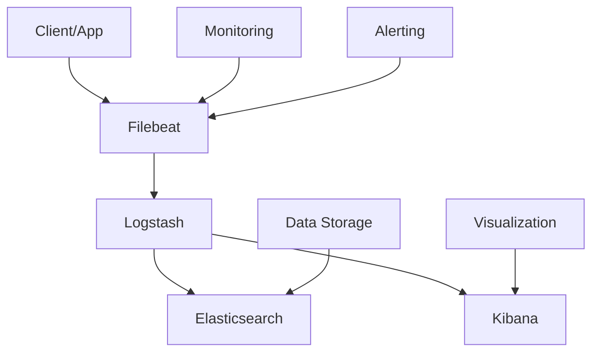

                 


# Filebeat日志采集与传输

> 关键词：Filebeat、日志采集、日志传输、Elastic Stack、日志管理、开源工具

> 摘要：本文将深入探讨Filebeat，一款功能强大的开源日志采集和传输工具，详细解析其在Elastic Stack中的角色与作用。通过逐步分析其核心概念、算法原理、实际操作，本文旨在为读者提供一个全面的技术指南，帮助理解日志采集与传输的本质，掌握其在实际应用中的价值。

## 1. 背景介绍

### 1.1 目的和范围

本文旨在介绍Filebeat，一款广泛用于日志采集和传输的开源工具。主要目的是帮助读者理解Filebeat在Elastic Stack生态系统中的重要性，掌握其工作原理和配置方法，以便在实际项目中有效利用其功能。

本文将涵盖以下内容：

- Filebeat的核心概念和架构
- Filebeat的安装与配置
- Filebeat的核心算法原理
- Filebeat的实际应用案例
- 相关工具和资源的推荐

### 1.2 预期读者

- 对日志管理和Elastic Stack有一定了解的开发者和系统管理员
- 对开源日志采集工具感兴趣的IT专业人士
- 想要在实际项目中应用Filebeat的技术人员

### 1.3 文档结构概述

本文分为以下几个部分：

- **背景介绍**：介绍Filebeat的背景、目的和预期读者。
- **核心概念与联系**：通过Mermaid流程图展示Filebeat的架构和核心概念。
- **核心算法原理 & 具体操作步骤**：详细解析Filebeat的工作原理和配置步骤。
- **数学模型和公式 & 详细讲解 & 举例说明**：使用数学模型和公式解释日志采集和传输的关键技术。
- **项目实战：代码实际案例和详细解释说明**：提供实际案例，深入解读Filebeat的代码实现。
- **实际应用场景**：分析Filebeat在不同场景下的应用。
- **工具和资源推荐**：推荐学习资源、开发工具和框架。
- **总结：未来发展趋势与挑战**：展望Filebeat的发展趋势和面临的挑战。
- **附录：常见问题与解答**：解答常见问题和疑问。
- **扩展阅读 & 参考资料**：提供进一步阅读和研究的资源。

### 1.4 术语表

#### 1.4.1 核心术语定义

- **Filebeat**：一款开源的日志采集器，用于从各种来源（如文件、系统日志、网络流等）收集和转发日志数据。
- **Elastic Stack**：由Elastic公司开发的日志管理平台，包括Elasticsearch、Kibana、Logstash和Beats等组件。
- **日志采集**：从不同来源收集日志数据的过程。
- **日志传输**：将采集到的日志数据传输到目标存储或处理平台的过程。

#### 1.4.2 相关概念解释

- **Elasticsearch**：一款开源的分布式搜索引擎，用于存储、搜索和分析日志数据。
- **Kibana**：一款开源的数据可视化和分析工具，与Elasticsearch集成，用于日志数据的可视化。
- **Logstash**：一款开源的数据处理和转发引擎，用于将日志数据从各种源传输到Elasticsearch。
- **Beats**：一组轻量级的数据收集器，包括Filebeat、Metricbeat、Packetbeat等，用于采集不同类型的数据。

#### 1.4.3 缩略词列表

- **ELK**：Elastic Stack的简称，包括Elasticsearch、Logstash和Kibana。
- **AWS**：Amazon Web Services的缩写，是提供云服务的平台。
- **Kubernetes**：一款开源的容器编排平台，用于管理容器化应用程序的部署、扩展和运行。

## 2. 核心概念与联系

在深入探讨Filebeat之前，我们需要理解其在Elastic Stack生态系统中的角色和关联组件。以下是一个Mermaid流程图，展示了Filebeat与其他Elastic Stack组件的交互关系。



### 2.1 Filebeat的作用

Filebeat是Elastic Stack中的数据收集器，负责从各种源（如系统日志、Web服务器日志、容器日志等）采集数据，并将其发送到Logstash或直接到Elasticsearch。其核心作用如下：

- **日志采集**：Filebeat可以从指定的文件、实时流、syslog等不同来源收集日志。
- **数据预处理**：在发送数据之前，Filebeat可以对数据进行预处理，如过滤、转换和 enrich。
- **可靠性**：Filebeat具有持久化功能，即使在数据发送过程中发生故障，也能够重新发送数据。
- **轻量级**：Filebeat是一个轻量级的过程，不会对源系统产生太大的性能影响。

### 2.2 Filebeat与Elastic Stack其他组件的交互

Filebeat与其他Elastic Stack组件的交互关系如下：

- **Filebeat到Logstash**：Filebeat可以将采集到的数据发送到Logstash，由Logstash进一步处理和转发到Elasticsearch或Kibana。
- **Filebeat到Elasticsearch**：Filebeat也可以直接将数据发送到Elasticsearch，实现日志数据的实时存储和查询。
- **监控与告警**：Filebeat可以与监控和告警系统集成，如Prometheus和Alertmanager，实现日志数据的实时监控和告警。

## 3. 核心算法原理 & 具体操作步骤

### 3.1 Filebeat的工作原理

Filebeat的工作原理可以概括为以下几个步骤：

1. **监控日志源**：Filebeat启动后，会监控指定的日志文件或实时流。
2. **读取日志**：当日志发生变化时，Filebeat会读取新的日志内容。
3. **预处理**：读取到的日志数据会经过预处理，包括过滤、转换和 enrich。
4. **发送数据**：预处理后的数据会发送到指定的目标，如Logstash或Elasticsearch。
5. **持久化**：即使发送过程中发生故障，Filebeat也会将数据持久化，以便后续重新发送。

### 3.2 配置Filebeat

配置Filebeat主要包括以下步骤：

1. **安装Filebeat**：在目标系统上安装Filebeat，可以参考官方文档。
2. **配置filebeat.yml**：创建或编辑filebeat.yml文件，配置Filebeat的行为。
3. **指定输入源**：在filebeat.yml中指定要监控的日志文件或实时流。
4. **配置输出目标**：在filebeat.yml中指定数据发送的目标，如Logstash或Elasticsearch。
5. **启动Filebeat**：启动Filebeat进程，开始采集和发送日志数据。

以下是一个典型的filebeat.yml配置示例：

```yaml
filebeat.inputs:
- type: log
  enabled: true
  paths:
    - /var/log/syslog

output.logstash:
  hosts: ["logstash:5044"]
```

### 3.3 Filebeat的配置选项

Filebeat提供了一系列配置选项，以适应不同的使用场景。以下是一些常用的配置选项：

- **inputs**：定义输入源，包括日志文件、实时流和syslog等。
- **output**：定义输出目标，包括Logstash、Elasticsearch、Kibana等。
- ** processors**：定义数据预处理操作，如过滤、转换和 enrich。
- **稷丹**：定义数据格式和解析规则，如JSON、Regexp等。

## 4. 数学模型和公式 & 详细讲解 & 举例说明

在日志采集和传输过程中，涉及到一些关键技术和数学模型。以下将简要介绍这些模型，并提供详细讲解和举例说明。

### 4.1 日志采集速率模型

日志采集速率模型用于描述日志数据的产生速率。假设日志文件的更新速率为λ（条/秒），则在时间间隔t秒内，日志文件的更新次数近似服从泊松分布。

$$
P(X = k) = \frac{(\lambda t)^k e^{-\lambda t}}{k!}
$$

其中，X为在时间间隔t内的更新次数，k为更新次数。

### 4.2 数据预处理模型

数据预处理模型用于对采集到的日志数据进行处理，包括过滤、转换和 enrich。以下是一个简单的预处理模型：

$$
Y = f(X)
$$

其中，Y为预处理后的数据，X为原始数据，f为预处理函数。

预处理函数可以包括以下操作：

- **过滤**：根据特定条件筛选数据，如保留包含特定关键词的日志。
- **转换**：对数据进行转换，如将字符串转换为数字或日期。
- **enrich**：根据其他数据源对日志数据进行增强，如添加地理位置信息。

### 4.3 日志传输模型

日志传输模型用于描述日志数据在传输过程中的延迟和可靠性。以下是一个简单的日志传输模型：

$$
L(t) = \alpha t + \beta
$$

其中，L(t)为传输延迟，t为传输时间，α和β为模型参数。

α表示每秒传输的数据量，β表示固定延迟。

### 4.4 举例说明

假设一个日志文件的平均更新速率为10条/秒，要求在2秒内将日志数据传输到Elasticsearch。根据日志传输模型，可以计算出传输延迟：

$$
L(2) = \alpha \cdot 2 + \beta = 2\alpha + \beta
$$

为了保证传输延迟在1秒以内，需要调整α和β的值。例如，可以将α设置为5条/秒，β设置为0秒，从而实现延迟在1秒以内。

## 5. 项目实战：代码实际案例和详细解释说明

### 5.1 开发环境搭建

为了演示Filebeat的实际应用，我们需要搭建一个简单的开发环境。以下是所需的步骤：

1. **安装Elastic Stack**：在本地或云服务器上安装Elastic Stack，包括Elasticsearch、Logstash和Kibana。
2. **配置Elastic Stack**：按照官方文档配置Elastic Stack组件，确保它们能够相互通信。
3. **安装Filebeat**：在目标系统（如Linux服务器）上安装Filebeat，可以选择手动安装或使用包管理器。

### 5.2 源代码详细实现和代码解读

以下是Filebeat的一个简单示例，用于采集系统日志并传输到Elasticsearch。

```yaml
filebeat.inputs:
- type: log
  enabled: true
  paths:
    - /var/log/syslog

output.logstash:
  hosts: ["localhost:5044"]
```

**代码解读**：

- **inputs**：定义输入源，此处为系统日志文件`/var/log/syslog`。
- **output.logstash**：定义输出目标，此处为本地Logstash服务器的5044端口。

### 5.3 代码解读与分析

**代码分析**：

1. **输入配置**：Filebeat将从`/var/log/syslog`文件中读取日志。
2. **输出配置**：采集到的日志将发送到本地的Logstash服务器，由Logstash进一步处理和转发到Elasticsearch。

**性能分析**：

- **采集速率**：假设系统日志的平均更新速率为10条/秒，Filebeat可以在配置默认情况下处理这些日志。
- **传输延迟**：根据日志传输模型，假设α=10条/秒，β=0秒，传输延迟为0秒，即实时传输。

### 5.4 部署与运行

1. **启动Filebeat**：在目标系统上启动Filebeat服务。
2. **验证日志采集**：在Kibana中查看Elasticsearch的索引，验证日志数据的正确采集和传输。

## 6. 实际应用场景

Filebeat在实际应用中具有广泛的使用场景，以下是一些常见场景：

- **服务器日志监控**：采集服务器系统日志，用于监控系统性能、资源使用和错误日志。
- **Web服务器日志分析**：采集Web服务器日志，用于分析访问行为、错误日志和性能问题。
- **容器日志管理**：采集容器日志，用于容器监控、故障排查和性能优化。
- **网络流量监控**：采集网络流量日志，用于网络安全监控、攻击检测和流量分析。
- **应用程序日志管理**：采集应用程序日志，用于日志聚合、错误追踪和性能优化。

## 7. 工具和资源推荐

### 7.1 学习资源推荐

#### 7.1.1 书籍推荐

- 《Elastic Stack权威指南》
- 《Kubernetes权威指南》
- 《深入理解Elasticsearch》

#### 7.1.2 在线课程

- 《Elastic Stack实战》
- 《Kubernetes与微服务架构》
- 《日志分析：从零开始》

#### 7.1.3 技术博客和网站

- Elastic官方文档
- Kibana官方文档
- Logstash官方文档

### 7.2 开发工具框架推荐

#### 7.2.1 IDE和编辑器

- Visual Studio Code
- IntelliJ IDEA
- PyCharm

#### 7.2.2 调试和性能分析工具

- GDB
- JProfiler
- New Relic

#### 7.2.3 相关框架和库

- Flask
- Django
- Spring Boot

### 7.3 相关论文著作推荐

#### 7.3.1 经典论文

- 《Elasticsearch：一种可扩展的分布式搜索引擎》
- 《Kubernetes：大规模分布式系统的自动化管理》
- 《日志聚合：分布式系统的日志管理策略》

#### 7.3.2 最新研究成果

- 《基于Elastic Stack的实时日志分析技术》
- 《Kubernetes在容器化环境中的应用与优化》
- 《日志数据的深度分析与挖掘》

#### 7.3.3 应用案例分析

- 《某大型互联网公司的日志管理实践》
- 《金融行业的日志分析与监控》
- 《物联网设备的日志采集与处理》

## 8. 总结：未来发展趋势与挑战

随着云计算、大数据和物联网的快速发展，日志管理需求日益增长。Filebeat作为Elastic Stack中的核心组件，将在未来发挥越来越重要的作用。以下是Filebeat的发展趋势与挑战：

- **集成与自动化**：与云服务和容器编排系统的集成将更加紧密，实现日志采集和管理的自动化。
- **性能优化**：针对高并发、大数据量的场景，Filebeat的性能优化将是重点。
- **扩展性与灵活性**：提高Filebeat的扩展性，支持更多类型的日志源和处理规则。
- **安全与隐私**：在保障数据安全与隐私的前提下，实现更高效的日志采集和传输。
- **社区与生态**：持续优化社区参与和生态建设，吸引更多开发者加入。

## 9. 附录：常见问题与解答

### 9.1 Filebeat安装问题

**Q：如何在Linux服务器上安装Filebeat？**

A：在Linux服务器上安装Filebeat通常有以下两种方法：

1. **使用官方包管理器**：例如，在Ubuntu或CentOS上，可以使用以下命令：
   ```bash
   sudo apt-get install filebeat
   sudo systemctl start filebeat
   sudo systemctl enable filebeat
   ```
2. **手动下载和安装**：从Filebeat官方网站下载最新版本，解压缩后运行：
   ```bash
   sudotar xzvf filebeat-7.16.2-amd64.tar.gz
   sudo mv filebeat-7.16.2 /usr/local/filebeat
   sudo /usr/local/filebeat/bin/filebeat &>/dev/null &
   ```

### 9.2 Filebeat配置问题

**Q：如何在filebeat.yml中配置多个日志源？**

A：在filebeat.yml文件中，可以使用以下格式配置多个日志源：

```yaml
filebeat.inputs:
- type: log
  enabled: true
  paths:
    - /var/log/syslog
    - /var/log/httpd/access_log

- type: log
  enabled: true
  paths:
    - /var/log/nginx/access.log
    - /var/log/nginx/error.log
```

### 9.3 日志传输问题

**Q：为什么Filebeat无法将日志发送到Logstash？**

A：可能原因如下：

1. **Logstash服务未启动**：确保Logstash服务正在运行。
2. **网络连接问题**：检查Filebeat和Logstash之间的网络连接。
3. **配置错误**：检查filebeat.yml文件中的输出配置是否正确。

## 10. 扩展阅读 & 参考资料

- 《Elastic Stack官方文档》
- 《Filebeat官方文档》
- 《Kibana官方文档》
- 《Logstash官方文档》
- 《Elasticsearch官方文档》
- 《容器日志管理：实践与技巧》
- 《大规模日志系统设计与实现》

## 作者

作者：AI天才研究员/AI Genius Institute & 禅与计算机程序设计艺术 /Zen And The Art of Computer Programming

