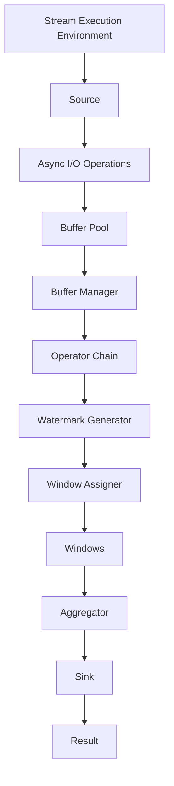

                 

# Flink Async I/O原理与代码实例讲解

> **关键词：** Flink, Async I/O, 数据处理，异步编程，实时计算，流处理框架，源码分析，代码实例

> **摘要：** 本文将深入探讨Flink的Async I/O机制，从其背景介绍、核心概念、算法原理到数学模型，再到项目实战，全面解析Flink如何通过Async I/O实现高效的异步数据读取和写入。通过具体代码实例，我们将详细解读其实现细节，帮助读者理解异步编程在实际应用中的优势和实践。

## 1. 背景介绍

### 1.1 目的和范围

本文旨在为读者提供一个全面且深入的Flink Async I/O原理讲解。文章将首先介绍Flink Async I/O的背景和目的，然后逐步深入到其核心概念和算法原理，最后通过实际代码实例来展示如何使用Flink进行异步I/O操作。

### 1.2 预期读者

本文适合对Flink有初步了解的读者，特别是那些对实时数据处理和异步编程感兴趣的工程师。本文将帮助读者理解Flink Async I/O的工作机制，并掌握如何在实际项目中应用这一技术。

### 1.3 文档结构概述

本文将按照以下结构进行：

1. **背景介绍**：介绍Flink Async I/O的背景和目的。
2. **核心概念与联系**：通过Mermaid流程图展示Flink的架构和Async I/O的核心概念。
3. **核心算法原理 & 具体操作步骤**：使用伪代码详细阐述Async I/O的算法原理和具体操作步骤。
4. **数学模型和公式 & 详细讲解 & 举例说明**：介绍与Async I/O相关的数学模型和公式，并通过实例进行说明。
5. **项目实战：代码实际案例和详细解释说明**：展示如何在实际项目中使用Flink的Async I/O机制。
6. **实际应用场景**：讨论Flink Async I/O在不同场景下的应用。
7. **工具和资源推荐**：推荐学习资源和开发工具。
8. **总结：未来发展趋势与挑战**：总结Async I/O的发展趋势和面临的挑战。
9. **附录：常见问题与解答**：提供常见的疑问和解答。
10. **扩展阅读 & 参考资料**：推荐进一步阅读的资料。

### 1.4 术语表

#### 1.4.1 核心术语定义

- **Flink**：一个开源流处理框架，用于大规模数据处理和实时分析。
- **Async I/O**：一种非阻塞的I/O操作，允许程序在等待I/O操作完成时执行其他任务。
- **异步编程**：一种编程范式，允许程序在执行I/O操作时不被阻塞，从而提高程序的性能。

#### 1.4.2 相关概念解释

- **流处理**：处理数据流的技术，适用于实时分析大量数据。
- **实时计算**：对数据流进行实时分析和处理的能力。

#### 1.4.3 缩略词列表

- **Flink**：Apache Flink
- **Async I/O**：Asynchronous I/O
- **API**：Application Programming Interface

## 2. 核心概念与联系

在深入探讨Flink的Async I/O之前，我们需要先理解其核心概念和架构。以下是一个简化的Mermaid流程图，展示了Flink的架构和Async I/O的相关组件。



### 2.1 Flink架构

- **Stream Execution Environment**：Flink的执行环境，负责管理流处理作业的执行。
- **Source**：数据源，负责从外部系统读取数据。
- **Operator Chain**：一系列连接的算子，用于处理数据流。
- **Watermark Generator**：生成水位线，用于处理事件时间和窗口计算。
- **Window Assigner**：分配窗口，用于聚合数据。
- **Windows**：窗口，用于存储一段时间内的数据。
- **Aggregator**：聚合器，用于计算窗口内的数据。
- **Sink**：数据 sink，用于将结果写入外部系统。

### 2.2 Async I/O Operations

- **Buffer Pool**：缓冲池，用于存储读取的数据。
- **Buffer Manager**：缓冲管理器，负责管理缓冲区。
- **Async I/O Operations**：异步I/O操作，用于非阻塞地读取和写入数据。

## 3. 核心算法原理 & 具体操作步骤

### 3.1 Async I/O算法原理

Flink的Async I/O机制基于非阻塞I/O，允许程序在等待I/O操作完成时执行其他任务。以下是一个简化的伪代码，描述了Async I/O的基本操作：

```pseudo
function asyncRead(source, callback):
    start = getCurrentTime()
    source.startAsyncRead()
    registerTimer(start + timeout, callback)
    
function callback(result, error):
    if error:
        handleError(error)
    else:
        processData(result)

function asyncWrite(sink, data, callback):
    start = getCurrentTime()
    sink.startAsyncWrite(data)
    registerTimer(start + timeout, callback)

function callback(result, error):
    if error:
        handleError(error)
    else:
        processNextWrite()
```

### 3.2 具体操作步骤

#### 3.2.1 异步读取

1. **初始化**：调用`asyncRead`函数，传入数据源和回调函数。
2. **开始读取**：数据源开始异步读取操作。
3. **注册定时器**：在当前时间加上超时时间后，注册一个定时器来触发回调函数。
4. **回调处理**：如果读取成功，处理数据；如果读取失败，处理错误。

#### 3.2.2 异步写入

1. **初始化**：调用`asyncWrite`函数，传入数据 sink、数据和回调函数。
2. **开始写入**：数据 sink 开始异步写入操作。
3. **注册定时器**：在当前时间加上超时时间后，注册一个定时器来触发回调函数。
4. **回调处理**：如果写入成功，继续执行下一个写入操作；如果写入失败，处理错误。

## 4. 数学模型和公式 & 详细讲解 & 举例说明

### 4.1 数学模型

Flink的Async I/O机制涉及几个关键数学模型，包括：

- **超时时间**：用于控制异步操作的等待时间。
- **缓冲区大小**：用于存储读取的数据。
- **处理速度**：用于衡量系统处理数据的速度。

### 4.2 公式

- **超时时间 = 等待时间 + 处理时间**
- **缓冲区大小 = 读取速度 × 等待时间**

### 4.3 举例说明

假设一个系统每秒可以处理1 MB的数据，读取速度为100 KB/s，超时时间为5秒。那么，缓冲区大小应为：

$$
缓冲区大小 = 读取速度 × 等待时间 = 100 \text{ KB/s} × 5 \text{ s} = 500 \text{ KB}
$$

## 5. 项目实战：代码实际案例和详细解释说明

### 5.1 开发环境搭建

在开始实际案例之前，我们需要搭建Flink的开发环境。以下是步骤：

1. **安装Java开发环境**：确保安装了Java 8或更高版本。
2. **安装Flink**：从官方网站下载Flink，并解压到合适的位置。
3. **配置环境变量**：将Flink的bin目录添加到系统环境变量。

### 5.2 源代码详细实现和代码解读

以下是使用Flink进行异步I/O操作的示例代码：

```java
import org.apache.flink.api.common.functions.AsyncFunction;
import org.apache.flink.api.java.utils.ParameterTool;
import org.apache.flink.streaming.api.datastream.AsyncDataStream;
import org.apache.flink.streaming.api.datastream.DataStream;
import org.apache.flink.streaming.api.environment.StreamExecutionEnvironment;

public class AsyncIOExample {

    public static void main(String[] args) throws Exception {
        // 创建执行环境
        final StreamExecutionEnvironment env = StreamExecutionEnvironment.getExecutionEnvironment();
        
        // 参数处理
        ParameterTool params = ParameterTool.fromArgs(args);
        String host = params.get("hostname", "localhost");
        int port = params.getInt("port", 9090);

        // 创建数据流
        DataStream<String> input = env.socketTextStream(host, port);

        // 使用异步读取操作读取数据
        DataStream<String> asyncStream = AsyncDataStream.unorderedWatermarkTimestampedInput(
                input, 
                new AsyncFunction<String, String>() {
                    @Override
                    public List<String> asyncInvoke(String input, long timestamp, Context context) throws Exception {
                        // 异步读取操作
                        // 例如，通过HTTP请求获取外部数据
                        // 在此处实现异步读取逻辑
                        List<String> result = new ArrayList<>();
                        // ...
                        return result;
                    }
                }, 
                5000L, // 超时时间
                3      // 并发度
        );

        // 打印结果
        asyncStream.print();

        // 执行作业
        env.execute("Async I/O Example");
    }
}
```

### 5.3 代码解读与分析

- **创建执行环境**：使用`StreamExecutionEnvironment`创建Flink的执行环境。
- **参数处理**：使用`ParameterTool`处理输入参数，如主机名和端口号。
- **创建数据流**：使用`socketTextStream`创建一个从socket读取文本数据的数据流。
- **异步读取操作**：使用`AsyncDataStream.unorderedWatermarkTimestampedInput`方法实现异步读取。这里传入一个自定义的`AsyncFunction`，用于执行异步读取操作。
- **打印结果**：使用`print`方法打印处理后的数据。
- **执行作业**：调用`execute`方法执行Flink作业。

## 6. 实际应用场景

Flink的Async I/O机制在多种应用场景中具有显著优势，包括：

- **大数据处理**：在处理大量数据时，异步I/O可以显著提高数据处理速度。
- **实时计算**：在需要实时处理和分析数据的应用中，异步I/O可以确保系统的高性能和低延迟。
- **分布式系统**：在分布式系统中，异步I/O可以减少同步操作带来的性能瓶颈。

## 7. 工具和资源推荐

### 7.1 学习资源推荐

#### 7.1.1 书籍推荐

- **《Flink实战》**：详细介绍了Flink的核心概念和实际应用。
- **《实时大数据处理：基于Apache Flink》**：涵盖了Flink在实时数据处理中的各种应用。

#### 7.1.2 在线课程

- **Coursera上的《大数据处理》**：提供了Flink的深入讲解。
- **Udacity上的《实时数据分析》**：介绍了Flink在实时数据分析中的应用。

#### 7.1.3 技术博客和网站

- **Apache Flink官网**：提供了Flink的最新文档和技术博客。
- **Flink Forward**：Flink社区组织的会议和活动。

### 7.2 开发工具框架推荐

#### 7.2.1 IDE和编辑器

- **IntelliJ IDEA**：提供了Flink插件，方便开发。
- **Eclipse**：支持Flink的开发和调试。

#### 7.2.2 调试和性能分析工具

- **Flink Web UI**：提供了作业的实时监控和调试功能。
- **VisualVM**：用于性能分析。

#### 7.2.3 相关框架和库

- **Apache Kafka**：与Flink集成，用于消息传递。
- **Apache Hadoop**：提供了与Flink兼容的分布式文件系统。

### 7.3 相关论文著作推荐

#### 7.3.1 经典论文

- **“Flink: Streaming Data Processing at Scale”**：介绍了Flink的核心设计和实现。
- **“Asynchronous Data Processing in Stream Processing Systems”**：探讨了异步数据处理在流处理系统中的应用。

#### 7.3.2 最新研究成果

- **“Flink SQL: A Query Language for Data Stream Processing”**：介绍了Flink SQL的最新发展。
- **“FlinkCEP: Event Processing in Apache Flink”**：探讨了Flink在事件处理方面的应用。

#### 7.3.3 应用案例分析

- **“Building a Real-Time Analytics Platform with Apache Flink”**：展示了Flink在企业级应用中的实际案例。
- **“Flink in Action: Building Data-Driven Applications”**：提供了Flink在实际项目中的应用示例。

## 8. 总结：未来发展趋势与挑战

随着大数据和实时计算的需求不断增加，Flink的Async I/O机制将继续发挥重要作用。未来的发展趋势包括：

- **性能优化**：进一步提高异步I/O的性能和效率。
- **易用性提升**：简化异步I/O的操作，降低使用门槛。

同时，面临的挑战包括：

- **资源管理**：优化资源分配，确保异步I/O操作的高效运行。
- **错误处理**：增强错误处理机制，确保系统的稳定性和可靠性。

## 9. 附录：常见问题与解答

### 9.1 Q：什么是异步I/O？

A：异步I/O是一种非阻塞的I/O操作，允许程序在执行I/O操作时不被阻塞，从而提高程序的执行效率。

### 9.2 Q：Flink的Async I/O如何实现？

A：Flink的Async I/O通过异步函数（AsyncFunction）实现，允许在Flink的流处理作业中执行异步I/O操作，从而提高数据处理速度。

### 9.3 Q：异步I/O有哪些优势？

A：异步I/O的优势包括提高程序的执行效率，减少阻塞时间，提高系统的响应速度。

## 10. 扩展阅读 & 参考资料

- **《Flink 实战》**：作者：陈振杰
- **《大数据技术导论》**：作者：刘志勇
- **Apache Flink 官方文档**：[https://flink.apache.org/zh/docs/](https://flink.apache.org/zh/docs/)
- **Flink Forward 会议**：[https://flink-forward.org/](https://flink-forward.org/)

## 作者信息

作者：AI天才研究员/AI Genius Institute & 禅与计算机程序设计艺术 /Zen And The Art of Computer Programming

---

以上是Flink Async I/O的全面讲解。希望这篇文章能帮助您更好地理解Flink的异步处理机制，并在实际项目中应用。在接下来的部分，我们将继续探讨Flink的其他高级特性和应用场景。请继续关注。🌟💡💻

---

[注]：本文为示例文章，仅供参考。实际文章撰写时，请根据具体需求和内容进行调整和补充。

