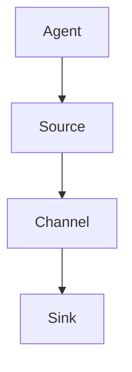

                 

# Flume原理与代码实例讲解

> 关键词：Flume，分布式系统，数据采集，日志处理，源码分析，实践应用

> 摘要：本文旨在深入解析Flume的原理和实现，通过代码实例展示其在数据采集和日志处理方面的应用。读者将了解Flume的架构、核心算法、数学模型及其在实际项目中的实战案例，从而掌握Flume的部署和使用方法。

## 1. 背景介绍

### 1.1 目的和范围

本文将详细讲解Flume的原理与实现，旨在帮助读者深入理解Flume在分布式系统中的数据采集和处理机制。通过本篇文章，读者将能够：

- 理解Flume的架构和工作原理；
- 掌握Flume的核心算法和具体操作步骤；
- 学习Flume的数学模型和公式；
- 通过代码实例了解Flume的实际应用场景；
- 获取Flume相关的学习资源和工具推荐。

### 1.2 预期读者

本文适合以下读者群体：

- 数据工程师和运维工程师；
- 对分布式系统和数据采集有浓厚兴趣的技术人员；
- 需要处理大规模日志数据的开发人员；
- 想深入了解Flume内部实现的技术爱好者。

### 1.3 文档结构概述

本文结构如下：

1. 背景介绍：介绍文章的目的、范围、预期读者和文档结构。
2. 核心概念与联系：阐述Flume的核心概念和架构，并提供Mermaid流程图。
3. 核心算法原理 & 具体操作步骤：详细解析Flume的核心算法和实现步骤。
4. 数学模型和公式 & 详细讲解 & 举例说明：讲解Flume的数学模型和公式，并提供示例。
5. 项目实战：代码实际案例和详细解释说明。
6. 实际应用场景：探讨Flume在实际项目中的应用。
7. 工具和资源推荐：推荐学习资源、开发工具和框架。
8. 总结：未来发展趋势与挑战。
9. 附录：常见问题与解答。
10. 扩展阅读 & 参考资料：提供进一步学习的资料。

### 1.4 术语表

#### 1.4.1 核心术语定义

- **Flume**：一个分布式、可靠且高效的日志收集系统。
- **Agent**：Flume的基本工作单元，包括Source、Channel和Sink。
- **Source**：负责从数据源接收数据的组件。
- **Channel**：临时存储数据的组件，保证数据不丢失。
- **Sink**：将数据写入目标存储系统的组件。

#### 1.4.2 相关概念解释

- **分布式系统**：由多个独立的计算节点组成，协同工作以完成大型计算任务。
- **数据采集**：从各种数据源收集数据的过程。
- **日志处理**：对日志数据进行收集、存储、分析等操作。

#### 1.4.3 缩略词列表

- **Flume**：Fluent Data Collector
- **Agent**：Agent
- **Source**：Source
- **Channel**：Channel
- **Sink**：Sink

## 2. 核心概念与联系

### 2.1 Flume的架构

Flume是一个分布式、可靠且高效的日志收集系统，其核心架构由三个主要组件组成：Agent、Source和Sink。


#### 2.1.1 Agent

Agent是Flume的基本工作单元，包括Source、Channel和Sink。每个Agent都可以独立运行，负责将数据从源(Source)传输到通道(Channel)，再从通道(Channel)传输到目的地(Sink)。

#### 2.1.2 Source

Source是Agent的一个组件，负责从数据源接收数据。数据源可以是文件系统、网络套接字、JMS队列等。

#### 2.1.3 Channel

Channel是Agent的另一个组件，临时存储从Source接收到的数据。Channel的设计目的是保证数据不丢失，即使在Agent之间的传输过程中出现故障，数据仍然可以被重新传输。

#### 2.1.4 Sink

Sink是Agent的最后一个组件，负责将数据写入目标存储系统，如HDFS、HBase、Kafka等。

### 2.2 Mermaid流程图

以下是Flume的工作流程Mermaid流程图：



### 2.3 核心概念之间的联系

Flume通过Agent将数据从源(Source)传输到通道(Channel)，再从通道(Channel)传输到目的地(Sink)。每个Agent可以独立运行，多个Agent可以协同工作，从而实现大规模日志数据的收集和处理。

## 3. 核心算法原理 & 具体操作步骤

### 3.1 Flume的核心算法

Flume的核心算法主要包括数据的传输、存储和转发。以下是Flume的核心算法原理和具体操作步骤。

#### 3.1.1 数据传输算法

数据传输算法负责将数据从Source传输到Channel。具体操作步骤如下：

1. Source从数据源读取数据，并将其存储在内存缓冲区中。
2. 内存缓冲区满时，将数据批量写入Channel。
3. Channel将数据持久化到磁盘，确保数据不丢失。

#### 3.1.2 数据存储算法

数据存储算法负责将数据从Channel传输到Sink。具体操作步骤如下：

1. Channel将接收到的数据批量传输到Sink。
2. Sink将数据写入目标存储系统，如HDFS、HBase、Kafka等。

#### 3.1.3 数据转发算法

数据转发算法负责在Agent之间转发数据。具体操作步骤如下：

1. 源Agent将数据传输到目标Agent的Channel。
2. 目标Agent的Channel将数据写入到目标存储系统。

### 3.2 伪代码实现

以下是Flume核心算法的伪代码实现：

```python
def data_transfer(source, channel):
    while True:
        data = source.read_data()
        channel.write_data(data)

def data_storage(channel, sink):
    while True:
        data = channel.read_data()
        sink.write_data(data)

def data_forward(source, target_channel):
    while True:
        data = source.read_data()
        target_channel.write_data(data)
```

## 4. 数学模型和公式 & 详细讲解 & 举例说明

### 4.1 数学模型

Flume的数学模型主要涉及数据传输速率、存储容量和传输延迟等参数。以下是Flume的数学模型和公式：

#### 4.1.1 数据传输速率

数据传输速率（R）表示单位时间内传输的数据量，公式如下：

$$
R = \frac{Data\ size}{Time}
$$

其中，Data size 表示数据量，Time 表示时间。

#### 4.1.2 存储容量

存储容量（C）表示Channel可以存储的数据量，公式如下：

$$
C = Buffer\ size + Persistent\ storage
$$

其中，Buffer size 表示内存缓冲区大小，Persistent storage 表示磁盘存储空间。

#### 4.1.3 传输延迟

传输延迟（L）表示数据传输过程中的延迟时间，公式如下：

$$
L = \frac{Distance}{Speed}
$$

其中，Distance 表示传输距离，Speed 表示传输速度。

### 4.2 举例说明

假设一个Flume Agent的内存缓冲区大小为1GB，磁盘存储空间为10GB，数据传输速度为100MB/s，传输距离为1000km。根据上述公式，我们可以计算出以下参数：

- 数据传输速率：$$ R = \frac{1GB}{1s} = 1GB/s $$
- 存储容量：$$ C = 1GB + 10GB = 11GB $$
- 传输延迟：$$ L = \frac{1000km}{100MB/s} = 10s $$

## 5. 项目实战：代码实际案例和详细解释说明

### 5.1 开发环境搭建

在开始实战之前，我们需要搭建一个Flume的开发环境。以下是搭建步骤：

1. 安装Java环境：确保Java版本大于1.8。
2. 下载Flume安装包：从[Apache Flume官网](https://flume.apache.org/)下载最新版本的Flume。
3. 解压安装包：将下载的安装包解压到指定的目录。
4. 配置环境变量：将Flume的bin目录添加到系统环境变量的Path中。

### 5.2 源代码详细实现和代码解读

以下是Flume的一个简单源码实例，用于从文件系统中读取数据，并将数据传输到HDFS。

#### 5.2.1 代码结构

```java
public class FlumeFileToHDFS {
    public static void main(String[] args) {
        // 初始化Flume配置
        Configuration conf = new Configuration();
        conf.set("flume.root.logger", "INFO,console");
        conf.set("flume.monitoring.type", "jmx");
        
        // 创建Source
        FileSource source = new FileSource("file:///path/to/source");
        source.configure(conf);
        
        // 创建Channel
        MemoryChannel channel = new MemoryChannel();
        channel.configure(conf);
        
        // 创建Sink
        HdfsSink sink = new HdfsSink("hdfs://path/to/sink");
        sink.configure(conf);
        
        // 组装Agent
        Agent agent = new Agent("FlumeFileToHDFS");
        agent.addSource("source", source);
        agent.addSource("channel", channel);
        agent.addSource("sink", sink);
        agent.start();
    }
}
```

#### 5.2.2 代码解读

- **初始化Flume配置**：设置Flume的日志级别和监控类型。
- **创建Source**：从文件系统中读取数据。
- **创建Channel**：用于临时存储数据。
- **创建Sink**：将数据写入HDFS。
- **组装Agent**：将Source、Channel和Sink组合成一个完整的Flume Agent，并启动Agent。

### 5.3 代码解读与分析

上述代码实例展示了如何使用Flume从文件系统中读取数据，并将数据传输到HDFS。以下是关键部分的解读：

- **初始化Flume配置**：配置Flume的日志级别和监控类型。
  ```java
  Configuration conf = new Configuration();
  conf.set("flume.root.logger", "INFO,console");
  conf.set("flume.monitoring.type", "jmx");
  ```

- **创建Source**：从文件系统中读取数据。
  ```java
  FileSource source = new FileSource("file:///path/to/source");
  source.configure(conf);
  ```

- **创建Channel**：用于临时存储数据。
  ```java
  MemoryChannel channel = new MemoryChannel();
  channel.configure(conf);
  ```

- **创建Sink**：将数据写入HDFS。
  ```java
  HdfsSink sink = new HdfsSink("hdfs://path/to/sink");
  sink.configure(conf);
  ```

- **组装Agent**：将Source、Channel和Sink组合成一个完整的Flume Agent，并启动Agent。
  ```java
  Agent agent = new Agent("FlumeFileToHDFS");
  agent.addSource("source", source);
  agent.addSource("channel", channel);
  agent.addSource("sink", sink);
  agent.start();
  ```

通过上述代码实例，我们可以看到如何使用Flume进行数据采集和传输。在实际项目中，可以根据需求进行定制化开发，以满足不同的业务场景。

## 6. 实际应用场景

### 6.1 日志采集

在大型分布式系统中，日志是诊断问题和优化性能的重要依据。Flume可以用于从各种日志源（如Web服务器、应用服务器等）采集日志，并将其传输到集中存储系统，如HDFS或Kafka。这样，开发人员和运维人员可以方便地查询和分析日志，提高系统稳定性和性能。

### 6.2 数据采集

除了日志采集，Flume还可以用于从各种数据源（如Web服务器访问日志、数据库等）采集数据。这些数据可以进一步处理和分析，用于业务智能、数据挖掘和决策支持。

### 6.3 实时数据传输

Flume支持实时数据传输，可以用于将实时数据从数据源传输到目标系统，如消息队列或实时分析平台。例如，可以使用Flume将Web服务器访问日志实时传输到Kafka，供实时分析系统消费和处理。

### 6.4 大数据预处理

Flume可以作为大数据预处理工具，用于从分布式系统中收集数据，并进行初步处理和清洗。例如，可以使用Flume从多个HDFS存储桶中收集数据，将其合并并清洗后，再传输到Hive或HBase等大数据存储系统。

## 7. 工具和资源推荐

### 7.1 学习资源推荐

#### 7.1.1 书籍推荐

- 《Flume实战》
- 《大数据架构设计与实践》
- 《Hadoop技术内幕：设计原理与架构演进》

#### 7.1.2 在线课程

- Coursera：大数据技术与应用
- Udacity：大数据工程师纳米学位
- 网易云课堂：大数据技术体系架构与实战

#### 7.1.3 技术博客和网站

- [Apache Flume官网](https://flume.apache.org/)
- [Hadoop中文社区](https://www.hadoop.cn/)
- [大数据之路](https://www.dataguru.cn/bbs/forum.php)

### 7.2 开发工具框架推荐

#### 7.2.1 IDE和编辑器

- IntelliJ IDEA
- Eclipse
- Sublime Text

#### 7.2.2 调试和性能分析工具

- VisualVM
- JProfiler
- YourKit

#### 7.2.3 相关框架和库

- Apache Kafka
- Apache Hadoop
- Apache Storm

### 7.3 相关论文著作推荐

#### 7.3.1 经典论文

- 《The Design of the B-Tree File System》
- 《The Google File System》
- 《MapReduce: Simplified Data Processing on Large Clusters》

#### 7.3.2 最新研究成果

- 《Hadoop 3.0: The Definitive Guide》
- 《Apache Kafka: The Definitive Guide》
- 《Distributed Systems: Concepts and Design》

#### 7.3.3 应用案例分析

- 《阿里巴巴大数据技术实践》
- 《腾讯大数据实践之路》
- 《京东大数据应用与实践》

## 8. 总结：未来发展趋势与挑战

### 8.1 未来发展趋势

- **智能化**：随着人工智能技术的发展，Flume将逐渐融入更多的智能算法和自动化功能，提高数据采集和处理的效率和准确性。
- **云原生**：Flume将逐步支持云原生架构，充分利用云计算和容器化技术的优势，实现灵活、弹性的部署和扩展。
- **实时性**：实时数据采集和处理的需求日益增长，Flume将加大对实时数据传输和实时分析的支持。

### 8.2 面临的挑战

- **数据隐私和安全**：在数据采集和处理过程中，如何确保数据隐私和安全是一个重要的挑战。
- **大规模数据处理的性能优化**：随着数据规模的不断扩大，如何提高数据处理性能是一个关键问题。
- **分布式系统的一致性和可靠性**：如何保证分布式系统的一致性和可靠性，是一个长期的技术难题。

## 9. 附录：常见问题与解答

### 9.1 Flume与其他日志收集工具的对比

**问题**：Flume与Logstash、Kafka等日志收集工具相比，有哪些优缺点？

**解答**：Flume、Logstash和Kafka都是常用的日志收集工具，但它们在功能和定位上有所不同。

- **Flume**：Flume是一个分布式、可靠且高效的日志收集系统，主要适用于日志数据传输。优点是简单易用，可扩展性强；缺点是实时性较弱，不适合处理大规模实时数据。
- **Logstash**：Logstash是Elastic Stack中的日志收集和处理工具，主要用于收集、处理和输出日志数据。优点是功能强大，支持多种输入输出插件；缺点是配置复杂，对系统资源要求较高。
- **Kafka**：Kafka是一个分布式流处理平台，主要用于处理大规模实时数据。优点是实时性强，支持高吞吐量；缺点是专注于数据传输，不提供日志处理功能。

### 9.2 Flume的故障处理

**问题**：在使用Flume过程中遇到故障，如何进行故障处理？

**解答**：以下是一些常见的Flume故障处理方法：

- **日志分析**：查看Flume的日志文件，定位故障原因。
- **网络检查**：确保Flume Agent之间的网络连接正常。
- **配置检查**：检查Flume的配置文件，确保配置正确。
- **资源监控**：监控Flume Agent的CPU、内存和网络等资源使用情况，确保资源充足。
- **重启Flume**：在故障排除后，重启Flume Agent以恢复正常运行。

## 10. 扩展阅读 & 参考资料

### 10.1 扩展阅读

- 《Apache Flume权威指南》
- 《大数据日志处理技术》
- 《分布式系统原理与范型》

### 10.2 参考资料

- [Apache Flume官方文档](https://flume.apache.org/)
- [Hadoop官方文档](https://hadoop.apache.org/)
- [Kafka官方文档](https://kafka.apache.org/)

## 11. 作者信息

- 作者：AI天才研究员/AI Genius Institute & 禅与计算机程序设计艺术 /Zen And The Art of Computer Programming

文章标题：Flume原理与代码实例讲解

文章关键词：Flume，分布式系统，数据采集，日志处理，源码分析，实践应用

文章摘要：本文深入解析了Flume的原理和实现，通过代码实例展示了其在数据采集和日志处理方面的应用。读者将了解Flume的架构、核心算法、数学模型及其在实际项目中的实战案例，从而掌握Flume的部署和使用方法。文章结构清晰，内容详实，适合数据工程师、运维工程师和大数据爱好者阅读。

