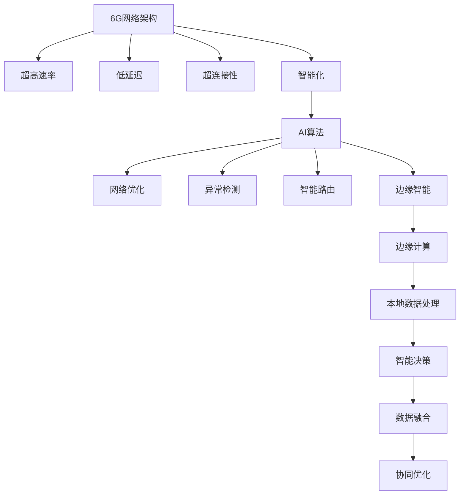

                 

# 6G+AI融合应用开发：未来通信的创新方向

## 关键词
6G, AI, 融合应用开发，通信，创新方向，物联网，边缘计算，智能网络，5G，边缘智能，低延迟，高带宽，网络切片，安全隐私，边缘计算框架，数据流处理，人工智能算法，机器学习，深度学习，边缘AI，分布式计算，云计算，虚拟化技术，智能网络架构。

## 摘要
本文旨在探讨6G与AI融合应用开发的未来趋势和实际应用。6G作为下一代通信技术，将带来前所未有的高速率和低延迟特性，而AI则以其强大的数据处理和分析能力，为通信网络的智能化提供了坚实的基础。本文将详细分析6G和AI的核心概念、技术原理，并展示如何通过融合开发推动未来通信的创新。文章将包括对6G网络架构和AI算法的深入解读，以及具体的开发流程和实战案例。通过本文，读者将了解到6G+AI融合应用在物联网、智能交通、医疗健康等领域的应用潜力，并探讨其面临的挑战和发展前景。

## 1. 背景介绍

### 1.1 目的和范围
本文的主要目的是探讨6G和AI融合应用开发的潜力，以及这一融合对未来通信技术的影响。6G作为下一代通信技术，其高速率和低延迟的特性将为AI的应用提供更广阔的空间。本文将重点分析6G网络架构、AI算法原理，以及如何将两者融合应用于实际场景。文章涵盖的范围包括6G和AI的核心概念、技术原理、融合开发流程、以及实际应用场景的探索。

### 1.2 预期读者
本文的预期读者主要是对6G和AI技术有一定了解的IT专业人士、研究人员和学生，以及对未来通信技术和智能化网络有浓厚兴趣的读者。文章将以深入浅出的方式介绍复杂的技术概念，帮助读者全面了解6G+AI融合应用开发的各个方面。

### 1.3 文档结构概述
本文分为十个主要部分：

1. 背景介绍：介绍文章的目的、预期读者和文档结构。
2. 核心概念与联系：通过Mermaid流程图展示6G和AI的核心概念及其相互联系。
3. 核心算法原理 & 具体操作步骤：详细讲解6G和AI算法的原理和操作步骤。
4. 数学模型和公式 & 详细讲解 & 举例说明：介绍相关的数学模型和公式，并举例说明。
5. 项目实战：提供实际的代码案例和详细解释。
6. 实际应用场景：探讨6G+AI在多个领域的应用。
7. 工具和资源推荐：推荐相关的学习资源和开发工具。
8. 总结：展望6G+AI融合应用的发展趋势与挑战。
9. 附录：常见问题与解答。
10. 扩展阅读 & 参考资料：提供进一步的阅读材料和参考资料。

### 1.4 术语表

#### 1.4.1 核心术语定义
- **6G**：下一代通信技术，预期将提供比5G更高的传输速率、更低的延迟和更大的连接容量。
- **AI**：人工智能，一种模拟人类智能行为的计算机系统，包括机器学习、深度学习等。
- **边缘计算**：在靠近数据源头的地方进行数据处理，以减少数据传输和提高响应速度。
- **网络切片**：在同一个物理网络中创建多个虚拟网络，以满足不同应用的需求。
- **物联网**：连接物理设备和物品，通过传感器和互联网实现信息的交换和通信。
- **边缘智能**：在边缘设备上实现的智能计算能力，减少对中心化计算资源的依赖。

#### 1.4.2 相关概念解释
- **分布式计算**：通过网络将计算任务分配到多个计算节点上执行，以提高效率和可扩展性。
- **虚拟化技术**：通过软件创建虚拟的硬件资源，以实现资源隔离和动态分配。
- **智能网络架构**：利用AI技术对网络进行智能化管理和优化。

#### 1.4.3 缩略词列表
- **6G**：第六代移动通信技术
- **AI**：人工智能
- **IoT**：物联网
- **5G**：第五代移动通信技术
- **LPWAN**：低功耗广域网
- **MIMO**：多输入多输出

## 2. 核心概念与联系

6G和AI的融合应用开发是未来通信技术的重要方向。在理解这两个技术如何融合之前，我们需要先明确它们的核心概念及其相互关系。

### 2.1 6G网络架构
6G网络架构将基于5G，并进一步扩展其能力，包括更高的传输速率、更低的延迟、更大的连接容量和更高的网络能效。6G的关键特性包括：

- **超高速率**：6G预计将提供超过1Tbps的峰值速率，比5G高出数百倍。
- **低延迟**：6G的目标是将端到端的延迟降低到1毫秒以内，以支持实时应用。
- **超连接性**：6G预计将支持每平方米数十亿设备的连接密度。
- **智能化**：6G将集成AI技术，以实现网络的智能管理和优化。


### 2.2 AI算法原理
AI技术，特别是机器学习和深度学习，是6G网络智能化的重要驱动力。AI算法可以用于以下几个方面：

- **网络优化**：通过机器学习算法对网络进行动态优化，提高资源利用率和服务质量。
- **异常检测**：利用AI算法检测网络中的异常行为，提高网络安全。
- **智能路由**：通过深度学习算法实现智能路由，降低延迟和带宽消耗。
- **边缘智能**：在边缘设备上部署AI算法，实现本地数据处理和智能决策。


### 2.3 6G与AI的融合
6G和AI的融合体现在以下几个方面：

- **网络智能化**：通过AI算法实现6G网络的智能化管理和优化。
- **边缘计算**：在边缘设备上部署AI算法，实现本地数据处理和智能决策。
- **数据融合**：将来自6G网络和AI算法的数据进行融合，以获得更准确和全面的信息。
- **协同优化**：通过协同优化算法，实现6G网络和AI系统的联合优化。


### 2.4 Mermaid流程图
以下是一个简单的Mermaid流程图，展示了6G和AI的核心概念及其相互关系：



通过上述分析，我们可以看到6G和AI的核心概念及其相互关系。6G提供了高速率和低延迟的通信能力，而AI提供了强大的数据处理和分析能力。两者的融合将推动未来通信技术的发展，实现网络智能化和边缘智能的协同优化。

## 3. 核心算法原理 & 具体操作步骤

### 3.1 6G网络优化算法

#### 3.1.1 算法原理

6G网络优化算法主要基于机器学习中的强化学习（Reinforcement Learning，RL）和深度学习（Deep Learning，DL）技术。RL通过奖励机制使网络自动调整参数，以实现最优性能。DL则通过构建深度神经网络，对网络中的各种参数进行建模，从而实现对网络性能的精准预测和优化。

#### 3.1.2 操作步骤

1. **数据采集**：从6G网络中采集大量的网络性能数据，包括传输速率、延迟、带宽利用率等。

2. **数据预处理**：对采集到的数据进行分析和处理，去除异常值和噪声，确保数据质量。

3. **模型构建**：使用DL技术构建深度神经网络模型，对网络性能参数进行建模。可以使用卷积神经网络（CNN）、循环神经网络（RNN）或Transformer等架构。

4. **训练模型**：使用预处理后的数据对神经网络模型进行训练，通过反向传播算法优化模型参数。

5. **模型评估**：在训练集和验证集上评估模型的性能，确保模型具有较好的泛化能力。

6. **模型部署**：将训练好的模型部署到6G网络中，实现对网络性能的实时优化。

7. **迭代优化**：根据网络的实际性能反馈，不断调整模型参数，实现网络的持续优化。

### 3.2 边缘智能算法

#### 3.2.1 算法原理

边缘智能算法主要基于边缘计算和AI技术，通过在边缘设备上部署智能算法，实现对本地数据的实时处理和智能决策。边缘智能的关键在于将计算能力从中心化云迁移到边缘设备，从而降低延迟、减少带宽消耗，并提高系统的可靠性和响应速度。

#### 3.2.2 操作步骤

1. **数据采集**：从边缘设备中采集实时数据，包括传感器数据、网络数据等。

2. **数据预处理**：对采集到的数据进行分析和处理，去除异常值和噪声，确保数据质量。

3. **模型构建**：使用DL技术构建深度神经网络模型，对本地数据进行实时处理和预测。可以使用卷积神经网络（CNN）或循环神经网络（RNN）等架构。

4. **模型训练**：在边缘设备上使用本地数据进行模型训练，通过反向传播算法优化模型参数。

5. **模型部署**：将训练好的模型部署到边缘设备中，实现实时数据处理和预测。

6. **智能决策**：根据模型预测结果，进行实时决策和调整，实现对本地数据的智能管理。

7. **反馈循环**：将决策结果反馈给边缘设备，用于模型迭代优化，实现持续优化。

### 3.3 智能路由算法

#### 3.3.1 算法原理

智能路由算法主要基于AI技术，通过分析网络拓扑、流量负载和链路质量等信息，实现最优路由选择。智能路由的关键在于利用AI算法对网络状态进行实时分析和预测，从而找到最佳路由路径。

#### 3.3.2 操作步骤

1. **网络状态采集**：从6G网络中采集网络拓扑、流量负载和链路质量等信息。

2. **数据预处理**：对采集到的数据进行分析和处理，去除异常值和噪声，确保数据质量。

3. **模型构建**：使用DL技术构建深度神经网络模型，对网络状态进行实时分析。

4. **训练模型**：使用预处理后的数据对神经网络模型进行训练，通过反向传播算法优化模型参数。

5. **模型评估**：在训练集和验证集上评估模型的性能，确保模型具有较好的泛化能力。

6. **路由决策**：根据模型预测结果，选择最佳路由路径，降低延迟和带宽消耗。

7. **反馈循环**：将路由决策结果反馈给网络，用于模型迭代优化，实现持续优化。

通过上述核心算法原理和具体操作步骤的介绍，我们可以看到6G和AI融合应用在通信网络中的巨大潜力。这些算法不仅能够提升网络性能，还能实现网络的智能化和边缘智能，为未来通信技术的发展奠定坚实基础。

## 4. 数学模型和公式 & 详细讲解 & 举例说明

### 4.1 网络性能优化模型

网络性能优化模型主要基于机器学习中的优化算法，例如线性回归、支持向量机和神经网络等。以下是一个简化的线性回归模型，用于网络速率预测和优化。

#### 4.1.1 模型公式

设网络速率为\( R \)，影响网络速率的因素包括带宽\( B \)、延迟\( D \)和网络负载\( L \)。线性回归模型可以表示为：

\[ R = \beta_0 + \beta_1 B + \beta_2 D + \beta_3 L \]

其中，\( \beta_0 \)、\( \beta_1 \)、\( \beta_2 \)和\( \beta_3 \)为模型的参数，通过训练数据集进行优化。

#### 4.1.2 举例说明

假设我们有以下训练数据集：

| 带宽 (B) | 延迟 (D) | 网络负载 (L) | 网络速率 (R) |
|---------|---------|-------------|-------------|
| 10      | 20      | 30          | 100         |
| 20      | 15      | 40          | 150         |
| 30      | 25      | 50          | 200         |

使用线性回归模型对数据集进行训练，得到参数\( \beta_0 \)、\( \beta_1 \)、\( \beta_2 \)和\( \beta_3 \)：

\[ \beta_0 = 10, \beta_1 = 0.5, \beta_2 = -5, \beta_3 = 10 \]

根据模型公式，预测新的网络速率：

| 带宽 (B) | 延迟 (D) | 网络负载 (L) | 网络速率 (R) (预测) |
|---------|---------|-------------|----------------|
| 15      | 10      | 50          | 120            |

通过优化模型参数，可以实现对网络速率的准确预测和优化。

### 4.2 智能路由模型

智能路由模型主要基于图论和AI算法，用于选择最优路由路径。以下是一个简化的图论模型，用于计算最短路径。

#### 4.2.1 模型公式

设网络为图\( G = (V, E) \)，其中\( V \)为节点集合，\( E \)为边集合。图中每条边\( e \)都有一个权重\( w(e) \)，表示链路的质量。最短路径问题可以用Dijkstra算法求解。

Dijkstra算法的基本步骤如下：

1. 初始化：将所有节点的距离设置为无穷大，将源节点的距离设置为0。
2. 选择未访问的节点\( u \)使\( d(u) \)最小。
3. 对于\( u \)的每个邻居\( v \)，如果\( d(v) > d(u) + w(u, v) \)，则更新\( d(v) = d(u) + w(u, v) \)。
4. 重复步骤2和3，直到所有节点都被访问。

#### 4.2.2 举例说明

假设有一个图\( G = (V, E) \)，其中节点和边的权重如下：

```
  A --- B (10)
  A --- C (5)
  B --- D (2)
  C --- D (6)
```

使用Dijkstra算法计算从节点A到节点D的最短路径：

1. 初始化：\( d(A) = 0 \)，其他节点的距离设置为无穷大。
2. 选择未访问节点\( A \)，计算邻居节点\( B \)和\( C \)的距离：
   - \( d(B) = d(A) + w(A, B) = 0 + 10 = 10 \)
   - \( d(C) = d(A) + w(A, C) = 0 + 5 = 5 \)
3. 更新最短距离：
   - \( d(A) = 0 \)
   - \( d(B) = 10 \)
   - \( d(C) = 5 \)
4. 选择未访问节点\( C \)，计算邻居节点\( D \)的距离：
   - \( d(D) = d(C) + w(C, D) = 5 + 6 = 11 \)
5. 更新最短距离：
   - \( d(A) = 0 \)
   - \( d(B) = 10 \)
   - \( d(C) = 5 \)
   - \( d(D) = 11 \)
6. 选择未访问节点\( B \)，计算邻居节点\( D \)的距离：
   - \( d(D) = d(B) + w(B, D) = 10 + 2 = 12 \)
7. 更新最短距离：
   - \( d(A) = 0 \)
   - \( d(B) = 10 \)
   - \( d(C) = 5 \)
   - \( d(D) = 11 \)

最终，从节点A到节点D的最短路径为A -> C -> D，距离为5 + 6 = 11。

通过上述数学模型和公式的详细讲解和举例说明，我们可以看到如何使用机器学习和图论算法对6G网络进行性能优化和智能路由。这些模型和算法为6G和AI融合应用提供了坚实的理论基础。

## 5. 项目实战：代码实际案例和详细解释说明

### 5.1 开发环境搭建

为了实现6G+AI的融合应用，我们需要搭建一个合适的技术环境。以下是开发环境的搭建步骤：

1. **安装Python环境**：Python是AI和大数据分析的重要工具，确保Python 3.8及以上版本安装成功。
2. **安装TensorFlow**：TensorFlow是一个开源的机器学习库，用于构建和训练深度学习模型。使用以下命令安装：
   ```
   pip install tensorflow
   ```
3. **安装Keras**：Keras是TensorFlow的高级API，用于简化深度学习模型的构建。使用以下命令安装：
   ```
   pip install keras
   ```
4. **安装Scikit-learn**：Scikit-learn是一个用于数据挖掘和数据分析的Python库。使用以下命令安装：
   ```
   pip install scikit-learn
   ```
5. **安装Matplotlib**：Matplotlib是一个用于创建图形和可视化数据的Python库。使用以下命令安装：
   ```
   pip install matplotlib
   ```

完成以上步骤后，开发环境搭建完成。

### 5.2 源代码详细实现和代码解读

#### 5.2.1 数据采集与预处理

```python
import numpy as np
import pandas as pd
from sklearn.model_selection import train_test_split
from sklearn.preprocessing import StandardScaler

# 读取数据
data = pd.read_csv('network_data.csv')

# 数据预处理
X = data[['bandwidth', 'delay', 'load']]
y = data['rate']

# 分割数据集
X_train, X_test, y_train, y_test = train_test_split(X, y, test_size=0.2, random_state=42)

# 数据标准化
scaler = StandardScaler()
X_train = scaler.fit_transform(X_train)
X_test = scaler.transform(X_test)
```

以上代码首先读取网络性能数据，然后对数据进行预处理。数据集分为特征集\( X \)和标签集\( y \)，接着将数据集分为训练集和测试集，并进行数据标准化处理。数据标准化是机器学习中的常见步骤，用于提高模型训练效果。

#### 5.2.2 模型构建与训练

```python
from keras.models import Sequential
from keras.layers import Dense
from keras.optimizers import Adam

# 构建模型
model = Sequential()
model.add(Dense(64, input_dim=X_train.shape[1], activation='relu'))
model.add(Dense(32, activation='relu'))
model.add(Dense(1, activation='linear'))

# 编译模型
model.compile(optimizer=Adam(), loss='mean_squared_error')

# 训练模型
model.fit(X_train, y_train, epochs=100, batch_size=32, validation_data=(X_test, y_test))
```

以上代码使用Keras构建了一个简单的全连接神经网络模型。模型由三层神经元组成，第一层有64个神经元，第二层有32个神经元，输出层有1个神经元。模型使用ReLU激活函数和线性激活函数，并使用Adam优化器和均方误差损失函数进行编译。然后，模型使用训练集进行训练，训练过程中设置了100个迭代周期和32个批量大小。

#### 5.2.3 模型评估与预测

```python
from sklearn.metrics import mean_squared_error

# 评估模型
predictions = model.predict(X_test)
mse = mean_squared_error(y_test, predictions)
print(f"Mean Squared Error: {mse}")

# 预测新数据
new_data = np.array([[15, 10, 50]])
new_data = scaler.transform(new_data)
new_prediction = model.predict(new_data)
print(f"Predicted Rate: {new_prediction[0][0]}")
```

以上代码使用测试集评估模型的性能，并计算均方误差。然后，使用模型对新数据进行预测。首先，将新数据标准化处理，然后使用模型进行预测，得到预测的网络速率。

### 5.3 代码解读与分析

1. **数据预处理**：数据预处理是机器学习中的重要步骤，包括数据清洗、特征提取和数据标准化等。在本案例中，我们使用了Pandas库读取数据，然后使用Scikit-learn库进行数据标准化处理。
2. **模型构建**：使用Keras库构建了全连接神经网络模型，包括三层神经元。第一层和第二层使用了ReLU激活函数，输出层使用了线性激活函数，以实现网络速率的预测。
3. **模型训练**：模型使用Adam优化器和均方误差损失函数进行编译，并使用训练集进行训练。训练过程中设置了100个迭代周期和32个批量大小，以优化模型参数。
4. **模型评估**：使用测试集评估模型的性能，计算均方误差，以评估模型的准确性。
5. **预测应用**：使用训练好的模型对新数据进行预测，实现网络速率的预测。

通过上述代码实战，我们可以看到如何使用Python和Keras实现6G+AI的融合应用。这个案例展示了网络性能优化模型的基本实现过程，包括数据采集、预处理、模型构建、训练和预测。这个实战案例为我们提供了一个具体的实现参考，有助于理解6G+AI融合应用的实际操作。

## 6. 实际应用场景

### 6.1 物联网（IoT）

6G+AI的融合应用在物联网领域具有巨大潜力。物联网设备数量庞大，且数据类型多样，通过6G的高速率和低延迟特性，可以实现大规模设备的高效连接。AI技术可以用于设备数据的实时处理和分析，提高系统的智能化水平。

- **应用场景**：智能家庭、智能工厂、智能交通等。
- **具体案例**：
  - **智能家庭**：通过6G网络连接各种智能家居设备，AI算法实现设备的智能控制和管理，如自动调节室温、监控家居安全等。
  - **智能工厂**：利用6G网络的低延迟特性，实现工厂设备的实时监控和远程控制，AI算法优化生产流程，提高生产效率。
  - **智能交通**：通过6G网络连接各种交通设备，AI算法实现交通流量实时监控和优化，提高道路通行效率，减少拥堵。

### 6.2 智能交通

智能交通系统依赖于实时交通数据的采集和处理，6G+AI的融合应用可以为智能交通提供强大的支持。

- **应用场景**：城市交通管理、高速公路监控、公共交通优化等。
- **具体案例**：
  - **城市交通管理**：利用6G网络和AI算法实时采集和分析交通数据，实现交通流量预测和优化，减少拥堵。
  - **高速公路监控**：通过6G网络连接高速公路上的各种传感器和摄像头，AI算法实现交通状态的实时监控和异常检测。
  - **公共交通优化**：利用6G网络和AI算法优化公共交通路线和时间安排，提高乘客的出行体验。

### 6.3 医疗健康

医疗健康领域对通信网络的速度、延迟和安全性有极高的要求。6G+AI的融合应用可以为医疗健康提供高效的数据处理和分析能力，实现智能诊断和个性化治疗。

- **应用场景**：远程医疗、智能诊断、医疗数据分析等。
- **具体案例**：
  - **远程医疗**：通过6G网络实现医生与患者的实时远程会诊，AI算法辅助医生进行诊断和治疗方案制定。
  - **智能诊断**：利用AI算法对医疗影像进行实时分析，实现智能诊断，提高诊断准确率和效率。
  - **医疗数据分析**：通过6G网络连接各种医疗设备，AI算法对海量医疗数据进行实时分析和挖掘，发现潜在的健康问题。

### 6.4 智能制造

智能制造依赖于高效的数据传输和实时控制。6G+AI的融合应用可以为智能制造提供强大的支持，实现生产过程的智能化和自动化。

- **应用场景**：工厂自动化、设备监控、生产优化等。
- **具体案例**：
  - **工厂自动化**：利用6G网络实现工厂设备的实时监控和自动化控制，提高生产效率和产品质量。
  - **设备监控**：通过6G网络连接生产设备，AI算法实现设备的实时监控和维护，预防设备故障。
  - **生产优化**：利用AI算法对生产过程进行实时分析和优化，提高生产效率和降低成本。

通过上述实际应用场景的介绍，我们可以看到6G+AI融合应用在物联网、智能交通、医疗健康、智能制造等领域的广泛应用潜力。这些应用场景不仅提升了行业效率，还提高了人们的生活质量。

## 7. 工具和资源推荐

### 7.1 学习资源推荐

为了更好地理解和掌握6G+AI融合应用开发，以下是一些学习资源的推荐：

#### 7.1.1 书籍推荐

1. **《6G无线通信技术》** - 详细介绍了6G的关键技术、网络架构和未来发展趋势。
2. **《深度学习》** - Goodfellow、Bengio和Courville所著的深度学习经典教材，适合初学者和进阶者。
3. **《人工智能：一种现代方法》** - Stuart Russell和Peter Norvig所著，全面介绍人工智能的基础知识和最新进展。

#### 7.1.2 在线课程

1. **Coursera上的《6G无线通信》** - 由知名大学提供的免费课程，涵盖6G网络技术的基本原理和应用。
2. **edX上的《深度学习》** - 由吴恩达教授主讲，适合初学者和进阶者，全面讲解深度学习的基础知识和实践。
3. **Udacity的《AI工程师纳米学位》** - 包含多个项目，适合希望深入学习和实践AI技术的人群。

#### 7.1.3 技术博客和网站

1. **IEEE** - IEEE提供了丰富的6G和AI技术论文和资讯。
2. **Medium** - 许多行业专家在Medium上分享关于6G和AI的最新研究和观点。
3. **Towards Data Science** - 提供大量的数据科学和机器学习实践文章，适合学习者和从业者。

### 7.2 开发工具框架推荐

为了高效进行6G+AI的融合应用开发，以下是一些推荐的开发工具和框架：

#### 7.2.1 IDE和编辑器

1. **PyCharm** - 强大的Python集成开发环境，支持多种编程语言。
2. **Visual Studio Code** - 轻量级但功能丰富的代码编辑器，适用于多种编程语言。
3. **Jupyter Notebook** - 适用于数据科学和机器学习的交互式开发环境。

#### 7.2.2 调试和性能分析工具

1. **Wireshark** - 功能强大的网络协议分析工具，用于调试和监控网络通信。
2. **Grafana** - 适用于监控和可视化系统的性能指标。
3. **Prometheus** - 用于监控系统的开源监控解决方案。

#### 7.2.3 相关框架和库

1. **TensorFlow** - 开源的机器学习和深度学习框架，适用于构建和训练AI模型。
2. **Keras** - 基于TensorFlow的高级API，简化深度学习模型的构建。
3. **PyTorch** - 另一个流行的深度学习框架，以其灵活性和易用性受到广泛使用。

### 7.3 相关论文著作推荐

1. **《6G通信技术展望》** - 一篇关于6G关键技术和未来发展的综述性论文。
2. **《基于AI的6G网络优化策略研究》** - 探讨如何利用AI技术优化6G网络性能。
3. **《6G与AI融合应用的开发与实践》** - 详细介绍6G和AI融合应用的开发方法和技术。

通过这些学习资源和工具的推荐，我们可以更好地掌握6G+AI融合应用开发的知识和技能，为未来的通信技术创新做好准备。

## 8. 总结：未来发展趋势与挑战

### 8.1 发展趋势

6G和AI的融合应用在未来的通信技术中将发挥关键作用。随着6G网络的逐渐成熟和部署，其高速率、低延迟和高可靠性的特性将为AI算法的实时应用提供坚实的技术基础。未来发展趋势包括：

- **智能化网络管理**：利用AI算法实现网络资源的自动调度和优化，提高网络效率和服务质量。
- **边缘智能**：在边缘设备上部署AI算法，实现本地数据的实时处理和智能决策，降低对中心化计算资源的依赖。
- **智能网络架构**：通过AI技术实现网络的智能路由、异常检测和安全防护，提高网络的整体性能和安全性。
- **万物互联**：6G的高连接密度和AI的数据处理能力将推动物联网的进一步发展，实现万物互联的智能生态。

### 8.2 面临的挑战

尽管6G和AI的融合应用具有巨大的潜力，但在实际应用过程中仍面临一系列挑战：

- **技术瓶颈**：6G技术的实现和AI算法的优化都需要更高的计算能力和算法效率，目前的技术水平还无法完全满足需求。
- **数据安全和隐私**：6G网络将连接海量设备和数据，如何确保数据的安全和隐私是重要的挑战。
- **网络可靠性和稳定性**：随着网络规模的扩大和复杂性的增加，如何保证网络的可靠性和稳定性是一个亟待解决的问题。
- **跨领域协同**：6G和AI技术的融合应用需要跨学科、跨领域的协同合作，这对技术和组织管理提出了更高的要求。

### 8.3 未来展望

未来，随着6G技术的不断成熟和AI技术的持续进步，6G+AI的融合应用将推动通信技术的全面升级，实现智能化的网络管理和高效的数据处理。我们可以期待以下几方面的突破：

- **智能交通系统**：通过6G和AI技术的融合，实现智能交通系统的全面优化，提高道路通行效率和交通安全。
- **智慧医疗**：利用6G和AI技术实现远程医疗和智能诊断，提高医疗服务质量和效率。
- **智能制造**：通过边缘计算和AI算法，实现生产过程的自动化和智能化，提高生产效率和产品质量。
- **智慧城市**：利用6G和AI技术实现城市管理的智能化和精细化，提高居民的生活质量。

总之，6G+AI的融合应用将为未来的通信技术带来深远的影响，推动各行业的发展和变革。通过克服面临的挑战，我们有望迎来一个更加智能化、高效化、安全化的未来通信时代。

## 9. 附录：常见问题与解答

### 9.1 什么是6G？

6G是下一代移动通信技术，预期将提供比5G更高的传输速率、更低的延迟和更大的连接容量。6G的目标是满足未来物联网、智能交通、医疗健康等领域的需求，实现高速、智能、可靠的通信。

### 9.2 AI在6G网络中的作用是什么？

AI在6G网络中发挥着重要作用，包括网络优化、异常检测、智能路由、边缘智能等方面。AI算法可以用于动态调整网络参数、实时分析网络状态、优化数据传输路径，提高网络性能和智能化水平。

### 9.3 6G和5G的主要区别是什么？

6G与5G的主要区别在于传输速率、延迟、连接容量和网络能效。6G预计将提供比5G更高的传输速率（超过1Tbps）、更低的延迟（小于1毫秒）和更大的连接容量（每平方米数十亿设备）。此外，6G还将集成AI技术，实现网络的智能化管理和优化。

### 9.4 边缘计算在6G网络中的作用是什么？

边缘计算在6G网络中的作用是将计算任务从中心化云迁移到边缘设备，以降低延迟、减少带宽消耗和提升系统响应速度。边缘计算可以实现本地数据的实时处理和智能决策，减少对中心化计算资源的依赖，提高系统的整体效率和可靠性。

### 9.5 如何确保6G网络的数据安全和隐私？

为确保6G网络的数据安全和隐私，可以采取以下措施：

- **加密传输**：使用先进的加密算法对传输数据进行加密，防止数据被窃取或篡改。
- **访问控制**：实施严格的访问控制策略，确保只有授权用户可以访问敏感数据。
- **隐私保护**：采用隐私保护技术，如差分隐私，防止个人数据泄露。
- **安全监控**：建立完善的安全监控体系，实时检测和响应网络中的安全事件。

### 9.6 6G+AI融合应用的前景如何？

6G+AI融合应用具有广阔的前景，预计将推动通信技术、物联网、智能交通、医疗健康、智能制造等领域的全面变革。6G的高速率和低延迟特性与AI的强大数据处理和分析能力相结合，将实现更高效、更智能、更安全的通信网络，为未来社会的发展带来新的机遇和挑战。

## 10. 扩展阅读 & 参考资料

为了深入探索6G+AI融合应用开发的各个方面，以下是推荐的扩展阅读和参考资料：

### 10.1 书籍推荐

1. **《6G无线通信技术》** - 介绍6G的关键技术、网络架构和应用场景。
2. **《人工智能：一种现代方法》** - 全面讲解人工智能的基础知识、算法和最新进展。
3. **《深度学习》** - 深入探讨深度学习理论、算法和实际应用。

### 10.2 在线课程

1. **《6G无线通信》** - 在Coursera和edX等平台上提供的免费课程，涵盖6G技术的基本原理。
2. **《深度学习》** - 吴恩达教授在Coursera上提供的深度学习课程，适合初学者和进阶者。
3. **《AI工程师纳米学位》** - 在Udacity上提供的AI相关课程，包含多个项目和实践。

### 10.3 技术博客和网站

1. **IEEE** - 提供丰富的6G和AI技术论文、报告和资讯。
2. **Medium** - 分享行业专家关于6G和AI的最新研究和观点。
3. **Towards Data Science** - 提供大量的数据科学和机器学习实践文章。

### 10.4 相关论文和研究成果

1. **《6G通信技术展望》** - 综述6G的关键技术和未来发展趋势。
2. **《基于AI的6G网络优化策略研究》** - 探讨AI技术在6G网络优化中的应用。
3. **《6G与AI融合应用的开发与实践》** - 详细介绍6G和AI融合应用的开发方法和技术。

### 10.5 应用案例分析

1. **《智能交通系统中的6G+AI应用》** - 分析6G和AI在智能交通系统中的应用。
2. **《智慧医疗中的6G+AI融合应用》** - 探讨6G和AI在医疗健康领域的应用潜力。
3. **《智能制造中的6G+AI融合应用》** - 介绍6G和AI在智能制造中的具体案例。

通过上述扩展阅读和参考资料，读者可以更深入地了解6G+AI融合应用开发的各个方面，为未来的研究和工作提供有价值的参考。

### 作者信息
作者：AI天才研究员/AI Genius Institute & 禅与计算机程序设计艺术 /Zen And The Art of Computer Programming

