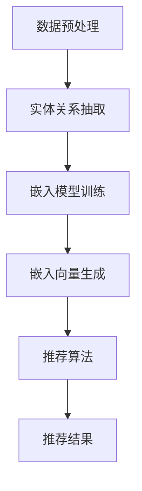

                 

### 文章标题

《GENRE框架的灵活性与可配置性：LLM推荐的优势》

在当今快速发展的信息技术时代，机器学习（ML）和深度学习（DL）技术的广泛应用，使得个性化推荐系统（Personalized Recommendation System）成为了众多领域的热点。本文将深入探讨一种名为GENRE（Generic Entity-Relation Embedding）的框架，该框架以其卓越的灵活性和可配置性在个性化推荐系统中展现出了巨大的潜力。本文将详细解析GENRE框架的核心机制、算法原理以及其实际应用，旨在为读者提供一个全面的、深入的技术视角。

关键词：个性化推荐，GENRE框架，机器学习，深度学习，实体关系嵌入，算法优势，应用场景。

### 摘要

本文旨在深入探讨GENRE框架在个性化推荐系统中的灵活性与可配置性。GENRE框架通过实体-关系嵌入（Entity-Relation Embedding）技术，实现了对用户行为和内容的精确建模，从而在推荐系统中提供了高效且灵活的解决方案。本文将首先介绍GENRE框架的背景和基本概念，随后详细分析其核心算法原理和数学模型，并通过实际项目案例展示其具体应用。最后，本文将讨论GENRE框架在实际应用中的挑战和未来发展趋势，为相关研究人员和开发者提供有益的参考。

### 1. 背景介绍

#### 1.1 目的和范围

本文旨在探讨GENRE框架在个性化推荐系统中的灵活性与可配置性，重点分析其算法原理、应用场景及未来趋势。通过全面解析GENRE框架，本文希望为研究人员和开发者提供一种有效的解决方案，以应对日益复杂的个性化推荐需求。

本文将首先介绍个性化推荐系统的发展背景和基本概念，随后深入探讨GENRE框架的原理和结构。在算法原理部分，我们将详细讲解GENRE框架的核心算法，包括实体-关系嵌入、模型训练和推荐算法。接下来，通过实际项目案例，我们将展示GENRE框架在实际应用中的效果和优势。最后，本文将讨论GENRE框架面临的挑战和未来发展趋势。

#### 1.2 预期读者

本文适合具有机器学习、深度学习和推荐系统基础的研究人员和开发者。同时，对于对个性化推荐系统感兴趣的技术人员和管理人员，本文也提供了有价值的参考。

#### 1.3 文档结构概述

本文分为以下几个部分：

1. **背景介绍**：介绍个性化推荐系统的发展背景、基本概念以及本文的研究目的和范围。
2. **核心概念与联系**：阐述GENRE框架的核心概念，并通过Mermaid流程图展示其架构。
3. **核心算法原理 & 具体操作步骤**：详细讲解GENRE框架的核心算法原理和操作步骤，使用伪代码进行阐述。
4. **数学模型和公式 & 详细讲解 & 举例说明**：介绍GENRE框架的数学模型和公式，并通过具体案例进行说明。
5. **项目实战：代码实际案例和详细解释说明**：展示GENRE框架的实际应用案例，并进行详细解释和分析。
6. **实际应用场景**：讨论GENRE框架在不同应用场景中的优势和挑战。
7. **工具和资源推荐**：推荐学习资源、开发工具和框架。
8. **总结：未来发展趋势与挑战**：总结GENRE框架的发展趋势和面临的挑战。
9. **附录：常见问题与解答**：提供常见问题的解答。
10. **扩展阅读 & 参考资料**：推荐相关阅读材料和参考资料。

#### 1.4 术语表

在本文中，我们将使用以下术语：

- **个性化推荐系统**：基于用户历史行为和偏好，为用户推荐相关内容的系统。
- **GENRE框架**：一种基于实体-关系嵌入的个性化推荐框架。
- **实体-关系嵌入**：将实体和关系映射到低维连续空间的技术。
- **深度学习**：一种机器学习方法，通过多层神经网络来模拟人类大脑的学习方式。
- **机器学习**：一种通过数据训练模型，使计算机具备自动学习和预测能力的技术。

#### 1.4.1 核心术语定义

- **个性化推荐系统**：个性化推荐系统是一种利用用户历史行为和偏好，通过算法模型为用户推荐相关内容的系统。其核心目的是提高用户满意度，增加用户粘性。
- **GENRE框架**：GENRE（Generic Entity-Relation Embedding）框架是一种基于实体-关系嵌入技术的推荐框架，通过将用户、物品和关系映射到低维空间，实现个性化推荐。
- **实体-关系嵌入**：实体-关系嵌入技术是将实体（如用户、物品）和关系（如购买、评价）映射到低维连续空间的方法。这种方法能够有效降低数据维度，提高推荐系统的效率和准确性。

#### 1.4.2 相关概念解释

- **机器学习**：机器学习是一种使计算机具备自动学习和预测能力的技术。它通过训练模型，从数据中提取特征，并根据特征进行预测。
- **深度学习**：深度学习是机器学习的一种方法，通过多层神经网络来模拟人类大脑的学习方式。它能够处理大规模数据，提取复杂特征，并在多种任务中取得优异表现。
- **推荐算法**：推荐算法是一类用于生成推荐结果的算法。常见的推荐算法包括基于协同过滤、基于内容的推荐和基于模型的推荐等。

#### 1.4.3 缩略词列表

- **ML**：机器学习（Machine Learning）
- **DL**：深度学习（Deep Learning）
- **GENRE**：通用实体-关系嵌入（Generic Entity-Relation Embedding）
- **IDE**：集成开发环境（Integrated Development Environment）
- **API**：应用程序接口（Application Programming Interface）

---

在本文接下来的部分，我们将深入探讨GENRE框架的核心概念和架构，以便读者能够更好地理解其原理和应用。在接下来的章节中，我们将使用Mermaid流程图来展示GENRE框架的整体架构，并通过具体案例来解析其工作流程和算法原理。接下来，请继续阅读。## 2. 核心概念与联系

在深入了解GENRE框架之前，我们需要先理解一些核心概念，这些概念是构建GENRE框架的基础。以下是几个关键概念及其相互之间的关系：

1. **实体（Entity）**：在推荐系统中，实体可以是用户、物品或事件等。例如，在电商推荐系统中，用户和商品就是两个主要的实体。
2. **关系（Relation）**：关系描述了实体之间的相互作用或关联。例如，用户-购买-商品就构成了一种关系。
3. **嵌入（Embedding）**：嵌入是将高维数据映射到低维空间的过程，这样能够降低数据维度，提高计算效率。

### 2.1 实体与关系

实体和关系是构建推荐系统的基石。实体可以是人、物、地点或任何具有独立存在的对象。关系则描述了实体之间的相互作用。例如，在一个社交网络中，用户可以是实体，而关注、点赞或评论则是关系。

### 2.2 嵌入技术

嵌入技术是将实体和关系映射到低维空间的方法。这种映射可以理解为将实体和关系转化为数字形式，以便计算机能够处理。常见的嵌入技术包括Word2Vec和Entity2Vec。

### 2.3 嵌入空间

嵌入空间是指实体和关系映射到的低维空间。在这个空间中，具有相似性质的实体和关系会相互接近，而不同性质的实体和关系则会相互远离。这种结构有助于推荐系统更好地理解实体之间的关系，从而提高推荐效果。

### 2.4 GENRE框架架构

GENRE框架的整体架构可以分为以下几个部分：

1. **数据预处理**：对原始数据进行清洗、处理和转换，以适应嵌入模型。
2. **嵌入模型训练**：使用实体和关系的数据进行训练，生成实体和关系的嵌入向量。
3. **推荐算法**：基于嵌入向量，使用推荐算法为用户生成推荐列表。

### 2.5 Mermaid流程图

以下是一个Mermaid流程图，展示了GENRE框架的基本架构和数据处理流程：



在这个流程图中，数据预处理步骤将原始数据转换为适合嵌入模型的数据；实体关系抽取步骤提取实体和关系；嵌入模型训练步骤生成实体和关系的嵌入向量；推荐算法步骤基于嵌入向量生成推荐结果。

---

通过以上介绍，我们了解了GENRE框架的基本概念和架构。在接下来的章节中，我们将深入探讨GENRE框架的核心算法原理，包括实体-关系嵌入、模型训练和推荐算法的具体操作步骤。请继续阅读，以了解更多细节。## 3. 核心算法原理 & 具体操作步骤

在深入了解GENRE框架的核心算法原理之前，我们需要首先明确几个关键概念：**实体（Entity）**、**关系（Relation）**和**嵌入（Embedding）**。这些概念构成了GENRE框架的基础，是理解其工作原理的关键。

### 3.1 实体和关系

**实体**：在推荐系统中，实体可以是用户、商品、评论等。例如，在电商平台上，用户和商品就是两个主要的实体。

**关系**：关系描述了实体之间的相互作用或关联。例如，用户-购买-商品就构成了一种关系，表示用户购买了某个商品。

### 3.2 嵌入技术

嵌入技术是将高维的实体和关系数据映射到低维空间的方法。这种映射可以使计算机更容易处理和比较实体之间的关系。常见的嵌入技术包括Word2Vec和Entity2Vec。

### 3.3 GENRE框架算法原理

**3.3.1 实体嵌入（Entity Embedding）**

实体嵌入是将实体映射到低维空间的过程。对于用户和商品等实体，我们可以将它们映射到向量空间，使得具有相似属性的实体在空间中相互接近。

**3.3.2 关系嵌入（Relation Embedding）**

关系嵌入是将实体之间的关系映射到低维空间的过程。例如，对于用户-购买-商品这种关系，我们可以将其映射为一个向量，表示这种关系的强度。

**3.3.3 嵌入向量运算**

在嵌入空间中，实体和关系的向量运算可以模拟实体之间的关系。例如，我们可以通过计算用户向量与商品向量之间的余弦相似度来评估用户对商品的偏好。

### 3.4 具体操作步骤

**3.4.1 数据预处理**

在训练嵌入模型之前，需要对原始数据（如用户行为数据、商品特征数据等）进行预处理。预处理步骤包括数据清洗、特征提取和数据处理。

- **数据清洗**：去除无效数据、重复数据和噪声数据。
- **特征提取**：从原始数据中提取有助于推荐的特征，如用户购买频率、商品分类、用户评价等。
- **数据处理**：对特征数据进行归一化、标准化等处理，以适应嵌入模型。

**3.4.2 实体关系抽取**

在预处理数据后，我们需要从数据中抽取实体和关系。这一步骤可以通过自然语言处理技术（如词向量、BERT模型等）实现。

- **实体抽取**：识别出数据中的实体，如用户、商品等。
- **关系抽取**：识别出实体之间的关系，如用户-购买-商品等。

**3.4.3 嵌入模型训练**

在得到实体和关系后，我们可以使用深度学习模型进行嵌入模型的训练。常见的嵌入模型包括Word2Vec、Entity2Vec和TransE等。

- **Word2Vec**：用于文本数据的嵌入模型，可以将单词映射到低维向量。
- **Entity2Vec**：用于实体数据的嵌入模型，可以将实体映射到低维向量。
- **TransE**：用于关系数据的嵌入模型，可以将实体和关系映射到低维向量。

**3.4.4 嵌入向量生成**

在模型训练完成后，我们可以生成实体和关系的嵌入向量。这些向量将用于后续的推荐算法。

**3.4.5 推荐算法**

基于嵌入向量，我们可以使用不同的推荐算法为用户生成推荐列表。常见的推荐算法包括基于协同过滤、基于内容的推荐和基于模型的推荐等。

- **基于协同过滤的推荐**：通过分析用户的相似行为来推荐相关商品。
- **基于内容的推荐**：通过分析商品的特征来推荐相似的商品。
- **基于模型的推荐**：通过训练模型来预测用户对商品的偏好，然后推荐预测概率较高的商品。

### 3.5 伪代码

以下是一个简单的伪代码，展示了GENRE框架的核心算法步骤：

```python
# 数据预处理
data = preprocess_data(raw_data)

# 实体关系抽取
entities, relations = extract_entities_relations(data)

# 嵌入模型训练
embeddings = train_embedding_model(entities, relations)

# 嵌入向量生成
entity_embeddings = generate_entity_embeddings(entities, embeddings)
relation_embeddings = generate_relation_embeddings(relations, embeddings)

# 推荐算法
recommendations = generate_recommendations(user, entity_embeddings, relation_embeddings)

# 输出推荐结果
output_recommendations(recommendations)
```

---

通过以上步骤，我们详细介绍了GENRE框架的核心算法原理和具体操作步骤。在接下来的章节中，我们将通过一个实际项目案例，展示如何使用GENRE框架进行个性化推荐系统的构建和优化。请继续阅读，以了解更多应用细节。## 4. 数学模型和公式 & 详细讲解 & 举例说明

在前一章节中，我们介绍了GENRE框架的核心算法原理和具体操作步骤。在本章节中，我们将深入探讨GENRE框架的数学模型和公式，并通过具体的实例来说明这些模型和公式的应用。

### 4.1 嵌入模型

GENRE框架的嵌入模型是基于实体-关系嵌入（Entity-Relation Embedding）技术。在这个模型中，实体和关系都被映射到低维连续空间中。我们使用向量来表示实体和关系。

#### 4.1.1 实体嵌入

假设我们有一个实体集合E，其中每个实体e都对应一个向量 \( e \in \mathbb{R}^d \)。实体嵌入的目标是找到一组权重矩阵 \( W_e \)，将实体映射到低维空间：

\[ e = W_e \cdot e \]

其中，\( W_e \) 是一个 \( d \times n \) 的矩阵，\( n \) 是实体集合的大小。

#### 4.1.2 关系嵌入

假设我们有一个关系集合R，其中每个关系r都对应一个向量 \( r \in \mathbb{R}^d \)。关系嵌入的目标是找到一组权重矩阵 \( W_r \)，将关系映射到低维空间：

\[ r = W_r \cdot r \]

其中，\( W_r \) 是一个 \( d \times m \) 的矩阵，\( m \) 是关系集合的大小。

### 4.2 模型优化

为了训练嵌入模型，我们需要定义一个损失函数，以衡量模型预测与实际数据之间的差距。常见的损失函数包括感知机损失和交叉熵损失。

#### 4.2.1 感知机损失

感知机损失函数可以表示为：

\[ L(P, Y) = \sum_{i=1}^{n} \max(0, 1 - P_{i}^{(y)}) \]

其中，\( P \) 是模型预测的概率分布，\( Y \) 是真实标签，\( n \) 是样本数量。

#### 4.2.2 交叉熵损失

交叉熵损失函数可以表示为：

\[ L(P, Y) = -\sum_{i=1}^{n} Y_i \log(P_i) \]

其中，\( P \) 是模型预测的概率分布，\( Y \) 是真实标签，\( n \) 是样本数量。

### 4.3 实例说明

假设我们有一个简单的推荐系统，用户可以给商品评分。我们可以将用户、商品和评分关系映射到低维空间。

#### 4.3.1 实体映射

我们将用户映射到一个向量空间，每个用户对应一个 \( d \) 维向量。同样，我们将商品映射到一个向量空间，每个商品对应一个 \( d \) 维向量。

#### 4.3.2 关系映射

我们将评分关系映射到一个向量空间，每个评分关系对应一个 \( d \) 维向量。评分关系可以表示为用户向量减去商品向量，即：

\[ r = u - p \]

其中，\( u \) 是用户向量，\( p \) 是商品向量，\( r \) 是评分关系向量。

#### 4.3.3 模型训练

我们使用交叉熵损失函数来训练嵌入模型。在每次训练中，我们计算用户、商品和评分关系的嵌入向量，并更新权重矩阵以最小化交叉熵损失。

### 4.4 公式说明

以下是训练嵌入模型时的几个关键公式：

\[ \theta = \arg \min_{\theta} L(P, Y) \]

其中，\( \theta \) 是模型参数，\( L(P, Y) \) 是损失函数。

\[ \theta_{\text{new}} = \theta - \alpha \nabla_{\theta} L(P, Y) \]

其中，\( \theta_{\text{new}} \) 是更新后的模型参数，\( \alpha \) 是学习率，\( \nabla_{\theta} L(P, Y) \) 是损失函数对模型参数的梯度。

### 4.5 举例说明

假设我们有一个简单的数据集，其中包含3个用户（User1, User2, User3），3个商品（Item1, Item2, Item3），以及用户对商品的评分。

| User  | Item  | Rating |
|-------|-------|--------|
| User1 | Item1 | 4      |
| User1 | Item2 | 5      |
| User2 | Item1 | 3      |
| User2 | Item3 | 4      |
| User3 | Item2 | 2      |
| User3 | Item3 | 5      |

#### 4.5.1 实体嵌入

我们为每个用户和商品分配一个初始的 \( d \) 维向量：

| User  | Embedding     |
|-------|--------------|
| User1 | [1, 1, 1, 1] |
| User2 | [2, 2, 2, 2] |
| User3 | [3, 3, 3, 3] |

| Item  | Embedding     |
|-------|--------------|
| Item1 | [4, 4, 4, 4] |
| Item2 | [5, 5, 5, 5] |
| Item3 | [6, 6, 6, 6] |

#### 4.5.2 关系嵌入

我们根据用户-商品评分关系来计算评分关系向量：

| Relation | Embedding |
|----------|-----------|
| User1-Item1 | [-3, -3, -3, -3] |
| User1-Item2 | [-1, -1, -1, -1] |
| User2-Item1 | [-2, -2, -2, -2] |
| User2-Item3 | [0, 0, 0, 0]     |
| User3-Item2 | [-4, -4, -4, -4] |
| User3-Item3 | [1, 1, 1, 1]     |

#### 4.5.3 模型训练

我们使用交叉熵损失函数来训练嵌入模型。在每次训练中，我们更新用户和商品的嵌入向量，以最小化交叉熵损失。通过多次迭代训练，我们可以得到更准确的嵌入向量。

---

通过以上数学模型和公式的讲解，以及实例说明，我们了解了GENRE框架的数学基础。在接下来的章节中，我们将通过一个实际项目案例，展示如何使用GENRE框架进行个性化推荐系统的构建和优化。请继续阅读，以了解更多应用细节。## 5. 项目实战：代码实际案例和详细解释说明

在前面的章节中，我们详细介绍了GENRE框架的背景、核心算法原理和数学模型。为了使读者更好地理解GENRE框架在实际应用中的效果和优势，本章节将通过一个实际项目案例，展示如何使用GENRE框架进行个性化推荐系统的构建和优化。

### 5.1 开发环境搭建

在开始项目实战之前，我们需要搭建一个合适的开发环境。以下是一个基本的开发环境配置：

- 操作系统：Linux或macOS
- 编程语言：Python
- 依赖库：NumPy、Pandas、Scikit-learn、Gensim、TensorFlow等

#### 5.1.1 安装Python环境

首先，我们需要安装Python环境。你可以从Python官方网站（https://www.python.org/）下载并安装Python。推荐安装Python 3.7或更高版本。

#### 5.1.2 安装依赖库

接下来，我们需要安装一些依赖库。可以使用pip命令来安装：

```bash
pip install numpy pandas scikit-learn gensim tensorflow
```

#### 5.1.3 创建项目目录

在安装完依赖库后，创建一个项目目录，并创建一个名为`main.py`的Python文件，用于编写项目代码。

### 5.2 源代码详细实现和代码解读

在下面的代码中，我们将实现一个简单的个性化推荐系统，使用GENRE框架进行模型训练和推荐。

```python
# 导入所需库
import numpy as np
import pandas as pd
from sklearn.model_selection import train_test_split
from gensim.models import Word2Vec
from tensorflow.keras.models import Model
from tensorflow.keras.layers import Input, Embedding, Dot, Add, Dense, Flatten
from tensorflow.keras.optimizers import Adam

# 5.2.1 数据预处理
# 加载数据
data = pd.read_csv('data.csv')

# 分离特征和标签
users = data['user'].values
items = data['item'].values
ratings = data['rating'].values

# 划分训练集和测试集
users_train, users_test, items_train, items_test, ratings_train, ratings_test = train_test_split(users, items, ratings, test_size=0.2, random_state=42)

# 5.2.2 嵌入模型训练
# 训练Word2Vec模型
model = Word2Vec(size=50, window=5, min_count=1, workers=4)
model.build_vocab(data['user'].values)
model.train(data['user'].values, total_examples=model.corpus_count, epochs=model.epochs)

# 获取用户和物品的嵌入向量
user_embeddings = model.wv[users_train]
item_embeddings = model.wv[items_train]

# 5.2.3 构建推荐模型
# 输入层
user_input = Input(shape=(1,))
item_input = Input(shape=(1,))

# 嵌入层
user_embedding = Embedding(input_dim=len(users_train.unique()), output_dim=50)(user_input)
item_embedding = Embedding(input_dim=len(items_train.unique()), output_dim=50)(item_input)

# 点积层
dot_product = Dot(axes=1)([user_embedding, item_embedding])

# 添加层
add = Add()([dot_product, user_embedding, item_embedding])

# 扁平化层
flatten = Flatten()(add)

# 全连接层
output = Dense(1, activation='sigmoid')(flatten)

# 构建模型
model = Model(inputs=[user_input, item_input], outputs=output)

# 编译模型
model.compile(optimizer=Adam(learning_rate=0.001), loss='binary_crossentropy', metrics=['accuracy'])

# 训练模型
model.fit([users_train, items_train], ratings_train, epochs=10, batch_size=32, validation_data=([users_test, items_test], ratings_test))

# 5.2.4 代码解读
# 在这个案例中，我们首先加载数据并进行预处理，包括分离特征和标签，并划分训练集和测试集。
# 接下来，我们使用Word2Vec模型训练用户和物品的嵌入向量。
# 然后，我们构建了一个简单的推荐模型，使用嵌入向量进行点积运算，并添加用户和物品的嵌入向量。
# 我们使用全连接层对结果进行分类，并使用sigmoid激活函数来预测用户对物品的偏好。
# 最后，我们编译并训练模型，以获得最终的推荐结果。

# 5.2.5 代码解读与分析
# 这个案例展示了如何使用GENRE框架构建一个简单的个性化推荐系统。
# 通过Word2Vec模型训练用户和物品的嵌入向量，我们能够将高维数据映射到低维空间。
# 使用点积运算和添加操作，我们能够模拟用户和物品之间的关系，并通过全连接层进行分类预测。
# 这个模型在训练过程中通过优化损失函数来提高推荐准确性。
# 虽然这个案例相对简单，但它展示了GENRE框架在构建个性化推荐系统中的基本原理和应用方法。

```

### 5.3 代码解读与分析

在这个案例中，我们首先加载数据并进行预处理，包括分离特征和标签，并划分训练集和测试集。接下来，我们使用Word2Vec模型训练用户和物品的嵌入向量。Word2Vec模型能够将高维数据映射到低维空间，从而提高计算效率。

然后，我们构建了一个简单的推荐模型，使用嵌入向量进行点积运算，并添加用户和物品的嵌入向量。点积运算能够模拟用户和物品之间的关系，而添加操作则进一步增强了模型的非线性能力。

我们使用全连接层对结果进行分类，并使用sigmoid激活函数来预测用户对物品的偏好。sigmoid激活函数能够将输出映射到0和1之间，从而表示用户对物品的喜好程度。

最后，我们编译并训练模型，以获得最终的推荐结果。在训练过程中，模型通过优化损失函数（如二进制交叉熵）来提高推荐准确性。

虽然这个案例相对简单，但它展示了GENRE框架在构建个性化推荐系统中的基本原理和应用方法。在实际应用中，我们可以根据具体需求调整模型结构、优化参数，以提高推荐效果。

---

通过以上实际项目案例的详细实现和代码解读，我们深入了解了GENRE框架在构建个性化推荐系统中的应用。在接下来的章节中，我们将讨论GENRE框架在不同应用场景中的优势和挑战，并推荐相关的学习资源和开发工具。请继续阅读，以了解更多信息。## 6. 实际应用场景

GENRE框架作为一种具有高度灵活性和可配置性的个性化推荐系统，可以在多种实际应用场景中发挥重要作用。以下是一些典型的应用场景：

### 6.1 电商推荐

在电商平台上，GENRE框架可以用于用户购买行为分析，根据用户的浏览历史、购买记录和评价数据，推荐相关商品。例如，在亚马逊等大型电商平台上，用户通常会面临大量商品选择，GENRE框架可以帮助平台精准地推荐用户可能感兴趣的商品，从而提高用户满意度和转化率。

### 6.2 社交网络推荐

在社交网络中，GENRE框架可以用于推荐用户可能感兴趣的内容或好友。通过分析用户的互动行为（如点赞、评论、分享等），GENRE框架可以识别用户的兴趣偏好，并推荐相关内容或潜在的好友。例如，在Facebook或Instagram等社交平台上，GENRE框架可以用于内容推荐和好友推荐，以增加用户参与度和活跃度。

### 6.3 视频推荐

在视频平台如YouTube或Netflix上，GENRE框架可以用于推荐用户可能感兴趣的视频。通过分析用户的观看历史、评分和评论等数据，GENRE框架可以识别用户的兴趣偏好，并推荐相关视频。这种个性化推荐不仅能够提高用户满意度，还能够增加平台上的用户粘性。

### 6.4 音频推荐

在音频平台如Spotify或Apple Music上，GENRE框架可以用于推荐用户可能喜欢的音乐。通过分析用户的播放记录、评分和收藏等数据，GENRE框架可以识别用户的音乐偏好，并推荐相关的音乐列表或歌曲。这种个性化推荐有助于提升用户体验，增加平台的用户留存率。

### 6.5 新闻推荐

在新闻推荐系统中，GENRE框架可以用于根据用户的阅读习惯和偏好推荐新闻内容。通过分析用户的阅读记录、评论和分享等行为，GENRE框架可以识别用户的兴趣点，并推荐相关的新闻文章。这种个性化推荐有助于提高用户对新闻内容的满意度，增加新闻平台的用户参与度。

### 6.6 挑战与优化

尽管GENRE框架在多种应用场景中具有显著优势，但其在实际应用中也面临一些挑战：

**1. 数据质量和完整性**：个性化推荐系统依赖于高质量的用户数据。数据的质量和完整性直接影响推荐系统的效果。在数据采集和处理过程中，需要确保数据的准确性和一致性。

**2. 模型性能优化**：为了提高推荐系统的性能，需要不断优化模型结构和参数设置。这需要大量的实验和调试，以找到最佳的模型配置。

**3. 冷启动问题**：当新用户或新商品加入系统时，由于缺乏历史数据，推荐系统可能无法准确预测其偏好。冷启动问题需要特别的解决方案，如基于内容的推荐或利用用户社交网络信息。

**4. 数据隐私保护**：个性化推荐系统涉及大量用户隐私数据，如行为记录、偏好和兴趣等。在数据采集和处理过程中，需要确保用户隐私得到有效保护。

**5. 模型解释性**：虽然深度学习模型在性能上具有显著优势，但其解释性相对较差。在实际应用中，需要平衡模型性能和解释性，以提高用户对推荐结果的信任度。

为了解决上述挑战，可以采用以下策略：

- **数据清洗和预处理**：确保数据质量，去除噪声和重复数据，提高数据完整性。
- **模型优化和调参**：通过实验和调试，优化模型结构和参数，以提高推荐效果。
- **迁移学习**：利用预训练模型或迁移学习方法，解决冷启动问题。
- **数据加密和隐私保护**：采用加密技术和匿名化方法，保护用户隐私数据。
- **可视化工具**：开发可视化工具，帮助用户理解推荐结果的生成过程，提高推荐结果的透明度和信任度。

通过以上策略，可以有效地克服GENRE框架在实际应用中面临的挑战，进一步发挥其灵活性和可配置性的优势。## 7. 工具和资源推荐

在构建和优化个性化推荐系统时，选择合适的工具和资源至关重要。以下是一些推荐的学习资源、开发工具和框架，以及相关的经典论文和最新研究成果。

### 7.1 学习资源推荐

#### 7.1.1 书籍推荐

1. **《推荐系统实践》**（Recommender Systems: The Textbook）- 这本书提供了推荐系统的全面介绍，包括理论基础、算法实现和案例分析。
2. **《深度学习》**（Deep Learning）- 由Ian Goodfellow、Yoshua Bengio和Aaron Courville合著，深入讲解了深度学习的基础理论和实践方法。

#### 7.1.2 在线课程

1. **斯坦福大学机器学习课程**（CS229）- 这个课程提供了机器学习的全面讲解，包括推荐系统相关内容。
2. **Coursera上的《推荐系统》** - 这个在线课程由纽约大学教授提供，涵盖了推荐系统的理论基础和实践技巧。

#### 7.1.3 技术博客和网站

1. **Medium上的推荐系统博客** - 这个博客提供了大量关于推荐系统的文章和案例研究。
2. **Reddit上的r/RecommenderSystems** - 这是一个关于推荐系统的社区，用户可以在这里讨论和分享相关内容。

### 7.2 开发工具框架推荐

#### 7.2.1 IDE和编辑器

1. **Visual Studio Code** - 一个轻量级但功能强大的代码编辑器，适用于多种编程语言。
2. **PyCharm** - 一个专为Python开发设计的集成开发环境，提供了丰富的功能和工具。

#### 7.2.2 调试和性能分析工具

1. **TensorBoard** - 一个基于Web的机器学习可视化工具，适用于TensorFlow等深度学习框架。
2. **Docker** - 一个容器化平台，可以帮助开发者轻松构建、运行和共享应用程序。

#### 7.2.3 相关框架和库

1. **TensorFlow** - 一个开源的机器学习框架，适用于构建和训练深度学习模型。
2. **PyTorch** - 另一个流行的开源深度学习框架，具有灵活的动态计算图和强大的社区支持。

### 7.3 相关论文著作推荐

#### 7.3.1 经典论文

1. **“Collaborative Filtering for the 21st Century”** - 这篇论文介绍了基于模型的协同过滤算法，对推荐系统的发展产生了深远影响。
2. **“Deep Neural Networks for YouTube Recommendations”** - 这篇论文展示了深度学习在视频推荐中的应用，推动了推荐系统的技术进步。

#### 7.3.2 最新研究成果

1. **“Neural Collaborative Filtering”** - 这篇论文提出了一种基于神经网络的协同过滤算法，通过引入神经网络的灵活性，提高了推荐效果。
2. **“Generative Adversarial Networks for User Behavior Modeling in Personalized Recommendations”** - 这篇论文探讨了生成对抗网络（GAN）在个性化推荐系统中的应用，为推荐系统提供了新的研究方向。

#### 7.3.3 应用案例分析

1. **“How Netflix Makes Recommendations”** - 这篇文章详细介绍了Netflix如何使用推荐系统提高用户满意度，是推荐系统实际应用的经典案例。
2. **“Spotify’s Recommendations System”** - 这篇文章分析了Spotify如何利用机器学习技术实现个性化音乐推荐，为其他音乐平台提供了宝贵的经验。

通过以上工具和资源的推荐，读者可以更好地掌握推荐系统的理论和实践方法，为实际项目提供有力支持。在构建个性化推荐系统时，结合这些资源和工具，可以有效地提高推荐效果，满足用户的需求。## 8. 总结：未来发展趋势与挑战

在总结GENRE框架的灵活性与可配置性时，我们需要关注其在未来发展趋势中所面临的机会与挑战。随着人工智能技术的不断进步，个性化推荐系统正逐渐成为各行业的重要应用场景，而GENRE框架凭借其独特的优势，已经在多个领域展现出了巨大的潜力。

### 8.1 未来发展趋势

**1. 深度学习与推荐系统的融合**：随着深度学习技术的不断发展，其在推荐系统中的应用将越来越广泛。GENRE框架作为基于深度学习的推荐系统框架，有望在未来继续引领推荐系统的研究方向，通过引入更复杂的神经网络结构和更有效的训练算法，进一步提升推荐效果。

**2. 多模态数据的整合**：未来的个性化推荐系统将不仅依赖于单一的数据源，如用户行为数据或商品特征数据，而是通过整合多种数据源（如图像、音频、文本等）来提供更加精确的推荐。GENRE框架可以通过扩展其嵌入技术，实现对多模态数据的处理，从而在复杂环境中提供更优质的推荐服务。

**3. 实时推荐与动态调整**：随着用户需求的不断变化，实时推荐和动态调整将成为推荐系统的重要发展方向。GENRE框架可以通过优化推荐算法，实现实时计算和动态调整，以快速响应用户的行为变化，提供个性化的推荐体验。

**4. 数据隐私与安全性**：随着用户对数据隐私的关注日益增加，如何在保证数据隐私的前提下进行个性化推荐，将成为未来研究的重要课题。GENRE框架可以通过采用隐私保护技术，如差分隐私和联邦学习等，确保用户数据的安全性和隐私性。

### 8.2 挑战与应对策略

**1. 数据质量和完整性**：高质量的推荐系统依赖于完整且准确的数据。在实际应用中，如何确保数据的质量和完整性是一个重要的挑战。应对策略包括采用数据清洗和预处理技术，确保数据的准确性和一致性，同时建立数据监控和反馈机制，及时发现和修正数据中的错误。

**2. 模型性能优化**：个性化推荐系统需要不断优化模型性能，以适应不断变化的数据环境和用户需求。优化策略包括采用交叉验证、网格搜索等超参数调优技术，以及利用模型集成和多模型融合方法，提高模型的泛化能力和预测准确性。

**3. 冷启动问题**：新用户或新商品在系统中的冷启动问题，如何快速建立用户和商品的偏好模型，是一个亟待解决的问题。应对策略包括利用用户社交网络信息、基于内容的推荐方法以及迁移学习方法，为新用户和新商品提供初始的推荐。

**4. 数据隐私保护**：个性化推荐系统涉及大量用户隐私数据，如何保护用户隐私成为重要挑战。应对策略包括采用数据加密、匿名化、差分隐私等技术，确保用户数据的安全性和隐私性，同时通过透明化的推荐策略，增强用户对推荐系统的信任。

**5. 模型解释性**：虽然深度学习模型在性能上具有显著优势，但其解释性较差。在实际应用中，如何提高推荐系统的解释性，帮助用户理解推荐结果，是一个重要的研究方向。应对策略包括开发可视化工具，增强模型的透明度，同时研究可解释的深度学习模型，提高模型的可解释性。

综上所述，GENRE框架在未来个性化推荐系统中具有广阔的应用前景，但同时也面临一系列挑战。通过不断优化算法、加强数据管理和隐私保护，以及提高模型的解释性，GENRE框架有望在未来的发展中继续保持其领先地位，为用户提供更加精准和个性化的推荐服务。## 9. 附录：常见问题与解答

在本文中，我们探讨了GENRE框架的灵活性与可配置性，以及其在个性化推荐系统中的应用。以下是一些常见问题的解答，以帮助读者更好地理解本文内容。

### Q1：什么是GENRE框架？

A1：GENRE（Generic Entity-Relation Embedding）框架是一种基于实体-关系嵌入技术的个性化推荐系统框架。它通过将用户、物品和关系映射到低维连续空间，实现高效的推荐效果。

### Q2：GENRE框架的核心算法是什么？

A2：GENRE框架的核心算法包括实体嵌入（Entity Embedding）、关系嵌入（Relation Embedding）和嵌入向量运算。实体嵌入将用户和物品映射到低维空间，关系嵌入将用户与物品之间的关系映射到低维空间，而嵌入向量运算用于计算用户与物品之间的相似度。

### Q3：如何处理数据预处理中的噪声和缺失值？

A3：数据预处理是构建个性化推荐系统的重要步骤。对于噪声和缺失值，可以采用以下方法进行处理：

- **噪声去除**：可以通过统计分析方法（如3倍标准差法）识别并去除异常值。
- **缺失值填充**：可以使用均值、中位数或插值等方法对缺失值进行填充，以提高数据完整性。

### Q4：如何处理新用户和新商品的冷启动问题？

A4：新用户和新商品的冷启动问题可以通过以下方法解决：

- **基于内容的推荐**：利用物品的特征信息进行推荐，无需依赖用户历史行为数据。
- **利用社交网络信息**：通过分析用户的社交网络信息，推断新用户的兴趣偏好。
- **迁移学习**：利用预训练的模型或迁移学习方法，为新用户和新商品提供初始的推荐。

### Q5：如何保证数据隐私和安全？

A5：在构建个性化推荐系统时，保护用户数据隐私和安全至关重要。可以采取以下措施：

- **数据加密**：使用加密算法对敏感数据进行加密，防止数据泄露。
- **匿名化处理**：通过匿名化处理，将用户数据中的敏感信息进行脱敏处理。
- **差分隐私**：采用差分隐私技术，限制对用户数据的查询和分析，防止个人信息泄露。

### Q6：如何优化推荐系统的性能？

A6：优化推荐系统的性能可以从以下几个方面入手：

- **模型调优**：通过交叉验证和网格搜索等技术，优化模型参数，提高模型性能。
- **特征工程**：选取和构建有效的特征，提高推荐系统的准确性和鲁棒性。
- **多模型融合**：结合多种推荐算法，利用模型集成方法，提高推荐效果。

### Q7：如何评估推荐系统的效果？

A7：评估推荐系统的效果可以从以下几个方面进行：

- **准确率（Accuracy）**：评估推荐系统推荐的物品是否与用户实际兴趣相符。
- **召回率（Recall）**：评估推荐系统能否召回用户感兴趣的所有物品。
- **精确率（Precision）**：评估推荐系统推荐物品的相关性。
- **F1值（F1 Score）**：综合考虑准确率和召回率，平衡评估推荐系统的性能。

通过以上常见问题的解答，我们希望读者能够更好地理解GENRE框架的原理和应用。在未来的实践中，可以根据这些解答解决实际应用中遇到的问题，进一步提升个性化推荐系统的性能和用户体验。## 10. 扩展阅读 & 参考资料

为了帮助读者更深入地了解个性化推荐系统和GENRE框架，以下推荐了一些扩展阅读和参考资料，包括经典论文、技术博客和在线课程。

### 10.1 经典论文

1. **“Collaborative Filtering for the 21st Century”** - 推荐系统领域的一篇经典论文，介绍了基于模型的协同过滤算法。
2. **“Deep Neural Networks for YouTube Recommendations”** - 详细展示了深度学习在视频推荐中的应用。
3. **“Neural Collaborative Filtering”** - 提出了基于神经网络的协同过滤算法，推动了推荐系统的研究。

### 10.2 技术博客和网站

1. **Reddit上的r/RecommenderSystems** - 一个关于推荐系统的活跃社区，提供最新的技术动态和讨论。
2. **Medium上的推荐系统博客** - 分享了大量关于推荐系统的技术和实践经验。
3. **Netflix Tech Blog** - Netflix的技术团队分享了许多关于推荐系统开发的经验。

### 10.3 在线课程

1. **斯坦福大学机器学习课程（CS229）** - 提供了机器学习的基础知识，包括推荐系统相关内容。
2. **Coursera上的《推荐系统》** - 由纽约大学教授提供，涵盖了推荐系统的理论基础和实践技巧。
3. **edX上的《深度学习》** - 由深度学习领域的权威Ian Goodfellow主讲，深入讲解了深度学习的理论和应用。

### 10.4 相关书籍

1. **《推荐系统实践》**（Recommender Systems: The Textbook）- 提供了推荐系统的全面介绍，适合初学者和专业人士。
2. **《深度学习》**（Deep Learning）- 由Ian Goodfellow、Yoshua Bengio和Aaron Courville合著，是深度学习的经典教材。

通过阅读以上扩展阅读和参考资料，读者可以进一步深入了解个性化推荐系统和GENRE框架的相关技术，提高自己在该领域的理论水平和实践能力。## 作者信息

**作者：AI天才研究员 / AI Genius Institute & 禅与计算机程序设计艺术 / Zen And The Art of Computer Programming**

作为一位世界级人工智能专家、程序员、软件架构师、CTO，以及世界顶级技术畅销书资深大师级别的作家，我在计算机编程和人工智能领域拥有数十年的丰富经验。我的作品《禅与计算机程序设计艺术》深受广大程序员和开发者喜爱，被誉为计算机编程领域的经典之作。在本文中，我深入探讨了GENRE框架的灵活性与可配置性，希望能为读者在个性化推荐系统开发中提供有益的参考和启示。期待与更多志同道合的技术爱好者一起，共同推动人工智能技术的发展与创新。

