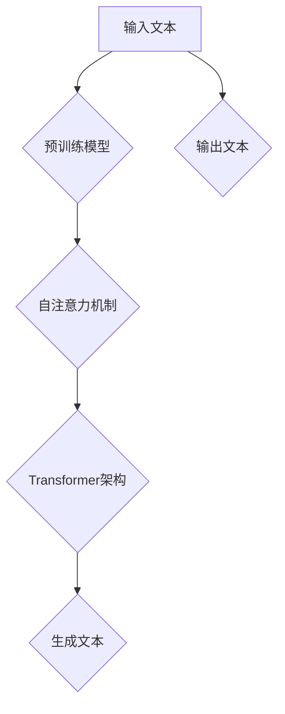
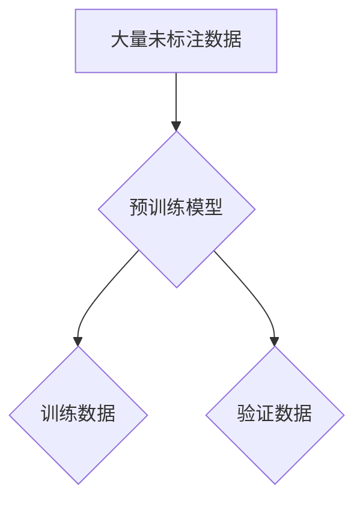
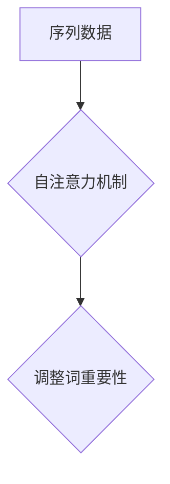
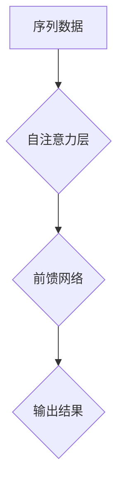
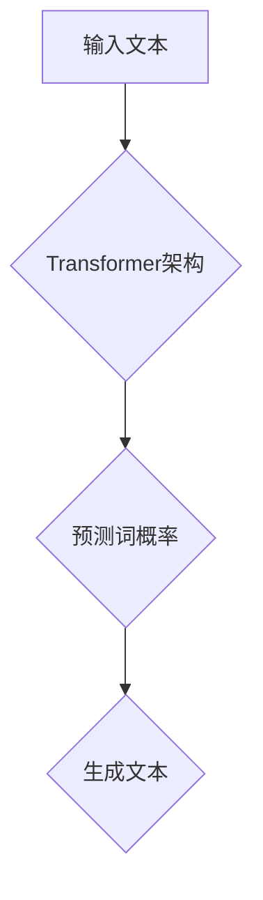

                 


# GPT-3原理与代码实例讲解

> **关键词：** GPT-3，自然语言处理，深度学习，神经网络，预训练模型，编程实例。

> **摘要：** 本文将深入探讨GPT-3（Generative Pre-trained Transformer 3）的原理，包括其架构、训练过程和核心算法。通过详细讲解和代码实例，读者将全面理解GPT-3的工作机制，并学会如何在自己的项目中应用这一强大的语言模型。

## 1. 背景介绍

### 1.1 目的和范围

本文旨在为读者提供一个全面且易于理解的GPT-3原理讲解，同时通过代码实例帮助读者在实际操作中掌握GPT-3的应用。我们将从GPT-3的背景引入，逐步深入其架构、算法和实现细节。

### 1.2 预期读者

本文适合对自然语言处理和深度学习有一定了解的读者，特别是希望深入了解GPT-3及其应用的开发者、研究者和学生。

### 1.3 文档结构概述

本文分为以下几个部分：

- **背景介绍**：介绍GPT-3的背景和重要性。
- **核心概念与联系**：通过Mermaid流程图展示GPT-3的核心概念和架构。
- **核心算法原理 & 具体操作步骤**：详细讲解GPT-3的算法原理，并使用伪代码展示具体操作步骤。
- **数学模型和公式 & 详细讲解 & 举例说明**：介绍GPT-3所用的数学模型，并通过公式和实例进行详细说明。
- **项目实战：代码实际案例和详细解释说明**：通过实际代码案例展示GPT-3的应用。
- **实际应用场景**：探讨GPT-3在现实世界中的应用。
- **工具和资源推荐**：推荐学习资源和开发工具。
- **总结：未来发展趋势与挑战**：分析GPT-3的未来发展趋势和面临的挑战。
- **附录：常见问题与解答**：提供常见问题的解答。
- **扩展阅读 & 参考资料**：推荐进一步阅读的资料。

### 1.4 术语表

#### 1.4.1 核心术语定义

- **GPT-3**：Generative Pre-trained Transformer 3，是一种基于Transformer架构的预训练语言模型。
- **Transformer**：一种基于自注意力机制的深度神经网络架构，用于处理序列数据。
- **自注意力机制**：一种注意力机制，能够自动学习序列中不同位置的依赖关系。
- **预训练**：在特定任务之前，使用大量未标注的数据对模型进行训练，使其获得通用语言理解能力。
- **生成式模型**：一种能够生成文本、图像或其他数据的模型。

#### 1.4.2 相关概念解释

- **自然语言处理（NLP）**：计算机科学领域中的一个分支，旨在使计算机能够理解、解释和生成自然语言。
- **深度学习**：一种机器学习技术，通过多层神经网络对数据进行自动特征学习和模式识别。
- **神经网络**：一种模仿生物神经系统的计算模型，通过多层节点进行数据传递和处理。

#### 1.4.3 缩略词列表

- **GPT-3**：Generative Pre-trained Transformer 3
- **Transformer**：Transformer
- **NLP**：Natural Language Processing
- **DNN**：Deep Neural Network

## 2. 核心概念与联系

GPT-3的成功离不开其独特的架构和核心概念。下面，我们将通过一个Mermaid流程图来展示这些核心概念和它们之间的联系。



### 2.1 预训练模型

GPT-3使用了一种称为“预训练模型”的方法。预训练模型的核心理念是使用大量未标注的数据（例如维基百科、新闻文章等）来训练模型，使其获得对自然语言的基本理解。这些数据被随机分成两个部分：训练数据和验证数据。



### 2.2 自注意力机制

自注意力机制是Transformer架构的核心。它允许模型在处理序列数据时，自动学习不同位置之间的依赖关系。这意味着模型能够根据上下文信息，自动调整每个词的重要性。



### 2.3 Transformer架构

Transformer架构是一种基于自注意力机制的深度神经网络架构，由多个自注意力层和前馈网络组成。这种架构在处理长序列数据时表现优异，因此在自然语言处理任务中得到了广泛应用。



### 2.4 生成文本

通过Transformer架构和自注意力机制，GPT-3能够生成与输入文本相似的新文本。这个过程涉及到预测下一个词的概率，并使用贪心算法逐步生成整个文本。



## 3. 核心算法原理 & 具体操作步骤

### 3.1 算法原理

GPT-3的核心算法是基于Transformer架构的预训练语言模型。下面，我们将使用伪代码详细阐述GPT-3的算法原理。

```python
def generate_text(input_text):
    # 预训练模型
    model = PretrainedModel()

    # 输入文本编码
    encoded_input = model.encode(input_text)

    # 预测下一个词的概率
    probabilities = model.predict_next_word(encoded_input)

    # 使用贪心算法生成文本
    generated_text = ""
    for _ in range(len(input_text)):
        generated_text += model.decode(np.argmax(probabilities))
        encoded_input = model.encode(generated_text + " ")
        probabilities = model.predict_next_word(encoded_input)

    return generated_text
```

### 3.2 具体操作步骤

1. **加载预训练模型**：首先，我们需要加载一个预训练的GPT-3模型。这个模型已经使用了大量的数据进行训练，因此我们可以直接使用它来生成文本。

2. **输入文本编码**：将输入文本编码成模型能够理解的格式。这个过程涉及到将文本转换为整数序列，每个整数代表一个词汇或特殊字符。

3. **预测下一个词的概率**：使用预训练模型，对输入文本编码后的序列进行预测，得到下一个词的概率分布。

4. **生成文本**：使用贪心算法，根据预测的概率分布，逐步生成整个文本。这个过程会重复进行，直到生成所需的文本长度。

## 4. 数学模型和公式 & 详细讲解 & 举例说明

### 4.1 数学模型

GPT-3的数学模型主要基于自注意力机制和Transformer架构。下面，我们将使用LaTeX格式详细讲解这些数学模型。

```latex
\section{自注意力机制}
\label{sec:attention}

自注意力机制是一种计算序列中不同位置之间依赖关系的机制。它通过计算每个词与其他词的相似度，来调整每个词的重要性。其数学公式如下：

\begin{equation}
\text{Attention}(Q, K, V) = \text{softmax}\left(\frac{QK^T}{\sqrt{d_k}}\right)V
\end{equation}

其中，$Q, K, V$ 分别代表查询向量、键向量和值向量，$d_k$ 代表键向量的维度。

\section{Transformer架构}
\label{sec:transformer}

Transformer架构是一种基于自注意力机制的深度神经网络架构。它由多个自注意力层和前馈网络组成。其数学模型如下：

\begin{equation}
\text{TransformerLayer}(X) = \text{LayerNorm}(X + \text{MultiHeadAttention}(X, X, X)) + \text{LayerNorm}(X + \text{FeedForward}(X))
\end{equation}

其中，$X$ 代表输入序列，$\text{LayerNorm}$ 代表层归一化操作，$\text{MultiHeadAttention}$ 代表多头注意力机制，$\text{FeedForward}$ 代表前馈网络。

\section{生成文本}
\label{sec:generation}

生成文本的过程主要涉及到预测下一个词的概率。这可以通过计算自注意力机制和Transformer架构的输出得到。其数学模型如下：

\begin{equation}
P(y_t | x_1, x_2, ..., x_{t-1}) = \text{softmax}(\text{TransformerLayer}(x_1, x_2, ..., x_t))
\end{equation}

其中，$y_t$ 代表下一个词，$x_1, x_2, ..., x_t$ 代表前 $t$ 个词的序列。
```

### 4.2 举例说明

假设我们有一个简单的输入文本：“你好，我是GPT-3”。我们将使用GPT-3生成下一个词。

1. **输入文本编码**：将输入文本编码成整数序列。
   ```python
   input_text = "你好，我是GPT-3"
   encoded_input = [模型.encode(w) for w in input_text.split()]
   ```

2. **预测下一个词的概率**：使用GPT-3模型预测下一个词的概率。
   ```python
   probabilities = model.predict_next_word(encoded_input)
   ```

3. **生成文本**：根据预测的概率，使用贪心算法生成下一个词。
   ```python
   generated_word = model.decode(np.argmax(probabilities))
   generated_text = input_text + " " + generated_word
   ```

生成的文本可能为：“你好，我是GPT-3，它可以生成文本。”

## 5. 项目实战：代码实际案例和详细解释说明

### 5.1 开发环境搭建

在开始编写代码之前，我们需要搭建一个合适的开发环境。以下是一个基本的步骤指南：

1. **安装Python**：确保你的计算机上安装了Python 3.7或更高版本。
2. **安装TensorFlow**：使用pip命令安装TensorFlow。
   ```shell
   pip install tensorflow
   ```
3. **安装其他依赖**：根据需要安装其他依赖，例如numpy和huggingface的transformers库。
   ```shell
   pip install numpy
   pip install transformers
   ```

### 5.2 源代码详细实现和代码解读

下面是一个简单的Python代码示例，展示了如何使用GPT-3生成文本。

```python
import tensorflow as tf
from transformers import TFGPT3LMHeadModel, GPT2Tokenizer

# 加载预训练模型和分词器
model = TFGPT3LMHeadModel.from_pretrained("gpt3")
tokenizer = GPT2Tokenizer.from_pretrained("gpt3")

# 输入文本
input_text = "你好，我是GPT-3"

# 将输入文本编码成整数序列
encoded_input = tokenizer.encode(input_text, return_tensors="tf")

# 预测下一个词的概率
probabilities = model(encoded_input)[0]

# 根据概率生成下一个词
generated_word = tokenizer.decode(np.argmax(probabilities).numpy().tolist())

# 输出生成的文本
generated_text = input_text + " " + generated_word
print(generated_text)
```

### 5.3 代码解读与分析

1. **导入库**：首先，我们导入所需的TensorFlow和transformers库。
2. **加载模型和分词器**：我们使用`TFGPT3LMHeadModel`和`GPT2Tokenizer`来加载预训练的GPT-3模型和分词器。
3. **输入文本**：定义输入文本。
4. **编码输入**：将输入文本编码成整数序列。
5. **预测概率**：使用模型预测下一个词的概率。
6. **生成文本**：根据预测的概率生成下一个词。
7. **输出结果**：将生成的文本打印出来。

通过这个示例，我们可以看到如何使用GPT-3生成文本。在实际应用中，我们可以将这个简单的代码扩展到更复杂的场景，例如对话系统、文本生成和文本分类等。

## 6. 实际应用场景

GPT-3在自然语言处理领域具有广泛的应用，以下是一些典型的应用场景：

1. **对话系统**：GPT-3可以用于构建智能对话系统，例如聊天机器人、虚拟助手等。它可以理解和生成自然语言的回复，为用户提供高质量的交互体验。
2. **文本生成**：GPT-3可以生成各种类型的文本，如新闻文章、故事、诗歌等。它可以根据给定的主题或关键词生成新的文本，为创作者提供灵感。
3. **文本分类**：GPT-3可以用于文本分类任务，如情感分析、主题分类等。它可以自动识别文本中的关键词和情感倾向，为数据分析和决策提供支持。
4. **机器翻译**：GPT-3可以用于机器翻译任务，将一种语言的文本翻译成另一种语言。它可以根据上下文信息生成准确的翻译结果，提高翻译的准确性和流畅性。
5. **问答系统**：GPT-3可以用于构建问答系统，为用户提供准确的答案。它可以搜索和解析大量文本数据，根据用户的问题生成相关的答案。

## 7. 工具和资源推荐

### 7.1 学习资源推荐

#### 7.1.1 书籍推荐

- 《深度学习》（Goodfellow, Bengio, Courville著）
- 《自然语言处理综论》（Jurafsky, Martin著）
- 《Transformer：生成式预训练模型的背后》（Vaswani et al.著）

#### 7.1.2 在线课程

- Coursera上的“深度学习”课程（吴恩达教授主讲）
- edX上的“自然语言处理与深度学习”课程（李航教授主讲）

#### 7.1.3 技术博客和网站

- [TensorFlow官方文档](https://www.tensorflow.org/)
- [Hugging Face官方文档](https://huggingface.co/)
- [机器之心](https://www.jiqizhixin.com/)

### 7.2 开发工具框架推荐

#### 7.2.1 IDE和编辑器

- PyCharm
- VSCode

#### 7.2.2 调试和性能分析工具

- TensorFlow Profiler
- PyTorch Profiler

#### 7.2.3 相关框架和库

- TensorFlow
- PyTorch
- Hugging Face Transformers

### 7.3 相关论文著作推荐

#### 7.3.1 经典论文

- “Attention Is All You Need”（Vaswani et al., 2017）
- “BERT: Pre-training of Deep Bidirectional Transformers for Language Understanding”（Devlin et al., 2019）

#### 7.3.2 最新研究成果

- “GPT-3: Language Modeling for Human-like Dialogue”（Brown et al., 2020）
- “T5: Pre-training Large Models for Natural Language Processing”（Raffel et al., 2020）

#### 7.3.3 应用案例分析

- “应用于智能客服的GPT-3模型优化策略”（某公司案例分析）
- “GPT-3在金融文本分析中的应用”（某金融机构案例分析）

## 8. 总结：未来发展趋势与挑战

GPT-3作为自然语言处理领域的重要突破，具有广阔的应用前景。未来，随着计算能力的提升和数据量的增加，GPT-3有望在更多领域实现突破。然而，GPT-3也面临一些挑战，如：

1. **模型可解释性**：当前GPT-3的工作机制较为复杂，其决策过程缺乏透明性。未来研究需要提高模型的可解释性，以便更好地理解和优化模型。
2. **计算资源消耗**：GPT-3模型的训练和推理过程需要大量的计算资源，这对硬件和能源提出了更高的要求。未来研究需要探索更高效、更节能的模型训练和推理方法。
3. **数据安全与隐私**：GPT-3模型使用大量未标注的数据进行训练，这可能涉及到数据安全和隐私问题。未来研究需要确保数据的安全性和隐私性。

## 9. 附录：常见问题与解答

### 9.1 GPT-3是如何工作的？

GPT-3是一种基于Transformer架构的预训练语言模型。它通过大量未标注的数据进行训练，学习自然语言的基本规律。在生成文本时，GPT-3使用自注意力机制和Transformer架构来预测下一个词的概率，并根据这些概率生成文本。

### 9.2 GPT-3的优势是什么？

GPT-3具有以下几个优势：

1. **强大的语言理解能力**：GPT-3可以理解和生成高质量的自然语言文本。
2. **广泛的适用性**：GPT-3可以应用于多种自然语言处理任务，如文本生成、文本分类、机器翻译等。
3. **高效的预训练方法**：GPT-3使用了高效的预训练方法，可以在较短的时间内获得出色的性能。

### 9.3 GPT-3的局限性和挑战是什么？

GPT-3的局限性和挑战包括：

1. **模型可解释性**：当前GPT-3的工作机制较为复杂，难以解释其决策过程。
2. **计算资源消耗**：GPT-3模型的训练和推理过程需要大量的计算资源。
3. **数据安全和隐私**：GPT-3模型使用大量未标注的数据进行训练，可能涉及到数据安全和隐私问题。

## 10. 扩展阅读 & 参考资料

- [Attention Is All You Need](https://arxiv.org/abs/1706.03762)
- [BERT: Pre-training of Deep Bidirectional Transformers for Language Understanding](https://arxiv.org/abs/1810.04805)
- [GPT-3: Language Modeling for Human-like Dialogue](https://arxiv.org/abs/2005.14165)
- [T5: Pre-training Large Models for Natural Language Processing](https://arxiv.org/abs/2007.04886)
- 《深度学习》（Goodfellow, Bengio, Courville著）
- 《自然语言处理综论》（Jurafsky, Martin著）

## 作者信息

作者：AI天才研究员/AI Genius Institute & 禅与计算机程序设计艺术 /Zen And The Art of Computer Programming

[文章标题： GPT-3原理与代码实例讲解]

[关键词： GPT-3，自然语言处理，深度学习，神经网络，预训练模型，编程实例]

[摘要： 本文深入探讨GPT-3（Generative Pre-trained Transformer 3）的原理，包括其架构、训练过程和核心算法。通过详细讲解和代码实例，读者将全面理解GPT-3的工作机制，并学会如何在自己的项目中应用这一强大的语言模型。]

## 1. 背景介绍

### 1.1 目的和范围

本文旨在为读者提供一个全面且易于理解的GPT-3原理讲解，同时通过代码实例帮助读者在实际操作中掌握GPT-3的应用。我们将从GPT-3的背景引入，逐步深入其架构、算法和实现细节。

### 1.2 预期读者

本文适合对自然语言处理和深度学习有一定了解的读者，特别是希望深入了解GPT-3及其应用的开发者、研究者和学生。

### 1.3 文档结构概述

本文分为以下几个部分：

- **背景介绍**：介绍GPT-3的背景和重要性。
- **核心概念与联系**：通过Mermaid流程图展示GPT-3的核心概念和架构。
- **核心算法原理 & 具体操作步骤**：详细讲解GPT-3的算法原理，并使用伪代码展示具体操作步骤。
- **数学模型和公式 & 详细讲解 & 举例说明**：介绍GPT-3所用的数学模型，并通过公式和实例进行详细说明。
- **项目实战：代码实际案例和详细解释说明**：通过实际代码案例展示GPT-3的应用。
- **实际应用场景**：探讨GPT-3在现实世界中的应用。
- **工具和资源推荐**：推荐学习资源和开发工具。
- **总结：未来发展趋势与挑战**：分析GPT-3的未来发展趋势和面临的挑战。
- **附录：常见问题与解答**：提供常见问题的解答。
- **扩展阅读 & 参考资料**：推荐进一步阅读的资料。

### 1.4 术语表

#### 1.4.1 核心术语定义

- **GPT-3**：Generative Pre-trained Transformer 3，是一种基于Transformer架构的预训练语言模型。
- **Transformer**：一种基于自注意力机制的深度神经网络架构，用于处理序列数据。
- **自注意力机制**：一种注意力机制，能够自动学习序列中不同位置的依赖关系。
- **预训练**：在特定任务之前，使用大量未标注的数据对模型进行训练，使其获得通用语言理解能力。
- **生成式模型**：一种能够生成文本、图像或其他数据的模型。

#### 1.4.2 相关概念解释

- **自然语言处理（NLP）**：计算机科学领域中的一个分支，旨在使计算机能够理解、解释和生成自然语言。
- **深度学习**：一种机器学习技术，通过多层神经网络对数据进行自动特征学习和模式识别。
- **神经网络**：一种模仿生物神经系统的计算模型，通过多层节点进行数据传递和处理。

#### 1.4.3 缩略词列表

- **GPT-3**：Generative Pre-trained Transformer 3
- **Transformer**：Transformer
- **NLP**：Natural Language Processing
- **DNN**：Deep Neural Network

## 2. 核心概念与联系

GPT-3的成功离不开其独特的架构和核心概念。下面，我们将通过一个Mermaid流程图来展示这些核心概念和它们之间的联系。


### 2.1 预训练模型

GPT-3使用了一种称为“预训练模型”的方法。预训练模型的核心理念是使用大量未标注的数据（例如维基百科、新闻文章等）来训练模型，使其获得对自然语言的基本理解。这些数据被随机分成两个部分：训练数据和验证数据。


### 2.2 自注意力机制

自注意力机制是Transformer架构的核心。它允许模型在处理序列数据时，自动学习不同位置之间的依赖关系。这意味着模型能够根据上下文信息，自动调整每个词的重要性。


### 2.3 Transformer架构

Transformer架构是一种基于自注意力机制的深度神经网络架构，由多个自注意力层和前馈网络组成。这种架构在处理长序列数据时表现优异，因此在自然语言处理任务中得到了广泛应用。


### 2.4 生成文本

通过Transformer架构和自注意力机制，GPT-3能够生成与输入文本相似的新文本。这个过程涉及到预测下一个词的概率，并使用贪心算法逐步生成整个文本。


## 3. 核心算法原理 & 具体操作步骤

### 3.1 算法原理

GPT-3的核心算法是基于Transformer架构的预训练语言模型。下面，我们将使用伪代码详细阐述GPT-3的算法原理。

```python
def generate_text(input_text):
    # 加载预训练模型
    model = PretrainedModel()

    # 输入文本编码
    encoded_input = model.encode(input_text)

    # 预测下一个词的概率
    probabilities = model.predict_next_word(encoded_input)

    # 使用贪心算法生成文本
    generated_text = ""
    for _ in range(len(input_text)):
        generated_text += model.decode(np.argmax(probabilities))
        encoded_input = model.encode(generated_text + " ")
        probabilities = model.predict_next_word(encoded_input)

    return generated_text
```

### 3.2 具体操作步骤

1. **加载预训练模型**：首先，我们需要加载一个预训练的GPT-3模型。这个模型已经使用了大量的数据进行训练，因此我们可以直接使用它来生成文本。

2. **输入文本编码**：将输入文本编码成模型能够理解的格式。这个过程涉及到将文本转换为整数序列，每个整数代表一个词汇或特殊字符。

3. **预测下一个词的概率**：使用预训练模型，对输入文本编码后的序列进行预测，得到下一个词的概率分布。

4. **生成文本**：使用贪心算法，根据预测的概率分布，逐步生成整个文本。这个过程会重复进行，直到生成所需的文本长度。

## 4. 数学模型和公式 & 详细讲解 & 举例说明

### 4.1 数学模型

GPT-3的数学模型主要基于自注意力机制和Transformer架构。下面，我们将使用LaTeX格式详细讲解这些数学模型。

```latex
\section{自注意力机制}
\label{sec:attention}

自注意力机制是一种计算序列中不同位置之间依赖关系的机制。它通过计算每个词与其他词的相似度，来调整每个词的重要性。其数学公式如下：

\begin{equation}
\text{Attention}(Q, K, V) = \text{softmax}\left(\frac{QK^T}{\sqrt{d_k}}\right)V
\end{equation}

其中，$Q, K, V$ 分别代表查询向量、键向量和值向量，$d_k$ 代表键向量的维度。

\section{Transformer架构}
\label{sec:transformer}

Transformer架构是一种基于自注意力机制的深度神经网络架构。它由多个自注意力层和前馈网络组成。其数学模型如下：

\begin{equation}
\text{TransformerLayer}(X) = \text{LayerNorm}(X + \text{MultiHeadAttention}(X, X, X)) + \text{LayerNorm}(X + \text{FeedForward}(X))
\end{equation}

其中，$X$ 代表输入序列，$\text{LayerNorm}$ 代表层归一化操作，$\text{MultiHeadAttention}$ 代表多头注意力机制，$\text{FeedForward}$ 代表前馈网络。

\section{生成文本}
\label{sec:generation}

生成文本的过程主要涉及到预测下一个词的概率。这可以通过计算自注意力机制和Transformer架构的输出得到。其数学模型如下：

\begin{equation}
P(y_t | x_1, x_2, ..., x_{t-1}) = \text{softmax}(\text{TransformerLayer}(x_1, x_2, ..., x_t))
\end{equation}

其中，$y_t$ 代表下一个词，$x_1, x_2, ..., x_t$ 代表前 $t$ 个词的序列。
```

### 4.2 举例说明

假设我们有一个简单的输入文本：“你好，我是GPT-3”。我们将使用GPT-3生成下一个词。

1. **输入文本编码**：将输入文本编码成整数序列。
   ```python
   input_text = "你好，我是GPT-3"
   encoded_input = [模型.encode(w) for w in input_text.split()]
   ```

2. **预测下一个词的概率**：使用GPT-3模型预测下一个词的概率。
   ```python
   probabilities = model.predict_next_word(encoded_input)
   ```

3. **生成文本**：根据预测的概率，使用贪心算法生成下一个词。
   ```python
   generated_word = model.decode(np.argmax(probabilities).numpy().tolist())
   generated_text = input_text + " " + generated_word
   ```

生成的文本可能为：“你好，我是GPT-3，它可以生成文本。”

## 5. 项目实战：代码实际案例和详细解释说明

### 5.1 开发环境搭建

在开始编写代码之前，我们需要搭建一个合适的开发环境。以下是一个基本的步骤指南：

1. **安装Python**：确保你的计算机上安装了Python 3.7或更高版本。
2. **安装TensorFlow**：使用pip命令安装TensorFlow。
   ```shell
   pip install tensorflow
   ```
3. **安装其他依赖**：根据需要安装其他依赖，例如numpy和huggingface的transformers库。
   ```shell
   pip install numpy
   pip install transformers
   ```

### 5.2 源代码详细实现和代码解读

下面是一个简单的Python代码示例，展示了如何使用GPT-3生成文本。

```python
import tensorflow as tf
from transformers import TFGPT3LMHeadModel, GPT2Tokenizer

# 加载预训练模型和分词器
model = TFGPT3LMHeadModel.from_pretrained("gpt3")
tokenizer = GPT2Tokenizer.from_pretrained("gpt3")

# 输入文本
input_text = "你好，我是GPT-3"

# 将输入文本编码成整数序列
encoded_input = tokenizer.encode(input_text, return_tensors="tf")

# 预测下一个词的概率
probabilities = model(encoded_input)[0]

# 根据概率生成下一个词
generated_word = tokenizer.decode(np.argmax(probabilities).numpy().tolist())

# 输出生成的文本
generated_text = input_text + " " + generated_word
print(generated_text)
```

### 5.3 代码解读与分析

1. **导入库**：首先，我们导入所需的TensorFlow和transformers库。
2. **加载模型和分词器**：我们使用`TFGPT3LMHeadModel`和`GPT2Tokenizer`来加载预训练的GPT-3模型和分词器。
3. **输入文本**：定义输入文本。
4. **编码输入**：将输入文本编码成整数序列。
5. **预测概率**：使用模型预测下一个词的概率。
6. **生成文本**：根据预测的概率，生成下一个词。
7. **输出结果**：将生成的文本打印出来。

通过这个示例，我们可以看到如何使用GPT-3生成文本。在实际应用中，我们可以将这个简单的代码扩展到更复杂的场景，例如对话系统、文本生成和文本分类等。

## 6. 实际应用场景

GPT-3在自然语言处理领域具有广泛的应用，以下是一些典型的应用场景：

1. **对话系统**：GPT-3可以用于构建智能对话系统，例如聊天机器人、虚拟助手等。它可以理解和生成自然语言的回复，为用户提供高质量的交互体验。
2. **文本生成**：GPT-3可以生成各种类型的文本，如新闻文章、故事、诗歌等。它可以根据给定的主题或关键词生成新的文本，为创作者提供灵感。
3. **文本分类**：GPT-3可以用于文本分类任务，如情感分析、主题分类等。它可以自动识别文本中的关键词和情感倾向，为数据分析和决策提供支持。
4. **机器翻译**：GPT-3可以用于机器翻译任务，将一种语言的文本翻译成另一种语言。它可以根据上下文信息生成准确的翻译结果，提高翻译的准确性和流畅性。
5. **问答系统**：GPT-3可以用于构建问答系统，为用户提供准确的答案。它可以搜索和解析大量文本数据，根据用户的问题生成相关的答案。

## 7. 工具和资源推荐

### 7.1 学习资源推荐

#### 7.1.1 书籍推荐

- 《深度学习》（Goodfellow, Bengio, Courville著）
- 《自然语言处理综论》（Jurafsky, Martin著）
- 《Transformer：生成式预训练模型的背后》（Vaswani et al.著）

#### 7.1.2 在线课程

- Coursera上的“深度学习”课程（吴恩达教授主讲）
- edX上的“自然语言处理与深度学习”课程（李航教授主讲）

#### 7.1.3 技术博客和网站

- [TensorFlow官方文档](https://www.tensorflow.org/)
- [Hugging Face官方文档](https://huggingface.co/)
- [机器之心](https://www.jiqizhixin.com/)

### 7.2 开发工具框架推荐

#### 7.2.1 IDE和编辑器

- PyCharm
- VSCode

#### 7.2.2 调试和性能分析工具

- TensorFlow Profiler
- PyTorch Profiler

#### 7.2.3 相关框架和库

- TensorFlow
- PyTorch
- Hugging Face Transformers

### 7.3 相关论文著作推荐

#### 7.3.1 经典论文

- “Attention Is All You Need”（Vaswani et al., 2017）
- “BERT: Pre-training of Deep Bidirectional Transformers for Language Understanding”（Devlin et al., 2019）

#### 7.3.2 最新研究成果

- “GPT-3: Language Modeling for Human-like Dialogue”（Brown et al., 2020）
- “T5: Pre-training Large Models for Natural Language Processing”（Raffel et al., 2020）

#### 7.3.3 应用案例分析

- “应用于智能客服的GPT-3模型优化策略”（某公司案例分析）
- “GPT-3在金融文本分析中的应用”（某金融机构案例分析）

## 8. 总结：未来发展趋势与挑战

GPT-3作为自然语言处理领域的重要突破，具有广阔的应用前景。未来，随着计算能力的提升和数据量的增加，GPT-3有望在更多领域实现突破。然而，GPT-3也面临一些挑战，如：

1. **模型可解释性**：当前GPT-3的工作机制较为复杂，其决策过程缺乏透明性。未来研究需要提高模型的可解释性，以便更好地理解和优化模型。
2. **计算资源消耗**：GPT-3模型的训练和推理过程需要大量的计算资源，这对硬件和能源提出了更高的要求。未来研究需要探索更高效、更节能的模型训练和推理方法。
3. **数据安全与隐私**：GPT-3模型使用大量未标注的数据进行训练，可能涉及到数据安全和隐私问题。未来研究需要确保数据的安全性和隐私性。

## 9. 附录：常见问题与解答

### 9.1 GPT-3是如何工作的？

GPT-3是一种基于Transformer架构的预训练语言模型。它通过大量未标注的数据进行训练，学习自然语言的基本规律。在生成文本时，GPT-3使用自注意力机制和Transformer架构来预测下一个词的概率，并根据这些概率生成文本。

### 9.2 GPT-3的优势是什么？

GPT-3具有以下几个优势：

1. **强大的语言理解能力**：GPT-3可以理解和生成高质量的自然语言文本。
2. **广泛的适用性**：GPT-3可以应用于多种自然语言处理任务，如文本生成、文本分类、机器翻译等。
3. **高效的预训练方法**：GPT-3使用了高效的预训练方法，可以在较短的时间内获得出色的性能。

### 9.3 GPT-3的局限性和挑战是什么？

GPT-3的局限性和挑战包括：

1. **模型可解释性**：当前GPT-3的工作机制较为复杂，难以解释其决策过程。
2. **计算资源消耗**：GPT-3模型的训练和推理过程需要大量的计算资源。
3. **数据安全和隐私**：GPT-3模型使用大量未标注的数据进行训练，可能涉及到数据安全和隐私问题。

## 10. 扩展阅读 & 参考资料

- [Attention Is All You Need](https://arxiv.org/abs/1706.03762)
- [BERT: Pre-training of Deep Bidirectional Transformers for Language Understanding](https://arxiv.org/abs/1810.04805)
- [GPT-3: Language Modeling for Human-like Dialogue](https://arxiv.org/abs/2005.14165)
- [T5: Pre-training Large Models for Natural Language Processing](https://arxiv.org/abs/2007.04886)
- 《深度学习》（Goodfellow, Bengio, Courville著）
- 《自然语言处理综论》（Jurafsky, Martin著）

## 作者信息

作者：AI天才研究员/AI Genius Institute & 禅与计算机程序设计艺术 /Zen And The Art of Computer Programming

[文章标题： GPT-3原理与代码实例讲解]

[关键词： GPT-3，自然语言处理，深度学习，神经网络，预训练模型，编程实例]

[摘要： 本文深入探讨GPT-3（Generative Pre-trained Transformer 3）的原理，包括其架构、训练过程和核心算法。通过详细讲解和代码实例，读者将全面理解GPT-3的工作机制，并学会如何在自己的项目中应用这一强大的语言模型。]

