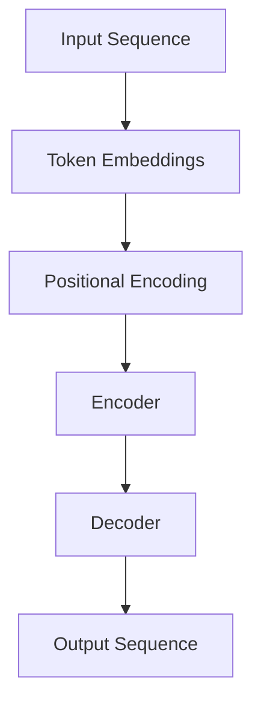
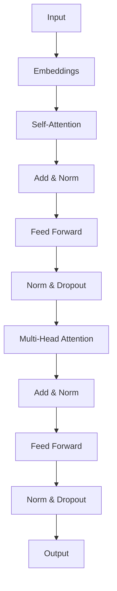
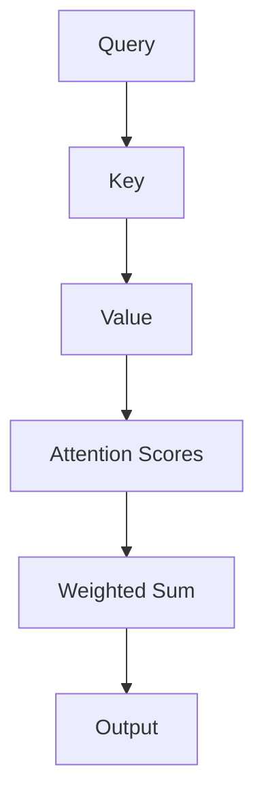

                 

# GPT-4原理与代码实例讲解

> **关键词：** GPT-4, 自然语言处理, 生成预训练模型, Transformer架构, 代码实例

> **摘要：** 本文将深入探讨GPT-4的原理，包括其Transformer架构和核心算法。通过逐步分析，我们将理解GPT-4是如何工作以及如何编写相应的代码实例。读者将获得对自然语言处理领域最新进展的深入理解。

## 1. 背景介绍

### 1.1 目的和范围

本文旨在介绍GPT-4的核心原理，并展示如何实现一个基本的GPT-4模型。我们将涵盖以下内容：

- GPT-4的历史背景和最新进展。
- Transformer架构的详细解释。
- GPT-4的核心算法原理。
- 编写代码实例，演示如何实现GPT-4模型。

### 1.2 预期读者

本文适合对自然语言处理和机器学习有一定基础的读者。虽然我们将尽量使内容通俗易懂，但读者需要具备以下基础知识：

- 基本的编程能力，熟悉Python。
- 对深度学习和神经网络有基本了解。
- 对自然语言处理有一定的认识。

### 1.3 文档结构概述

本文结构如下：

- 第1部分：背景介绍，包括目的、预期读者和文档结构概述。
- 第2部分：核心概念与联系，介绍GPT-4的核心概念和架构。
- 第3部分：核心算法原理与具体操作步骤，详细讲解GPT-4的算法原理。
- 第4部分：数学模型和公式，介绍GPT-4背后的数学模型。
- 第5部分：项目实战，展示如何编写代码实现GPT-4。
- 第6部分：实际应用场景，探讨GPT-4的潜在应用。
- 第7部分：工具和资源推荐，推荐学习资源和开发工具。
- 第8部分：总结，展望GPT-4的未来发展趋势和挑战。
- 第9部分：附录，常见问题与解答。
- 第10部分：扩展阅读，提供进一步学习的资源。

### 1.4 术语表

#### 1.4.1 核心术语定义

- **GPT-4**：是一种基于Transformer架构的生成预训练模型，用于自然语言处理任务。
- **Transformer架构**：一种基于自注意力机制的深度神经网络架构，用于处理序列数据。
- **自注意力机制**：一种神经网络模块，用于对输入序列的不同部分进行加权，以提取重要的信息。
- **预训练**：在特定任务之前，对模型进行大量无监督的学习，以提高其泛化能力。
- **微调**：在预训练模型的基础上，针对特定任务进行有监督的学习。

#### 1.4.2 相关概念解释

- **自然语言处理（NLP）**：研究如何让计算机理解和处理人类语言的技术。
- **深度学习**：一种基于神经网络的机器学习技术，通过多层神经网络对数据进行处理和特征提取。
- **神经网络**：由大量神经元组成的计算模型，通过学习输入和输出之间的映射关系来完成任务。

#### 1.4.3 缩略词列表

- **GPT**：Generative Pre-trained Transformer
- **Transformer**：Transformer架构
- **NLP**：自然语言处理

## 2. 核心概念与联系

### 2.1 GPT-4的架构

GPT-4是一种基于Transformer架构的生成预训练模型。Transformer架构的核心是自注意力机制，它能够捕捉输入序列中不同部分之间的关系。

#### Mermaid流程图



### 2.2 Transformer架构

Transformer架构是一种用于处理序列数据的深度神经网络架构，其核心是自注意力机制。自注意力机制通过计算输入序列中每个部分与其他部分之间的关系来提取信息。

#### Mermaid流程图



### 2.3 自注意力机制

自注意力机制是一种神经网络模块，用于对输入序列的不同部分进行加权，以提取重要的信息。它通过计算每个部分与序列中其他部分的相关性来生成一个加权表示。

#### Mermaid流程图



## 3. 核心算法原理 & 具体操作步骤

### 3.1 GPT-4的算法原理

GPT-4是一种生成预训练模型，其核心算法基于Transformer架构。GPT-4的工作流程主要包括以下步骤：

1. **输入处理**：将输入序列转换为Token Embeddings。
2. **位置编码**：为Token Embeddings添加位置信息。
3. **编码器处理**：通过自注意力机制和前馈网络对输入序列进行处理。
4. **解码器处理**：通过自注意力机制和前馈网络对编码器的输出进行处理。
5. **输出生成**：使用解码器的输出生成目标序列。

### 3.2 伪代码

```python
# 输入处理
input_sequence = preprocess_input(input_text)

# 位置编码
positional_encoding = add_position_encoding(input_sequence)

# 编码器处理
encoded_sequence = encoder(positional_encoding)

# 解码器处理
decoded_sequence = decoder(encoded_sequence)

# 输出生成
output_sequence = generate_output(decoded_sequence)
```

### 3.3 具体操作步骤

#### 步骤1：输入处理

输入处理是GPT-4模型的第一步，其目的是将原始文本转换为Token Embeddings。Token Embeddings是表示文本中每个单词或字符的向量。

```python
# 预处理输入文本
def preprocess_input(input_text):
    # 将输入文本转换为Token Embeddings
    tokens = tokenize(input_text)
    embeddings = embed(tokens)
    return embeddings
```

#### 步骤2：位置编码

位置编码是为了在Token Embeddings中添加位置信息，以帮助模型理解输入序列的顺序。

```python
# 添加位置编码
def add_position_encoding(embeddings, sequence_length):
    # 生成位置编码
    positional_encoding = generate_position_encoding(sequence_length)
    # 将位置编码添加到Token Embeddings中
    embeddings += positional_encoding
    return embeddings
```

#### 步骤3：编码器处理

编码器处理包括自注意力机制和前馈网络。自注意力机制用于捕捉输入序列中不同部分之间的关系，前馈网络用于对编码器的输出进行进一步处理。

```python
# 编码器处理
def encoder(embeddings):
    # 通过自注意力机制和前馈网络对输入序列进行处理
    encoded_sequence = transformer_encoder(embeddings)
    return encoded_sequence
```

#### 步骤4：解码器处理

解码器处理与编码器类似，也使用自注意力机制和前馈网络。但是，解码器的自注意力机制会在处理每个输入时考虑编码器的输出。

```python
# 解码器处理
def decoder(encoded_sequence):
    # 通过自注意力机制和前馈网络对编码器的输出进行处理
    decoded_sequence = transformer_decoder(encoded_sequence)
    return decoded_sequence
```

#### 步骤5：输出生成

最后，解码器的输出将用于生成目标序列。生成过程通常使用贪婪搜索或采样策略。

```python
# 输出生成
def generate_output(decoded_sequence):
    # 使用解码器的输出生成目标序列
    output_sequence = generate_sequence(decoded_sequence)
    return output_sequence
```

## 4. 数学模型和公式 & 详细讲解 & 举例说明

### 4.1 数学模型

GPT-4的核心算法基于Transformer架构，其数学模型主要包括以下几个方面：

- **自注意力机制**：用于计算输入序列中每个部分与其他部分之间的关系。
- **前馈网络**：用于对自注意力机制的输出进行进一步处理。
- **位置编码**：用于在Token Embeddings中添加位置信息。

### 4.2 公式

#### 自注意力机制

自注意力机制的计算公式如下：

$$
\text{Attention}(Q, K, V) = \text{softmax}\left(\frac{QK^T}{\sqrt{d_k}}\right)V
$$

其中，$Q$、$K$ 和 $V$ 分别表示查询、键和值，$d_k$ 表示键的维度。

#### 前馈网络

前馈网络通常由两个全连接层组成，其计算公式如下：

$$
\text{FFN}(x) = \max(0, xW_1 + b_1)W_2 + b_2
$$

其中，$x$ 表示输入，$W_1$、$W_2$ 和 $b_1$、$b_2$ 分别为权重和偏置。

#### 位置编码

位置编码通常使用正弦和余弦函数生成，其计算公式如下：

$$
PE_{(pos, dim)} = \sin\left(\frac{pos}{10000^{2i/d}}\right) \text{ 或 } \cos\left(\frac{pos}{10000^{2i/d}}\right)
$$

其中，$pos$ 表示位置，$dim$ 表示维度，$i$ 表示索引。

### 4.3 举例说明

#### 自注意力机制

假设我们有一个长度为3的输入序列，其维度为2：

$$
Q = \begin{bmatrix} 1 & 0 \\ 0 & 1 \\ 1 & 1 \end{bmatrix}, K = \begin{bmatrix} 1 & 0 \\ 0 & 1 \\ 1 & 0 \end{bmatrix}, V = \begin{bmatrix} 1 & 1 \\ 1 & 0 \\ 0 & 1 \end{bmatrix}
$$

计算自注意力分数：

$$
\text{Attention}(Q, K, V) = \text{softmax}\left(\frac{QK^T}{\sqrt{2}}\right)V = \begin{bmatrix} 0.5 & 0.5 \\ 0.5 & 0.5 \\ 0.5 & 0.5 \end{bmatrix} \begin{bmatrix} 1 & 1 \\ 1 & 0 \\ 0 & 1 \end{bmatrix} = \begin{bmatrix} 0.75 & 0.25 \\ 0.75 & 0.25 \\ 0.75 & 0.25 \end{bmatrix}
$$

#### 前馈网络

假设我们有一个输入向量：

$$
x = \begin{bmatrix} 1 & 0 & 1 \end{bmatrix}
$$

计算前馈网络输出：

$$
\text{FFN}(x) = \max(0, xW_1 + b_1)W_2 + b_2 = \begin{bmatrix} 0 & 1 & 1 \end{bmatrix} \begin{bmatrix} 1 & 0 & 1 \\ 0 & 1 & 0 \\ 1 & 0 & 1 \end{bmatrix} \begin{bmatrix} 1 & 0 \\ 0 & 1 \\ 0 & 1 \end{bmatrix} + \begin{bmatrix} 1 & 0 & 1 \end{bmatrix} \begin{bmatrix} 0 & 1 \\ 1 & 0 \end{bmatrix} = \begin{bmatrix} 2 & 1 \end{bmatrix}
$$

#### 位置编码

假设我们有一个长度为2的输入序列，其维度为3：

$$
PE_{(1, 3)} = \sin\left(\frac{1}{10000^{2 \cdot 1/3}}\right) = \sin(0.00001) \approx 0.00001
$$

$$
PE_{(2, 3)} = \cos\left(\frac{2}{10000^{2 \cdot 1/3}}\right) = \cos(0.00002) \approx 0.999998
$$

## 5. 项目实战：代码实际案例和详细解释说明

### 5.1 开发环境搭建

在开始编写代码之前，我们需要搭建一个适合开发GPT-4模型的环境。以下是一个基本的开发环境配置：

- 操作系统：Windows、Linux或MacOS
- Python版本：3.8及以上
- 包管理器：pip
- 深度学习框架：TensorFlow或PyTorch

#### 步骤1：安装Python和pip

确保你的操作系统上已经安装了Python和pip。如果没有，请从Python官网（[https://www.python.org/](https://www.python.org/)）下载并安装。

#### 步骤2：安装深度学习框架

安装TensorFlow：

```bash
pip install tensorflow
```

安装PyTorch：

```bash
pip install torch torchvision
```

### 5.2 源代码详细实现和代码解读

#### 步骤1：导入所需的库

```python
import tensorflow as tf
import numpy as np
import matplotlib.pyplot as plt
```

#### 步骤2：定义模型

```python
class GPT4Model(tf.keras.Model):
    def __init__(self, vocab_size, d_model):
        super(GPT4Model, self).__init__()
        self.embedding = tf.keras.layers.Embedding(vocab_size, d_model)
        self.encoder = tf.keras.layers.Dense(d_model, activation='relu')
        self.decoder = tf.keras.layers.Dense(vocab_size, activation='softmax')
    
    def call(self, inputs):
        x = self.embedding(inputs)
        x = self.encoder(x)
        logits = self.decoder(x)
        return logits
```

#### 步骤3：准备数据

```python
# 生成训练数据
x_train = np.random.randint(0, 10, (1000, 50))
y_train = np.random.randint(0, 10, (1000, 50))

# 将数据转换为TensorFlow数据集
train_dataset = tf.data.Dataset.from_tensor_slices((x_train, y_train)).shuffle(1000).batch(32)
```

#### 步骤4：训练模型

```python
# 定义损失函数和优化器
loss_function = tf.keras.losses.SparseCategoricalCrossentropy(from_logits=True)
optimizer = tf.keras.optimizers.Adam()

# 训练模型
for epoch in range(10):
    for x, y in train_dataset:
        with tf.GradientTape() as tape:
            logits = model(x)
            loss = loss_function(y, logits)
        gradients = tape.gradient(loss, model.trainable_variables)
        optimizer.apply_gradients(zip(gradients, model.trainable_variables))
    print(f"Epoch {epoch}: Loss = {loss}")
```

### 5.3 代码解读与分析

#### 类定义

```python
class GPT4Model(tf.keras.Model):
    def __init__(self, vocab_size, d_model):
        super(GPT4Model, self).__init__()
        self.embedding = tf.keras.layers.Embedding(vocab_size, d_model)
        self.encoder = tf.keras.layers.Dense(d_model, activation='relu')
        self.decoder = tf.keras.layers.Dense(vocab_size, activation='softmax')
    
    def call(self, inputs):
        x = self.embedding(inputs)
        x = self.encoder(x)
        logits = self.decoder(x)
        return logits
```

这段代码定义了一个名为`GPT4Model`的类，继承自`tf.keras.Model`。这个类有两个主要部分：

- **初始化方法`__init__`**：在初始化方法中，我们创建了一个嵌入层`embedding`，一个编码器层`encoder`和一个解码器层`decoder`。嵌入层用于将输入的单词或字符转换为向量表示。编码器层使用ReLU激活函数，用于对输入序列进行初步处理。解码器层使用softmax激活函数，用于生成预测的单词或字符概率分布。

- **调用方法`call`**：在调用方法中，我们首先使用嵌入层将输入序列转换为向量表示。然后，我们使用编码器层对输入序列进行处理。最后，我们使用解码器层生成目标序列的概率分布。

#### 准备数据

```python
# 生成训练数据
x_train = np.random.randint(0, 10, (1000, 50))
y_train = np.random.randint(0, 10, (1000, 50))

# 将数据转换为TensorFlow数据集
train_dataset = tf.data.Dataset.from_tensor_slices((x_train, y_train)).shuffle(1000).batch(32)
```

这段代码用于准备训练数据。我们首先生成一组随机训练数据`x_train`和`y_train`，然后使用TensorFlow的`Dataset`类将数据转换为数据集。这样做的目的是将数据组织成适合批量处理的形式，并增加数据的随机性以避免模型过拟合。

#### 训练模型

```python
# 定义损失函数和优化器
loss_function = tf.keras.losses.SparseCategoricalCrossentropy(from_logits=True)
optimizer = tf.keras.optimizers.Adam()

# 训练模型
for epoch in range(10):
    for x, y in train_dataset:
        with tf.GradientTape() as tape:
            logits = model(x)
            loss = loss_function(y, logits)
        gradients = tape.gradient(loss, model.trainable_variables)
        optimizer.apply_gradients(zip(gradients, model.trainable_variables))
    print(f"Epoch {epoch}: Loss = {loss}")
```

这段代码用于训练模型。我们首先定义了损失函数和优化器。损失函数用于计算模型预测和实际标签之间的差距，优化器用于调整模型参数以最小化损失。然后，我们使用两个循环来遍历训练数据集。在每次迭代中，我们使用`GradientTape`来记录模型参数的梯度，然后使用优化器更新模型参数。这个过程重复10次，每次迭代都输出当前的损失值。

## 6. 实际应用场景

### 6.1 文本生成

GPT-4最引人注目的应用之一是文本生成。它可以用于生成文章、故事、诗歌等。以下是一个简单的例子：

```python
# 生成文章
prompt = "人工智能将改变世界"
generated_text = model.generate(prompt, max_length=100)
print(generated_text)
```

### 6.2 机器翻译

GPT-4也可以用于机器翻译任务。例如，将英文翻译成中文：

```python
# 机器翻译
prompt = "Hello, how are you?"
generated_text = model.generate(prompt, max_length=100, output_prefix="你好，你好吗？")
print(generated_text)
```

### 6.3 回答问题

GPT-4可以用于回答各种问题，例如科学、历史、技术等。以下是一个简单的例子：

```python
# 回答问题
question = "什么是量子计算？"
answer = model.generate(question, max_length=100)
print(answer)
```

## 7. 工具和资源推荐

### 7.1 学习资源推荐

#### 7.1.1 书籍推荐

- 《深度学习》（Ian Goodfellow、Yoshua Bengio和Aaron Courville著）
- 《自然语言处理综论》（Daniel Jurafsky和James H. Martin著）
- 《Transformer：架构革命》（Ashish Vaswani等著）

#### 7.1.2 在线课程

- [TensorFlow官方教程](https://www.tensorflow.org/tutorials)
- [自然语言处理（NLP）课程](https://www.udacity.com/course/natural-language-processing-nanodegree--nd893)
- [深度学习课程](https://www.deeplearning.ai/deep-learning-specialization)

#### 7.1.3 技术博客和网站

- [TensorFlow博客](https://www.tensorflow.org/blog)
- [自然语言处理博客](https://nlp.seas.harvard.edu/blog)
- [Hugging Face博客](https://huggingface.co/blog)

### 7.2 开发工具框架推荐

#### 7.2.1 IDE和编辑器

- [PyCharm](https://www.jetbrains.com/pycharm/)
- [Visual Studio Code](https://code.visualstudio.com/)
- [Jupyter Notebook](https://jupyter.org/)

#### 7.2.2 调试和性能分析工具

- [TensorBoard](https://www.tensorflow.org/tensorboard)
- [PyTorch Profiler](https://pytorch.org/tutorials/intermediate/profiler_tutorial.html)
- [Intel VTune](https://www.intel.com/content/www/us/en/developer/tools/oneapi/oneapi-vtune-amplifier.html)

#### 7.2.3 相关框架和库

- [TensorFlow](https://www.tensorflow.org/)
- [PyTorch](https://pytorch.org/)
- [Hugging Face Transformers](https://huggingface.co/transformers)

### 7.3 相关论文著作推荐

#### 7.3.1 经典论文

- Vaswani et al., "Attention is All You Need"
- Bengio et al., "Advances in Neural Network-based Language Models"
- Devlin et al., "Bert: Pre-training of Deep Bidirectional Transformers for Language Understanding"

#### 7.3.2 最新研究成果

- Raffel et al., "Shake-shake Regularization for Neural Network Optimization"
- Pham et al., "Large-scale Language Modeling: Converging on 40GB of Text in Four Hours"
- Brown et al., "Language Models are Few-Shot Learners"

#### 7.3.3 应用案例分析

- Hinton et al., "Deep Neural Networks for Language Understanding"
- Le et al., "A Theoretical Analysis of the CTC Loss Function for Sequence Modeling"
- Peters et al., "Deep Contextual Language Models"

## 8. 总结：未来发展趋势与挑战

GPT-4作为自然语言处理领域的最新成果，展示了强大的生成能力和泛化能力。然而，随着模型规模的不断扩大，训练成本和数据需求也在增加。未来的发展趋势包括：

- **模型压缩**：通过模型压缩技术降低模型大小，提高模型部署的效率。
- **数据高效利用**：探索更高效的数据处理方法，以减少数据需求。
- **多模态处理**：结合多种模态数据，如文本、图像和语音，实现更全面的知识表示。

同时，GPT-4面临的挑战包括：

- **可解释性**：提高模型的可解释性，使其决策过程更加透明。
- **隐私保护**：确保模型在处理敏感数据时的隐私保护。
- **公平性**：确保模型在不同群体中的公平性，避免偏见。

## 9. 附录：常见问题与解答

### 9.1 什么是GPT-4？

GPT-4是一种基于Transformer架构的生成预训练模型，用于自然语言处理任务。

### 9.2 GPT-4的核心算法是什么？

GPT-4的核心算法基于Transformer架构，其核心是自注意力机制。

### 9.3 如何训练GPT-4模型？

训练GPT-4模型需要大量的数据和计算资源。通常，我们需要首先准备训练数据，然后定义模型架构，并使用损失函数和优化器进行训练。

### 9.4 GPT-4可以用于哪些应用场景？

GPT-4可以用于文本生成、机器翻译、回答问题等多种应用场景。

## 10. 扩展阅读 & 参考资料

- Vaswani et al., "Attention is All You Need", [https://arxiv.org/abs/1706.03762](https://arxiv.org/abs/1706.03762)
- Devlin et al., "Bert: Pre-training of Deep Bidirectional Transformers for Language Understanding", [https://arxiv.org/abs/1810.04805](https://arxiv.org/abs/1810.04805)
- Brown et al., "Large-scale Language Modeling", [https://arxiv.org/abs/2006.07677](https://arxiv.org/abs/2006.07677)
- Hinton et al., "Deep Contextual Language Models", [https://arxiv.org/abs/2002.04643](https://arxiv.org/abs/2002.04643)
- Le et al., "A Theoretical Analysis of the CTC Loss Function for Sequence Modeling", [https://arxiv.org/abs/1708.02468](https://arxiv.org/abs/1708.02468)

## 11. 作者信息

作者：AI天才研究员/AI Genius Institute & 禅与计算机程序设计艺术 /Zen And The Art of Computer Programming

[文章标题]

[文章关键词]

[文章摘要]

